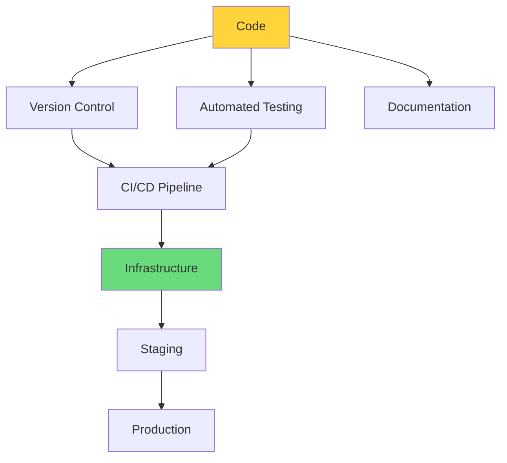
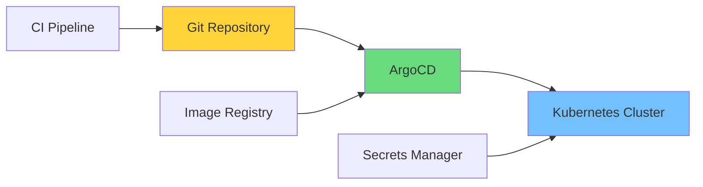

# Clase 23: Company-in-a-Box - Arquitectura

## Duración
**4 horas** (240 minutos)

---

## Objetivos de Aprendizaje

Al finalizar esta clase, el estudiante será capaz de:

1. Diseñar arquitecturas Infrastructure as Code (IaC) para sistemas de agentes
2. Crear Helm charts para deployment de agentes en Kubernetes
3. Implementar GitOps workflows para gestión de configuración
4. Implementar secrets management con HashiCorp Vault
5. Diseñar pipelines de CI/CD para agentes
6. Configurar monitoring y observabilidad

---

## 1. Infrastructure as Code (IaC)

### 1.1 Conceptos de IaC



### 1.2 Terraform para Infraestructura de Agentes

```hcl
# main.tf - Configuración principal de Terraform

terraform {
  required_version = ">= 1.5.0"
  
  required_providers {
    aws = {
      source  = "hashicorp/aws"
      version = "~> 5.0"
    }
    kubernetes = {
      source  = "hashicorp/kubernetes"
      version = "~> 2.23"
    }
    helm = {
      source  = "hashicorp/helm"
      version = "~> 2.12"
    }
  }
  
  backend "s3" {
    bucket = "agent-infra-state"
    key    = "prod/terraform.tfstate"
    region = "us-east-1"
  }
}

provider "aws" {
  region = var.aws_region
}

provider "kubernetes" {
  config_path = "~/.kube/config"
}

provider "helm" {
  kubernetes {
    config_path = "~/.kube/config"
  }
}

# Variables
variable "aws_region" {
  description = "AWS region"
  type        = string
  default     = "us-east-1"
}

variable "environment" {
  description = "Environment name"
  type        = string
  default     = "production"
}

variable "agent_count" {
  description = "Number of agent replicas"
  type        = map(number)
  default = {
    coder    = 5
    reviewer  = 3
    tester    = 2
    planner   = 2
  }
}
```

```hcl
# vpc.tf - Red virtual

resource "aws_vpc" "main" {
  cidr_block           = var.vpc_cidr
  enable_dns_hostnames = true
  enable_dns_support   = true
  
  tags = {
    Name        = "agent-vpc-${var.environment}"
    Environment = var.environment
  }
}

resource "aws_subnet" "private" {
  count             = 3
  
  vpc_id            = aws_vpc.main.id
  cidr_block        = cidrsubnet(var.vpc_cidr, 4, count.index)
  availability_zone = data.aws_availability_zones.available.names[count.index]
  
  tags = {
    Name        = "agent-subnet-private-${count.index}"
    Environment = var.environment
  }
}

resource "aws_subnet" "public" {
  count             = 3
  
  vpc_id            = aws_vpc.main.id
  cidr_block        = cidrsubnet(var.vpc_cidr, 4, count.index + 10)
  availability_zone = data.aws_availability_zones.available.names[count.index]
  
  tags = {
    Name        = "agent-subnet-public-${count.index}"
    Environment = var.environment
  }
}

resource "aws_nat_gateway" "main" {
  count         = 2
  connectivity_type = "public"
  
  subnet_id = aws_subnet.public[count.index].id
  
  tags = {
    Name = "agent-nat-${count.index}"
  }
  
  depends_on = [aws_eip.nat_eip]
}

resource "aws_eip" "nat_eip" {
  count  = 2
  domain = "vpc"
  
  tags = {
    Name = "agent-nat-eip-${count.index}"
  }
}

resource "aws_route_table" "private" {
  count  = 3
  vpc_id = aws_vpc.main.id
  
  route {
    cidr_block = "0.0.0.0/0"
    gateway_id = aws_nat_gateway.main[count.index].id
  }
  
  tags = {
    Name = "agent-rt-private-${count.index}"
  }
}

resource "aws_route_table_association" "private" {
  count          = 3
  subnet_id      = aws_subnet.private[count.index].id
  route_table_id = aws_route_table.private[count.index].id
}
```

```hcl
# eks.tf - Amazon EKS Cluster

resource "aws_eks_cluster" "main" {
  name     = "agent-cluster-${var.environment}"
  role_arn = aws_iam_role.eks_cluster.arn
  version  = "1.28"
  
  vpc_config {
    subnet_ids              = concat(aws_subnet.private[*].id, aws_subnet.public[*].id)
    endpoint_private_access = true
    endpoint_public_access  = true
    public_access_cidrs    = ["0.0.0.0/0"]
  }
  
  depends_on = [
    aws_iam_role_policy_attachment.eks_cluster_policy,
    aws_iam_role_policy_attachment.eks_service_policy
  ]
  
  tags = {
    Environment = var.environment
  }
}

resource "aws_iam_role" "eks_cluster" {
  name = "agent-eks-cluster-role"
  
  assume_role_policy = jsonencode({
    Version = "2012-10-17"
    Statement = [{
      Action = "sts:AssumeRole"
      Effect = "Allow"
      Principal = {
        Service = "eks.amazonaws.com"
      }
    }]
  })
}

resource "aws_iam_role_policy_attachment" "eks_cluster_policy" {
  policy_arn = "arn:aws:iam::aws:policy/AmazonEKSClusterPolicy"
  role       = aws_iam_role.eks_cluster.name
}

resource "aws_iam_role_policy_attachment" "eks_service_policy" {
  policy_arn = "arn:aws:iam::aws:policy/AmazonEKSServicePolicy"
  role       = aws_iam_role.eks_cluster.name
}

# Node Groups
resource "aws_eks_node_group" "agents" {
  for_each = var.agent_count
  
  cluster_name    = aws_eks_cluster.main.name
  node_group_name = "agent-${each.key}"
  node_role_arn   = aws_iam_role.nodes.arn
  subnet_ids      = aws_subnet.private[*].id
  
  scaling_config {
    desired_size = each.value
    max_size     = each.value * 2
    min_size     = 1
  }
  
  instance_types = ["m6i.xlarge"]
  
  depends_on = [
    aws_iam_role_policy_attachment.worker_node_policy,
    aws_iam_role_policy_attachment.worker_node_cni_policy,
    aws_iam_role_policy_attachment.worker_node_container_registry_policy
  ]
  
  tags = {
    Environment = var.environment
    AgentType   = each.key
  }
}

resource "aws_iam_role" "nodes" {
  name = "agent-eks-node-role"
  
  assume_role_policy = jsonencode({
    Version = "2012-10-17"
    Statement = [{
      Action = "sts:AssumeRole"
      Effect = "Allow"
      Principal = {
        Service = "ec2.amazonaws.com"
      }
    }]
  })
}
```

```hcl
# rds.tf - PostgreSQL para estado de agentes

resource "aws_db_subnet_group" "agent_db" {
  name       = "agent-db-subnet-group"
  subnet_ids = aws_subnet.private[*].id
  
  tags = {
    Name = "agent-db-subnet"
  }
}

resource "aws_security_group" "rds" {
  name        = "agent-rds-sg"
  description = "Security group for agent RDS"
  vpc_id      = aws_vpc.main.id
  
  ingress {
    from_port   = 5432
    to_port     = 5432
    protocol    = "tcp"
    cidr_blocks = [aws_vpc.main.cidr_block]
  }
  
  egress {
    from_port   = 0
    to_port     = 0
    protocol    = "-1"
    cidr_blocks = ["0.0.0.0/0"]
  }
  
  tags = {
    Name = "agent-rds-sg"
  }
}

resource "aws_db_instance" "agent_db" {
  identifier           = "agent-db-${var.environment}"
  engine              = "postgres"
  engine_version      = "15.4"
  instance_class      = "db.r6g.large"
  allocated_storage    = 100
  max_allocated_storage = 500
  
  db_name  = "agentdb"
  username = var.db_username
  password = var.db_password
  
  db_subnet_group_name   = aws_db_subnet_group.agent_db.name
  vpc_security_group_ids = [aws_security_group.rds.id]
  
  backup_retention_period = 7
  backup_window           = "03:00-04:00"
  maintenance_window      = "mon:04:00-mon:05:00"
  
  storage_encrypted     = true
  storage_type          = "gp3"
  
  enabled_cloudwatch_logs_exports = ["postgresql", "upgrade"]
  
  tags = {
    Name        = "agent-db-${var.environment}"
    Environment = var.environment
  }
}
```

### 1.3 Outputs y Módulos

```hcl
# outputs.tf

output "eks_cluster_endpoint" {
  description = "EKS Cluster endpoint"
  value       = aws_eks_cluster.main.endpoint
}

output "eks_cluster_name" {
  description = "EKS Cluster name"
  value       = aws_eks_cluster.main.name
}

output "db_endpoint" {
  description = "RDS endpoint"
  value       = aws_db_instance.agent_db.endpoint
}

output "vpc_id" {
  description = "VPC ID"
  value       = aws_vpc.main.id
}

output "node_groups" {
  description = "Node group information"
  value = {
    for key, ng in aws_eks_node_group.agents : key => {
      name = ng.node_group_name
      arn  = ng.arn
    }
  }
}
```

---

## 2. Helm Charts para Agentes

### 2.1 Estructura del Chart

```yaml
# Chart.yaml
apiVersion: v2
name: agent-system
description: A Helm chart for deploying multi-agent systems
type: application
version: 1.0.0
appVersion: "1.0.0"

keywords:
  - agents
  - ai
  - autonomous

maintainers:
  - name: Agent Team
    email: team@example.com
```

```yaml
# values.yaml - Valores por defecto

replicaCount: 1

image:
  repository: agent-registry/agent-system
  pullPolicy: IfNotPresent
  tag: "latest"

imagePullSecrets: []
nameOverride: ""
fullnameOverride: ""

serviceAccount:
  create: true
  annotations: {}
  name: ""

podAnnotations: {}
podLabels: {}

podSecurityContext:
  runAsNonRoot: true
  runAsUser: 1000
  fsGroup: 1000

securityContext:
  capabilities:
    drop:
    - ALL
  readOnlyRootFilesystem: true
  allowPrivilegeEscalation: false

service:
  type: ClusterIP
  port: 80

ingress:
  enabled: true
  className: "nginx"
  annotations:
    cert-manager.io/cluster-issuer: "letsencrypt-prod"
    nginx.ingress.kubernetes.io/ssl-redirect: "true"
  hosts:
    - host: agents.example.com
      paths:
        - path: /
          pathType: Prefix
  tls:
    - secretName: agents-tls
      hosts:
        - agents.example.com

resources:
  limits:
    cpu: 1000m
    memory: 1Gi
  requests:
    cpu: 250m
    memory: 256Mi

autoscaling:
  enabled: true
  minReplicas: 2
  maxReplicas: 10
  targetCPUUtilizationPercentage: 70
  targetMemoryUtilizationPercentage: 80

nodeSelector: {}

tolerations: []

affinity:
  podAntiAffinity:
    preferredDuringSchedulingIgnoredDuringExecution:
      - weight: 100
        podAffinityTerm:
          labelSelector:
            matchExpressions:
              - key: app
                operator: In
                values:
                  - agent
          topologyKey: kubernetes.io/hostname

# Configuración de agentes
agents:
  enabled: true
  
  # Agente Coder
  coder:
    enabled: true
    replicas: 3
    config:
      maxConcurrentTasks: 5
      timeoutSeconds: 300
    resources:
      limits:
        cpu: "1"
        memory: "2Gi"
      requests:
        cpu: "500m"
        memory: "1Gi"
  
  # Agente Reviewer
  reviewer:
    enabled: true
    replicas: 2
    config:
      maxConcurrentTasks: 3
      timeoutSeconds: 180
    resources:
      limits:
        cpu: "1"
        memory: "1Gi"
      requests:
        cpu: "250m"
        memory: "512Mi"
  
  # Agente Tester
  tester:
    enabled: true
    replicas: 2
    config:
      maxConcurrentTasks: 5
      timeoutSeconds: 120
    resources:
      limits:
        cpu: "500m"
        memory: "512Mi"
      requests:
        cpu: "100m"
        memory: "256Mi"

# Redis
redis:
  enabled: true
  architecture: replication
  auth:
    enabled: true
    password: ""
  master:
    persistence:
      enabled: true
      size: 10Gi
    resources:
      limits:
        cpu: "500m"
        memory: "256Mi"
  replica:
    replicaCount: 2
    resources:
      limits:
        cpu: "250m"
        memory: "128Mi"

# PostgreSQL
postgresql:
  enabled: true
  auth:
    database: agentdb
    username: agentuser
    password: ""
  primary:
    persistence:
      enabled: true
      size: 50Gi
    resources:
      limits:
        cpu: "1000m"
        memory: "1Gi"

# Monitoring
prometheus:
  enabled: true
  server:
    retention: 15d
  pushgateway:
    enabled: true

grafana:
  enabled: true
  adminPassword: ""
  persistence:
    enabled: true
    size: 10Gi

# Logging
loki:
  enabled: true
  persistence:
    enabled: true
    size: 20Gi

# Secrets management
vault:
  enabled: true
  server:
    dev:
      enabled: true
```

### 2.2 Templates de Deployment

```yaml
# templates/_helpers.tpl
{{/*
Expand the name of the chart.
*/}}
{{- define "agent-system.name" -}}
{{- default .Chart.Name .Values.nameOverride | trunc 63 | trimSuffix "-" }}
{{- end }}

{{/*
Create a default fully qualified app name.
*/}}
{{- define "agent-system.fullname" -}}
{{- if .Values.fullnameOverride }}
{{- .Values.fullnameOverride | trunc 63 | trimSuffix "-" }}
{{- else }}
{{- $name := default .Chart.Name .Values.nameOverride }}
{{- if contains $name .Release.Name }}
{{- .Release.Name | trunc 63 | trimSuffix "-" }}
{{- else }}
{{- printf "%s-%s" .Release.Name $name | trunc 63 | trimSuffix "-" }}
{{- end }}
{{- end }}
{{- end }}

{{/*
Create chart name and version as used by the chart label.
*/}}
{{- define "agent-system.chart" -}}
{{- printf "%s-%s" .Chart.Name .Chart.Version | replace "+" "_" | trunc 63 | trimSuffix "-" }}
{{- end }}

{{/*
Common labels
*/}}
{{- define "agent-system.labels" -}}
helm.sh/chart: {{ include "agent-system.chart" . }}
{{ include "agent-system.selectorLabels" . }}
{{- if .Chart.AppVersion }}
app.kubernetes.io/version: {{ .Chart.AppVersion | quote }}
{{- end }}
app.kubernetes.io/managed-by: {{ .Release.Service }}
{{- end }}

{{/*
Selector labels
*/}}
{{- define "agent-system.selectorLabels" -}}
app.kubernetes.io/name: {{ include "agent-system.name" . }}
app.kubernetes.io/instance: {{ .Release.Name }}
{{- end }}

{{/*
Create the name of the service account to use
*/}}
{{- define "agent-system.serviceAccountName" -}}
{{- if .Values.serviceAccount.create }}
{{- default (include "agent-system.fullname" .) .Values.serviceAccount.name }}
{{- else }}
{{- default "default" .Values.serviceAccount.name }}
{{- end }}
{{- end }}
```

```yaml
# templates/deployment-agents.yaml
{{- range $name, $config := .Values.agents }}
{{- if $config.enabled }}
apiVersion: apps/v1
kind: Deployment
metadata:
  name: {{ include "agent-system.fullname" $ }}-{{ $name }}
  labels:
    {{- include "agent-system.labels" $ | nindent 4 }}
    agent-type: {{ $name }}
spec:
  replicas: {{ $config.replicas }}
  selector:
    matchLabels:
      {{- include "agent-system.selectorLabels" $ | nindent 6 }}
      agent-type: {{ $name }}
  template:
    metadata:
      annotations:
        prometheus.io/scrape: "true"
        prometheus.io/port: "8080"
        prometheus.io/path: "/metrics"
      labels:
        {{- include "agent-system.selectorLabels" $ | nindent 8 }}
        agent-type: {{ $name }}
    spec:
      serviceAccountName: {{ include "agent-system.serviceAccountName" $ }}
      securityContext:
        {{- toYaml $.Values.podSecurityContext | nindent 8 }}
      containers:
      - name: agent
        image: "{{ $.Values.image.repository }}/{{ $name }}:{{ $.Values.image.tag }}"
        imagePullPolicy: {{ $.Values.image.pullPolicy }}
        ports:
        - name: http
          containerPort: 8080
          protocol: TCP
        - name: grpc
          containerPort: 9090
          protocol: TCP
        
        env:
        - name: AGENT_TYPE
          value: {{ $name }}
        - name: AGENT_CONFIG_MAX_CONCURRENT_TASKS
          value: {{ $config.config.maxConcurrentTasks | quote }}
        - name: AGENT_CONFIG_TIMEOUT_SECONDS
          value: {{ $config.config.timeoutSeconds | quote }}
        - name: REDIS_HOST
          value: {{ include "agent-system.fullname" $ }}-redis-master
        - name: REDIS_PORT
          value: "6379"
        - name: POSTGRES_HOST
          value: {{ include "agent-system.fullname" $ }}-postgresql
        - name: POSTGRES_DB
          value: {{ $.Values.postgresql.auth.database }}
        - name: POSTGRES_USER
          value: {{ $.Values.postgresql.auth.username }}
        - name: POSTGRES_PASSWORD
          valueFrom:
            secretKeyRef:
              name: {{ include "agent-system.fullname" $ }}-postgresql
              key: postgres-password
        
        livenessProbe:
          httpGet:
            path: /health
            port: http
          initialDelaySeconds: 30
          periodSeconds: 10
          timeoutSeconds: 5
          failureThreshold: 3
        
        readinessProbe:
          httpGet:
            path: /ready
            port: http
          initialDelaySeconds: 5
          periodSeconds: 5
          timeoutSeconds: 3
          failureThreshold: 3
        
        resources:
          {{- toYaml $config.resources | nindent 10 }}
        
        securityContext:
          {{- toYaml $.Values.securityContext | nindent 12 }}
        
        volumeMounts:
        - name: tmp
          mountPath: /tmp
        - name: cache
          mountPath: /app/cache
      
      volumes:
      - name: tmp
        emptyDir: {}
      - name: cache
        emptyDir:
          sizeLimit: 500Mi
      
      {{- with $.Values.nodeSelector }}
      nodeSelector:
        {{- toYaml . | nindent 8 }}
      {{- end }}
      {{- with $.Values.affinity }}
      affinity:
        {{- toYaml . | nindent 8 }}
      {{- end }}
      {{- with $.Values.tolerations }}
      tolerations:
        {{- toYaml . | nindent 8 }}
      {{- end }}
---
apiVersion: v1
kind: Service
metadata:
  name: {{ include "agent-system.fullname" $ }}-{{ $name }}
  labels:
    {{- include "agent-system.labels" $ | nindent 4 }}
spec:
  type: {{ $.Values.service.type }}
  ports:
  - port: 80
    targetPort: http
    protocol: TCP
    name: http
  - port: 9090
    targetPort: grpc
    protocol: TCP
    name: grpc
  selector:
    {{- include "agent-system.selectorLabels" $ | nindent 4 }}
    agent-type: {{ $name }}
---
{{- end }}
{{- end }}
```

### 2.3 Horizontal Pod Autoscaler

```yaml
# templates/hpa.yaml
{{- range $name, $config := .Values.agents }}
{{- if and $config.enabled $.Values.autoscaling.enabled }}
apiVersion: autoscaling/v2
kind: HorizontalPodAutoscaler
metadata:
  name: {{ include "agent-system.fullname" $ }}-{{ $name }}-hpa
  labels:
    {{- include "agent-system.labels" $ | nindent 4 }}
spec:
  scaleTargetRef:
    apiVersion: apps/v1
    kind: Deployment
    name: {{ include "agent-system.fullname" $ }}-{{ $name }}
  minReplicas: {{ max 1 ($config.replicas | int) }}
  maxReplicas: {{ mul $config.replicas 3 }}
  metrics:
  - type: Resource
    resource:
      name: cpu
      target:
        type: Utilization
        averageUtilization: {{ $.Values.autoscaling.targetCPUUtilizationPercentage }}
  - type: Resource
    resource:
      name: memory
      target:
        type: Utilization
        averageUtilization: {{ $.Values.autoscaling.targetMemoryUtilizationPercentage }}
  behavior:
    scaleDown:
      stabilizationWindowSeconds: 300
      policies:
      - type: Percent
        value: 10
        periodSeconds: 60
    scaleUp:
      stabilizationWindowSeconds: 0
      policies:
      - type: Percent
        value: 100
        periodSeconds: 15
      - type: Pods
        value: 4
        periodSeconds: 15
      selectPolicy: Max
{{- end }}
{{- end }}
```

---

## 3. GitOps Workflows

### 3.1 Arquitectura GitOps



### 3.2 Configuración de ArgoCD

```yaml
# argocd-application.yaml
apiVersion: argoproj.io/v1alpha1
kind: Application
metadata:
  name: agent-system
  namespace: argocd
  finalizers:
    - resources-finalizer.argocd.argoproj.io
spec:
  project: default
  source:
    repoURL: https://github.com/org/agent-system
    targetRevision: main
    path: deploy/helm/agent-system
    helm:
      valueFiles:
        - values.yaml
        - values-prod.yaml
      parameters:
        - name: image.tag
          value: latest
        - name: agents.coder.replicas
          value: "5"
  destination:
    server: https://kubernetes.default.svc
    namespace: agent-system
  syncPolicy:
    automated:
      prune: true
      selfHeal: true
      allowEmpty: false
    syncOptions:
    - CreateNamespace=true
    - PruneLast=true
    retry:
      limit: 5
      backoff:
        duration: 5s
        factor: 2
        maxDuration: 3m
    ignoreDifferences:
    - group: apps
      kind: Deployment
      jsonPointers:
      - /spec/replicas
```

```yaml
# argocd-apps.yaml - Multi-cluster
apiVersion: argoproj.io/v1alpha1
kind: ApplicationSet
metadata:
  name: agent-system-multicluster
  namespace: argocd
spec:
  generators:
  - clusters:
      values:
        environment: "{{name}}"
    template:
      metadata:
        name: agent-system-{{name}}
      spec:
        project: default
        source:
          repoURL: https://github.com/org/agent-system
          targetRevision: main
          path: deploy/helm/agent-system
          helm:
            valueFiles:
            - values.yaml
            - values-{{name}}.yaml
        destination:
          server: "{{server}}"
          namespace: agent-system
        syncPolicy:
          automated:
            prune: true
            selfHeal: true
  template:
    spec:
      project: default
      source:
        repoURL: https://github.com/org/agent-system
        targetRevision: main
        path: deploy/helm/agent-system
      destination:
        server: "{{server}}"
        namespace: agent-system
```

### 3.3 GitHub Actions para CI/CD

```yaml
# .github/workflows/ci.yaml
name: CI

on:
  push:
    branches: [main, develop]
  pull_request:
    branches: [main]

env:
  REGISTRY: ghcr.io
  IMAGE_NAME: ${{ github.repository }}

jobs:
  lint:
    name: Lint
    runs-on: ubuntu-latest
    steps:
    - uses: actions/checkout@v4
    
    - name: Set up Python
      uses: actions/setup-python@v5
      with:
        python-version: '3.11'
    
    - name: Install dependencies
      run: |
        pip install helmfile hadolint yamllint
    
    - name: Lint Helm charts
      run: |
        helm lint deploy/helm/agent-system
    
    - name: Lint YAML
      run: |
        yamllint deploy/
    
    - name: Check Dockerfile
      run: |
        hadolint agents/**/Dockerfile

  test:
    name: Test
    runs-on: ubuntu-latest
    steps:
    - uses: actions/checkout@v4
    
    - name: Set up Python
      uses: actions/setup-python@v5
      with:
        python-version: '3.11'
    
    - name: Install dependencies
      run: |
        pip install pytest pytest-cov
    
    - name: Run tests
      run: |
        pytest tests/ --cov=agents
    
    - name: Upload coverage
      uses: codecov/codecov-action@v3
      with:
        files: ./coverage.xml

  build:
    name: Build
    needs: [lint, test]
    runs-on: ubuntu-latest
    outputs:
      image-tag: ${{ steps.meta.outputs.tags }}
    steps:
    - uses: actions/checkout@v4
    
    - name: Set up Docker Buildx
      uses: docker/setup-buildx-action@v3
    
    - name: Log in to Container Registry
      uses: docker/login-action@v3
      with:
        registry: ${{ env.REGISTRY }}
        username: ${{ github.actor }}
        password: ${{ secrets.GITHUB_TOKEN }}
    
    - name: Extract metadata
      id: meta
      uses: docker/metadata-action@v5
      with:
        images: ${{ env.REGISTRY }}/${{ env.IMAGE_NAME }}
        tags: |
          type=sha,prefix=
          type=ref,event=branch
          type=semver,pattern={{version}}
    
    - name: Build and push agent images
      uses: docker/build-push-action@v5
      with:
        context: ./agents
        push: true
        tags: ${{ steps.meta.outputs.tags }}
        cache-from: type=gha
        cache-to: type=gha,mode=max

  deploy-staging:
    name: Deploy to Staging
    needs: build
    runs-on: ubuntu-latest
    environment: staging
    steps:
    - uses: actions/checkout@v4
    
    - name: Download Helm values
      run: |
        curl -sL https://github.com/helmfile/helmfile/releases/latest/download/helmfile_linux_amd64 -o /usr/local/bin/helmfile
        chmod +x /usr/local/bin/helmfile
    
    - name: Configure kubectl
      run: |
        echo "${{ secrets.KUBE_CONFIG_STAGING }}" | base64 -d > ~/.kube/config
    
    - name: Deploy with Helmfile
      env:
        IMAGE_TAG: ${{ github.sha }}
      run: |
        helmfile -e staging apply
    
    - name: Notify ArgoCD
      run: |
        argocd app sync agent-system-staging
```

```yaml
# .github/workflows/cd.yaml
name: CD

on:
  push:
    tags:
      - 'v*'

env:
  REGISTRY: ghcr.io
  IMAGE_NAME: ${{ github.repository }}

jobs:
  deploy-production:
    name: Deploy to Production
    runs-on: ubuntu-latest
    environment: production
    steps:
    - uses: actions/checkout@v4
    
    - name: Configure kubectl
      run: |
        echo "${{ secrets.KUBE_CONFIG_PRODUCTION }}" | base64 -d > ~/.kube/config
    
    - name: Get version
      id: version
      run: |
        VERSION=${GITHUB_REF#refs/tags/v}
        echo "version=$VERSION" >> $GITHUB_OUTPUT
    
    - name: Update image tag in values
      run: |
        sed -i 's/tag:.*/tag: "${{ steps.version.outputs.version }}"/' deploy/helm/agent-system/values-prod.yaml
    
    - name: Commit changes
      uses: EndBug/add-and-commit@v9
      with:
        message: "Bump version to ${{ steps.version.outputs.version }}"
    
    - name: ArgoCD sync
      uses: lubbo/argocd-sync-action@v1
      with:
        ArgoCD server: ${{ secrets.ARGOCD_SERVER }}
        ArgoCD token: ${{ secrets.ARGOCD_TOKEN }}
        Application: agent-system
        Flags: --timeout 600
```

---

## 4. Secrets Management

### 4.1 HashiCorp Vault Integration

```yaml
# vault-config.yaml
apiVersion: v1
kind: Secret
metadata:
  name: vault-config
type: Opaque
stringData:
  vault.hcl: |
    ui = true
    
    listener "tcp" {
      tls_disable = 1
      address = "[::]:8200"
      cluster_address = "[::]:8201"
    }
    
    storage "raft" {
      path = "/vault/data"
      node_id = "vault-0"
    }
    
    service_registration "kubernetes" {}
    
    telemetry {
      prometheus_retention_time = "30s"
      disable_hostname = true
    }
```

```yaml
# vault-agent-annotations.yaml
# Para inyección automática de secrets
apiVersion: v1
kind: Deployment
metadata:
  name: agent-coder
spec:
  template:
    metadata:
      annotations:
        vault.hashicorp.com/agent-inject: "true"
        vault.hashicorp.com/role: "agent-coder"
        vault.hashicorp.com/agent-inject-secret-db: "database/creds/agent-coder"
        vault.hashicorp.com/agent-inject-template-db: |
          {{- with secret "database/creds/agent-coder" -}}
          export POSTGRES_USER={{ .Data.username }}
          export POSTGRES_PASSWORD={{ .Data.password }}
          {{- end }}
        vault.hashicorp.com/agent-inject-secret-redis: "kv/agent-coder/redis"
        vault.hashicorp.com/agent-inject-template-redis: |
          {{- with secret "kv/agent-coder/redis" -}}
          export REDIS_PASSWORD={{ .Data.password }}
          {{- end }}
```

```python
# vault_client.py - Cliente Python para Vault
import hvac
import os
from typing import Dict, Any, Optional

class VaultClient:
    """
    Cliente para interactuar con HashiCorp Vault.
    """
    
    def __init__(self, url: str = None, token: str = None):
        self.url = url or os.getenv("VAULT_ADDR", "http://vault:8200")
        self.token = token or os.getenv("VAULT_TOKEN")
        self.client = hvac.Client(url=self.url, token=self.token)
    
    def is_initialized(self) -> bool:
        """Verifica si Vault está inicializado."""
        return self.client.sys.is_initialized()
    
    def is_sealed(self) -> bool:
        """Verifica si Vault está sellado."""
        return self.client.sys.is_sealed()
    
    # Secretes KV
    def write_secret(self, path: str, secret: Dict[str, Any]):
        """Escribe un secret."""
        self.client.secrets.kv.v2.create_or_update_secret(
            path=path,
            secret=secret
        )
    
    def read_secret(self, path: str) -> Optional[Dict[str, Any]]:
        """Lee un secret."""
        try:
            response = self.client.secrets.kv.v2.read_secret_version(path=path)
            return response["data"]["data"]
        except hvac.exceptions.VaultNotInitialized:
            return None
        except hvac.exceptions.InvalidPath:
            return None
    
    def delete_secret(self, path: str):
        """Elimina un secret."""
        self.client.secrets.kv.v2.delete_metadata_and_all_versions(path=path)
    
    # Database secrets
    def generate_db_credentials(self, role: str) -> Dict[str, str]:
        """Genera credenciales dinámicas de base de datos."""
        response = self.client.secrets.database.generate_credentials(name=role)
        return {
            "username": response["data"]["username"],
            "password": response["data"]["password"]
        }
    
    # Policy management
    def create_policy(self, name: str, policy: str):
        """Crea una política."""
        self.client.sys.create_or_update_policy(
            name=name,
            policy=policy
        )
    
    # Token management
    def create_token(self, policies: list, ttl: str = "1h") -> str:
        """Crea un token con políticas específicas."""
        response = self.client.auth.token.create(
            policies=policies,
            ttl=ttl
        )
        return response["auth"]["client_token"]
    
    # Agent configuration
    def configure_kubernetes_auth(self, role_name: str, service_account_name: str,
                                   policies: list):
        """Configura autenticación Kubernetes."""
        
        # Habilitar auth method
        self.client.sys.enable_auth_method("kubernetes")
        
        # Configurar role
        self.client.auth.kubernetes.create_role(
            name=role_name,
            policies=policies,
            service_account_name=service_account_name,
            audience="vault",
            ttl="1h"
        )
```

### 4.2 External Secrets Operator

```yaml
# external-secret.yaml
apiVersion: external-secrets.io/v1beta1
kind: ExternalSecret
metadata:
  name: agent-secrets
  namespace: agent-system
spec:
  refreshInterval: 1h
  secretStoreRef:
    name: vault-backend
    kind: ClusterSecretStore
  target:
    name: agent-secrets
    creationPolicy: Owner
  data:
  - secretKey: database-url
    remoteRef:
      key: database/config
      property: url
  - secretKey: redis-password
    remoteRef:
      key: redis/config
      property: password
  - secretKey: openai-api-key
    remoteRef:
      key: external-apis/openai
      property: api_key
```

```yaml
# cluster-secret-store.yaml
apiVersion: external-secrets.io/v1beta1
kind: ClusterSecretStore
metadata:
  name: vault-backend
spec:
  provider:
    vault:
      server: "https://vault:8200"
      path: "secret"
      version: "v2"
      auth:
        kubernetes:
          mountPath: kubernetes
          role: agent-system
```

---

## 5. Ejercicios Prácticos

### Ejercicio: Deploy Completo de Sistema de Agentes

```bash
#!/bin/bash
# deploy-agent-system.sh

set -e

NAMESPACE="agent-system"
RELEASE_NAME="agent-system"
CHART_PATH="./deploy/helm/agent-system"
VALUES_FILE="values-prod.yaml"

echo "=== Agent System Deployment ==="

# 1. Verificar prerequisites
echo "Checking prerequisites..."
kubectl cluster-info
helm version

# 2. Create namespace
echo "Creating namespace..."
kubectl create namespace $NAMESPACE --dry-run=client -o yaml | kubectl apply -f -

# 3. Install dependencies (Redis, PostgreSQL)
echo "Installing dependencies..."
helm dependency update $CHART_PATH
helm dependency build $CHART_PATH

# 4. Install chart
echo "Installing chart..."
helm upgrade --install $RELEASE_NAME $CHART_PATH \
    --namespace $NAMESPACE \
    --values $CHART_PATH/$VALUES_FILE \
    --wait \
    --timeout 10m \
    --atomic

# 5. Verify deployment
echo "Verifying deployment..."
kubectl get pods -n $NAMESPACE
kubectl get services -n $NAMESPACE

# 6. Check logs
echo "Checking agent logs..."
kubectl logs -n $NAMESPACE -l app.kubernetes.io/name=agent-system --tail=50

echo "=== Deployment Complete ==="
echo "Access the application at:"
echo "  http://agents.example.com"
```

---

## 6. Tecnologías Específicas

| Tecnología | Propósito | Uso |
|------------|-----------|-----|
| **Terraform** | IaC | Infraestructura completa |
| **Helm** | Package manager K8s | Deployment de charts |
| **ArgoCD** | GitOps | Sincronización automática |
| **Vault** | Secrets | Gestión de credenciales |
| **External Secrets** | Secrets sync | Sincronizar desde Vault |
| **GitHub Actions** | CI/CD | Pipelines automatizados |
| **Helmfile** | Helm orchestration | Múltiples environments |

---

## 7. Actividades de Laboratorio

### Laboratorio 1: Crear Helm Chart Completo

**Objetivo**: Crear Helm chart para sistema de agentes

**Duración**: 2 horas

**Pasos**:

1. Crear estructura básica:
```bash
mkdir -p agent-system-chart/{templates,charts}
helm create agent-system-chart
```

2. Definir values.yaml con configuración de agentes

3. Crear templates de Deployment, Service, HPA

4. Añadir dependencias (Redis, PostgreSQL)

5. Probar instalación:
```bash
helm lint agent-system-chart
helm template test agent-system-chart
helm install test agent-system-chart --dry-run
```

### Laboratorio 2: Configurar ArgoCD con GitOps

**Duración**: 2 horas

1. Instalar ArgoCD:
```bash
kubectl create namespace argocd
kubectl apply -n argocd -f https://raw.githubusercontent.com/argoproj/argo-cd/stable/manifests/install.yaml
```

2. Crear Application CRD:
```bash
kubectl apply -f argocd-application.yaml
```

3. Configurar auto-sync

---

## 8. Resumen de Puntos Clave

### Infrastructure as Code

1. **Terraform**: Define toda infraestructura como código
2. **State management**: Backend remoto para estado
3. **Modules**: Reutilización de configuraciones
4. **Workspaces**: Múltiples environments

### Helm Charts

1. **values.yaml**: Configuración centralizada
2. **templates/**: Plantillas K8s parametrizables
3. **dependencies**: Charts externos (Redis, PostgreSQL)
4. **_helpers.tpl**: Funciones de utilidad

### GitOps

1. **ArgoCD**: Sincronización automática desde Git
2. **Auto-sync**: Reconciliación continua
3. **Multi-cluster**: ApplicationSets para múltiples clusters
4. **Drift detection**: Detecta cambios fuera de Git

### Secrets Management

1. **Vault**: Almacenamiento seguro
2. **Dynamic credentials**: Credenciales rotativas
3. **ESO**: External Secrets Operator
4. **Injection**: Vault Agent para inyección automática

---

## Referencias Externas

1. **Terraform Documentation**:
   https://developer.hashicorp.com/terraform/docs

2. **Helm Documentation**:
   https://helm.sh/docs/

3. **ArgoCD Documentation**:
   https://argo-cd.readthedocs.io/

4. **HashiCorp Vault**:
   https://developer.hashicorp.com/vault/docs

5. **External Secrets Operator**:
   https://external-secrets.io/

6. **GitOps Principles**:
   https://opengitops.dev/

---

**Siguiente Clase**: Clase 24 - Company-in-a-Box: Implementación
