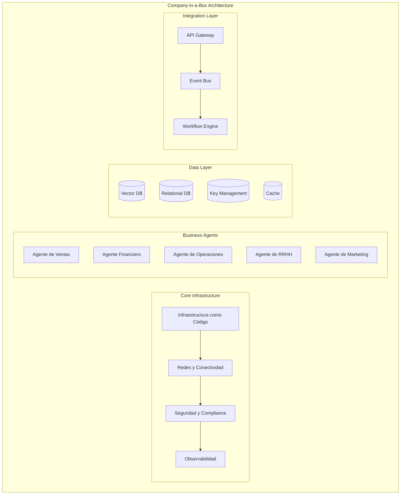
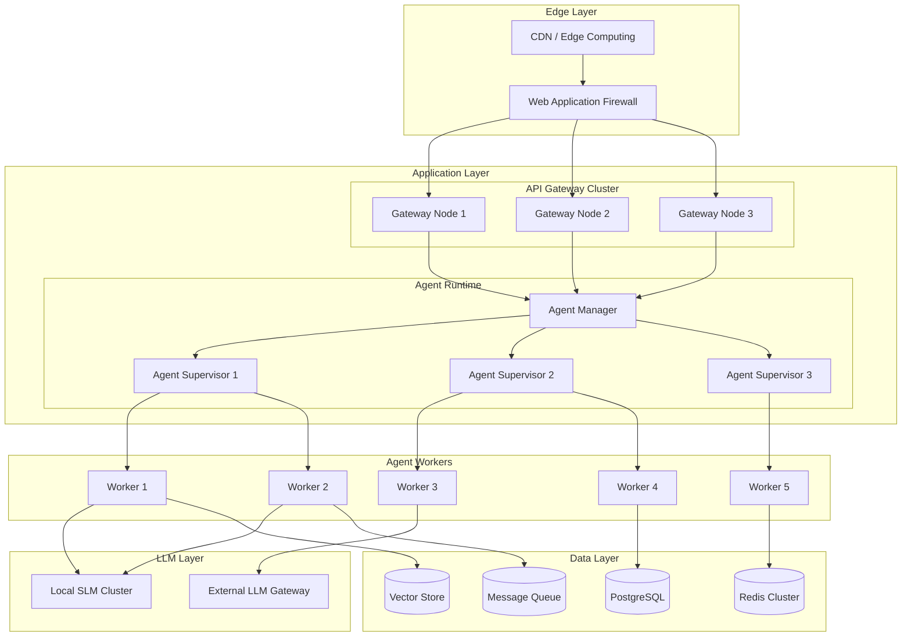
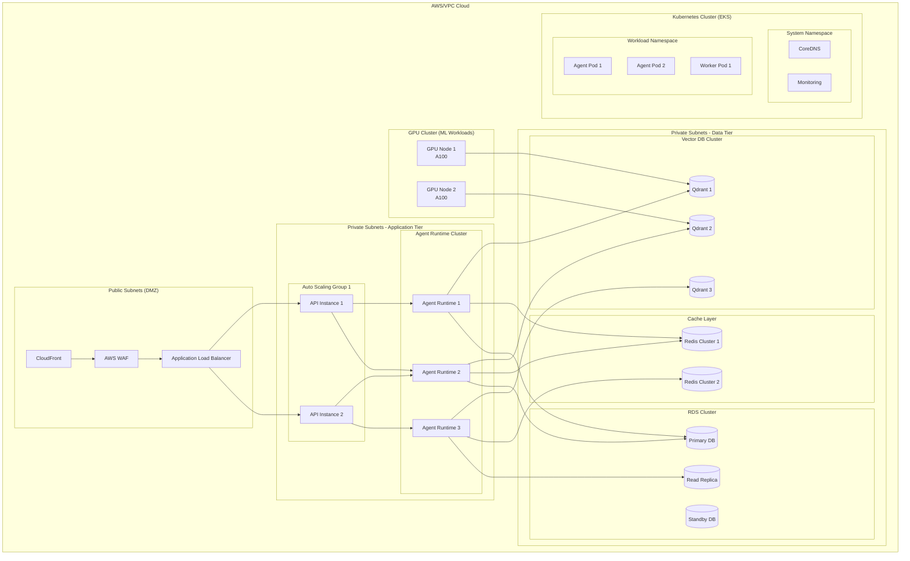
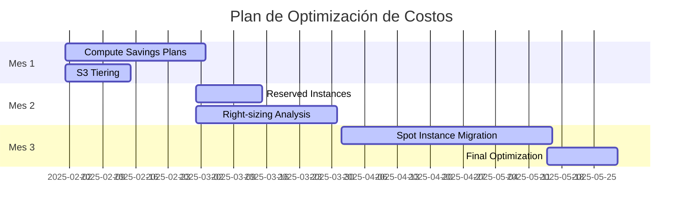
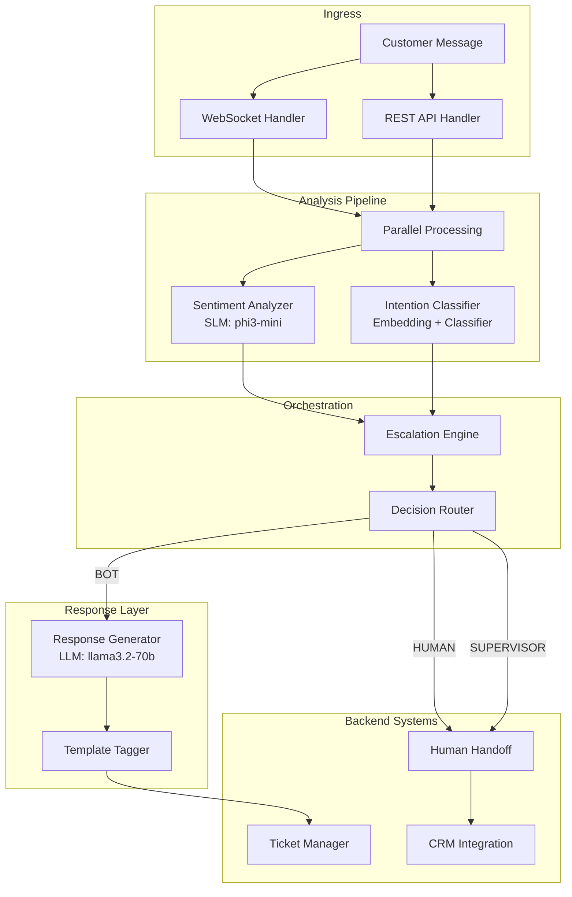

# Clase 25: Proyecto Company-in-a-Box - Parte 1

## Duración: 4 horas

---

## Objetivos de Aprendizaje

Al finalizar esta clase, el estudiante será capaz de:

1. **Diseñar una arquitectura de referencia** para un sistema multi-agente empresarial
2. **Seleccionar componentes técnicos apropiados** basándose en requisitos funcionales y no funcionales
3. **Crear un plan de infraestructura detallado** con consideraciones de escalabilidad
4. **Elaborar una estimación de costos** usando modelos de pricing en la nube
5. **Documentar decisiones arquitectónicas** utilizando frameworks como ADRs (Architecture Decision Records)

---

## Contenidos Detallados

### 1. Introducción al Proyecto Company-in-a-Box (45 minutos)

#### 1.1 Concepto y Visión

El patrón "Company-in-a-Box" representa una abstracción arquitectónica donde una organización empresarial completa se modela como un sistema de software integrado. Este enfoque permite:

- **Composableidad**: Cada componente organizacional (ventas, finanzas, operaciones, etc.) se implementa como un microservicio o conjunto de agentes
- **Automatización extrema**: Los procesos de negocio se ejecutan con intervención humana mínima
- **Observabilidad completa**: Cada acción genera trazas, métricas y logs
- **Reproducibilidad**: El sistema puede desplegarse en cualquier entorno compatible

#### 1.2 Componentes Fundamentales



#### 1.3 Requisitos del Proyecto

**Requisitos Funcionales:**

| ID | Requisito | Prioridad | Descripción |
|----|-----------|-----------|-------------|
| RF-01 | Agente de Consulta | Alta | Responde preguntas sobre la empresa en lenguaje natural |
| RF-02 | Automatización de Ventas | Alta | Genera propuestas comerciales automáticamente |
| RF-03 | Gestión de Leads | Media | Califica y enruta leads entrantes |
| RF-04 | Reportes Automatizados | Alta | Genera informes ejecutivos periódicos |
| RF-05 | Soporte al Cliente | Alta | Responde consultas básicas de clientes |
| RF-06 | Análisis de Sentimiento | Media | Analiza feedback de clientes |
| RF-07 | Predicción de Demanda | Baja | Proyecta demanda futura |

**Requisitos No Funcionales:**

| ID | RNF | Valor Objetivo |
|----|-----|----------------|
| RNF-01 | Disponibilidad | 99.9% (4.38 horas downtime/mes) |
| RNF-02 | Latencia p95 | < 500ms para consultas simples |
| RNF-03 | Throughput | 1000 requests/segundo |
| RNF-04 | Escalabilidad | Horizontal, hasta 10x carga base |
| RNF-05 | Recuperación | RTO < 15 min, RPO < 5 min |

---

### 2. Diseño de Arquitectura (60 minutos)

#### 2.1 Arquitectura de Referencia



#### 2.2 Patrones Arquitectónicos Aplicados

**2.2.1 Patrón: Saga para Transacciones Distribuidas**

```python
from enum import Enum
from typing import List, Callable, Any
from dataclasses import dataclass
from datetime import datetime
import asyncio

class SagaStepStatus(Enum):
    PENDING = "pending"
    COMPLETED = "completed"
    FAILED = "failed"
    COMPENSATING = "compensating"

@dataclass
class SagaStep:
    name: str
    execute: Callable
    compensate: Callable
    status: SagaStepStatus = SagaStepStatus.PENDING

class CompanyBoxSaga:
    """Saga coordinator for Company-in-a-Box operations."""
    
    def __init__(self, saga_id: str, steps: List[SagaStep]):
        self.saga_id = saga_id
        self.steps = steps
        self.completed_steps: List[SagaStep] = []
        self.started_at = None
        self.completed_at = None
    
    async def execute(self) -> bool:
        """Execute all saga steps with compensation on failure."""
        self.started_at = datetime.utcnow()
        
        for i, step in enumerate(self.steps):
            try:
                print(f"Executing step {i+1}/{len(self.steps)}: {step.name}")
                await step.execute()
                step.status = SagaStepStatus.COMPLETED
                self.completed_steps.append(step)
            except Exception as e:
                print(f"Step {step.name} failed: {e}")
                step.status = SagaStepStatus.FAILED
                await self.compensate(i)
                return False
        
        self.completed_at = datetime.utcnow()
        return True
    
    async def compensate(self, failed_step_index: int):
        """Compensate completed steps in reverse order."""
        for step in reversed(self.completed_steps):
            step.status = SagaStepStatus.COMPENSATING
            try:
                print(f"Compensating step: {step.name}")
                await step.compensate()
            except Exception as e:
                print(f"Compensation failed for {step.name}: {e}")
```

**2.2.2 Patrón: CQRS (Command Query Responsibility Segregation)**

```python
from abc import ABC, abstractmethod
from typing import Any, Dict, List
from datetime import datetime
import asyncio

class Command(ABC):
    """Base class for commands in CQRS pattern."""
    pass

class Query(ABC):
    """Base class for queries in CQRS pattern."""
    pass

class CommandHandler(ABC):
    @abstractmethod
    async def handle(self, command: Command) -> Any:
        pass

class QueryHandler(ABC):
    @abstractmethod
    async def handle(self, query: Query) -> Any:
        pass

# Example Commands
class CreateLeadCommand(Command):
    def __init__(self, name: str, email: str, company: str, source: str):
        self.name = name
        self.email = email
        self.company = company
        self.source = source
        self.created_at = datetime.utcnow()

class QualifyLeadCommand(Command):
    def __init__(self, lead_id: str, score: int, tier: str):
        self.lead_id = lead_id
        self.score = score
        self.tier = tier

# Example Queries
class GetLeadQuery(Query):
    def __init__(self, lead_id: str):
        self.lead_id = lead_id

class ListQualifiedLeadsQuery(Query):
    def __init__(self, min_score: int = 0, limit: int = 100):
        self.min_score = min_score
        self.limit = limit

class LeadCommandHandler(CommandHandler):
    """Handles lead-related commands."""
    
    def __init__(self, db_pool, event_bus, vector_store):
        self.db = db_pool
        self.events = event_bus
        self.vectors = vector_store
    
    async def handle(self, command: Command) -> Dict:
        if isinstance(command, CreateLeadCommand):
            return await self._handle_create(command)
        elif isinstance(command, QualifyLeadCommand):
            return await self._handle_qualify(command)
    
    async def _handle_create(self, cmd: CreateLeadCommand) -> Dict:
        # Write to PostgreSQL
        async with self.db.acquire() as conn:
            result = await conn.execute(
                """
                INSERT INTO leads (name, email, company, source, created_at)
                VALUES ($1, $2, $3, $4, $5)
                RETURNING id
                """,
                cmd.name, cmd.email, cmd.company, cmd.source, cmd.created_at
            )
            lead_id = await result.fetchone()[0]
        
        # Index in vector store for semantic search
        await self.vectors.upsert(
            collection="leads",
            documents=[f"{cmd.name} from {cmd.company}"],
            ids=[lead_id],
            metadata=[{"email": cmd.email}]
        )
        
        # Publish event
        await self.events.publish("lead.created", {
            "lead_id": lead_id,
            "email": cmd.email,
            "source": cmd.source
        })
        
        return {"id": lead_id, "status": "created"}
```

**2.2.3 Patrón: Event Sourcing**

```python
from typing import List, Callable, Any
from dataclasses import dataclass, field
from datetime import datetime
import json

@dataclass
class Event:
    event_id: str
    aggregate_id: str
    event_type: str
    data: Dict[str, Any]
    timestamp: datetime = field(default_factory=datetime.utcnow)
    version: int = 1

class EventStore:
    """Event store for event sourcing pattern."""
    
    def __init__(self, db_pool):
        self.db = db_pool
    
    async def append(self, event: Event) -> None:
        async with self.db.acquire() as conn:
            await conn.execute(
                """
                INSERT INTO events 
                (event_id, aggregate_id, event_type, data, timestamp, version)
                VALUES ($1, $2, $3, $4, $5, $6)
                """,
                event.event_id,
                event.aggregate_id,
                event.event_type,
                json.dumps(event.data),
                event.timestamp,
                event.version
            )
    
    async def get_stream(self, aggregate_id: str) -> List[Event]:
        async with self.db.acquire() as conn:
            rows = await conn.fetch(
                """
                SELECT event_id, aggregate_id, event_type, data, timestamp, version
                FROM events
                WHERE aggregate_id = $1
                ORDER BY timestamp ASC
                """,
                aggregate_id
            )
        
        return [
            Event(
                event_id=row['event_id'],
                aggregate_id=row['aggregate_id'],
                event_type=row['event_type'],
                data=json.loads(row['data']),
                timestamp=row['timestamp'],
                version=row['version']
            )
            for row in rows
        ]
    
    async def replay(self, aggregate_id: str, handler: Callable) -> Any:
        events = await self.get_stream(aggregate_id)
        state = None
        for event in events:
            state = await handler(state, event)
        return state
```

#### 2.3 Decisiones Arquitectónicas (ADRs)

**ADR-001: Selección de Runtime de Agentes**

```
ADR-001: Runtime de Agentes Multi-Modelo

Status: Accepted
Date: 2025-01-15

Context:
Necesitamos un runtime que soporte múltiples LLMs (locales y externos)
para optimizar costos y latencia según el tipo de tarea.

Decision:
Implementar un Agent Runtime propietario basado en:
- Task queues con prioridades (Redis + BullMQ)
- Selector dinámico de modelo basado en:
  - Complejidad de la tarea (clasificada por embedding similarity)
  - Requisitos de latencia
  - Costo por token
- Conexión a Ollama para modelos locales
- Gateway para modelos externos (OpenAI, Anthropic)

Consequences:
Positive:
- Flexibilidad para elegir el modelo óptimo por tarea
- Reducción de costos del 60% usando SLMs para tareas simples
- No vendor lock-in

Negative:
- Mayor complejidad operacional
- Necesidad de mantener múltiples endpoints de modelo

Alternatives Considered:
1. LangChain/LangGraph - Rechazado por overhead y dependencia de vendor
2. Solo modelos externos - Rechazado por costos y latencia
```

---

### 3. Selección de Componentes (45 minutos)

#### 3.1 Matriz de Selección

| Componente | Opción 1 | Opción 2 | Opción 3 | Seleccionado | Justificación |
|------------|----------|----------|----------|---------------|---------------|
| Runtime Agents | Custom | LangChain | AutoGen | Custom | Control + rendimiento |
| Vector DB | Qdrant | Weaviate | Chroma | Qdrant | Performance + Kubernetes native |
| Message Queue | Redis Streams | RabbitMQ | Kafka | Redis Streams | Simplicidad + bajo costo |
| API Gateway | Kong | Traefik | AWS API GW | Kong | Plugins extensibles |
| Container Orch | Kubernetes | Nomad | ECS | Kubernetes | Estándar industria |
| SLM Runtime | Ollama | vLLM | LM Studio | Ollama | API simple + banyak modelos |
| Cache | Redis | Memcached | Dragonfly | Redis | Multifuncional |
| Load Balancer | HAProxy | NGINX | AWS ALB | NGINX | Flexible + L7 |

#### 3.2 Componentes Detallados

**3.2.1 Runtime de Agentes (Custom Implementation)**

```python
# agent_runtime/core/agent_runtime.py
from abc import ABC, abstractmethod
from typing import Dict, List, Any, Optional
from dataclasses import dataclass, field
from enum import Enum
import asyncio
import logging
from datetime import datetime

logger = logging.getLogger(__name__)

class AgentCapability(Enum):
    REASONING = "reasoning"
    CODE_EXECUTION = "code_execution"
    WEB_SEARCH = "web_search"
    FILE_OPERATIONS = "file_operations"
    DATABASE_QUERY = "database_query"
    API_CALL = "api_call"
    IMAGE_ANALYSIS = "image_analysis"

@dataclass
class Agent:
    agent_id: str
    name: str
    description: str
    capabilities: List[AgentCapability]
    model_config: Dict[str, Any]
    system_prompt: str
    max_tokens: int = 4096
    temperature: float = 0.7

@dataclass
class Task:
    task_id: str
    type: str
    description: str
    input_data: Dict[str, Any]
    required_capabilities: List[AgentCapability]
    priority: int = 5  # 1-10, 10 highest
    deadline: Optional[datetime] = None
    metadata: Dict[str, Any] = field(default_factory=dict)

@dataclass
class TaskResult:
    task_id: str
    status: str
    output: Optional[Dict[str, Any]] = None
    error: Optional[str] = None
    execution_time_ms: float = 0
    tokens_used: int = 0

class ModelSelector:
    """Selects optimal model based on task characteristics."""
    
    def __init__(self, local_models: Dict[str, str], remote_models: Dict[str, str]):
        self.local_models = local_models  # model_id -> endpoint
        self.remote_models = remote_models  # model_id -> endpoint
        self.complexity_classifier = None  # Loaded ML model
    
    async def select(
        self, 
        task: Task, 
        cost_budget: Optional[float] = None,
        latency_budget_ms: Optional[float] = None
    ) -> Dict[str, Any]:
        # Classify task complexity based on required capabilities
        complexity = self._estimate_complexity(task)
        
        # Decision logic
        if complexity == "low" and latency_budget_ms and latency_budget_ms < 500:
            return {
                "type": "local",
                "model_id": "llama3.2:3b",
                "endpoint": self.local_models["llama3.2:3b"],
                "estimated_cost": 0.001,
                "estimated_latency_ms": 100
            }
        elif complexity == "medium":
            if self._can_use_local(task):
                return {
                    "type": "local",
                    "model_id": "llama3.2:70b",
                    "endpoint": self.local_models["llama3.2:70b"],
                    "estimated_cost": 0.005,
                    "estimated_latency_ms": 2000
                }
        
        # Default to remote for high complexity or cost-effective
        return {
            "type": "remote",
            "model_id": "gpt-4o-mini",
            "endpoint": self.remote_models["gpt-4o-mini"],
            "estimated_cost": 0.15,
            "estimated_latency_ms": 500
        }
    
    def _estimate_complexity(self, task: Task) -> str:
        complex_caps = {AgentCapability.REASONING, AgentCapability.CODE_EXECUTION}
        if any(cap in complex_caps for cap in task.required_capabilities):
            return "high"
        elif len(task.required_capabilities) > 2:
            return "medium"
        return "low"
    
    def _can_use_local(self, task: Task) -> bool:
        # Check if task can be handled by available local models
        return True

class AgentRuntime:
    """Main agent runtime orchestrator."""
    
    def __init__(
        self,
        model_selector: ModelSelector,
        task_queue,  # BullMQ instance
        event_bus,
        vector_store,
        cache
    ):
        self.model_selector = model_selector
        self.queue = task_queue
        self.events = event_bus
        self.vectors = vector_store
        self.cache = cache
        self.agent_registry: Dict[str, Agent] = {}
        self.active_tasks: Dict[str, Task] = {}
    
    def register_agent(self, agent: Agent) -> None:
        self.agent_registry[agent.agent_id] = agent
        logger.info(f"Registered agent: {agent.name} ({agent.agent_id})")
    
    async def submit_task(self, task: Task) -> str:
        """Submit a task for execution."""
        # Select optimal model
        model_info = await self.model_selector.select(task)
        
        # Add to queue with priority
        await self.queue.add(
            f"task:{task.task_id}",
            {
                "task_id": task.task_id,
                "model_info": model_info,
                "task_data": task.input_data
            },
            job_id=task.task_id,
            priority=10 - task.priority  # Convert priority (10-high -> 1-low)
        )
        
        self.active_tasks[task.task_id] = task
        await self.events.publish("task.submitted", {"task_id": task.task_id})
        
        return task.task_id
    
    async def execute_task(self, task: Task, model_info: Dict) -> TaskResult:
        """Execute a single task with the selected model."""
        start_time = asyncio.get_event_loop().time()
        
        try:
            # Build prompt
            prompt = self._build_prompt(task)
            
            # Execute based on model type
            if model_info["type"] == "local":
                output = await self._execute_local(task.task_id, prompt, model_info)
            else:
                output = await self._execute_remote(task.task_id, prompt, model_info)
            
            execution_time = (asyncio.get_event_loop().time() - start_time) * 1000
            
            return TaskResult(
                task_id=task.task_id,
                status="completed",
                output=output,
                execution_time_ms=execution_time,
                tokens_used=output.get("usage", {}).get("total_tokens", 0)
            )
        except Exception as e:
            logger.error(f"Task {task.task_id} failed: {e}")
            return TaskResult(
                task_id=task.task_id,
                status="failed",
                error=str(e)
            )
    
    def _build_prompt(self, task: Task) -> str:
        # Template-based prompt construction
        return f"""
        Task: {task.description}
        
        Input Data:
        {json.dumps(task.input_data, indent=2)}
        
        Output Format:
        Provide your response as a JSON object with the following structure:
        {{
            "result": <your_answer>,
            "confidence": <0-1>,
            "reasoning": <explanation>
        }}
        """
    
    async def _execute_local(self, task_id: str, prompt: str, model_info: Dict) -> Dict:
        # Call Ollama API
        async with aiohttp.ClientSession() as session:
            async with session.post(
                f"{model_info['endpoint']}/api/generate",
                json={
                    "model": model_info["model_id"],
                    "prompt": prompt,
                    "stream": False
                }
            ) as resp:
                return await resp.json()
    
    async def _execute_remote(self, task_id: str, prompt: str, model_info: Dict) -> Dict:
        # Call OpenAI/Anthropic API
        pass
```

**3.2.2 Vector Database (Qdrant)**

```yaml
# docker-compose-qdrant.yaml
version: '3.8'

services:
  qdrant:
    image: qdrant/qdrant:v1.7.4
    container_name: companybox-qdrant
    ports:
      - "6333:6333"
      - "6334:6334"  # gRPC port
    volumes:
      - qdrant_storage:/qdrant/storage
    environment:
      - QDRANT__SERVICE__GRPC_PORT=6334
      - QDRANT__SERVICE__MAX_REQUEST_SIZE_MB=32
      - QDRANT__CLUSTERING__ENABLED=true
    deploy:
      resources:
        limits:
          memory: 4G
        reservations:
          memory: 2G

volumes:
  qdrant_storage:
    driver: local
```

```python
# vector_store/qdrant_client.py
from qdrant_client import QdrantClient
from qdrant_client.models import Distance, VectorParams, PointStruct
from typing import List, Dict, Any, Optional
import numpy as np

class CompanyBoxVectorStore:
    """Qdrant-based vector store for semantic search."""
    
    COLLECTIONS = {
        "leads": {
            "vector_size": 1536,
            "description": "Lead embeddings for CRM"
        },
        "knowledge_base": {
            "vector_size": 1536,
            "description": "Company knowledge base"
        },
        "agent_memory": {
            "vector_size": 1536,
            "description": "Agent conversation history"
        },
        "documents": {
            "vector_size": 3072,  # For larger embeddings
            "description": "Document embeddings"
        }
    }
    
    def __init__(self, host: str = "localhost", port: int = 6333):
        self.client = QdrantClient(host=host, port=port)
        self._ensure_collections()
    
    def _ensure_collections(self):
        """Create collections if they don't exist."""
        existing = {c.name for c in self.client.get_collections().collections}
        for name, config in self.COLLECTIONS.items():
            if name not in existing:
                self.client.create_collection(
                    collection_name=name,
                    vectors_config=VectorParams(
                        size=config["vector_size"],
                        distance=Distance.COSINE
                    )
                )
                print(f"Created collection: {name}")
    
    async def upsert(
        self, 
        collection: str, 
        documents: List[str],
        embeddings: List[np.ndarray],
        ids: List[str],
        metadata: Optional[List[Dict]] = None
    ):
        """Insert or update documents with embeddings."""
        points = [
            PointStruct(
                id=idx,
                vector=embedding.tolist(),
                payload={
                    "document": doc,
                    "metadata": meta or {}
                }
            )
            for idx, doc, embedding, meta in zip(ids, documents, embeddings, metadata or [{}]*len(documents))
        ]
        
        self.client.upsert(
            collection_name=collection,
            points=points
        )
    
    async def search(
        self,
        collection: str,
        query_embedding: np.ndarray,
        limit: int = 10,
        score_threshold: float = 0.7,
        filter_conditions: Optional[Dict] = None
    ) -> List[Dict[str, Any]]:
        """Semantic search with optional filtering."""
        results = self.client.search(
            collection_name=collection,
            query_vector=query_embedding.tolist(),
            limit=limit,
            score_threshold=score_threshold,
            query_filter=filter_conditions
        )
        
        return [
            {
                "id": hit.id,
                "score": hit.score,
                "document": hit.payload["document"],
                "metadata": hit.payload.get("metadata", {})
            }
            for hit in results
        ]
    
    async def hybrid_search(
        self,
        collection: str,
        query: str,
        query_embedding: np.ndarray,
        limit: int = 10
    ) -> List[Dict[str, Any]]:
        """Hybrid search combining semantic and keyword matching."""
        # This would combine vector search with BM25 in production
        # For now, return vector search results
        return await self.search(collection, query_embedding, limit)
```

**3.2.3 Message Queue (Redis Streams + BullMQ)**

```yaml
# docker-compose-redis.yaml
version: '3.8'

services:
  redis:
    image: redis:7.2-alpine
    container_name: companybox-redis
    command: redis-server --appendonly yes --maxmemory 2gb --maxmemory-policy allkeys-lru
    ports:
      - "6379:6379"
      - "6380:6380"  # For Redis Commander
    volumes:
      - redis_data:/data
    healthcheck:
      test: ["CMD", "redis-cli", "ping"]
      interval: 10s
      timeout: 5s
      retries: 5

volumes:
  redis_data:
    driver: local
```

```python
# queue/agent_queue.py
from bullmq import Queue, Worker, Job
from typing import Dict, Any
import ioredis
import json
import asyncio

class AgentTaskQueue:
    """BullMQ-based task queue for agent operations."""
    
    QUEUES = {
        "high-priority": {"priority": 1},      # Critical operations
        "default": {"priority": 5},            # Normal operations
        "low-priority": {"priority": 10},      # Background tasks
        "batch": {"priority": 20}              # Batch processing
    }
    
    def __init__(self, redis_url: str = "redis://localhost:6379"):
        self.redis_url = redis_url
        self.queues: Dict[str, Queue] = {}
        self._init_queues()
    
    def _init_queues(self):
        for name, config in self.QUEUES.items():
            self.queues[name] = Queue(name, {
                "connection": ioredis.from_url(self.redis_url),
                "defaultJobOptions": {
                    "attempts": 3,
                    "backoff": {
                        "type": "exponential",
                        "delay": 1000
                    },
                    "removeOnComplete": {"count": 1000},
                    "removeOnFail": {"count": 5000}
                }
            })
    
    async def add(self, queue_name: str, job_name: str, data: Dict, job_id: str = None, priority: int = 5):
        """Add a job to the specified queue."""
        queue = self.queues.get(queue_name, self.queues["default"])
        
        await queue.add(
            job_name,
            data,
            job_id=job_id,
            jobOpts={
                "priority": priority
            }
        )
    
    async def add_batch(self, queue_name: str, jobs: list):
        """Add multiple jobs efficiently."""
        queue = self.queues.get(queue_name, self.queues["default"])
        await queue.addBulk(jobs)
    
    async def get_queue_stats(self) -> Dict[str, Any]:
        """Get statistics for all queues."""
        stats = {}
        for name, queue in self.queues.items():
            counts = await queue.getJobCounts('waiting', 'active', 'completed', 'failed', 'delayed')
            stats[name] = counts
        return stats

class AgentWorker:
    """Worker for processing agent tasks."""
    
    def __init__(self, queue_name: str, redis_url: str, runtime):
        self.queue_name = queue_name
        self.runtime = runtime
        self.worker = Worker(
            queue_name,
            self.process_job,
            {"connection": ioredis.from_url(redis_url)}
        )
    
    async def process_job(self, job: Job) -> Dict:
        """Process a single job."""
        print(f"Processing job {job.id} from {self.queue_name}")
        
        task_data = job.data
        task = Task(
            task_id=task_data["task_id"],
            type=task_data.get("type", "default"),
            description=task_data.get("description", ""),
            input_data=task_data.get("task_data", {}),
            required_capabilities=[AgentCapability.R]  # Loaded from task
        )
        
        result = await self.runtime.execute_task(
            task, 
            task_data.get("model_info", {})
        )
        
        return {
            "status": result.status,
            "output": result.output,
            "error": result.error,
            "metrics": {
                "execution_time_ms": result.execution_time_ms,
                "tokens_used": result.tokens_used
            }
        }
```

---

### 4. Plan de Infraestructura (45 minutos)

#### 4.1 Diseño de Topología de Red



#### 4.2 Especificación de Infraestructura

```yaml
# infrastructure/kubernetes/eks-cluster.yaml
apiVersion: eksctl.io/v1alpha5
kind: ClusterConfig

metadata:
  name: companybox-prod
  region: us-east-1
  version: "1.29"

iam:
  withOIDC: true
  serviceAccounts:
    - metadata:
        name: agent-runtime
        namespace: production
        labels:
          aws-usage: production
      wellKnownPolicies:
        ebsCSIPolicies: true
        albIngress: true

managedNodeGroups:
  - name: general-purpose
    instanceType: m6i.xlarge
    desiredCapacity: 3
    minSize: 2
    maxSize: 10
    volumeSize: 100
    volumeType: gp3
    privateNetworking: true
    
  - name: memory-optimized
    instanceType: r6i.2xlarge
    desiredCapacity: 2
    minSize: 1
    maxSize: 5
    volumeSize: 200
    privateNetworking: true
    
  - name: gpu-compute
    instanceType: p4d.24xlarge
    desiredCapacity: 1
    minSize: 0
    maxSize: 2
    volumeSize: 500
    privateNetworking: true
    labels:
      nvidia.com/gpu: "true"
    taints:
      - key: nvidia.com/gpu
        value: "true"
        effect: NoSchedule

kubernetesNetworkConfig:
  ipFamily: ipv4
  serviceIPv4CIDR: 172.20.0.0/16

cloudwatch:
  clusterLogging:
    enableTypes:
      - api
      - audit
      - authenticator
      - controllerManager
      - scheduler

vpc:
  cidr: 10.0.0.0/16
  nat:
    gateway: highly-available
  clusterEndpoints:
    publicAccess: true
    privateAccess: true
```

#### 4.3 Resource Quotas y HPA

```yaml
# infrastructure/kubernetes/resource-quotas.yaml
apiVersion: v1
kind: ResourceQuota
metadata:
  name: production-quota
  namespace: production
spec:
  hard:
    requests.cpu: "32"
    requests.memory: 64Gi
    limits.cpu: "64"
    limits.memory: 128Gi
    pods: "100"
    services: "20"
    persistentvolumeclaims: "50"

---
apiVersion: v1
kind: LimitRange
metadata:
  name: production-limits
  namespace: production
spec:
  limits:
  - max:
      cpu: "8"
      memory: 16Gi
    min:
      cpu: 100m
      memory: 128Mi
    default:
      cpu: 500m
      memory: 512Mi
    defaultRequest:
      cpu: 200m
      memory: 256Mi
    type: Container

---
apiVersion: autoscaling/v2
kind: HorizontalPodAutoscaler
metadata:
  name: agent-runtime-hpa
  namespace: production
spec:
  scaleTargetRef:
    apiVersion: apps/v1
    kind: Deployment
    name: agent-runtime
  minReplicas: 2
  maxReplicas: 20
  metrics:
  - type: Resource
    resource:
      name: cpu
      target:
        type: Utilization
        averageUtilization: 70
  - type: Resource
    resource:
      name: memory
      target:
        type: Utilization
        averageUtilization: 80
  - type: Pods
    pods:
      metric:
        name: agent_queue_depth
      target:
        type: AverageValue
        averageValue: "100"
  behavior:
    scaleUp:
      stabilizationWindowSeconds: 60
      policies:
      - type: Percent
        value: 100
        periodSeconds: 15
    scaleDown:
      stabilizationWindowSeconds: 300
      policies:
      - type: Percent
        value: 10
        periodSeconds: 60
```

---

### 5. Estimación de Costos (45 minutos)

#### 5.1 Modelo de Costos AWS

| Componente | Recurso | Configuración | Costo Mensual | Costo Anual |
|------------|---------|---------------|---------------|-------------|
| **Compute** | | | | |
| | EKS Cluster | 3x m6i.xlarge | $245.76 | $2,949.12 |
| | EKS Cluster | 2x r6i.2xlarge | $437.76 | $5,253.12 |
| | GPU Nodes | 1x p4d.24xlarge (Spot) | $1,500.00 | $18,000.00 |
| **Data** | | | | |
| | RDS PostgreSQL | db.r7g.2xlarge Multi-AZ | $1,200.00 | $14,400.00 |
| | ElastiCache | 2x r7g.large | $280.00 | $3,360.00 |
| | Qdrant | 3x m6i.xlarge | $245.76 | $2,949.12 |
| **Network** | | | | |
| | NAT Gateway | 2 AZs | $90.00 | $1,080.00 |
| | Load Balancer | Application LB | $25.00 | $300.00 |
| | Data Transfer | ~500 GB/mo | $50.00 | $600.00 |
| **Storage** | | | | |
| | EBS gp3 | 1TB | $100.00 | $1,200.00 |
| | S3 Standard | 100GB | $2.30 | $27.60 |
| **Security** | | | | |
| | WAF | 5 rules, 1M requests | $20.00 | $240.00 |
| | CloudWatch | Detailed monitoring | $50.00 | $600.00 |
| **AI/LLM** | | | | |
| | OpenAI API | ~10M tokens/mes | $300.00 | $3,600.00 |
| | Ollama (self-hosted) | Included in compute | $0.00 | $0.00 |
| | | | | |
| | **TOTAL** | | **$4,546.58** | **$54,558.96** |

#### 5.2 Optimización de Costos

```python
# infrastructure/cost_optimizer.py
from typing import Dict, List, Tuple
from dataclasses import dataclass
from datetime import datetime
import boto3

@dataclass
class CostOptimization:
    strategy: str
    potential_savings_monthly: float
    implementation_effort: str
    risk_level: str

class CostOptimizer:
    """AWS cost optimization analyzer for Company-in-a-Box."""
    
    def __init__(self, aws_profile: str = "default"):
        self.ce = boto3.client('ce', region_name='us-east-1')
    
    def analyze_savings_opportunities(self) -> List[CostOptimization]:
        """Analyze current costs and suggest optimizations."""
        opportunities = []
        
        # 1. Compute Savings Plans
        opportunities.append(CostOptimization(
            strategy="Compute Savings Plans",
            potential_savings_monthly=1200.00,
            implementation_effort="Low",
            risk_level="Low"
        ))
        
        # 2. Spot Instances for GPU workloads
        opportunities.append(CostOptimization(
            strategy="GPU Spot Instances",
            potential_savings_monthly=750.00,
            implementation_effort="Medium",
            risk_level="Medium"
        ))
        
        # 3. Reserved Instances for base compute
        opportunities.append(CostOptimization(
            strategy="Reserved Instances (1yr)",
            potential_savings_monthly=400.00,
            implementation_effort="Low",
            risk_level="Low"
        ))
        
        # 4. S3 Intelligent Tiering
        opportunities.append(CostOptimization(
            strategy="S3 Intelligent Tiering",
            potential_savings_monthly=15.00,
            implementation_effort="Low",
            risk_level="None"
        ))
        
        # 5. Right-sizing instances
        opportunities.append(CostOptimization(
            strategy="Right-sizing EC2 Instances",
            potential_savings_monthly=200.00,
            implementation_effort="Medium",
            risk_level="Low"
        ))
        
        return opportunities
    
    def calculate_monthly_budget(self, traffic_scenarios: Dict) -> Dict:
        """Calculate monthly costs under different traffic scenarios."""
        scenarios = {}
        
        base_load = 1000  # requests/hour
        for name, req_per_hour in traffic_scenarios.items():
            scale_factor = req_per_hour / base_load
            
            costs = {
                "compute": 683.52 * scale_factor,
                "database": 1200.00,
                "cache": 280.00,
                "vector_db": 245.76 * scale_factor,
                "network": 90.00 + (0.05 * req_per_hour * 24 * 30 / 1000),
                "ai": 300.00 * scale_factor,
                "storage": 102.30
            }
            
            scenarios[name] = {
                "requests_per_hour": req_per_hour,
                "monthly_cost": sum(costs.values()),
                "cost_breakdown": costs
            }
        
        return scenarios
```

#### 5.3 Plan de Implementación de Costos



---

### 6. Ejercicios Prácticos (30 minutos)

#### Ejercicio 1: Diseño de Arquitectura con Patrones

**Enunciado:**
Diseñar una arquitectura para un agente de soporte al cliente que maneje:
- Chat en tiempo real
- Generación de tickets automáticos
- Escalamiento a agentes humanos
- Análisis de sentimiento en tiempo real

**Solución:**

```python
# exercise_1/support_agent_architecture.py
from typing import Dict, List, Optional
from dataclasses import dataclass
from enum import Enum
import asyncio

class EscalationLevel(Enum):
    BOT_ONLY = 1
    HUMAN_SUPPORT = 2
    SUPERVISOR = 3
    EMERGENCY = 4

@dataclass
class CustomerMessage:
    message_id: str
    customer_id: str
    channel: str  # web, mobile, api
    content: str
    timestamp: str
    metadata: Dict

@dataclass
class SentimentResult:
    sentiment: str  # positive, neutral, negative
    score: float   # -1.0 to 1.0
    confidence: float
    key_phrases: List[str]

class SupportAgentArchitecture:
    """
    Arquitectura del agente de soporte basada en patrones.
    """
    
    def __init__(self):
        # Componentes de la arquitectura
        self.components = {
            "ingress": IngressGateway(),
            "sentiment_analyzer": SentimentAnalyzer(),
            "intent_classifier": IntentClassifier(),
            "response_generator": ResponseGenerator(),
            "ticket_manager": TicketManager(),
            "escalation_engine": EscalationEngine(),
            "human_handoff": HumanHandoffManager()
        }
    
    async def process_message(self, message: CustomerMessage) -> Dict:
        """Pipeline de procesamiento de mensajes."""
        
        # 1. Análisis de sentimiento (en paralelo con intent)
        sentiment_task = asyncio.create_task(
            self.components["sentiment_analyzer"].analyze(message.content)
        )
        intent_task = asyncio.create_task(
            self.components["intent_classifier"].classify(message.content)
        )
        
        sentiment, intent = await asyncio.gather(sentiment_task, intent_task)
        
        # 2. Decisión de escalamiento
        escalation_level = await self._determine_escalation(
            sentiment, intent, message
        )
        
        # 3. Generación de respuesta
        if escalation_level == EscalationLevel.BOT_ONLY:
            response = await self._generate_bot_response(intent, sentiment)
        else:
            response = await self._handle_escalation(message, escalation_level)
        
        # 4. Crear ticket si es necesario
        if intent.needs_ticket or sentiment.sentiment == "negative":
            await self.components["ticket_manager"].create_ticket(
                message, intent, sentiment
            )
        
        return {
            "message_id": message.message_id,
            "response": response,
            "sentiment": sentiment,
            "intent": intent,
            "escalation_level": escalation_level.value
        }
    
    async def _determine_escalation(
        self, 
        sentiment: SentimentResult,
        intent: Dict,
        message: CustomerMessage
    ) -> EscalationLevel:
        """Determina el nivel de escalamiento basado en reglas."""
        
        # Reglas de escalamiento
        if sentiment.score < -0.7:
            return EscalationLevel.SUPERVISOR
        
        if intent.category == "billing_dispute":
            return EscalationLevel.HUMAN_SUPPORT
        
        if intent.confidence < 0.5:
            return EscalationLevel.HUMAN_SUPPORT
        
        if "urgente" in message.content.lower() or "emergency" in message.content.lower():
            return EscalationLevel.EMERGENCY
        
        return EscalationLevel.BOT_ONLY

# Usage example
async def main():
    architecture = SupportAgentArchitecture()
    
    message = CustomerMessage(
        message_id="msg-001",
        customer_id="cust-123",
        channel="web",
        content="I need urgent help with my order! It's been 2 weeks!",
        timestamp="2025-01-15T10:30:00Z",
        metadata={"order_id": "ORD-456"}
    )
    
    result = await architecture.process_message(message)
    print(f"Response: {result['response']}")
    print(f"Escalation: Level {result['escalation_level']}")

if __name__ == "__main__":
    asyncio.run(main())
```

**Diagrama de la Arquitectura:**



#### Ejercicio 2: Cálculo de Costos con Escenarios

**Enunciado:**
Calcular los costos mensuales para 3 escenarios de carga:
- Mínimo: 500 usuarios concurrentes, 10K requests/hora
- Normal: 2000 usuarios concurrentes, 50K requests/hora  
- Pico: 5000 usuarios concurrentes, 150K requests/hora

**Solución:**

```python
# exercise_2/cost_calculator.py
from dataclasses import dataclass
from typing import Dict, List

@dataclass
class CostComponent:
    name: str
    base_monthly: float
    per_request_cost: float = 0
    per_user_cost: float = 0
    per_gb_cost: float = 0

class CostCalculator:
    """Calculador de costos para diferentes escenarios de carga."""
    
    def __init__(self):
        self.components = [
            # Compute (auto-scaling nodes)
            CostComponent("EKS General", 0, per_user_cost=0.002),
            CostComponent("EKS Memory", 150, per_user_cost=0.001),
            CostComponent("GPU Nodes", 800, per_user_cost=0.015),
            
            # Data Layer
            CostComponent("RDS PostgreSQL", 600),
            CostComponent("ElastiCache", 140),
            CostComponent("Qdrant", 120),
            
            # Network
            CostComponent("NAT Gateway", 45),
            CostComponent("Load Balancer", 25),
            CostComponent("Data Transfer", 0, per_gb_cost=0.09),
            
            # AI/LLM
            CostComponent("LLM API", 0, per_request_cost=0.002),
            CostComponent("Embedding API", 0, per_request_cost=0.0001),
            
            # Storage & Monitoring
            CostComponent("EBS Storage", 50),
            CostComponent("S3", 10),
            CostComponent("CloudWatch", 50),
        ]
    
    def calculate_scenario(
        self,
        scenario_name: str,
        users_concurrent: int,
        requests_per_hour: int,
        avg_request_size_kb: int = 10,
        llm_requests_per_hour: int = None
    ) -> Dict:
        """Calcular costos para un escenario específico."""
        
        if llm_requests_per_hour is None:
            llm_requests_per_hour = requests_per_hour // 10  # 10% de requests usan LLM
        
        monthly_requests = requests_per_hour * 24 * 30
        monthly_llm_requests = llm_requests_per_hour * 24 * 30
        monthly_data_gb = (requests_per_hour * avg_request_size_kb * 24 * 30) / (1024 * 1024)
        
        breakdown = {}
        total = 0
        
        for comp in self.components:
            cost = comp.base_monthly
            
            if comp.per_user_cost > 0:
                cost += users_concurrent * comp.per_user_cost * 30
            
            if comp.per_request_cost > 0:
                if "LLM" in comp.name or "Embedding" in comp.name:
                    cost += monthly_llm_requests * comp.per_request_cost
                else:
                    cost += monthly_requests * comp.per_request_cost
            
            if comp.per_gb_cost > 0:
                cost += monthly_data_gb * comp.per_gb_cost
            
            breakdown[comp.name] = round(cost, 2)
            total += cost
        
        return {
            "scenario": scenario_name,
            "metrics": {
                "users_concurrent": users_concurrent,
                "requests_per_hour": requests_per_hour,
                "monthly_requests": monthly_requests,
                "monthly_llm_requests": monthly_llm_requests,
                "monthly_data_gb": round(monthly_data_gb, 2)
            },
            "cost_breakdown": breakdown,
            "total_monthly": round(total, 2),
            "total_annual": round(total * 12, 2)
        }
    
    def generate_report(self) -> None:
        """Generar reporte comparativo de escenarios."""
        scenarios = [
            ("Mínimo", 500, 10000),
            ("Normal", 2000, 50000),
            ("Pico", 5000, 150000),
        ]
        
        print("=" * 80)
        print("COMPANY-IN-A-BOX: ANÁLISIS DE COSTOS MENSUALES")
        print("=" * 80)
        
        for name, users, req_hour in scenarios:
            result = self.calculate_scenario(name, users, req_hour)
            
            print(f"\n{'='*40}")
            print(f"ESCENARIO: {name.upper()}")
            print(f"{'='*40}")
            print(f"Usuarios concurrentes: {result['metrics']['users_concurrent']:,}")
            print(f"Requests/hora: {result['metrics']['requests_per_hour']:,}")
            print(f"\nDesglose de costos:")
            for comp, cost in result['cost_breakdown'].items():
                if cost > 0:
                    print(f"  {comp}: ${cost:,.2f}")
            print(f"\nTOTAL MENSUAL: ${result['total_monthly']:,.2f}")
            print(f"TOTAL ANUAL: ${result['total_annual']:,.2f}")

if __name__ == "__main__":
    calculator = CostCalculator()
    calculator.generate_report()
```

---

### 7. Actividades de Laboratorio (15 minutos)

#### Laboratorio 1: Documentar Decisiones Arquitectónicas

**Objetivo:** Crear 3 ADRs (Architecture Decision Records) para componentes del proyecto.

**Entregables:**
1. ADR-001: Selección de Runtime de Agentes
2. ADR-002: Estrategia de Almacenamiento de Datos
3. ADR-003: Patrón de Comunicação entre Agentes

**Plantilla ADR:**

```markdown
# ADR-XXX: Título de la Decisión

## Status
[Proposed | Accepted | Deprecated | Superseded by ADR-XXX]

## Context
[Descripción del problema o situación que motiva esta decisión]

## Decision
[Descripción de la decisión tomada]

## Consequences
### Positive
- [Beneficio 1]
- [Beneficio 2]

### Negative
- [Desventaja 1]
- [Desventaja 2]

### Neutral
- [Aspectos a considerar]

## Alternatives Considered
1. [Alternativa 1] - [Razón de rechazo/aceptación]
2. [Alternativa 2] - [Razón de rechazo/aceptación]

## References
- [Referencia 1]
- [Referencia 2]
```

---

## Tecnologías Específicas

| Categoría | Tecnología | Versión | Uso |
|-----------|------------|---------|-----|
| Runtime Agentes | Python async/await | 3.11+ | Core runtime |
| Message Queue | BullMQ | 5.x | Task queuing |
| Vector DB | Qdrant | 1.7+ | Semantic search |
| Cache | Redis | 7.2+ | Session & caching |
| API Gateway | Kong | 3.4+ | API management |
| Container Orch | Kubernetes/EKS | 1.29 | Container orchestration |
| IaC | Terraform | 1.6+ | Infrastructure provisioning |
| Observability | Prometheus + Grafana | - | Metrics & visualization |
| Testing | pytest + pytest-asyncio | - | Unit & integration tests |

---

## Referencias Externas

1. **Multi-Agent Systems Architecture**
   - [Multi-Agent Systems: A Modern Approach to Distributed Artificial Intelligence](https://www.amazon.com/Multi-Agent-Systems-Modern-Approach-Intelligence/dp/0262731315)
   - [Microsoft AutoGen Documentation](https://microsoft.github.io/autogen/)

2. **AWS Architecture Best Practices**
   - [AWS Well-Architected Framework](https://aws.amazon.com/architecture/well-architected/)
   - [EKS Best Practices Guide](https://aws.github.io/aws-eks-best-practices/)

3. **Event-Driven Architecture**
   - [Event-Driven Architecture - Martin Fowler](https://martinfowler.com/articles/201701-event-driven.html)
   - [CQRS Pattern - Microsoft](https://learn.microsoft.com/en-us/azure/architecture/microservices/model/cqrs-microservice)

4. **Cost Optimization**
   - [AWS Cost Optimization Best Practices](https://docs.aws.amazon.com/cost-management/latest/aws-custom-reporting/cost-optimization.html)
   - [K8s Resource Management](https://kubernetes.io/docs/concepts/configuration/manage-resources-containers/)

5. **Vector Databases**
   - [Qdrant Documentation](https://qdrant.tech/documentation/)
   - [Vector Search Best Practices](https://weaviate.io/blog/vector-search-best-practices)

6. **Saga Pattern**
   - [Saga Pattern - Microsoft](https://learn.microsoft.com/en-us/azure/architecture/reference-architectures/data/microservices-data-considerations)
   - [Implementing Event Sourcing](https://eventstore.com/docs/getting-started/)

---

## Resumen de Puntos Clave

1. **Arquitectura Company-in-a-Box**: Modela una organización empresarial completa como un sistema de software integrado con agentes especializados.

2. **Patrones Arquitectónicos**:
   - Saga para transacciones distribuidas
   - CQRS para separación de lectura/escritura
   - Event Sourcing para auditabilidad

3. **Selección de Componentes**: Cada componente debe seleccionarse basándose en requisitos específicos de rendimiento, costo y mantenibilidad.

4. **Plan de Infraestructura**: El diseño de red debe considerar seguridad (VPCs, subnets), escalabilidad (ASGs), y alta disponibilidad (multi-AZ).

5. **Estimación de Costos**: Es crucial modelar múltiples escenarios de carga para estimar costos accurately y planificar optimizaciones.

6. **ADRs**: Documentar decisiones arquitectónicas permite mantener trazabilidad del diseño y facilita onboarding de nuevos miembros.

7. **Próximos Pasos**: La Clase 26 se enfocará en la implementación de IaC y despliegue de agentes con Terraform y Kubernetes.

---

## Notas para el Instructor

**Tiempo分配:**
- Introducción: 45 min
- Diseño de Arquitectura: 60 min
- Selección de Componentes: 45 min
- Plan de Infraestructura: 45 min
- Estimación de Costos: 45 min
- Ejercicios Prácticos: 30 min
- Laboratorio: 15 min
- Q&A: 15 min

**Preparación Previa:**
- Asegurar acceso a cuenta AWS o entorno de pruebas
- Preparar templates de ADRs
- Verificar conectividad a repositorios de código

**Materiales Necesarios:**
- Acceso a documentación de AWS, Kubernetes, Qdrant
- Editor de texto/IDE configurado
- Terminal con AWS CLI instalado
