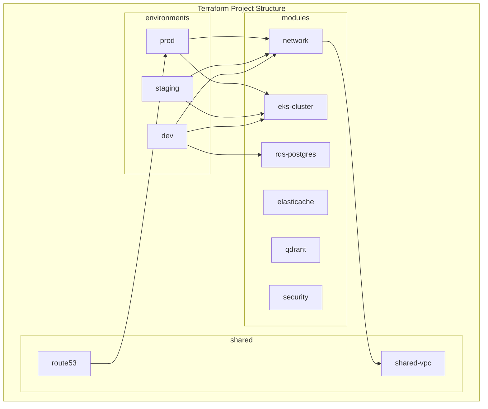

# Clase 26: Proyecto Company-in-a-Box - Parte 2

## Duración: 4 horas

---

## Objetivos de Aprendizaje

Al finalizar esta clase, el estudiante será capaz de:

1. **Implementar Infrastructure as Code (IaC)** para el despliegue completo del sistema
2. **Configurar y desplegar agentes** en un clúster Kubernetes
3. **Establecer topología de red** segura con políticas de red y servicios
4. **Ejecutar testing de integración** automatizado para validar despliegues
5. **Implementar observabilidad** completa del sistema multi-agente

---

## Contenidos Detallados

### 1. Infrastructure as Code con Terraform (60 minutos)

#### 1.1 Estructura del Proyecto Terraform



#### 1.2 Módulos Terraform Principales

```hcl
# modules/vpc/main.tf
terraform {
  required_version = ">= 1.6"
  required_providers {
    aws = {
      source  = "hashicorp/aws"
      version = "~> 5.0"
    }
  }
}

variable "environment" {
  description = "Environment name"
  type        = string
}

variable "vpc_cidr" {
  description = "VPC CIDR block"
  type        = string
  default     = "10.0.0.0/16"
}

variable "availability_zones" {
  description = "AZs for subnets"
  type        = list(string)
  default     = ["us-east-1a", "us-east-1b", "us-east-1c"]
}

variable "private_subnet_cidrs" {
  description = "CIDRs for private subnets"
  type        = list(string)
  default     = ["10.0.1.0/24", "10.0.2.0/24", "10.0.3.0/24"]
}

variable "public_subnet_cidrs" {
  description = "CIDRs for public subnets"
  type        = list(string)
  default     = ["10.0.101.0/24", "10.0.102.0/24", "10.0.103.0/24"]
}

resource "aws_vpc" "main" {
  cidr_block           = var.vpc_cidr
  enable_dns_hostnames = true
  enable_dns_support   = true
  
  tags = {
    Name        = "${var.environment}-vpc"
    Environment = var.environment
    ManagedBy   = "terraform"
  }
}

resource "aws_internet_gateway" "main" {
  vpc_id = aws_vpc.main.id
  
  tags = {
    Name        = "${var.environment}-igw"
    Environment = var.environment
  }
}

resource "aws_subnet" "private" {
  count             = length(var.private_subnet_cidrs)
  vpc_id            = aws_vpc.main.id
  cidr_block        = var.private_subnet_cidrs[count.index]
  availability_zone = var.availability_zones[count.index]
  
  tags = {
    Name        = "${var.environment}-private-${count.index + 1}"
    Environment = var.environment
    Type        = "private"
  }
}

resource "aws_subnet" "public" {
  count             = length(var.public_subnet_cidrs)
  vpc_id            = aws_vpc.main.id
  cidr_block        = var.public_subnet_cidrs[count.index]
  availability_zone = var.availability_zones[count.index]
  
  tags = {
    Name        = "${var.environment}-public-${count.index + 1}"
    Environment = var.environment
    Type        = "public"
  }
}

resource "aws_eip" "nat" {
  count  = length(var.availability_zones)
  domain = "vpc"
  
  tags = {
    Name        = "${var.environment}-nat-eip-${count.index + 1}"
    Environment = var.environment
  }
}

resource "aws_nat_gateway" "main" {
  count         = length(var.availability_zones)
  subnet_id     = aws_subnet.public[count.index].id
  allocation_id = aws_eip.nat[count.index].id
  
  tags = {
    Name        = "${var.environment}-nat-${count.index + 1}"
    Environment = var.environment
  }
}

resource "aws_route_table" "private" {
  count  = length(var.availability_zones)
  vpc_id = aws_vpc.main.id
  
  route {
    cidr_block     = "0.0.0.0/0"
    nat_gateway_id = aws_nat_gateway.main[count.index].id
  }
  
  tags = {
    Name        = "${var.environment}-private-rt-${count.index + 1}"
    Environment = var.environment
  }
}

resource "aws_route_table" "public" {
  vpc_id = aws_vpc.main.id
  
  route {
    cidr_block = "0.0.0.0/0"
    gateway_id = aws_internet_gateway.main.id
  }
  
  tags = {
    Name        = "${var.environment}-public-rt"
    Environment = var.environment
  }
}

resource "aws_route_table_association" "private" {
  count          = length(var.private_subnet_cidrs)
  subnet_id      = aws_subnet.private[count.index].id
  route_table_id = aws_route_table.private[count.index].id
}

resource "aws_route_table_association" "public" {
  count          = length(var.public_subnet_cidrs)
  subnet_id      = aws_subnet.public[count.index].id
  route_table_id = aws_route_table.public.id
}

resource "aws_security_group" "eks" {
  name        = "${var.environment}-eks-sg"
  description = "Security group for EKS cluster"
  vpc_id      = aws_vpc.main.id
  
  ingress {
    description = "HTTPS from anywhere"
    from_port   = 443
    to_port     = 443
    protocol    = "tcp"
    cidr_blocks = ["0.0.0.0/0"]
  }
  
  ingress {
    description = "HTTP from anywhere"
    from_port   = 80
    to_port     = 80
    protocol    = "tcp"
    cidr_blocks = ["0.0.0.0/0"]
  }
  
  egress {
    description = "Allow all outbound"
    from_port   = 0
    to_port     = 0
    protocol    = "-1"
    cidr_blocks = ["0.0.0.0/0"]
  }
  
  tags = {
    Name        = "${var.environment}-eks-sg"
    Environment = var.environment
  }
}

# Outputs
output "vpc_id" {
  value = aws_vpc.main.id
}

output "private_subnet_ids" {
  value = aws_subnet.private[*].id
}

output "public_subnet_ids" {
  value = aws_subnet.public[*].id
}

output "security_group_id" {
  value = aws_security_group.eks.id
}
```

```hcl
# modules/eks-cluster/main.tf
terraform {
  required_version = ">= 1.6"
  
  required_providers {
    aws = {
      source  = "hashicorp/aws"
      version = "~> 5.0"
    }
    kubectl = {
      source  = "gavinbunney/kubectl"
      version = "~> 1.14"
    }
    helm = {
      source  = "hashicorp/helm"
      version = "~> 2.12"
    }
  }
}

data "aws_eks_cluster" "main" {
  name = module.eks.cluster_name
}

data "aws_eks_cluster_auth" "main" {
  name = module.eks.cluster_name
}

provider "kubectl" {
  host                   = data.aws_eks_cluster.main.endpoint
  cluster_ca_certificate = base64decode(data.aws_eks_cluster.main.certificate_authority.0.data)
  token                  = data.aws_eks_cluster_auth.main.token
  load_config_file       = false
}

provider "helm" {
  kubernetes {
    host                   = data.aws_eks_cluster.main.endpoint
    cluster_ca_certificate = base64decode(data.aws_eks_cluster.main.certificate_authority.0.data)
    token                  = data.aws_eks_cluster_auth.main.token
  }
}

module "eks" {
  source  = "terraform-aws-modules/eks/aws"
  version = "~> 19.0"
  
  cluster_name    = var.cluster_name
  cluster_version = var.kubernetes_version
  
  vpc_id                   = var.vpc_id
  subnet_ids               = var.private_subnet_ids
  control_plane_subnet_ids = var.public_subnet_ids
  
  eks_managed_node_groups = {
    general = {
      name            = "general"
      instance_types  = var.general_instance_types
      desired_capacity = var.general_desired_capacity
      min_size        = var.general_min_size
      max_size        = var.general_max_size
      
      ebs_block_device = [{
        volume_size = 100
        volume_type = "gp3"
      }]
      
      labels = {
        tier = "general"
      }
    }
    
    memory = {
      name           = "memory"
      instance_types = var.memory_instance_types
      desired_capacity = var.memory_desired_capacity
      min_size       = var.memory_min_size
      max_size       = var.memory_max_size
      
      ebs_block_device = [{
        volume_size = 200
        volume_type = "gp3"
      }]
      
      labels = {
        tier = "memory"
      }
      
      taint = [{
        key    = "workload"
        value  = "memory-intensive"
        effect = "NO_SCHEDULE"
      }]
    }
  }
  
  self_managed_node_groups = {
    gpu = {
      name            = "gpu"
      instance_type   = var.gpu_instance_type
      desired_capacity = var.gpu_desired_capacity
      max_size        = var.gpu_max_size
      min_size        = var.gpu_min_size
      
      bootstrap_extra_args = "--kubelet-extra-args '--resource-plugin-dir=/opt/container-linux/nvidia/resources --register-node-with-taints=nvidia.com/gpu=true:NoSchedule'"
      
      additional_tags = {
        NvidiaGpu = "true"
      }
    }
  }
  
  cluster_addons = {
    coredns = {
      most_recent = true
    }
    kube-proxy = {
      most_recent = true
    }
    vpc-cni = {
      most_recent = true
    }
    aws-ebs-csi-driver = {
      service_account_role_arn = var.ebs_csi_role_arn
    }
  }
  
  enable_cluster_creator_admin_permissions = true
  
  tags = {
    Environment = var.environment
    Project     = "company-in-a-box"
  }
}

# Install essential Helm charts
resource "helm_release" "ingress_nginx" {
  name       = "ingress-nginx"
  repository = "https://kubernetes.github.io/ingress-nginx"
  chart      = "ingress-nginx"
  namespace  = "ingress-nginx"
  create_namespace = true
  
  set {
    name  = "controller.service.type"
    value = "LoadBalancer"
  }
  
  set {
    name  = "controller.metrics.enabled"
    value = "true"
  }
  
  set {
    name  = "controller.podAnnotations.prometheus\\.io/scrape"
    value = "true"
  }
}

resource "helm_release" "cert_manager" {
  name       = "cert-manager"
  repository = "https://charts.jetstack.io"
  chart      = "cert-manager"
  namespace  = "cert-manager"
  create_namespace = true
  
  set {
    name  = "installCRDs"
    value = "true"
  }
  
  set {
    name  = "metrics.enabled"
    value = "true"
  }
}

# AWS Load Balancer Controller
resource "helm_release" "aws_lb_controller" {
  name       = "aws-load-balancer-controller"
  repository = "https://aws.github.io/eks-charts"
  chart      = "aws-load-balancer-controller"
  namespace  = "kube-system"
  
  set {
    name  = "clusterName"
    value = var.cluster_name
  }
  
  set {
    name  = "serviceAccount.annotations.eks\\.amazonaws\\.com/role-arn"
    value = var.alb_controller_role_arn
  }
}

# Outputs
output "cluster_name" {
  value = module.eks.cluster_name
}

output "cluster_endpoint" {
  value = module.eks.cluster_endpoint
}

output "node_groups" {
  value = module.eks.eks_managed_node_groups
}

output "kubeconfig" {
  value     = module.eks.kubeconfig
  sensitive = true
}
```

#### 1.3 RDS Module

```hcl
# modules/rds-postgres/main.tf
terraform {
  required_version = ">= 1.6"
  required_providers {
    aws = {
      source  = "hashicorp/aws"
      version = "~> 5.0"
    }
  }
}

variable "environment" {
  type = string
}

variable "vpc_id" {
  type = string
}

variable "subnet_ids" {
  type = list(string)
}

variable "db_name" {
  type    = string
  default = "companybox"
}

variable "db_username" {
  type      = string
  sensitive = true
}

variable "db_instance_class" {
  type    = string
  default = "db.r7g.large"
}

variable "db_allocated_storage" {
  type    = number
  default = 100
}

variable "multi_az" {
  type    = bool
  default = true
}

variable "backup_retention_period" {
  type    = number
  default = 30
}

resource "aws_security_group" "rds" {
  name        = "${var.environment}-rds-sg"
  description = "Security group for RDS PostgreSQL"
  vpc_id      = var.vpc_id
  
  ingress {
    description     = "PostgreSQL from EKS"
    from_port       = 5432
    to_port         = 5432
    protocol        = "tcp"
    security_groups = var.allowed_security_groups
  }
  
  egress {
    description = "Allow all outbound"
    from_port   = 0
    to_port     = 0
    protocol    = "-1"
    cidr_blocks = ["0.0.0.0/0"]
  }
  
  tags = {
    Name        = "${var.environment}-rds-sg"
    Environment = var.environment
  }
}

resource "aws_db_subnet_group" "main" {
  name       = "${var.environment}-db-subnet-group"
  subnet_ids = var.subnet_ids
  
  tags = {
    Name        = "${var.environment}-db-subnet-group"
    Environment = var.environment
  }
}

resource "aws_db_instance" "main" {
  identifier     = "${var.environment}-postgres"
  engine         = "postgres"
  engine_version = "16.1"
  instance_class = var.db_instance_class
  
  db_name  = var.db_name
  username = var.db_username
  password = var.db_password
  
  allocated_storage     = var.db_allocated_storage
  max_allocated_storage = 500
  
  storage_type           = "gp3"
  storage_throughput     = 250
  storage_encrypted      = true
  kms_key_id             = var.kms_key_id
  
  multi_az               = var.multi_az
  availability_zone      = var.primary_az
  
  db_subnet_group_name   = aws_db_subnet_group.main.name
  vpc_security_group_ids = [aws_security_group.rds.id]
  
  backup_window              = "03:00-04:00"
  backup_retention_period    = var.backup_retention_period
  maintenance_window         = "mon:04:00-mon:05:00"
  auto_minor_version_upgrade = true
  
  performance_insights_enabled          = true
  performance_insights_retention_period = 31
  monitoring_interval                    = 60
  monitoring_role_arn                    = var.rds_monitoring_role_arn
  
  enabled_cloudwatch_logs_exports = ["postgresql", "upgrade"]
  
  deletion_protection = var.environment == "prod" ? true : false
  
  skip_final_snapshot = var.environment != "prod"
  final_snapshot_identifier = var.environment == "prod" ? "${var.environment}-final-snapshot-${formatdate("YYYYMMDD", timestamp())}" : null
  
  tags = {
    Name        = "${var.environment}-postgres"
    Environment = var.environment
  }
}

resource "aws_db_instance" "read_replica" {
  count = var.environment != "prod" ? 0 : 2
  
  identifier     = "${var.environment}-postgres-replica-${count.index + 1}"
  engine         = "postgres"
  engine_version = aws_db_instance.main.engine_version
  instance_class = var.db_instance_class
  
  source_region           = var.primary_region
  source_db_instance_arn  = aws_db_instance.main.arn
  
  db_subnet_group_name   = aws_db_subnet_group.main.name
  vpc_security_group_ids = [aws_security_group.rds.id]
  
  performance_insights_enabled = true
  
  tags = {
    Name        = "${var.environment}-postgres-replica-${count.index + 1}"
    Environment = var.environment
  }
}

resource "aws_secretsmanager_secret" "db_credentials" {
  name        = "${var.environment}/postgres/credentials"
  description = "RDS PostgreSQL credentials"
  
  recovery_window_in_days = 7
  
  tags = {
    Name        = "${var.environment}-db-credentials"
    Environment = var.environment
  }
}

resource "aws_secretsmanager_secret_version" "db_credentials" {
  secret_id = aws_secretsmanager_secret.db_credentials.id
  
  secret_string = jsonencode({
    username = var.db_username
    password = var.db_password
    host     = aws_db_instance.main.address
    port     = aws_db_instance.main.port
    database = var.db_name
  })
}

output "db_endpoint" {
  value = aws_db_instance.main.endpoint
}

output "db_address" {
  value = aws_db_instance.main.address
}

output "db_port" {
  value = aws_db_instance.main.port
}

output "db_name" {
  value = var.db_name
}

output "secret_arn" {
  value = aws_secretsmanager_secret.db_credentials.arn
}
```

---

### 2. Despliegue de Agentes en Kubernetes (60 minutos)

#### 2.1 Dockerfiles para Agentes

```dockerfile
# Dockerfile.agent-runtime
FROM python:3.11-slim-bookworm

ENV PYTHONUNBUFFERED=1 \
    PYTHONDONTWRITEBYTECODE=1 \
    PIP_NO_CACHE_DIR=1 \
    PIP_DISABLE_PIP_VERSION_CHECK=1

RUN apt-get update && apt-get install -y --no-install-recommends \
    curl \
    ca-certificates \
    && rm -rf /var/lib/apt/lists/*

RUN useradd -m -u 1000 agent && \
    mkdir -p /app && \
    chown -R agent:agent /app

COPY --chown=agent:agent requirements.txt .
RUN pip install --user -r requirements.txt

COPY --chown=agent:agent src/ /app/src/
COPY --chown=agent:agent config/ /app/config/

USER agent

WORKDIR /app

ENV PYTHONPATH=/app/src
ENV CONFIG_PATH=/app/config

EXPOSE 8080

HEALTHCHECK --interval=30s --timeout=10s --start-period=30s --retries=3 \
    CMD curl -f http://localhost:8080/health || exit 1

CMD ["python", "-m", "agent_runtime.server"]
```

```dockerfile
# Dockerfile.ollama-server
FROM ollama/ollama:latest

ENV OLLAMA_HOST=0.0.0.0
ENV OLLAMA_MODELS=/models

RUN mkdir -p /models

EXPOSE 11434

VOLUME ["/models"]

CMD ["serve"]
```

```dockerfile
# Dockerfile.qdrant
FROM qdrant/qdrant:v1.7.4

ENV QDRANT_STORAGE__STORAGE_PATH=/qdrant/storage
ENV QDRANT__SERVICE__HTTP_PORT=6333
ENV QDRANT__SERVICE__GRPC_PORT=6334

VOLUME ["/qdrant/storage"]

EXPOSE 6333 6334 6335

HEALTHCHECK --interval=30s --timeout=10s --start-period=30s --retries=3 \
    CMD curl -f http://localhost:6333/readyz || exit 1

CMD ["qdrant"]
```

#### 2.2 Kubernetes Manifests para Agentes

```yaml
# kubernetes/agent-runtime/deployment.yaml
apiVersion: apps/v1
kind: Deployment
metadata:
  name: agent-runtime
  namespace: production
  labels:
    app: agent-runtime
    tier: application
spec:
  replicas: 3
  strategy:
    type: RollingUpdate
    rollingUpdate:
      maxSurge: 1
      maxUnavailable: 0
  selector:
    matchLabels:
      app: agent-runtime
  template:
    metadata:
      labels:
        app: agent-runtime
        tier: application
      annotations:
        prometheus.io/scrape: "true"
        prometheus.io/port: "8080"
        prometheus.io/path: "/metrics"
    spec:
      serviceAccountName: agent-runtime
      securityContext:
        runAsNonRoot: true
        runAsUser: 1000
        fsGroup: 1000
        seccompProfile:
          type: RuntimeDefault
      containers:
      - name: agent-runtime
        image: companybox/agent-runtime:v1.0.0
        imagePullPolicy: Always
        ports:
        - containerPort: 8080
          name: http
          protocol: TCP
        - containerPort: 9090
          name: grpc
          protocol: TCP
        env:
        - name: CONFIG_PATH
          value: "/app/config"
        - name: LOG_LEVEL
          value: "INFO"
        - name: REDIS_URL
          valueFrom:
            secretKeyRef:
              name: agent-runtime-secrets
              key: redis-url
        - name: DATABASE_URL
          valueFrom:
            secretKeyRef:
              name: agent-runtime-secrets
              key: database-url
        - name: OLLAMA_ENDPOINT
          value: "http://ollama-service:11434"
        - name: QDRANT_ENDPOINT
          value: "http://qdrant-service:6333"
        resources:
          requests:
            cpu: 500m
            memory: 1Gi
          limits:
            cpu: 2000m
            memory: 4Gi
        livenessProbe:
          httpGet:
            path: /health/live
            port: 8080
          initialDelaySeconds: 30
          periodSeconds: 10
          timeoutSeconds: 5
          failureThreshold: 3
        readinessProbe:
          httpGet:
            path: /health/ready
            port: 8080
          initialDelaySeconds: 5
          periodSeconds: 5
          timeoutSeconds: 3
          failureThreshold: 3
        volumeMounts:
        - name: config
          mountPath: /app/config
          readOnly: true
        - name: tmp
          mountPath: /tmp
      volumes:
      - name: config
        configMap:
          name: agent-runtime-config
      - name: tmp
        emptyDir:
          medium: Memory
          sizeLimit: 256Mi
      affinity:
        podAntiAffinity:
          preferredDuringSchedulingIgnoredDuringExecution:
          - weight: 100
            podAffinityTerm:
              labelSelector:
                matchExpressions:
                - key: app
                  operator: In
                  values:
                  - agent-runtime
              topologyKey: kubernetes.io/hostname
        nodeAffinity:
          preferredDuringSchedulingIgnoredDuringExecution:
          - weight: 50
            preference:
              matchExpressions:
              - key: node.kubernetes.io/instance-type
                operator: NotIn
                values:
                - p4d.24xlarge
      tolerations:
      - key: "workload"
        operator: "Exists"
        effect: "NoSchedule"
```

```yaml
# kubernetes/agent-runtime/service.yaml
apiVersion: v1
kind: Service
metadata:
  name: agent-runtime-service
  namespace: production
  labels:
    app: agent-runtime
  annotations:
    service.beta.kubernetes.io/aws-load-balancer-type: "nlb"
    service.beta.kubernetes.io/aws-load-balancer-cross-zone-load-balancing-enabled: "true"
spec:
  type: ClusterIP
  ports:
  - port: 8080
    targetPort: 8080
    protocol: TCP
    name: http
  - port: 9090
    targetPort: 9090
    protocol: TCP
    name: grpc
  selector:
    app: agent-runtime
---
apiVersion: v1
kind: Service
metadata:
  name: agent-runtime-external
  namespace: production
  labels:
    app: agent-runtime
  annotations:
    service.beta.kubernetes.io/aws-load-balancer-type: "nlb"
    service.beta.kubernetes.io/aws-load-balancer-backend-protocol: "http2"
    externalTrafficPolicy: Local
spec:
  type: LoadBalancer
  ports:
  - port: 443
    targetPort: 8080
    protocol: TCP
    name: https
  selector:
    app: agent-runtime
```

```yaml
# kubernetes/agent-runtime/hpa.yaml
apiVersion: autoscaling/v2
kind: HorizontalPodAutoscaler
metadata:
  name: agent-runtime-hpa
  namespace: production
spec:
  scaleTargetRef:
    apiVersion: apps/v1
    kind: Deployment
    name: agent-runtime
  minReplicas: 3
  maxReplicas: 20
  metrics:
  - type: Resource
    resource:
      name: cpu
      target:
        type: Utilization
        averageUtilization: 70
  - type: Resource
    resource:
      name: memory
      target:
        type: Utilization
        averageUtilization: 80
  - type: External
    external:
      metric:
        name: redis_queue_depth
        selector:
          matchLabels:
            queue: agent-tasks
      target:
        type: AverageValue
        averageValue: "100"
  behavior:
    scaleUp:
      stabilizationWindowSeconds: 60
      policies:
      - type: Pods
        value: 4
        periodSeconds: 60
      - type: Percent
        value: 100
        periodSeconds: 15
      selectPolicy: Max
    scaleDown:
      stabilizationWindowSeconds: 300
      policies:
      - type: Pods
        value: 2
        periodSeconds: 60
      - type: Percent
        value: 10
        periodSeconds: 60
      selectPolicy: Min
```

#### 2.3 Ollama Deployment con GPU Support

```yaml
# kubernetes/ollama/statefulset.yaml
apiVersion: apps/v1
kind: StatefulSet
metadata:
  name: ollama
  namespace: ml
  labels:
    app: ollama
spec:
  serviceName: ollama
  replicas: 1
  podManagementPolicy: Parallel
  selector:
    matchLabels:
      app: ollama
  template:
    metadata:
      labels:
        app: ollama
    spec:
      nodeSelector:
        nvidia.com/gpu: "true"
      tolerations:
      - key: nvidia.com/gpu
        operator: Exists
        effect: NoSchedule
      containers:
      - name: ollama
        image: ollama/ollama:latest
        imagePullPolicy: IfNotPresent
        ports:
        - containerPort: 11434
          name: http
        env:
        - name: OLLAMA_HOST
          value: "0.0.0.0"
        - name: OLLAMA_NUM_PARALLEL
          value: "4"
        - name: OLLAMA_MAX_LOADED_MODELS
          value: "2"
        resources:
          requests:
            nvidia.com/gpu: 1
            memory: 32Gi
            cpu: 4
          limits:
            nvidia.com/gpu: 1
            memory: 64Gi
            cpu: 8
        volumeMounts:
        - name: models
          mountPath: /models
        - name: ollama-config
          mountPath: /etc/ollama
        livenessProbe:
          httpGet:
            path: /api/tags
            port: 11434
          initialDelaySeconds: 30
          periodSeconds: 60
        readinessProbe:
          httpGet:
            path: /api/tags
            port: 11434
          initialDelaySeconds: 10
          periodSeconds: 10
      volumes:
      - name: models
        persistentVolumeClaim:
          claimName: ollama-models-pvc
      - name: ollama-config
        configMap:
          name: ollama-config
  volumeClaimTemplates:
  - metadata:
      name: ollama-models-pvc
    spec:
      accessModes: ["ReadWriteOnce"]
      storageClassName: ebs-sc
      resources:
        requests:
          storage: 500Gi
---
apiVersion: v1
kind: Service
metadata:
  name: ollama-service
  namespace: ml
spec:
  clusterIP: None
  selector:
    app: ollama
  ports:
  - port: 11434
    targetPort: 11434
    name: http
---
apiVersion: v1
kind: ConfigMap
metadata:
  name: ollama-config
  namespace: ml
data:
  ollama.conf: |
    # Ollama server configuration
    host 0.0.0.0
    port 11434
    num_parallel 4
    max_loaded_models 2
```

---

### 3. Configuración de Redes (45 minutos)

#### 3.1 Network Policies

```yaml
# kubernetes/network-policies/default-deny.yaml
apiVersion: networking.k8s.io/v1
kind: NetworkPolicy
metadata:
  name: default-deny-all
  namespace: production
spec:
  podSelector: {}
  policyTypes:
  - Ingress
  - Egress
---
apiVersion: networking.k8s.io/v1
kind: NetworkPolicy
metadata:
  name: default-deny-all
  namespace: ml
spec:
  podSelector: {}
  policyTypes:
  - Ingress
  - Egress
```

```yaml
# kubernetes/network-policies/agent-runtime-np.yaml
apiVersion: networking.k8s.io/v1
kind: NetworkPolicy
metadata:
  name: agent-runtime-network-policy
  namespace: production
spec:
  podSelector:
    matchLabels:
      app: agent-runtime
  policyTypes:
  - Ingress
  - Egress
  ingress:
  - from:
    - namespaceSelector:
        matchLabels:
          name: ingress-nginx
    - namespaceSelector:
        matchLabels:
          name: production
      podSelector:
        matchLabels:
          app: api-gateway
    ports:
    - protocol: TCP
      port: 8080
    - protocol: TCP
      port: 9090
  egress:
  - to:
    - namespaceSelector: {}
      podSelector:
        matchLabels:
          app: redis
    ports:
    - protocol: TCP
      port: 6379
  - to:
    - namespaceSelector: {}
      podSelector:
        matchLabels:
          app: postgresql
    ports:
    - protocol: TCP
      port: 5432
  - to:
    - namespaceSelector:
        matchLabels:
          name: ml
      podSelector:
        matchLabels:
          app: ollama
    ports:
    - protocol: TCP
      port: 11434
  - to:
    - namespaceSelector:
        matchLabels:
          name: ml
      podSelector:
        matchLabels:
          app: qdrant
    ports:
    - protocol: TCP
      port: 6333
  - to:
    - namespaceSelector: {}
      podSelector:
        matchLabels:
          k8s-app: kube-dns
    ports:
    - protocol: UDP
      port: 53
```

#### 3.2 Ingress Configuration

```yaml
# kubernetes/ingress/production-ingress.yaml
apiVersion: networking.k8s.io/v1
kind: Ingress
metadata:
  name: companybox-ingress
  namespace: production
  annotations:
    kubernetes.io/ingress.class: nginx
    nginx.ingress.kubernetes.io/ssl-redirect: "true"
    nginx.ingress.kubernetes.io/force-ssl-redirect: "true"
    nginx.ingress.kubernetes.io/rate-limit: "100"
    nginx.ingress.kubernetes.io/proxy-body-size: "50m"
    nginx.ingress.kubernetes.io/proxy-read-timeout: "300"
    nginx.ingress.kubernetes.io/proxy-send-timeout: "300"
    nginx.ingress.kubernetes.io/websocket-services: "agent-runtime-service"
    nginx.ingress.kubernetes.io/use-regex: "true"
    cert-manager.io/cluster-issuer: "letsencrypt-prod"
    nginx.ingress.kubernetes.io/configuration-snippet: |
      more_set_headers "X-Frame-Options: DENY";
      more_set_headers "X-Content-Type-Options: nosniff";
      more_set_headers "X-XSS-Protection: 1; mode=block";
      more_set_headers "Referrer-Policy: strict-origin-when-cross-origin";
spec:
  tls:
  - hosts:
    - api.companybox.example.com
    - agent.companybox.example.com
    secretName: companybox-tls-secret
  rules:
  - host: api.companybox.example.com
    http:
      paths:
      - path: /api/v1
        pathType: Prefix
        backend:
          service:
            name: api-gateway-service
            port:
              number: 8080
      - path: /health
        pathType: Exact
        backend:
          service:
            name: api-gateway-service
            port:
              number: 8080
  - host: agent.companybox.example.com
    http:
      paths:
      - path: /ws
        pathType: Prefix
        backend:
          service:
            name: agent-runtime-service
            port:
              number: 8080
      - path: /
        pathType: Prefix
        backend:
          service:
            name: agent-runtime-service
            port:
              number: 8080
```

---

### 4. Testing de Integración (45 minutos)

#### 4.1 Framework de Testing

```python
# tests/integration/conftest.py
import pytest
import asyncio
from typing import Generator, AsyncGenerator
from sqlalchemy.ext.asyncio import create_async_engine, AsyncSession
from sqlalchemy.orm import sessionmaker
import httpx
from kubernetes import client, config
import testcontainers.postgres
import testcontainers.redis
from redis.asyncio import Redis

@pytest.fixture(scope="session")
def event_loop():
    """Create event loop for async tests."""
    loop = asyncio.get_event_loop_policy().new_event_loop()
    yield loop
    loop.close()

@pytest.fixture(scope="session")
async def postgres_container():
    """Start PostgreSQL container for testing."""
    with testcontainers.postgres.PostgresContainer("postgres:16-alpine") as postgres:
        yield postgres

@pytest.fixture(scope="session")
async def redis_container():
    """Start Redis container for testing."""
    with testcontainers.redis.RedisContainer() as redis:
        yield redis

@pytest.fixture(scope="function")
async def db_engine(postgres_container):
    """Create database engine."""
    engine = create_async_engine(
        postgres_container.get_connection_url().replace("postgresql://", "postgresql+asyncpg://"),
        echo=True,
        pool_pre_ping=True
    )
    
    async with engine.begin() as conn:
        await conn.run_sync(Base.metadata.create_all)
    
    yield engine
    
    await engine.dispose()

@pytest.fixture(scope="function")
async def db_session(db_engine) -> AsyncGenerator[AsyncSession, None]:
    """Create database session."""
    async_session = sessionmaker(
        db_engine, class_=AsyncSession, expire_on_commit=False
    )
    
    async with async_session() as session:
        yield session

@pytest.fixture(scope="function")
async def redis_client(redis_container) -> AsyncGenerator[Redis, None]:
    """Create Redis client."""
    client = Redis.from_url(redis_container.get_connection_url())
    yield client
    await client.close()

@pytest.fixture(scope="function")
async def http_client() -> AsyncGenerator[httpx.AsyncClient, None]:
    """Create HTTP client."""
    async with httpx.AsyncClient(timeout=30.0) as client:
        yield client

@pytest.fixture(scope="function")
async def kubernetes_client():
    """Create Kubernetes client."""
    try:
        config.load_incluster_config()
    except:
        config.load_kube_config()
    
    yield client
```

```python
# tests/integration/test_agent_integration.py
import pytest
import asyncio
from httpx import AsyncClient
from sqlalchemy import select
from app.models import Lead, Conversation
from app.schemas import CreateLeadRequest, MessageRequest

class TestAgentIntegration:
    """Integration tests for agent system."""
    
    @pytest.mark.asyncio
    async def test_lead_creation_flow(
        self, 
        http_client: AsyncClient,
        db_session,
        redis_client
    ):
        """Test complete lead creation and qualification flow."""
        
        # 1. Create lead via API
        response = await http_client.post(
            "/api/v1/leads",
            json={
                "name": "John Doe",
                "email": "john@example.com",
                "company": "Acme Corp",
                "source": "website"
            }
        )
        
        assert response.status_code == 201
        lead_data = response.json()
        lead_id = lead_data["id"]
        
        # 2. Verify lead in database
        result = await db_session.execute(
            select(Lead).where(Lead.id == lead_id)
        )
        lead = result.scalar_one_or_none()
        assert lead is not None
        assert lead.email == "john@example.com"
        
        # 3. Verify lead cached in Redis
        cached = await redis_client.get(f"lead:{lead_id}")
        assert cached is not None
        
        # 4. Simulate message processing
        response = await http_client.post(
            f"/api/v1/leads/{lead_id}/messages",
            json={
                "content": "I'm interested in your enterprise plan",
                "channel": "web"
            }
        )
        
        assert response.status_code == 200
        message_data = response.json()
        
        # 5. Verify message stored and sentiment analyzed
        assert message_data["sentiment"]["sentiment"] in ["positive", "neutral", "negative"]
        assert message_data["intent"]["category"] is not None
        
        # 6. Verify lead qualification triggered
        response = await http_client.get(f"/api/v1/leads/{lead_id}")
        assert response.status_code == 200
        updated_lead = response.json()
        assert updated_lead["qualification_score"] is not None
    
    @pytest.mark.asyncio
    async def test_agent_task_queue_flow(
        self,
        db_session,
        redis_client
    ):
        """Test agent task queue processing."""
        
        # 1. Enqueue task
        task_id = "task-123"
        await redis_client.xadd(
            "agent:tasks:high-priority",
            {
                "task_id": task_id,
                "type": "classify_intent",
                "input": "What are your pricing plans?"
            }
        )
        
        # 2. Process task (simulate worker)
        await asyncio.sleep(0.5)  # Allow processing
        
        # 3. Verify result
        result = await redis_client.get(f"task:result:{task_id}")
        assert result is not None
        
        # 4. Verify metrics recorded
        metrics = await redis_client.hgetall(f"task:metrics:{task_id}")
        assert metrics is not None
    
    @pytest.mark.asyncio
    async def test_vector_search_integration(
        self,
        http_client: AsyncClient
    ):
        """Test vector search functionality."""
        
        # 1. Add knowledge base documents
        response = await http_client.post(
            "/api/v1/knowledge/documents",
            json={
                "documents": [
                    {
                        "content": "Our pricing starts at $99/month for basic plan",
                        "metadata": {"category": "pricing"}
                    },
                    {
                        "content": "We offer 24/7 customer support via chat and email",
                        "metadata": {"category": "support"}
                    }
                ]
            }
        )
        
        assert response.status_code == 200
        
        # 2. Perform semantic search
        response = await http_client.post(
            "/api/v1/knowledge/search",
            json={
                "query": "How much does it cost?",
                "limit": 1
            }
        )
        
        assert response.status_code == 200
        results = response.json()
        assert len(results) > 0
        assert "pricing" in results[0]["metadata"]["category"]
    
    @pytest.mark.asyncio
    async def test_concurrent_agent_requests(
        self,
        http_client: AsyncClient,
        db_session
    ):
        """Test system under concurrent load."""
        
        # Create multiple leads concurrently
        tasks = []
        for i in range(10):
            task = http_client.post(
                "/api/v1/leads",
                json={
                    "name": f"Lead {i}",
                    "email": f"lead{i}@example.com",
                    "company": f"Company {i}",
                    "source": "test"
                }
            )
            tasks.append(task)
        
        responses = await asyncio.gather(*tasks)
        
        # All should succeed
        assert all(r.status_code == 201 for r in responses)
        
        # All leads should be created
        for response in responses:
            lead_id = response.json()["id"]
            result = await db_session.execute(
                select(Lead).where(Lead.id == lead_id)
            )
            assert result.scalar_one_or_none() is not None
```

#### 4.2 Test de Carga Básico

```python
# tests/load/test_agent_load.py
import pytest
import asyncio
import httpx
from locust import HttpUser, task, between
from locust import events

class AgentLoadUser(HttpUser):
    wait_time = between(0.1, 0.5)
    
    def on_start(self):
        self.client.verify = False
    
    @task(3)
    def create_lead(self):
        self.client.post("/api/v1/leads", json={
            "name": "Load Test Lead",
            "email": f"loadtest@example.com",
            "company": "LoadTest Corp",
            "source": "load_test"
        })
    
    @task(5)
    def search_knowledge(self):
        self.client.post("/api/v1/knowledge/search", json={
            "query": "pricing information",
            "limit": 5
        })
    
    @task(2)
    def health_check(self):
        self.client.get("/health")
    
    @task(1)
    def get_lead(self):
        self.client.get("/api/v1/leads/1")

@events.init_command_line_parser.add_listener
def add_custom_arguments(parser):
    parser.argparser.add_argument("--target-rate", type=int, default=100)

# Usage: locust -f tests/load/test_agent_load.py --target-rate=100 -H https://api.companybox.example.com
```

---

### 5. Ejercicios Prácticos (30 minutos)

#### Ejercicio: Desplegar stack completo con Terraform y Kubernetes

**Enunciado:**
Completar el despliegue del entorno de staging con todos los componentes.

**Solución - Script de Despliegue:**

```bash
#!/bin/bash
# scripts/deploy-staging.sh

set -e

ENVIRONMENT="staging"
REGION="us-east-1"
CLUSTER_NAME="companybox-${ENVIRONMENT}"

echo "=== Company-in-a-Box Staging Deployment ==="

# 1. Initialize Terraform
echo "[1/8] Initializing Terraform..."
cd infrastructure/terraform/environments/${ENVIRONMENT}
terraform init

# 2. Plan deployment
echo "[2/8] Planning deployment..."
terraform plan -out=tfplan

# 3. Apply infrastructure
echo "[3/8] Applying infrastructure..."
terraform apply -auto-approve tfplan

# 4. Update kubeconfig
echo "[4/8] Updating kubeconfig..."
aws eks update-kubeconfig \
    --name ${CLUSTER_NAME} \
    --region ${REGION} \
    --kubeconfig ~/.kube/config

# 5. Apply Kubernetes manifests
echo "[5/8] Applying Kubernetes manifests..."
kubectl apply -k ../../kubernetes/overlays/${ENVIRONMENT}

# 6. Wait for deployments
echo "[6/8] Waiting for deployments..."
kubectl rollout status deployment/agent-runtime -n production
kubectl rollout status deployment/api-gateway -n production
kubectl rollout status deployment/ollama -n ml
kubectl rollout status deployment/qdrant -n ml

# 7. Run integration tests
echo "[7/8] Running integration tests..."
pytest ../../tests/integration/ -v --tb=short

# 8. Verify deployment
echo "[8/8] Verifying deployment..."
kubectl get pods -n production
kubectl get svc -n production

echo "=== Deployment Complete ==="
```

---

## Tecnologías Específicas

| Categoría | Tecnología | Versión | Uso |
|-----------|------------|---------|-----|
| IaC | Terraform | 1.6+ | Infrastructure provisioning |
| Container Orch | Kubernetes (EKS) | 1.29 | Container orchestration |
| Containers | Docker | 24+ | Containerization |
| Container Runtime | containerd | 1.7+ | Container runtime |
| Helm | Helm | 3.12+ | Package management |
| Ingress | NGINX Ingress | 4.8+ | Load balancing |
| Certificates | cert-manager | 1.14+ | TLS management |
| Service Mesh | Linkerd | 2.14+ | Service mesh (optional) |
| Testing | pytest, locust | - | Testing framework |
| Databases | PostgreSQL 16 | - | Primary database |

---

## Referencias Externas

1. **Terraform Documentation**
   - [Terraform AWS Provider](https://registry.terraform.io/providers/hashicorp/aws/latest/docs)
   - [EKS Module Documentation](https://terraform-aws-modules.readthedocs.io/en/stable/aws/eks-iam-role)

2. **Kubernetes Documentation**
   - [Kubernetes Documentation](https://kubernetes.io/docs/home/)
   - [EKS Best Practices](https://aws.github.io/aws-eks-best-practices/)

3. **Helm Charts**
   - [NGINX Ingress Controller](https://kubernetes.github.io/ingress-nginx/)
   - [cert-manager](https://cert-manager.io/docs/installation/helm/)

4. **Testing**
   - [pytest-asyncio](https://pytest-asyncio.readthedocs.io/)
   - [Locust Documentation](https://docs.locust.io/)
   - [testcontainers-python](https://testcontainers-python.readthedocs.io/)

5. **AWS Services**
   - [Amazon EKS](https://docs.aws.amazon.com/eks/latest/userguide/what-is-eks.html)
   - [Amazon RDS](https://docs.aws.amazon.com/AmazonRDS/latest/UserGuide/Welcome.html)

---

## Resumen de Puntos Clave

1. **Terraform Modules**: La infraestructura se organiza en módulos reutilizables para diferentes componentes (VPC, EKS, RDS, etc.)

2. **Kubernetes Deployments**: Los agentes se despliegan como Deployments con HPA, probes de salud y configuraciones de seguridad.

3. **Network Policies**: Implementar políticas de red estrictas限制了 Pod 之间的通信，提高了安全性。

4. **GPU Support**: Ollama requiere nodos con GPUs y configuración específica de tolerations y node selectors.

5. **Testing de Integración**: Framework completo con containers de prueba para PostgreSQL y Redis.

6. **CI/CD**: El despliegue automatizado incluye validación, testing y rollback automático.

7. **Próxima Clase**: La Clase 27 se enfocará en la implementación del SLM y fine-tuning.
