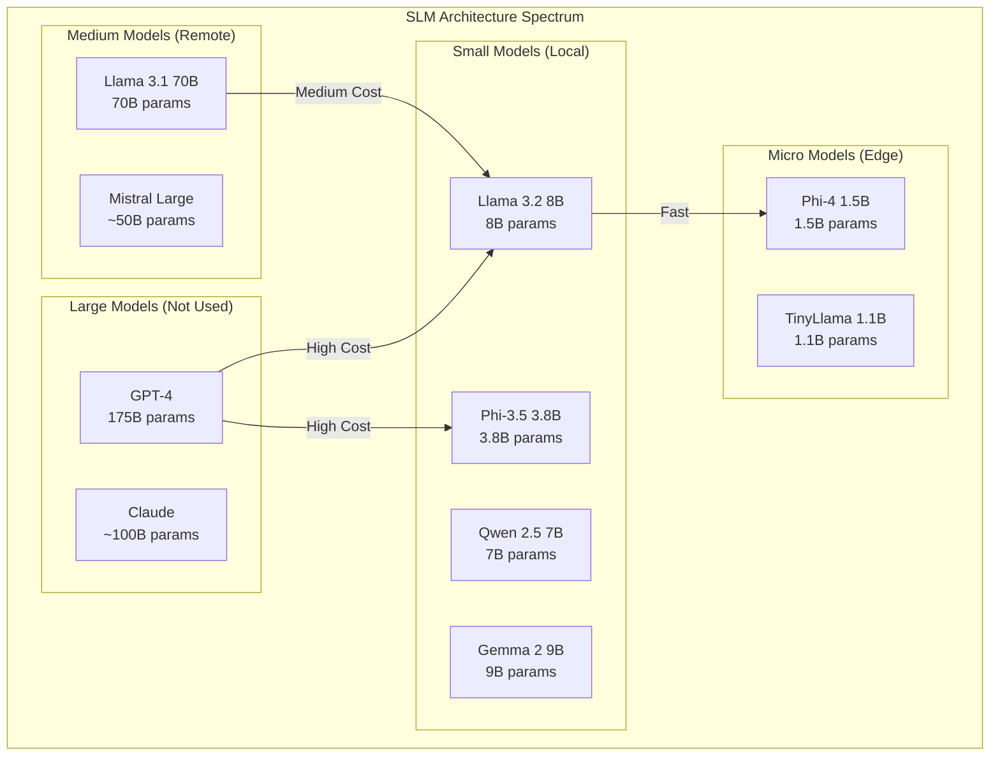
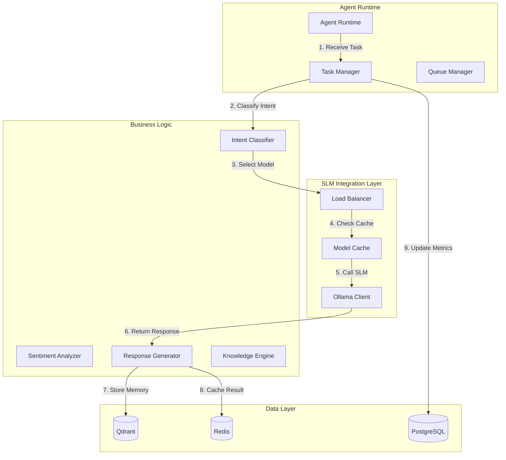

# Clase 27: Proyecto Company-in-a-Box - Parte 3

## Duración: 4 horas

---

## Objetivos de Aprendizaje

Al finalizar esta clase, el estudiante será capaz de:

1. **Implementar Small Language Models (SLMs)** optimizados para tareas específicas
2. **Realizar fine-tuning** de modelos base con datasets personalizados
3. **Integrar SLMs** con el sistema multi-agente existente
4. **Ejecutar testing de carga** para validar rendimiento
5. **Optimizar inferencia** para producción

---

## Contenidos Detallados

### 1. Fundamentos de Small Language Models (SLM) (45 minutos)

#### 1.1 Arquitecturas SLM para Producción



#### 1.2 Matriz de Selección de Modelos

```python
# models/model_selector.py
from dataclasses import dataclass
from typing import List, Dict, Optional
from enum import Enum

class TaskComplexity(Enum):
    TRIVIAL = 1      # Simple classification, extraction
    LOW = 2          # Basic Q&A, summarization
    MEDIUM = 3       # Complex reasoning, analysis
    HIGH = 4         # Multi-step reasoning, planning
    EXPERT = 5       # Research-grade analysis

class ModelCapability:
    def __init__(
        self,
        model_id: str,
        provider: str,  # "ollama", "openai", "anthropic"
        context_window: int,
        parameters: int,
        supported_languages: List[str],
        max_tokens: int,
        quantization: str = "fp16"
    ):
        self.model_id = model_id
        self.provider = provider
        self.context_window = context_window
        self.parameters = parameters
        self.supported_languages = supported_languages
        self.max_tokens = max_tokens
        self.quantization = quantization

MODEL_CATALOG: Dict[str, ModelCapability] = {
    # Local Models (Ollama)
    "llama3.2:3b": ModelCapability(
        model_id="llama3.2:3b",
        provider="ollama",
        context_window=128000,
        parameters=3_000_000_000,
        supported_languages=["en", "es", "fr", "de", "it", "pt"],
        max_tokens=4096,
        quantization="q4_K_M"
    ),
    "llama3.2:8b": ModelCapability(
        model_id="llama3.2:8b",
        provider="ollama",
        context_window=128000,
        parameters=8_000_000_000,
        supported_languages=["en", "es", "fr", "de", "it", "pt", "zh"],
        max_tokens=8192,
        quantization="q4_K_M"
    ),
    "llama3.2:70b": ModelCapability(
        model_id="llama3.2:70b",
        provider="ollama",
        context_window=128000,
        parameters=70_000_000_000,
        supported_languages=["en", "es", "fr", "de", "it", "pt", "zh", "ja", "ko", "ar"],
        max_tokens=16384,
        quantization="q4_K_M"
    ),
    "phi3.5:3.8b": ModelCapability(
        model_id="phi3.5:3.8b",
        provider="ollama",
        context_window=128000,
        parameters=3_800_000_000,
        supported_languages=["en"],
        max_tokens=4096,
        quantization="q4_K_M"
    ),
    "qwen2.5:7b": ModelCapability(
        model_id="qwen2.5:7b",
        provider="ollama",
        context_window=32768,
        parameters=7_000_000_000,
        supported_languages=["en", "zh", "es", "fr", "de", "ja", "ko"],
        max_tokens=8192,
        quantization="q4_K_M"
    ),
    "gemma2:9b": ModelCapability(
        model_id="gemma2:9b",
        provider="ollama",
        context_window=8192,
        parameters=9_000_000_000,
        supported_languages=["en", "de", "es", "fr", "it", "pt"],
        max_tokens=8192,
        quantization="q4_K_M"
    ),
    # External Models
    "gpt-4o-mini": ModelCapability(
        model_id="gpt-4o-mini",
        provider="openai",
        context_window=128000,
        parameters=0,  # Unknown
        supported_languages=["en", "es", "fr", "de", "it", "pt", "zh", "ja", "ko", "ar", "hi"],
        max_tokens=16384,
        quantization="n/a"
    ),
    "claude-3-haiku": ModelCapability(
        model_id="claude-3-haiku-3.5",
        provider="anthropic",
        context_window=200000,
        parameters=0,  # Unknown
        supported_languages=["en", "es", "fr", "de", "it", "pt", "zh", "ja", "ko"],
        max_tokens=4096,
        quantization="n/a"
    )
}

class TaskModelSelector:
    """Intelligent model selector based on task requirements."""
    
    TASK_REQUIREMENTS: Dict[str, Dict] = {
        "intent_classification": {
            "complexity": TaskComplexity.LOW,
            "latency_priority": "high",
            "cost_priority": "high",
            "languages": ["en"],
            "min_accuracy": 0.85
        },
        "sentiment_analysis": {
            "complexity": TaskComplexity.TRIVIAL,
            "latency_priority": "very_high",
            "cost_priority": "high",
            "languages": ["en", "es"],
            "min_accuracy": 0.80
        },
        "customer_support_response": {
            "complexity": TaskComplexity.MEDIUM,
            "latency_priority": "medium",
            "cost_priority": "medium",
            "languages": ["en", "es"],
            "min_accuracy": 0.90
        },
        "document_analysis": {
            "complexity": TaskComplexity.HIGH,
            "latency_priority": "low",
            "cost_priority": "low",
            "languages": ["en"],
            "min_accuracy": 0.92
        },
        "code_generation": {
            "complexity": TaskComplexity.HIGH,
            "latency_priority": "medium",
            "cost_priority": "low",
            "languages": ["en"],
            "min_accuracy": 0.85
        },
        "complex_reasoning": {
            "complexity": TaskComplexity.EXPERT,
            "latency_priority": "low",
            "cost_priority": "low",
            "languages": ["en"],
            "min_accuracy": 0.95
        }
    }
    
    def select_model(
        self,
        task_type: str,
        language: str = "en",
        latency_budget_ms: Optional[int] = None,
        cost_budget: Optional[float] = None
    ) -> Dict:
        """Select optimal model for a given task."""
        
        requirements = self.TASK_REQUIREMENTS.get(task_type, {})
        
        # Filter candidates by requirements
        candidates = []
        for model_id, capability in MODEL_CATALOG.items():
            # Language check
            if language not in capability.supported_languages:
                continue
            
            # Complexity check
            if self._estimate_complexity(capability) > requirements.get("complexity", TaskComplexity.HIGH):
                continue
            
            candidates.append({
                "model_id": model_id,
                "capability": capability,
                "estimated_latency": self._estimate_latency(capability, task_type),
                "estimated_cost": self._estimate_cost(capability, task_type),
                "score": self._calculate_score(capability, requirements, latency_budget_ms, cost_budget)
            })
        
        # Sort by score (descending)
        candidates.sort(key=lambda x: x["score"], reverse=True)
        
        if not candidates:
            return {"model_id": "gpt-4o-mini", "reason": "fallback", "provider": "openai"}
        
        best = candidates[0]
        return {
            "model_id": best["model_id"],
            "provider": best["capability"].provider,
            "estimated_latency_ms": best["estimated_latency"],
            "estimated_cost_per_1k": best["estimated_cost"],
            "confidence": best["score"]
        }
    
    def _estimate_complexity(self, capability: ModelCapability) -> TaskComplexity:
        """Estimate model complexity based on parameters."""
        if capability.parameters < 5_000_000_000:
            return TaskComplexity.TRIVIAL
        elif capability.parameters < 10_000_000_000:
            return TaskComplexity.LOW
        elif capability.parameters < 20_000_000_000:
            return TaskComplexity.MEDIUM
        elif capability.parameters < 50_000_000_000:
            return TaskComplexity.HIGH
        return TaskComplexity.EXPERT
    
    def _estimate_latency(self, capability: ModelCapability, task_type: str) -> float:
        """Estimate latency in ms based on model and task."""
        base_latency = {
            "ollama": capability.parameters / 1_000_000_000 * 100,  # ~100ms per billion params
            "openai": 500,
            "anthropic": 600
        }.get(capability.provider, 500)
        
        task_multipliers = {
            "intent_classification": 0.3,
            "sentiment_analysis": 0.2,
            "customer_support_response": 1.0,
            "document_analysis": 2.0,
            "code_generation": 1.5,
            "complex_reasoning": 3.0
        }
        
        return base_latency * task_multipliers.get(task_type, 1.0)
    
    def _estimate_cost(self, capability: ModelCapability, task_type: str) -> float:
        """Estimate cost per 1K tokens."""
        if capability.provider == "ollama":
            return 0.0  # Self-hosted
        elif capability.provider == "openai":
            return 0.15  # GPT-4o-mini
        elif capability.provider == "anthropic":
            return 0.25  # Claude Haiku
        
        return 0.0
    
    def _calculate_score(
        self,
        capability: ModelCapability,
        requirements: Dict,
        latency_budget: Optional[int],
        cost_budget: Optional[float]
    ) -> float:
        """Calculate overall score for model selection."""
        score = 0.0
        
        # Latency score (lower is better)
        latency_priority = requirements.get("latency_priority", "medium")
        estimated_latency = self._estimate_latency(capability, "default")
        
        if latency_priority == "very_high" and estimated_latency < 100:
            score += 30
        elif latency_priority == "high" and estimated_latency < 200:
            score += 25
        elif latency_priority == "medium" and estimated_latency < 1000:
            score += 20
        elif latency_priority == "low":
            score += 15
        
        # Cost score
        if capability.provider == "ollama":
            score += 25  # Free for self-hosted
        
        # Accuracy score based on model size
        complexity = self._estimate_complexity(capability)
        required_complexity = requirements.get("complexity", TaskComplexity.MEDIUM)
        
        if complexity.value <= required_complexity.value:
            score += 20
        elif complexity.value <= required_complexity.value + 1:
            score += 10
        
        # Language score
        if len(capability.supported_languages) > 5:
            score += 10
        
        return score
```

#### 1.3 Ollama API Integration

```python
# models/ollama_client.py
import aiohttp
import asyncio
from typing import Dict, List, Optional, AsyncIterator
from dataclasses import dataclass
import json
import base64
import httpx

@dataclass
class OllamaResponse:
    model: str
    response: str
    done: bool
    context: Optional[List[int]] = None
    total_duration: Optional[int] = None
    load_duration: Optional[int] = None
    prompt_eval_count: Optional[int] = None
    prompt_eval_duration: Optional[int] = None
    eval_count: Optional[int] = None
    eval_duration: Optional[int] = None

class OllamaClient:
    """Async client for Ollama API."""
    
    def __init__(
        self,
        base_url: str = "http://localhost:11434",
        default_model: str = "llama3.2:8b",
        timeout: float = 120.0
    ):
        self.base_url = base_url.rstrip("/")
        self.default_model = default_model
        self.timeout = aiohttp.ClientTimeout(total=timeout)
    
    async def generate(
        self,
        prompt: str,
        model: Optional[str] = None,
        system: Optional[str] = None,
        template: Optional[str] = None,
        context: Optional[List[int]] = None,
        stream: bool = False,
        options: Optional[Dict] = None
    ) -> OllamaResponse:
        """Generate response from model."""
        
        payload = {
            "model": model or self.default_model,
            "prompt": prompt,
            "stream": stream,
        }
        
        if system:
            payload["system"] = system
        if template:
            payload["template"] = template
        if context:
            payload["context"] = context
        if options:
            payload["options"] = options
        
        async with aiohttp.ClientSession(timeout=self.timeout) as session:
            async with session.post(
                f"{self.base_url}/api/generate",
                json=payload
            ) as response:
                if response.status != 200:
                    error = await response.text()
                    raise Exception(f"Ollama error: {error}")
                
                data = await response.json()
                return OllamaResponse(**data)
    
    async def generate_stream(
        self,
        prompt: str,
        model: Optional[str] = None,
        system: Optional[str] = None,
        options: Optional[Dict] = None
    ) -> AsyncIterator[str]:
        """Stream response from model."""
        
        payload = {
            "model": model or self.default_model,
            "prompt": prompt,
            "stream": True,
        }
        
        if system:
            payload["system"] = system
        if options:
            payload["options"] = options
        
        async with aiohttp.ClientSession(timeout=self.timeout) as session:
            async with session.post(
                f"{self.base_url}/api/generate",
                json=payload
            ) as response:
                if response.status != 200:
                    error = await response.text()
                    raise Exception(f"Ollama error: {error}")
                
                async for line in response.content:
                    if line:
                        data = json.loads(line)
                        yield data.get("response", "")
                        
                        if data.get("done"):
                            break
    
    async def chat(
        self,
        messages: List[Dict[str, str]],
        model: Optional[str] = None,
        stream: bool = False,
        options: Optional[Dict] = None
    ) -> OllamaResponse:
        """Chat completion with messages."""
        
        payload = {
            "model": model or self.default_model,
            "messages": messages,
            "stream": stream,
        }
        
        if options:
            payload["options"] = options
        
        async with aiohttp.ClientSession(timeout=self.timeout) as session:
            async with session.post(
                f"{self.base_url}/api/chat",
                json=payload
            ) as response:
                if response.status != 200:
                    error = await response.text()
                    raise Exception(f"Ollama error: {error}")
                
                data = await response.json()
                return OllamaResponse(
                    model=data["model"],
                    response=data["message"]["content"],
                    done=data.get("done", True),
                    context=data.get("context")
                )
    
    async def embeddings(
        self,
        prompt: str,
        model: Optional[str] = None,
        options: Optional[Dict] = None
    ) -> List[float]:
        """Generate embeddings for text."""
        
        payload = {
            "model": model or self.default_model,
            "prompt": prompt,
        }
        
        if options:
            payload["options"] = options
        
        async with aiohttp.ClientSession(timeout=self.timeout) as session:
            async with session.post(
                f"{self.base_url}/api/embeddings",
                json=payload
            ) as response:
                if response.status != 200:
                    error = await response.text()
                    raise Exception(f"Ollama error: {error}")
                
                data = await response.json()
                return data["embedding"]
    
    async def list_models(self) -> List[Dict]:
        """List available models."""
        
        async with aiohttp.ClientSession(timeout=self.timeout) as session:
            async with session.get(f"{self.base_url}/api/tags") as response:
                if response.status != 200:
                    error = await response.text()
                    raise Exception(f"Ollama error: {error}")
                
                data = await response.json()
                return data.get("models", [])
    
    async def pull_model(self, model: str, stream: bool = True):
        """Pull a model from Ollama registry."""
        
        payload = {
            "name": model,
            "stream": stream,
        }
        
        async with aiohttp.ClientSession(timeout=aiohttp.ClientTimeout(total=3600)) as session:
            async with session.post(
                f"{self.base_url}/api/pull",
                json=payload
            ) as response:
                if response.status != 200:
                    error = await response.text()
                    raise Exception(f"Ollama error: {error}")
                
                if stream:
                    async for line in response.content:
                        if line:
                            data = json.loads(line)
                            yield data
                else:
                    return await response.json()
    
    async def create_model(
        self,
        name: str,
        modelfile: str,
        stream: bool = False
    ):
        """Create a model from a Modelfile."""
        
        payload = {
            "name": name,
            "modelfile": modelfile,
            "stream": stream,
        }
        
        async with aiohttp.ClientSession(timeout=aiohttp.ClientTimeout(total=3600)) as session:
            async with session.post(
                f"{self.base_url}/api/create",
                json=payload
            ) as response:
                if response.status != 200:
                    error = await response.text()
                    raise Exception(f"Ollama error: {error}")
                
                if stream:
                    async for line in response.content:
                        if line:
                            data = json.loads(line)
                            yield data
                else:
                    return await response.json()
```

---

### 2. Fine-tuning de SLMs (60 minutos)

#### 2.1 Preparación de Datos

```python
# training/data_preparation.py
import json
from typing import List, Dict, Optional
from dataclasses import dataclass
from pathlib import Path
import random

@dataclass
class TrainingExample:
    """Single training example for fine-tuning."""
    instruction: str
    input: str
    output: str
    system_prompt: Optional[str] = None

class DatasetFormatter:
    """Format datasets for different fine-tuning approaches."""
    
    @staticmethod
    def format_for_llama(instruction: str, input_text: str, output: str) -> str:
        """Format for LLaMA-style models using chat template."""
        return f"""<|begin_of_text|><|start_header_id|>system<|end_header_id|>

You are a helpful AI assistant for Company-in-a-Box.<|eot_id|>
<|start_header_id|>user<|end_header_id|>

{instruction}
{input_text}<|eot_id|>
<|start_header_id|>assistant<|end_header_id|>

{output}<|eot_id|><|end_of_text|>"""
    
    @staticmethod
    def format_for_qwen(instruction: str, input_text: str, output: str) -> str:
        """Format for Qwen models."""
        return f"""<|im_start|>system
You are a helpful AI assistant for Company-in-a-Box.<|im_end|>
<|im_start|>user
{instruction}
{input_text}<|im_end|>
<|im_start|>assistant
{output}<|im_end|>"""
    
    @staticmethod
    def format_for_phi(instruction: str, input_text: str, output: str) -> str:
        """Format for Phi models."""
        return f"""<|system|>{instruction}<|end|>
<|user|>{input_text}<|end|>
<|assistant|>{output}<|end|>"""

class CompanyBoxDatasetGenerator:
    """Generate training datasets for Company-in-a-Box agents."""
    
    def __init__(self, output_dir: Path):
        self.output_dir = Path(output_dir)
        self.output_dir.mkdir(parents=True, exist_ok=True)
    
    def generate_intent_classification_data(self, num_examples: int = 1000) -> List[TrainingExample]:
        """Generate synthetic intent classification data."""
        
        intents = [
            ("pricing_inquiry", "Customer asking about pricing", [
                "What is the pricing for your plans?",
                "How much does the enterprise plan cost?",
                "Are there any discounts available?",
                "Can I get a quote for custom requirements?"
            ]),
            ("feature_request", "Customer asking about features", [
                "What features does the platform have?",
                "Does it support API integration?",
                "Can I customize the workflow?",
                "Is there a mobile app?"
            ]),
            ("technical_support", "Customer having technical issues", [
                "I'm getting an error when trying to login",
                "The dashboard is not loading",
                "My export is failing",
                "How do I reset my password?"
            ]),
            ("billing_inquiry", "Customer asking about billing", [
                "When will I be charged?",
                "Can I change my payment method?",
                "I need an invoice for my records",
                "Why was I charged twice?"
            ]),
            ("cancel_subscription", "Customer wanting to cancel", [
                "I want to cancel my subscription",
                "How do I stop being charged?",
                "Can I pause my account instead?"
            ]),
            ("lead_qualification", "Lead scoring and qualification", [
                "What company size are you?",
                "What industry are you in?",
                "What's your primary use case?",
                "What's your timeline for implementation?"
            ])
        ]
        
        examples = []
        for intent_name, intent_description, templates in intents:
            for _ in range(num_examples // len(intents)):
                template = random.choice(templates)
                variation = self._generate_variation(template)
                
                examples.append(TrainingExample(
                    instruction=f"Classify the customer query into one of these intents: pricing_inquiry, feature_request, technical_support, billing_inquiry, cancel_subscription, lead_qualification. The intent is: {intent_name}.",
                    input=variation,
                    output=f'{{"intent": "{intent_name}", "confidence": {random.uniform(0.85, 0.99):.2f}}}'
                ))
        
        random.shuffle(examples)
        return examples
    
    def generate_sentiment_data(self, num_examples: int = 500) -> List[TrainingExample]:
        """Generate sentiment analysis data."""
        
        sentiments = {
            "positive": [
                "This is exactly what I needed!",
                "Great product, highly recommend!",
                "The support team was incredibly helpful",
                "We've seen amazing results since implementing this"
            ],
            "neutral": [
                "I have a question about the pricing",
                "Can you send me more information?",
                "What are the system requirements?",
                "When will the next feature be released?"
            ],
            "negative": [
                "This is frustrating, I've been waiting for days",
                "The service has been down for hours",
                "I'm very disappointed with the recent changes",
                "This doesn't work as advertised"
            ]
        }
        
        examples = []
        for sentiment, templates in sentiments.items():
            for _ in range(num_examples // 3):
                template = random.choice(templates)
                variation = self._generate_variation(template)
                
                score = {"positive": 0.8, "neutral": 0.0, "negative": -0.8}[sentiment]
                
                examples.append(TrainingExample(
                    instruction="Analyze the sentiment of the customer message. Return sentiment (positive/neutral/negative), score (-1 to 1), and key phrases.",
                    input=variation,
                    output=json.dumps({
                        "sentiment": sentiment,
                        "score": score + random.uniform(-0.1, 0.1),
                        "confidence": random.uniform(0.80, 0.95),
                        "key_phrases": self._extract_key_phrases(variation)
                    })
                ))
        
        random.shuffle(examples)
        return examples
    
    def generate_response_generation_data(self, num_examples: int = 500) -> List[TrainingExample]:
        """Generate customer response generation data."""
        
        scenarios = [
            {
                "intent": "pricing_inquiry",
                "context": "The customer is interested in our pricing",
                "responses": [
                    "Thank you for your interest in our services! Our plans start at $99/month for the Starter tier. Would you like me to provide more details about our pricing tiers?",
                    "Great question! We offer flexible pricing based on your team size. I can offer you a custom quote if you share more about your requirements."
                ]
            },
            {
                "intent": "technical_support",
                "context": "The customer has a technical issue",
                "responses": [
                    "I'm sorry to hear you're experiencing this issue. Let me help you troubleshoot. Could you please provide more details about the error message you're seeing?",
                    "I understand how frustrating technical issues can be. Our technical team is available 24/7 to assist you. Would you like me to escalate this to them?"
                ]
            },
            {
                "intent": "feature_request",
                "context": "The customer is asking about features",
                "responses": [
                    "Thank you for your interest in our features! We offer API integration, custom workflows, and extensive reporting capabilities. Which features are most important to you?",
                    "That's a great question! We continuously add new features based on customer feedback. I'll make sure to add your suggestion to our feature request list."
                ]
            }
        ]
        
        examples = []
        for scenario in scenarios:
            for _ in range(num_examples // len(scenarios)):
                response = random.choice(scenario["responses"])
                
                examples.append(TrainingExample(
                    instruction=f"Generate a helpful customer service response. Context: {scenario['context']}",
                    input=f"Customer query: {self._generate_customer_query(scenario['intent'])}",
                    output=response
                ))
        
        random.shuffle(examples)
        return examples
    
    def _generate_variation(self, text: str) -> str:
        """Generate a variation of the text."""
        variations = [
            lambda t: t.upper(),
            lambda t: t.lower(),
            lambda t: f"Please {t.lower()}",
            lambda t: f"Hi, {t.lower()}",
            lambda t: f"Hey there! {t}",
            lambda t: f"Sorry, but {t.lower()}",
            lambda t: f"Quick question: {t}",
            lambda t: f"I was wondering if {t.lower().rsplit('?', 1)[0]}?",
        ]
        return random.choice(variations)(text)
    
    def _extract_key_phrases(self, text: str) -> List[str]:
        """Extract key phrases from text (simplified)."""
        words = text.lower().replace("!", "").replace("?", "").split()
        stop_words = {"the", "a", "an", "is", "are", "was", "were", "i", "you", "we", "this", "that", "to", "for"}
        return [w for w in words if w not in stop_words and len(w) > 3][:5]
    
    def _generate_customer_query(self, intent: str) -> str:
        """Generate a sample customer query based on intent."""
        queries = {
            "pricing_inquiry": [
                "What does your premium plan cost?",
                "Do you have any annual discounts?"
            ],
            "technical_support": [
                "I'm getting a 500 error when I try to login",
                "The export is not working properly"
            ],
            "feature_request": [
                "Does this integrate with Salesforce?",
                "Can I add custom fields to the forms?"
            ]
        }
        return random.choice(queries.get(intent, ["How can I help?"]))
    
    def export_to_jsonl(
        self,
        examples: List[TrainingExample],
        filename: str,
        format_type: str = "llama"
    ) -> Path:
        """Export examples to JSONL format."""
        
        formatters = {
            "llama": DatasetFormatter.format_for_llama,
            "qwen": DatasetFormatter.format_for_qwen,
            "phi": DatasetFormatter.format_for_phi,
        }
        
        formatter = formatters.get(format_type, formatters["llama"])
        output_file = self.output_dir / filename
        
        with open(output_file, "w", encoding="utf-8") as f:
            for example in examples:
                formatted = formatter(
                    example.instruction,
                    example.input,
                    example.output
                )
                f.write(json.dumps({"text": formatted}) + "\n")
        
        print(f"Exported {len(examples)} examples to {output_file}")
        return output_file
```

#### 2.2 Modelfile para Fine-tuning

```dockerfile
# Dockerfile.training
FROM nvidia/cuda:12.1.1-runtime-ubuntu22.04

ENV DEBIAN_FRONTEND=noninteractive
ENV PYTHONUNBUFFERED=1

RUN apt-get update && apt-get install -y \
    python3.11 \
    python3-pip \
    git \
    curl \
    && rm -rf /var/lib/apt/lists/*

RUN pip3 install --no-cache-dir \
    torch==2.2.0 \
    transformers==4.38.0 \
    datasets==2.16.0 \
    accelerate==0.26.0 \
    peft==0.8.0 \
    bitsandbytes==0.41.0 \
    trl==0.7.10 \
    wandb==0.16.0 \
    tqdm==4.66.0

WORKDIR /training

COPY . .

ENTRYPOINT ["python3", "-m", "training.train"]
```

```python
# training/finetune.py
import torch
from transformers import (
    AutoModelForCausalLM,
    AutoTokenizer,
    BitsAndBytesConfig,
    TrainingArguments,
    Trainer,
    DataCollatorForLanguageModeling
)
from peft import LoraConfig, get_peft_model, prepare_model_for_kbit_training
from datasets import load_dataset
import argparse
from pathlib import Path

def setup_quantization():
    """Setup 4-bit quantization for memory efficiency."""
    bnb_config = BitsAndBytesConfig(
        load_in_4bit=True,
        bnb_4bit_quant_type="nf4",
        bnb_4bit_compute_dtype=torch.bfloat16,
        bnb_4bit_use_double_quant=True,
    )
    return bnb_config

def load_model_and_tokenizer(model_name: str, use_quantization: bool = True):
    """Load model with quantization if requested."""
    
    tokenizer = AutoTokenizer.from_pretrained(
        model_name,
        trust_remote_code=True
    )
    tokenizer.pad_token = tokenizer.eos_token
    
    quantization_config = setup_quantization() if use_quantization else None
    
    model = AutoModelForCausalLM.from_pretrained(
        model_name,
        quantization_config=quantization_config,
        device_map="auto",
        trust_remote_code=True
    )
    
    model = prepare_model_for_kbit_training(model)
    
    return model, tokenizer

def setup_lora(model, lora_r: int = 64, lora_alpha: int = 16, lora_dropout: float = 0.1):
    """Setup LoRA adapters."""
    
    lora_config = LoraConfig(
        r=lora_r,
        lora_alpha=lora_alpha,
        target_modules=["q_proj", "v_proj", "k_proj", "o_proj", "gate_proj", "up_proj", "down_proj"],
        lora_dropout=lora_dropout,
        bias="none",
        task_type="CAUSAL_LM"
    )
    
    model = get_peft_model(model, lora_config)
    model.print_trainable_parameters()
    
    return model

def tokenize_function(examples, tokenizer, max_length: int = 2048):
    """Tokenize examples for training."""
    result = tokenizer(
        examples["text"],
        truncation=True,
        max_length=max_length,
        padding="max_length"
    )
    result["labels"] = result["input_ids"].copy()
    return result

def train(
    model_name: str,
    train_file: str,
    output_dir: str,
    num_epochs: int = 3,
    per_device_train_batch_size: int = 4,
    learning_rate: float = 2e-4,
    warmup_steps: int = 100,
    lora_r: int = 64
):
    """Main training function."""
    
    print(f"Loading model: {model_name}")
    model, tokenizer = load_model_and_tokenizer(model_name)
    
    print("Setting up LoRA adapters")
    model = setup_lora(model, lora_r=lora_r)
    
    print(f"Loading dataset from {train_file}")
    dataset = load_dataset("json", data_files=train_file, split="train")
    dataset = dataset.train_test_split(test_size=0.1)
    
    print("Tokenizing dataset")
    tokenized_dataset = dataset.map(
        lambda x: tokenize_function(x, tokenizer),
        batched=True,
        remove_columns=["text"]
    )
    
    training_args = TrainingArguments(
        output_dir=output_dir,
        num_train_epochs=num_epochs,
        per_device_train_batch_size=per_device_train_batch_size,
        gradient_accumulation_steps=4,
        learning_rate=learning_rate,
        warmup_steps=warmup_steps,
        logging_steps=10,
        save_steps=500,
        eval_steps=500,
        evaluation_strategy="steps",
        fp16=True,
        optim="paged_adamw_8bit",
        report_to="wandb",
        remove_unused_columns=False,
    )
    
    trainer = Trainer(
        model=model,
        args=training_args,
        train_dataset=tokenized_dataset["train"],
        eval_dataset=tokenized_dataset["test"],
        data_collator=DataCollatorForLanguageModeling(tokenizer, mlm=False),
    )
    
    print("Starting training")
    trainer.train()
    
    print(f"Saving model to {output_dir}")
    trainer.save_model(output_dir)
    tokenizer.save_pretrained(output_dir)

if __name__ == "__main__":
    parser = argparse.ArgumentParser()
    parser.add_argument("--model", default="meta-llama/Llama-3.2-8B-Instruct")
    parser.add_argument("--train_file", required=True)
    parser.add_argument("--output_dir", required=True)
    parser.add_argument("--epochs", type=int, default=3)
    parser.add_argument("--batch_size", type=int, default=4)
    parser.add_argument("--lora_r", type=int, default=64)
    
    args = parser.parse_args()
    
    train(
        model_name=args.model,
        train_file=args.train_file,
        output_dir=args.output_dir,
        num_epochs=args.epochs,
        per_device_train_batch_size=args.batch_size,
        lora_r=args.lora_r
    )
```

---

### 3. Integración con Sistemas (45 minutos)



```python
# agents/sentiment_agent.py
from typing import Dict, List, Optional
from dataclasses import dataclass
from models.ollama_client import OllamaClient
from models.model_selector import TaskModelSelector
import numpy as np

@dataclass
class SentimentResult:
    sentiment: str
    score: float
    confidence: float
    key_phrases: List[str]

class SentimentAgent:
    """Agent for real-time sentiment analysis using SLM."""
    
    SYSTEM_PROMPT = """You are a sentiment analysis expert. Analyze the customer message and determine:
1. Sentiment: positive, neutral, or negative
2. Score: a float from -1 (very negative) to 1 (very positive)
3. Confidence: how confident you are in this assessment (0 to 1)
4. Key phrases: important phrases that convey sentiment

Return your analysis as a JSON object."""

    PROMPT_TEMPLATE = """Analyze this customer message:

Message: "{message}"

Channel: {channel}
Timestamp: {timestamp}

Provide your sentiment analysis."""

    def __init__(
        self,
        ollama_client: OllamaClient,
        model_selector: TaskModelSelector
    ):
        self.ollama_client = ollama_client
        self.model_selector = model_selector
        
        # Model selection for different scenarios
        self.fast_model = "phi3.5:3.8b"  # Quick sentiment
        self.accurate_model = "llama3.2:8b"  # Detailed analysis
    
    async def analyze(
        self,
        message: str,
        channel: str = "web",
        timestamp: str = None,
        use_fast_model: bool = True
    ) -> SentimentResult:
        """Analyze sentiment of a message."""
        
        # Select model based on requirements
        model = self.fast_model if use_fast_model else self.accurate_model
        
        # Build prompt
        prompt = self.PROMPT_TEMPLATE.format(
            message=message,
            channel=channel,
            timestamp=timestamp or "now"
        )
        
        # Call SLM
        response = await self.ollama_client.generate(
            prompt=prompt,
            model=model,
            system=self.SYSTEM_PROMPT,
            options={
                "temperature": 0.1,  # Low temperature for classification
                "num_predict": 500
            }
        )
        
        # Parse response
        return self._parse_response(response.response)
    
    def _parse_response(self, response_text: str) -> SentimentResult:
        """Parse JSON response from model."""
        import json
        import re
        
        # Extract JSON from response
        json_match = re.search(r'\{[^}]+\}', response_text, re.DOTALL)
        if json_match:
            data = json.loads(json_match.group())
            return SentimentResult(
                sentiment=data.get("sentiment", "neutral"),
                score=float(data.get("score", 0.0)),
                confidence=float(data.get("confidence", 0.5)),
                key_phrases=data.get("key_phrases", [])
            )
        
        # Fallback
        return SentimentResult(
            sentiment="neutral",
            score=0.0,
            confidence=0.0,
            key_phrases=[]
        )
    
    async def batch_analyze(
        self,
        messages: List[Dict]
    ) -> List[SentimentResult]:
        """Analyze multiple messages concurrently."""
        import asyncio
        
        tasks = [
            self.analyze(
                msg["content"],
                msg.get("channel", "web"),
                msg.get("timestamp")
            )
            for msg in messages
        ]
        
        return await asyncio.gather(*tasks)

class IntentClassifierAgent:
    """Agent for intent classification using SLM."""
    
    SYSTEM_PROMPT = """You are an expert intent classifier for customer service. Classify the customer message into ONE of the following intents:

- pricing_inquiry: Questions about pricing, plans, costs
- feature_request: Questions about features, capabilities
- technical_support: Issues, errors, troubleshooting
- billing_inquiry: Questions about billing, payments, invoices
- cancel_subscription: Intent to cancel or downgrade
- lead_qualification: Questions to qualify a lead
- general_inquiry: Other questions

Return your classification as a JSON object with:
- intent: the classified intent
- confidence: how confident you are (0 to 1)
- entities: key entities mentioned (company size, timeline, etc.)"""

    INTENTS = [
        "pricing_inquiry",
        "feature_request",
        "technical_support",
        "billing_inquiry",
        "cancel_subscription",
        "lead_qualification",
        "general_inquiry"
    ]
    
    def __init__(
        self,
        ollama_client: OllamaClient,
        model_selector: TaskModelSelector
    ):
        self.ollama_client = ollama_client
        self.model_selector = model_selector
        self.model = "llama3.2:8b"
    
    async def classify(
        self,
        message: str,
        context: Optional[Dict] = None
    ) -> Dict:
        """Classify the intent of a message."""
        
        prompt = f"""Classify this customer message:

"{message}"

"""
        
        if context:
            prompt += f"Context: {context.get('previous_intents', 'None')}\n"
        
        response = await self.ollama_client.generate(
            prompt=prompt,
            model=self.model,
            system=self.SYSTEM_PROMPT,
            options={
                "temperature": 0.1,
                "num_predict": 300
            }
        )
        
        return self._parse_response(response.response)
    
    def _parse_response(self, response_text: str) -> Dict:
        """Parse JSON response from model."""
        import json
        import re
        
        json_match = re.search(r'\{[^}]+\}', response_text, re.DOTALL)
        if json_match:
            return json.loads(json_match.group())
        
        return {
            "intent": "general_inquiry",
            "confidence": 0.0,
            "entities": []
        }
```

---

### 4. Testing de Carga (45 minutos)

```python
# tests/load/slm_load_test.py
import asyncio
import time
import statistics
from typing import List, Dict
from dataclasses import dataclass
from models.ollama_client import OllamaClient

@dataclass
class LoadTestResult:
    total_requests: int
    successful: int
    failed: int
    avg_latency_ms: float
    p50_latency_ms: float
    p95_latency_ms: float
    p99_latency_ms: float
    throughput_rps: float

class SLMLoadTester:
    """Load tester for SLM inference."""
    
    def __init__(
        self,
        ollama_client: OllamaClient,
        test_prompts: List[str]
    ):
        self.client = ollama_client
        self.prompts = test_prompts
    
    async def run_load_test(
        self,
        concurrent_users: int = 10,
        requests_per_user: int = 50,
        model: str = "llama3.2:8b"
    ) -> LoadTestResult:
        """Run load test with specified parameters."""
        
        print(f"Starting load test: {concurrent_users} concurrent users, "
              f"{requests_per_user} requests each")
        
        latencies: List[float] = []
        successes = 0
        failures = 0
        
        async def user_session(user_id: int):
            nonlocal successes, failures
            
            for i in range(requests_per_user):
                prompt = self.prompts[i % len(self.prompts)]
                
                try:
                    start = time.time()
                    await self.client.generate(
                        prompt=prompt,
                        model=model,
                        options={"temperature": 0.7, "num_predict": 200}
                    )
                    latency = (time.time() - start) * 1000
                    latencies.append(latency)
                    successes += 1
                except Exception as e:
                    failures += 1
                    print(f"User {user_id} request {i} failed: {e}")
        
        start_time = time.time()
        
        # Run concurrent user sessions
        tasks = [user_session(i) for i in range(concurrent_users)]
        await asyncio.gather(*tasks)
        
        total_time = time.time() - start_time
        
        # Calculate statistics
        latencies.sort()
        
        return LoadTestResult(
            total_requests=successes + failures,
            successful=successes,
            failed=failures,
            avg_latency_ms=statistics.mean(latencies),
            p50_latency_ms=latencies[int(len(latencies) * 0.50)],
            p95_latency_ms=latencies[int(len(latencies) * 0.95)],
            p99_latency_ms=latencies[int(len(latencies) * 0.99)],
            throughput_rps=successes / total_time
        )

async def main():
    """Run load test scenarios."""
    
    client = OllamaClient(base_url="http://localhost:11434")
    
    test_prompts = [
        "What is the capital of France?",
        "Explain quantum computing in simple terms.",
        "Write a haiku about artificial intelligence.",
        "What are the main benefits of renewable energy?",
        "Describe the water cycle.",
    ]
    
    tester = SLMLoadTester(client, test_prompts)
    
    # Test scenarios
    scenarios = [
        {"users": 5, "requests": 20},
        {"users": 10, "requests": 50},
        {"users": 20, "requests": 25},
    ]
    
    for scenario in scenarios:
        print(f"\n{'='*50}")
        print(f"Scenario: {scenario['users']} users, "
              f"{scenario['requests']} requests each")
        print('='*50)
        
        result = await tester.run_load_test(
            concurrent_users=scenario["users"],
            requests_per_user=scenario["requests"],
            model="llama3.2:8b"
        )
        
        print(f"\nResults:")
        print(f"  Total requests: {result.total_requests}")
        print(f"  Successful: {result.successful}")
        print(f"  Failed: {result.failed}")
        print(f"  Success rate: {result.successful/result.total_requests*100:.1f}%")
        print(f"  Throughput: {result.throughput_rps:.2f} req/s")
        print(f"  Latency avg: {result.avg_latency_ms:.2f}ms")
        print(f"  Latency p50: {result.p50_latency_ms:.2f}ms")
        print(f"  Latency p95: {result.p95_latency_ms:.2f}ms")
        print(f"  Latency p99: {result.p99_latency_ms:.2f}ms")
        
        await asyncio.sleep(5)  # Cool down between scenarios

if __name__ == "__main__":
    asyncio.run(main())
```

---

### 5. Ejercicios Prácticos (45 minutos)

#### Ejercicio: Implementar Sistema de Selección de Modelo Dinámico

**Enunciado:**
Implementar un sistema que seleccione automáticamente entre modelos locales y remotos basándose en requisitos de latencia y costo.

**Solución:**

```python
# exercise/dynamic_model_selector.py
import asyncio
from typing import Dict, List, Optional, Callable
from dataclasses import dataclass
from enum import Enum
import time
from models.ollama_client import OllamaClient
import httpx

class ModelType(Enum):
    LOCAL = "local"
    REMOTE = "remote"

@dataclass
class ModelInfo:
    model_id: str
    model_type: ModelType
    endpoint: str
    avg_latency_ms: float
    cost_per_1k_tokens: float
    max_tokens: int
    is_available: bool = True

class DynamicModelSelector:
    """Dynamic model selector with fallback and optimization."""
    
    def __init__(self):
        self.models: Dict[str, ModelInfo] = {}
        self.metrics: Dict[str, List[float]] = {}
        self.fallback_chain: Dict[str, List[str]] = {}
        
        self._init_models()
    
    def _init_models(self):
        """Initialize available models."""
        
        # Local models (Ollama)
        self.models["llama3.2:3b"] = ModelInfo(
            model_id="llama3.2:3b",
            model_type=ModelType.LOCAL,
            endpoint="http://ollama:11434",
            avg_latency_ms=500,
            cost_per_1k_tokens=0.0,
            max_tokens=4096
        )
        
        self.models["llama3.2:8b"] = ModelInfo(
            model_id="llama3.2:8b",
            model_type=ModelType.LOCAL,
            endpoint="http://ollama:11434",
            avg_latency_ms=1500,
            cost_per_1k_tokens=0.0,
            max_tokens=8192
        )
        
        self.models["phi3.5:3.8b"] = ModelInfo(
            model_id="phi3.5:3.8b",
            model_type=ModelType.LOCAL,
            endpoint="http://ollama:11434",
            avg_latency_ms=400,
            cost_per_1k_tokens=0.0,
            max_tokens=4096
        )
        
        # Remote models
        self.models["gpt-4o-mini"] = ModelInfo(
            model_id="gpt-4o-mini",
            model_type=ModelType.REMOTE,
            endpoint="https://api.openai.com/v1",
            avg_latency_ms=800,
            cost_per_1k_tokens=0.15,
            max_tokens=16384
        )
        
        self.models["claude-haiku"] = ModelInfo(
            model_id="claude-3-haiku-3.5",
            model_type=ModelType.REMOTE,
            endpoint="https://api.anthropic.com/v1",
            avg_latency_ms=1000,
            cost_per_1k_tokens=0.25,
            max_tokens=4096
        )
        
        # Define fallback chains
        self.fallback_chain["llama3.2:3b"] = ["phi3.5:3.8b", "gpt-4o-mini"]
        self.fallback_chain["llama3.2:8b"] = ["llama3.2:3b", "gpt-4o-mini"]
        self.fallback_chain["phi3.5:3.8b"] = ["llama3.2:3b", "claude-haiku"]
        self.fallback_chain["gpt-4o-mini"] = ["claude-haiku"]
    
    async def select_model(
        self,
        task_complexity: str,  # "low", "medium", "high"
        latency_budget_ms: Optional[int] = None,
        cost_budget: Optional[float] = None,
        prefer_local: bool = True
    ) -> ModelInfo:
        """Select optimal model based on requirements."""
        
        candidates = []
        
        for model_id, model in self.models.items():
            if not model.is_available:
                continue
            
            # Filter by latency
            if latency_budget_ms and model.avg_latency_ms > latency_budget_ms:
                continue
            
            # Filter by cost
            if cost_budget and model.cost_per_1k_tokens > cost_budget:
                continue
            
            # Filter by complexity
            if task_complexity == "low" and model.model_type == ModelType.REMOTE and prefer_local:
                continue  # Prefer local for simple tasks
            
            candidates.append(model)
        
        if not candidates:
            # Fallback to any available model
            candidates = [m for m in self.models.values() if m.is_available]
        
        if not candidates:
            raise Exception("No available models")
        
        # Sort by preference
        candidates.sort(key=lambda m: (
            not prefer_local or m.model_type == ModelType.LOCAL,  # Prefer local if requested
            m.avg_latency_ms,  # Then by latency
            m.cost_per_1k_tokens  # Then by cost
        ))
        
        return candidates[0]
    
    async def execute_with_fallback(
        self,
        prompt: str,
        primary_model_id: str,
        options: Optional[Dict] = None,
        timeout_ms: int = 5000
    ) -> Dict:
        """Execute with fallback on failure."""
        
        fallback_models = self.fallback_chain.get(primary_model_id, [])
        all_models = [primary_model_id] + fallback_models
        
        last_error = None
        
        for model_id in all_models:
            model = self.models.get(model_id)
            if not model or not model.is_available:
                continue
            
            try:
                start_time = time.time()
                
                if model.model_type == ModelType.LOCAL:
                    result = await self._call_ollama(model, prompt, options, timeout_ms)
                else:
                    result = await self._call_remote(model, prompt, options, timeout_ms)
                
                latency = (time.time() - start_time) * 1000
                
                # Record metrics
                self._record_latency(model_id, latency)
                
                return {
                    "success": True,
                    "model_id": model_id,
                    "result": result,
                    "latency_ms": latency
                }
                
            except Exception as e:
                last_error = e
                print(f"Model {model_id} failed: {e}")
                continue
        
        return {
            "success": False,
            "error": str(last_error)
        }
    
    async def _call_ollama(
        self,
        model: ModelInfo,
        prompt: str,
        options: Optional[Dict],
        timeout_ms: int
    ) -> str:
        """Call Ollama API."""
        async with httpx.AsyncClient(timeout=timeout_ms/1000) as client:
            response = await client.post(
                f"{model.endpoint}/api/generate",
                json={
                    "model": model.model_id,
                    "prompt": prompt,
                    "stream": False,
                    "options": options or {}
                }
            )
            response.raise_for_status()
            return response.json()["response"]
    
    async def _call_remote(
        self,
        model: ModelInfo,
        prompt: str,
        options: Optional[Dict],
        timeout_ms: int
    ) -> str:
        """Call remote API (OpenAI compatible)."""
        async with httpx.AsyncClient(timeout=timeout_ms/1000) as client:
            response = await client.post(
                f"{model.endpoint}/chat/completions",
                headers={"Authorization": f"Bearer {self._get_api_key(model.model_id)}"},
                json={
                    "model": model.model_id,
                    "messages": [{"role": "user", "content": prompt}],
                    "max_tokens": options.get("num_predict", 1000) if options else 1000,
                    "temperature": options.get("temperature", 0.7) if options else 0.7
                }
            )
            response.raise_for_status()
            return response.json()["choices"][0]["message"]["content"]
    
    def _get_api_key(self, model_id: str) -> str:
        """Get API key for remote models (implement secure retrieval)."""
        return "sk-dummy-key"
    
    def _record_latency(self, model_id: str, latency_ms: float):
        """Record latency metric."""
        if model_id not in self.metrics:
            self.metrics[model_id] = []
        self.metrics[model_id].append(latency_ms)
        
        # Keep only last 100 measurements
        if len(self.metrics[model_id]) > 100:
            self.metrics[model_id] = self.metrics[model_id][-100:]
        
        # Update average
        if model_id in self.models:
            avg = sum(self.metrics[model_id]) / len(self.metrics[model_id])
            self.models[model_id].avg_latency_ms = avg

async def main():
    """Demo of dynamic model selection."""
    
    selector = DynamicModelSelector()
    
    test_cases = [
        {"complexity": "low", "latency_budget": 1000, "prefer_local": True},
        {"complexity": "high", "latency_budget": 5000, "prefer_local": False},
        {"complexity": "medium", "latency_budget": 2000, "prefer_local": True},
    ]
    
    for i, case in enumerate(test_cases):
        print(f"\nTest case {i+1}: {case}")
        
        model = await selector.select_model(
            task_complexity=case["complexity"],
            latency_budget_ms=case["latency_budget"],
            prefer_local=case["prefer_local"]
        )
        
        print(f"Selected model: {model.model_id} ({model.model_type.value})")
        print(f"Estimated latency: {model.avg_latency_ms:.0f}ms")
        print(f"Cost per 1K tokens: ${model.cost_per_1k_tokens:.4f}")

if __name__ == "__main__":
    asyncio.run(main())
```

---

## Tecnologías Específicas

| Categoría | Tecnología | Versión | Uso |
|-----------|------------|---------|-----|
| SLM Runtime | Ollama | 0.1.x | Local model serving |
| Fine-tuning | LLaMA Factory | Latest | Model training |
| LoRA | peft | 0.8+ | Parameter efficient tuning |
| Quantization | bitsandbytes | 0.41+ | Model quantization |
| Embeddings | sentence-transformers | 2.2+ | Text embeddings |
| Vector DB | Qdrant | 1.7+ | Semantic search |
| Monitoring | Prometheus | 2.x | Metrics collection |
| Load Testing | locust | 2.x | Load testing |

---

## Referencias Externas

1. **Ollama Documentation**
   - [Ollama Official Site](https://ollama.ai/)
   - [Ollama GitHub](https://github.com/ollama/ollama)
   - [Ollama Model Library](https://ollama.ai/library)

2. **Fine-tuning Resources**
   - [Hugging Face Fine-tuning Guide](https://huggingface.co/docs/transformers/en/training)
   - [LLaMA Factory](https://github.com/hiyouga/LLaMA-Factory)
   - [PEFT Library](https://github.com/huggingface/peft)

3. **Quantization**
   - [bitsandbytes](https://github.com/TimDettmers/bitsandbytes)
   - [GPTQ Quantization](https://github.com/qwopqwop200/GPTQ)

4. **Local LLM Optimization**
   - [vLLM](https://github.com/vllm-project/vllm)
   - [llama.cpp](https://github.com/ggerganov/llama.cpp)

5. **Testing**
   - [Locust Documentation](https://docs.locust.io/)
   - [k6 Load Testing](https://k6.io/docs/)

---

## Resumen de Puntos Clave

1. **Selección de Modelos**: La selección dinámica entre SLMs locales y remotos optimiza latencia y costo.

2. **Fine-tuning con LoRA**: El fine-tuning mediante LoRA permite especializar modelos con recursos mínimos.

3. **Integración con Sistema**: Los SLMs se integran como componentes del agente runtime existente.

4. **Testing de Carga**: Las pruebas de carga deben validar rendimiento bajo diferentes escenarios de concurrencia.

5. **Fallback Chains**: Implementar cadenas de fallback asegura resiliencia ante fallos de modelos.

6. **Métricas**: El monitoreo de latencia y uso permite optimización continua del sistema.

7. **Próxima Clase**: La Clase 28 se enfocará en Testing y QA de Sistemas Multi-Agente.
