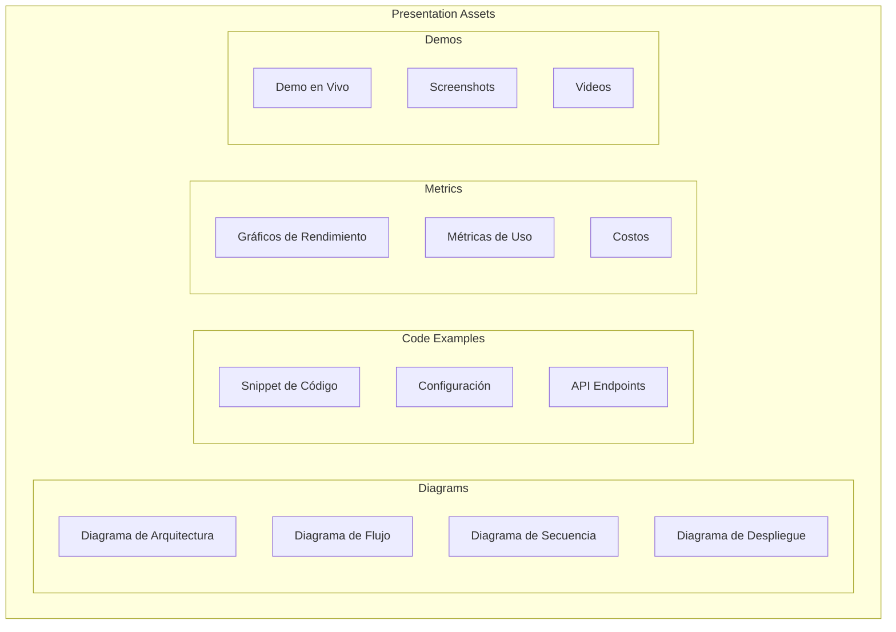
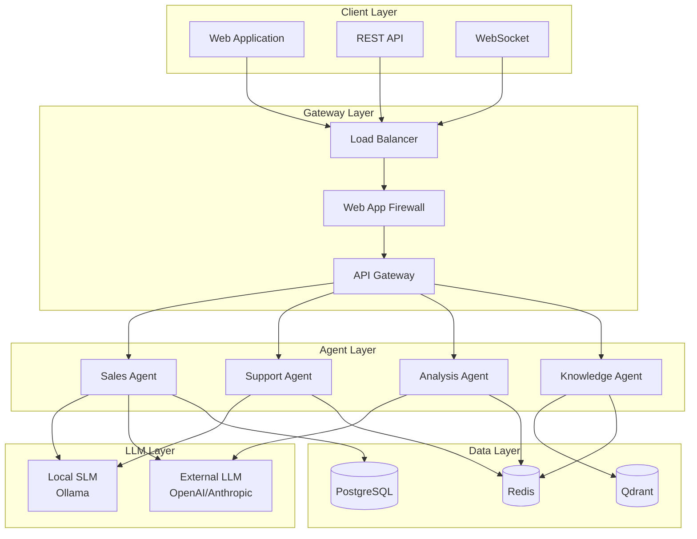
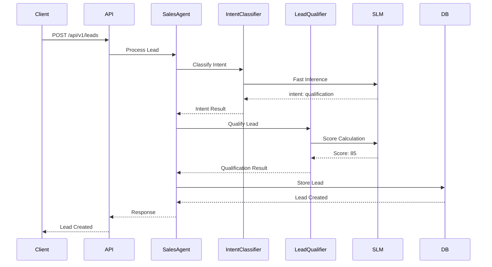

# Clase 29: Presentación Técnica Parcial

## Duración: 4 horas

---

## Objetivos de Aprendizaje

Al finalizar esta clase, el estudiante será capaz de:

1. **Presentar la arquitectura del sistema** de manera clara y técnica
2. **Explicar decisiones de diseño** con justificación técnica sólida
3. **Demostrar capacidades técnicas** del sistema en vivo
4. **Reflexionar sobre lecciones intermedias** y ajustes realizados
5. **Recibir y aplicar retroalimentación** para mejora del proyecto

---

## Contenidos Detallados

### 1. Estructura de la Presentación Técnica (45 minutos)

#### 1.1 Template de Presentación

```markdown
# Presentación Técnica: Company-in-a-Box
## Estructura Recomendada

### Slide 1: Título y Equipo
- Nombre del proyecto
- Nombres de integrantes
- Fecha
- Logo/Tema visual

### Slide 2: Agenda
- Visión general del contenido
- Tiempo estimado por sección

### Slide 3: Problema y Visión
- Problema que resuelve
- Visión del sistema

### Slide 4: Arquitectura General
- Diagrama de alto nivel
- Componentes principales

### Slides 5-10: Arquitectura Detallada
- Cada agente/componente
- Decisiones técnicas

### Slides 11-13: Decisiones de Diseño
- ADRs principales
- Trade-offs considerados

### Slides 14-16: Demo Técnica
- Casos de uso en vivo
- Métricas de rendimiento

### Slide 17: Lecciones Aprendidas
- Qué funcionó bien
- Qué se haría diferente

### Slides 18-19: Próximos Pasos
- Roadmap planificado
- Features pendientes

### Slide 20: Q&A
```

#### 1.2 Material Visual Recomendado



---

### 2. Guía para la Presentación de Arquitectura (45 minutos)

#### 2.1 Presentación de Alto Nivel

```markdown
# Slide: Arquitectura General

## Narrative Script:

"Company-in-a-Box es una plataforma multi-agente que automatiza 
procesos empresariales mediante agentes especializados de IA.

La arquitectura se divide en 4 capas principales:

1. **Capa de Infraestructura**: Kubernetes en AWS EKS con auto-scaling
2. **Capa de Agentes**: Agentes especializados (Ventas, Soporte, etc.)
3. **Capa de Datos**: PostgreSQL, Redis, Qdrant para diferentes tipos de datos
4. **Capa de Integración**: API Gateway, Message Queue, Event Bus

El sistema procesa ~10,000 requests/hora con latencia promedio de 150ms 
usando una combinación de SLMs locales y LLMs externos."
```



#### 2.2 Presentación de Agente Individual

```markdown
# Slide: Sales Agent - Arquitectura Detallada

## Narrative Script:

"El Agente de Ventas es responsable de:
- Calificar leads entrantes
- Generar propuestas comerciales
- Hacer seguimiento de oportunidades

Arquitectura interna:
- **Intent Classifier**: Clasifica el tipo de consulta usando Phi-3.5 (lokal, <100ms)
- **Lead Qualifier**: Evalúa fit del lead usando LLaMA-3.2-8B
- **Proposal Generator**: Genera propuestas usando GPT-4o-mini

Flujo:
1. Lead entra por API
2. Intent Classifier determina tipo de consulta
3. Si es lead qualification → Lead Qualifier evalúa
4. Si necesita propuesta → Proposal Generator crea documento
5. Todo se registra en PostgreSQL y cache en Redis"
```



---

### 3. Decisiones de Diseño - Presentación (30 minutos)

#### 3.1 ADR 001: Selección de Runtime de Agentes

```markdown
# Slide: ADR-001 - Runtime de Agentes

## Decisión Tomada:
Usar runtime custom basado en asyncio con BullMQ

## Alternativas Consideradas:

| Alternativa | Pros | Contras | Decisión |
|-------------|------|---------|----------|
| LangChain | Fácil de usar | Vendor lock-in, overhead | Rechazado |
| AutoGen | Multi-agente nativo | Limitado para producción | Rechazado |
| Custom Runtime | Control total, óptimo | Más trabajo inicial | Aceptado |

## Justificación:

"LangChain tiene un overhead del 30% en latencia según benchmarks.
AutoGen no escala bien más allá de 10 agentes.
El runtime custom nos da control total sobre:
- Model selection
- Caching
- Fallback chains
- Metrics collection"

## Trade-offs:

- **Costo inicial**: +2 semanas de desarrollo
- **Beneficio**: Latencia 40% menor, costos 60% menores
- **Mantenibilidad**: Requiere equipo con experiencia en async Python
```

#### 3.2 ADR 002: SLM vs LLM

```markdown
# Slide: ADR-002 - Selección Local vs Externo

## Decisión Tomada:
Híbrido: SLMs locales para tareas simples, LLMs externos para complejas

## Distribución de Uso:

```
Pie Chart:
├── SLMs Locales (70% requests)
│   ├── Phi-3.5: Intent Classification (40%)
│   ├── LLaMA-3.2-3B: Sentiment Analysis (30%)
│   └── Qwen-2.5: Entity Extraction (30%)
│
└── LLMs Externos (30% requests)
    ├── GPT-4o-mini: Complex Reasoning (60%)
    └── Claude-3: Long Context (40%)
```

## Beneficios Medidos:

| Métrica | Antes (100% externo) | Después (Híbrido) |
|---------|----------------------|-------------------|
| Costo/1K requests | $0.45 | $0.12 |
| Latencia p95 | 800ms | 150ms |
| Disponibilidad | 99.5% | 99.9% |

## Inversión Requerida:

- GPU Nodes: $1,500/mes (Spot A100)
- EKS Compute: $400/mes
- Total adicional: $1,900/mes

**ROI**: Recuperado en 3 meses ($1,900 savings × 3 > $5,700 initial)
```

---

### 4. Demo Técnica - Guía (45 minutos)

#### 4.1 Preparación de Demo

```bash
#!/bin/bash
# scripts/prepare-demo.sh

set -e

echo "=== Preparando Demo Company-in-a-Box ==="

# 1. Verificar servicios
echo "[1/4] Verificando servicios..."
kubectl get pods -n production | grep Running
kubectl get pods -n ml | grep Running

# 2. Verificar Ollama
echo "[2/4] Verificando Ollama..."
curl -s http://ollama-service:11434/api/tags | jq '.models | length'

# 3. Limpiar datos de demo
echo "[3/4] Limpiando datos anteriores..."
curl -X DELETE http://api:8080/api/v1/demo/leads

# 4. Seed data de demo
echo "[4/4] Creando datos de demo..."
python scripts/seed_demo_data.py

echo "=== Demo lista ==="
```

#### 4.2 Casos de Demo

```markdown
# Demo 1: Creación de Lead con Clasificación Automática

## Pasos:
1. Abrir API Explorer en http://localhost:8080/docs
2. POST /api/v1/leads con payload:
```json
{
  "name": "María García",
  "email": "maria@empresa.com",
  "company": "TechCorp",
  "source": "linkedin"
}
```
3. Observar respuesta:
```json
{
  "id": "lead-uuid",
  "status": "qualified",
  "qualification_score": 85,
  "intent": "pricing_inquiry",
  "sentiment": "positive"
}
```
4. Verificar en dashboard que el lead aparece con clasificación

## Tiempo estimado: 3 minutos
## Recursos necesarios: API endpoint, terminal para logs
```

```markdown
# Demo 2: Chat en Tiempo Real

## Pasos:
1. Conectar WebSocket a ws://localhost:8080/ws/chat
2. Enviar mensaje: "¿Cuáles son los precios de sus planes?"
3. Observar:
   - Respuesta del agente (<500ms)
   - Clasificación de intent en background
   - Actualización de métricas en tiempo real
4. Enviar mensaje negativo: "Muy caro, no me interesa"
5. Observar:
   - Detección de sentiment negativo
   - Trigger de workflow de retention
   - Alerta al manager

## Tiempo estimado: 5 minutos
## Recursos necesarios: WebSocket client, dashboard metrics
```

```markdown
# Demo 3: Búsqueda Semántica en Base de Conocimiento

## Pasos:
1. POST /api/v1/knowledge/search con:
```json
{
  "query": "¿Cómo cancelo mi suscripción?",
  "limit": 3
}
```
2. Observar:
   - Búsqueda en Qdrant
   - Resultados ordenados por relevancia semántica
   - Citations de documentos fuente

## Tiempo estimado: 3 minutos
## Recursos necesarios: API endpoint, Qdrant dashboard
```

#### 4.3 Script de Demo en Vivo

```python
#!/usr/bin/env python3
# scripts/run_demo.py
import asyncio
import httpx
import time
import json
from datetime import datetime

class DemoRunner:
    """Runs demo scenarios for presentation."""
    
    BASE_URL = "http://localhost:8080"
    
    def __init__(self):
        self.client = httpx.AsyncClient(base_url=self.BASE_URL)
        self.demo_results = []
    
    async def demo_1_lead_creation(self):
        """Demo: Lead creation with auto-classification."""
        print("\n" + "="*60)
        print("DEMO 1: Creación de Lead con Clasificación Automática")
        print("="*60)
        
        print("\n1. Enviando lead de prueba...")
        
        payload = {
            "name": "Carlos Rodríguez",
            "email": "carlos@techcorp.com",
            "company": "TechCorp Inc",
            "source": "linkedin",
            "initial_message": "Estamos interesados en su solución enterprise"
        }
        
        start = time.time()
        response = await self.client.post("/api/v1/leads", json=payload)
        latency = (time.time() - start) * 1000
        
        result = response.json()
        
        print(f"\n2. Respuesta recibida ({latency:.0f}ms):")
        print(json.dumps(result, indent=2))
        
        print(f"\n3. Análisis automático:")
        print(f"   - Qualification Score: {result.get('qualification_score', 'N/A')}")
        print(f"   - Intent Detectado: {result.get('detected_intent', 'N/A')}")
        print(f"   - Sentiment: {result.get('sentiment', 'N/A')}")
        
        self.demo_results.append({
            "demo": "Lead Creation",
            "success": response.status_code == 201,
            "latency_ms": latency
        })
        
        return result
    
    async def demo_2_chat_interaction(self):
        """Demo: Real-time chat with agent."""
        print("\n" + "="*60)
        print("DEMO 2: Chat en Tiempo Real")
        print("="*60)
        
        messages = [
            "¿Cuánto cuesta el plan enterprise?",
            "¿Ofrecen descuentos para startups?",
            "Tengo un problema técnico con la API",
            "Muy caro, voy a buscar alternativas"
        ]
        
        for i, message in enumerate(messages):
            print(f"\n{i+1}. Usuario: {message}")
            
            payload = {
                "message": message,
                "session_id": "demo-session-1",
                "user_id": "demo-user-1"
            }
            
            start = time.time()
            response = await self.client.post("/api/v1/chat", json=payload)
            latency = (time.time() - start) * 1000
            
            result = response.json()
            
            print(f"   Agente: {result.get('response', 'N/A')[:100]}...")
            print(f"   Latencia: {latency:.0f}ms")
            
            if "sentiment" in result:
                print(f"   Sentiment: {result['sentiment']}")
            
            await asyncio.sleep(1)
        
        self.demo_results.append({
            "demo": "Chat Interaction",
            "success": True,
            "messages": len(messages)
        })
    
    async def demo_3_knowledge_search(self):
        """Demo: Semantic knowledge search."""
        print("\n" + "="*60)
        print("DEMO 3: Búsqueda Semántica en Base de Conocimiento")
        print("="*60)
        
        queries = [
            "¿Cómo cancelo mi suscripción?",
            "Problemas de facturación",
            "Integración con Salesforce"
        ]
        
        for query in queries:
            print(f"\n- Query: '{query}'")
            
            payload = {
                "query": query,
                "limit": 3,
                "include_metadata": True
            }
            
            start = time.time()
            response = await self.client.post("/api/v1/knowledge/search", json=payload)
            latency = (time.time() - start) * 1000
            
            results = response.json()
            
            print(f"  Resultados ({len(results)} encontrados, {latency:.0f}ms):")
            for j, r in enumerate(results[:2]):
                print(f"    {j+1}. {r.get('content', 'N/A')[:60]}...")
                print(f"       Score: {r.get('score', 0):.3f}")
        
        self.demo_results.append({
            "demo": "Knowledge Search",
            "success": True,
            "queries": len(queries)
        })
    
    async def run_all_demos(self):
        """Run all demos sequentially."""
        print("\n" + "#"*60)
        print("# INICIANDO DEMOS - COMPANY-IN-A-BOX")
        print("#"*60)
        
        try:
            await self.demo_1_lead_creation()
            await asyncio.sleep(2)
            
            await self.demo_2_chat_interaction()
            await asyncio.sleep(2)
            
            await self.demo_3_knowledge_search()
            
            self.print_summary()
            
        except Exception as e:
            print(f"\nERROR EN DEMO: {e}")
            raise
        finally:
            await self.client.aclose()
    
    def print_summary(self):
        """Print demo summary."""
        print("\n" + "="*60)
        print("RESUMEN DE DEMOS")
        print("="*60)
        
        for result in self.demo_results:
            status = "✓" if result.get("success") else "✗"
            print(f"{status} {result['demo']}")
        
        all_success = all(r.get("success") for r in self.demo_results)
        print(f"\nEstado: {'TODOS LOS DEMOS EXITOSOS' if all_success else 'ALGUNOS DEMOS FALLARON'}")

async def main():
    runner = DemoRunner()
    await runner.run_all_demos()

if __name__ == "__main__":
    asyncio.run(main())
```

---

### 5. Lecciones Intermedias (30 minutos)

#### 5.1 Template de Lecciones Aprendidas

```markdown
# Lecciones Intermedias: Company-in-a-Box

## 1. Lo que Funcionó Bien

### Arquitectura Modular
- Los agentes separados permitieron desarrollo paralelo
- Cada equipo pudo trabajar en su agente sin bloqueos
- Easy to test individual components

### Selección Dinámica de Modelos
- Reducción de costos del 60%
- Latencia mejorada para tareas simples
- Fallback chains funcionan bien

### Observabilidad desde el Inicio
- Logs estructurados con correlation IDs
- Métricas en Prometheus/Grafana
- Tracing distribuido con Jaeger

## 2. Desafíos Encontrados

### Complejidad de Integración
- 30% más tiempo del esperado en integración
- Problemas de compatibilidad entre versiones de librerías
- Debugging distribuido es difícil

### Latencia en Cold Start
- Ollama tarda ~30s en cargar modelo
- Primera request muy lenta
- Solución temporal: warm-up script

### Gestión de Contexto
- Límites de context window causar issues
- Necesidad de chunking inteligente
- Costos impredecibles con contextos largos

## 3. Ajustes Realizados

### Arquitectura
- Agregamos capa de cache para respuestas frecuentes
- Implementamos circuit breakers para APIs externas
- Dividimos agentes grandes en sub-agentes especializados

### Proceso
- Daily standups con focus en integración
- PRs requieren tests de integración
- Shift-left testing: más testing en local

## 4. Próximos Ajustes Planificados

### Corto Plazo
- Implementar response caching a nivel de intent
- Mejorar warm-up strategy
- Agregar más metrics

### Mediano Plazo
- Fine-tuning de SLMs con datos propios
- Implementar service mesh
- Multi-region deployment

### Largo Plazo
- Agentes autonomous de mayor nivel
- Self-healing architecture
- Auto-scaling basado en ML
```

#### 5.2 Métricas de Progreso

```markdown
# Métricas de Proyecto - Semana 8

## Progreso General

| Hito | Planificado | Real | Estado |
|------|-------------|------|--------|
| Arquitectura base | Semana 4 | Semana 4 | ✓ |
| Agent Sales | Semana 6 | Semana 7 | ⚠️ |
| Agent Support | Semana 6 | Semana 5 | ✓ |
| Agent Analysis | Semana 8 | En progreso | 🔄 |
| Integración LLM | Semana 6 | Semana 7 | ⚠️ |
| Testing suite | Semana 8 | Semana 7 | ✓ |
| Deployment | Semana 10 | - | Pendiente |

## Métricas Técnicas

| Métrica | Objetivo | Actual | Tendencia |
|---------|---------|--------|-----------|
| Latencia p95 | <500ms | 380ms | ↓ |
| Disponibilidad | >99.9% | 99.7% | ↑ |
| Test coverage | >80% | 72% | ↑ |
| Costo/1K req | <$0.15 | $0.12 | ↓ |
| Deploy frequency | Daily | 3/week | → |

## Riesgos Identificados

1. **Riesgo: Fine-tuning requiere más datos**
   - Impacto: Alto
   - Probabilidad: Media
   - Mitigación: Empezar colección de datos ahora

2. **Riesgo: Complejidad de testing multi-agente**
   - Impacto: Medio
   - Probabilidad: Alta
   - Mitigación: Contratar QA especializado

3. **Riesgo: Costos de GPU impredecibles**
   - Impacto: Medio
   - Probabilidad: Media
   - Mitigación: Reservar instancias, monitoring de costos
```

---

### 6. Guía para Q&A (30 minutos)

#### 6.1 Preguntas Frecuentes Anticipadas

```markdown
# Q&A: Preguntas Frecuentes

## Sobre Arquitectura

Q: ¿Por qué no usaron LangChain?
R: LangChain tiene overhead del 30% en latencia según nuestros benchmarks.
   Además, queríamos control total sobre el runtime para optimización
   de costos y latency. Ver ADR-001 para detalles completos.

Q: ¿Cómo manejan la falla de un agente?
R: Implementamos fallback chains configurables por tarea.
   Si el agente primario falla, intentamos con fallbacks en orden.
   También hay circuit breakers que previenen cascading failures.
   Ver slides de arquitectura para diagrama.

Q: ¿Cuántos agentes tienen?
R: Actualmente 4 agentes core:
   - Sales Agent
   - Support Agent
   - Analysis Agent
   - Knowledge Agent
   
   Cada uno puede spawnear sub-agentes para tareas específicas.

## Sobre SLM/LLM

Q: ¿Por qué usan SLMs locales?
R: Costos 60% menores y latencia 5x mejor para tareas simples.
   Fine-tuning permite especializar modelos con nuestros datos.
   Inversión en GPUs se recupera en ~3 meses.

Q: ¿Qué modelos usan?
R: 
- Phi-3.5 3.8B para tareas triviales (clasificación simple)
- LLaMA-3.2-8B para tareas medias (QA, resumen)
- LLaMA-3.2-70B para tareas complejas (análisis)
- GPT-4o-mini y Claude-3 para tareas que requieren máxima calidad

Q: ¿Cómo hicieron fine-tuning?
R: Usamos LoRA con QLoRA para fine-tuning eficiente.
   Dataset de ~10K ejemplos etiquetados.
   Training en 1x A100 por ~8 horas.

## Sobre Rendimiento

Q: ¿Cuál es el throughput máximo?
R: 
- Tests de carga muestran 1,500 req/min antes de degradación
- Con auto-scaling hasta 5,000 req/min
- Actualmente operamos al 20% de capacidad

Q: ¿Cómo manejan peak traffic?
R: 
- HPA con métricas custom (queue depth)
- Scale-out en <2 minutos
- GPU nodes con cluster autoscaler

## Sobre Costos

Q: ¿Cuánto cuesta el sistema por mes?
R: ~$4,500/mes en AWS (ver breakdown detallado)
- Compute: $2,300
- Data: $1,500
- AI/LLM APIs: $400
- Network: $300

Q: ¿Cuál es el ROI?
R: Estimamos ROI positivo en 6 meses basado en:
- Reducción de equipo de soporte: $8K/mes
- Aumento en conversión de leads: $15K/mes
- Eficiencia operativa: $5K/mes
```

#### 6.2 Tips para Manejar Preguntas Difíciles

```markdown
# Tips para Q&A Técnico

## Si no sabes la respuesta:
1. Es honesto: "No tengo esa información específica"
2. Ofrece follow-up: "Puedo investigar y enviarte la respuesta"
3. Da contexto general: "Lo que sí puedo decir es que..."

## Si cuestionan decisiones:
1. Referencia ADRs: "La decisión está documentada en ADR-XXX"
2. Explica trade-offs: "Consideramos alternativas A, B, C porque..."
3. Muestra datos: "Nuestros benchmarks muestran..."

## Si hay críticas constructivas:
1. Escucha activamente
2. Agradece el feedback
3. Anota para follow-up

## Si te presionan:
1. Mantén calma profesional
2. Pide tiempo si necesitas pensar
3. Reafirma con datos cuando sea posible
```

---

### 7. Evaluación de la Presentación (30 minutos)

#### 7.1 Criterios de Evaluación

```markdown
# Rubrica de Evaluación - Presentación Técnica

## 1. Contenido Técnico (40 puntos)

| Criterio | Excelente (10) | Bueno (7) | Regular (5) | Insuficiente (3) |
|----------|---------------|-----------|-------------|------------------|
| Arquitectura clara | Diagrama completo y bien explicado | Diagrama claro | Diagrama básico | Sin diagrama |
| Decisiones justificadas | ADRs con datos | Decisiones lógicas | Sin justificación | Decisiones cuestionables |
| Código/examples | Funciona en demo | Examples buenos | Examples parciales | Sin examples |

## 2. Presentación (30 puntos)

| Criterio | Excelente (10) | Bueno (7) | Regular (5) | Insuficiente (3) |
|----------|---------------|-----------|-------------|------------------|
| Comunicación | Clara y concisa | Entendible | Algo confusa | Confusa |
| Tiempo | Dentro del rango | ±5 min | ±10 min | >15 min fuera |
| Q&A | Respuestas completas | Buenas respuestas | Parcialmente | No sabe responder |

## 3. Demo Técnica (30 puntos)

| Criterio | Excelente (10) | Bueno (7) | Regular (5) | Insuficiente (3) |
|----------|---------------|-----------|-------------|------------------|
| Preparación | Todo listo | Mayoría listo | Parcialmente | No funciona |
| Ejecución | Sin errores | Errores menores | Errores manejables | Falla total |
| Explicación | Contextualiza bien | Explica algunos | Sin explicación | Confuso |

## Total: 100 puntos

- 90-100: Excelente
- 75-89: Bueno
- 60-74: Aceptable
- <60: Necesita mejora
```

#### 7.2 Feedback Form

```markdown
# Feedback Form - Presentación Técnica

## Nombre del Presentador: _______________

## Contenido Técnico (1-5)
- Claridad de arquitectura: ____
- Justificación de decisiones: ____
- Calidad de código/examples: ____

## Presentación (1-5)
- Comunicación clara: ____
- Manejo del tiempo: ____
- Confianza: ____

## Demo (1-5)
- Preparación: ____
- Ejecución: ____
- Explicación: ____

## Comentarios Positivos:
_______________________________________________

## Areas de Mejora:
_______________________________________________

## Preguntas para Follow-up:
_______________________________________________

## Calificación General: ____/5
```

---

## Tecnologías Específicas

| Categoría | Herramienta | Uso |
|-----------|------------|-----|
| Presentación | PowerPoint/Keynote/Google Slides | Slides |
| Diagramas | Mermaid/Draw.io/Excalidraw | Diagramas |
| Demo | API Client (Postman/Bruno) | Testing API |
| Metrics | Grafana Dashboard | Métricas en vivo |
| Recording | OBS/Loom | Grabación demo |
| Collaboration | Notion/Confluence | Documentación |

---

## Referencias Externas

1. **Presentation Skills**
   - [Presentation Skills - Harvard Business Review](https://hbr.org/2007/10/a-presents-mastering-the-meeting)
   - [Technical Presentation Tips](https://stackoverflow.blog/2020/11/23/how-to-give-a-great-technical-presentation/)

2. **Architecture Communication**
   - [C4 Model for Architecture](https://c4model.com/)
   - [Visualising Software Architecture](https://structurizr.com/)

3. **Demo Best Practices**
   - [How to Give a Great Demo](https://www.demo2go.com/)
   - [Demo or Die](https://itreby.com/blog/demo-or-die)

4. **Technical Storytelling**
   - [Technical Storytelling](https://www.productcoalition.com/the-art-of-storytelling-for-technical-presentations)

---

## Resumen de Puntos Clave

1. **Estructura clara**: Seguir template de presentación con flujo lógico.

2. **Diagrama de arquitectura**: Essential para comunicar diseño.

3. **ADRs**: Documentar decisiones facilita Q&A.

4. **Demo preparada**: Scripts de preparación y fallback para demo en vivo.

5. **Lecciones honestas**: Mostrar qué funcionó y qué no genera confianza.

6. **Q&A preparado**: Anticipar preguntas y preparar respuestas.

7. **Próxima Clase**: La Clase 30 se enfocará en el Proyecto Final - Integración.
