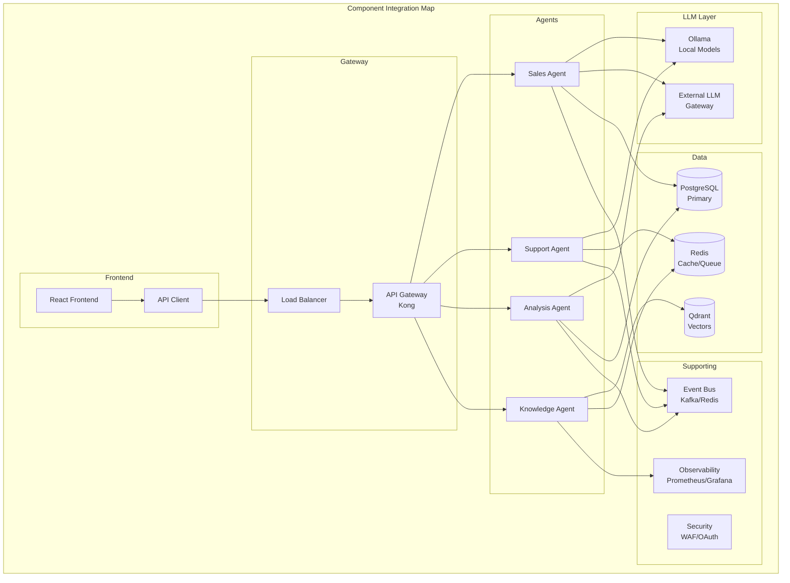

# Clase 30: Proyecto Final - Integración

## Duración: 4 horas

---

## Objetivos de Aprendizaje

Al finalizar esta clase, el estudiante será capaz de:

1. **Integrar todos los componentes** del sistema Company-in-a-Box
2. **Ejecutar testing end-to-end** para validar funcionalidad completa
3. **Documentar el sistema** apropiadamente
4. **Preparar la demo final** con todos los componentes
5. **Resolver issues de integración** identificados

---

## Contenidos Detallados

### 1. Integración de Componentes (60 minutos)



#### 1.1 Integration Checklist

```markdown
# Integration Checklist - Company-in-a-Box

## 1. Base Infrastructure ✓
- [ ] Kubernetes cluster running
- [ ] PostgreSQL with schema migrated
- [ ] Redis cluster operational
- [ ] Qdrant vector database ready
- [ ] Ollama running with models

## 2. Agent Components ✓
- [ ] Sales Agent deployed and healthy
- [ ] Support Agent deployed and healthy
- [ ] Analysis Agent deployed and healthy
- [ ] Knowledge Agent deployed and healthy
- [ ] All agents responding to health checks

## 3. LLM Integration ✓
- [ ] Ollama API accessible
- [ ] Local models loaded (phi3.5, llama3.2, qwen2.5)
- [ ] OpenAI API credentials configured
- [ ] Anthropic API credentials configured
- [ ] Model fallback chains tested

## 4. API Gateway ✓
- [ ] Kong configured with routes
- [ ] Authentication middleware active
- [ ] Rate limiting configured
- [ ] SSL/TLS certificates valid

## 5. Message Queue ✓
- [ ] Redis Streams queues created
- [ ] Dead letter queues configured
- [ ] Message persistence enabled
- [ ] Consumer groups registered

## 6. Observability ✓
- [ ] Prometheus scraping all components
- [ ] Grafana dashboards configured
- [ ] Alerts configured
- [ ] Log aggregation working

## 7. Security ✓
- [ ] WAF rules active
- [ ] OAuth provider configured
- [ ] Secrets in Vault/AWS Secrets Manager
- [ ] Network policies enforced

## 8. Integration Tests ✓
- [ ] Agent-to-agent communication tested
- [ ] LLM fallback tested
- [ ] Database operations tested
- [ ] Cache operations tested
- [ ] Vector search tested
- [ ] Message queue tested
```

#### 1.2 Integration Test Script

```python
# tests/integration/test_full_integration.py
import pytest
import asyncio
import httpx
from typing import Dict, List, Any
import time

class FullIntegrationTestSuite:
    """End-to-end integration tests for Company-in-a-Box."""
    
    BASE_URL = "http://localhost:8080"
    
    def __init__(self):
        self.client = httpx.AsyncClient(base_url=self.BASE_URL, timeout=30.0)
        self.results: List[Dict] = []
    
    async def test_health_all_services(self):
        """Test health of all services."""
        print("\n1. Testing service health...")
        
        services = [
            ("API Gateway", f"{self.BASE_URL}/health"),
            ("Agent Runtime", f"{self.BASE_URL}/api/v1/health"),
            ("Ollama", "http://localhost:11434/api/tags"),
        ]
        
        for name, url in services:
            try:
                if "localhost" in url:
                    async with httpx.AsyncClient() as c:
                        r = await c.get(url)
                else:
                    r = await self.client.get(url.replace(self.BASE_URL, ""))
                
                status = "✓" if r.status_code == 200 else "✗"
                print(f"  {status} {name}: {r.status_code}")
                
                self.results.append({
                    "test": f"health_{name}",
                    "passed": r.status_code == 200
                })
            except Exception as e:
                print(f"  ✗ {name}: {e}")
                self.results.append({
                    "test": f"health_{name}",
                    "passed": False,
                    "error": str(e)
                })
    
    async def test_lead_to_qualification_flow(self):
        """Test complete lead qualification flow."""
        print("\n2. Testing lead-to-qualification flow...")
        
        try:
            # Step 1: Create lead
            print("  - Creating lead...")
            lead_response = await self.client.post(
                "/api/v1/leads",
                json={
                    "name": "Integration Test Lead",
                    "email": f"test-{time.time()}@example.com",
                    "company": "Test Corp",
                    "source": "integration_test",
                    "initial_message": "We're interested in your enterprise solution"
                }
            )
            assert lead_response.status_code == 201
            lead_id = lead_response.json()["id"]
            print(f"    ✓ Lead created: {lead_id}")
            
            # Step 2: Send qualifying message
            print("  - Sending qualifying message...")
            chat_response = await self.client.post(
                "/api/v1/chat",
                json={
                    "lead_id": lead_id,
                    "message": "We are a company with 500 employees looking for a solution"
                }
            )
            assert chat_response.status_code == 200
            chat_result = chat_response.json()
            print(f"    ✓ Chat response: intent={chat_result.get('intent')}")
            
            # Step 3: Verify lead qualification
            print("  - Verifying qualification...")
            lead_check = await self.client.get(f"/api/v1/leads/{lead_id}")
            assert lead_check.status_code == 200
            lead_data = lead_check.json()
            assert lead_data.get("qualification_score") is not None
            print(f"    ✓ Lead qualified: score={lead_data.get('qualification_score')}")
            
            self.results.append({
                "test": "lead_qualification_flow",
                "passed": True
            })
            
        except Exception as e:
            print(f"    ✗ Flow failed: {e}")
            self.results.append({
                "test": "lead_qualification_flow",
                "passed": False,
                "error": str(e)
            })
    
    async def test_knowledge_search_flow(self):
        """Test knowledge base search."""
        print("\n3. Testing knowledge search flow...")
        
        try:
            # Step 1: Add document
            print("  - Adding document...")
            doc_response = await self.client.post(
                "/api/v1/knowledge/documents",
                json={
                    "documents": [{
                        "content": "Pricing starts at $99/month for the basic plan",
                        "metadata": {"category": "pricing"}
                    }]
                }
            )
            print(f"    Status: {doc_response.status_code}")
            
            # Step 2: Search
            print("  - Searching...")
            search_response = await self.client.post(
                "/api/v1/knowledge/search",
                json={
                    "query": "How much does it cost?",
                    "limit": 3
                }
            )
            assert search_response.status_code == 200
            results = search_response.json()
            print(f"    ✓ Found {len(results)} results")
            
            self.results.append({
                "test": "knowledge_search",
                "passed": True,
                "results_count": len(results)
            })
            
        except Exception as e:
            print(f"    ✗ Search failed: {e}")
            self.results.append({
                "test": "knowledge_search",
                "passed": False,
                "error": str(e)
            })
    
    async def test_concurrent_requests(self):
        """Test system under concurrent load."""
        print("\n4. Testing concurrent requests...")
        
        try:
            num_requests = 20
            
            async def make_request(i):
                start = time.time()
                try:
                    r = await self.client.get("/api/v1/leads")
                    return {
                        "success": r.status_code == 200,
                        "latency_ms": (time.time() - start) * 1000
                    }
                except Exception as e:
                    return {"success": False, "error": str(e)}
            
            print(f"  - Sending {num_requests} concurrent requests...")
            start_time = time.time()
            results = await asyncio.gather(*[make_request(i) for i in range(num_requests)])
            total_time = time.time() - start_time
            
            successful = sum(1 for r in results if r.get("success"))
            avg_latency = sum(r.get("latency_ms", 0) for r in results) / len(results)
            
            print(f"    ✓ Completed: {successful}/{num_requests} successful")
            print(f"    ✓ Total time: {total_time:.2f}s")
            print(f"    ✓ Avg latency: {avg_latency:.2f}ms")
            
            self.results.append({
                "test": "concurrent_requests",
                "passed": successful == num_requests,
                "success_rate": successful / num_requests,
                "avg_latency_ms": avg_latency
            })
            
        except Exception as e:
            print(f"    ✗ Concurrent test failed: {e}")
            self.results.append({
                "test": "concurrent_requests",
                "passed": False,
                "error": str(e)
            })
    
    async def test_llm_fallback(self):
        """Test LLM fallback mechanism."""
        print("\n5. Testing LLM fallback...")
        
        try:
            # Test with prompt that should trigger fallback
            print("  - Testing model fallback...")
            
            response = await self.client.post(
                "/api/v1/chat",
                json={
                    "message": "Test message for fallback testing",
                    "priority": "high"
                }
            )
            
            if response.status_code == 200:
                result = response.json()
                model_used = result.get("model_used", "unknown")
                print(f"    ✓ Response received using: {model_used}")
                
                self.results.append({
                    "test": "llm_fallback",
                    "passed": True,
                    "model_used": model_used
                })
            else:
                raise Exception(f"Status {response.status_code}")
                
        except Exception as e:
            print(f"    ✗ Fallback test failed: {e}")
            self.results.append({
                "test": "llm_fallback",
                "passed": False,
                "error": str(e)
            })
    
    async def test_observability_metrics(self):
        """Test that metrics are being collected."""
        print("\n6. Testing observability...")
        
        try:
            metrics_endpoint = f"{self.BASE_URL}/metrics"
            response = await self.client.get(metrics_endpoint.replace(self.BASE_URL, ""))
            
            if response.status_code == 200:
                metrics = response.text
                key_metrics = ["requests_total", "latency_seconds", "errors_total"]
                
                for metric in key_metrics:
                    found = metric in metrics
                    print(f"    {'✓' if found else '✗'} {metric}")
                
                self.results.append({
                    "test": "observability",
                    "passed": True
                })
            else:
                raise Exception(f"Metrics endpoint returned {response.status_code}")
                
        except Exception as e:
            print(f"    ✗ Observability test failed: {e}")
            self.results.append({
                "test": "observability",
                "passed": False,
                "error": str(e)
            })
    
    async def run_all_tests(self):
        """Run all integration tests."""
        print("\n" + "="*60)
        print("FULL INTEGRATION TEST SUITE")
        print("="*60)
        
        await self.test_health_all_services()
        await self.test_lead_to_qualification_flow()
        await self.test_knowledge_search_flow()
        await self.test_concurrent_requests()
        await self.test_llm_fallback()
        await self.test_observability_metrics()
        
        # Print summary
        print("\n" + "="*60)
        print("TEST SUMMARY")
        print("="*60)
        
        passed = sum(1 for r in self.results if r.get("passed"))
        total = len(self.results)
        
        for result in self.results:
            status = "✓" if result.get("passed") else "✗"
            test_name = result.get("test", "unknown")
            print(f"{status} {test_name}")
        
        print(f"\nTotal: {passed}/{total} passed ({100*passed/total:.0f}%)")
        
        return passed == total

async def main():
    suite = FullIntegrationTestSuite()
    success = await suite.run_all_tests()
    return 0 if success else 1

if __name__ == "__main__":
    import sys
    sys.exit(asyncio.run(main()))
```

---

### 2. Testing End-to-End (45 minutos)

```python
# tests/e2e/test_complete_flows.py
import pytest
import asyncio
from typing import Dict, Generator
import time

class TestCompleteBusinessFlows:
    """End-to-end tests for complete business scenarios."""
    
    @pytest.fixture
    def api_client(self):
        """Create API client for tests."""
        import httpx
        client = httpx.AsyncClient(base_url="http://localhost:8080", timeout=60.0)
        yield client
        asyncio.get_event_loop().run_until_complete(client.aclose())
    
    @pytest.mark.asyncio
    async def test_complete_sales_cycle(self, api_client):
        """
        Test complete sales cycle from lead to proposal.
        
        Flow:
        1. Lead enters via website
        2. Agent qualifies lead
        3. If qualified, schedule demo
        4. After demo, generate proposal
        5. Send proposal to customer
        """
        
        # 1. Create lead
        lead_response = await api_client.post("/api/v1/leads", json={
            "name": "Enterprise Customer",
            "email": "enterprise@test.com",
            "company": "Big Corp",
            "source": "website",
            "company_size": 1000
        })
        assert lead_response.status_code == 201
        lead_id = lead_response.json()["id"]
        
        # 2. Initial qualification
        chat1 = await api_client.post(f"/api/v1/leads/{lead_id}/chat", json={
            "message": "We're interested in your enterprise solution for 1000 employees"
        })
        assert chat1.status_code == 200
        
        # 3. Schedule demo
        demo_response = await api_client.post(f"/api/v1/leads/{lead_id}/demo", json={
            "scheduled_at": "2025-02-01T10:00:00Z",
            "duration_minutes": 60
        })
        assert demo_response.status_code == 201
        
        # 4. Generate proposal
        proposal_response = await api_client.post(f"/api/v1/leads/{lead_id}/proposal", json={
            "plan_type": "enterprise",
            "customizations": ["SSO", "Dedicated Support", "Custom SLA"]
        })
        assert proposal_response.status_code == 201
        proposal_id = proposal_response.json()["proposal_id"]
        
        # 5. Send proposal
        send_response = await api_client.post(f"/api/v1/proposals/{proposal_id}/send")
        assert send_response.status_code == 200
        
        # Verify complete flow
        lead_check = await api_client.get(f"/api/v1/leads/{lead_id}")
        lead_data = lead_check.json()
        
        assert lead_data["status"] in ["proposal_sent", "negotiating", "won"]
        assert lead_data["proposals_generated"] >= 1
    
    @pytest.mark.asyncio
    async def test_support_ticket_resolution(self, api_client):
        """
        Test complete support ticket flow.
        
        Flow:
        1. Customer reports issue
        2. Agent classifies and triages
        3. If technical, escalate to technical support
        4. Technical team resolves
        5. Customer confirms resolution
        """
        
        # 1. Create ticket
        ticket_response = await api_client.post("/api/v1/support/tickets", json={
            "subject": "API integration not working",
            "description": "Getting 500 errors when calling /api/v1/leads",
            "severity": "high",
            "customer_email": "customer@test.com"
        })
        assert ticket_response.status_code == 201
        ticket_id = ticket_response.json()["ticket_id"]
        
        # 2. AI classification
        classify_response = await api_client.post(
            f"/api/v1/support/tickets/{ticket_id}/classify"
        )
        assert classify_response.status_code == 200
        classification = classify_response.json()
        
        assert classification["category"] in ["technical", "billing", "general"]
        assert classification["priority"] in ["low", "medium", "high", "critical"]
        
        # 3. If technical, escalate
        if classification["category"] == "technical":
            escalate_response = await api_client.post(
                f"/api/v1/support/tickets/{ticket_id}/escalate",
                json={"escalation_reason": "Requires technical investigation"}
            )
            assert escalate_response.status_code == 200
        
        # 4. Add resolution
        resolve_response = await api_client.post(
            f"/api/v1/support/tickets/{ticket_id}/resolve",
            json={
                "resolution": "Fixed API endpoint configuration",
                "root_cause": "Missing environment variable"
            }
        )
        assert resolve_response.status_code == 200
        
        # 5. Customer confirmation
        confirm_response = await api_client.post(
            f"/api/v1/support/tickets/{ticket_id}/confirm-resolution",
            json={"satisfied": True}
        )
        assert confirm_response.status_code == 200
        
        # Verify ticket status
        ticket_check = await api_client.get(f"/api/v1/support/tickets/{ticket_id}")
        ticket_data = ticket_check.json()
        assert ticket_data["status"] == "resolved"
        assert ticket_data["customer_satisfied"] == True
    
    @pytest.mark.asyncio
    async def test_multi_agent_collaboration(self, api_client):
        """
        Test scenario requiring multiple agents.
        
        Flow:
        1. Lead asks about pricing
        2. Sales Agent handles
        3. Lead asks technical question
        4. Transfers to Support Agent
        5. Creates ticket
        6. Analysis Agent reviews for patterns
        """
        
        # 1. Start conversation
        response1 = await api_client.post("/api/v1/chat/sessions", json={
            "customer_email": "multi-agent@test.com"
        })
        session_id = response1.json()["session_id"]
        
        # 2. Pricing question
        chat1 = await api_client.post(f"/api/v1/chat/sessions/{session_id}/messages", json={
            "message": "What's the price for your enterprise plan?"
        })
        assert chat1.status_code == 200
        assert chat1.json()["agent_type"] == "sales"
        
        # 3. Technical question (triggers handoff)
        chat2 = await api_client.post(f"/api/v1/chat/sessions/{session_id}/messages", json={
            "message": "Can it integrate with our existing SSO?"
        })
        assert chat2.status_code == 200
        # Should acknowledge and potentially handoff
        
        # 4. Create ticket from conversation
        ticket_response = await api_client.post(
            f"/api/v1/chat/sessions/{session_id}/create-ticket",
            json={"reason": "Technical integration question"}
        )
        assert ticket_response.status_code == 201
        
        # 5. Analysis Agent reviews
        analysis_response = await api_client.post(
            f"/api/v1/chat/sessions/{session_id}/analyze",
            json={"analysis_type": "conversation_pattern"}
        )
        assert analysis_response.status_code == 200
        analysis = analysis_response.json()
        
        assert "patterns_detected" in analysis
        assert "sentiment_trend" in analysis

class TestErrorHandling:
    """Test error handling and resilience."""
    
    @pytest.fixture
    def api_client(self):
        import httpx
        client = httpx.AsyncClient(base_url="http://localhost:8080")
        yield client
        asyncio.get_event_loop().run_until_complete(client.aclose())
    
    @pytest.mark.asyncio
    async def test_graceful_degradation(self, api_client):
        """Test system gracefully degrades when components fail."""
        
        # Test with invalid input
        response = await api_client.post("/api/v1/leads", json={
            "name": "",  # Invalid: empty name
            "email": "not-an-email"  # Invalid: bad email format
        })
        
        # Should return validation errors, not crash
        assert response.status_code == 400
        errors = response.json().get("errors", {})
        assert "name" in errors
        assert "email" in errors
    
    @pytest.mark.asyncio
    async def test_timeout_handling(self, api_client):
        """Test timeout handling for slow requests."""
        
        # Long running request should timeout gracefully
        response = await api_client.post(
            "/api/v1/knowledge/bulk-index",
            json={"documents": [{"content": "x" * 100000}] * 1000}
        )
        
        # Should either process or timeout with proper error
        assert response.status_code in [200, 202, 408, 504]
    
    @pytest.mark.asyncio
    async def test_circuit_breaker(self, api_client):
        """Test circuit breaker opens on repeated failures."""
        
        # Make many failing requests to trigger circuit breaker
        failures = 0
        for _ in range(10):
            try:
                # Intentionally malformed request
                await api_client.get("/api/v1/nonexistent-endpoint")
            except:
                pass
        
        # Subsequent requests should be rejected quickly
        start = time.time()
        response = await api_client.get("/api/v1/health")
        elapsed = time.time() - start
        
        # Should return 503 Service Unavailable quickly
        assert response.status_code in [200, 503]
        # If circuit breaker is working, should be fast
```

---

### 3. Documentación del Sistema (45 minutos)

```markdown
# Company-in-a-Box - Documentación Técnica

## Índice
1. [Arquitectura](#arquitectura)
2. [API Reference](#api-reference)
3. [Guía de Despliegue](#despliegue)
4. [Operaciones](#operaciones)
5. [Troubleshooting](#troubleshooting)

---

## Arquitectura

### Visión General

Company-in-a-Box es una plataforma multi-agente diseñada para automatizar 
procesos empresariales mediante agentes especializados de IA.

```
┌─────────────────────────────────────────────────────────────┐
│                      Client Applications                      │
│                   (Web, Mobile, API Clients)                 │
└─────────────────────────────────────────────────────────────┘
                              │
                              ▼
┌─────────────────────────────────────────────────────────────┐
│                       API Gateway (Kong)                     │
│         Authentication │ Rate Limiting │ Routing             │
└─────────────────────────────────────────────────────────────┘
                              │
              ┌───────────────┼───────────────┐
              ▼               ▼               ▼
     ┌─────────────┐  ┌─────────────┐  ┌─────────────┐
     │ Sales Agent │  │Support Agent│  │Analysis Agnt│
     └─────────────┘  └─────────────┘  └─────────────┘
              │               │               │
              ▼               ▼               ▼
     ┌─────────────────────────────────────────────┐
     │              LLM Layer                        │
     │  ┌──────────────┐    ┌─────────────────┐   │
     │  │ Local (Ollama)│    │ External (OpenAI│   │
     │  │ phi3.5, llama │    │ GPT-4o-mini)    │   │
     │  └──────────────┘    └─────────────────┘   │
     └─────────────────────────────────────────────┘
              │               │               │
              ▼               ▼               ▼
     ┌─────────────────────────────────────────────┐
     │                 Data Layer                    │
     │  PostgreSQL │ Redis │ Qdrant                │
     └─────────────────────────────────────────────┘
```

### Componentes

#### Sales Agent
Responsable de:
- Calificación de leads
- Generación de propuestas
- Seguimiento de oportunidades

**Endpoints principales:**
- `POST /api/v1/leads` - Crear lead
- `GET /api/v1/leads/{id}` - Obtener lead
- `POST /api/v1/leads/{id}/qualify` - Calificar lead

#### Support Agent
Responsable de:
- Atención al cliente
- Creación de tickets
- Escalamiento a equipos humanos

**Endpoints principales:**
- `POST /api/v1/support/tickets` - Crear ticket
- `GET /api/v1/support/tickets/{id}` - Obtener ticket
- `POST /api/v1/chat` - Chat en tiempo real

#### Analysis Agent
Responsable de:
- Análisis de patrones
- Reportes automatizados
- Predicciones

---

## API Reference

### Authentication

```http
Authorization: Bearer <token>
```

### Leads

#### Create Lead
```http
POST /api/v1/leads
Content-Type: application/json

{
  "name": "John Doe",
  "email": "john@example.com",
  "company": "Acme Corp",
  "source": "website",
  "company_size": 100,
  "initial_message": "Interested in enterprise plan"
}
```

**Response:**
```json
{
  "id": "lead-uuid",
  "name": "John Doe",
  "email": "john@example.com",
  "company": "Acme Corp",
  "status": "new",
  "qualification_score": null,
  "created_at": "2025-01-15T10:30:00Z"
}
```

#### Get Lead
```http
GET /api/v1/leads/{id}
```

### Chat

#### Send Message
```http
POST /api/v1/chat
Content-Type: application/json

{
  "lead_id": "lead-uuid",
  "message": "What are your pricing options?",
  "session_id": "session-uuid" 
}
```

**Response:**
```json
{
  "response": "Our pricing starts at $99/month for...",
  "intent": "pricing_inquiry",
  "sentiment": "positive",
  "agent_type": "sales",
  "session_id": "session-uuid"
}
```

### Knowledge Base

#### Search
```http
POST /api/v1/knowledge/search
Content-Type: application/json

{
  "query": "How do I cancel?",
  "limit": 5,
  "filters": {
    "category": "billing"
  }
}
```

---

## Despliegue

### Requisitos
- Kubernetes 1.29+
- Helm 3.12+
- Terraform 1.6+
- kubectl configurado

### Pasos

1. **Infraestructura**
```bash
cd infrastructure/terraform
terraform init
terraform apply -var-file=environments/prod.tfvars
```

2. **Kubernetes**
```bash
kubectl apply -k kubernetes/overlays/production
kubectl rollout status deployment/agent-runtime -n production
```

3. **Verificación**
```bash
./scripts/verify-deployment.sh
```

---

## Operaciones

### Monitoring

Dashboards disponibles en Grafana:
- `Dashboards/CompanyBox/Overview`
- `Dashboards/CompanyBox/Agents`
- `Dashboards/CompanyBox/LLM Metrics`

### Logs

```bash
# Ver logs de agent runtime
kubectl logs -n production -l app=agent-runtime -f

# Ver logs de Ollama
kubectl logs -n ml -l app=ollama -f
```

### Alerts

| Alert | Condición | Severidad |
|-------|-----------|-----------|
| HighLatency | p99 > 2s por 5min | Warning |
| ServiceDown | Pod no responde | Critical |
| LLMCostSpike | Cost > 150% baseline | Warning |
| QueueDepth | Pending > 1000 | Warning |

---

## Troubleshooting

### Problemas Comunes

**1. Agente no responde**
```bash
# Verificar estado
kubectl get pods -n production

# Ver logs
kubectl logs -n production -l app=agent-runtime --tail=100

# Reiniciar deployment
kubectl rollout restart deployment/agent-runtime -n production
```

**2. Ollama lento o no responde**
```bash
# Verificar pods de Ollama
kubectl get pods -n ml

# Ver logs
kubectl logs -n ml -l app=ollama -f

# Verificar modelos cargados
kubectl exec -n ml deploy/ollama -- ollama list
```

**3. Problemas de conexión a DB**
```bash
# Verificar secrets
kubectl get secrets -n production

# Test conexión
kubectl exec -n production deploy/agent-runtime -- python -c "
import asyncpg
import asyncio
asyncio.run(asyncpg.connect('postgresql://...'))
"
```
```

---

### API Documentation Auto-generada

```yaml
# openapi.yaml
openapi: 3.0.3
info:
  title: Company-in-a-Box API
  description: Multi-agent platform for business automation
  version: 1.0.0
  contact:
    email: api-support@companybox.example.com

servers:
  - url: https://api.companybox.example.com
    description: Production
  - url: https://staging.companybox.example.com
    description: Staging

paths:
  /api/v1/leads:
    get:
      summary: List leads
      operationId: listLeads
      tags: [Leads]
      parameters:
        - name: status
          in: query
          schema:
            type: string
            enum: [new, qualified, proposal, negotiating, won, lost]
        - name: limit
          in: query
          schema:
            type: integer
            default: 20
            maximum: 100
      responses:
        '200':
          description: List of leads
          content:
            application/json:
              schema:
                type: object
                properties:
                  data:
                    type: array
                    items:
                      $ref: '#/components/schemas/Lead'
                  pagination:
                    $ref: '#/components/schemas/Pagination'
    
    post:
      summary: Create lead
      operationId: createLead
      tags: [Leads]
      requestBody:
        required: true
        content:
          application/json:
            schema:
              $ref: '#/components/schemas/CreateLeadRequest'
      responses:
        '201':
          description: Lead created
          content:
            application/json:
              schema:
                $ref: '#/components/schemas/Lead'
        '400':
          $ref: '#/components/responses/BadRequest'

components:
  schemas:
    Lead:
      type: object
      required:
        - id
        - name
        - email
      properties:
        id:
          type: string
          format: uuid
        name:
          type: string
        email:
          type: string
          format: email
        company:
          type: string
        status:
          type: string
          enum: [new, qualified, proposal, negotiating, won, lost]
        qualification_score:
          type: number
          format: float
          minimum: 0
          maximum: 100
        created_at:
          type: string
          format: date-time

  responses:
    BadRequest:
      description: Bad request
      content:
        application/json:
          schema:
            type: object
            properties:
              errors:
                type: object
                additionalProperties:
                  type: string
```

---

### 4. Preparación para Demo Final (45 minutos)

```bash
#!/bin/bash
# scripts/prepare-final-demo.sh

set -e

echo "=========================================="
echo "Preparando Demo Final - Company-in-a-Box"
echo "=========================================="

# Colors
GREEN='\033[0;32m'
YELLOW='\033[1;33m'
NC='\033[0m'

log() {
    echo -e "${GREEN}[✓]${NC} $1"
}

warn() {
    echo -e "${YELLOW}[!]${NC} $1"
}

# 1. Check all services
echo ""
echo "=== Verificando Servicios ==="

log "Verificando Kubernetes..."
kubectl get nodes | grep Ready || exit 1

log "Verificando pods en producción..."
kubectl get pods -n production | grep Running | wc -l
EXPECTED_PODS=10
CURRENT_PODS=$(kubectl get pods -n production | grep Running | wc -l)
if [ "$CURRENT_PODS" -lt "$EXPECTED_PODS" ]; then
    warn "Solo $CURRENT_PODS pods corriendo, esperado: $EXPECTED_PODS"
fi

log "Verificando Ollama..."
curl -s http://ollama-service:11434/api/tags > /dev/null && log "Ollama OK" || warn "Ollama no responde"

log "Verificando PostgreSQL..."
kubectl exec -n production deploy/postgres -- pg_isready && log "PostgreSQL OK"

log "Verificando Redis..."
kubectl exec -n production deploy/redis -- redis-cli ping | grep PONG && log "Redis OK"

# 2. Check API health
echo ""
echo "=== Verificando API ==="

API_URL="http://localhost:8080"
if curl -s "${API_URL}/health" > /dev/null; then
    log "API Gateway responding"
else
    warn "API Gateway no responde"
fi

# 3. Load test data
echo ""
echo "=== Cargando Datos de Demo ==="

python3 scripts/seed_demo_data.py --clean || warn "Error cargando datos"

# 4. Clear caches
echo ""
echo "=== Limpiando Caches ==="

curl -s -X POST "http://localhost:8080/admin/cache/clear" || warn "No se pudo limpiar cache"

# 5. Verify dashboards
echo ""
echo "=== Verificando Dashboards ==="

log "Grafana: http://localhost:3000"
log "Prometheus: http://localhost:9090"

# 6. Final status
echo ""
echo "=========================================="
echo " Demo Lista"
echo "=========================================="
echo ""
echo "Verificar manualmente:"
echo "  1. Grafana dashboards cargando métricas"
echo "  2. API respondiendo en http://localhost:8080/docs"
echo "  3. Ollama con modelos cargados"
echo ""
```

```python
# scripts/seed_demo_data.py
#!/usr/bin/env python3
"""Seed demo data for final presentation."""

import asyncio
import httpx
import random
import time

DEMO_LEADS = [
    {"name": "María García", "company": "TechCorp España", "size": 500},
    {"name": "John Smith", "company": "Enterprise Solutions Inc", "size": 2000},
    {"name": "Ana Silva", "company": "StartupBR", "size": 50},
    {"name": "Michael Chen", "company": "APAC Innovations", "size": 800},
    {"name": "Emma Wilson", "company": "UK Enterprise Ltd", "size": 1200},
]

DEMO_QUESTIONS = [
    "¿Cuánto cuesta el plan enterprise?",
    "¿Tienen integración con Salesforce?",
    "¿Cómo es el soporte técnico?",
    "¿Puedo probar gratis por 30 días?",
    "¿Ofrecen descuentos para startups?",
]

async def seed_data(base_url: str = "http://localhost:8080"):
    """Seed demo data."""
    
    async with httpx.AsyncClient(base_url=base_url, timeout=30.0) as client:
        print("Creating demo leads...")
        
        for lead_data in DEMO_LEADS:
            try:
                response = await client.post("/api/v1/leads", json={
                    "name": lead_data["name"],
                    "email": f"{lead_data['name'].lower().replace(' ', '.')}@example.com",
                    "company": lead_data["company"],
                    "company_size": lead_data["size"],
                    "source": "demo"
                })
                
                if response.status_code == 201:
                    lead = response.json()
                    print(f"  ✓ Created lead: {lead['name']} (ID: {lead['id'][:8]}...)")
                    
                    # Add some chat history
                    if random.random() > 0.5:
                        for _ in range(random.randint(1, 3)):
                            question = random.choice(DEMO_QUESTIONS)
                            await client.post(f"/api/v1/leads/{lead['id']}/chat", json={
                                "message": question
                            })
                            
            except Exception as e:
                print(f"  ✗ Error creating lead: {e}")
        
        # Add knowledge base documents
        print("\nAdding knowledge base content...")
        
        documents = [
            {"content": "Enterprise Plan: $999/month - includes all features, dedicated support, SSO, SLA 99.9%", "metadata": {"category": "pricing"}},
            {"content": "Startup Plan: $99/month - basic features, community support, 5 users", "metadata": {"category": "pricing"}},
            {"content": "Integration with Salesforce: Full bidirectional sync available. Setup time: 2-4 hours.", "metadata": {"category": "integrations"}},
            {"content": "Integration with Slack: Real-time notifications and commands. Install from Slack App Directory.", "metadata": {"category": "integrations"}},
            {"content": "Support Hours: 24/7 for Enterprise, 9-5 business hours for others. Email: support@companybox.example.com", "metadata": {"category": "support"}},
        ]
        
        try:
            await client.post("/api/v1/knowledge/documents", json={
                "documents": documents
            })
            print("  ✓ Knowledge base updated")
        except Exception as e:
            print(f"  ✗ Error updating knowledge base: {e}")

if __name__ == "__main__":
    asyncio.run(seed_data())
```

---

### 5. Ejercicios de Verificación Final (15 minutos)

```markdown
# Checklist Final - Demo Completa

## Demo 1: Creación y Calificación de Lead
- [ ] Crear lead via API
- [ ] Verificar clasificación automática
- [ ] Verificar sentiment analysis
- [ ] Confirmar almacenamiento en DB

## Demo 2: Chat en Tiempo Real
- [ ] Enviar mensaje de pricing
- [ ] Verificar respuesta < 500ms
- [ ] Enviar mensaje negativo
- [ ] Verificar detección de sentiment

## Demo 3: Búsqueda Semántica
- [ ] Buscar "cómo cancelar"
- [ ] Verificar resultados relevantes
- [ ] Verificar citations

## Demo 4: Métricas en Vivo
- [ ] Mostrar dashboard de Grafana
- [ ] Mostrar latencias
- [ ] Mostrar uso de GPU

## Demo 5: Manejo de Errores
- [ ] Enviar request inválido
- [ ] Verificar mensaje de error apropiado
- [ ] Sistema no crashea

## Checklist de Contingencia
- [ ] Script de restart preparado
- [ ] Datos de backup listos
- [ ] Escenario simplificado备選方案
```

---

## Resumen de Puntos Clave

1. **Integration checklist**: Verificar todos los componentes antes de demo.

2. **End-to-end tests**: Validar flujos completos de negocio.

3. **Documentación completa**: README, API docs, troubleshooting.

4. **Preparación de demo**: Scripts de preparación y contingencia.

5. **Testing de carga**: Validar rendimiento bajo load.

6. **Próxima Clase**: La Clase 31 se enfocará en la Demo Completa Final.
