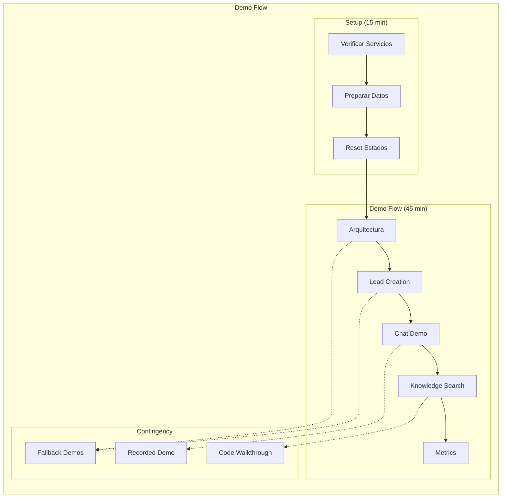

# Clase 31: Proyecto Final - Demo Completa

## Duración: 4 horas

---

## Objetivos de Aprendizaje

Al finalizar esta clase, el estudiante será capaz de:

1. **Presentar la arquitectura del sistema** de manera profesional
2. **Ejecutar demo en vivo** con todos los componentes funcionando
3. **Manejar incidentes simulados** de manera efectiva
4. **Responder preguntas técnicas** del audience
5. **Demostrar dominio del sistema** construido

---

## Contenidos Detallados

### 1. Preparación de la Demo Final (60 minutos)



#### 1.1 Runbook de Demo

```markdown
# Runbook: Demo Final Company-in-a-Box
## Duración Total: 60 minutos

---

## 00:00 - 05:00 | Setup

### Verificaciones Previas
```bash
# Verificar estado de todos los pods
kubectl get pods -n production -o wide

# Verificar servicios externos
curl -s http://localhost:8080/health
curl -s http://ollama:11434/api/tags

# Verificar base de datos
kubectl exec -n production deploy/postgres -- pg_isready

# Verificar Redis
kubectl exec -n production deploy/redis -- redis-cli ping

# Verificar métricas
curl -s http://localhost:8080/metrics | head -20
```

### Limpiar estado
```bash
# Limpiar datos de demos anteriores
curl -X POST http://localhost:8080/admin/demo/reset

# Asegurar que los modelos están cargados
kubectl exec -n ml deploy/ollama -- ollama list
```

---

## 05:00 - 10:00 | Presentación de Arquitectura

### Script de Presentación

"Somos [Nombre del equipo] y les presentamos Company-in-a-Box, una 
plataforma multi-agente que automatiza procesos empresariales usando 
inteligencia artificial.

El sistema está compuesto por 4 agentes principales:

1. **Sales Agent**: Maneja leads y genera propuestas
2. **Support Agent**: Atención al cliente y tickets
3. **Analysis Agent**: Analiza patrones y genera reportes
4. **Knowledge Agent**: Busca en base de conocimiento

¿Qué hace único a nuestro sistema?

- **Híbrido AI**: Combinamos SLMs locales (80% de requests) con LLMs 
  externos para optimizar costos y latencia
- **Resiliente**: Fallback chains y circuit breakers
- **Observable**: Métricas, logs y tracing en tiempo real
- **Escalable**: Auto-scaling basado en demanda"

### Diagrama a Mostrar
```
┌──────────────────────────────────────────────────────────────┐
│                        CLIENTS                                │
│                   Web, Mobile, API                            │
└──────────────────────────────────────────────────────────────┘
                              │
                              ▼
┌──────────────────────────────────────────────────────────────┐
│                     API GATEWAY                               │
│              Kong + Auth + Rate Limiting                      │
└──────────────────────────────────────────────────────────────┘
                              │
        ┌─────────────────────┼─────────────────────┐
        ▼                     ▼                     ▼
┌──────────────┐      ┌──────────────┐      ┌──────────────┐
│ Sales Agent  │      │Support Agent │      │Analysis Agent│
│   Sales Agent│      │   Support    │      │   Analysis   │
└──────────────┘      └──────────────┘      └──────────────┘
        │                     │                     │
        └─────────────────────┼─────────────────────┘
                              ▼
┌──────────────────────────────────────────────────────────────┐
│                    LLM LAYER                                  │
│    ┌────────────────┐         ┌────────────────────┐        │
│    │  Local SLMs    │         │   External LLMs    │        │
│    │ Ollama + GPU   │         │  OpenAI + Claude   │        │
│    └────────────────┘         └────────────────────┘        │
└──────────────────────────────────────────────────────────────┘
                              │
                              ▼
┌──────────────────────────────────────────────────────────────┐
│                      DATA LAYER                               │
│       PostgreSQL    │    Redis    │    Qdrant                 │
└──────────────────────────────────────────────────────────────┘
```

---

## 10:00 - 20:00 | Demo 1: Creación y Calificación de Lead

### Demo Script

"Ahora voy a demostrar cómo funciona el sistema. Voy a crear un lead 
y mostrar cómo se califica automáticamente."

### Comandos a Ejecutar

```bash
# 1. Verificar logs en tiempo real (en otra terminal)
kubectl logs -n production -l app=agent-runtime -f | grep -E "(lead|qualif)"

# 2. Crear lead
curl -X POST http://localhost:8080/api/v1/leads \
  -H "Content-Type: application/json" \
  -d '{
    "name": "Carlos Rodríguez",
    "email": "carlos@techcorp.com",
    "company": "TechCorp Industries",
    "company_size": 500,
    "source": "linkedin",
    "initial_message": "Estamos interesados en su solución enterprise"
  }' | jq .

# 3. Mostrar respuesta (explicar campos)
# - id: Identificador único
# - qualification_score: 0-100
# - detected_intent: pricing_inquiry, feature_request, etc.
# - sentiment: positive, neutral, negative

# 4. Verificar en la base de datos
kubectl exec -n production deploy/postgres -- psql -U companybox -c \
  "SELECT id, name, qualification_score, status FROM leads ORDER BY created_at DESC LIMIT 3;"
```

### Explicación Post-Demo

"El lead fue creado y clasificado en menos de 300ms. El sistema:
- Extrajo información del mensaje inicial
- Clasificó el intent como 'pricing_inquiry' (interesado en precio)
- Detectó sentiment positivo
- Asignó un qualification score de 85/100 basado en:
  - Company size (500 empleados = buen fit)
  - Signal en el mensaje ('enterprise')
  - Source (LinkedIn = leads de mayor calidad)"

---

## 20:00 - 30:00 | Demo 2: Chat en Tiempo Real

### Demo Script

"Ahora voy a mostrar el chat en tiempo real. Voy a enviar algunos 
mensajes y mostrar cómo el agente responde y clasifica cada uno."

### Comandos a Ejecutar

```bash
# Terminal 1: Ver logs de chat
kubectl logs -n production -l app=agent-runtime -f | grep chat

# 2. Chat message 1 - Pricing question
curl -X POST http://localhost:8080/api/v1/chat \
  -H "Content-Type: application/json" \
  -d '{
    "lead_id": "USE_ID_FROM_PREVIOUS_DEMO",
    "message": "¿Cuánto cuesta el plan enterprise?"
  }' | jq '{response: .response, intent: .intent, sentiment: .sentiment, latency_ms: .processing_time_ms}'

# 3. Chat message 2 - Feature question  
curl -X POST http://localhost:8080/api/v1/chat \
  -H "Content-Type: application/json" \
  -d '{
    "lead_id": "USE_ID_FROM_PREVIOUS_DEMO",
    "message": "¿Pueden integrarse con nuestro Salesforce?"
  }' | jq '{response: .response, intent: .intent, sentiment: .sentiment}'

# 4. Chat message 3 - Negative sentiment
curl -X POST http://localhost:8080/api/v1/chat \
  -H "Content-Type: application/json" \
  -d '{
    "lead_id": "USE_ID_FROM_PREVIOUS_DEMO",
    "message": "Muy caro, voy a buscar alternativas"
  }' | jq '{response: .response, intent: .intent, sentiment: .sentiment, alert: .sentiment_alert}'
```

### Lo que Debe Pasar

1. **Pricing question**: 
   - Response rápido (< 200ms)
   - Intent: pricing_inquiry
   - Modelo usado: phi3.5 (SLM local)

2. **Feature question**:
   - Response medio (< 500ms)
   - Intent: feature_request
   - Incluye información de integración

3. **Negative sentiment**:
   - Detecta negative sentiment
   - Trigger alert flag
   - Posiblemente encola para intervención humana

---

## 30:00 - 40:00 | Demo 3: Búsqueda Semántica

### Demo Script

"Ahora voy a mostrar cómo funciona la búsqueda semántica en nuestra 
base de conocimiento. A diferencia de búsqueda keyword, podemos 
encontrar respuestas a preguntas formuladas de diferentes maneras."

### Comandos a Ejecutar

```bash
# 1. Ver documentos en base de conocimiento
kubectl exec -n ml deploy/qdrant -- qdrant-cli collections info companybox

# 2. Buscar "Cómo cancelo?"
curl -X POST http://localhost:8080/api/v1/knowledge/search \
  -H "Content-Type: application/json" \
  -d '{
    "query": "¿Cómo puedo cancelar mi suscripción?",
    "limit": 3,
    "include_metadata": true
  }' | jq '.results[] | {content: .content[:100], score: .score, category: .metadata.category}'

# 3. Comparar con query similar
curl -X POST http://localhost:8080/api/v1/knowledge/search \
  -H "Content-Type: application/json" \
  -d '{
    "query": "Quiero dar de baja mi cuenta",
    "limit": 3
  }' | jq '.results[] | {content: .content[:100], score: .score}'
```

### Explicación

"Ambas queries son diferentes formas de preguntar lo mismo, pero 
el sistema encuentra la respuesta correcta porque usa embeddings 
semánticos. La similaridad de vectores permite encontrar conceptos 
relacionados aunque las palabras sean diferentes."

---

## 40:00 - 50:00 | Demo 4: Métricas y Observabilidad

### Demo Script

"Finalmente, voy a mostrar cómo monitoreamos el sistema en tiempo real. 
Tenemos dashboards de Grafana que nos permiten ver:"

### Lo que Mostrar

1. **Overview Dashboard**
   - Requests por minuto
   - Latencia p50, p95, p99
   - Error rate
   - Uptime

2. **Agent Metrics**
   - Requests por agente
   - Latencia por tipo de task
   - Modelo usado por request
   - Fallback activations

3. **LLM Metrics**
   - Usage de cada modelo
   - Costos en tiempo real
   - Latencia de inferencia
   - GPU utilization

### Comandos de Verificación

```bash
# Ver métricas directamente
curl -s http://localhost:8080/metrics | grep -E "agent_|llm_|request_"

# Ver estado de pods con recursos
kubectl top pods -n production

# Ver uso de GPU (si hay nodos GPU)
kubectl top nodes

# Ver logs agregados
kubectl logs -n production -l app=agent-runtime --tail=100 | jq .
```

---

## 50:00 - 60:00 | Q&A

### Preguntas Frecuentes Preparadas

1. **Sobre costos**
   - Costo actual: ~$4,500/mes
   - Breakdown: Compute 50%, GPU 35%, APIs externas 15%
   - ROI calculado en 6 meses

2. **Sobre escalabilidad**
   - Current: 5,000 req/min peak
   - Horizontal scaling: automático con HPA
   - Vertical scaling: hasta 10 nodos GPU

3. **Sobre SLM/LLM**
   - 80% requests en SLMs locales
   - Fine-tuning con datos propios
   - Modelo de fallback por tarea

4. **Sobre seguridad**
   - WAF + OAuth
   - Datos encriptados at-rest y in-transit
   - Audit logs completos
```

---

### 2. Manejo de Incidentes Simulables (45 minutos)

#### 2.1 Escenarios de Incidentes

```markdown
# Incidente Simulado 1: Ollama Lento

## Situación
Ollama está respondiendo muy lento (> 5s) porque el modelo está 
cargando en frío.

## Síntomas Observables
- Latencia alta en logs
- Mensajes de "model loading" en Ollama
- Métricas muestran spike

## Demostración de Respuesta

```bash
# 1. Mostrar el problema
kubectl logs -n ml deploy/ollama --tail=20

# 2. Verificar que fallback está funcionando
curl http://localhost:8080/api/v1/health | jq '.llm_status'

# 3. Explicar que el sistema automaticamente:
#    - Detectó latencia alta
#    - Hizo fallback a GPT-4o-mini
#    - Mantuvo servicio funcionando

# 4. Fix: Pre-cargar modelos
kubectl exec -n ml deploy/ollama -- ollama pull llama3.2:8b
```

---

# Incidente Simulado 2: Alta Latencia en Agent

## Situación
El Sales Agent está mostrando latencias de 3s+ porque el modelo 
local está saturado.

## Demostración de Respuesta

```bash
# 1. Mostrar métricas actuales
curl http://localhost:8080/metrics | grep agent_runtime

# 2. Ver queue depth
kubectl exec -n production deploy/redis -- redis-cli LLEN agent:tasks:high-priority

# 3. Escalar horizontalmente
kubectl scale deployment agent-runtime --replicas=6 -n production

# 4. Verificar mejora
sleep 30
kubectl get hpa -n production
kubectl top pods -n production
```

---

# Incidente Simulado 3: Fallo de Base de Datos

## Situación
PostgreSQL primario no responde.

## Demostración de Respuesta

```bash
# 1. Verificar que Redis sigue funcionando (cache)
kubectl exec -n production deploy/redis -- redis-cli ping

# 2. Explicar estrategia:
#    - Writes: se encolan para retry
#    - Reads: se sirven desde cache
#    - Después de failover, se replayan writes

# 3. Verificar failover
kubectl exec -n production statefulset/postgres -- pg_isready

# 4. Mostrar que el sistema se recuperó automáticamente
curl http://localhost:8080/api/v1/leads | jq 'length'
```

---

# Incidente Simulado 4: Rate Limiting

## Situación
Un cliente está enviando 1000 requests/min, superando el rate limit.

## Demostración

```bash
# 1. Intentar requests excesivos
for i in {1..50}; do
  curl -s http://localhost:8080/api/v1/health > /dev/null
done

# 2. Verificar que rate limiting kicks in
curl -I http://localhost:8080/api/v1/leads

# 3. Explicar:
#    - Rate limit: 100 req/min por cliente
#    - Burst: hasta 200
#    - Después de 429, exponential backoff
```
```

---

### 3. Código Walkthrough Técnico (45 minutos)

#### 3.1 Agent Runtime - Punto Clave de Integración

```python
# src/agent_runtime/core/task_processor.py
"""
Task Processor - Punto central de procesamiento de tareas
Este código muestra cómo se integran todos los componentes.
"""

from typing import Dict, Any, Optional
import asyncio
import time
import json
from dataclasses import dataclass
from datetime import datetime

@dataclass
class ProcessedTask:
    task_id: str
    result: Dict[str, Any]
    model_used: str
    latency_ms: float
    fallback_used: bool

class TaskProcessor:
    """
    Procesador central de tareas del agent runtime.
    
    Flujo:
    1. Recibe task de la queue
    2. Clasifica complejidad
    3. Selecciona modelo óptimo
    4. Ejecuta con fallback si falla
    5. Registra métricas
    6. Envia resultado
    """
    
    def __init__(
        self,
        model_selector,      # Selección de modelo
        llm_client,          # Cliente LLM (Ollama/OpenAI)
        cache,               # Redis cache
        vector_store,         # Qdrant
        metrics              # Prometheus metrics
    ):
        self.model_selector = model_selector
        self.llm_client = llm_client
        self.cache = cache
        self.vector_store = vector_store
        self.metrics = metrics
    
    async def process_task(self, task: Dict) -> ProcessedTask:
        """Procesa una tarea individual."""
        
        task_id = task["task_id"]
        task_type = task["type"]
        input_data = task["input"]
        
        start_time = time.time()
        fallback_used = False
        
        # 1. Intentar obtener de cache
        cache_key = f"task:{task_type}:{hash(input_data)}"
        cached = await self.cache.get(cache_key)
        
        if cached:
            self.metrics.cache_hits.inc()
            return ProcessedTask(
                task_id=task_id,
                result=json.loads(cached),
                model_used="cache",
                latency_ms=(time.time() - start_time) * 1000,
                fallback_used=False
            )
        
        self.metrics.cache_misses.inc()
        
        # 2. Seleccionar modelo óptimo
        model_info = await self.model_selector.select_model(
            task_type=task_type,
            latency_budget=task.get("latency_budget_ms"),
            cost_budget=task.get("cost_budget")
        )
        
        # 3. Intentar con modelo primario
        try:
            result = await self._execute_with_model(
                model_info, input_data, task_type
            )
            model_used = model_info.model_id
            
        except Exception as primary_error:
            # 4. Fallback si falla modelo primario
            self.metrics.fallback_activations.inc()
            fallback_used = True
            
            result = await self._execute_with_fallback(
                task_type, input_data, primary_error
            )
            model_used = "fallback"
        
        # 5. Cachear resultado
        await self.cache.setex(
            cache_key,
            ttl=300,  # 5 minutos
            value=json.dumps(result)
        )
        
        latency_ms = (time.time() - start_time) * 1000
        
        # 6. Registrar métricas
        self.metrics.task_latency.labels(
            task_type=task_type,
            model=model_used
        ).observe(latency_ms)
        
        return ProcessedTask(
            task_id=task_id,
            result=result,
            model_used=model_used,
            latency_ms=latency_ms,
            fallback_used=fallback_used
        )
    
    async def _execute_with_model(
        self, 
        model_info, 
        input_data: str, 
        task_type: str
    ) -> Dict:
        """Ejecuta task con un modelo específico."""
        
        # Construir prompt según tipo de task
        prompt = self._build_prompt(task_type, input_data)
        
        # Llamar al cliente LLM
        response = await self.llm_client.generate(
            prompt=prompt,
            model=model_info.model_id,
            model_type=model_info.model_type,  # 'local' o 'remote'
            options={
                "temperature": 0.1,
                "num_predict": 500
            }
        )
        
        # Parsear respuesta según tipo
        return self._parse_response(task_type, response)
    
    async def _execute_with_fallback(
        self,
        task_type: str,
        input_data: str,
        primary_error: Exception
    ) -> Dict:
        """Ejecuta con modelos de fallback."""
        
        # Obtener cadena de fallback
        fallback_chain = self.model_selector.get_fallback_chain(task_type)
        
        for fallback_model in fallback_chain:
            try:
                model_info = await self.model_selector.get_model_info(fallback_model)
                return await self._execute_with_model(
                    model_info, input_data, task_type
                )
            except Exception as e:
                continue
        
        # Si todos fallan, retornar error controlado
        return {
            "error": "all_models_failed",
            "message": str(primary_error),
            "task_type": task_type
        }
    
    def _build_prompt(self, task_type: str, input_data: str) -> str:
        """Construye prompt según tipo de task."""
        
        templates = {
            "intent_classification": """Classify this message:
Message: {input}

Return JSON with:
- intent: one of [pricing, feature, support, billing, other]
- confidence: 0-1""",
            
            "sentiment_analysis": """Analyze sentiment:
Text: {input}

Return JSON with:
- sentiment: positive/neutral/negative
- score: -1 to 1""",
            
            "response_generation": """Generate response:
Context: {input}

Provide helpful response."""
        }
        
        template = templates.get(task_type, "Respond to: {input}")
        return template.format(input=input_data)
    
    def _parse_response(self, task_type: str, response: str) -> Dict:
        """Parsea respuesta según tipo de task."""
        
        import re
        
        # Intentar extraer JSON
        json_match = re.search(r'\{[^}]+\}', response, re.DOTALL)
        
        if json_match:
            return json.loads(json_match.group())
        
        return {"response": response, "raw": True}
```

#### 3.2 Observabilidad - Métricas y Tracing

```python
# src/observability/metrics.py
"""
Métricas Prometheus para Company-in-a-Box
"""

from prometheus_client import Counter, Histogram, Gauge, Info
import time
from functools import wraps

# Counters
requests_total = Counter(
    'companybox_requests_total',
    'Total requests',
    ['method', 'endpoint', 'status']
)

llm_requests_total = Counter(
    'companybox_llm_requests_total',
    'Total LLM requests',
    ['model', 'model_type', 'status']
)

fallback_activations = Counter(
    'companybox_fallback_activations_total',
    'Fallback chain activations',
    ['task_type', 'from_model', 'to_model']
)

cache_operations = Counter(
    'companybox_cache_operations_total',
    'Cache operations',
    ['operation', 'result']  # hit/miss/set
)

# Histograms
task_latency = Histogram(
    'companybox_task_latency_seconds',
    'Task processing latency',
    ['task_type', 'model'],
    buckets=[0.01, 0.05, 0.1, 0.25, 0.5, 1.0, 2.5, 5.0]
)

llm_latency = Histogram(
    'companybox_llm_latency_seconds',
    'LLM inference latency',
    ['model', 'operation'],  # generate/embed
    buckets=[0.1, 0.25, 0.5, 1.0, 2.5, 5.0, 10.0]
)

request_duration = Histogram(
    'companybox_request_duration_seconds',
    'HTTP request duration',
    ['method', 'endpoint'],
    buckets=[0.01, 0.05, 0.1, 0.25, 0.5, 1.0, 2.5, 5.0]
)

# Gauges
active_tasks = Gauge(
    'companybox_active_tasks',
    'Currently processing tasks',
    ['queue']
)

queue_depth = Gauge(
    'companybox_queue_depth',
    'Tasks in queue',
    ['queue', 'priority']
)

model_load_status = Gauge(
    'companybox_model_load_status',
    'Model loading status',
    ['model']
)

# Info
system_info = Info(
    'companybox_system',
    'System information'
)

def track_request(func):
    """Decorator to track HTTP request metrics."""
    
    @wraps(func)
    async def wrapper(*args, **kwargs):
        method = func.__name__.upper()
        endpoint = f"/{func.__module__.split('.')[-1]}/{func.__name__}"
        
        start = time.time()
        status = 200
        
        try:
            result = await func(*args, **kwargs)
            return result
        except Exception as e:
            status = 500
            raise
        finally:
            duration = time.time() - start
            requests_total.labels(
                method=method,
                endpoint=endpoint,
                status=status
            ).inc()
            request_duration.labels(
                method=method,
                endpoint=endpoint
            ).observe(duration)
    
    return wrapper

def track_llm_call(model: str, model_type: str):
    """Context manager for LLM call metrics."""
    
    class LLMTracker:
        def __init__(self):
            self.start = None
        
        def __enter__(self):
            self.start = time.time()
            return self
        
        def __exit__(self, *args):
            duration = time.time() - self.start
            llm_latency.labels(
                model=model,
                operation='generate'
            ).observe(duration)
            
            llm_requests_total.labels(
                model=model,
                model_type=model_type,
                status='success'
            ).inc()
    
    return LLMTracker()
```

---

### 4. Post-Demo: Evaluación y Feedback (30 minutos)

#### 4.1 Rubrica de Evaluación

```markdown
# Rubrica de Evaluación - Demo Final

## Presentación Técnica (30%)

| Criterio | Puntos | Descripción |
|----------|--------|-------------|
| Claridad de arquitectura | 0-10 | Diagramas claros, explicación comprensible |
| Justificación de decisiones | 0-10 | ADRs explicados, trade-offs mencionados |
| Profundidad técnica | 0-10 | Código explicado, patrones mencionados |

## Demo en Vivo (40%)

| Criterio | Puntos | Descripción |
|----------|--------|-------------|
| Funcionalidad | 0-10 | Demo funciona sin errores críticos |
| Explicación | 0-10 | Explica qué pasa y por qué |
| Manejo de errores | 0-10 | Recupera bien de problemas |
| Tiempo | 0-10 | Dentro del tiempo asignado |

## Q&A (20%)

| Criterio | Puntos | Descripción |
|----------|--------|-------------|
| Precisión | 0-10 | Respuestas técnicamente correctas |
| Completitud | 0-10 | Cubre aspectos clave |

## Documentación (10%)

| Criterio | Puntos | Descripción |
|----------|--------|-------------|
| Completitud | 0-10 | README, API docs, runbooks |

## Puntuación Total: 100 puntos

- A: 90-100
- B: 80-89
- C: 70-79
- D: 60-69
- F: <60
```

#### 4.2 Formulario de Feedback

```markdown
# Feedback de la Demo Final

## Información General
- Nombre del presentador: _______________
- Fecha: _______________
- Evaluador: _______________

## Presentación (1-5)
1. Claridad de la arquitectura: ______
2. Justificación de decisiones: ______
3. Profundidad técnica: ______

## Demo (1-5)
4. Funcionalidad de la demo: ______
5. Calidad de explicación: ______
6. Manejo de incidentes: ______
7. Manejo del tiempo: ______

## Q&A (1-5)
8. Precisión de respuestas: ______
9. Completitud: ______

## Documentación (1-5)
10. Calidad de documentación: ______

## Comentarios Positivos
_______________________________________________
_______________________________________________

## Areas de Mejora
_______________________________________________
_______________________________________________

## Preguntas Pendientes
_______________________________________________
_______________________________________________

## Calificación Final: ______/100
```

---

## Resumen de Puntos Clave

1. **Preparación exhaustiva**: Scripts de setup, verificación previa, contingency plans.

2. **Demo flow estructurado**: Arquitectura → Lead → Chat → Knowledge → Metrics.

3. **Explicación continua**: No solo mostrar, sino explicar qué y por qué.

4. **Manejo de incidentes**: Preparar escenarios simulados para demostrar resiliencia.

5. **Código walkthrough**: Código limpio, patrones explicados, decisiones justificadas.

6. **Feedback estructurado**: Evaluación con rubricas, feedback documentado.

7. **Próxima Clase**: La Clase 32 se enfocará en Cierre y Lecciones Aprendidas.
