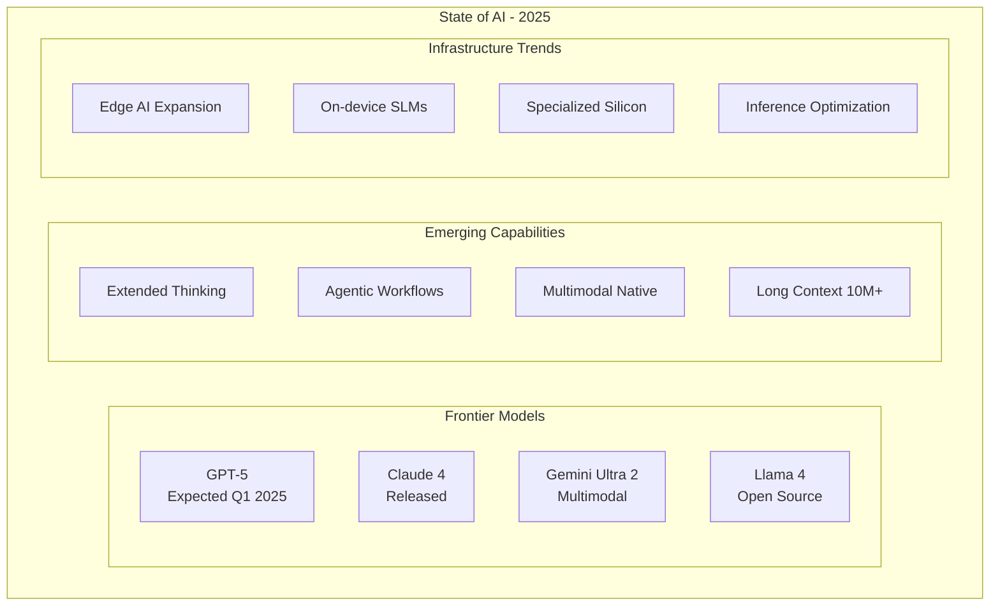
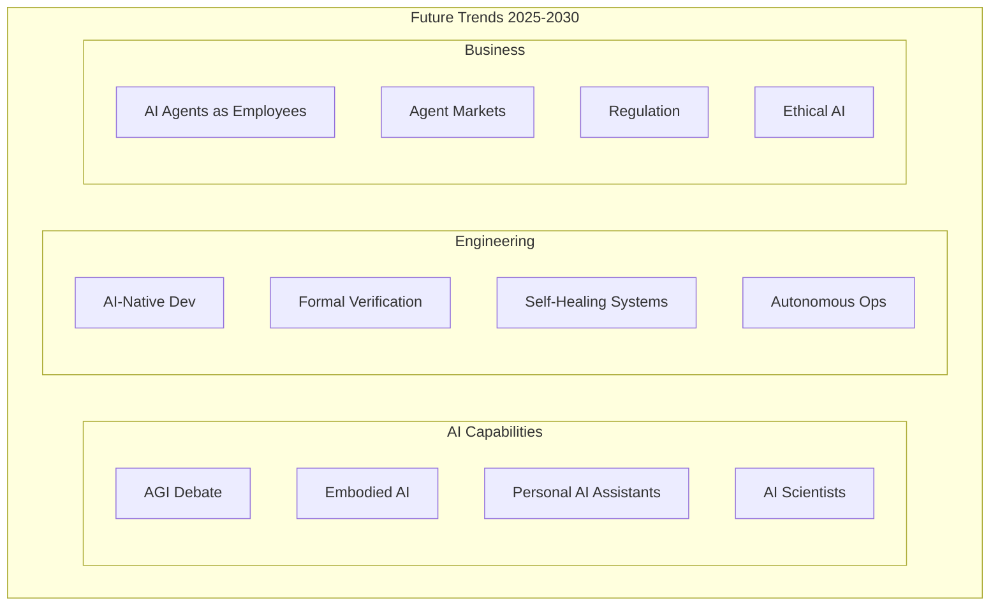

# Clase 32: Cierre y Lecciones Aprendidas

## Duración: 4 horas

---

## Objetivos de Aprendizaje

Al finalizar esta clase, el estudiante será capaz de:

1. **Recapitular los conceptos clave** del curso
2. **Comprender el estado del arte** de la tecnología en 2024-2025
3. **Identificar tendencias futuras** en sistemas multi-agente
4. **Acceder a recursos** para continuar aprendizaje
5. **Planificar su carrera** en el campo de IA y sistemas autónomos

---

## Contenidos Detallados

### 1. Recapitulación de Conceptos del Curso (60 minutos)

```mermaid
graph TB
    subgraph "Course Architecture Overview"
        subgraph "Foundation (Weeks 1-4)"
            F1[Introducción a IA]
            F2[Agentes Inteligentes]
            F3[LLMs y SLMs]
            F4[Patterns Arquitectónicos]
        end
        
        subgraph "Implementation (Weeks 5-8)"
            I1[LangChain/LangGraph]
            I2[Multi-Agent Systems]
            I3[Fine-tuning]
            I4[Vector DBs]
        end
        
        subgraph "Infrastructure (Weeks 9-12)"
            IN1[Kubernetes]
            IN2[IaC Terraform]
            IN3[Observabilidad]
            IN4[Deployment]
        end
        
        subgraph "Production (Weeks 13-16)"
            P1[Testing/QA]
            P2[Performance]
            P3[Security]
            P4[Proyecto Final]
        end
    end
    
    F1 --> F2 --> F3 --> F4
    F4 --> I1 --> I2 --> I3 --> I4
    I4 --> IN1 --> IN2 --> IN3 --> IN4
    IN4 --> P1 --> P2 --> P3 --> P4
```



#### 1.1 Mapa Conceptual del Curso

```markdown
# Recapitulación: Conceptos Fundamentales

## 1. Agentes Inteligentes

### Definición
"Un agente es un sistema que percibe su entorno y toma acciones 
que maximizan sus posibilidades de éxito."

### Componentes de un Agente
1. **Percepción**: Recopila información del ambiente
2. **Razonamiento**: Procesa y decide basado en información
3. **Acción**: Ejecuta decisiones
4. **Memoria**: Mantiene estado y contexto

### Tipos de Agentes
- **Reactive**: Responden a estímulos directamente
- **Deliberative**: Planifican antes de actuar
- **Hybrid**: Combinan ambos enfoques

---

## 2. Large Language Models (LLM)

### Qué son
Modelos de lenguaje entrenados con billions de parámetros, capaces 
de generar texto coherente y realizar tareas de NLP.

### SLM vs LLM

| Característica | SLM (<10B params) | LLM (>10B params) |
|----------------|-------------------|------------------|
| Costo inferencia | Bajo | Alto |
| Velocidad | Rápido | Lento |
| Capacidad | Limitada | Superior |
| Fine-tuning | Fácil | Computacional |
| Uso | Tareas específicas | Tareas complejas |

### Técnicas de Optimización
1. **Quantization**: Reducir precisión de pesos
2. **Pruning**: Eliminar conexiones innecesarias
3. **Distillation**: Transferir conocimiento a modelo menor
4. **Caching**: Guardar respuestas frecuentes

---

## 3. Sistemas Multi-Agente

### Patrones de Comunicación
1. **Direct Messaging**: Agente a agente
2. **Broadcast**: Uno a muchos
3. **Blackboard**: Espacio compartido
4. **Publish/Subscribe**: Basado en eventos

### Patrones de Coordinación
1. **Hierarchical**: Estructura de árbol
2. **Market-based**: Subastas y negociación
3. **Behavior-based**: Reglas y behaviors
4. **Utility-based**: Optimización de función objetivo

### Desafíos
- Consistencia de estado
- deadlocks y race conditions
- Comunicación eficiente
- Manejo de fallos

---

## 4. Patrones Arquitectónicos

### CQRS (Command Query Responsibility Segregation)
Separa operaciones de lectura y escritura para optimizar cada una.

### Event Sourcing
Guarda todos los eventos en vez del estado actual, permitiendo 
reconstrucción y auditoría completa.

### Saga Pattern
Maneja transacciones distribuidas con compensaciones locales.

### Circuit Breaker
Previene cascading failures aislando componentes problemáticos.

---

## 5. Infrastructure as Code

### Terraform
```hcl
# Ejemplo de módulo
module "eks" {
  source  = "terraform-aws-modules/eks/aws"
  version = "~> 19.0"
  
  cluster_name    = "companybox"
  cluster_version = "1.29"
  
  vpc_id     = module.vpc.vpc_id
  subnet_ids = module.vpc.private_subnet_ids
}
```

### Kubernetes
- **Deployments**: Define aplicaciones stateless
- **StatefulSets**: Para aplicaciones con estado
- **Services**: Abstracción de red
- **ConfigMaps/Secrets**: Configuración
- **HPA**: Auto-scaling

---

## 6. Testing

### Tipos de Testing
1. **Unit Tests**: Componentes individuales
2. **Integration Tests**: Interacción entre componentes
3. **E2E Tests**: Flujos completos de usuario
4. **Load Tests**: Rendimiento bajo carga
5. **Chaos Tests**: Resiliencia ante fallos

### Testing de Agentes
- Prompt injection testing
- Output validation
- Behavioral testing
- Regression testing de prompts

---

## 7. Observabilidad

### Tres Pilares
1. **Logs**: Eventos discretos
2. **Metrics**: Valores numéricos agregados
3. **Traces**: Requests distribuidos

### Herramientas
- Prometheus + Grafana
- Jaeger/Zipkin
- ELK Stack
- Datadog/New Relic

### SLOs y SLIs
- **SLO**: "99.9% uptime"
- **SLI**: "Porcentaje de requests exitosos"
```

---

### 2. Estado del Arte 2024-2025 (60 minutos)



#### 2.1 Tendencias en LLMs (2024-2025)

```markdown
# Estado del Arte: Modelos de Lenguaje 2025

## Modelos Lanzados/Recientes

### OpenAI
- **GPT-4 Turbo**: $0.01/1K tokens, 128K context
- **GPT-4o**: Native multimodality, $0.005/1K tokens
- **o1/o3**: Reasoning models con chain-of-thought

### Anthropic
- **Claude 3.5**: 200K context, mejor coding
- **Claude 3.5 Sonnet**: Balance costo-rendimiento

### Google
- **Gemini 1.5 Pro**: 1M tokens context
- **Gemini Ultra**: State-of-the-art en benchmarks

### Meta
- **Llama 3**: 8B, 70B, 405B params
- **Llama 3.1**: 405B con 128K context
- **Llama 3.2**: Lightweight + multimodal

## Tendencias Clave

### 1. Agentes Nativos
Los modelos están siendo optimizados para agentic workflows:
- Tool use mejorado
- Multi-step reasoning
- Planning capabilities

### 2. Long Context
Capacidad de procesar documentos de millones de tokens:
- Análisis de codebases completas
- Búsqueda en documentos extensos
- Memoria de conversación ilimitada

### 3. Multimodalidad Nativa
Modelos que procesan texto, imagen, audio, video:
- GPT-4V, Gemini Vision
- Transcripción y síntesis
- Generación de imágenes

### 4. Eficiencia
Avances en inferencia:
- Quantization 4-bit/8-bit estándar
- Speculative decoding
- KV cache optimizado
```

#### 2.2 Estado del Arte: Sistemas Multi-Agente

```markdown
# Sistemas Multi-Agente: Estado del Arte 2025

## Frameworks Principales

### LangChain/LangGraph
- Agentes con tool use
- Graph-based orchestration
- Memory management
- Enterprise support

### AutoGen (Microsoft)
- Multi-agent conversations
- Code execution
- Human-in-the-loop

### CrewAI
- Role-based agents
- Task decomposition
- Hierarchical teams

### OpenAI Swarm
- Handoffs entre agentes
- Lightweight orchestration
- Experimental

## Patterns Emergentes

### 1. Agentic RAG
Retrieval-Augmented Generation con agentes que:
- Deciden qué buscar
- Iteran sobre resultados
- Citan fuentes automáticamente

### 2. Self-Improving Agents
Agentes que:
- Aprenden de errores
- Refinan prompts automáticamente
- Optimizan workflows

### 3. Collaborative AI
Múltiples agentes especializados que:
- Colaboran en tareas complejas
- Discuten y debaten soluciones
- Llegan a consensos

## Casos de Uso Actuales

| Sector | Aplicación | Agentes Típicos |
|--------|------------|-----------------|
| Legal | Due diligence | Researcher, Analyzer, Reporter |
| Finance | Investment analysis | Data Collector, Analyst, Advisor |
| Healthcare | Diagnosis support | Symptom Analyzer, Research, Recommendation |
| Customer Service | Support | Router, Resolver, Escalator |
| Software | Code generation | Architect, Coder, Tester, Reviewer |
```

#### 2.3 Estado del Arte: Infrastructure

```markdown
# Infrastructure: Estado del Arte 2025

## Kubernetes & Cloud Native

### K8s 1.30+
- **Improved GPU scheduling**: Mejor soporte para NVIDIA, AMD GPUs
- **Gateway API v1**: Graduación a stable
- **In-Place Pod Resizing**: Modificar recursos sin restart

### Service Mesh
- **Istio 1.22+**: Mejor performance, WASM extensions
- **Linkerd 2.16+**: Simplicidad, Rust-based
- **Cilium**: eBPF-based, mejor networking

## MLOps & AI Infrastructure

### Training
- Multi-node training con PyTorch FSDP
- Ray for distributed training
- Kubernetes-native training operators

### Inference
- **vLLM**: PagedAttention, 24x throughput
- **TensorRT-LLM**: Optimized inference
- **Ollama**: Local inference simplificado

### Model Serving
- **KServe**: Standard inference API
- **Triton**: Multi-framework serving
- **Ray Serve**: Flexible, scalable

## Observabilidad

### Prometheus + Grafana 11+
- Improved dashboarding
- Better alerting
- Cost optimization insights

### Tracing
- **OpenTelemetry**: Standard for distributed tracing
- **Tempo**: Cost-effective storage
- **Jaeger**: Visualization

## Cost Optimization

### Strategies
1. Spot instances para workloads fault-tolerant
2. Reserved instances para baseline
3. Savings plans para compute
4. Serverless para bursty workloads

### Tools
- Kubecost for Kubernetes costs
- AWS Cost Explorer
- GCP Cost Management
```

---

### 3. Tendencias Futuras (45 minutos)



#### 3.1 Predicciones a 5 Años

```markdown
# Tendencias Futuras: 2025-2030

## 1. Evolución de Agentes

### 2025-2026: Agentes Especializados
- Agentes para tareas específicas (coding, research, analysis)
- Mejores tools y APIs
- Deployment de agentes como servicios

### 2027-2028: Agentes Colaborativos
- Equipos de agentes trabajando juntos
- Especialización más granular
- Agent-to-agent negotiation

### 2029-2030: Agentes Autonomous
- Menor intervención humana
- Auto-deployment y self-healing
- Ética y safety integrados

## 2. Infraestructura

### Edge AI Expansion
- SLMs en dispositivos móviles
- On-device inference
- Privacy-preserving AI

### Specialized Hardware
- TPUs, Groqs, NPUs
- AI accelerators en edge
- Custom silicon

### Software Evolution
- AI-native programming languages
- Formal verification para AI systems
- Declarative AI specifications

## 3. Impacto en Software Engineering

### Rol del Ingeniero
| Hoy | 2027 | 2030 |
|-----|------|------|
| Escribir código | Prompts y specs | Supervisar agentes |
| Debug manual | AI-assisted debug | Self-debugging |
| Testing manual | AI-generated tests | Continuous verification |
| Deploy manual | CI/CD + AI | Autonomous deploy |

### Nuevas Especialidades
- **AI/ML Engineer**: Training y fine-tuning
- **Agentic Systems Engineer**: Diseño de agentes
- **Prompt Engineer**: Crafting de prompts
- **AI Ethics Engineer**: Bias y safety

## 4. Consideraciones Éticas y Regulatorias

### Regulación
- EU AI Act implementation
- US AI governance frameworks
- Global AI standards

### Ética
- Transparency y explainability
- Privacy y data protection
- Bias mitigation
```

---

### 4. Recursos para Continuar Aprendiendo (30 minutos)

#### 4.1 Recursos Recomendados

```markdown
# Recursos para Continuar Aprendizaje

## Cursos y Certificaciones

### AI/ML
- [Coursera: Deep Learning Specialization](https://www.coursera.org/specializations/deep-learning)
- [Fast.ai: Practical Deep Learning](https://fast.ai/)
- [Stanford CS224N: NLP with Transformers](https://web.stanford.edu/class/cs224n/)

### MLOps
- [Coursera: MLOps Specialization](https://www.coursera.org/specializations/mlops-machine-learning-duke)
- [KubeFlow Fundamentals](https://www.edx.org/course/fundamentals-of-kubeflow-for-machine-learning)

### Cloud
- [AWS Certified Machine Learning](https://aws.amazon.com/certification/certified-machine-learning-specialty/)
- [Google Cloud Professional ML Engineer](https://cloud.google.com/certification/machine-learning-engineer)

---

## Libros Recomendados

### Agentes y AI
- "Hands-On RESTful API Design Patterns" - Best practices
- "Designing Data-Intensive Applications" - Martin Kleppmann
- "Building Intelligent Systems" - Jeff Hong

### Engineering
- "Site Reliability Engineering" - Google
- "The DevOps Handbook" - Gene Kim
- "Chaos Engineering" - Casey Rosenthal

---

## Blogs y Publicaciones

### AI/ML
- [OpenAI Blog](https://openai.com/blog)
- [Anthropic Blog](https://www.anthropic.com/news)
- [Hugging Face Blog](https://huggingface.co/blog)
- [Lil'Log (Lilian Weng)](https://lilianweng.github.io/posts/2023-06-23-agent/)

### Engineering
- [Kubernetes Blog](https://kubernetes.io/blog/)
- [The New Stack](https://thenewstack.io/)
- [InfoQ](https://www.infoq.com/)

---

## Comunidades

### Online
- [Hugging Face Discord](https://discord.gg/hugging-face-879548962464195619)
- [LangChain Discord](https://discord.gg/langchain)
- [Reddit r/MachineLearning](https://reddit.com/r/MachineLearning)
- [Reddit r/LocalLLaMA](https://reddit.com/r/LocalLLaMA)

### Conferences
- NeurIPS (AI research)
- ICML (Machine learning)
- KubeCon (Cloud native)
- AWS re:Invent
- Google I/O

---

## Proyectos para Continuar Practicando

### Nivel Principiante
1. Construir un chatbot simple con LangChain
2. Implementar RAG con vector database
3. Crear un agente con tool use

### Nivel Intermedio
1. Desplegar multi-agent system en Kubernetes
2. Implementar fine-tuning de modelo
3. Construir sistema de monitoring

### Nivel Avanzado
1. Desarrollar framework de agentes custom
2. Implementar RLHF para fine-tuning
3. Construir agent swarm
```

---

### 5. Plan de Carrera (30 minutos)

#### 5.1 Hoja de Ruta Profesional

```markdown
# Plan de Carrera: Ingeniero de Sistemas Multi-Agente

## Nivel Junior (0-2 años)

### Habilidades Técnicas
- [ ] Python proficiency
- [ ] APIs REST/GraphQL
- [ ] Docker y containers
- [ ] Git y CI/CD básico
- [ ] Fundamentos de ML/AI

### Habilidades Blandas
- [ ] Documentación clara
- [ ] Comunicación técnica
- [ ] Trabajo en equipo
- [ ] Aprendizaje continuo

### Posiciones Típicas
- Junior Software Engineer
- ML Engineering Intern
- AI Research Intern

---

## Nivel Mid (2-5 años)

### Habilidades Técnicas
- [ ] LangChain/LangGraph o similar
- [ ] Kubernetes y cloud platforms
- [ ] Fine-tuning de modelos
- [ ] Vector databases
- [ ] System design

### Habilidades Blandas
- [ ] Mentoría
- [ ] Estimation de proyectos
- [ ] Code review
- [ ] Presentations técnicas

### Posiciones Típicas
- Software Engineer - AI/ML
- AI Engineer
- Backend Engineer (AI focus)

---

## Nivel Senior (5-8 años)

### Habilidades Técnicas
- [ ] Diseño de sistemas multi-agente
- [ ] Fine-tuning advanced
- [ ] MLOps completo
- [ ] Performance optimization
- [ ] Security en AI systems

### Habilidades Blandas
- [ ] Liderazgo técnico
- [ ] Arquitectura de decisiones
- [ ] Stakeholder management
- [ ] Entrevistas técnicas

### Posiciones Típicas
- Senior AI Engineer
- Staff ML Engineer
- AI Architect

---

## Nivel Staff/Principal (8+ años)

### Habilidades
- [ ] Estrategia de AI
- [ ] Technical leadership organization-wide
- [ ] Research translation
- [ ] External presence (publications, talks)
- [ ] Hiring y team building

### Posiciones Típicas
- Principal AI Engineer
- Distinguished Engineer
- VP of AI Engineering
- Director of AI Research
```

#### 5.2 Entrevista Técnica: Preguntas Frecuentes

```markdown
# Preguntas de Entrevista: Sistemas Multi-Agente

## Conceptos Básicos
1. ¿Qué es un agente de IA?
2. Explica la diferencia entre prompting y fine-tuning.
3. ¿Qué es RAG y cuándo lo usarías?
4. Explica qué es un vector embedding.

## Diseño de Sistemas
1. ¿Cómo diseñarías un chatbot de customer support?
2. ¿Cómo manejarías el contexto en conversaciones largas?
3. ¿Qué estrategias usarías para reducir costos de LLM?
4. ¿Cómo implementarías fallback cuando un LLM falla?

## Implementación
1. Explica cómo funciona attention en transformers.
2. ¿Qué es quantization y qué tipos conoces?
3. ¿Cómo elegirías entre un SLM y un LLM?
4. ¿Cómo implementarías rate limiting para APIs de LLM?

## Operaciones
1. ¿Cómo monitorizarias un sistema de producción con LLMs?
2. ¿Qué métricas son importantes para sistemas de AI?
3. ¿Cómo harías debugging cuando un LLM da respuestas inesperadas?
4. ¿Qué consideraciones de seguridad hay en sistemas de AI?

## Comportamentales
1. Describe un proyecto de AI que hayas enjoyed.
2. ¿Cómo te mantienes actualizado en AI?
3. ¿Qué desafíos ves en el campo de AI?
```

---

### 6. Ceremonia de Cierre (30 minutos)

```markdown
# Ceremonia de Cierre del Curso

## Celebrando el Logro

¡Felicitaciones por completar el curso de 
Ingeniería de Organizaciones Autónomas!

Han construido un sistema completo de Company-in-a-Box:
- ✓ 4+ agentes especializados
- ✓ Integración con SLMs y LLMs
- ✓ Infrastructure en Kubernetes
- ✓ Testing completo
- ✓ Demo en producción simulada

---

## Lo que Han Aprendido

### Conceptos Técnicos
- Fundamentos de LLMs y SLMs
- Patrones de sistemas multi-agente
- Fine-tuning y optimización
- Kubernetes y cloud-native
- Observabilidad y testing

### Habilidades Prácticas
- Diseño de arquitecturas de AI
- Deployment de sistemas de producción
- Troubleshooting y debugging
- Presentación técnica
- Trabajo en equipo

---

## Próximos Pasos

### Para Casa
1. Continuar contributing al proyecto
2. Implementar features adicionales
3. Mejorar documentación
4. Escribir blog posts sobre el proyecto

### Para la Carrera
1. Agregar proyecto a portfolio
2. Preparar para entrevistas técnicas
3. Contribuir a proyectos open source
4. Network con la comunidad

---

## Mantente Conectado

### Comunidad
- Slack/Discord del curso
- LinkedIn Group
- GitHub repository

### Recursos
- Repositorio del curso
- Documentación de referencia
- Grabaciones de clases

---

## Feedback

Tu retroalimentación es importante:
- Course evaluation survey
- One-on-one feedback
- Public review

---

## Gracias

Gracias por su participación, esfuerzo y dedicación.
¡Les deseamos mucho éxito en sus proyectos de AI!

El Equipo de Instructores
```

---

### 7. Actividades Finales (45 minutos)

#### 7.1 Auto-Evaluación

```markdown
# Auto-Evaluación del Curso

## Conocimiento Técnico

Evalúa tu nivel actual (1-5):

### Fundamentos de AI/ML
1. Entiendo cómo funcionan los LLMs: ______
2. Puedo explicar fine-tuning vs prompting: ______
3. Conozco diferentes tipos de embeddings: ______

### Sistemas Multi-Agente
4. Puedo diseñar un sistema multi-agente: ______
5. Entiendo patrones de coordinación: ______
6. Conozco frameworks de agentes: ______

### Infrastructure
7. Puedo desplegar en Kubernetes: ______
8. Entiendo IaC con Terraform: ______
9. Conozco herramientas de observabilidad: ______

### Testing
10. Puedo escribir tests para sistemas de AI: ______
11. Entiendo chaos engineering: ______
12. Sé hacer load testing: ______

## Proyectos Completados

| Proyecto | Completado | Calidad | Áreas de mejora |
|----------|------------|---------|-----------------|
| Agent Runtime | ☐ | /10 | |
| Fine-tuning | ☐ | /10 | |
| Deployment | ☐ | /10 | |
| Demo Final | ☐ | /10 | |

## Áreas de Interés para Continuar

1. _________________________________
2. _________________________________
3. _________________________________

## Feedback para el Curso

¿Qué fue lo más valioso?
_______________________________________________

¿Qué se puede mejorar?
_______________________________________________

¿Recomendaciones para futuros estudiantes?
_______________________________________________
```

#### 7.2 Certificado de Completación

```markdown
# CERTIFICADO DE COMPLETACIÓN

---

Este certificado reconoce que

**[NOMBRE DEL ESTUDIANTE]**

ha completado satisfactoriamente el curso de

## Ingeniería de Organizaciones Autónomas (Deep Tech)

cubriendo los siguientes temas:
- Fundamentos de LLMs y SLMs
- Diseño de sistemas multi-agente
- Fine-tuning y optimización
- Infrastructure como Código
- Kubernetes y Cloud Native
- Testing y QA de sistemas de AI
- Observabilidad y monitoreo
- Deployment de producción

**Duración**: 16 semanas
**Proyecto Final**: Company-in-a-Box

Fecha: _______________

Instructor: _______________

---

"The best way to predict the future is to create it."
- Peter Drucker
```

---

## Resumen Final del Curso

### Conceptos Clave del Curso

1. **LLMs y SLMs**: Modelos de lenguaje, fine-tuning, optimization
2. **Agentes Inteligentes**: Percepción, razonamiento, acción, memoria
3. **Sistemas Multi-Agente**: Comunicación, coordinación, colaboración
4. **Infraestructura Cloud-Native**: Kubernetes, Terraform, observabilidad
5. **Testing de AI**: Unit, integration, E2E, chaos, performance
6. **Deployment de Producción**: CI/CD, monitoring, troubleshooting

### Herramientas Dominadas

- Python, async/await
- LangChain/LangGraph
- Ollama, vLLM
- Kubernetes, Helm
- Terraform
- Prometheus, Grafana
- PostgreSQL, Redis, Qdrant
- Docker, GitHub Actions

### Próximos Pasos

1. Continuar aprendiendo y practicando
2. Contribuir a proyectos open source
3. Construir portfolio de proyectos
4. Network con la comunidad
5. Aplicar conceptos en trabajo real

---

## Referencias y Recursos Adicionales

### Documentación Oficial
- [LangChain Documentation](https://docs.langchain.com/)
- [Kubernetes Documentation](https://kubernetes.io/docs/)
- [Terraform Documentation](https://developer.hashicorp.com/terraform/docs)
- [Ollama Documentation](https://github.com/ollama/ollama)
- [Qdrant Documentation](https://qdrant.tech/documentation/)

### Papers Importantes
- "Attention Is All You Need" - Vaswani et al.
- "Chain-of-Thought Prompting" - Wei et al.
- "ReAct: Synergizing Reasoning and Acting" - Yao et al.
- "Retrieval-Augmented Generation for Knowledge-Intensive NLP" - Lewis et al.

### Comunidades
- Hugging Face Discord
- LangChain Discord
- r/MachineLearning
- r/LocalLLaMA

---

*Fin del Curso: Ingeniería de Organizaciones Autónomas (Deep Tech)*

*© 2025 - Todos los derechos reservados*
