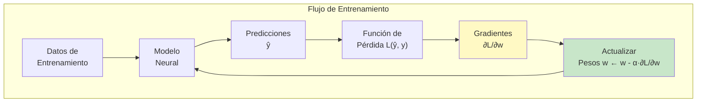

# CLASE 6: Algoritmo de Retropropagación (Backpropagation)

## 📋 Información General

| Campo | Detalle |
|-------|---------|
| **Duración** | 4 horas (240 minutos) |
| **Modalidad** | Teórico-Práctico |
| **Prerrequisitos** | Clases 3-4 completadas (perceptrón, forward propagation), conocimientos de cálculo |
| **Tecnología** | NumPy, PyTorch, TensorFlow |

---

## 🎯 Objetivos de Aprendizaje

Al finalizar esta clase, el estudiante será capaz de:

1. **Comprender** el algoritmo de retropropagación como método de optimización
2. **Calcular** derivadas usando la regla de la cadena
3. **Implementar** backpropagation desde cero para una red feedforward
4. **Diferenciar** entre funciones de pérdida para clasificación y regresión
5. **Utilizar** PyTorch para calcular gradientes automáticamente
6. **Diagnosticar** y resolver problemas de convergencia
7. **Comprender** la diferencia entre gradiente descendiente y sus variantes

---

## 📚 Contenidos Detallados

### 6.1 Introducción: El Problema de la Optimización en Redes Neuronales

El entrenamiento de una red neuronal consiste en encontrar los pesos que minimizan una función de pérdida. Esto se logra mediante descenso del gradiente, donde los gradientes se calculan eficientemente usando retropropagación.



### 6.2 Descenso del Gradiente (Gradient Descent)

El descenso del gradiente es el algoritmo fundamental de optimización en machine learning:

$$w^{(t+1)} = w^{(t)} - \alpha \cdot \nabla L(w^{(t)})$$

donde α es la tasa de aprendizaje y ∇L es el gradiente de la pérdida.

```python
"""
Implementación de Descenso del Gradiente desde cero
"""

import numpy as np
import matplotlib.pyplot as plt

class GradientDescent:
    """
    Implementación de diferentes variantes de descenso del gradiente.
    """
    
    @staticmethod
    def basic_gd(func, grad, x0, learning_rate=0.1, n_iterations=100):
        """
        Descenso del gradiente básico (Batch Gradient Descent).
        
        Actualiza todos los pesos al mismo tiempo usando el gradiente
        de toda la función de pérdida.
        
        Args:
            func: Función a minimizar
            grad: Gradiente de la función
            x0: Punto inicial
            learning_rate: Tasa de aprendizaje α
            n_iterations: Número de iteraciones
            
        Returns:
            historial de valores de la función
        """
        x = x0.copy()
        history = [func(x)]
        
        for i in range(n_iterations):
            gradiente = grad(x)
            x = x - learning_rate * gradiente
            history.append(func(x))
        
        return x, history
    
    @staticmethod
    def stochastic_gd(func, grad, data, labels, learning_rate=0.1, n_epochs=100):
        """
        Stochastic Gradient Descent (SGD): actualiza usando un ejemplo a la vez.
        
        Ventajas:
        - Puede escapar de mínimos locales
        - Más rápido en datasets grandes
        - Permite aprendizaje online
        
        Desventajas:
        - Más ruidoso (no converge suavemente)
        - Puede oscilar alrededor del mínimo
        """
        x = np.copy(data)
        
        for epoch in range(n_epochs):
            # Barajar datos
            indices = np.random.permutation(len(data))
            
            for idx in indices:
                x_i = data[idx]
                y_i = labels[idx]
                
                # Calcular gradiente para un punto
                grad_i = grad(x_i, y_i)
                x = x - learning_rate * grad_i
        
        return x
    
    @staticmethod
    def mini_batch_gd(func, grad, data, labels, batch_size=32, learning_rate=0.1, n_epochs=100):
        """
        Mini-Batch GD: divide datos en batches y actualiza por batch.
        
        Combina las ventajas de BGD (estable) y SGD (rápido).
        """
        x = np.copy(data)
        n_samples = len(data)
        
        history = []
        
        for epoch in range(n_epochs):
            # Barajar datos
            indices = np.random.permutation(n_samples)
            
            for start in range(0, n_samples, batch_size):
                end = min(start + batch_size, n_samples)
                batch_idx = indices[start:end]
                
                batch_data = data[batch_idx]
                batch_labels = labels[batch_idx]
                
                # Calcular gradiente promedio del batch
                grad_batch = np.mean([grad(x_i, y_i) for x_i, y_i in zip(batch_data, batch_labels)], axis=0)
                
                x = x - learning_rate * grad_batch
            
            history.append(func(x))
        
        return x, history


def ejemplo_gradient_descent():
    """Ejemplo de descenso del gradiente para minimizar una función cuadrática."""
    
    print("=" * 60)
    print("EJEMPLO: DESCENSO DEL GRADIENTE")
    print("=" * 60)
    
    # Función: f(x) = x²
    def f(x):
        return x ** 2
    
    def grad_f(x):
        return 2 * x
    
    # Minimizar f(x) = x² (mínimo en x = 0)
    x0 = np.array([5.0])  # Empezar en x = 5
    
    history = []
    x = x0.copy()
    lr = 0.1
    
    for i in range(20):
        history.append(x[0])
        grad = grad_f(x)
        x = x - lr * grad
        print(f"Iteración {i+1:2d}: x = {x[0]:.6f}, f(x) = {f(x):.6f}")
    
    # Visualizar
    x_range = np.linspace(-6, 6, 100)
    plt.figure(figsize=(10, 6))
    plt.plot(x_range, f(x_range), 'b-', label='f(x) = x²')
    plt.plot(history, [f(np.array([h])) for h in history], 'ro-', markersize=5, label='Trayectoria GD')
    plt.axhline(y=0, color='k', linewidth=0.5)
    plt.axvline(x=0, color='k', linewidth=0.5)
    plt.xlabel('x')
    plt.ylabel('f(x)')
    plt.title('Descenso del Gradiente en f(x) = x²')
    plt.legend()
    plt.grid(True, alpha=0.3)
    plt.savefig('gradient_descent_simple.png')
    plt.show()


def comparar_tasa_aprendizaje():
    """Compara diferentes tasas de aprendizaje."""
    
    print("\n" + "=" * 60)
    print("COMPARACIÓN DE TASAS DE APRENDIZAJE")
    print("=" * 60)
    
    def f(x):
        return x ** 4 - 3*x**2 + x
    
    def grad_f(x):
        return 4*x**3 - 6*x + 1
    
    x0 = np.array([1.5])
    learning_rates = [0.01, 0.1, 0.3]
    
    plt.figure(figsize=(12, 6))
    x_range = np.linspace(-2, 2, 200)
    plt.plot(x_range, f(x_range), 'k-', label='f(x)')
    
    colors = ['red', 'blue', 'green']
    
    for lr, color in zip(learning_rates, colors):
        x = x0.copy()
        history = [x[0]]
        
        for _ in range(20):
            grad = grad_f(x)
            x = x - lr * grad
            history.append(x[0])
        
        plt.plot(history, [f(np.array([h])) for h in history], 
                 f'{color}o-', markersize=4, alpha=0.7, label=f'lr={lr}')
    
    plt.xlabel('x')
    plt.ylabel('f(x)')
    plt.title('Efecto de la Tasa de Aprendizaje')
    plt.legend()
    plt.grid(True, alpha=0.3)
    plt.savefig('learning_rates_gd.png')
    plt.show()


if __name__ == "__main__":
    ejemplo_gradient_descent()
    comparar_tasa_aprendizaje()
```

### 6.3 Retropropagación: La Cadena de Derivadas

La retropropagación es el algoritmo que calcula eficientemente los gradientes de la pérdida con respecto a cada peso de la red.

```python
"""
Implementación completa de Backpropagation desde cero
"""

import numpy as np
from typing import List, Tuple

class Capa:
    """Capa de una red neuronal."""
    
    def __init__(self, n_inputs, n_neurons, activation='relu'):
        self.n_inputs = n_inputs
        self.n_neurons = n_neurons
        self.activation = activation
        
        # Inicialización Xavier
        limit = np.sqrt(6.0 / (n_inputs + n_neurons))
        self.weights = np.random.uniform(-limit, limit, (n_inputs, n_neurons))
        self.bias = np.zeros((1, n_neurons))
        
        # Variables para backprop
        self.output = None
        self.input = None
        self.z = None
    
    def forward(self, inputs):
        """Forward pass."""
        self.input = inputs
        self.z = np.dot(inputs, self.weights) + self.bias
        self.output = self.activation_function(self.z)
        return self.output
    
    def activation_function(self, z):
        """Aplicar función de activación."""
        if self.activation == 'sigmoid':
            return 1 / (1 + np.exp(-np.clip(z, -500, 500)))
        elif self.activation == 'relu':
            return np.maximum(0, z)
        elif self.activation == 'tanh':
            return np.tanh(z)
        elif self.activation == 'linear':
            return z
        elif self.activation == 'softmax':
            exp_z = np.exp(z - np.max(z, axis=1, keepdims=True))
            return exp_z / np.sum(exp_z, axis=1, keepdims=True)
        return z
    
    def activation_derivative(self, z):
        """Derivada de la función de activación."""
        if self.activation == 'sigmoid':
            s = 1 / (1 + np.exp(-np.clip(z, -500, 500)))
            return s * (1 - s)
        elif self.activation == 'relu':
            return np.where(z > 0, 1, 0)
        elif self.activation == 'tanh':
            return 1 - np.tanh(z) ** 2
        elif self.activation == 'linear':
            return np.ones_like(z)
        return np.ones_like(z)


class RedNeuronalBP:
    """
    Red neuronal con backpropagation completa.
    
    El algoritmo de backpropagation usa la regla de la cadena:
    
    ∂L/∂w[l] = ∂L/∂a[l] * ∂a[l]/∂z[l] * ∂z[l]/∂w[l]
    
    Para la última capa:
    - Si MSE: ∂L/∂a[L] = 2(a[L] - y) / n
    - Si Cross-Entropy: ∂L/∂a[L] = a[L] - y (con softmax)
    """
    
    def __init__(self, layer_sizes, activations):
        """
        Args:
            layer_sizes: Lista con números de neuronas por capa
            activations: Lista de funciones de activación por capa
        """
        self.layers = []
        
        for i in range(len(layer_sizes) - 1):
            capa = Capa(layer_sizes[i], layer_sizes[i+1], activations[i])
            self.layers.append(capa)
    
    def forward(self, X):
        """Forward pass completo."""
        output = X
        for layer in self.layers:
            output = layer.forward(output)
        return output
    
    def backward(self, y_true, learning_rate):
        """
        Backward pass: calcula gradientes y actualiza pesos.
        
        El proceso:
        1. Calcular error en la última capa: δ[L] = ∂L/∂a[L] * σ'(z[L])
        2. Propagar el error hacia atrás: δ[l] = (W[l+1] · δ[l+1]) * σ'(z[l])
        3. Calcular gradientes: ∂L/∂W = a[l-1] · δ[l], ∂L/∂b = δ[l]
        4. Actualizar pesos: W = W - α * ∂L/∂W
        """
        
        n_samples = y_true.shape[0]
        output = self.layers[-1].output
        
        # ======== Paso 1: Calcular error en la última capa ========
        # Derivada de la pérdida (MSE)
        # dL/da = 2(a - y) / n
        last_layer = self.layers[-1]
        
        if last_layer.activation == 'linear':
            delta = 2 * (output - y_true) / n_samples
        elif last_layer.activation == 'softmax':
            # Para cross-entropy con softmax: dL/da = a - y
            delta = (output - y_true) / n_samples
        else:
            delta = (output - y_true) * last_layer.activation_derivative(last_layer.z)
            delta /= n_samples
        
        # ======== Paso 2: Propagar hacia atrás ========
        for l in range(len(self.layers) - 1, -1, -1):
            layer = self.layers[l]
            
            # Guardar gradientes
            dW = np.dot(layer.input.T, delta)
            db = np.sum(delta, axis=0, keepdims=True)
            
            # Actualizar pesos
            layer.weights -= learning_rate * dW
            layer.bias -= learning_rate * db
            
            # Calcular delta para la capa anterior (si no es la primera)
            if l > 0:
                delta = np.dot(delta, layer.weights.T)
                delta *= self.layers[l-1].activation_derivative(self.layers[l-1].z)
    
    def train(self, X, y, learning_rate=0.01, n_epochs=100, loss_fn='mse'):
        """
        Entrenar la red usando gradient descent.
        
        Args:
            X: Datos de entrada
            y: Etiquetas
            learning_rate: Tasa de aprendizaje
            n_epochs: Número de épocas
            loss_fn: Función de pérdida ('mse' o 'crossentropy')
        """
        losses = []
        
        for epoch in range(n_epochs):
            # Forward pass
            output = self.forward(X)
            
            # Calcular pérdida
            if loss_fn == 'mse':
                loss = np.mean((output - y) ** 2)
            elif loss_fn == 'crossentropy':
                # Evitar log(0)
                eps = 1e-15
                output = np.clip(output, eps, 1 - eps)
                loss = -np.mean(y * np.log(output) + (1 - y) * np.log(1 - output))
            
            losses.append(loss)
            
            # Backward pass
            self.backward(y, learning_rate)
            
            if (epoch + 1) % 10 == 0:
                print(f"Epoch {epoch+1:3d}: Loss = {loss:.6f}")
        
        return losses
    
    def predict(self, X):
        """Predecir clases o valores."""
        return self.forward(X)


def ejemplo_backprop():
    """Ejemplo de entrenamiento con backpropagation."""
    
    print("=" * 60)
    print("EJEMPLO: BACKPROPAGATION")
    print("=" * 60)
    
    # Generar datos de ejemplo (regresión)
    np.random.seed(42)
    X = np.linspace(0, 1, 100).reshape(-1, 1)
    y = 2 * X + 1 + 0.1 * np.random.randn(100, 1)
    
    # Crear red: 1 entrada, 2 capas ocultas (10 neuronas), 1 salida
    red = RedNeuronalBP(
        layer_sizes=[1, 10, 10, 1],
        activations=['relu', 'relu', 'linear']
    )
    
    # Entrenar
    losses = red.train(X, y, learning_rate=0.01, n_epochs=200, loss_fn='mse')
    
    # Plotear pérdida
    plt.figure(figsize=(10, 5))
    plt.plot(losses)
    plt.xlabel('Epoch')
    plt.ylabel('Pérdida MSE')
    plt.title('Curva de Entrenamiento')
    plt.grid(True, alpha=0.3)
    plt.savefig('training_loss.png')
    plt.show()
    
    # Predicciones
    y_pred = red.predict(X)
    
    plt.figure(figsize=(10, 5))
    plt.scatter(X, y, alpha=0.5, label='Datos')
    plt.plot(X, y_pred, 'r-', linewidth=2, label='Predicciones')
    plt.xlabel('X')
    plt.ylabel('y')
    plt.title('Resultados de la Red Neuronal')
    plt.legend()
    plt.grid(True, alpha=0.3)
    plt.savefig('predictions.png')
    plt.show()


if __name__ == "__main__":
    ejemplo_backprop()
```

### 6.4 Funciones de Pérdida

```python
"""
Funciones de pérdida comunes y sus derivadas
"""

class FuncionesPerdida:
    """Colección de funciones de pérdida."""
    
    @staticmethod
    def mse(y_true, y_pred):
        """
        Mean Squared Error (MSE) - Regresión.
        
        L(y, ŷ) = (1/n) * Σ(y - ŷ)²
        
        Derivada: ∂L/∂ŷ = (2/n) * (ŷ - y)
        """
        return np.mean((y_true - y_pred) ** 2)
    
    @staticmethod
    def mse_derivative(y_true, y_pred):
        """Derivada de MSE con respecto a ŷ."""
        return 2 * (y_pred - y_true) / len(y_true)
    
    @staticmethod
    def mae(y_true, y_pred):
        """
        Mean Absolute Error (MAE) - Regresión.
        
        L(y, ŷ) = (1/n) * Σ|y - ŷ|
        
        Derivada: ∂L/∂ŷ = sign(ŷ - y) / n
        """
        return np.mean(np.abs(y_true - y_pred))
    
    @staticmethod
    def cross_entropy(y_true, y_pred, epsilon=1e-15):
        """
        Cross-Entropy Loss - Clasificación binaria/multiclase.
        
        L(y, ŷ) = -(1/n) * Σ[y*log(ŷ) + (1-y)*log(1-ŷ)]
        
        Derivada (con sigmoid): ∂L/∂ŷ = (ŷ - y) / (ŷ(1-ŷ))
        
        Simplificado con sigmoid: ∂L/∂ŷ = ŷ - y
        """
        y_pred = np.clip(y_pred, epsilon, 1 - epsilon)
        return -np.mean(y_true * np.log(y_pred) + (1 - y_true) * np.log(1 - y_pred))
    
    @staticmethod
    def categorical_cross_entropy(y_true, y_pred, epsilon=1e-15):
        """
        Categorical Cross-Entropy - Clasificación multiclase.
        
        L(y, ŷ) = -(1/n) * Σ Σ y_k * log(ŷ_k)
        
        Derivada (con softmax): ∂L/∂ŷ_k = ŷ_k - y_k
        """
        y_pred = np.clip(y_pred, epsilon, 1 - epsilon)
        return -np.mean(np.sum(y_true * np.log(y_pred), axis=1))
    
    @staticmethod
    def hinge(y_true, y_pred):
        """
        Hinge Loss - Support Vector Machine.
        
        L(y, ŷ) = (1/n) * Σ max(0, 1 - y * ŷ)
        """
        return np.mean(np.maximum(0, 1 - y_true * y_pred))


def comparar_funciones_perdida():
    """Compara visualmente las funciones de pérdida."""
    
    print("=" * 60)
    print("COMPARACIÓN DE FUNCIONES DE PÉRDIDA")
    print("=" * 60)
    
    # Generar datos
    y_true = np.array([0, 0, 1, 1])
    y_pred = np.linspace(0, 1, 100)
    
    # Calcular pérdidas
    mse_loss = [(y - 0)**2 for y in y_pred]
    ce_loss = [-(0 * np.log(max(y, 1e-15)) + 1 * np.log(max(1-y, 1e-15))) for y in y_pred]
    hinge_loss = [max(0, 1 - yt * yp) for yt, yp in zip([1, 1, -1, -1], np.tile(y_pred, (4, 1)).T)]
    
    plt.figure(figsize=(12, 5))
    
    plt.subplot(1, 2, 1)
    plt.plot(y_pred, mse_loss, label='MSE')
    plt.plot(y_pred, ce_loss, label='Cross-Entropy')
    plt.xlabel('Predicción')
    plt.ylabel('Pérdida')
    plt.title('Funciones de Pérdida (y=1)')
    plt.legend()
    plt.grid(True, alpha=0.3)
    
    plt.subplot(1, 2, 2)
    plt.semilogy(y_pred, mse_loss, label='MSE')
    plt.semilogy(y_pred, ce_loss, label='Cross-Entropy')
    plt.xlabel('Predicción')
    plt.ylabel('Pérdida (log)')
    plt.title('Escala Logarítmica')
    plt.legend()
    plt.grid(True, alpha=0.3)
    
    plt.tight_layout()
    plt.savefig('loss_functions.png')
    plt.show()
    
    print("""
    Comparación de Funciones de Pérdida:
    ======================================
    
    1. MSE (Mean Squared Error):
       - Ventajas: Diferenciable, penaliza errores grandes
       - Desventajas: Sensible a outliers
       - Mejor para: Regresión
    
    2. Cross-Entropy:
       - Ventajas: Mejor para clasificación, gradientes más estables
       - Desventajas: Requiere softmax/sigmoid
       - Mejor para: Clasificación binaria/multiclase
    
    3. Hinge (SVM):
       - Ventajas: Robusto a outliers
       - Desventajas: No diferenciable en todos los puntos
       - Mejor para: Clasificación con margen
    """)


comparar_funciones_perdida()
```

### 6.5 Implementación con PyTorch (Automatic Differentiation)

```python
"""
Implementación de redes neuronales usando PyTorch
y su sistema de diferenciación automática
"""

import torch
import torch.nn as nn
import torch.optim as optim

class RedPyTorch(nn.Module):
    """Red neuronal en PyTorch."""
    
    def __init__(self, input_size, hidden_size, output_size):
        super(RedPyTorch, self).__init__()
        
        self.layer1 = nn.Linear(input_size, hidden_size)
        self.layer2 = nn.Linear(hidden_size, hidden_size)
        self.layer3 = nn.Linear(hidden_size, output_size)
        self.relu = nn.ReLU()
        
    def forward(self, x):
        x = self.relu(self.layer1(x))
        x = self.relu(self.layer2(x))
        x = self.layer3(x)
        return x


def ejemplo_pytorch_autograd():
    """Ejemplo de PyTorch con autograd."""
    
    print("=" * 60)
    print("PYTORCH: AUTODIFF Y BACKPROPAGATION")
    print("=" * 60)
    
    # Verificar gradientes automáticos
    x = torch.tensor([1.0, 2.0, 3.0], requires_grad=True)
    y = x ** 2
    z = y.sum()  # z = 1 + 4 + 9 = 14
    
    print(f"x = {x}")
    print(f"y = x² = {y}")
    print(f"z = sum(y) = {z}")
    
    # Calcular gradientes
    z.backward()
    
    print(f"\nGradiente dz/dx = 2x = {x.grad}")
    
    # Verificar: dz/dx = 2x = [2, 4, 6]
    print("Verificación: 2*x =", x * 2)


def ejemplo_entrenamiento_pytorch():
    """Entrenamiento completo en PyTorch."""
    
    print("\n" + "=" * 60)
    print("ENTRENAMIENTO EN PYTORCH")
    print("=" * 60)
    
    # Datos de ejemplo (clasificación)
    torch.manual_seed(42)
    
    # Generar datos sintéticos
    n_samples = 200
    X = torch.randn(n_samples, 2)
    y = (X[:, 0] + X[:, 1] > 0).float()  # Clasificación binaria
    
    # Crear modelo
    model = RedPyTorch(input_size=2, hidden_size=16, output_size=1)
    
    # Función de pérdida y optimizador
    criterion = nn.BCEWithLogitsLoss()  # sigmoid + cross-entropy
    optimizer = optim.Adam(model.parameters(), lr=0.01)
    
    print(f"Modelo: {model}")
    print(f"\nParámetros: {sum(p.numel() for p in model.parameters())}")
    
    # Entrenamiento
    losses = []
    
    for epoch in range(100):
        # Forward pass
        outputs = model(X).squeeze()
        loss = criterion(outputs, y)
        
        # Backward pass
        optimizer.zero_grad()
        loss.backward()
        optimizer.step()
        
        losses.append(loss.item())
        
        if (epoch + 1) % 20 == 0:
            print(f"Epoch {epoch+1}: Loss = {loss.item():.4f}")
    
    # Evaluar
    model.eval()
    with torch.no_grad():
        predictions = (torch.sigmoid(model(X).squeeze()) > 0.5).float()
        accuracy = (predictions == y).float().mean()
    
    print(f"\nPrecisión final: {accuracy.item() * 100:.2f}%")
    
    # Plotear pérdida
    plt.figure(figsize=(10, 5))
    plt.plot(losses)
    plt.xlabel('Epoch')
    plt.ylabel('Pérdida')
    plt.title('Curva de Entrenamiento en PyTorch')
    plt.grid(True, alpha=0.3)
    plt.savefig('pytorch_training.png')
    plt.show()


def ejemplo_backprop_manual_pytorch():
    """Ver cómo PyTorch calcula gradientes internamente."""
    
    print("\n" + "=" * 60)
    print("VISUALIZACIÓN DE GRADIENTES EN PYTORCH")
    print("=" * 60)
    
    # Crear red simple
    model = nn.Sequential(
        nn.Linear(3, 4),
        nn.ReLU(),
        nn.Linear(4, 2),
        nn.Softmax(dim=1)
    )
    
    # Datos de ejemplo
    x = torch.randn(1, 3)
    y = torch.tensor([1])
    
    # Forward pass
    output = model(x)
    loss = nn.CrossEntropyLoss()(output, y)
    
    print(f"Input: {x}")
    print(f"Output: {output}")
    print(f"Loss: {loss}")
    
    # Backward pass (gradientes se calculan automáticamente)
    loss.backward()
    
    # Ver gradientes
    print("\nGradientes de la primera capa:")
    for name, param in model.named_parameters():
        if param.grad is not None:
            print(f"  {name}: media = {param.grad.mean().item():.6f}")


if __name__ == "__main__":
    ejemplo_pytorch_autograd()
    ejemplo_entrenamiento_pytorch()
    ejemplo_backprop_manual_pytorch()
```

### 6.6 Optimizadores Avanzados

```python
"""
Comparación de diferentes optimizadores
"""

def comparar_optimizadores():
    """Compara SGD, Adam, RMSprop."""
    
    import torch
    import torch.nn as optim
    
    print("=" * 60)
    print("COMPARACIÓN DE OPTIMIZADORES")
    print("=" * 60)
    
    # Crear datos de prueba
    torch.manual_seed(42)
    X = torch.randn(100, 1)
    y = 3 * X + 2 + 0.5 * torch.randn(100, 1)
    
    def crear_modelo():
        return nn.Sequential(nn.Linear(1, 1))
    
    optimizers = {
        'SGD': optim.SGD,
        'SGD+Momentum': lambda params: optim.SGD(params, momentum=0.9),
        'Adam': lambda params: optim.Adam(params, lr=0.01),
        'RMSprop': lambda params: optim.RMSprop(params, lr=0.01),
    }
    
    results = {}
    
    for name, optimizer_fn in optimizers.items():
        model = crear_modelo()
        optimizer = optimizer_fn(model.parameters())
        criterion = nn.MSELoss()
        
        losses = []
        for epoch in range(50):
            output = model(X)
            loss = criterion(output, y)
            
            optimizer.zero_grad()
            loss.backward()
            optimizer.step()
            
            losses.append(loss.item())
        
        results[name] = losses
        print(f"{name}: Loss final = {losses[-1]:.4f}")
    
    # Plotear
    plt.figure(figsize=(10, 6))
    for name, losses in results.items():
        plt.plot(losses, label=name)
    
    plt.xlabel('Epoch')
    plt.ylabel('Pérdida MSE')
    plt.title('Comparación de Optimizadores')
    plt.legend()
    plt.grid(True, alpha=0.3)
    plt.savefig('optimizers_comparison.png')
    plt.show()
    
    print("""
    Descripción de Optimizadores:
    ==============================
    
    1. SGD (Stochastic Gradient Descent):
       - Actualiza pesos con gradiente de un batch
       - Puede ser lento y oscilante
    
    2. SGD + Momentum:
       - Añade惯性 para reducir oscilaciones
       - Acelera en direcciones consistentes
    
    3. Adam (Adaptive Moment Estimation):
       - Combina Momentum y RMSprop
       - Recomendado por defecto para la mayoría de casos
    
    4. RMSprop:
       - Normaliza gradientes por su magnitud reciente
       - Bueno para datos no estacionarios
    """)


comparar_optimizadores()
```

---

## 🔬 Actividades de Laboratorio

### Laboratorio 1: Implementar Backpropagation Completo

**Duración**: 60 minutos

```python
# Implementar red neuronal con backpropagation manual
# que pueda resolver XOR
# Capas: entrada(2) -> oculta(4) -> salida(1)
# activation: sigmoid en todas las capas
```

### Laboratorio 2: Comparar Funciones de Pérdida

**Duración**: 45 minutos

```python
# Comparar MSE vs Cross-Entropy para clasificación
# Crear dataset de clasificación binaria
# Entrenar misma arquitectura con diferentes pérdidas
# Comparar convergencia y precisión
```

### Laboratorio 3: Experimentar con PyTorch

**Duración**: 60 minutos

```python
# Usar PyTorch para crear red feedforward
# Agregar diferentes optimizadores
# Visualizar gradientes con tensorboard o matplotlib
```

---

## 🧪 Ejercicios Prácticos Resueltos

### Ejercicio 1: Backpropagation Manual para XOR

```python
"""
Ejercicio 1: Resolver XOR con backpropagation manual
"""

def ejercicio_xor_backprop():
    """Entrenar red para resolver XOR."""
    
    print("=" * 60)
    print("EJERCICIO: RESOLVER XOR CON BACKPROPAGATION")
    print("=" * 60)
    
    # Datos XOR
    X = np.array([
        [0, 0],
        [0, 1],
        [1, 0],
        [1, 1]
    ], dtype=np.float64)
    
    y = np.array([
        [0],
        [1],
        [1],
        [0]
    ], dtype=np.float64)
    
    # Red para XOR: 2 -> 4 -> 1
    red = RedNeuronalBP(
        layer_sizes=[2, 4, 1],
        activations=['sigmoid', 'sigmoid']
    )
    
    # Entrenar
    losses = red.train(X, y, learning_rate=1.0, n_epochs=5000, loss_fn='mse')
    
    print(f"\nPérdida final: {losses[-1]:.6f}")
    
    # Predecir
    print("\nPredicciones:")
    predicciones = red.predict(X)
    for i, (entrada, pred) in enumerate(zip(X, predicciones)):
        print(f"  XOR({entrada[0]}, {entrada[1]}) = {pred[0]:.4f} (esperado: {y[i][0]})")
    
    # Plotear
    plt.figure(figsize=(10, 5))
    plt.plot(losses[::10])  # Cada 10 épocas
    plt.xlabel('Epoch (x10)')
    plt.ylabel('Pérdida MSE')
    plt.title('Entrenamiento XOR')
    plt.grid(True, alpha=0.3)
    plt.savefig('xor_training.png')
    plt.show()


if __name__ == "__main__":
    ejercicio_xor_backprop()
```

### Ejercicio 2: Clasificación con PyTorch

```python
"""
Ejercicio 2: Clasificador de iris con PyTorch
"""

from sklearn.datasets import load_iris
from sklearn.model_selection import train_test_split
from sklearn.preprocessing import StandardScaler
import torch.nn.functional as F

def ejercicio_iris_pytorch():
    """Clasificador de iris usando PyTorch."""
    
    print("=" * 60)
    print("EJERCICIO: CLASIFICADOR DE IRIS")
    print("=" * 60)
    
    # Cargar datos
    iris = load_iris()
    X = iris.data
    y = iris.target
    
    # Dividir
    X_train, X_test, y_train, y_test = train_test_split(
        X, y, test_size=0.2, random_state=42
    )
    
    # Normalizar
    scaler = StandardScaler()
    X_train = scaler.fit_transform(X_train)
    X_test = scaler.transform(X_test)
    
    # Convertir a tensores
    X_train_t = torch.FloatTensor(X_train)
    y_train_t = torch.LongTensor(y_train)
    X_test_t = torch.FloatTensor(X_test)
    y_test_t = torch.LongTensor(y_test)
    
    # Definir modelo
    class ClasificadorIris(nn.Module):
        def __init__(self):
            super().__init__()
            self.fc1 = nn.Linear(4, 16)
            self.fc2 = nn.Linear(16, 16)
            self.fc3 = nn.Linear(16, 3)
        
        def forward(self, x):
            x = F.relu(self.fc1(x))
            x = F.relu(self.fc2(x))
            x = self.fc3(x)
            return x
    
    model = ClasificadorIris()
    criterion = nn.CrossEntropyLoss()
    optimizer = optim.Adam(model.parameters(), lr=0.01)
    
    # Entrenar
    print("Entrenando...")
    for epoch in range(100):
        optimizer.zero_grad()
        outputs = model(X_train_t)
        loss = criterion(outputs, y_train_t)
        loss.backward()
        optimizer.step()
        
        if (epoch + 1) % 20 == 0:
            print(f"Epoch {epoch+1}: Loss = {loss.item():.4f}")
    
    # Evaluar
    model.eval()
    with torch.no_grad():
        outputs = model(X_test_t)
        _, predictions = torch.max(outputs, 1)
        accuracy = (predictions == y_test_t).float().mean()
    
    print(f"\nPrecisión en test: {accuracy.item() * 100:.2f}%")


if __name__ == "__main__":
    ejercicio_iris_pytorch()
```

---

## 📚 Referencias Externas

### Documentación

1. **PyTorch Autograd**
   - URL: https://pytorch.org/docs/stable/notes/autograd.html

2. **TensorFlow Backpropagation**
   - URL: https://www.tensorflow.org/guide/keras/train_and_evaluate

### Papers Importantes

3. **Rumelhart, D., Hinton, G., & Williams, R. (1986).** "Learning representations by back-propagating errors."
   - URL: https://www.nature.com/articles/323533a0
   - El paper original de backpropagation

4. **Kingma, D. & Ba, J. (2014).** "Adam: A Method for Stochastic Optimization."
   - URL: https://arxiv.org/abs/1412.6980

### Tutoriales

5. **CS231n - Backpropagation**
   - URL: https://cs231n.github.io/optimization-2/

---

## 📝 Resuntos de Puntos Clave

### Backpropagation

1. **Forward pass**: Calcular salida capa por capa
2. **Calcular pérdida**: MSE, Cross-Entropy, etc.
3. **Backward pass**: Calcular gradientes usando la regla de la cadena
4. **Actualizar pesos**: w = w - α * ∂L/∂w

### Funciones de Pérdida

5. **MSE**: Para regresión, sensible a outliers
6. **Cross-Entropy**: Para clasificación, más estable con sigmoids
7. **Categorical Cross-Entropy**: Para clasificación multiclase con softmax

### Optimizadores

8. **SGD**: Básico, puede ser lento
9. **SGD + Momentum**: Añade惯性
10. **Adam**: Recomendado por defecto

### PyTorch

11. **requires_grad**: Para habilitar gradientes
12. **backward()**: Calcula gradientes automáticamente
13. **zero_grad()**: Limpiar gradientes antes de cada paso

---

## 📋 Tarea Pre-Clase 7

Antes de la próxima clase, los estudiantes deben:

1. **Lectura recomendada**:
   - Estudiar redes neuronales profundas
   - Vanishing gradient en redes profundas

2. **Investigar**:
   - ¿Qué es el problema degradación (degradation)?
   - ¿Cómo ayudan las skip connections (ResNet)?

---

*Fin de la Clase 6*