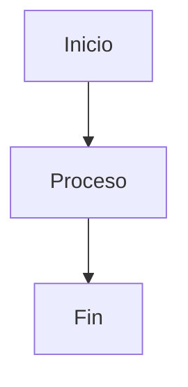

# 🤖 Agent Rules - Stock Management System

## 📋 Reglas para Crear Clases

### 1. Estructura Obligatoria

Cada clase DEBE tener:

```markdown
# 📱 Clase XX: Nombre Descriptivo

**Duración:** 4 horas
**Objetivo:** [Objetivo claro y medible]
**Proyecto:** [Cómo se integra con el proyecto]

## 📚 Contenido
[Teoría detallada con ejemplos]

## 🎯 Ejercicio Práctico
[Ejercicio completamente resuelto]

## 📊 Diagrama
[Mínimo 2 diagramas Mermaid]

## 📝 Resumen
[Puntos clave]

## 🎓 Preguntas de Repaso
[3-5 preguntas con respuestas]

## 🚀 Próxima Clase
[Referencia a siguiente clase]
```

### 2. Contenido Mínimo

- **Teoría:** 500+ líneas
- **Ejemplos:** 3+ bloques de código
- **Diagramas:** 2-5 Mermaid
- **Ejercicio:** 1 completo y resuelto
- **Preguntas:** 3-5 con respuestas

### 3. Diagramas Requeridos

Por clase, incluir:
- 1 diagrama de arquitectura/flujo
- 1 diagrama de secuencia/proceso
- Opcional: diagrama ER, componentes, etc.

**Formato:** Mermaid (no imágenes)

### 4. Ejercicios

Cada ejercicio debe:
- Tener objetivo claro
- Incluir pasos numerados
- Mostrar código completo
- Explicar cada paso
- Ser ejecutable
- Integrar con proyecto

### 5. Código

- **Lenguaje:** Kotlin, TypeScript, XML
- **Formato:** Bloques con lenguaje especificado
- **Estilo:** Profesional, sin comentarios innecesarios
- **Ejemplos:** Mínimo 3 por tema

### 6. Integración con Proyecto

Cada clase debe:
- Avanzar el proyecto Stock Management
- Mostrar cambios en estructura
- Explicar cómo ejecutar
- Actualizar STATUS.md

---

## ✅ Checklist por Clase

- [ ] Título y metadatos
- [ ] Objetivo claro
- [ ] Teoría detallada (500+ líneas)
- [ ] Mínimo 3 ejemplos de código
- [ ] Mínimo 2 diagramas Mermaid
- [ ] 1 ejercicio práctico resuelto
- [ ] 3-5 preguntas de repaso
- [ ] Integración con proyecto
- [ ] Referencia a próxima clase
- [ ] Tiempo estimado (4 horas)

---

## 🎯 Validación de Clase

Antes de completar, verificar:

```
Estructura:
  ✅ Archivo en mobile/clases/clase-XX-*.md
  ✅ Nombre sigue convención
  ✅ Todas las secciones presentes

Contenido:
  ✅ Teoría clara y detallada
  ✅ Ejemplos ejecutables
  ✅ Diagramas Mermaid válidos
  ✅ Ejercicio completamente resuelto

Integración:
  ✅ Proyecto avanza
  ✅ STATUS.md actualizado
  ✅ INDICE.md actualizado
  ✅ Próxima clase mencionada

Calidad:
  ✅ Sin errores de sintaxis
  ✅ Código profesional
  ✅ Documentación clara
  ✅ Diagramas legibles
```

---

## 📝 Plantilla de Clase

```markdown
# 📱 Clase XX: [Nombre]

**Duración:** 4 horas  
**Objetivo:** [Objetivo específico]  
**Proyecto:** [Integración con proyecto]

---

## 📚 Contenido

### 1. [Tema Principal]

[Explicación detallada]

```kotlin
// Ejemplo de código
```

### 2. [Tema Secundario]

[Explicación detallada]

```typescript
// Ejemplo de código
```

---

## 🎯 Ejercicio Práctico

### Objetivo
[Objetivo del ejercicio]

### Paso 1: [Descripción]
```kotlin
// Código
```

### Paso 2: [Descripción]
```kotlin
// Código
```

---

## 📊 Diagrama



---

## 📝 Resumen

- ✅ Punto 1
- ✅ Punto 2
- ✅ Punto 3

---

## 🎓 Preguntas de Repaso

**P1:** [Pregunta]
**R1:** [Respuesta]

**P2:** [Pregunta]
**R2:** [Respuesta]

---

## 🚀 Próxima Clase

Clase XX+1: [Nombre]

---

**Última actualización:** 2024  
**Tiempo estimado:** 4 horas
```

---

## 🔄 Flujo de Creación

1. **Planificación:** Definir contenido
2. **Estructura:** Usar plantilla
3. **Contenido:** Escribir teoría + ejercicios
4. **Validación:** Verificar checklist
5. **Integración:** Actualizar STATUS + INDICE
6. **Publicación:** Confirmar en repositorio

---

## 📊 Métricas por Clase

Rastrear:
- Líneas de documentación
- Número de diagramas
- Ejercicios incluidos
- Tiempo de lectura
- Complejidad (1-5)

---

## 🚫 Prohibido

- ❌ Clases incompletas
- ❌ Código sin explicación
- ❌ Diagramas ilegibles
- ❌ Ejercicios sin solución
- ❌ Errores de sintaxis
- ❌ Documentación vaga

---

## ✨ Recomendaciones

- ✅ Ser claro y conciso
- ✅ Usar ejemplos reales
- ✅ Explicar el "por qué"
- ✅ Integrar con proyecto
- ✅ Mantener consistencia
- ✅ Revisar antes de publicar

---

**Versión:** 1.0  
**Última actualización:** 2024
