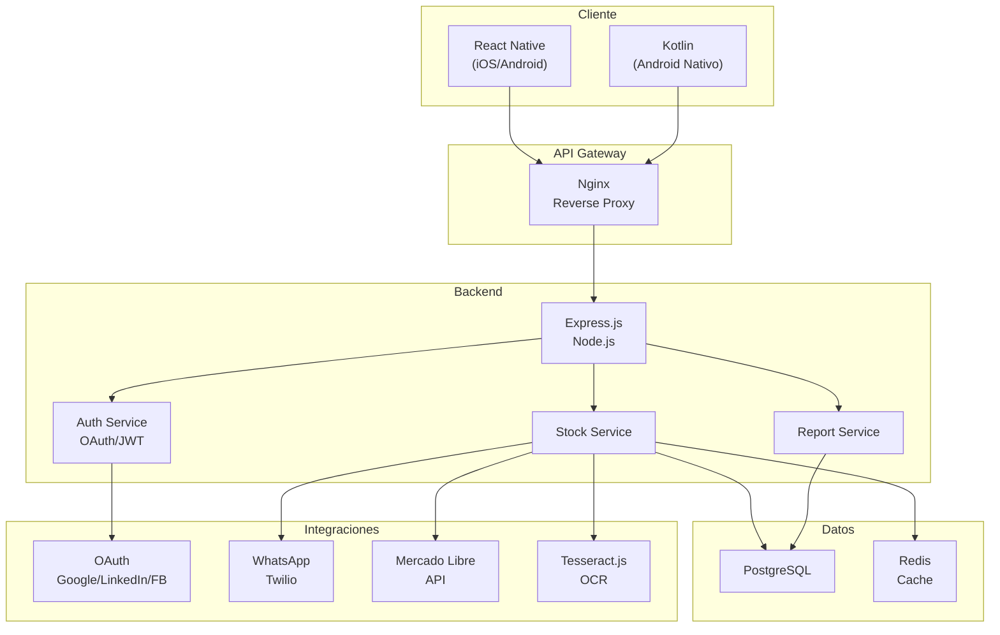
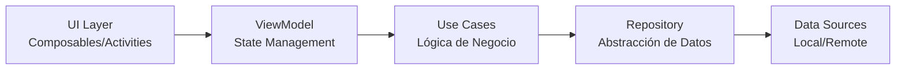
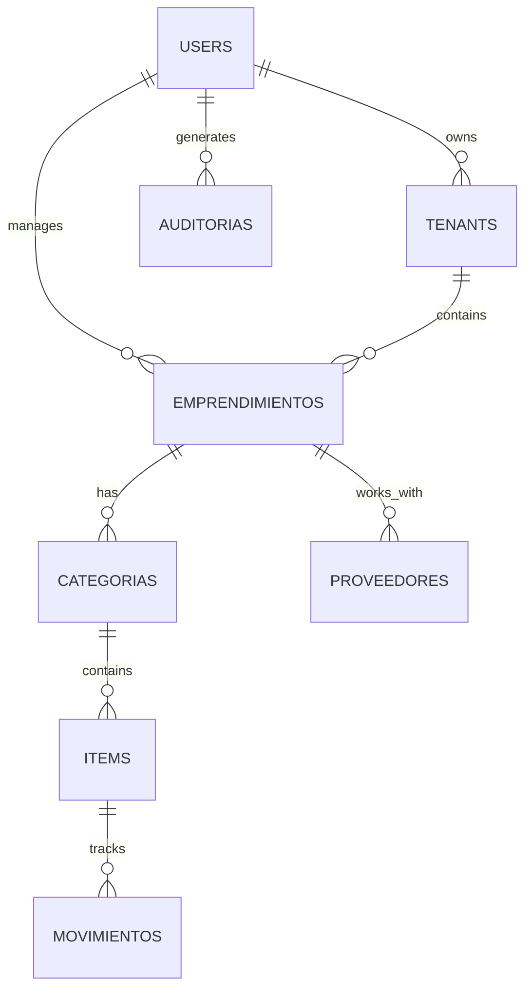
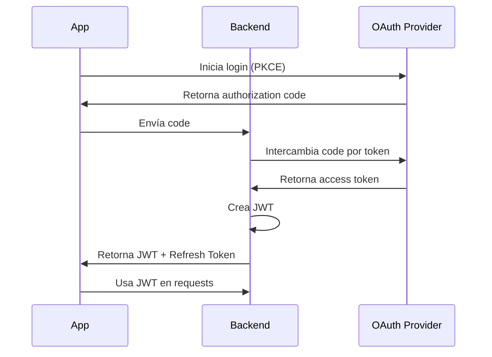
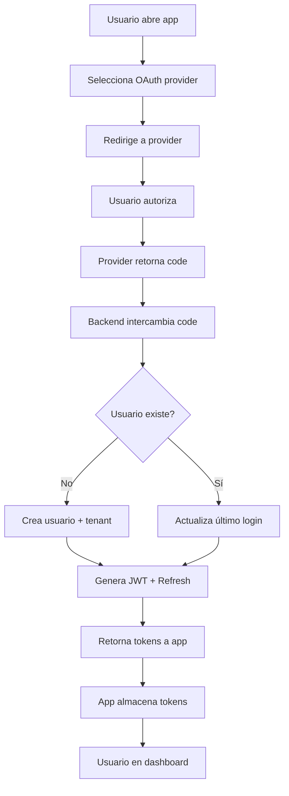
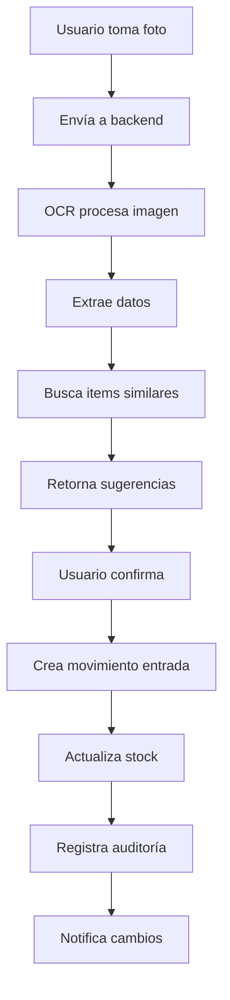
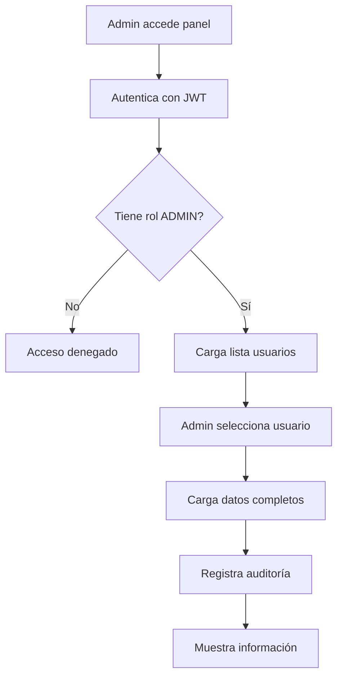
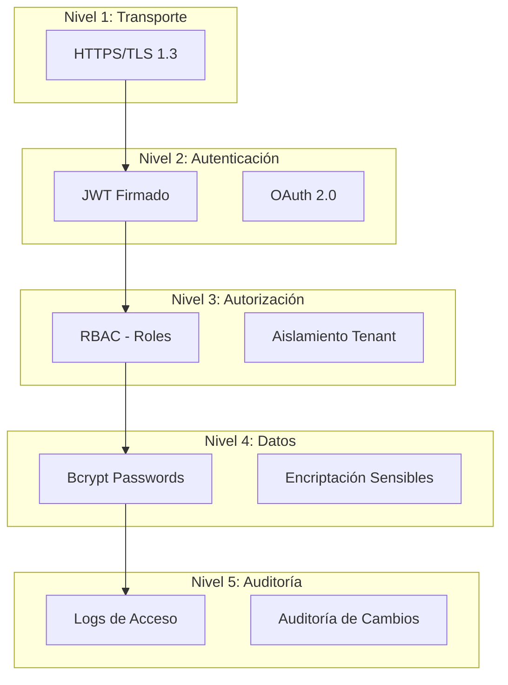
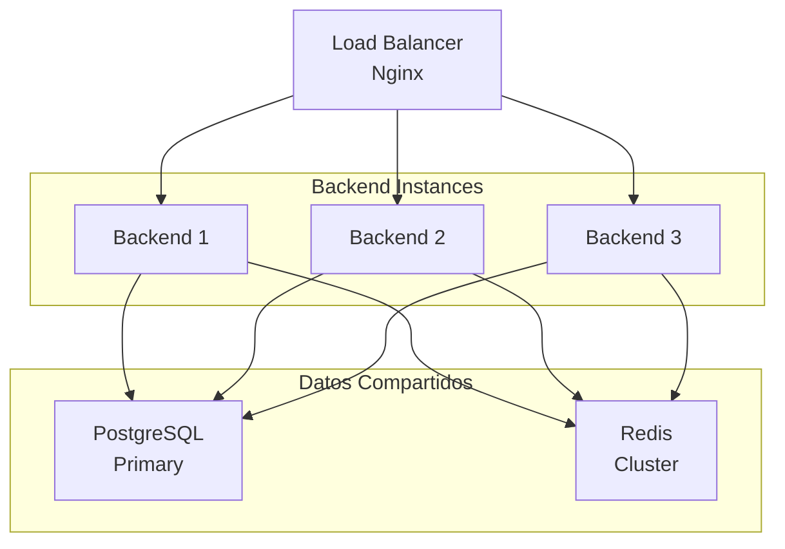

# 🏗️ Arquitectura - Stock Management System

## 1. Visión General



---

## 2. Decisiones Arquitectónicas (ADR)

### ADR-001: Arquitectura de Microservicios Monolítica

**Decisión:** Usar monolito modular en lugar de microservicios completos

**Razón:**
- Proyecto educativo (complejidad manejable)
- Facilita debugging y deployment
- Permite evolucionar a microservicios después

**Estructura:**
```
backend/
├── src/
│   ├── auth/          # Autenticación
│   ├── users/         # Gestión de usuarios
│   ├── tenants/       # Multi-tenancy
│   ├── stock/         # Gestión de stock
│   ├── providers/     # Proveedores
│   ├── reports/       # Reportes
│   ├── integrations/  # APIs externas
│   └── shared/        # Código compartido
```

---

### ADR-002: MVVM en Mobile + Clean Architecture en Backend

**Decisión:** Separar lógica de presentación, negocio y datos

**Beneficios:**
- Testeable
- Mantenible
- Escalable

**Capas:**



---

### ADR-003: PostgreSQL + Prisma ORM

**Decisión:** PostgreSQL como BD principal + Prisma para ORM

**Razón:**
- PostgreSQL: robusto, open-source, características avanzadas
- Prisma: type-safe, migraciones automáticas, excelente DX

**Schema Principal:**



---

### ADR-004: JWT + OAuth 2.0 con PKCE

**Decisión:** Autenticación stateless con JWT + OAuth social

**Flujo:**



---

### ADR-005: Redis para Caché y Sesiones

**Decisión:** Redis para caché de datos frecuentes y sesiones

**Uso:**
- Caché de usuarios (TTL: 1 hora)
- Caché de stock (TTL: 5 min)
- Sesiones de admin (TTL: 24 horas)
- Rate limiting

---

### ADR-006: Docker Compose para Desarrollo

**Decisión:** Infraestructura local con Docker Compose

**Servicios:**
```yaml
services:
  postgres:
    image: postgres:15
    ports: 5432
  
  redis:
    image: redis:7
    ports: 6379
  
  backend:
    build: ./backend
    ports: 3000
    depends_on: [postgres, redis]
  
  nginx:
    image: nginx:latest
    ports: 80, 443
```

---

## 3. Flujos Principales

### Flujo: Autenticación



### Flujo: Registrar Stock desde Boleta



### Flujo: Admin Revisa Usuario



---

## 4. Seguridad

### Capas de Seguridad



### Checklist de Seguridad

- ✅ HTTPS en todas las comunicaciones
- ✅ Contraseñas hasheadas (bcrypt)
- ✅ JWT con expiración
- ✅ Refresh tokens seguros
- ✅ CORS configurado
- ✅ Rate limiting
- ✅ Validación de entrada
- ✅ SQL injection prevention (Prisma)
- ✅ XSS prevention
- ✅ CSRF tokens
- ✅ Auditoría de acciones admin
- ✅ Encriptación de datos sensibles

---

## 5. Escalabilidad

### Horizontal Scaling



### Optimizaciones

- Índices en PostgreSQL
- Caché en Redis
- Paginación en listados
- Lazy loading en mobile
- Compresión de imágenes

---

## 6. Deployment

### Desarrollo (Docker Compose)

```bash
docker-compose up -d
# Acceso: http://localhost:3000
```

### Producción (Kubernetes - Opcional)

```yaml
apiVersion: apps/v1
kind: Deployment
metadata:
  name: stock-backend
spec:
  replicas: 3
  selector:
    matchLabels:
      app: stock-backend
  template:
    metadata:
      labels:
        app: stock-backend
    spec:
      containers:
      - name: backend
        image: stock-backend:latest
        ports:
        - containerPort: 3000
```

---

## 7. Tecnologías Seleccionadas

| Componente | Tecnología | Razón |
|-----------|-----------|-------|
| Backend | Node.js + Express | Rápido, JavaScript, ecosistema |
| BD | PostgreSQL | Robusto, open-source, ACID |
| ORM | Prisma | Type-safe, migraciones automáticas |
| Caché | Redis | Rápido, in-memory, versátil |
| Mobile | React Native | Multiplataforma, código compartido |
| Android Nativo | Kotlin | Moderno, seguro, interop con Java |
| Autenticación | OAuth 2.0 + JWT | Estándar, seguro, escalable |
| Contenedores | Docker | Reproducibilidad, portabilidad |
| Orquestación | Kubernetes | Escalabilidad, alta disponibilidad |

---

## 8. Próximos Pasos

1. **Clase 1-2:** Setup inicial
2. **Clase 3-4:** Modelos de datos
3. **Clase 5-6:** Autenticación
4. **Clase 7-8:** Multi-tenancy
5. **Clase 9-16:** Features y integraciones

