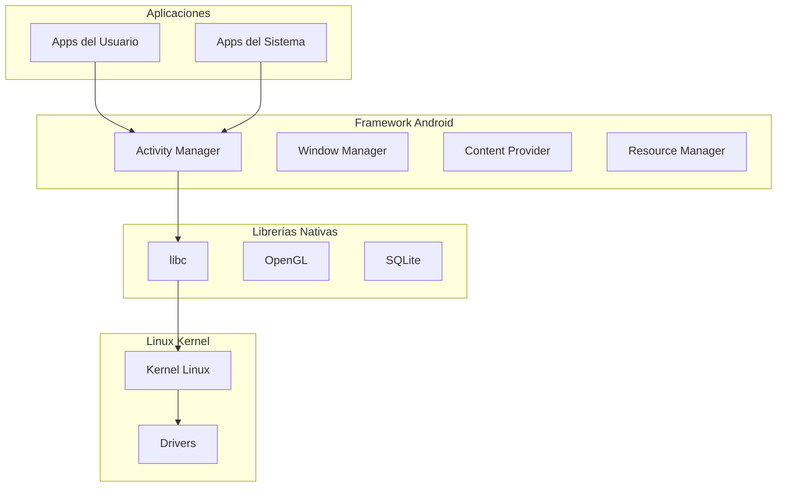
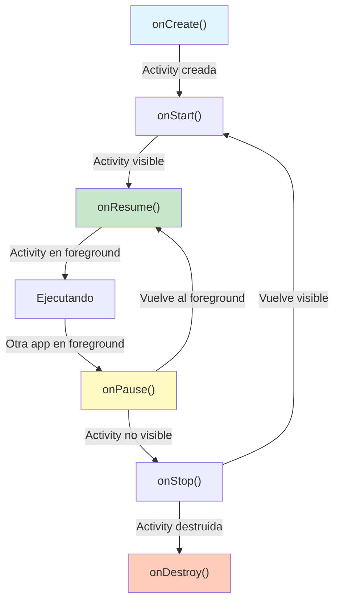
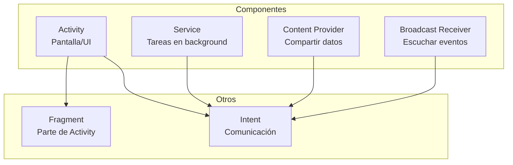
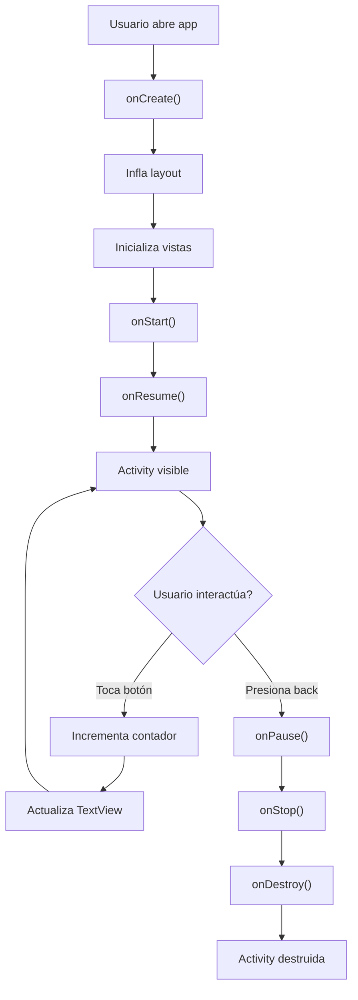

# 📱 Clase 01: Fundamentos de Android y Kotlin

**Duración:** 4 horas  
**Objetivo:** Entender Android, Kotlin y prepararse para desarrollo profesional  
**Proyecto:** Crear primera Activity con ciclo de vida

---

## 📚 Contenido

### 1. ¿Qué es Android?

Android es un sistema operativo basado en Linux para dispositivos móviles. Características principales:

- **Open Source:** Código disponible públicamente
- **Basado en Linux:** Kernel Linux 5.x+
- **Máquina Virtual:** Dalvik/ART (Android Runtime)
- **Versiones:** API 26 (Android 8.0) hasta API 35 (Android 15)
- **Mercado:** 70%+ de dispositivos móviles

#### Arquitectura de Android



---

### 2. Kotlin: Lenguaje Moderno para Android

Kotlin es el lenguaje oficial de Android desde 2019. Ventajas sobre Java:

| Característica | Kotlin | Java |
|---|---|---|
| Null Safety | ✅ Integrado | ❌ Excepciones |
| Sintaxis | ✅ Concisa | ❌ Verbosa |
| Extensiones | ✅ Sí | ❌ No |
| Corrutinas | ✅ Nativas | ❌ Threads |
| Interoperabilidad | ✅ 100% con Java | ✅ Sí |

#### Conceptos Básicos de Kotlin

**Variables y Tipos:**
```kotlin
// Inmutable (preferido)
val nombre: String = "Juan"
val edad = 25  // Type inference

// Mutable
var contador: Int = 0
contador = 1

// Null safety
val email: String? = null  // Puede ser null
val email2: String = "test@example.com"  // No puede ser null
```

**Funciones:**
```kotlin
// Función simple
fun saludar(nombre: String): String {
    return "Hola, $nombre"
}

// Función con expresión
fun sumar(a: Int, b: Int) = a + b

// Función con parámetros por defecto
fun crearUsuario(nombre: String, edad: Int = 18) {
    println("$nombre tiene $edad años")
}
```

**Clases y Herencia:**
```kotlin
// Clase simple
class Usuario(val nombre: String, val email: String) {
    fun mostrarInfo() = println("$nombre - $email")
}

// Herencia
open class Animal(val nombre: String) {
    open fun hacer_sonido() = println("Sonido genérico")
}

class Perro(nombre: String) : Animal(nombre) {
    override fun hacer_sonido() = println("Guau!")
}

// Data class (para modelos)
data class Producto(
    val id: Int,
    val nombre: String,
    val precio: Double
)
```

**Null Safety:**
```kotlin
val nombre: String? = null

// Safe call operator
val longitud = nombre?.length  // null si nombre es null

// Elvis operator
val longitud2 = nombre?.length ?: 0  // 0 si nombre es null

// Not-null assertion (¡cuidado!)
val longitud3 = nombre!!.length  // Lanza excepción si null
```

**Colecciones:**
```kotlin
// Listas
val numeros = listOf(1, 2, 3)  // Inmutable
val numeros2 = mutableListOf(1, 2, 3)  // Mutable

// Mapas
val usuario = mapOf("nombre" to "Juan", "edad" to 25)

// Operaciones funcionales
numeros.filter { it > 2 }
    .map { it * 2 }
    .forEach { println(it) }
```

---

### 3. Ciclo de Vida de una Activity

Una Activity es la pantalla de la aplicación. Tiene un ciclo de vida bien definido:



**Métodos del Ciclo de Vida:**

```kotlin
class MainActivity : AppCompatActivity() {
    
    override fun onCreate(savedInstanceState: Bundle?) {
        super.onCreate(savedInstanceState)
        setContentView(R.layout.activity_main)
        // Inicializar vistas, variables
        // Se llama UNA SOLA VEZ
    }
    
    override fun onStart() {
        super.onStart()
        // Activity se vuelve visible
        // Puede llamarse múltiples veces
    }
    
    override fun onResume() {
        super.onResume()
        // Activity en foreground, lista para interacción
        // Iniciar animaciones, listeners
    }
    
    override fun onPause() {
        super.onPause()
        // Activity pierde foreground
        // Pausar animaciones, liberar recursos
    }
    
    override fun onStop() {
        super.onStop()
        // Activity no visible
        // Guardar datos importantes
    }
    
    override fun onDestroy() {
        super.onDestroy()
        // Activity se destruye
        // Limpiar recursos
    }
}
```

---

### 4. Componentes Principales de Android



**Activity:** Pantalla de la aplicación
```kotlin
class MainActivity : AppCompatActivity() {
    // Implementación
}
```

**Fragment:** Parte reutilizable de una Activity
```kotlin
class HomeFragment : Fragment() {
    override fun onCreateView(
        inflater: LayoutInflater,
        container: ViewGroup?,
        savedInstanceState: Bundle?
    ): View? {
        return inflater.inflate(R.layout.fragment_home, container, false)
    }
}
```

**Service:** Tareas en background
```kotlin
class MiServicio : Service() {
    override fun onStartCommand(intent: Intent?, flags: Int, startId: Int): Int {
        // Ejecutar tarea en background
        return START_STICKY
    }
    
    override fun onBind(intent: Intent?): IBinder? = null
}
```

**Intent:** Comunicación entre componentes
```kotlin
// Iniciar Activity
val intent = Intent(this, MainActivity::class.java)
intent.putExtra("usuario_id", 123)
startActivity(intent)

// Recibir datos
val usuarioId = intent.getIntExtra("usuario_id", -1)
```

---

### 5. Estructura de un Proyecto Android

```
MiApp/
├── app/
│   ├── src/
│   │   ├── main/
│   │   │   ├── java/com/example/miapp/
│   │   │   │   ├── MainActivity.kt
│   │   │   │   ├── ui/
│   │   │   │   ├── data/
│   │   │   │   └── domain/
│   │   │   ├── res/
│   │   │   │   ├── layout/
│   │   │   │   │   └── activity_main.xml
│   │   │   │   ├── values/
│   │   │   │   │   └── strings.xml
│   │   │   │   ├── drawable/
│   │   │   │   └── mipmap/
│   │   │   └── AndroidManifest.xml
│   │   ├── test/
│   │   └── androidTest/
│   └── build.gradle.kts
└── settings.gradle.kts
```

---

### 6. Manifest y Permisos

El `AndroidManifest.xml` declara la estructura de la app:

```xml
<?xml version="1.0" encoding="utf-8"?>
<manifest xmlns:android="http://schemas.android.com/apk/res/android"
    package="com.example.stockapp">

    <!-- Permisos -->
    <uses-permission android:name="android.permission.INTERNET" />
    <uses-permission android:name="android.permission.CAMERA" />
    <uses-permission android:name="android.permission.ACCESS_FINE_LOCATION" />

    <application
        android:allowBackup="true"
        android:icon="@mipmap/ic_launcher"
        android:label="@string/app_name"
        android:theme="@style/Theme.StockApp">

        <!-- Activities -->
        <activity
            android:name=".MainActivity"
            android:exported="true">
            <intent-filter>
                <action android:name="android.intent.action.MAIN" />
                <category android:name="android.intent.category.LAUNCHER" />
            </intent-filter>
        </activity>

        <!-- Services -->
        <service android:name=".services.SyncService" />

    </application>

</manifest>
```

---

## 🎯 Ejercicio Práctico: Mi Primera Activity

### Objetivo
Crear una Activity que muestre un contador con botones para incrementar/decrementar.

### Paso 1: Crear el Layout (activity_main.xml)

```xml
<?xml version="1.0" encoding="utf-8"?>
<LinearLayout xmlns:android="http://schemas.android.com/apk/res/android"
    android:layout_width="match_parent"
    android:layout_height="match_parent"
    android:orientation="vertical"
    android:gravity="center"
    android:padding="16dp">

    <TextView
        android:id="@+id/titulo"
        android:layout_width="wrap_content"
        android:layout_height="wrap_content"
        android:text="Mi Primer Contador"
        android:textSize="24sp"
        android:textStyle="bold"
        android:layout_marginBottom="32dp" />

    <TextView
        android:id="@+id/contador"
        android:layout_width="wrap_content"
        android:layout_height="wrap_content"
        android:text="0"
        android:textSize="48sp"
        android:textStyle="bold"
        android:layout_marginBottom="32dp" />

    <LinearLayout
        android:layout_width="wrap_content"
        android:layout_height="wrap_content"
        android:orientation="horizontal"
        android:gravity="center">

        <Button
            android:id="@+id/btnMenos"
            android:layout_width="wrap_content"
            android:layout_height="wrap_content"
            android:text="- Decrementar"
            android:layout_marginEnd="16dp" />

        <Button
            android:id="@+id/btnMas"
            android:layout_width="wrap_content"
            android:layout_height="wrap_content"
            android:text="+ Incrementar" />

    </LinearLayout>

</LinearLayout>
```

### Paso 2: Implementar la Activity (MainActivity.kt)

```kotlin
package com.example.stockapp

import android.os.Bundle
import android.widget.Button
import android.widget.TextView
import androidx.appcompat.app.AppCompatActivity

class MainActivity : AppCompatActivity() {
    
    private var contador = 0
    private lateinit var tvContador: TextView
    private lateinit var btnMas: Button
    private lateinit var btnMenos: Button
    
    override fun onCreate(savedInstanceState: Bundle?) {
        super.onCreate(savedInstanceState)
        setContentView(R.layout.activity_main)
        
        // Inicializar vistas
        tvContador = findViewById(R.id.contador)
        btnMas = findViewById(R.id.btnMas)
        btnMenos = findViewById(R.id.btnMenos)
        
        // Configurar listeners
        btnMas.setOnClickListener {
            contador++
            actualizarContador()
        }
        
        btnMenos.setOnClickListener {
            contador--
            actualizarContador()
        }
        
        // Restaurar estado si existe
        if (savedInstanceState != null) {
            contador = savedInstanceState.getInt("contador", 0)
            actualizarContador()
        }
    }
    
    private fun actualizarContador() {
        tvContador.text = contador.toString()
    }
    
    override fun onSaveInstanceState(outState: Bundle) {
        super.onSaveInstanceState(outState)
        outState.putInt("contador", contador)
    }
    
    override fun onResume() {
        super.onResume()
        println("MainActivity: onResume()")
    }
    
    override fun onPause() {
        super.onPause()
        println("MainActivity: onPause()")
    }
}
```

### Paso 3: Ejecutar en Emulador

```bash
# Compilar
./gradlew build

# Ejecutar en emulador
./gradlew installDebug
adb shell am start -n com.example.stockapp/.MainActivity

# Ver logs
adb logcat | grep MainActivity
```

---

## 📊 Diagrama: Flujo de la Aplicación



---

## 🔍 Debugging

### Logcat
```kotlin
// Agregar logs
Log.d("MainActivity", "Contador: $contador")
Log.e("MainActivity", "Error: ${e.message}")

// Ver en Android Studio: Logcat tab
```

### Breakpoints
1. Click en número de línea
2. Run → Debug 'app'
3. Inspeccionar variables

### Android Profiler
1. Run → Profiler
2. Ver CPU, memoria, red

---

## 📝 Resumen

- ✅ Android es un SO basado en Linux
- ✅ Kotlin es el lenguaje oficial
- ✅ Activity es la pantalla de la app
- ✅ Ciclo de vida: onCreate → onStart → onResume → onPause → onStop → onDestroy
- ✅ Manifest declara componentes y permisos
- ✅ Layouts en XML, lógica en Kotlin

---

## 🎓 Preguntas de Repaso

**P1:** ¿Cuál es la diferencia entre onPause() y onStop()?
**R1:** onPause() se llama cuando la Activity pierde foreground (otra app se abre), onStop() cuando no es visible.

**P2:** ¿Por qué usar val en lugar de var?
**R2:** val es inmutable, más seguro. var es mutable, úsalo solo si necesitas cambiar el valor.

**P3:** ¿Qué es el safe call operator (?.) en Kotlin?
**R3:** Permite llamar métodos en objetos nullable sin lanzar excepción si es null.

---

## 🚀 Próxima Clase

Clase 02: Setup del Proyecto - Crearemos la estructura completa del proyecto, backend con Node.js y Docker Compose.

---

**Última actualización:** 2024  
**Tiempo estimado:** 4 horas
