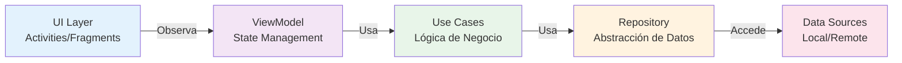
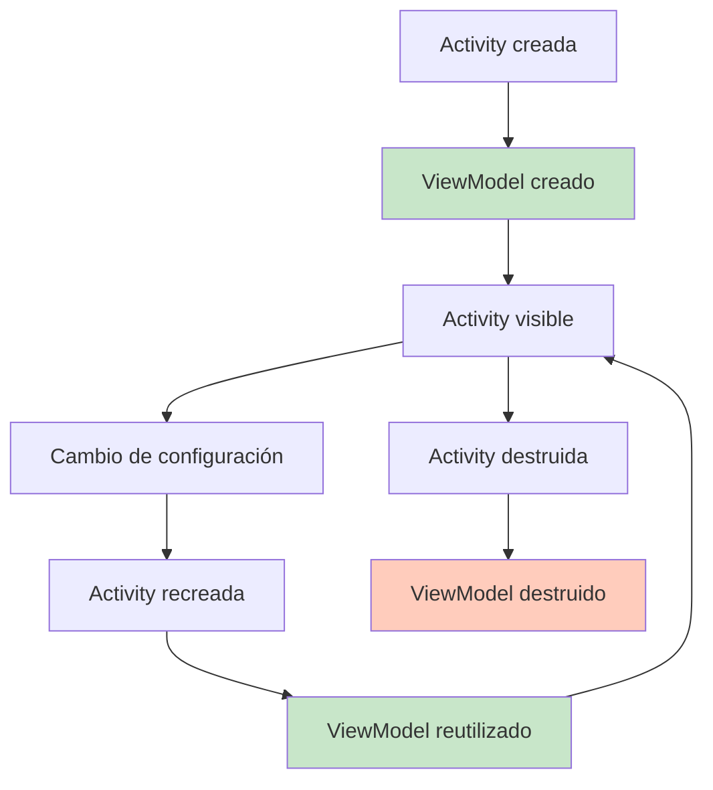
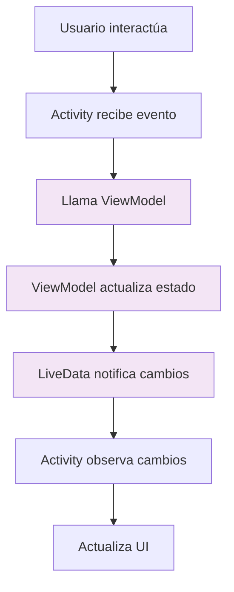

# 🏗️ Clase 03: Arquitectura MVVM y Dependency Injection

**Duración:** 4 horas  
**Objetivo:** Implementar MVVM + Hilt para arquitectura profesional  
**Proyecto:** Refactorizar MainActivity con ViewModel

---

## 📚 Contenido

### 1. ¿Qué es MVVM?

MVVM (Model-View-ViewModel) separa la lógica de presentación de la lógica de negocio:



**Ventajas:**
- ✅ Separación de responsabilidades
- ✅ Testeable
- ✅ Reutilizable
- ✅ Mantenible

### 2. ViewModel

ViewModel almacena datos de UI y sobrevive cambios de configuración:

```kotlin
import androidx.lifecycle.ViewModel
import androidx.lifecycle.LiveData
import androidx.lifecycle.MutableLiveData

class ContadorViewModel : ViewModel() {
    
    private val _contador = MutableLiveData<Int>(0)
    val contador: LiveData<Int> = _contador
    
    fun incrementar() {
        _contador.value = (_contador.value ?: 0) + 1
    }
    
    fun decrementar() {
        _contador.value = (_contador.value ?: 0) - 1
    }
}
```

**Ciclo de vida:**



### 3. LiveData y StateFlow

**LiveData:** Lifecycle-aware observable

```kotlin
class UsuarioViewModel : ViewModel() {
    
    private val _usuario = MutableLiveData<Usuario>()
    val usuario: LiveData<Usuario> = _usuario
    
    fun cargarUsuario(id: Int) {
        _usuario.value = Usuario(id, "Juan", "juan@example.com")
    }
}
```

**Observar en Activity:**

```kotlin
class MainActivity : AppCompatActivity() {
    
    private val viewModel: UsuarioViewModel by viewModels()
    
    override fun onCreate(savedInstanceState: Bundle?) {
        super.onCreate(savedInstanceState)
        setContentView(R.layout.activity_main)
        
        viewModel.usuario.observe(this) { usuario ->
            binding.nombre.text = usuario.nombre
            binding.email.text = usuario.email
        }
        
        viewModel.cargarUsuario(1)
    }
}
```

### 4. Dependency Injection con Hilt

Hilt simplifica inyección de dependencias:

**Paso 1: Agregar dependencias (build.gradle.kts)**

```kotlin
plugins {
    id("com.android.application")
    id("kotlin-android")
    id("com.google.dagger.hilt.android")
}

dependencies {
    implementation("com.google.dagger:hilt-android:2.48")
    kapt("com.google.dagger:hilt-compiler:2.48")
}
```

**Paso 2: Anotar Application**

```kotlin
import dagger.hilt.android.HiltAndroidApp

@HiltAndroidApp
class StockApp : Application()
```

**Paso 3: Crear módulos de inyección**

```kotlin
import dagger.Module
import dagger.Provides
import dagger.hilt.InstallIn
import dagger.hilt.components.SingletonComponent
import javax.inject.Singleton

@Module
@InstallIn(SingletonComponent::class)
object AppModule {
    
    @Singleton
    @Provides
    fun provideUsuarioRepository(): UsuarioRepository {
        return UsuarioRepositoryImpl()
    }
}
```

**Paso 4: Inyectar en ViewModel**

```kotlin
import androidx.lifecycle.ViewModel
import dagger.hilt.android.lifecycle.HiltViewModel
import javax.inject.Inject

@HiltViewModel
class UsuarioViewModel @Inject constructor(
    private val usuarioRepository: UsuarioRepository
) : ViewModel() {
    
    private val _usuario = MutableLiveData<Usuario>()
    val usuario: LiveData<Usuario> = _usuario
    
    fun cargarUsuario(id: Int) {
        _usuario.value = usuarioRepository.obtener(id)
    }
}
```

**Paso 5: Usar en Activity**

```kotlin
import androidx.activity.viewModels
import dagger.hilt.android.AndroidEntryPoint

@AndroidEntryPoint
class MainActivity : AppCompatActivity() {
    
    private val viewModel: UsuarioViewModel by viewModels()
    
    override fun onCreate(savedInstanceState: Bundle?) {
        super.onCreate(savedInstanceState)
        setContentView(R.layout.activity_main)
        
        viewModel.usuario.observe(this) { usuario ->
            binding.nombre.text = usuario.nombre
        }
    }
}
```

---

## 🎯 Ejercicio Práctico: Refactorizar Contador con MVVM

### Objetivo
Convertir el contador de Clase 01 a MVVM con Hilt.

### Paso 1: Crear ViewModel

```kotlin
import androidx.lifecycle.ViewModel
import androidx.lifecycle.LiveData
import androidx.lifecycle.MutableLiveData
import dagger.hilt.android.lifecycle.HiltViewModel
import javax.inject.Inject

@HiltViewModel
class ContadorViewModel @Inject constructor() : ViewModel() {
    
    private val _contador = MutableLiveData<Int>(0)
    val contador: LiveData<Int> = _contador
    
    fun incrementar() {
        _contador.value = (_contador.value ?: 0) + 1
    }
    
    fun decrementar() {
        _contador.value = (_contador.value ?: 0) - 1
    }
    
    fun reset() {
        _contador.value = 0
    }
}
```

### Paso 2: Actualizar MainActivity

```kotlin
import androidx.appcompat.app.AppCompatActivity
import androidx.activity.viewModels
import dagger.hilt.android.AndroidEntryPoint
import com.example.stockapp.databinding.ActivityMainBinding

@AndroidEntryPoint
class MainActivity : AppCompatActivity() {
    
    private lateinit var binding: ActivityMainBinding
    private val viewModel: ContadorViewModel by viewModels()
    
    override fun onCreate(savedInstanceState: Bundle?) {
        super.onCreate(savedInstanceState)
        binding = ActivityMainBinding.inflate(layoutInflater)
        setContentView(binding.root)
        
        viewModel.contador.observe(this) { contador ->
            binding.contador.text = contador.toString()
        }
        
        binding.btnMas.setOnClickListener {
            viewModel.incrementar()
        }
        
        binding.btnMenos.setOnClickListener {
            viewModel.decrementar()
        }
        
        binding.btnReset.setOnClickListener {
            viewModel.reset()
        }
    }
}
```

### Paso 3: Configurar Hilt

```kotlin
import android.app.Application
import dagger.hilt.android.HiltAndroidApp

@HiltAndroidApp
class StockApp : Application()
```

```xml
<!-- AndroidManifest.xml -->
<application
    android:name=".StockApp"
    ...>
</application>
```

---

## 📊 Diagrama: Flujo MVVM



---

## 📝 Resumen

- ✅ MVVM separa UI de lógica
- ✅ ViewModel sobrevive cambios de configuración
- ✅ LiveData es lifecycle-aware
- ✅ Hilt simplifica inyección de dependencias
- ✅ Código más testeable y mantenible

---

## 🎓 Preguntas de Repaso

**P1:** ¿Por qué ViewModel sobrevive cambios de configuración?
**R1:** Porque se almacena en el ViewModelStore, que persiste durante rotaciones de pantalla.

**P2:** ¿Cuál es la diferencia entre LiveData y StateFlow?
**R2:** LiveData es lifecycle-aware, StateFlow es más moderno y usa Coroutines.

**P3:** ¿Qué es Hilt?
**R3:** Framework de inyección de dependencias que simplifica Dagger en Android.

---

## 🚀 Próxima Clase

Clase 04: Room Database - Implementaremos persistencia local con Room.

---

**Última actualización:** 2024  
**Tiempo estimado:** 4 horas
