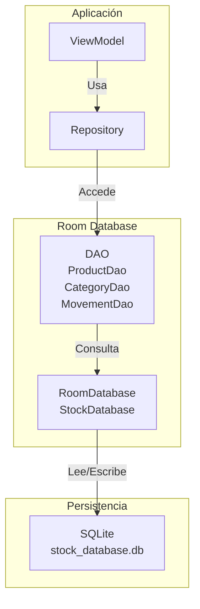
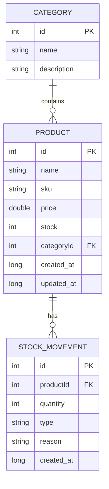
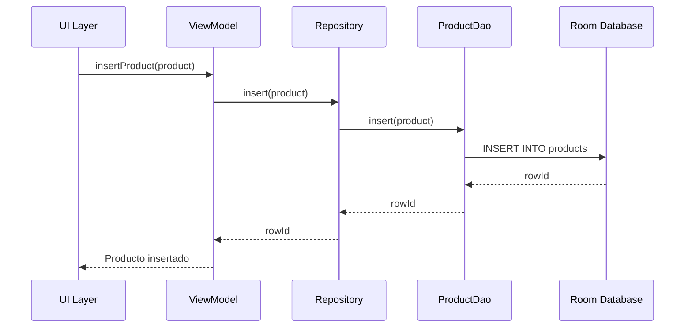
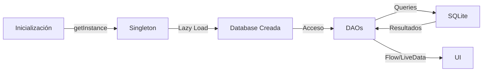

# 📱 Clase 04: Room Database y Persistencia Local

**Duración:** 4 horas  
**Objetivo:** Implementar persistencia local con Room Database, crear entidades, DAOs y relaciones  
**Proyecto:** Integrar Room en Stock Management System para almacenar productos, categorías y movimientos

---

## 📚 Contenido

### 1. Introducción a Room Database

Room es la capa de abstracción de SQLite recomendada por Google. Proporciona:
- **Type-safety:** Validación en tiempo de compilación
- **Migraciones:** Versionado de esquema
- **Relaciones:** Soporte para entidades relacionadas
- **Queries:** DSL type-safe

Room se compone de tres componentes principales:

**Entity:** Representa una tabla en la base de datos
```kotlin
@Entity(tableName = "products")
data class Product(
    @PrimaryKey(autoGenerate = true)
    val id: Int = 0,
    val name: String,
    val sku: String,
    val price: Double,
    val stock: Int,
    val categoryId: Int,
    @ColumnInfo(name = "created_at")
    val createdAt: Long = System.currentTimeMillis()
)
```

**DAO (Data Access Object):** Define operaciones de base de datos
```kotlin
@Dao
interface ProductDao {
    @Insert
    suspend fun insert(product: Product): Long
    
    @Update
    suspend fun update(product: Product)
    
    @Delete
    suspend fun delete(product: Product)
    
    @Query("SELECT * FROM products WHERE id = :id")
    suspend fun getById(id: Int): Product?
    
    @Query("SELECT * FROM products ORDER BY name ASC")
    fun getAllProducts(): Flow<List<Product>>
}
```

**Database:** Contenedor de DAOs y entidades
```kotlin
@Database(
    entities = [Product::class, Category::class, StockMovement::class],
    version = 1,
    exportSchema = true
)
abstract class StockDatabase : RoomDatabase() {
    abstract fun productDao(): ProductDao
    abstract fun categoryDao(): CategoryDao
    abstract fun movementDao(): StockMovementDao
    
    companion object {
        @Volatile
        private var INSTANCE: StockDatabase? = null
        
        fun getInstance(context: Context): StockDatabase {
            return INSTANCE ?: synchronized(this) {
                Room.databaseBuilder(
                    context.applicationContext,
                    StockDatabase::class.java,
                    "stock_database"
                ).build().also { INSTANCE = it }
            }
        }
    }
}
```

### 2. Entidades y Relaciones

**Entidad con relaciones:**
```kotlin
@Entity(tableName = "categories")
data class Category(
    @PrimaryKey(autoGenerate = true)
    val id: Int = 0,
    val name: String,
    val description: String? = null
)

@Entity(
    tableName = "stock_movements",
    foreignKeys = [
        ForeignKey(
            entity = Product::class,
            parentColumns = ["id"],
            childColumns = ["productId"],
            onDelete = ForeignKey.CASCADE
        )
    ]
)
data class StockMovement(
    @PrimaryKey(autoGenerate = true)
    val id: Int = 0,
    val productId: Int,
    val quantity: Int,
    val type: String, // "IN" o "OUT"
    val reason: String,
    @ColumnInfo(name = "created_at")
    val createdAt: Long = System.currentTimeMillis()
)
```

**Relaciones con @Relation:**
```kotlin
data class ProductWithCategory(
    @Embedded
    val product: Product,
    @Relation(
        parentColumn = "categoryId",
        entityColumn = "id"
    )
    val category: Category
)

data class CategoryWithProducts(
    @Embedded
    val category: Category,
    @Relation(
        parentColumn = "id",
        entityColumn = "categoryId"
    )
    val products: List<Product>
)
```

### 3. DAOs Avanzados

**DAO con queries complejas:**
```kotlin
@Dao
interface ProductDao {
    @Insert
    suspend fun insert(product: Product): Long
    
    @Update
    suspend fun update(product: Product)
    
    @Delete
    suspend fun delete(product: Product)
    
    @Query("SELECT * FROM products WHERE id = :id")
    suspend fun getById(id: Int): Product?
    
    @Query("SELECT * FROM products ORDER BY name ASC")
    fun getAllProducts(): Flow<List<Product>>
    
    @Query("SELECT * FROM products WHERE categoryId = :categoryId")
    fun getProductsByCategory(categoryId: Int): Flow<List<Product>>
    
    @Query("SELECT * FROM products WHERE stock < :minStock")
    fun getLowStockProducts(minStock: Int): Flow<List<Product>>
    
    @Query("""
        SELECT p.*, c.name as categoryName 
        FROM products p 
        LEFT JOIN categories c ON p.categoryId = c.id 
        WHERE p.name LIKE :query
    """)
    fun searchProducts(query: String): Flow<List<ProductWithCategory>>
    
    @Transaction
    @Query("SELECT * FROM categories")
    fun getCategoriesWithProducts(): Flow<List<CategoryWithProducts>>
}

@Dao
interface StockMovementDao {
    @Insert
    suspend fun insert(movement: StockMovement): Long
    
    @Query("SELECT * FROM stock_movements WHERE productId = :productId ORDER BY created_at DESC")
    fun getMovementsByProduct(productId: Int): Flow<List<StockMovement>>
    
    @Query("""
        SELECT SUM(CASE WHEN type = 'IN' THEN quantity ELSE -quantity END) 
        FROM stock_movements 
        WHERE productId = :productId
    """)
    suspend fun getNetMovement(productId: Int): Int?
}
```

### 4. Migraciones

Room maneja migraciones automáticas para cambios simples. Para cambios complejos:

```kotlin
val MIGRATION_1_2 = object : Migration(1, 2) {
    override fun migrate(database: SupportSQLiteDatabase) {
        // Agregar nueva columna
        database.execSQL(
            "ALTER TABLE products ADD COLUMN supplier_id INTEGER DEFAULT 0"
        )
        
        // Crear nueva tabla
        database.execSQL("""
            CREATE TABLE suppliers (
                id INTEGER PRIMARY KEY AUTOINCREMENT,
                name TEXT NOT NULL,
                email TEXT,
                phone TEXT
            )
        """)
    }
}

val database = Room.databaseBuilder(
    context,
    StockDatabase::class.java,
    "stock_database"
)
    .addMigrations(MIGRATION_1_2)
    .build()
```

### 5. Integración con ViewModel

```kotlin
class ProductViewModel(
    private val productDao: ProductDao,
    private val categoryDao: CategoryDao
) : ViewModel() {
    
    val allProducts: LiveData<List<Product>> = 
        productDao.getAllProducts().asLiveData()
    
    val categoriesWithProducts: LiveData<List<CategoryWithProducts>> =
        categoryDao.getCategoriesWithProducts().asLiveData()
    
    fun insertProduct(product: Product) = viewModelScope.launch {
        productDao.insert(product)
    }
    
    fun updateProduct(product: Product) = viewModelScope.launch {
        productDao.update(product)
    }
    
    fun deleteProduct(product: Product) = viewModelScope.launch {
        productDao.delete(product)
    }
    
    fun searchProducts(query: String): LiveData<List<ProductWithCategory>> =
        productDao.searchProducts("%$query%").asLiveData()
    
    fun getLowStockProducts(minStock: Int): LiveData<List<Product>> =
        productDao.getLowStockProducts(minStock).asLiveData()
}
```

### 6. Configuración en build.gradle

```gradle
dependencies {
    // Room
    def room_version = "2.6.1"
    implementation "androidx.room:room-runtime:$room_version"
    kapt "androidx.room:room-compiler:$room_version"
    implementation "androidx.room:room-ktx:$room_version"
    
    // Coroutines
    implementation "org.jetbrains.kotlinx:kotlinx-coroutines-android:1.7.3"
    
    // Lifecycle
    implementation "androidx.lifecycle:lifecycle-runtime-ktx:2.7.0"
}
```

---

## 🎯 Ejercicio Práctico

### Objetivo
Implementar Room Database en Stock Management System con entidades de Producto, Categoría y Movimientos de Stock.

### Paso 1: Crear Entidades

Crear archivo `android/app/src/main/java/com/stockmanagement/data/entities/Product.kt`:

```kotlin
package com.stockmanagement.data.entities

import androidx.room.ColumnInfo
import androidx.room.Entity
import androidx.room.PrimaryKey

@Entity(tableName = "products")
data class Product(
    @PrimaryKey(autoGenerate = true)
    val id: Int = 0,
    val name: String,
    val sku: String,
    val price: Double,
    val stock: Int,
    val categoryId: Int,
    @ColumnInfo(name = "created_at")
    val createdAt: Long = System.currentTimeMillis(),
    @ColumnInfo(name = "updated_at")
    val updatedAt: Long = System.currentTimeMillis()
)

@Entity(tableName = "categories")
data class Category(
    @PrimaryKey(autoGenerate = true)
    val id: Int = 0,
    val name: String,
    val description: String? = null
)

@Entity(
    tableName = "stock_movements",
    foreignKeys = [
        androidx.room.ForeignKey(
            entity = Product::class,
            parentColumns = ["id"],
            childColumns = ["productId"],
            onDelete = androidx.room.ForeignKey.CASCADE
        )
    ]
)
data class StockMovement(
    @PrimaryKey(autoGenerate = true)
    val id: Int = 0,
    val productId: Int,
    val quantity: Int,
    val type: String,
    val reason: String,
    @ColumnInfo(name = "created_at")
    val createdAt: Long = System.currentTimeMillis()
)
```

### Paso 2: Crear DAOs

Crear archivo `android/app/src/main/java/com/stockmanagement/data/dao/ProductDao.kt`:

```kotlin
package com.stockmanagement.data.dao

import androidx.room.*
import com.stockmanagement.data.entities.Product
import com.stockmanagement.data.entities.Category
import com.stockmanagement.data.entities.StockMovement
import kotlinx.coroutines.flow.Flow

@Dao
interface ProductDao {
    @Insert
    suspend fun insert(product: Product): Long
    
    @Update
    suspend fun update(product: Product)
    
    @Delete
    suspend fun delete(product: Product)
    
    @Query("SELECT * FROM products WHERE id = :id")
    suspend fun getById(id: Int): Product?
    
    @Query("SELECT * FROM products ORDER BY name ASC")
    fun getAllProducts(): Flow<List<Product>>
    
    @Query("SELECT * FROM products WHERE categoryId = :categoryId")
    fun getProductsByCategory(categoryId: Int): Flow<List<Product>>
    
    @Query("SELECT * FROM products WHERE stock < :minStock")
    fun getLowStockProducts(minStock: Int): Flow<List<Product>>
}

@Dao
interface CategoryDao {
    @Insert
    suspend fun insert(category: Category): Long
    
    @Query("SELECT * FROM categories ORDER BY name ASC")
    fun getAllCategories(): Flow<List<Category>>
}

@Dao
interface StockMovementDao {
    @Insert
    suspend fun insert(movement: StockMovement): Long
    
    @Query("SELECT * FROM stock_movements WHERE productId = :productId ORDER BY created_at DESC")
    fun getMovementsByProduct(productId: Int): Flow<List<StockMovement>>
}
```

### Paso 3: Crear Database

Crear archivo `android/app/src/main/java/com/stockmanagement/data/StockDatabase.kt`:

```kotlin
package com.stockmanagement.data

import android.content.Context
import androidx.room.Database
import androidx.room.Room
import androidx.room.RoomDatabase
import com.stockmanagement.data.entities.Product
import com.stockmanagement.data.entities.Category
import com.stockmanagement.data.entities.StockMovement
import com.stockmanagement.data.dao.ProductDao
import com.stockmanagement.data.dao.CategoryDao
import com.stockmanagement.data.dao.StockMovementDao

@Database(
    entities = [Product::class, Category::class, StockMovement::class],
    version = 1,
    exportSchema = true
)
abstract class StockDatabase : RoomDatabase() {
    abstract fun productDao(): ProductDao
    abstract fun categoryDao(): CategoryDao
    abstract fun movementDao(): StockMovementDao
    
    companion object {
        @Volatile
        private var INSTANCE: StockDatabase? = null
        
        fun getInstance(context: Context): StockDatabase {
            return INSTANCE ?: synchronized(this) {
                Room.databaseBuilder(
                    context.applicationContext,
                    StockDatabase::class.java,
                    "stock_database"
                ).build().also { INSTANCE = it }
            }
        }
    }
}
```

### Paso 4: Integrar con ViewModel

Actualizar `android/app/src/main/java/com/stockmanagement/ui/ProductViewModel.kt`:

```kotlin
package com.stockmanagement.ui

import androidx.lifecycle.ViewModel
import androidx.lifecycle.viewModelScope
import androidx.lifecycle.asLiveData
import com.stockmanagement.data.dao.ProductDao
import com.stockmanagement.data.dao.CategoryDao
import com.stockmanagement.data.entities.Product
import com.stockmanagement.data.entities.Category
import kotlinx.coroutines.launch

class ProductViewModel(
    private val productDao: ProductDao,
    private val categoryDao: CategoryDao
) : ViewModel() {
    
    val allProducts = productDao.getAllProducts().asLiveData()
    val allCategories = categoryDao.getAllCategories().asLiveData()
    
    fun insertProduct(product: Product) = viewModelScope.launch {
        productDao.insert(product)
    }
    
    fun updateProduct(product: Product) = viewModelScope.launch {
        productDao.update(product)
    }
    
    fun deleteProduct(product: Product) = viewModelScope.launch {
        productDao.delete(product)
    }
    
    fun insertCategory(category: Category) = viewModelScope.launch {
        categoryDao.insert(category)
    }
    
    fun getLowStockProducts(minStock: Int) = 
        productDao.getLowStockProducts(minStock).asLiveData()
}
```

### Paso 5: Verificar Instalación

Ejecutar en terminal:
```bash
cd /home/apastorini/utu
./gradlew build
```

Verificar que no hay errores de compilación y que Room genera los archivos necesarios.

---

## 📊 Diagramas

### Diagrama 1: Arquitectura de Room



### Diagrama 2: Relaciones de Entidades



### Diagrama 3: Flujo de Operaciones CRUD



### Diagrama 4: Ciclo de Vida de Room



---

## 📝 Resumen

- ✅ Room proporciona type-safety y abstracción sobre SQLite
- ✅ Entidades definen tablas, DAOs definen operaciones
- ✅ Relaciones se manejan con @Relation y @Embedded
- ✅ Migraciones permiten evolucionar el esquema
- ✅ Flow/LiveData integran con arquitectura reactiva
- ✅ Singleton pattern asegura una única instancia de database

---

## 🎓 Preguntas de Repaso

**P1:** ¿Cuál es la diferencia entre @Insert, @Update y @Delete en Room?

**R1:** @Insert agrega nuevos registros, @Update modifica existentes, @Delete elimina registros. Room genera el SQL automáticamente basado en la anotación.

**P2:** ¿Cómo se manejan las relaciones entre tablas en Room?

**R2:** Con @Relation y @Embedded. @Relation define la relación entre entidades, @Embedded incluye los datos de la entidad relacionada en el objeto.

**P3:** ¿Por qué usar Flow en lugar de LiveData en DAOs?

**R3:** Flow es más flexible, permite transformaciones con operadores, y es agnóstico del ciclo de vida. LiveData es más simple pero menos poderoso.

**P4:** ¿Cómo se manejan las migraciones en Room?

**R4:** Room genera migraciones automáticas para cambios simples. Para cambios complejos, se crean objetos Migration que ejecutan SQL personalizado.

**P5:** ¿Qué es el patrón Singleton en Room y por qué es importante?

**R5:** Asegura que solo exista una instancia de la database en toda la aplicación, evitando múltiples conexiones y sincronización de datos.

---

## 🚀 Próxima Clase

**Clase 05: OAuth 2.0 y Autenticación Social**

Implementaremos autenticación con Google, LinkedIn y Facebook usando OAuth 2.0, integrando con el backend Node.js.

---

**Última actualización:** 2024  
**Tiempo estimado:** 4 horas  
**Complejidad:** ⭐⭐⭐ (Intermedia)
