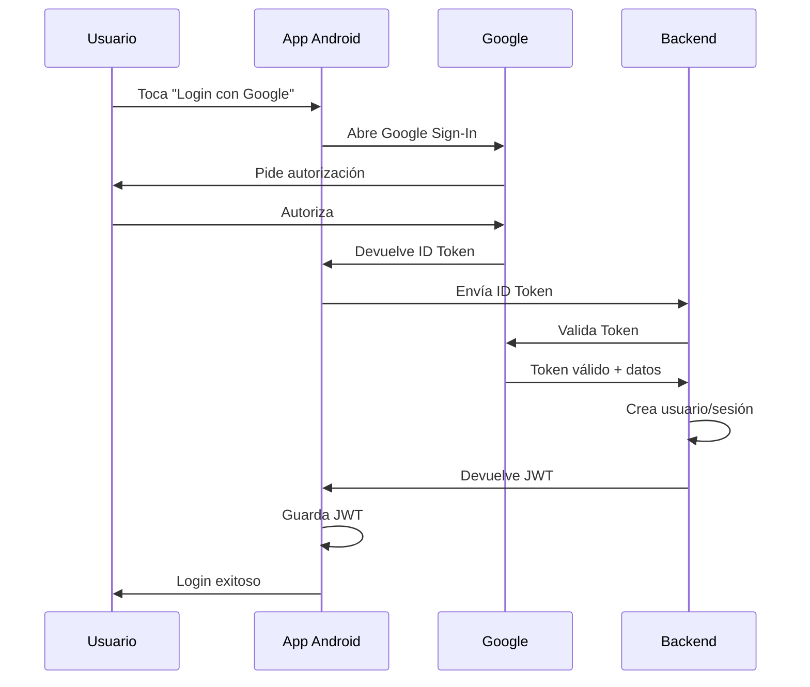
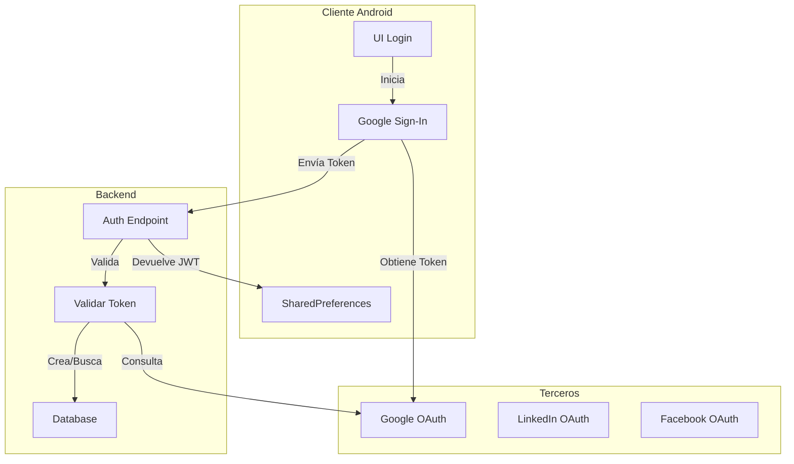
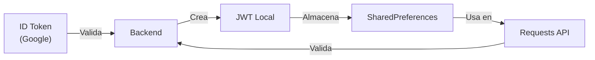
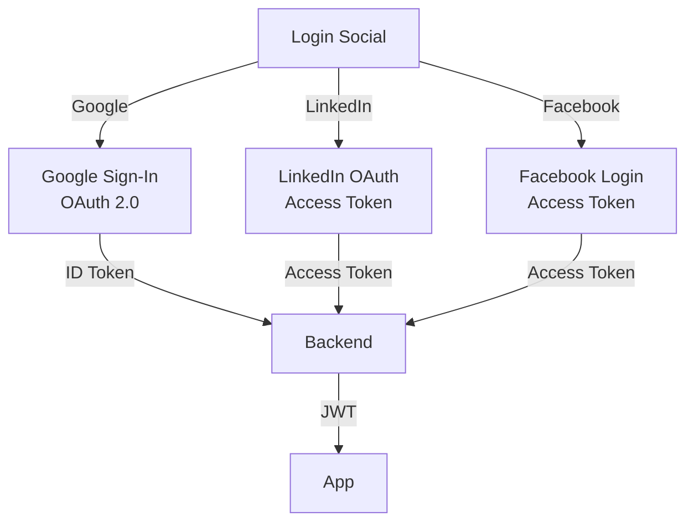

# 📱 Clase 05: OAuth 2.0 y Autenticación Social

**Duración:** 4 horas  
**Objetivo:** Implementar OAuth 2.0 con Google, LinkedIn y Facebook para autenticación social  
**Proyecto:** Integrar login social en Stock Management System con backend Node.js

---

## 📚 Contenido

### 1. Fundamentos de OAuth 2.0

OAuth 2.0 es un protocolo de autorización que permite a usuarios autenticarse usando cuentas de terceros sin compartir contraseñas.

**Flujo OAuth 2.0 (Authorization Code Flow):**

1. Usuario toca "Login con Google"
2. App redirige a Google
3. Usuario autoriza la app
4. Google devuelve authorization code
5. Backend intercambia code por access token
6. Backend obtiene datos del usuario
7. Backend crea sesión local

**Componentes principales:**

- **Resource Owner:** Usuario
- **Client:** Nuestra app
- **Authorization Server:** Google/LinkedIn/Facebook
- **Resource Server:** Servidor que tiene datos del usuario

```kotlin
// Flujo en Android
// 1. Iniciar login
val signInIntent = googleSignInClient.signInIntent
startActivityForResult(signInIntent, RC_SIGN_IN)

// 2. Obtener token
val task = GoogleSignIn.getSignedInAccountFromIntent(data)
val account = task.getResult(ApiException::class.java)
val idToken = account?.idToken

// 3. Enviar al backend
val response = apiService.loginWithGoogle(idToken)
```

### 2. Integración con Google Sign-In

**Configuración en build.gradle:**

```gradle
dependencies {
    implementation "com.google.android.gms:play-services-auth:20.7.0"
    implementation "com.google.android.gms:play-services-auth-api-phone:18.0.0"
}
```

**Crear GoogleSignInClient:**

```kotlin
package com.stockmanagement.auth

import android.content.Context
import com.google.android.gms.auth.api.signin.GoogleSignIn
import com.google.android.gms.auth.api.signin.GoogleSignInClient
import com.google.android.gms.auth.api.signin.GoogleSignInOptions

object GoogleSignInManager {
    fun getGoogleSignInClient(context: Context): GoogleSignInClient {
        val gso = GoogleSignInOptions.Builder(GoogleSignInOptions.DEFAULT_SIGN_IN)
            .requestIdToken("<WEB_CLIENT_ID>")
            .requestEmail()
            .requestProfile()
            .build()
        
        return GoogleSignIn.getClient(context, gso)
    }
}
```

**Activity para login:**

```kotlin
package com.stockmanagement.ui.auth

import android.content.Intent
import androidx.activity.result.contract.ActivityResultContracts
import androidx.appcompat.app.AppCompatActivity
import android.os.Bundle
import com.google.android.gms.auth.api.signin.GoogleSignIn
import com.google.android.gms.common.api.ApiException
import com.stockmanagement.R
import com.stockmanagement.auth.GoogleSignInManager
import com.stockmanagement.databinding.ActivityLoginBinding

class LoginActivity : AppCompatActivity() {
    
    private lateinit var binding: ActivityLoginBinding
    private val googleSignInLauncher = registerForActivityResult(
        ActivityResultContracts.StartActivityForResult()
    ) { result ->
        if (result.resultCode == RESULT_OK) {
            val task = GoogleSignIn.getSignedInAccountFromIntent(result.data)
            try {
                val account = task.getResult(ApiException::class.java)
                val idToken = account?.idToken
                if (idToken != null) {
                    handleGoogleSignIn(idToken)
                }
            } catch (e: ApiException) {
                showError("Google Sign-In failed: ${e.message}")
            }
        }
    }
    
    override fun onCreate(savedInstanceState: Bundle?) {
        super.onCreate(savedInstanceState)
        binding = ActivityLoginBinding.inflate(layoutInflater)
        setContentView(binding.root)
        
        binding.googleSignInButton.setOnClickListener {
            val googleSignInClient = GoogleSignInManager.getGoogleSignInClient(this)
            val signInIntent = googleSignInClient.signInIntent
            googleSignInLauncher.launch(signInIntent)
        }
    }
    
    private fun handleGoogleSignIn(idToken: String) {
        // Enviar token al backend
        // Backend valida token con Google y crea sesión
    }
    
    private fun showError(message: String) {
        // Mostrar error
    }
}
```

### 3. Backend: Validación de Tokens OAuth

**Endpoint en Node.js/Express:**

```typescript
import express from 'express';
import { OAuth2Client } from 'google-auth-library';
import jwt from 'jsonwebtoken';

const router = express.Router();
const googleClient = new OAuth2Client(process.env.GOOGLE_CLIENT_ID);

interface GoogleTokenPayload {
  iss: string;
  azp: string;
  aud: string;
  sub: string;
  email: string;
  email_verified: boolean;
  at_hash: string;
  name: string;
  picture: string;
  given_name: string;
  family_name: string;
  locale: string;
  iat: number;
  exp: number;
}

router.post('/auth/google', async (req, res) => {
  try {
    const { idToken } = req.body;
    
    // Validar token con Google
    const ticket = await googleClient.verifyIdToken({
      idToken,
      audience: process.env.GOOGLE_CLIENT_ID
    });
    
    const payload = ticket.getPayload() as GoogleTokenPayload;
    const { email, name, picture, sub } = payload;
    
    // Buscar o crear usuario
    let user = await User.findOne({ email });
    if (!user) {
      user = await User.create({
        email,
        name,
        avatar: picture,
        googleId: sub,
        provider: 'google'
      });
    }
    
    // Generar JWT local
    const token = jwt.sign(
      { userId: user.id, email: user.email },
      process.env.JWT_SECRET!,
      { expiresIn: '24h' }
    );
    
    res.json({ token, user });
  } catch (error) {
    res.status(401).json({ error: 'Invalid token' });
  }
});

export default router;
```

### 4. Integración con LinkedIn

**Configuración en build.gradle:**

```gradle
dependencies {
    implementation "com.linkedin.android:linkedin-android-sdk:1.1.0"
}
```

**LinkedIn Login:**

```kotlin
package com.stockmanagement.auth

import android.content.Context
import com.linkedin.android.litr.LinkedInHttpClient
import com.linkedin.android.litr.LinkedInSdk

object LinkedInSignInManager {
    fun initialize(context: Context) {
        LinkedInSdk.getInstance(context).apply {
            setClientId("<CLIENT_ID>")
            setClientSecret("<CLIENT_SECRET>")
            setRedirectUrl("https://yourdomain.com/callback")
        }
    }
    
    fun startLogin(context: Context, callback: (String) -> Unit) {
        LinkedInSdk.getInstance(context).openLoginDialog(context) { accessToken ->
            callback(accessToken)
        }
    }
}
```

### 5. Integración con Facebook

**Configuración en build.gradle:**

```gradle
dependencies {
    implementation "com.facebook.android:facebook-android-sdk:16.0.0"
}
```

**Facebook Login:**

```kotlin
package com.stockmanagement.auth

import android.content.Context
import com.facebook.FacebookSdk
import com.facebook.login.LoginManager
import com.facebook.login.widget.LoginButton

object FacebookSignInManager {
    fun initialize(context: Context) {
        FacebookSdk.sdkInitialize(context)
    }
    
    fun setupLoginButton(
        loginButton: LoginButton,
        callback: (String) -> Unit
    ) {
        loginButton.setPermissions(listOf("email", "public_profile"))
        loginButton.registerCallback(
            callbackManager,
            object : FacebookCallback<LoginResult> {
                override fun onSuccess(result: LoginResult) {
                    val token = result.accessToken.token
                    callback(token)
                }
                
                override fun onCancel() {}
                override fun onError(error: FacebookException) {}
            }
        )
    }
}
```

### 6. ViewModel para Autenticación

```kotlin
package com.stockmanagement.ui.auth

import androidx.lifecycle.ViewModel
import androidx.lifecycle.viewModelScope
import androidx.lifecycle.MutableLiveData
import com.stockmanagement.data.api.AuthService
import com.stockmanagement.data.models.User
import kotlinx.coroutines.launch

class AuthViewModel(
    private val authService: AuthService
) : ViewModel() {
    
    val user = MutableLiveData<User?>()
    val isLoading = MutableLiveData(false)
    val error = MutableLiveData<String?>()
    
    fun loginWithGoogle(idToken: String) = viewModelScope.launch {
        isLoading.value = true
        try {
            val response = authService.loginWithGoogle(idToken)
            user.value = response.user
            // Guardar token en SharedPreferences
            saveToken(response.token)
        } catch (e: Exception) {
            error.value = e.message
        } finally {
            isLoading.value = false
        }
    }
    
    fun loginWithLinkedIn(accessToken: String) = viewModelScope.launch {
        isLoading.value = true
        try {
            val response = authService.loginWithLinkedIn(accessToken)
            user.value = response.user
            saveToken(response.token)
        } catch (e: Exception) {
            error.value = e.message
        } finally {
            isLoading.value = false
        }
    }
    
    fun loginWithFacebook(accessToken: String) = viewModelScope.launch {
        isLoading.value = true
        try {
            val response = authService.loginWithFacebook(accessToken)
            user.value = response.user
            saveToken(response.token)
        } catch (e: Exception) {
            error.value = e.message
        } finally {
            isLoading.value = false
        }
    }
    
    private fun saveToken(token: String) {
        // Guardar en SharedPreferences o DataStore
    }
}
```

---

## 🎯 Ejercicio Práctico

### Objetivo
Implementar login con Google en Stock Management System, validar token en backend y crear sesión local.

### Paso 1: Configurar Google Cloud Console

1. Ir a https://console.cloud.google.com
2. Crear proyecto "Stock Management"
3. Habilitar Google Sign-In API
4. Crear credenciales OAuth 2.0
5. Descargar `google-services.json`
6. Copiar a `android/app/`

### Paso 2: Crear Activity de Login

Crear `android/app/src/main/java/com/stockmanagement/ui/auth/LoginActivity.kt`:

```kotlin
package com.stockmanagement.ui.auth

import android.content.Intent
import androidx.activity.result.contract.ActivityResultContracts
import androidx.appcompat.app.AppCompatActivity
import android.os.Bundle
import android.widget.Toast
import com.google.android.gms.auth.api.signin.GoogleSignIn
import com.google.android.gms.common.api.ApiException
import com.stockmanagement.auth.GoogleSignInManager
import com.stockmanagement.databinding.ActivityLoginBinding

class LoginActivity : AppCompatActivity() {
    
    private lateinit var binding: ActivityLoginBinding
    
    private val googleSignInLauncher = registerForActivityResult(
        ActivityResultContracts.StartActivityForResult()
    ) { result ->
        if (result.resultCode == RESULT_OK) {
            val task = GoogleSignIn.getSignedInAccountFromIntent(result.data)
            try {
                val account = task.getResult(ApiException::class.java)
                val idToken = account?.idToken
                if (idToken != null) {
                    Toast.makeText(this, "Token obtenido", Toast.LENGTH_SHORT).show()
                    // Aquí enviar al backend
                }
            } catch (e: ApiException) {
                Toast.makeText(this, "Error: ${e.message}", Toast.LENGTH_SHORT).show()
            }
        }
    }
    
    override fun onCreate(savedInstanceState: Bundle?) {
        super.onCreate(savedInstanceState)
        binding = ActivityLoginBinding.inflate(layoutInflater)
        setContentView(binding.root)
        
        binding.googleSignInButton.setOnClickListener {
            val googleSignInClient = GoogleSignInManager.getGoogleSignInClient(this)
            val signInIntent = googleSignInClient.signInIntent
            googleSignInLauncher.launch(signInIntent)
        }
    }
}
```

### Paso 3: Crear Backend Endpoint

Crear `backend/src/routes/auth.ts`:

```typescript
import express from 'express';
import { OAuth2Client } from 'google-auth-library';
import jwt from 'jsonwebtoken';
import { PrismaClient } from '@prisma/client';

const router = express.Router();
const prisma = new PrismaClient();
const googleClient = new OAuth2Client(process.env.GOOGLE_CLIENT_ID);

router.post('/auth/google', async (req, res) => {
  try {
    const { idToken } = req.body;
    
    const ticket = await googleClient.verifyIdToken({
      idToken,
      audience: process.env.GOOGLE_CLIENT_ID
    });
    
    const payload = ticket.getPayload();
    if (!payload) throw new Error('Invalid payload');
    
    const { email, name, picture, sub } = payload;
    
    let user = await prisma.user.findUnique({ where: { email: email! } });
    if (!user) {
      user = await prisma.user.create({
        data: {
          email: email!,
          name: name || '',
          avatar: picture,
          googleId: sub,
          provider: 'google'
        }
      });
    }
    
    const token = jwt.sign(
      { userId: user.id, email: user.email },
      process.env.JWT_SECRET!,
      { expiresIn: '24h' }
    );
    
    res.json({ token, user });
  } catch (error) {
    res.status(401).json({ error: 'Invalid token' });
  }
});

export default router;
```

### Paso 4: Crear AuthService

Crear `android/app/src/main/java/com/stockmanagement/data/api/AuthService.kt`:

```kotlin
package com.stockmanagement.data.api

import retrofit2.http.Body
import retrofit2.http.POST
import com.stockmanagement.data.models.User

data class GoogleLoginRequest(val idToken: String)
data class AuthResponse(val token: String, val user: User)

interface AuthService {
    @POST("auth/google")
    suspend fun loginWithGoogle(@Body request: GoogleLoginRequest): AuthResponse
}
```

### Paso 5: Verificar Integración

Ejecutar en terminal:
```bash
cd /home/apastorini/utu
./gradlew build
```

Verificar que no hay errores y que Google Sign-In está configurado.

---

## 📊 Diagramas

### Diagrama 1: Flujo OAuth 2.0



### Diagrama 2: Arquitectura de Autenticación



### Diagrama 3: Flujo de Tokens



### Diagrama 4: Proveedores Soportados



---

## 📝 Resumen

- ✅ OAuth 2.0 permite autenticación sin compartir contraseñas
- ✅ Google Sign-In es el más común en Android
- ✅ Backend valida tokens con proveedores
- ✅ JWT local se usa para sesiones
- ✅ Múltiples proveedores aumentan conversión
- ✅ Tokens deben almacenarse de forma segura

---

## 🎓 Preguntas de Repaso

**P1:** ¿Cuál es la diferencia entre ID Token y Access Token?

**R1:** ID Token contiene información del usuario (email, nombre), Access Token se usa para acceder a recursos. Google devuelve ID Token, que validamos en backend.

**P2:** ¿Por qué validar el token en backend y no en la app?

**R2:** Porque la app puede ser modificada. Backend es confiable. Validamos con Google para asegurar que el token es legítimo.

**P3:** ¿Dónde guardar el JWT después de login?

**R3:** En SharedPreferences o DataStore (encriptado). Nunca en código fuente. Se envía en header Authorization de requests.

**P4:** ¿Qué hacer si el token expira?

**R4:** Usar refresh token para obtener nuevo access token sin que el usuario vuelva a login. O redirigir a login.

**P5:** ¿Cómo soportar múltiples proveedores?

**R5:** Crear endpoint separado para cada proveedor (/auth/google, /auth/linkedin, /auth/facebook) que validen con su proveedor respectivo.

---

## 🚀 Próxima Clase

**Clase 06: JWT, Tokens y Seguridad**

Implementaremos refresh tokens, validación de JWT, almacenamiento seguro y manejo de expiración.

---

**Última actualización:** 2024  
**Tiempo estimado:** 4 horas  
**Complejidad:** ⭐⭐⭐⭐ (Avanzada)
