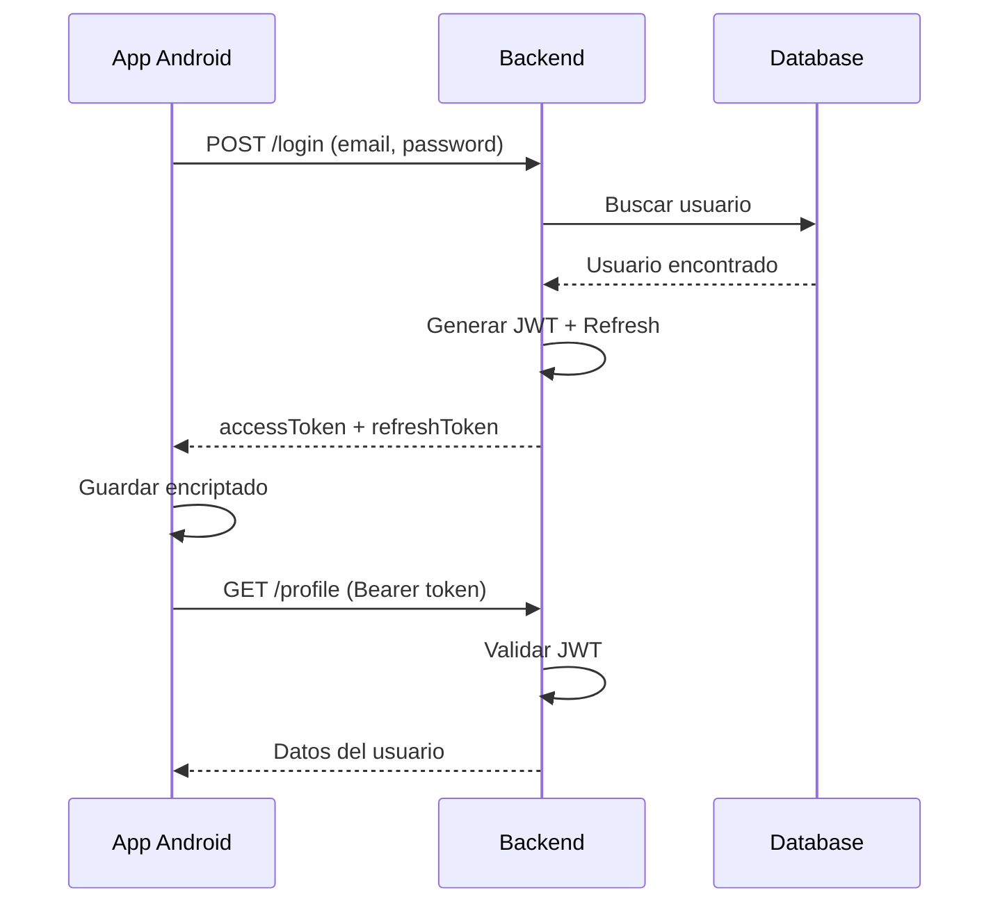
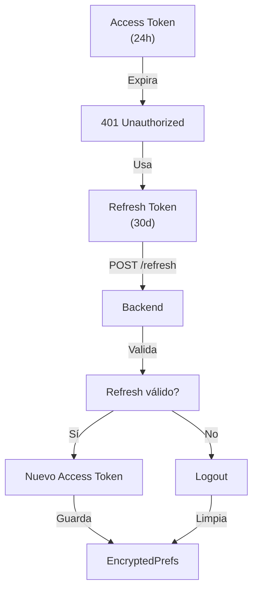
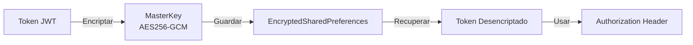
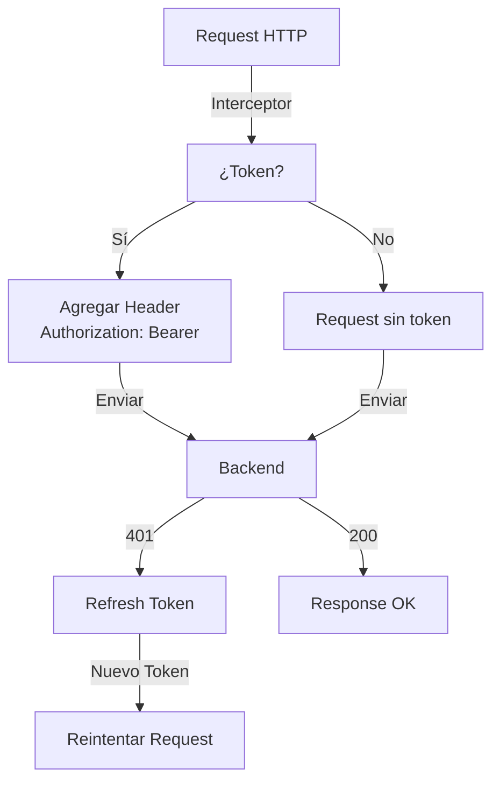

# 📱 Clase 06: JWT, Tokens y Seguridad

**Duración:** 4 horas  
**Objetivo:** Implementar JWT, refresh tokens, validación segura y almacenamiento encriptado  
**Proyecto:** Completar autenticación en Stock Management System con tokens seguros

---

## 📚 Contenido

### 1. Fundamentos de JWT

JWT (JSON Web Token) es un estándar para crear tokens seguros que contienen información del usuario.

**Estructura de JWT:**
```
header.payload.signature
```

- **Header:** Tipo de token y algoritmo de firma
- **Payload:** Datos del usuario (claims)
- **Signature:** Firma criptográfica para validar integridad

**Ejemplo decodificado:**
```json
// Header
{
  "alg": "HS256",
  "typ": "JWT"
}

// Payload
{
  "userId": 123,
  "email": "user@example.com",
  "iat": 1704067200,
  "exp": 1704153600
}

// Signature
HMACSHA256(base64UrlEncode(header) + "." + base64UrlEncode(payload), secret)
```

**Generación en Node.js:**

```typescript
import jwt from 'jsonwebtoken';

const generateToken = (userId: number, email: string): string => {
  return jwt.sign(
    { userId, email },
    process.env.JWT_SECRET!,
    { expiresIn: '24h' }
  );
};

const token = generateToken(1, 'user@example.com');
// eyJhbGciOiJIUzI1NiIsInR5cCI6IkpXVCJ9...
```

### 2. Refresh Tokens

Access tokens expiran por seguridad. Refresh tokens permiten obtener nuevos access tokens sin re-autenticar.

**Flujo:**
1. Usuario login → recibe access token (24h) + refresh token (30d)
2. Access token expira
3. App usa refresh token para obtener nuevo access token
4. Si refresh token expira, usuario debe login nuevamente

**Backend:**

```typescript
interface TokenPair {
  accessToken: string;
  refreshToken: string;
}

const generateTokenPair = (userId: number, email: string): TokenPair => {
  const accessToken = jwt.sign(
    { userId, email, type: 'access' },
    process.env.JWT_SECRET!,
    { expiresIn: '24h' }
  );
  
  const refreshToken = jwt.sign(
    { userId, email, type: 'refresh' },
    process.env.REFRESH_SECRET!,
    { expiresIn: '30d' }
  );
  
  return { accessToken, refreshToken };
};

router.post('/auth/refresh', (req, res) => {
  try {
    const { refreshToken } = req.body;
    
    const decoded = jwt.verify(
      refreshToken,
      process.env.REFRESH_SECRET!
    ) as any;
    
    if (decoded.type !== 'refresh') {
      return res.status(401).json({ error: 'Invalid token type' });
    }
    
    const newAccessToken = jwt.sign(
      { userId: decoded.userId, email: decoded.email, type: 'access' },
      process.env.JWT_SECRET!,
      { expiresIn: '24h' }
    );
    
    res.json({ accessToken: newAccessToken });
  } catch (error) {
    res.status(401).json({ error: 'Invalid refresh token' });
  }
});
```

### 3. Validación de Tokens

**Middleware en Express:**

```typescript
import { Request, Response, NextFunction } from 'express';

interface AuthRequest extends Request {
  userId?: number;
  email?: string;
}

export const authMiddleware = (
  req: AuthRequest,
  res: Response,
  next: NextFunction
) => {
  try {
    const authHeader = req.headers.authorization;
    if (!authHeader?.startsWith('Bearer ')) {
      return res.status(401).json({ error: 'Missing token' });
    }
    
    const token = authHeader.substring(7);
    const decoded = jwt.verify(token, process.env.JWT_SECRET!) as any;
    
    if (decoded.type !== 'access') {
      return res.status(401).json({ error: 'Invalid token type' });
    }
    
    req.userId = decoded.userId;
    req.email = decoded.email;
    next();
  } catch (error) {
    res.status(401).json({ error: 'Invalid token' });
  }
};

// Uso
router.get('/profile', authMiddleware, (req: AuthRequest, res) => {
  res.json({ userId: req.userId, email: req.email });
});
```

### 4. Almacenamiento Seguro en Android

**EncryptedSharedPreferences:**

```kotlin
package com.stockmanagement.data.security

import android.content.Context
import androidx.security.crypto.EncryptedSharedPreferences
import androidx.security.crypto.MasterKey

class TokenManager(context: Context) {
    
    private val masterKey = MasterKey.Builder(context)
        .setKeyScheme(MasterKey.KeyScheme.AES256_GCM)
        .build()
    
    private val encryptedPrefs = EncryptedSharedPreferences.create(
        context,
        "token_prefs",
        masterKey,
        EncryptedSharedPreferences.PrefKeyEncryptionScheme.AES256_SIV,
        EncryptedSharedPreferences.PrefValueEncryptionScheme.AES256_GCM
    )
    
    fun saveTokens(accessToken: String, refreshToken: String) {
        encryptedPrefs.edit().apply {
            putString("access_token", accessToken)
            putString("refresh_token", refreshToken)
            putLong("token_time", System.currentTimeMillis())
            apply()
        }
    }
    
    fun getAccessToken(): String? = encryptedPrefs.getString("access_token", null)
    
    fun getRefreshToken(): String? = encryptedPrefs.getString("refresh_token", null)
    
    fun clearTokens() {
        encryptedPrefs.edit().clear().apply()
    }
    
    fun isTokenExpired(): Boolean {
        val tokenTime = encryptedPrefs.getLong("token_time", 0)
        val expirationTime = 24 * 60 * 60 * 1000 // 24 horas
        return System.currentTimeMillis() - tokenTime > expirationTime
    }
}
```

**Dependencias en build.gradle:**

```gradle
dependencies {
    implementation "androidx.security:security-crypto:1.1.0-alpha06"
}
```

### 5. Interceptor para Tokens

**Retrofit Interceptor:**

```kotlin
package com.stockmanagement.data.api

import okhttp3.Interceptor
import okhttp3.Response
import com.stockmanagement.data.security.TokenManager

class TokenInterceptor(private val tokenManager: TokenManager) : Interceptor {
    
    override fun intercept(chain: Interceptor.Chain): Response {
        val originalRequest = chain.request()
        
        // Agregar token al header
        val token = tokenManager.getAccessToken()
        val requestWithToken = if (token != null) {
            originalRequest.newBuilder()
                .header("Authorization", "Bearer $token")
                .build()
        } else {
            originalRequest
        }
        
        var response = chain.proceed(requestWithToken)
        
        // Si token expiró (401), intentar refresh
        if (response.code == 401) {
            val refreshToken = tokenManager.getRefreshToken()
            if (refreshToken != null) {
                try {
                    val newAccessToken = refreshAccessToken(refreshToken)
                    tokenManager.saveTokens(newAccessToken, refreshToken)
                    
                    val retryRequest = originalRequest.newBuilder()
                        .header("Authorization", "Bearer $newAccessToken")
                        .build()
                    
                    response.close()
                    response = chain.proceed(retryRequest)
                } catch (e: Exception) {
                    tokenManager.clearTokens()
                }
            }
        }
        
        return response
    }
    
    private fun refreshAccessToken(refreshToken: String): String {
        // Llamar a backend para obtener nuevo token
        // Implementación específica según tu API
        return ""
    }
}
```

### 6. ViewModel con Manejo de Tokens

```kotlin
package com.stockmanagement.ui.auth

import androidx.lifecycle.ViewModel
import androidx.lifecycle.viewModelScope
import androidx.lifecycle.MutableLiveData
import com.stockmanagement.data.api.AuthService
import com.stockmanagement.data.security.TokenManager
import com.stockmanagement.data.models.User
import kotlinx.coroutines.launch

class TokenViewModel(
    private val authService: AuthService,
    private val tokenManager: TokenManager
) : ViewModel() {
    
    val user = MutableLiveData<User?>()
    val isAuthenticated = MutableLiveData(false)
    val error = MutableLiveData<String?>()
    
    init {
        checkAuthentication()
    }
    
    private fun checkAuthentication() {
        val token = tokenManager.getAccessToken()
        isAuthenticated.value = token != null && !tokenManager.isTokenExpired()
    }
    
    fun login(email: String, password: String) = viewModelScope.launch {
        try {
            val response = authService.login(email, password)
            tokenManager.saveTokens(response.accessToken, response.refreshToken)
            user.value = response.user
            isAuthenticated.value = true
        } catch (e: Exception) {
            error.value = e.message
        }
    }
    
    fun logout() {
        tokenManager.clearTokens()
        user.value = null
        isAuthenticated.value = false
    }
    
    fun refreshToken() = viewModelScope.launch {
        try {
            val refreshToken = tokenManager.getRefreshToken() ?: return@launch
            val response = authService.refreshToken(refreshToken)
            tokenManager.saveTokens(response.accessToken, refreshToken)
        } catch (e: Exception) {
            logout()
        }
    }
}
```

---

## 🎯 Ejercicio Práctico

### Objetivo
Implementar JWT con refresh tokens, almacenamiento encriptado e interceptor automático.

### Paso 1: Crear TokenManager

Crear `android/app/src/main/java/com/stockmanagement/data/security/TokenManager.kt`:

```kotlin
package com.stockmanagement.data.security

import android.content.Context
import androidx.security.crypto.EncryptedSharedPreferences
import androidx.security.crypto.MasterKey

class TokenManager(context: Context) {
    
    private val masterKey = MasterKey.Builder(context)
        .setKeyScheme(MasterKey.KeyScheme.AES256_GCM)
        .build()
    
    private val encryptedPrefs = EncryptedSharedPreferences.create(
        context,
        "token_prefs",
        masterKey,
        EncryptedSharedPreferences.PrefKeyEncryptionScheme.AES256_SIV,
        EncryptedSharedPreferences.PrefValueEncryptionScheme.AES256_GCM
    )
    
    fun saveTokens(accessToken: String, refreshToken: String) {
        encryptedPrefs.edit().apply {
            putString("access_token", accessToken)
            putString("refresh_token", refreshToken)
            putLong("token_time", System.currentTimeMillis())
            apply()
        }
    }
    
    fun getAccessToken(): String? = encryptedPrefs.getString("access_token", null)
    fun getRefreshToken(): String? = encryptedPrefs.getString("refresh_token", null)
    
    fun clearTokens() {
        encryptedPrefs.edit().clear().apply()
    }
}
```

### Paso 2: Crear TokenInterceptor

Crear `android/app/src/main/java/com/stockmanagement/data/api/TokenInterceptor.kt`:

```kotlin
package com.stockmanagement.data.api

import okhttp3.Interceptor
import okhttp3.Response
import com.stockmanagement.data.security.TokenManager

class TokenInterceptor(private val tokenManager: TokenManager) : Interceptor {
    
    override fun intercept(chain: Interceptor.Chain): Response {
        val originalRequest = chain.request()
        
        val token = tokenManager.getAccessToken()
        val requestWithToken = if (token != null) {
            originalRequest.newBuilder()
                .header("Authorization", "Bearer $token")
                .build()
        } else {
            originalRequest
        }
        
        return chain.proceed(requestWithToken)
    }
}
```

### Paso 3: Configurar Retrofit

Actualizar `android/app/src/main/java/com/stockmanagement/data/api/ApiClient.kt`:

```kotlin
package com.stockmanagement.data.api

import okhttp3.OkHttpClient
import retrofit2.Retrofit
import retrofit2.converter.gson.GsonConverterFactory
import com.stockmanagement.data.security.TokenManager
import android.content.Context

object ApiClient {
    fun getRetrofit(context: Context): Retrofit {
        val tokenManager = TokenManager(context)
        
        val httpClient = OkHttpClient.Builder()
            .addInterceptor(TokenInterceptor(tokenManager))
            .build()
        
        return Retrofit.Builder()
            .baseUrl("http://localhost:3000/api/")
            .client(httpClient)
            .addConverterFactory(GsonConverterFactory.create())
            .build()
    }
}
```

### Paso 4: Crear Backend Endpoint

Crear `backend/src/routes/token.ts`:

```typescript
import express from 'express';
import jwt from 'jsonwebtoken';

const router = express.Router();

router.post('/auth/refresh', (req, res) => {
  try {
    const { refreshToken } = req.body;
    
    const decoded = jwt.verify(
      refreshToken,
      process.env.REFRESH_SECRET!
    ) as any;
    
    if (decoded.type !== 'refresh') {
      return res.status(401).json({ error: 'Invalid token type' });
    }
    
    const newAccessToken = jwt.sign(
      { userId: decoded.userId, email: decoded.email, type: 'access' },
      process.env.JWT_SECRET!,
      { expiresIn: '24h' }
    );
    
    res.json({ accessToken: newAccessToken });
  } catch (error) {
    res.status(401).json({ error: 'Invalid refresh token' });
  }
});

export default router;
```

### Paso 5: Verificar Integración

Ejecutar en terminal:
```bash
cd /home/apastorini/utu
./gradlew build
```

Verificar que no hay errores y que los tokens se almacenan encriptados.

---

## 📊 Diagramas

### Diagrama 1: Flujo de JWT



### Diagrama 2: Refresh Token Flow



### Diagrama 3: Almacenamiento Seguro



### Diagrama 4: Interceptor Automático



---

## 📝 Resumen

- ✅ JWT contiene información del usuario de forma segura
- ✅ Refresh tokens permiten renovar access tokens sin re-autenticar
- ✅ EncryptedSharedPreferences protege tokens en el dispositivo
- ✅ Interceptor automático agrega tokens a requests
- ✅ Validación en backend asegura integridad
- ✅ Logout limpia tokens de forma segura

---

## 🎓 Preguntas de Repaso

**P1:** ¿Cuál es la diferencia entre access token y refresh token?

**R1:** Access token es de corta duración (24h) y se usa para acceder a recursos. Refresh token es de larga duración (30d) y solo se usa para obtener nuevos access tokens.

**P2:** ¿Por qué encriptar tokens en el dispositivo?

**R2:** Para proteger contra acceso no autorizado si el dispositivo es robado o comprometido. EncryptedSharedPreferences usa AES256-GCM.

**P3:** ¿Qué hace el interceptor de tokens?

**R3:** Automáticamente agrega el token JWT al header Authorization de cada request. Si recibe 401, intenta renovar el token con el refresh token.

**P4:** ¿Qué pasa si el refresh token expira?

**R4:** El usuario debe hacer login nuevamente. El app limpia los tokens y redirige a la pantalla de login.

**P5:** ¿Cómo validar un JWT en el backend?

**R5:** Usando jwt.verify() con la misma clave secreta usada para firmarlo. Si la firma es inválida o expiró, lanza error.

---

## 🚀 Próxima Clase

**Clase 07: Arquitectura Multi-Tenant**

Implementaremos aislamiento de datos por tenant, middleware de tenant y consultas filtradas.

---

**Última actualización:** 2024  
**Tiempo estimado:** 4 horas  
**Complejidad:** ⭐⭐⭐⭐ (Avanzada)
