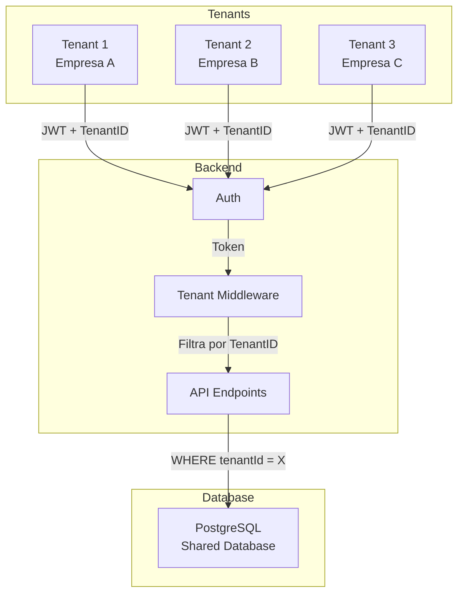
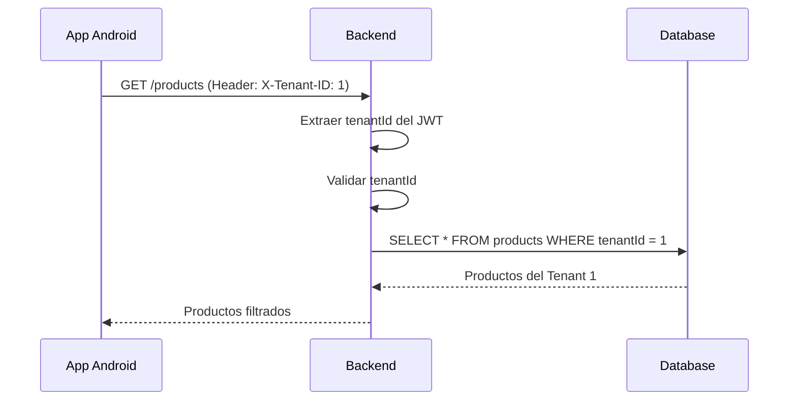
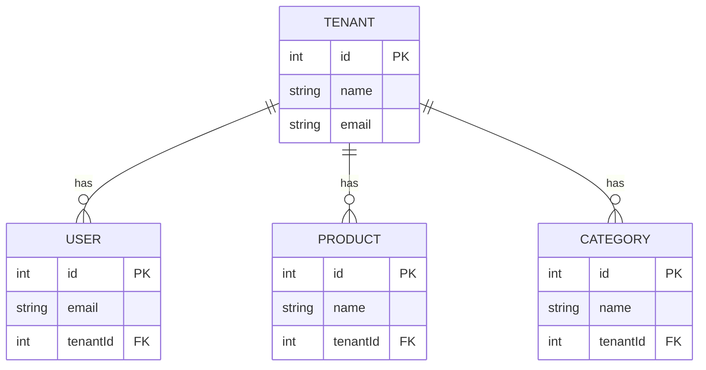
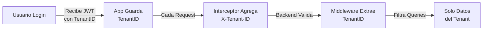

# 📱 Clase 07: Arquitectura Multi-Tenant

**Duración:** 4 horas  
**Objetivo:** Implementar aislamiento de datos por tenant, middleware de tenant y consultas filtradas  
**Proyecto:** Integrar multi-tenancy en Stock Management System para soportar múltiples empresas

---

## 📚 Contenido

### 1. Concepto de Multi-Tenancy

Multi-tenancy permite que múltiples clientes (tenants) compartan la misma aplicación pero con datos completamente aislados.

**Modelos de Multi-Tenancy:**

1. **Database per Tenant:** Cada tenant tiene su propia BD
   - Máxima seguridad y aislamiento
   - Mayor costo de infraestructura
   - Escalabilidad compleja

2. **Schema per Tenant:** Cada tenant tiene su schema en la misma BD
   - Balance entre seguridad y costo
   - Escalabilidad moderada
   - Mantenimiento más simple

3. **Shared Database:** Todos los tenants comparten BD y schema
   - Menor costo
   - Máxima escalabilidad
   - Requiere filtrado en cada query

**Usaremos Shared Database con filtrado en queries.**

### 2. Identificación de Tenant

**En el JWT:**

```typescript
interface TokenPayload {
  userId: number;
  email: string;
  tenantId: number;  // ← Identificador del tenant
  iat: number;
  exp: number;
}

const generateToken = (userId: number, email: string, tenantId: number) => {
  return jwt.sign(
    { userId, email, tenantId },
    process.env.JWT_SECRET!,
    { expiresIn: '24h' }
  );
};
```

**En Android:**

```kotlin
package com.stockmanagement.data.security

import android.content.Context
import androidx.security.crypto.EncryptedSharedPreferences
import androidx.security.crypto.MasterKey

class TenantManager(context: Context) {
    
    private val masterKey = MasterKey.Builder(context)
        .setKeyScheme(MasterKey.KeyScheme.AES256_GCM)
        .build()
    
    private val encryptedPrefs = EncryptedSharedPreferences.create(
        context,
        "tenant_prefs",
        masterKey,
        EncryptedSharedPreferences.PrefKeyEncryptionScheme.AES256_SIV,
        EncryptedSharedPreferences.PrefValueEncryptionScheme.AES256_GCM
    )
    
    fun saveTenantId(tenantId: Int) {
        encryptedPrefs.edit().putInt("tenant_id", tenantId).apply()
    }
    
    fun getTenantId(): Int = encryptedPrefs.getInt("tenant_id", 0)
}
```

### 3. Middleware de Tenant en Backend

**Middleware para extraer tenant del JWT:**

```typescript
import { Request, Response, NextFunction } from 'express';

interface TenantRequest extends Request {
  tenantId?: number;
  userId?: number;
}

export const tenantMiddleware = (
  req: TenantRequest,
  res: Response,
  next: NextFunction
) => {
  try {
    const authHeader = req.headers.authorization;
    if (!authHeader?.startsWith('Bearer ')) {
      return res.status(401).json({ error: 'Missing token' });
    }
    
    const token = authHeader.substring(7);
    const decoded = jwt.verify(token, process.env.JWT_SECRET!) as any;
    
    req.tenantId = decoded.tenantId;
    req.userId = decoded.userId;
    next();
  } catch (error) {
    res.status(401).json({ error: 'Invalid token' });
  }
};

// Uso
router.get('/products', tenantMiddleware, async (req: TenantRequest, res) => {
  const products = await prisma.product.findMany({
    where: { tenantId: req.tenantId }
  });
  res.json(products);
});
```

### 4. Modelos con Tenant

**Schema Prisma:**

```prisma
model Tenant {
  id        Int     @id @default(autoincrement())
  name      String
  email     String  @unique
  createdAt DateTime @default(now())
  
  users     User[]
  products  Product[]
  categories Category[]
}

model User {
  id        Int     @id @default(autoincrement())
  email     String
  name      String
  tenantId  Int
  tenant    Tenant  @relation(fields: [tenantId], references: [id], onDelete: Cascade)
  
  @@unique([email, tenantId])
}

model Product {
  id        Int     @id @default(autoincrement())
  name      String
  sku       String
  price     Float
  stock     Int
  tenantId  Int
  tenant    Tenant  @relation(fields: [tenantId], references: [id], onDelete: Cascade)
  
  @@unique([sku, tenantId])
  @@index([tenantId])
}

model Category {
  id        Int     @id @default(autoincrement())
  name      String
  tenantId  Int
  tenant    Tenant  @relation(fields: [tenantId], references: [id], onDelete: Cascade)
  
  @@unique([name, tenantId])
  @@index([tenantId])
}
```

### 5. Consultas Filtradas por Tenant

**Repository Pattern:**

```typescript
class ProductRepository {
  
  async findByTenant(tenantId: number): Promise<Product[]> {
    return prisma.product.findMany({
      where: { tenantId }
    });
  }
  
  async findByIdAndTenant(id: number, tenantId: number): Promise<Product | null> {
    return prisma.product.findFirst({
      where: { id, tenantId }
    });
  }
  
  async create(data: ProductInput, tenantId: number): Promise<Product> {
    return prisma.product.create({
      data: { ...data, tenantId }
    });
  }
  
  async update(id: number, data: ProductInput, tenantId: number): Promise<Product> {
    return prisma.product.update({
      where: { id },
      data,
      // Validar que pertenece al tenant
    });
  }
  
  async delete(id: number, tenantId: number): Promise<void> {
    await prisma.product.deleteMany({
      where: { id, tenantId }
    });
  }
}
```

### 6. Interceptor de Tenant en Android

```kotlin
package com.stockmanagement.data.api

import okhttp3.Interceptor
import okhttp3.Response
import com.stockmanagement.data.security.TenantManager

class TenantInterceptor(private val tenantManager: TenantManager) : Interceptor {
    
    override fun intercept(chain: Interceptor.Chain): Response {
        val originalRequest = chain.request()
        
        val tenantId = tenantManager.getTenantId()
        val requestWithTenant = originalRequest.newBuilder()
            .header("X-Tenant-ID", tenantId.toString())
            .build()
        
        return chain.proceed(requestWithTenant)
    }
}
```

---

## 🎯 Ejercicio Práctico

### Objetivo
Implementar multi-tenancy con aislamiento de datos, middleware de tenant y consultas filtradas.

### Paso 1: Crear TenantManager

Crear `android/app/src/main/java/com/stockmanagement/data/security/TenantManager.kt`:

```kotlin
package com.stockmanagement.data.security

import android.content.Context
import androidx.security.crypto.EncryptedSharedPreferences
import androidx.security.crypto.MasterKey

class TenantManager(context: Context) {
    
    private val masterKey = MasterKey.Builder(context)
        .setKeyScheme(MasterKey.KeyScheme.AES256_GCM)
        .build()
    
    private val encryptedPrefs = EncryptedSharedPreferences.create(
        context,
        "tenant_prefs",
        masterKey,
        EncryptedSharedPreferences.PrefKeyEncryptionScheme.AES256_SIV,
        EncryptedSharedPreferences.PrefValueEncryptionScheme.AES256_GCM
    )
    
    fun saveTenantId(tenantId: Int) {
        encryptedPrefs.edit().putInt("tenant_id", tenantId).apply()
    }
    
    fun getTenantId(): Int = encryptedPrefs.getInt("tenant_id", 0)
}
```

### Paso 2: Crear TenantInterceptor

Crear `android/app/src/main/java/com/stockmanagement/data/api/TenantInterceptor.kt`:

```kotlin
package com.stockmanagement.data.api

import okhttp3.Interceptor
import okhttp3.Response
import com.stockmanagement.data.security.TenantManager

class TenantInterceptor(private val tenantManager: TenantManager) : Interceptor {
    
    override fun intercept(chain: Interceptor.Chain): Response {
        val originalRequest = chain.request()
        
        val tenantId = tenantManager.getTenantId()
        val requestWithTenant = originalRequest.newBuilder()
            .header("X-Tenant-ID", tenantId.toString())
            .build()
        
        return chain.proceed(requestWithTenant)
    }
}
```

### Paso 3: Actualizar Retrofit

Actualizar `android/app/src/main/java/com/stockmanagement/data/api/ApiClient.kt`:

```kotlin
package com.stockmanagement.data.api

import okhttp3.OkHttpClient
import retrofit2.Retrofit
import retrofit2.converter.gson.GsonConverterFactory
import com.stockmanagement.data.security.TokenManager
import com.stockmanagement.data.security.TenantManager
import android.content.Context

object ApiClient {
    fun getRetrofit(context: Context): Retrofit {
        val tokenManager = TokenManager(context)
        val tenantManager = TenantManager(context)
        
        val httpClient = OkHttpClient.Builder()
            .addInterceptor(TokenInterceptor(tokenManager))
            .addInterceptor(TenantInterceptor(tenantManager))
            .build()
        
        return Retrofit.Builder()
            .baseUrl("http://localhost:3000/api/")
            .client(httpClient)
            .addConverterFactory(GsonConverterFactory.create())
            .build()
    }
}
```

### Paso 4: Crear Backend Middleware

Crear `backend/src/middleware/tenant.ts`:

```typescript
import { Request, Response, NextFunction } from 'express';
import jwt from 'jsonwebtoken';

interface TenantRequest extends Request {
  tenantId?: number;
  userId?: number;
}

export const tenantMiddleware = (
  req: TenantRequest,
  res: Response,
  next: NextFunction
) => {
  try {
    const authHeader = req.headers.authorization;
    if (!authHeader?.startsWith('Bearer ')) {
      return res.status(401).json({ error: 'Missing token' });
    }
    
    const token = authHeader.substring(7);
    const decoded = jwt.verify(token, process.env.JWT_SECRET!) as any;
    
    req.tenantId = decoded.tenantId;
    req.userId = decoded.userId;
    next();
  } catch (error) {
    res.status(401).json({ error: 'Invalid token' });
  }
};
```

### Paso 5: Crear Endpoint con Filtro

Crear `backend/src/routes/products.ts`:

```typescript
import express from 'express';
import { PrismaClient } from '@prisma/client';
import { tenantMiddleware } from '../middleware/tenant';

const router = express.Router();
const prisma = new PrismaClient();

interface TenantRequest extends express.Request {
  tenantId?: number;
}

router.get('/products', tenantMiddleware, async (req: TenantRequest, res) => {
  try {
    const products = await prisma.product.findMany({
      where: { tenantId: req.tenantId }
    });
    res.json(products);
  } catch (error) {
    res.status(500).json({ error: 'Failed to fetch products' });
  }
});

export default router;
```

---

## 📊 Diagramas

### Diagrama 1: Arquitectura Multi-Tenant



### Diagrama 2: Flujo de Aislamiento



### Diagrama 3: Modelo de Datos



### Diagrama 4: Ciclo de Vida de Tenant



---

## 📝 Resumen

- ✅ Multi-tenancy permite múltiples clientes en una app
- ✅ Shared database es más escalable y económico
- ✅ TenantID se incluye en JWT y headers
- ✅ Middleware valida y filtra por tenant
- ✅ Todas las queries deben filtrar por tenantId
- ✅ Aislamiento de datos es crítico para seguridad

---

## 🎓 Preguntas de Repaso

**P1:** ¿Cuál es la diferencia entre database per tenant y shared database?

**R1:** Database per tenant: cada cliente tiene su BD (máxima seguridad, mayor costo). Shared database: todos comparten BD pero con filtrado en queries (menor costo, máxima escalabilidad).

**P2:** ¿Dónde se almacena el tenantId?

**R2:** En el JWT como claim. Se extrae en el middleware y se usa para filtrar todas las queries.

**P3:** ¿Qué pasa si un usuario intenta acceder a datos de otro tenant?

**R3:** El middleware valida que el tenantId del JWT coincida con el de la query. Si no coincide, retorna 401 Unauthorized.

**P4:** ¿Cómo se asegura que todas las queries filtren por tenant?

**R4:** Usando middleware que valida el tenantId, y repository pattern que siempre agrega WHERE tenantId = X.

**P5:** ¿Qué es el header X-Tenant-ID?

**R5:** Header HTTP que envía el cliente con el tenantId. El backend lo valida contra el JWT para seguridad adicional.

---

## 🚀 Próxima Clase

**Clase 08: Panel Admin y Gestión de Usuarios**

Implementaremos gestión de usuarios, cambio de roles y auditoría.

---

**Última actualización:** 2024  
**Tiempo estimado:** 4 horas  
**Complejidad:** ⭐⭐⭐⭐ (Avanzada)
