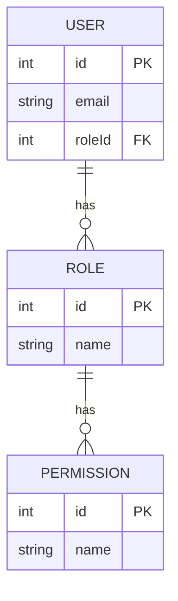
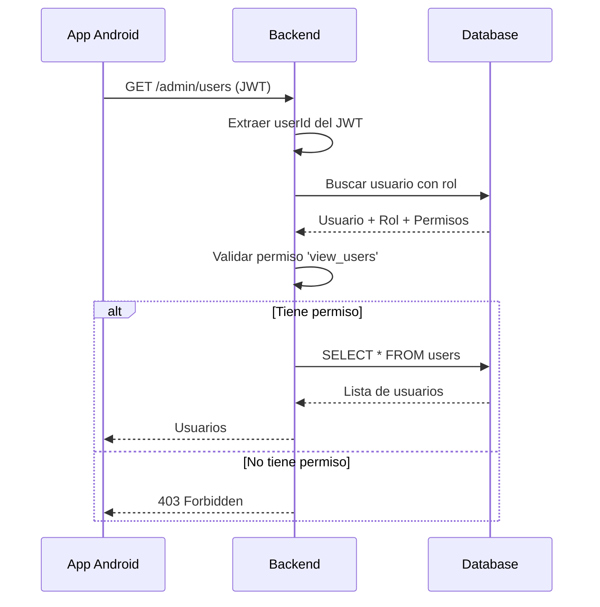
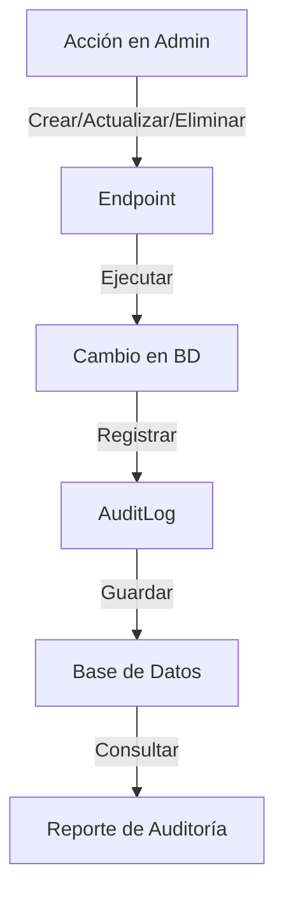
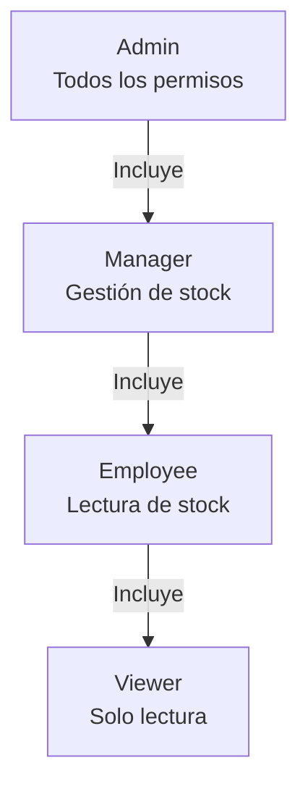

# 📱 Clase 08: Panel Admin y Gestión de Usuarios

**Duración:** 4 horas  
**Objetivo:** Implementar panel admin con gestión de usuarios, cambio de roles y auditoría  
**Proyecto:** Crear interfaz admin en Stock Management System para administrar usuarios y permisos

---

## 📚 Contenido

### 1. Roles y Permisos

**Modelo de Roles:**

```typescript
enum UserRole {
  ADMIN = 'admin',           // Acceso total
  MANAGER = 'manager',       // Gestión de stock
  EMPLOYEE = 'employee',     // Lectura de stock
  VIEWER = 'viewer'          // Solo lectura
}

interface Permission {
  id: number;
  name: string;
  description: string;
}

interface Role {
  id: number;
  name: UserRole;
  permissions: Permission[];
}
```

**Schema Prisma:**

```prisma
model Role {
  id          Int     @id @default(autoincrement())
  name        String  @unique
  description String?
  tenantId    Int
  tenant      Tenant  @relation(fields: [tenantId], references: [id], onDelete: Cascade)
  
  users       User[]
  permissions RolePermission[]
  
  @@unique([name, tenantId])
}

model Permission {
  id          Int     @id @default(autoincrement())
  name        String  @unique
  description String?
  
  roles       RolePermission[]
}

model RolePermission {
  roleId       Int
  permissionId Int
  role         Role       @relation(fields: [roleId], references: [id], onDelete: Cascade)
  permission   Permission @relation(fields: [permissionId], references: [id], onDelete: Cascade)
  
  @@id([roleId, permissionId])
}

model User {
  id        Int     @id @default(autoincrement())
  email     String
  name      String
  roleId    Int
  role      Role    @relation(fields: [roleId], references: [id])
  tenantId  Int
  tenant    Tenant  @relation(fields: [tenantId], references: [id], onDelete: Cascade)
  
  auditLogs AuditLog[]
  
  @@unique([email, tenantId])
}
```

### 2. Middleware de Autorización

**Verificar permisos:**

```typescript
export const authorize = (requiredPermission: string) => {
  return async (req: TenantRequest, res: Response, next: NextFunction) => {
    try {
      const user = await prisma.user.findFirst({
        where: { id: req.userId, tenantId: req.tenantId },
        include: {
          role: {
            include: {
              permissions: true
            }
          }
        }
      });
      
      if (!user) {
        return res.status(404).json({ error: 'User not found' });
      }
      
      const hasPermission = user.role.permissions.some(
        p => p.name === requiredPermission
      );
      
      if (!hasPermission) {
        return res.status(403).json({ error: 'Insufficient permissions' });
      }
      
      next();
    } catch (error) {
      res.status(500).json({ error: 'Authorization failed' });
    }
  };
};
```

### 3. Endpoints de Admin

**Gestión de usuarios:**

```typescript
router.get('/admin/users', tenantMiddleware, authorize('view_users'), 
  async (req: TenantRequest, res) => {
    const users = await prisma.user.findMany({
      where: { tenantId: req.tenantId },
      include: { role: true }
    });
    res.json(users);
  }
);

router.post('/admin/users', tenantMiddleware, authorize('create_user'),
  async (req: TenantRequest, res) => {
    const { email, name, roleId } = req.body;
    
    const user = await prisma.user.create({
      data: { email, name, roleId, tenantId: req.tenantId }
    });
    
    res.json(user);
  }
);

router.put('/admin/users/:id/role', tenantMiddleware, authorize('change_role'),
  async (req: TenantRequest, res) => {
    const { id } = req.params;
    const { roleId } = req.body;
    
    const user = await prisma.user.update({
      where: { id: parseInt(id) },
      data: { roleId }
    });
    
    res.json(user);
  }
);

router.delete('/admin/users/:id', tenantMiddleware, authorize('delete_user'),
  async (req: TenantRequest, res) => {
    const { id } = req.params;
    
    await prisma.user.delete({
      where: { id: parseInt(id) }
    });
    
    res.json({ success: true });
  }
);
```

### 4. Auditoría

**Modelo de auditoría:**

```prisma
model AuditLog {
  id        Int     @id @default(autoincrement())
  userId    Int
  user      User    @relation(fields: [userId], references: [id], onDelete: Cascade)
  action    String
  entity    String
  entityId  Int
  changes   Json?
  tenantId  Int
  createdAt DateTime @default(now())
  
  @@index([userId])
  @@index([tenantId])
  @@index([createdAt])
}
```

**Middleware de auditoría:**

```typescript
export const auditLog = (action: string, entity: string) => {
  return async (req: TenantRequest, res: Response, next: NextFunction) => {
    const originalJson = res.json;
    
    res.json = function(data) {
      if (res.statusCode >= 200 && res.statusCode < 300) {
        prisma.auditLog.create({
          data: {
            userId: req.userId!,
            action,
            entity,
            entityId: data.id || 0,
            tenantId: req.tenantId!
          }
        }).catch(console.error);
      }
      
      return originalJson.call(this, data);
    };
    
    next();
  };
};
```

### 5. ViewModel de Admin en Android

```kotlin
package com.stockmanagement.ui.admin

import androidx.lifecycle.ViewModel
import androidx.lifecycle.viewModelScope
import androidx.lifecycle.MutableLiveData
import com.stockmanagement.data.api.AdminService
import com.stockmanagement.data.models.User
import kotlinx.coroutines.launch

class AdminViewModel(
    private val adminService: AdminService
) : ViewModel() {
    
    val users = MutableLiveData<List<User>>()
    val isLoading = MutableLiveData(false)
    val error = MutableLiveData<String?>()
    
    fun loadUsers() = viewModelScope.launch {
        isLoading.value = true
        try {
            val userList = adminService.getUsers()
            users.value = userList
        } catch (e: Exception) {
            error.value = e.message
        } finally {
            isLoading.value = false
        }
    }
    
    fun changeUserRole(userId: Int, roleId: Int) = viewModelScope.launch {
        try {
            adminService.changeUserRole(userId, roleId)
            loadUsers()
        } catch (e: Exception) {
            error.value = e.message
        }
    }
    
    fun deleteUser(userId: Int) = viewModelScope.launch {
        try {
            adminService.deleteUser(userId)
            loadUsers()
        } catch (e: Exception) {
            error.value = e.message
        }
    }
}
```

### 6. UI de Admin en Android

```kotlin
package com.stockmanagement.ui.admin

import android.os.Bundle
import android.view.LayoutInflater
import android.view.ViewGroup
import androidx.fragment.app.Fragment
import androidx.lifecycle.ViewModelProvider
import androidx.recyclerview.widget.LinearLayoutManager
import com.stockmanagement.databinding.FragmentAdminBinding

class AdminFragment : Fragment() {
    
    private lateinit var binding: FragmentAdminBinding
    private lateinit var viewModel: AdminViewModel
    private lateinit var adapter: UserAdapter
    
    override fun onCreateView(
        inflater: LayoutInflater,
        container: ViewGroup?,
        savedInstanceState: Bundle?
    ) = FragmentAdminBinding.inflate(inflater, container, false).also {
        binding = it
    }.root
    
    override fun onViewCreated(view: android.view.View, savedInstanceState: Bundle?) {
        super.onViewCreated(view, savedInstanceState)
        
        viewModel = ViewModelProvider(this).get(AdminViewModel::class.java)
        adapter = UserAdapter()
        
        binding.usersList.apply {
            layoutManager = LinearLayoutManager(requireContext())
            adapter = this@AdminFragment.adapter
        }
        
        viewModel.users.observe(viewLifecycleOwner) { users ->
            adapter.submitList(users)
        }
        
        viewModel.loadUsers()
    }
}
```

---

## 🎯 Ejercicio Práctico

### Objetivo
Implementar panel admin con gestión de usuarios, cambio de roles y auditoría.

### Paso 1: Crear Middleware de Autorización

Crear `backend/src/middleware/authorize.ts`:

```typescript
import { Request, Response, NextFunction } from 'express';
import { PrismaClient } from '@prisma/client';

interface TenantRequest extends Request {
  tenantId?: number;
  userId?: number;
}

const prisma = new PrismaClient();

export const authorize = (requiredPermission: string) => {
  return async (req: TenantRequest, res: Response, next: NextFunction) => {
    try {
      const user = await prisma.user.findFirst({
        where: { id: req.userId, tenantId: req.tenantId },
        include: { role: { include: { permissions: true } } }
      });
      
      if (!user) {
        return res.status(404).json({ error: 'User not found' });
      }
      
      const hasPermission = user.role.permissions.some(
        p => p.name === requiredPermission
      );
      
      if (!hasPermission) {
        return res.status(403).json({ error: 'Insufficient permissions' });
      }
      
      next();
    } catch (error) {
      res.status(500).json({ error: 'Authorization failed' });
    }
  };
};
```

### Paso 2: Crear Endpoints de Admin

Crear `backend/src/routes/admin.ts`:

```typescript
import express from 'express';
import { PrismaClient } from '@prisma/client';
import { tenantMiddleware } from '../middleware/tenant';
import { authorize } from '../middleware/authorize';

const router = express.Router();
const prisma = new PrismaClient();

interface TenantRequest extends express.Request {
  tenantId?: number;
}

router.get('/admin/users', tenantMiddleware, authorize('view_users'),
  async (req: TenantRequest, res) => {
    const users = await prisma.user.findMany({
      where: { tenantId: req.tenantId },
      include: { role: true }
    });
    res.json(users);
  }
);

router.put('/admin/users/:id/role', tenantMiddleware, authorize('change_role'),
  async (req: TenantRequest, res) => {
    const { id } = req.params;
    const { roleId } = req.body;
    
    const user = await prisma.user.update({
      where: { id: parseInt(id) },
      data: { roleId }
    });
    
    res.json(user);
  }
);

export default router;
```

### Paso 3: Crear AdminService

Crear `android/app/src/main/java/com/stockmanagement/data/api/AdminService.kt`:

```kotlin
package com.stockmanagement.data.api

import retrofit2.http.GET
import retrofit2.http.PUT
import retrofit2.http.DELETE
import retrofit2.http.Path
import retrofit2.http.Body
import com.stockmanagement.data.models.User

data class ChangeRoleRequest(val roleId: Int)

interface AdminService {
    @GET("admin/users")
    suspend fun getUsers(): List<User>
    
    @PUT("admin/users/{id}/role")
    suspend fun changeUserRole(
        @Path("id") userId: Int,
        @Body request: ChangeRoleRequest
    ): User
    
    @DELETE("admin/users/{id}")
    suspend fun deleteUser(@Path("id") userId: Int)
}
```

### Paso 4: Crear AdminViewModel

Crear `android/app/src/main/java/com/stockmanagement/ui/admin/AdminViewModel.kt`:

```kotlin
package com.stockmanagement.ui.admin

import androidx.lifecycle.ViewModel
import androidx.lifecycle.viewModelScope
import androidx.lifecycle.MutableLiveData
import com.stockmanagement.data.api.AdminService
import com.stockmanagement.data.api.ChangeRoleRequest
import com.stockmanagement.data.models.User
import kotlinx.coroutines.launch

class AdminViewModel(
    private val adminService: AdminService
) : ViewModel() {
    
    val users = MutableLiveData<List<User>>()
    val isLoading = MutableLiveData(false)
    val error = MutableLiveData<String?>()
    
    fun loadUsers() = viewModelScope.launch {
        isLoading.value = true
        try {
            val userList = adminService.getUsers()
            users.value = userList
        } catch (e: Exception) {
            error.value = e.message
        } finally {
            isLoading.value = false
        }
    }
    
    fun changeUserRole(userId: Int, roleId: Int) = viewModelScope.launch {
        try {
            adminService.changeUserRole(userId, ChangeRoleRequest(roleId))
            loadUsers()
        } catch (e: Exception) {
            error.value = e.message
        }
    }
}
```

### Paso 5: Verificar Integración

Ejecutar en terminal:
```bash
cd /home/apastorini/utu
./gradlew build
```

Verificar que no hay errores y que los endpoints admin están disponibles.

---

## 📊 Diagramas

### Diagrama 1: Modelo de Roles y Permisos



### Diagrama 2: Flujo de Autorización



### Diagrama 3: Auditoría



### Diagrama 4: Estructura de Permisos



---

## 📝 Resumen

- ✅ Roles definen qué puede hacer cada usuario
- ✅ Permisos son acciones específicas
- ✅ Middleware valida permisos antes de ejecutar
- ✅ Auditoría registra todas las acciones
- ✅ Multi-tenancy asegura aislamiento
- ✅ Panel admin gestiona usuarios y roles

---

## 🎓 Preguntas de Repaso

**P1:** ¿Cuál es la diferencia entre rol y permiso?

**R1:** Rol es un conjunto de permisos. Un usuario tiene un rol, y el rol tiene múltiples permisos. Ejemplo: rol "Manager" tiene permisos "view_stock", "edit_stock", "delete_stock".

**P2:** ¿Cómo se valida un permiso en el backend?

**R2:** Middleware extrae el userId del JWT, busca el usuario con su rol y permisos, y verifica si tiene el permiso requerido antes de ejecutar la acción.

**P3:** ¿Qué es auditoría?

**R3:** Registro de todas las acciones realizadas en el sistema (crear, actualizar, eliminar). Incluye quién, qué, cuándo y cambios realizados.

**P4:** ¿Cómo se asegura que un usuario solo vea sus datos?

**R4:** Middleware de tenant valida que el tenantId del JWT coincida con el de los datos. Todas las queries filtran por tenantId.

**P5:** ¿Qué pasa si un usuario intenta acceder a un endpoint sin permiso?

**R5:** Middleware retorna 403 Forbidden. La acción no se ejecuta y se registra en auditoría.

---

## 🚀 Próxima Clase

**Clase 09: Gestión de Stock y Categorías**

Implementaremos CRUD de productos, categorías y movimientos de stock.

---

**Última actualización:** 2024  
**Tiempo estimado:** 4 horas  
**Complejidad:** ⭐⭐⭐⭐ (Avanzada)
