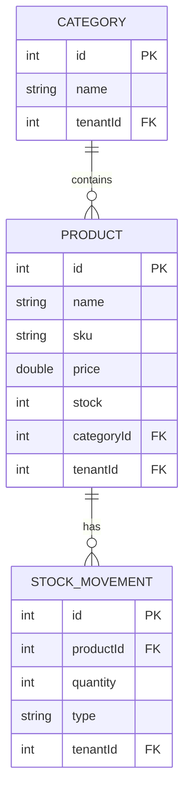
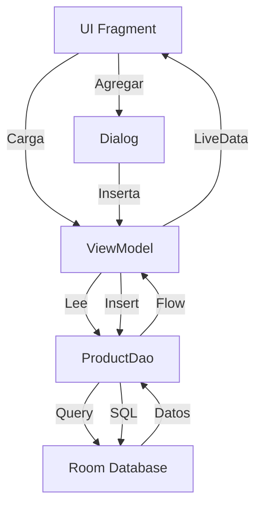
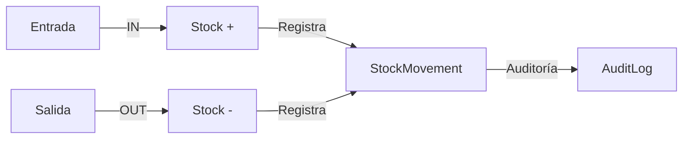
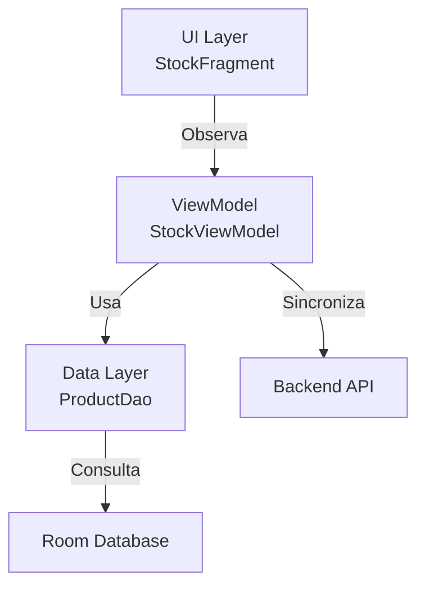

# 📱 Clase 09: Gestión de Stock y Categorías

**Duración:** 4 horas  
**Objetivo:** Implementar CRUD de productos, categorías y movimientos de stock  
**Proyecto:** Core features del Stock Management System

---

## 📚 Contenido

### 1. Modelos de Stock

**Entidades:**

```kotlin
@Entity(tableName = "products")
data class Product(
    @PrimaryKey(autoGenerate = true)
    val id: Int = 0,
    val name: String,
    val sku: String,
    val price: Double,
    val stock: Int,
    val categoryId: Int,
    val tenantId: Int,
    @ColumnInfo(name = "created_at")
    val createdAt: Long = System.currentTimeMillis()
)

@Entity(tableName = "categories")
data class Category(
    @PrimaryKey(autoGenerate = true)
    val id: Int = 0,
    val name: String,
    val tenantId: Int
)

@Entity(tableName = "stock_movements")
data class StockMovement(
    @PrimaryKey(autoGenerate = true)
    val id: Int = 0,
    val productId: Int,
    val quantity: Int,
    val type: String,
    val reason: String,
    val tenantId: Int,
    @ColumnInfo(name = "created_at")
    val createdAt: Long = System.currentTimeMillis()
)
```

### 2. DAOs

```kotlin
@Dao
interface ProductDao {
    @Insert
    suspend fun insert(product: Product): Long
    
    @Update
    suspend fun update(product: Product)
    
    @Delete
    suspend fun delete(product: Product)
    
    @Query("SELECT * FROM products WHERE tenantId = :tenantId ORDER BY name")
    fun getByTenant(tenantId: Int): Flow<List<Product>>
    
    @Query("SELECT * FROM products WHERE id = :id AND tenantId = :tenantId")
    suspend fun getById(id: Int, tenantId: Int): Product?
    
    @Query("SELECT * FROM products WHERE categoryId = :categoryId AND tenantId = :tenantId")
    fun getByCategory(categoryId: Int, tenantId: Int): Flow<List<Product>>
    
    @Query("SELECT * FROM products WHERE stock < :minStock AND tenantId = :tenantId")
    fun getLowStock(minStock: Int, tenantId: Int): Flow<List<Product>>
}

@Dao
interface CategoryDao {
    @Insert
    suspend fun insert(category: Category): Long
    
    @Query("SELECT * FROM categories WHERE tenantId = :tenantId ORDER BY name")
    fun getByTenant(tenantId: Int): Flow<List<Category>>
}

@Dao
interface StockMovementDao {
    @Insert
    suspend fun insert(movement: StockMovement): Long
    
    @Query("SELECT * FROM stock_movements WHERE productId = :productId AND tenantId = :tenantId ORDER BY created_at DESC")
    fun getByProduct(productId: Int, tenantId: Int): Flow<List<StockMovement>>
}
```

### 3. Backend Endpoints

```typescript
router.get('/products', tenantMiddleware, async (req: TenantRequest, res) => {
  const products = await prisma.product.findMany({
    where: { tenantId: req.tenantId },
    include: { category: true }
  });
  res.json(products);
});

router.post('/products', tenantMiddleware, authorize('create_product'),
  async (req: TenantRequest, res) => {
    const { name, sku, price, stock, categoryId } = req.body;
    
    const product = await prisma.product.create({
      data: { name, sku, price, stock, categoryId, tenantId: req.tenantId! }
    });
    
    res.json(product);
  }
);

router.put('/products/:id', tenantMiddleware, authorize('edit_product'),
  async (req: TenantRequest, res) => {
    const { id } = req.params;
    const { name, sku, price, stock, categoryId } = req.body;
    
    const product = await prisma.product.update({
      where: { id: parseInt(id) },
      data: { name, sku, price, stock, categoryId }
    });
    
    res.json(product);
  }
);

router.delete('/products/:id', tenantMiddleware, authorize('delete_product'),
  async (req: TenantRequest, res) => {
    const { id } = req.params;
    
    await prisma.product.delete({
      where: { id: parseInt(id) }
    });
    
    res.json({ success: true });
  }
);

router.post('/stock-movements', tenantMiddleware,
  async (req: TenantRequest, res) => {
    const { productId, quantity, type, reason } = req.body;
    
    const movement = await prisma.stockMovement.create({
      data: { productId, quantity, type, reason, tenantId: req.tenantId! }
    });
    
    if (type === 'IN') {
      await prisma.product.update({
        where: { id: productId },
        data: { stock: { increment: quantity } }
      });
    } else if (type === 'OUT') {
      await prisma.product.update({
        where: { id: productId },
        data: { stock: { decrement: quantity } }
      });
    }
    
    res.json(movement);
  }
);
```

### 4. ViewModel

```kotlin
class StockViewModel(
    private val productDao: ProductDao,
    private val categoryDao: CategoryDao,
    private val movementDao: StockMovementDao,
    private val tenantManager: TenantManager
) : ViewModel() {
    
    val products = MutableLiveData<List<Product>>()
    val categories = MutableLiveData<List<Category>>()
    val isLoading = MutableLiveData(false)
    val error = MutableLiveData<String?>()
    
    fun loadProducts() = viewModelScope.launch {
        isLoading.value = true
        try {
            val tenantId = tenantManager.getTenantId()
            productDao.getByTenant(tenantId).collect { list ->
                products.value = list
            }
        } catch (e: Exception) {
            error.value = e.message
        } finally {
            isLoading.value = false
        }
    }
    
    fun loadCategories() = viewModelScope.launch {
        try {
            val tenantId = tenantManager.getTenantId()
            categoryDao.getByTenant(tenantId).collect { list ->
                categories.value = list
            }
        } catch (e: Exception) {
            error.value = e.message
        }
    }
    
    fun addProduct(product: Product) = viewModelScope.launch {
        try {
            productDao.insert(product)
            loadProducts()
        } catch (e: Exception) {
            error.value = e.message
        }
    }
    
    fun updateProduct(product: Product) = viewModelScope.launch {
        try {
            productDao.update(product)
            loadProducts()
        } catch (e: Exception) {
            error.value = e.message
        }
    }
    
    fun deleteProduct(product: Product) = viewModelScope.launch {
        try {
            productDao.delete(product)
            loadProducts()
        } catch (e: Exception) {
            error.value = e.message
        }
    }
}
```

### 5. UI Fragment

```kotlin
class StockFragment : Fragment() {
    
    private lateinit var binding: FragmentStockBinding
    private lateinit var viewModel: StockViewModel
    private lateinit var adapter: ProductAdapter
    
    override fun onCreateView(
        inflater: LayoutInflater,
        container: ViewGroup?,
        savedInstanceState: Bundle?
    ) = FragmentStockBinding.inflate(inflater, container, false).also {
        binding = it
    }.root
    
    override fun onViewCreated(view: View, savedInstanceState: Bundle?) {
        super.onViewCreated(view, savedInstanceState)
        
        viewModel = ViewModelProvider(this).get(StockViewModel::class.java)
        adapter = ProductAdapter()
        
        binding.productsList.apply {
            layoutManager = LinearLayoutManager(requireContext())
            adapter = this@StockFragment.adapter
        }
        
        binding.addButton.setOnClickListener {
            showAddProductDialog()
        }
        
        viewModel.products.observe(viewLifecycleOwner) { products ->
            adapter.submitList(products)
        }
        
        viewModel.loadProducts()
        viewModel.loadCategories()
    }
    
    private fun showAddProductDialog() {
        // Dialog para agregar producto
    }
}
```

---

## 🎯 Ejercicio Práctico

### Objetivo
Implementar CRUD completo de productos con categorías y movimientos de stock.

### Paso 1: Crear DAOs

Crear `android/app/src/main/java/com/stockmanagement/data/dao/StockDao.kt`:

```kotlin
package com.stockmanagement.data.dao

import androidx.room.*
import com.stockmanagement.data.entities.Product
import com.stockmanagement.data.entities.Category
import com.stockmanagement.data.entities.StockMovement
import kotlinx.coroutines.flow.Flow

@Dao
interface ProductDao {
    @Insert
    suspend fun insert(product: Product): Long
    
    @Update
    suspend fun update(product: Product)
    
    @Delete
    suspend fun delete(product: Product)
    
    @Query("SELECT * FROM products WHERE tenantId = :tenantId ORDER BY name")
    fun getByTenant(tenantId: Int): Flow<List<Product>>
    
    @Query("SELECT * FROM products WHERE id = :id AND tenantId = :tenantId")
    suspend fun getById(id: Int, tenantId: Int): Product?
}

@Dao
interface CategoryDao {
    @Insert
    suspend fun insert(category: Category): Long
    
    @Query("SELECT * FROM categories WHERE tenantId = :tenantId ORDER BY name")
    fun getByTenant(tenantId: Int): Flow<List<Category>>
}

@Dao
interface StockMovementDao {
    @Insert
    suspend fun insert(movement: StockMovement): Long
    
    @Query("SELECT * FROM stock_movements WHERE productId = :productId AND tenantId = :tenantId ORDER BY created_at DESC")
    fun getByProduct(productId: Int, tenantId: Int): Flow<List<StockMovement>>
}
```

### Paso 2: Crear ViewModel

Crear `android/app/src/main/java/com/stockmanagement/ui/stock/StockViewModel.kt`:

```kotlin
package com.stockmanagement.ui.stock

import androidx.lifecycle.ViewModel
import androidx.lifecycle.viewModelScope
import androidx.lifecycle.MutableLiveData
import com.stockmanagement.data.dao.ProductDao
import com.stockmanagement.data.dao.CategoryDao
import com.stockmanagement.data.entities.Product
import com.stockmanagement.data.security.TenantManager
import kotlinx.coroutines.launch

class StockViewModel(
    private val productDao: ProductDao,
    private val categoryDao: CategoryDao,
    private val tenantManager: TenantManager
) : ViewModel() {
    
    val products = MutableLiveData<List<Product>>()
    val isLoading = MutableLiveData(false)
    val error = MutableLiveData<String?>()
    
    fun loadProducts() = viewModelScope.launch {
        isLoading.value = true
        try {
            val tenantId = tenantManager.getTenantId()
            productDao.getByTenant(tenantId).collect { list ->
                products.value = list
            }
        } catch (e: Exception) {
            error.value = e.message
        } finally {
            isLoading.value = false
        }
    }
    
    fun addProduct(product: Product) = viewModelScope.launch {
        try {
            productDao.insert(product)
            loadProducts()
        } catch (e: Exception) {
            error.value = e.message
        }
    }
}
```

### Paso 3: Crear Backend Endpoints

Crear `backend/src/routes/stock.ts`:

```typescript
import express from 'express';
import { PrismaClient } from '@prisma/client';
import { tenantMiddleware } from '../middleware/tenant';
import { authorize } from '../middleware/authorize';

const router = express.Router();
const prisma = new PrismaClient();

interface TenantRequest extends express.Request {
  tenantId?: number;
}

router.get('/products', tenantMiddleware,
  async (req: TenantRequest, res) => {
    const products = await prisma.product.findMany({
      where: { tenantId: req.tenantId },
      include: { category: true }
    });
    res.json(products);
  }
);

router.post('/products', tenantMiddleware, authorize('create_product'),
  async (req: TenantRequest, res) => {
    const { name, sku, price, stock, categoryId } = req.body;
    
    const product = await prisma.product.create({
      data: { name, sku, price, stock, categoryId, tenantId: req.tenantId! }
    });
    
    res.json(product);
  }
);

export default router;
```

### Paso 4: Crear Fragment UI

Crear `android/app/src/main/java/com/stockmanagement/ui/stock/StockFragment.kt`:

```kotlin
package com.stockmanagement.ui.stock

import android.os.Bundle
import android.view.LayoutInflater
import android.view.View
import android.view.ViewGroup
import androidx.fragment.app.Fragment
import androidx.lifecycle.ViewModelProvider
import androidx.recyclerview.widget.LinearLayoutManager
import com.stockmanagement.databinding.FragmentStockBinding

class StockFragment : Fragment() {
    
    private lateinit var binding: FragmentStockBinding
    private lateinit var viewModel: StockViewModel
    
    override fun onCreateView(
        inflater: LayoutInflater,
        container: ViewGroup?,
        savedInstanceState: Bundle?
    ) = FragmentStockBinding.inflate(inflater, container, false).also {
        binding = it
    }.root
    
    override fun onViewCreated(view: View, savedInstanceState: Bundle?) {
        super.onViewCreated(view, savedInstanceState)
        
        viewModel = ViewModelProvider(this).get(StockViewModel::class.java)
        
        binding.productsList.layoutManager = LinearLayoutManager(requireContext())
        
        viewModel.products.observe(viewLifecycleOwner) { products ->
            // Actualizar lista
        }
        
        viewModel.loadProducts()
    }
}
```

### Paso 5: Verificar Integración

Ejecutar en terminal:
```bash
cd /home/apastorini/utu
./gradlew build
```

---

## 📊 Diagramas

### Diagrama 1: Modelo de Stock



### Diagrama 2: Flujo CRUD



### Diagrama 3: Movimientos de Stock



### Diagrama 4: Arquitectura de Stock



---

## 📝 Resumen

- ✅ Modelos de Product, Category, StockMovement
- ✅ DAOs con queries filtradas por tenant
- ✅ Backend endpoints con autorización
- ✅ ViewModel para gestión de estado
- ✅ UI Fragment para mostrar productos
- ✅ Movimientos de stock automáticos

---

## 🎓 Preguntas de Repaso

**P1:** ¿Cómo se filtra el stock por tenant?

**R1:** Todas las queries incluyen `WHERE tenantId = :tenantId`. El tenantId viene del TenantManager.

**P2:** ¿Qué pasa cuando se agrega un movimiento de stock?

**R2:** Se crea el registro en stock_movements y se actualiza automáticamente el stock del producto (+ o -).

**P3:** ¿Cómo se sincroniza con el backend?

**R3:** El ViewModel llama a la API cuando hay cambios. La API valida permisos y actualiza la BD.

**P4:** ¿Qué es un SKU?

**R4:** Stock Keeping Unit. Código único para identificar un producto.

**P5:** ¿Cómo se manejan las categorías?

**R5:** Son entidades separadas con relación 1-a-muchos con productos. Se cargan en el ViewModel.

---

## 🚀 Próxima Clase

**Clase 10: CRUD Avanzado y Validaciones**

Implementaremos validaciones, paginación, filtros y búsqueda.

---

**Última actualización:** 2024  
**Tiempo estimado:** 4 horas  
**Complejidad:** ⭐⭐⭐ (Intermedia)
