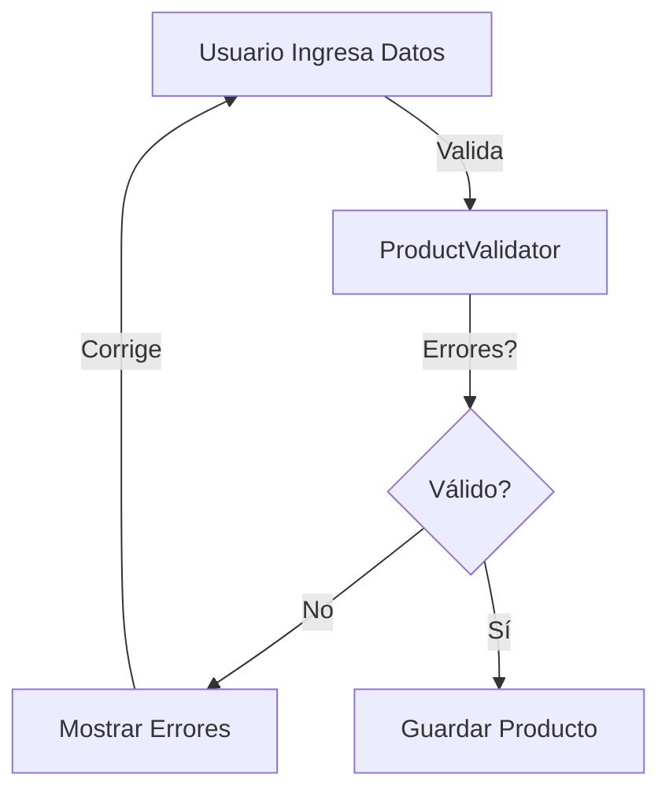
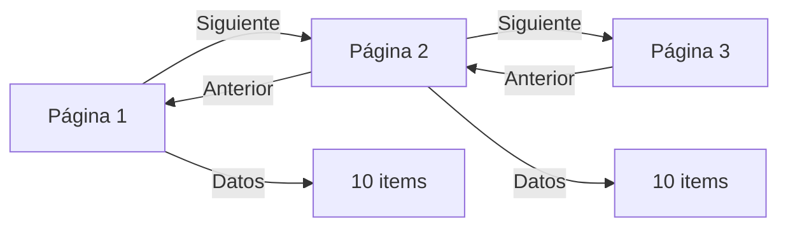
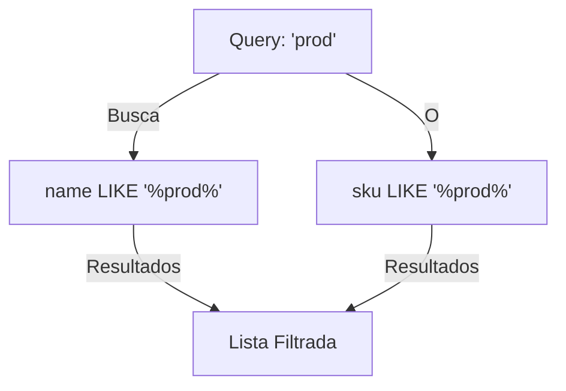
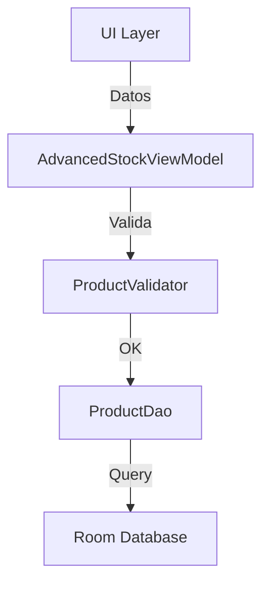

# 📱 Clase 10: CRUD Avanzado y Validaciones

**Duración:** 4 horas  
**Objetivo:** Implementar validaciones, paginación, filtros y búsqueda en CRUD  
**Proyecto:** Mejorar gestión de stock con features avanzadas

---

## 📚 Contenido

### 1. Validaciones

**Validadores en Kotlin:**

```kotlin
object ProductValidator {
    fun validate(product: Product): List<String> {
        val errors = mutableListOf<String>()
        
        if (product.name.isBlank()) errors.add("Nombre requerido")
        if (product.name.length < 3) errors.add("Nombre mínimo 3 caracteres")
        if (product.sku.isBlank()) errors.add("SKU requerido")
        if (product.price <= 0) errors.add("Precio debe ser mayor a 0")
        if (product.stock < 0) errors.add("Stock no puede ser negativo")
        
        return errors
    }
}
```

**Validadores en Backend:**

```typescript
export const validateProduct = (data: any) => {
  const errors: string[] = [];
  
  if (!data.name || data.name.trim().length < 3) {
    errors.push("Nombre mínimo 3 caracteres");
  }
  if (!data.sku || data.sku.trim().length === 0) {
    errors.push("SKU requerido");
  }
  if (data.price <= 0) {
    errors.push("Precio debe ser mayor a 0");
  }
  if (data.stock < 0) {
    errors.push("Stock no puede ser negativo");
  }
  
  return errors;
};

router.post('/products', tenantMiddleware, (req: TenantRequest, res) => {
  const errors = validateProduct(req.body);
  if (errors.length > 0) {
    return res.status(400).json({ errors });
  }
  // Crear producto
});
```

### 2. Paginación

**Backend con Prisma:**

```typescript
router.get('/products', tenantMiddleware, async (req: TenantRequest, res) => {
  const page = parseInt(req.query.page as string) || 1;
  const limit = parseInt(req.query.limit as string) || 10;
  const skip = (page - 1) * limit;
  
  const [products, total] = await Promise.all([
    prisma.product.findMany({
      where: { tenantId: req.tenantId },
      skip,
      take: limit,
      orderBy: { name: 'asc' }
    }),
    prisma.product.count({
      where: { tenantId: req.tenantId }
    })
  ]);
  
  res.json({
    data: products,
    pagination: {
      page,
      limit,
      total,
      pages: Math.ceil(total / limit)
    }
  });
});
```

**Android con Room:**

```kotlin
@Dao
interface ProductDao {
    @Query("""
        SELECT * FROM products 
        WHERE tenantId = :tenantId 
        ORDER BY name ASC 
        LIMIT :limit OFFSET :offset
    """)
    suspend fun getPaginated(
        tenantId: Int,
        limit: Int,
        offset: Int
    ): List<Product>
    
    @Query("SELECT COUNT(*) FROM products WHERE tenantId = :tenantId")
    suspend fun getCount(tenantId: Int): Int
}
```

### 3. Filtros

**Backend:**

```typescript
router.get('/products/filter', tenantMiddleware, async (req: TenantRequest, res) => {
  const { categoryId, minPrice, maxPrice, minStock } = req.query;
  
  const where: any = { tenantId: req.tenantId };
  
  if (categoryId) where.categoryId = parseInt(categoryId as string);
  if (minPrice || maxPrice) {
    where.price = {};
    if (minPrice) where.price.gte = parseFloat(minPrice as string);
    if (maxPrice) where.price.lte = parseFloat(maxPrice as string);
  }
  if (minStock) where.stock = { gte: parseInt(minStock as string) };
  
  const products = await prisma.product.findMany({ where });
  res.json(products);
});
```

**Android:**

```kotlin
@Dao
interface ProductDao {
    @Query("""
        SELECT * FROM products 
        WHERE tenantId = :tenantId 
        AND (:categoryId IS NULL OR categoryId = :categoryId)
        AND (:minPrice IS NULL OR price >= :minPrice)
        AND (:maxPrice IS NULL OR price <= :maxPrice)
        ORDER BY name ASC
    """)
    fun getFiltered(
        tenantId: Int,
        categoryId: Int?,
        minPrice: Double?,
        maxPrice: Double?
    ): Flow<List<Product>>
}
```

### 4. Búsqueda

**Backend:**

```typescript
router.get('/products/search', tenantMiddleware, async (req: TenantRequest, res) => {
  const { q } = req.query;
  
  if (!q || q.toString().length < 2) {
    return res.status(400).json({ error: "Mínimo 2 caracteres" });
  }
  
  const products = await prisma.product.findMany({
    where: {
      tenantId: req.tenantId,
      OR: [
        { name: { contains: q as string, mode: 'insensitive' } },
        { sku: { contains: q as string, mode: 'insensitive' } }
      ]
    },
    take: 20
  });
  
  res.json(products);
});
```

**Android:**

```kotlin
@Dao
interface ProductDao {
    @Query("""
        SELECT * FROM products 
        WHERE tenantId = :tenantId 
        AND (name LIKE '%' || :query || '%' OR sku LIKE '%' || :query || '%')
        LIMIT 20
    """)
    fun search(tenantId: Int, query: String): Flow<List<Product>>
}
```

### 5. ViewModel Avanzado

```kotlin
class AdvancedStockViewModel(
    private val productDao: ProductDao,
    private val tenantManager: TenantManager
) : ViewModel() {
    
    val products = MutableLiveData<List<Product>>()
    val errors = MutableLiveData<List<String>>()
    val isLoading = MutableLiveData(false)
    
    private var currentPage = 1
    private val pageSize = 10
    
    fun loadProducts(page: Int = 1) = viewModelScope.launch {
        isLoading.value = true
        try {
            val tenantId = tenantManager.getTenantId()
            val offset = (page - 1) * pageSize
            val list = productDao.getPaginated(tenantId, pageSize, offset)
            products.value = list
            currentPage = page
        } catch (e: Exception) {
            errors.value = listOf(e.message ?: "Error")
        } finally {
            isLoading.value = false
        }
    }
    
    fun search(query: String) = viewModelScope.launch {
        if (query.length < 2) {
            errors.value = listOf("Mínimo 2 caracteres")
            return@launch
        }
        
        isLoading.value = true
        try {
            val tenantId = tenantManager.getTenantId()
            productDao.search(tenantId, query).collect { list ->
                products.value = list
            }
        } catch (e: Exception) {
            errors.value = listOf(e.message ?: "Error")
        } finally {
            isLoading.value = false
        }
    }
    
    fun addProduct(product: Product) = viewModelScope.launch {
        val validationErrors = ProductValidator.validate(product)
        if (validationErrors.isNotEmpty()) {
            errors.value = validationErrors
            return@launch
        }
        
        try {
            productDao.insert(product)
            loadProducts()
        } catch (e: Exception) {
            errors.value = listOf(e.message ?: "Error")
        }
    }
}
```

---

## 🎯 Ejercicio Práctico

### Objetivo
Implementar búsqueda, filtros, paginación y validaciones en CRUD de productos.

### Paso 1: Crear Validador

Crear `android/app/src/main/java/com/stockmanagement/data/validators/ProductValidator.kt`:

```kotlin
package com.stockmanagement.data.validators

import com.stockmanagement.data.entities.Product

object ProductValidator {
    fun validate(product: Product): List<String> {
        val errors = mutableListOf<String>()
        
        if (product.name.isBlank()) errors.add("Nombre requerido")
        if (product.name.length < 3) errors.add("Nombre mínimo 3 caracteres")
        if (product.sku.isBlank()) errors.add("SKU requerido")
        if (product.price <= 0) errors.add("Precio debe ser mayor a 0")
        if (product.stock < 0) errors.add("Stock no puede ser negativo")
        
        return errors
    }
}
```

### Paso 2: Actualizar DAO

Actualizar `android/app/src/main/java/com/stockmanagement/data/dao/ProductDao.kt`:

```kotlin
@Dao
interface ProductDao {
    @Query("""
        SELECT * FROM products 
        WHERE tenantId = :tenantId 
        ORDER BY name ASC 
        LIMIT :limit OFFSET :offset
    """)
    suspend fun getPaginated(
        tenantId: Int,
        limit: Int,
        offset: Int
    ): List<Product>
    
    @Query("SELECT COUNT(*) FROM products WHERE tenantId = :tenantId")
    suspend fun getCount(tenantId: Int): Int
    
    @Query("""
        SELECT * FROM products 
        WHERE tenantId = :tenantId 
        AND (name LIKE '%' || :query || '%' OR sku LIKE '%' || :query || '%')
        LIMIT 20
    """)
    fun search(tenantId: Int, query: String): Flow<List<Product>>
}
```

### Paso 3: Crear Backend Endpoints

Crear `backend/src/routes/products-advanced.ts`:

```typescript
import express from 'express';
import { PrismaClient } from '@prisma/client';
import { tenantMiddleware } from '../middleware/tenant';

const router = express.Router();
const prisma = new PrismaClient();

interface TenantRequest extends express.Request {
  tenantId?: number;
}

router.get('/products', tenantMiddleware, async (req: TenantRequest, res) => {
  const page = parseInt(req.query.page as string) || 1;
  const limit = parseInt(req.query.limit as string) || 10;
  const skip = (page - 1) * limit;
  
  const [products, total] = await Promise.all([
    prisma.product.findMany({
      where: { tenantId: req.tenantId },
      skip,
      take: limit,
      orderBy: { name: 'asc' }
    }),
    prisma.product.count({ where: { tenantId: req.tenantId } })
  ]);
  
  res.json({
    data: products,
    pagination: { page, limit, total, pages: Math.ceil(total / limit) }
  });
});

router.get('/products/search', tenantMiddleware, async (req: TenantRequest, res) => {
  const { q } = req.query;
  
  if (!q || q.toString().length < 2) {
    return res.status(400).json({ error: "Mínimo 2 caracteres" });
  }
  
  const products = await prisma.product.findMany({
    where: {
      tenantId: req.tenantId,
      OR: [
        { name: { contains: q as string, mode: 'insensitive' } },
        { sku: { contains: q as string, mode: 'insensitive' } }
      ]
    },
    take: 20
  });
  
  res.json(products);
});

export default router;
```

### Paso 4: Crear ViewModel Avanzado

Crear `android/app/src/main/java/com/stockmanagement/ui/stock/AdvancedStockViewModel.kt`:

```kotlin
package com.stockmanagement.ui.stock

import androidx.lifecycle.ViewModel
import androidx.lifecycle.viewModelScope
import androidx.lifecycle.MutableLiveData
import com.stockmanagement.data.dao.ProductDao
import com.stockmanagement.data.entities.Product
import com.stockmanagement.data.validators.ProductValidator
import com.stockmanagement.data.security.TenantManager
import kotlinx.coroutines.launch

class AdvancedStockViewModel(
    private val productDao: ProductDao,
    private val tenantManager: TenantManager
) : ViewModel() {
    
    val products = MutableLiveData<List<Product>>()
    val errors = MutableLiveData<List<String>>()
    val isLoading = MutableLiveData(false)
    
    private var currentPage = 1
    private val pageSize = 10
    
    fun loadProducts(page: Int = 1) = viewModelScope.launch {
        isLoading.value = true
        try {
            val tenantId = tenantManager.getTenantId()
            val offset = (page - 1) * pageSize
            val list = productDao.getPaginated(tenantId, pageSize, offset)
            products.value = list
            currentPage = page
        } catch (e: Exception) {
            errors.value = listOf(e.message ?: "Error")
        } finally {
            isLoading.value = false
        }
    }
    
    fun search(query: String) = viewModelScope.launch {
        if (query.length < 2) {
            errors.value = listOf("Mínimo 2 caracteres")
            return@launch
        }
        
        isLoading.value = true
        try {
            val tenantId = tenantManager.getTenantId()
            productDao.search(tenantId, query).collect { list ->
                products.value = list
            }
        } catch (e: Exception) {
            errors.value = listOf(e.message ?: "Error")
        } finally {
            isLoading.value = false
        }
    }
    
    fun addProduct(product: Product) = viewModelScope.launch {
        val validationErrors = ProductValidator.validate(product)
        if (validationErrors.isNotEmpty()) {
            errors.value = validationErrors
            return@launch
        }
        
        try {
            productDao.insert(product)
            loadProducts()
        } catch (e: Exception) {
            errors.value = listOf(e.message ?: "Error")
        }
    }
}
```

### Paso 5: Verificar Integración

Ejecutar en terminal:
```bash
cd /home/apastorini/utu
./gradlew build
```

---

## 📊 Diagramas

### Diagrama 1: Flujo de Validación



### Diagrama 2: Paginación



### Diagrama 3: Búsqueda y Filtros



### Diagrama 4: Arquitectura CRUD Avanzado



---

## 📝 Resumen

- ✅ Validaciones en cliente y servidor
- ✅ Paginación con offset/limit
- ✅ Filtros dinámicos
- ✅ Búsqueda full-text
- ✅ Manejo de errores
- ✅ ViewModel con lógica avanzada

---

## 🎓 Preguntas de Repaso

**P1:** ¿Por qué validar en cliente y servidor?

**R1:** Cliente valida para UX inmediata. Servidor valida por seguridad (no confiar en cliente).

**P2:** ¿Cómo funciona la paginación?

**R2:** Con OFFSET y LIMIT. Página 1: OFFSET 0 LIMIT 10. Página 2: OFFSET 10 LIMIT 10.

**P3:** ¿Qué es LIKE en SQL?

**R3:** Búsqueda de patrones. `LIKE '%prod%'` encuentra "producto", "producción", etc.

**P4:** ¿Cómo manejar errores de validación?

**R4:** Retornar lista de errores. Mostrar en UI. Permitir corrección.

**P5:** ¿Qué es Flow en Kotlin?

**R5:** Stream reactivo. Emite valores cuando cambian. Perfecto para búsquedas en tiempo real.

---

## 🚀 Próxima Clase

**Clase 11: OCR y Lectura de Boletas**

Implementaremos captura de fotos y extracción de datos con OCR.

---

**Última actualización:** 2024  
**Tiempo estimado:** 4 horas  
**Complejidad:** ⭐⭐⭐⭐ (Avanzada)
