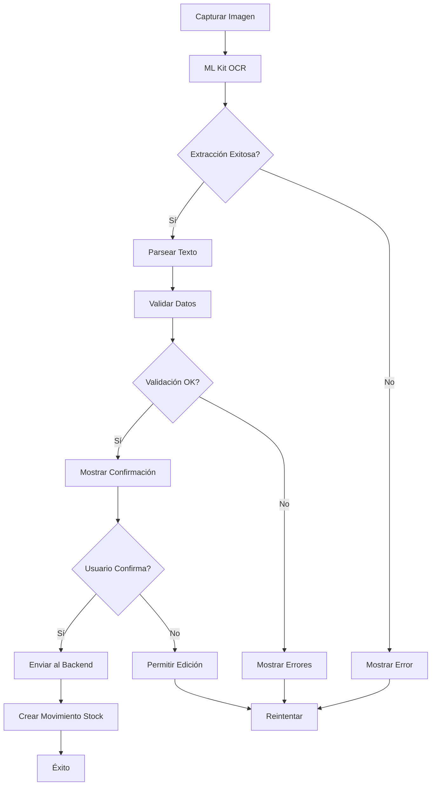
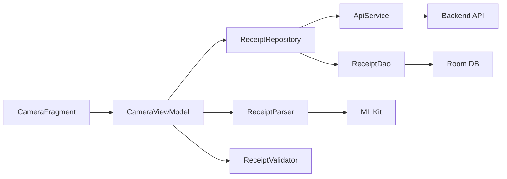
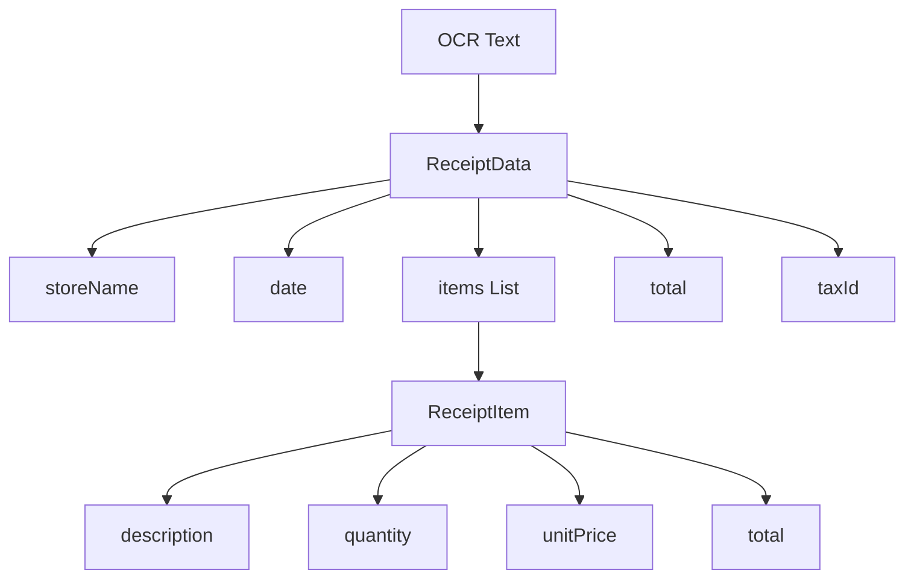
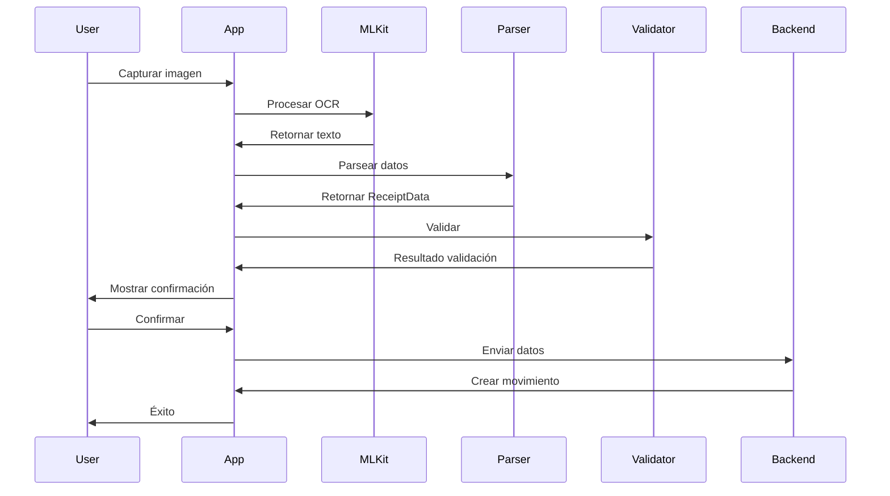

# 📱 Clase 11: OCR y Lectura de Boletas

**Duración:** 4 horas  
**Objetivo:** Integrar OCR (Optical Character Recognition) para automatizar la lectura de boletas y facturas en la app de stock  
**Proyecto:** Módulo de captura de documentos con extracción automática de datos

---

## 📚 Contenido

### 1. Fundamentos de OCR

OCR (Optical Character Recognition) es la tecnología que permite convertir imágenes de documentos en texto editable. En una app de stock, es crucial para:

- **Automatizar entrada de datos:** Capturar boletas/facturas sin tipeo manual
- **Reducir errores:** Minimizar errores de transcripción
- **Acelerar procesos:** Procesar múltiples documentos rápidamente
- **Mejorar UX:** Experiencia más fluida para usuarios

**Opciones en Android:**

1. **ML Kit (Google):** Gratuito, integrado, buena precisión
2. **Tesseract:** Open source, más control, requiere setup
3. **AWS Textract:** Cloud, muy preciso, costo por uso
4. **Azure Computer Vision:** Cloud, enterprise

Para este curso usaremos **ML Kit** por ser gratuito y estar integrado en Google Play Services.

```kotlin
// Dependencias en build.gradle.kts
dependencies {
    implementation("com.google.mlkit:text-recognition:16.0.0")
    implementation("androidx.camera:camera-core:1.3.0")
    implementation("androidx.camera:camera-camera2:1.3.0")
    implementation("androidx.camera:camera-lifecycle:1.3.0")
}
```

### 2. Captura de Imágenes con CameraX

CameraX es la librería moderna de Android para captura de cámara. Proporciona una API consistente y maneja complejidades de diferentes dispositivos.

```kotlin
// CameraViewModel.kt
class CameraViewModel : ViewModel() {
    private val _imageCapture = MutableLiveData<Bitmap>()
    val imageCapture: LiveData<Bitmap> = _imageCapture

    private val _ocrResult = MutableLiveData<String>()
    val ocrResult: LiveData<String> = _ocrResult

    fun captureImage(bitmap: Bitmap) {
        _imageCapture.value = bitmap
        performOCR(bitmap)
    }

    private fun performOCR(bitmap: Bitmap) {
        val recognizer = TextRecognition.getClient(TextRecognizerOptions.DEFAULT_OPTIONS)
        val image = InputImage.fromBitmap(bitmap, 0)

        recognizer.process(image)
            .addOnSuccessListener { visionText ->
                _ocrResult.value = visionText.text
            }
            .addOnFailureListener { e ->
                Log.e("OCR", "Error: ${e.message}")
            }
    }
}
```

### 3. Parsing de Boletas

Una vez extraído el texto, necesitamos parsearlo para obtener datos estructurados:

```kotlin
// ReceiptParser.kt
data class ReceiptData(
    val storeName: String,
    val date: LocalDate,
    val items: List<ReceiptItem>,
    val total: BigDecimal,
    val taxId: String? = null
)

data class ReceiptItem(
    val description: String,
    val quantity: Int,
    val unitPrice: BigDecimal,
    val total: BigDecimal
)

class ReceiptParser {
    fun parse(ocrText: String): ReceiptData? {
        return try {
            val lines = ocrText.split("\n").map { it.trim() }
            
            val storeName = extractStoreName(lines)
            val date = extractDate(lines)
            val items = extractItems(lines)
            val total = extractTotal(lines)
            val taxId = extractTaxId(lines)

            ReceiptData(
                storeName = storeName,
                date = date,
                items = items,
                total = total,
                taxId = taxId
            )
        } catch (e: Exception) {
            Log.e("ReceiptParser", "Parse error: ${e.message}")
            null
        }
    }

    private fun extractStoreName(lines: List<String>): String {
        return lines.firstOrNull { it.length > 5 } ?: "Unknown"
    }

    private fun extractDate(lines: List<String>): LocalDate {
        val datePattern = Regex("""(\d{1,2})[/-](\d{1,2})[/-](\d{2,4})""")
        val match = lines.mapNotNull { datePattern.find(it) }.firstOrNull()
        
        return match?.let {
            val (day, month, year) = it.destructured
            LocalDate.of(
                year.toInt().let { y -> if (y < 100) 2000 + y else y },
                month.toInt(),
                day.toInt()
            )
        } ?: LocalDate.now()
    }

    private fun extractItems(lines: List<String>): List<ReceiptItem> {
        val itemPattern = Regex("""(.+?)\s+(\d+)\s+[\$\s]*(\d+[.,]\d{2})\s+[\$\s]*(\d+[.,]\d{2})""")
        
        return lines.mapNotNull { line ->
            itemPattern.find(line)?.let { match ->
                val (desc, qty, price, total) = match.destructured
                ReceiptItem(
                    description = desc.trim(),
                    quantity = qty.toInt(),
                    unitPrice = price.replace(",", ".").toBigDecimal(),
                    total = total.replace(",", ".").toBigDecimal()
                )
            }
        }
    }

    private fun extractTotal(lines: List<String>): BigDecimal {
        val totalPattern = Regex("""(?:TOTAL|TOTAL:|MONTO|MONTO:)\s*[\$\s]*(\d+[.,]\d{2})""", RegexOption.IGNORE_CASE)
        
        return lines.mapNotNull { line ->
            totalPattern.find(line)?.groupValues?.get(1)
        }.lastOrNull()?.replace(",", ".")?.toBigDecimal() ?: BigDecimal.ZERO
    }

    private fun extractTaxId(lines: List<String>): String? {
        val taxPattern = Regex("""(?:CUIT|RUT|RFC|NIT)[\s:]*(\d+[-\s]?\d+[-\s]?\d+)""", RegexOption.IGNORE_CASE)
        
        return lines.mapNotNull { line ->
            taxPattern.find(line)?.groupValues?.get(1)
        }.firstOrNull()
    }
}
```

### 4. Integración con Backend

El backend debe validar y procesar los datos extraídos:

```typescript
// backend/src/routes/receipts.ts
import express from 'express';
import { PrismaClient } from '@prisma/client';

const router = express.Router();
const prisma = new PrismaClient();

interface ReceiptPayload {
    storeName: string;
    date: string;
    items: Array<{
        description: string;
        quantity: number;
        unitPrice: number;
        total: number;
    }>;
    total: number;
    taxId?: string;
}

router.post('/receipts/process', async (req, res) => {
    try {
        const { storeName, date, items, total, taxId } = req.body as ReceiptPayload;
        const tenantId = req.headers['x-tenant-id'] as string;

        // Validar datos
        if (!storeName || !date || items.length === 0) {
            return res.status(400).json({ error: 'Invalid receipt data' });
        }

        // Crear proveedor si no existe
        let supplier = await prisma.supplier.findFirst({
            where: {
                name: storeName,
                tenantId
            }
        });

        if (!supplier) {
            supplier = await prisma.supplier.create({
                data: {
                    name: storeName,
                    taxId: taxId || null,
                    tenantId
                }
            });
        }

        // Crear movimiento de stock
        const stockMovement = await prisma.stockMovement.create({
            data: {
                type: 'PURCHASE',
                date: new Date(date),
                supplierId: supplier.id,
                tenantId,
                items: {
                    create: items.map(item => ({
                        productId: null, // Se asignará manualmente
                        quantity: item.quantity,
                        unitPrice: item.unitPrice,
                        description: item.description,
                        tenantId
                    }))
                }
            },
            include: { items: true }
        });

        res.json({
            success: true,
            movementId: stockMovement.id,
            itemsCount: items.length,
            total
        });
    } catch (error) {
        console.error('Receipt processing error:', error);
        res.status(500).json({ error: 'Processing failed' });
    }
});

export default router;
```

### 5. UI para Captura y Confirmación

```kotlin
// CameraFragment.kt
class CameraFragment : Fragment() {
    private lateinit var viewModel: CameraViewModel
    private lateinit var cameraProvider: ProcessCameraProvider
    private lateinit var imageCapture: ImageCapture

    override fun onViewCreated(view: View, savedInstanceState: Bundle?) {
        super.onViewCreated(view, savedInstanceState)
        viewModel = ViewModelProvider(this).get(CameraViewModel::class.java)

        startCamera()
        setupObservers()
    }

    private fun startCamera() {
        val cameraProviderFuture = ProcessCameraProvider.getInstance(requireContext())

        cameraProviderFuture.addListener({
            cameraProvider = cameraProviderFuture.result

            val preview = Preview.Builder().build().also {
                it.setSurfaceProvider(binding.previewView.surfaceProvider)
            }

            imageCapture = ImageCapture.Builder().build()

            val cameraSelector = CameraSelector.DEFAULT_BACK_CAMERA

            try {
                cameraProvider.unbindAll()
                cameraProvider.bindToLifecycle(
                    this, cameraSelector, preview, imageCapture
                )
            } catch (exc: Exception) {
                Log.e("CameraX", "Use case binding failed", exc)
            }
        }, ContextCompat.getMainExecutor(requireContext()))
    }

    private fun captureImage() {
        val outputOptions = ImageCapture.OutputFileOptions.Builder(
            File(requireContext().cacheDir, "receipt_${System.currentTimeMillis()}.jpg")
        ).build()

        imageCapture.takePicture(
            outputOptions,
            ContextCompat.getMainExecutor(requireContext()),
            object : ImageCapture.OnImageSavedCallback {
                override fun onImageSaved(output: ImageCapture.OutputFileResults) {
                    val bitmap = BitmapFactory.decodeFile(output.savedUri?.path)
                    viewModel.captureImage(bitmap)
                }

                override fun onError(exc: ImageCaptureException) {
                    Log.e("CameraX", "Photo capture failed: ${exc.message}", exc)
                }
            }
        )
    }

    private fun setupObservers() {
        viewModel.ocrResult.observe(viewLifecycleOwner) { text ->
            showConfirmationDialog(text)
        }
    }

    private fun showConfirmationDialog(ocrText: String) {
        val parser = ReceiptParser()
        val receiptData = parser.parse(ocrText)

        if (receiptData != null) {
            ReceiptConfirmationDialog(receiptData) { confirmed ->
                if (confirmed) {
                    uploadReceipt(receiptData)
                }
            }.show(parentFragmentManager, "receipt_confirmation")
        }
    }

    private fun uploadReceipt(data: ReceiptData) {
        val payload = mapOf(
            "storeName" to data.storeName,
            "date" to data.date.toString(),
            "items" to data.items.map {
                mapOf(
                    "description" to it.description,
                    "quantity" to it.quantity,
                    "unitPrice" to it.unitPrice,
                    "total" to it.total
                )
            },
            "total" to data.total,
            "taxId" to data.taxId
        )

        viewModel.uploadReceipt(payload)
    }
}
```

### 6. Manejo de Errores y Validación

```kotlin
// ReceiptValidator.kt
class ReceiptValidator {
    fun validate(data: ReceiptData): ValidationResult {
        val errors = mutableListOf<String>()

        if (data.storeName.isBlank()) {
            errors.add("Store name is required")
        }

        if (data.items.isEmpty()) {
            errors.add("Receipt must have at least one item")
        }

        if (data.total <= BigDecimal.ZERO) {
            errors.add("Total must be greater than zero")
        }

        // Validar suma de items
        val itemsTotal = data.items.sumOf { it.total }
        if ((itemsTotal - data.total).abs() > BigDecimal("0.50")) {
            errors.add("Total doesn't match sum of items")
        }

        // Validar cantidades
        data.items.forEach { item ->
            if (item.quantity <= 0) {
                errors.add("Invalid quantity for ${item.description}")
            }
            if (item.unitPrice <= BigDecimal.ZERO) {
                errors.add("Invalid price for ${item.description}")
            }
        }

        return ValidationResult(
            isValid = errors.isEmpty(),
            errors = errors
        )
    }
}

data class ValidationResult(
    val isValid: Boolean,
    val errors: List<String>
)
```

---

## 🎯 Ejercicio Práctico

### Objetivo
Implementar un módulo completo de captura de boletas con OCR, parsing automático y validación.

### Paso 1: Configurar Dependencias

```kotlin
// build.gradle.kts
dependencies {
    // ML Kit
    implementation("com.google.mlkit:text-recognition:16.0.0")
    
    // CameraX
    implementation("androidx.camera:camera-core:1.3.0")
    implementation("androidx.camera:camera-camera2:1.3.0")
    implementation("androidx.camera:camera-lifecycle:1.3.0")
    implementation("androidx.camera:camera-view:1.3.0")
    
    // Coroutines
    implementation("org.jetbrains.kotlinx:kotlinx-coroutines-android:1.7.1")
}
```

### Paso 2: Crear ReceiptViewModel

```kotlin
// ReceiptViewModel.kt
class ReceiptViewModel(
    private val receiptRepository: ReceiptRepository
) : ViewModel() {
    
    private val _uiState = MutableLiveData<ReceiptUiState>(ReceiptUiState.Idle)
    val uiState: LiveData<ReceiptUiState> = _uiState

    fun processReceipt(bitmap: Bitmap) {
        _uiState.value = ReceiptUiState.Processing

        viewModelScope.launch {
            try {
                val recognizer = TextRecognition.getClient(TextRecognizerOptions.DEFAULT_OPTIONS)
                val image = InputImage.fromBitmap(bitmap, 0)

                recognizer.process(image)
                    .addOnSuccessListener { visionText ->
                        val parser = ReceiptParser()
                        val receiptData = parser.parse(visionText.text)

                        if (receiptData != null) {
                            val validator = ReceiptValidator()
                            val validation = validator.validate(receiptData)

                            if (validation.isValid) {
                                _uiState.value = ReceiptUiState.Success(receiptData)
                            } else {
                                _uiState.value = ReceiptUiState.ValidationError(validation.errors)
                            }
                        } else {
                            _uiState.value = ReceiptUiState.ParseError("Could not parse receipt")
                        }
                    }
                    .addOnFailureListener { e ->
                        _uiState.value = ReceiptUiState.Error(e.message ?: "OCR failed")
                    }
            } catch (e: Exception) {
                _uiState.value = ReceiptUiState.Error(e.message ?: "Unknown error")
            }
        }
    }

    fun submitReceipt(receiptData: ReceiptData) {
        viewModelScope.launch {
            try {
                _uiState.value = ReceiptUiState.Submitting
                receiptRepository.submitReceipt(receiptData)
                _uiState.value = ReceiptUiState.Submitted
            } catch (e: Exception) {
                _uiState.value = ReceiptUiState.Error(e.message ?: "Submission failed")
            }
        }
    }
}

sealed class ReceiptUiState {
    object Idle : ReceiptUiState()
    object Processing : ReceiptUiState()
    object Submitting : ReceiptUiState()
    data class Success(val receipt: ReceiptData) : ReceiptUiState()
    data class ValidationError(val errors: List<String>) : ReceiptUiState()
    data class ParseError(val message: String) : ReceiptUiState()
    data class Error(val message: String) : ReceiptUiState()
    object Submitted : ReceiptUiState()
}
```

### Paso 3: Implementar ReceiptRepository

```kotlin
// ReceiptRepository.kt
class ReceiptRepository(
    private val apiService: ApiService,
    private val receiptDao: ReceiptDao
) {
    suspend fun submitReceipt(receiptData: ReceiptData) {
        val payload = mapOf(
            "storeName" to receiptData.storeName,
            "date" to receiptData.date.toString(),
            "items" to receiptData.items.map {
                mapOf(
                    "description" to it.description,
                    "quantity" to it.quantity,
                    "unitPrice" to it.unitPrice.toDouble(),
                    "total" to it.total.toDouble()
                )
            },
            "total" to receiptData.total.toDouble(),
            "taxId" to receiptData.taxId
        )

        val response = apiService.submitReceipt(payload)
        
        if (response.isSuccessful) {
            val receipt = Receipt(
                id = response.body()?.movementId ?: "",
                storeName = receiptData.storeName,
                date = receiptData.date,
                total = receiptData.total.toDouble(),
                itemsCount = receiptData.items.size,
                createdAt = LocalDateTime.now()
            )
            receiptDao.insert(receipt)
        } else {
            throw Exception("API error: ${response.code()}")
        }
    }
}
```

### Paso 4: Crear UI con Confirmación

```kotlin
// ReceiptConfirmationFragment.kt
class ReceiptConfirmationFragment : Fragment() {
    private lateinit var viewModel: ReceiptViewModel
    private val receiptData: ReceiptData by lazy {
        arguments?.getParcelable("receipt_data") ?: error("No receipt data")
    }

    override fun onViewCreated(view: View, savedInstanceState: Bundle?) {
        super.onViewCreated(view, savedInstanceState)
        viewModel = ViewModelProvider(this).get(ReceiptViewModel::class.java)

        displayReceiptData()
        setupListeners()
        observeState()
    }

    private fun displayReceiptData() {
        binding.apply {
            storeName.text = receiptData.storeName
            receiptDate.text = receiptData.date.toString()
            totalAmount.text = "$ ${receiptData.total}"

            itemsRecycler.adapter = ReceiptItemAdapter(receiptData.items)
        }
    }

    private fun setupListeners() {
        binding.confirmButton.setOnClickListener {
            viewModel.submitReceipt(receiptData)
        }

        binding.editButton.setOnClickListener {
            // Permitir edición manual
            showEditDialog()
        }

        binding.cancelButton.setOnClickListener {
            findNavController().popBackStack()
        }
    }

    private fun observeState() {
        viewModel.uiState.observe(viewLifecycleOwner) { state ->
            when (state) {
                is ReceiptUiState.Submitting -> {
                    binding.confirmButton.isEnabled = false
                    binding.progressBar.visibility = View.VISIBLE
                }
                is ReceiptUiState.Submitted -> {
                    Toast.makeText(requireContext(), "Receipt saved", Toast.LENGTH_SHORT).show()
                    findNavController().popBackStack()
                }
                is ReceiptUiState.Error -> {
                    binding.confirmButton.isEnabled = true
                    binding.progressBar.visibility = View.GONE
                    Toast.makeText(requireContext(), state.message, Toast.LENGTH_LONG).show()
                }
                else -> {}
            }
        }
    }

    private fun showEditDialog() {
        // Implementar diálogo de edición manual
    }
}
```

### Paso 5: Integración en Proyecto

Agregar en `navigation.xml`:

```xml
<fragment
    android:id="@+id/receiptCameraFragment"
    android:name="com.stockapp.ui.receipt.CameraFragment"
    android:label="Capture Receipt" />

<fragment
    android:id="@+id/receiptConfirmationFragment"
    android:name="com.stockapp.ui.receipt.ReceiptConfirmationFragment"
    android:label="Confirm Receipt" />
```

---

## 📊 Diagramas

### Flujo de OCR



### Arquitectura de Módulo OCR



### Estructura de Datos Extraídos



### Ciclo de Vida de Procesamiento



---

## 📝 Resumen

- ✅ OCR automatiza captura de boletas/facturas
- ✅ ML Kit proporciona reconocimiento de texto gratuito
- ✅ CameraX maneja captura moderna y consistente
- ✅ Parsing extrae datos estructurados del texto
- ✅ Validación asegura integridad de datos
- ✅ Backend procesa y crea movimientos de stock
- ✅ UI permite confirmación y edición manual

---

## 🎓 Preguntas de Repaso

**P1:** ¿Cuál es la ventaja de usar ML Kit sobre Tesseract?  
**R1:** ML Kit es gratuito, está integrado en Google Play Services, tiene mejor precisión en dispositivos modernos y no requiere descargar modelos adicionales.

**P2:** ¿Por qué es importante validar los datos extraídos?  
**R2:** Porque OCR no es 100% preciso. La validación detecta errores (suma incorrecta, cantidades negativas, etc.) antes de guardar datos inconsistentes.

**P3:** ¿Cómo se maneja la edición manual si OCR falla?  
**R3:** Se muestra un diálogo con los datos extraídos permitiendo al usuario editar campos antes de confirmar.

**P4:** ¿Qué información se extrae de una boleta?  
**R4:** Nombre de tienda, fecha, items (descripción, cantidad, precio unitario, total), total general y ID fiscal (CUIT/RUT).

**P5:** ¿Por qué se envía al backend y no se guarda localmente?  
**R5:** Para validación adicional, auditoría, multi-tenancy y sincronización con otros dispositivos del usuario.

---

## 🚀 Próxima Clase

**Clase 12: APIs Externas y Proveedores**

Integración con APIs de proveedores para consultar precios, disponibilidad y realizar pedidos automáticos.

---

**Última actualización:** 2024  
**Tiempo estimado:** 4 horas  
**Complejidad:** ⭐⭐⭐⭐ (Avanzada)
