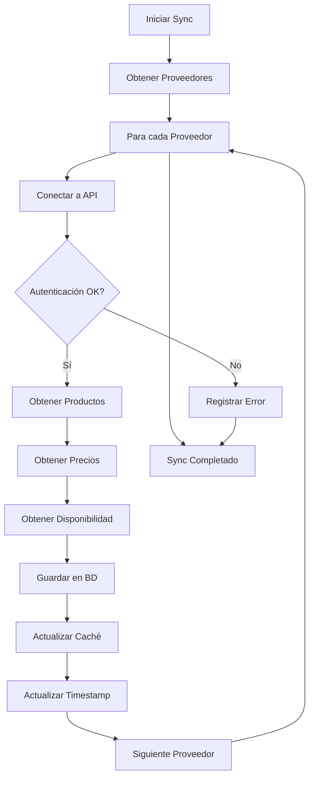
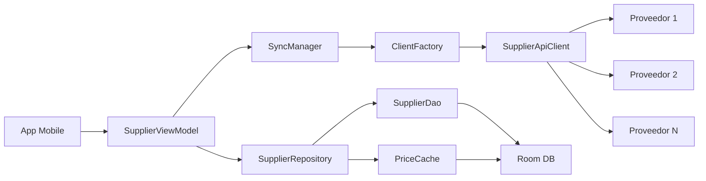
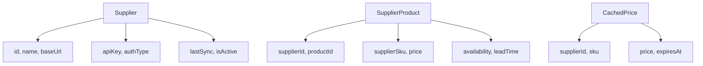
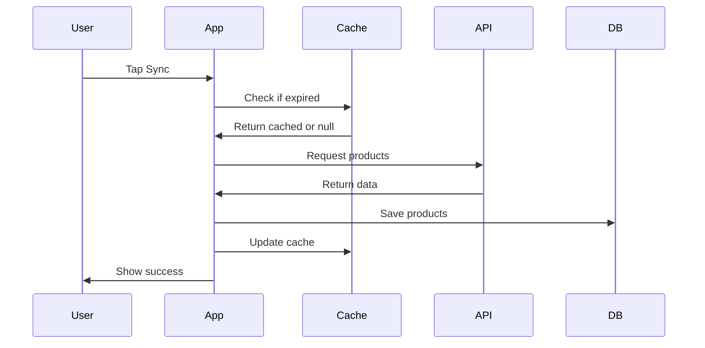

# 📱 Clase 12: APIs Externas y Proveedores

**Duración:** 4 horas  
**Objetivo:** Integrar APIs de proveedores para consultar precios, disponibilidad y realizar pedidos automáticos  
**Proyecto:** Módulo de gestión de proveedores con sincronización de precios

---

## 📚 Contenido

### 1. Gestión de Proveedores

Los proveedores son fuentes externas de productos. Necesitamos:

- **Registro de proveedores:** Nombre, URL base, credenciales
- **Configuración de APIs:** Endpoints, autenticación, formatos
- **Sincronización:** Actualizar precios y disponibilidad
- **Caché:** Evitar llamadas excesivas

```kotlin
// Supplier.kt (Room Entity)
@Entity(tableName = "suppliers")
data class Supplier(
    @PrimaryKey
    val id: String = UUID.randomUUID().toString(),
    val tenantId: String,
    val name: String,
    val baseUrl: String,
    val apiKey: String,
    val apiSecret: String? = null,
    val authType: AuthType = AuthType.API_KEY, // API_KEY, OAUTH, BASIC
    val isActive: Boolean = true,
    val lastSync: LocalDateTime? = null,
    val createdAt: LocalDateTime = LocalDateTime.now()
)

enum class AuthType {
    API_KEY, OAUTH, BASIC, BEARER
}

// SupplierProduct.kt (Producto del proveedor)
@Entity(
    tableName = "supplier_products",
    foreignKeys = [
        ForeignKey(
            entity = Supplier::class,
            parentColumns = ["id"],
            childColumns = ["supplierId"],
            onDelete = ForeignKey.CASCADE
        ),
        ForeignKey(
            entity = Product::class,
            parentColumns = ["id"],
            childColumns = ["productId"],
            onDelete = ForeignKey.CASCADE
        )
    ]
)
data class SupplierProduct(
    @PrimaryKey
    val id: String = UUID.randomUUID().toString(),
    val supplierId: String,
    val productId: String,
    val tenantId: String,
    val supplierSku: String,
    val price: BigDecimal,
    val currency: String = "USD",
    val availability: Int, // Stock disponible
    val leadTime: Int = 0, // Días para entrega
    val lastUpdated: LocalDateTime = LocalDateTime.now()
)
```

### 2. Integración de APIs

Cada proveedor tiene un formato diferente. Usamos adaptadores:

```kotlin
// SupplierApiClient.kt
interface SupplierApiClient {
    suspend fun getProducts(query: String): List<SupplierProductDto>
    suspend fun getPrice(sku: String): PriceDto
    suspend fun checkAvailability(sku: String): AvailabilityDto
    suspend fun createOrder(items: List<OrderItemDto>): OrderResponseDto
}

// Implementación para proveedor genérico
class GenericSupplierClient(
    private val baseUrl: String,
    private val apiKey: String,
    private val httpClient: HttpClient
) : SupplierApiClient {

    override suspend fun getProducts(query: String): List<SupplierProductDto> {
        return try {
            val response = httpClient.get("$baseUrl/products") {
                parameter("q", query)
                header("Authorization", "Bearer $apiKey")
            }
            response.body()
        } catch (e: Exception) {
            Log.e("SupplierClient", "Error fetching products: ${e.message}")
            emptyList()
        }
    }

    override suspend fun getPrice(sku: String): PriceDto {
        return httpClient.get("$baseUrl/prices/$sku") {
            header("Authorization", "Bearer $apiKey")
        }.body()
    }

    override suspend fun checkAvailability(sku: String): AvailabilityDto {
        return httpClient.get("$baseUrl/availability/$sku") {
            header("Authorization", "Bearer $apiKey")
        }.body()
    }

    override suspend fun createOrder(items: List<OrderItemDto>): OrderResponseDto {
        return httpClient.post("$baseUrl/orders") {
            header("Authorization", "Bearer $apiKey")
            contentType(ContentType.Application.Json)
            setBody(items)
        }.body()
    }
}

// DTOs
data class SupplierProductDto(
    val sku: String,
    val name: String,
    val price: Double,
    val currency: String,
    val availability: Int
)

data class PriceDto(
    val sku: String,
    val price: Double,
    val currency: String,
    val validUntil: LocalDateTime
)

data class AvailabilityDto(
    val sku: String,
    val available: Int,
    val leadTime: Int
)

data class OrderItemDto(
    val sku: String,
    val quantity: Int
)

data class OrderResponseDto(
    val orderId: String,
    val status: String,
    val estimatedDelivery: LocalDateTime
)
```

### 3. Caché de Precios

Evitar llamadas excesivas a APIs:

```kotlin
// PriceCache.kt
class PriceCache(
    private val cacheDao: PriceCacheDao,
    private val ttlMinutes: Int = 60
) {
    suspend fun getPrice(supplierId: String, sku: String): BigDecimal? {
        val cached = cacheDao.getPrice(supplierId, sku)
        
        return if (cached != null && !cached.isExpired()) {
            cached.price
        } else {
            null
        }
    }

    suspend fun setPrice(supplierId: String, sku: String, price: BigDecimal) {
        cacheDao.insert(
            CachedPrice(
                supplierId = supplierId,
                sku = sku,
                price = price,
                expiresAt = LocalDateTime.now().plusMinutes(ttlMinutes.toLong())
            )
        )
    }

    suspend fun invalidate(supplierId: String) {
        cacheDao.deleteBySupplier(supplierId)
    }
}

@Entity(tableName = "price_cache")
data class CachedPrice(
    @PrimaryKey(autoGenerate = true)
    val id: Long = 0,
    val supplierId: String,
    val sku: String,
    val price: BigDecimal,
    val expiresAt: LocalDateTime
) {
    fun isExpired(): Boolean = LocalDateTime.now().isAfter(expiresAt)
}

@Dao
interface PriceCacheDao {
    @Query("SELECT * FROM price_cache WHERE supplierId = :supplierId AND sku = :sku")
    suspend fun getPrice(supplierId: String, sku: String): CachedPrice?

    @Insert(onConflict = OnConflictStrategy.REPLACE)
    suspend fun insert(cache: CachedPrice)

    @Query("DELETE FROM price_cache WHERE supplierId = :supplierId")
    suspend fun deleteBySupplier(supplierId: String)

    @Query("DELETE FROM price_cache WHERE expiresAt < :now")
    suspend fun deleteExpired(now: LocalDateTime = LocalDateTime.now())
}
```

### 4. Sincronización de Precios

```kotlin
// SupplierSyncManager.kt
class SupplierSyncManager(
    private val supplierDao: SupplierDao,
    private val supplierProductDao: SupplierProductDao,
    private val priceCache: PriceCache,
    private val clientFactory: SupplierClientFactory
) {
    suspend fun syncSupplier(supplierId: String) {
        try {
            val supplier = supplierDao.getById(supplierId) ?: return
            
            val client = clientFactory.createClient(supplier)
            
            // Obtener productos del proveedor
            val products = client.getProducts("")
            
            products.forEach { product ->
                val availability = client.checkAvailability(product.sku)
                
                val supplierProduct = SupplierProduct(
                    supplierId = supplierId,
                    productId = "", // Mapear con producto local
                    tenantId = supplier.tenantId,
                    supplierSku = product.sku,
                    price = product.price.toBigDecimal(),
                    currency = product.currency,
                    availability = availability.available,
                    leadTime = availability.leadTime
                )
                
                supplierProductDao.insert(supplierProduct)
                priceCache.setPrice(supplierId, product.sku, product.price.toBigDecimal())
            }
            
            // Actualizar timestamp
            supplierDao.updateLastSync(supplierId, LocalDateTime.now())
            
        } catch (e: Exception) {
            Log.e("SyncManager", "Sync failed: ${e.message}")
        }
    }

    suspend fun syncAllSuppliers(tenantId: String) {
        val suppliers = supplierDao.getByTenant(tenantId)
        suppliers.forEach { syncSupplier(it.id) }
    }
}

// SupplierClientFactory.kt
class SupplierClientFactory {
    fun createClient(supplier: Supplier): SupplierApiClient {
        return when (supplier.authType) {
            AuthType.API_KEY -> GenericSupplierClient(
                baseUrl = supplier.baseUrl,
                apiKey = supplier.apiKey,
                httpClient = HttpClient()
            )
            AuthType.OAUTH -> OAuthSupplierClient(supplier)
            AuthType.BASIC -> BasicAuthSupplierClient(supplier)
            AuthType.BEARER -> BearerSupplierClient(supplier)
        }
    }
}
```

### 5. ViewModel de Proveedores

```kotlin
// SupplierViewModel.kt
class SupplierViewModel(
    private val supplierRepository: SupplierRepository,
    private val syncManager: SupplierSyncManager
) : ViewModel() {

    private val _suppliers = MutableLiveData<List<Supplier>>()
    val suppliers: LiveData<List<Supplier>> = _suppliers

    private val _supplierProducts = MutableLiveData<List<SupplierProduct>>()
    val supplierProducts: LiveData<List<SupplierProduct>> = _supplierProducts

    private val _syncState = MutableLiveData<SyncState>(SyncState.Idle)
    val syncState: LiveData<SyncState> = _syncState

    private val _error = MutableLiveData<String?>()
    val error: LiveData<String?> = _error

    fun loadSuppliers(tenantId: String) {
        viewModelScope.launch {
            try {
                val suppliers = supplierRepository.getSuppliers(tenantId)
                _suppliers.value = suppliers
            } catch (e: Exception) {
                _error.value = e.message
            }
        }
    }

    fun loadSupplierProducts(supplierId: String) {
        viewModelScope.launch {
            try {
                val products = supplierRepository.getSupplierProducts(supplierId)
                _supplierProducts.value = products
            } catch (e: Exception) {
                _error.value = e.message
            }
        }
    }

    fun syncSupplier(supplierId: String) {
        viewModelScope.launch {
            try {
                _syncState.value = SyncState.Syncing
                syncManager.syncSupplier(supplierId)
                _syncState.value = SyncState.Success
                loadSupplierProducts(supplierId)
            } catch (e: Exception) {
                _syncState.value = SyncState.Error(e.message ?: "Unknown error")
                _error.value = e.message
            }
        }
    }

    fun syncAll(tenantId: String) {
        viewModelScope.launch {
            try {
                _syncState.value = SyncState.Syncing
                syncManager.syncAllSuppliers(tenantId)
                _syncState.value = SyncState.Success
                loadSuppliers(tenantId)
            } catch (e: Exception) {
                _syncState.value = SyncState.Error(e.message ?: "Unknown error")
            }
        }
    }

    fun addSupplier(supplier: Supplier) {
        viewModelScope.launch {
            try {
                supplierRepository.addSupplier(supplier)
                loadSuppliers(supplier.tenantId)
            } catch (e: Exception) {
                _error.value = e.message
            }
        }
    }
}

sealed class SyncState {
    object Idle : SyncState()
    object Syncing : SyncState()
    object Success : SyncState()
    data class Error(val message: String) : SyncState()
}
```

### 6. Backend: Gestión de Proveedores

```typescript
// backend/src/routes/suppliers.ts
import express from 'express';
import { PrismaClient } from '@prisma/client';

const router = express.Router();
const prisma = new PrismaClient();

// Crear proveedor
router.post('/suppliers', async (req, res) => {
    try {
        const { name, baseUrl, apiKey, authType } = req.body;
        const tenantId = req.headers['x-tenant-id'] as string;

        const supplier = await prisma.supplier.create({
            data: {
                name,
                baseUrl,
                apiKey,
                authType,
                tenantId
            }
        });

        res.json(supplier);
    } catch (error) {
        res.status(500).json({ error: 'Failed to create supplier' });
    }
});

// Obtener proveedores
router.get('/suppliers', async (req, res) => {
    try {
        const tenantId = req.headers['x-tenant-id'] as string;

        const suppliers = await prisma.supplier.findMany({
            where: { tenantId },
            select: {
                id: true,
                name: true,
                baseUrl: true,
                authType: true,
                isActive: true,
                lastSync: true
            }
        });

        res.json(suppliers);
    } catch (error) {
        res.status(500).json({ error: 'Failed to fetch suppliers' });
    }
});

// Obtener productos de proveedor
router.get('/suppliers/:id/products', async (req, res) => {
    try {
        const { id } = req.params;
        const tenantId = req.headers['x-tenant-id'] as string;

        const products = await prisma.supplierProduct.findMany({
            where: {
                supplierId: id,
                tenantId
            },
            include: {
                product: true
            }
        });

        res.json(products);
    } catch (error) {
        res.status(500).json({ error: 'Failed to fetch products' });
    }
});

// Sincronizar proveedor
router.post('/suppliers/:id/sync', async (req, res) => {
    try {
        const { id } = req.params;
        const tenantId = req.headers['x-tenant-id'] as string;

        // Aquí iría la lógica de sincronización
        // Por ahora solo actualizamos el timestamp

        const supplier = await prisma.supplier.update({
            where: { id },
            data: { lastSync: new Date() }
        });

        res.json({
            success: true,
            message: 'Sync started',
            supplier
        });
    } catch (error) {
        res.status(500).json({ error: 'Sync failed' });
    }
});

// Crear orden con proveedor
router.post('/suppliers/:id/orders', async (req, res) => {
    try {
        const { id } = req.params;
        const { items } = req.body;
        const tenantId = req.headers['x-tenant-id'] as string;

        const order = await prisma.supplierOrder.create({
            data: {
                supplierId: id,
                tenantId,
                status: 'PENDING',
                items: {
                    create: items.map((item: any) => ({
                        sku: item.sku,
                        quantity: item.quantity,
                        price: item.price,
                        tenantId
                    }))
                }
            },
            include: { items: true }
        });

        res.json(order);
    } catch (error) {
        res.status(500).json({ error: 'Failed to create order' });
    }
});

export default router;
```

### 7. Manejo de Errores y Reintentos

```kotlin
// RetryPolicy.kt
class RetryPolicy(
    private val maxRetries: Int = 3,
    private val initialDelayMs: Long = 1000,
    private val maxDelayMs: Long = 10000
) {
    suspend fun <T> execute(block: suspend () -> T): T {
        var lastException: Exception? = null
        var delay = initialDelayMs

        repeat(maxRetries) { attempt ->
            try {
                return block()
            } catch (e: Exception) {
                lastException = e
                if (attempt < maxRetries - 1) {
                    delay(delay)
                    delay = (delay * 1.5).toLong().coerceAtMost(maxDelayMs)
                }
            }
        }

        throw lastException ?: Exception("Max retries exceeded")
    }
}

// Uso
val retryPolicy = RetryPolicy()
val result = retryPolicy.execute {
    client.getProducts("query")
}
```

---

## 🎯 Ejercicio Práctico

### Objetivo
Implementar integración completa con un proveedor externo, incluyendo sincronización de precios y búsqueda.

### Paso 1: Configurar Dependencias

```kotlin
// build.gradle.kts
dependencies {
    // HTTP Client
    implementation("io.ktor:ktor-client-core:2.3.0")
    implementation("io.ktor:ktor-client-android:2.3.0")
    implementation("io.ktor:ktor-client-serialization:2.3.0")
    
    // Serialization
    implementation("org.jetbrains.kotlinx:kotlinx-serialization-json:1.5.1")
    
    // Room
    implementation("androidx.room:room-runtime:2.5.2")
    kapt("androidx.room:room-compiler:2.5.2")
}
```

### Paso 2: Crear DAOs

```kotlin
// SupplierDao.kt
@Dao
interface SupplierDao {
    @Insert(onConflict = OnConflictStrategy.REPLACE)
    suspend fun insert(supplier: Supplier)

    @Query("SELECT * FROM suppliers WHERE tenantId = :tenantId")
    suspend fun getByTenant(tenantId: String): List<Supplier>

    @Query("SELECT * FROM suppliers WHERE id = :id")
    suspend fun getById(id: String): Supplier?

    @Query("UPDATE suppliers SET lastSync = :timestamp WHERE id = :id")
    suspend fun updateLastSync(id: String, timestamp: LocalDateTime)
}

// SupplierProductDao.kt
@Dao
interface SupplierProductDao {
    @Insert(onConflict = OnConflictStrategy.REPLACE)
    suspend fun insert(product: SupplierProduct)

    @Query("SELECT * FROM supplier_products WHERE supplierId = :supplierId")
    suspend fun getBySupplierId(supplierId: String): List<SupplierProduct>

    @Query("SELECT * FROM supplier_products WHERE supplierId = :supplierId AND supplierSku = :sku")
    suspend fun getBySku(supplierId: String, sku: String): SupplierProduct?
}
```

### Paso 3: Crear Repository

```kotlin
// SupplierRepository.kt
class SupplierRepository(
    private val supplierDao: SupplierDao,
    private val supplierProductDao: SupplierProductDao
) {
    suspend fun getSuppliers(tenantId: String): List<Supplier> {
        return supplierDao.getByTenant(tenantId)
    }

    suspend fun getSupplierProducts(supplierId: String): List<SupplierProduct> {
        return supplierProductDao.getBySupplierId(supplierId)
    }

    suspend fun addSupplier(supplier: Supplier) {
        supplierDao.insert(supplier)
    }

    suspend fun getSupplierProduct(supplierId: String, sku: String): SupplierProduct? {
        return supplierProductDao.getBySku(supplierId, sku)
    }
}
```

### Paso 4: Crear UI Fragment

```kotlin
// SupplierListFragment.kt
class SupplierListFragment : Fragment() {
    private lateinit var viewModel: SupplierViewModel
    private lateinit var adapter: SupplierAdapter

    override fun onViewCreated(view: View, savedInstanceState: Bundle?) {
        super.onViewCreated(view, savedInstanceState)
        viewModel = ViewModelProvider(this).get(SupplierViewModel::class.java)

        setupRecyclerView()
        setupObservers()
        setupListeners()

        val tenantId = requireActivity().intent.getStringExtra("tenant_id") ?: ""
        viewModel.loadSuppliers(tenantId)
    }

    private fun setupRecyclerView() {
        adapter = SupplierAdapter { supplier ->
            viewModel.syncSupplier(supplier.id)
        }
        binding.suppliersRecycler.adapter = adapter
    }

    private fun setupObservers() {
        viewModel.suppliers.observe(viewLifecycleOwner) { suppliers ->
            adapter.submitList(suppliers)
        }

        viewModel.syncState.observe(viewLifecycleOwner) { state ->
            when (state) {
                is SyncState.Syncing -> binding.progressBar.visibility = View.VISIBLE
                is SyncState.Success -> {
                    binding.progressBar.visibility = View.GONE
                    Toast.makeText(requireContext(), "Sync completed", Toast.LENGTH_SHORT).show()
                }
                is SyncState.Error -> {
                    binding.progressBar.visibility = View.GONE
                    Toast.makeText(requireContext(), state.message, Toast.LENGTH_LONG).show()
                }
                else -> {}
            }
        }
    }

    private fun setupListeners() {
        binding.addSupplierButton.setOnClickListener {
            showAddSupplierDialog()
        }

        binding.syncAllButton.setOnClickListener {
            val tenantId = requireActivity().intent.getStringExtra("tenant_id") ?: ""
            viewModel.syncAll(tenantId)
        }
    }

    private fun showAddSupplierDialog() {
        // Implementar diálogo para agregar proveedor
    }
}
```

### Paso 5: Integración en Proyecto

```xml
<!-- navigation.xml -->
<fragment
    android:id="@+id/supplierListFragment"
    android:name="com.stockapp.ui.supplier.SupplierListFragment"
    android:label="Suppliers" />

<fragment
    android:id="@+id/supplierProductsFragment"
    android:name="com.stockapp.ui.supplier.SupplierProductsFragment"
    android:label="Supplier Products" />
```

---

## 📊 Diagramas

### Flujo de Sincronización



### Arquitectura de Integraciones



### Estructura de Datos



### Ciclo de Vida de Sincronización



---

## 📝 Resumen

- ✅ Gestión de múltiples proveedores
- ✅ Integración flexible de APIs
- ✅ Caché de precios con TTL
- ✅ Sincronización automática
- ✅ Manejo de errores y reintentos
- ✅ Soporte para diferentes autenticaciones
- ✅ Backend: Endpoints de gestión

---

## 🎓 Preguntas de Repaso

**P1:** ¿Por qué usar caché en lugar de llamar siempre a la API?  
**R1:** El caché reduce latencia, ahorra ancho de banda y evita límites de rate limiting de proveedores.

**P2:** ¿Cómo manejar diferentes formatos de API?  
**R2:** Usando el patrón Factory para crear clientes específicos según el tipo de proveedor.

**P3:** ¿Qué hacer si la sincronización falla?  
**R3:** Implementar reintentos exponenciales, registrar el error y notificar al usuario.

**P4:** ¿Cómo asegurar que los datos del caché no sean obsoletos?  
**R4:** Usando TTL (Time To Live) y eliminando automáticamente registros expirados.

**P5:** ¿Por qué validar en backend si ya se valida en cliente?  
**R5:** Porque el cliente puede ser comprometido o manipulado; el backend es la fuente de verdad.

---

## 🚀 Próxima Clase

**Clase 13: WhatsApp y Comunicaciones**

Integración con Twilio para enviar notificaciones y recibir mensajes de clientes.

---

**Última actualización:** 2024  
**Tiempo estimado:** 4 horas  
**Complejidad:** ⭐⭐⭐⭐⭐ (Muy Avanzada)
