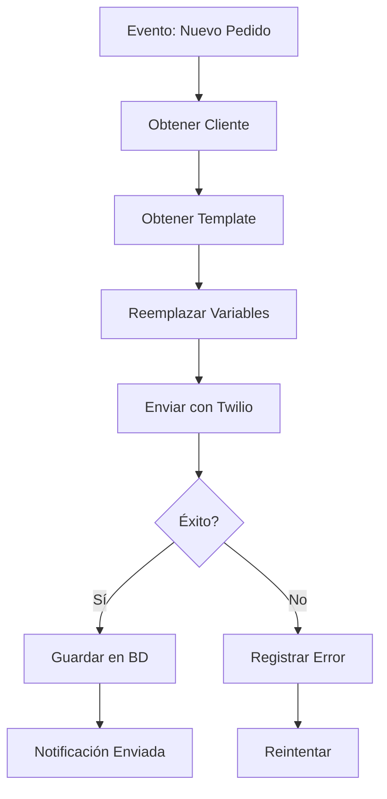
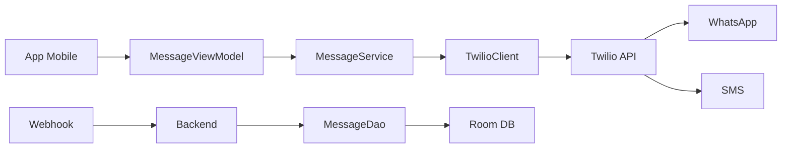
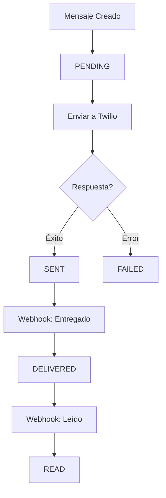
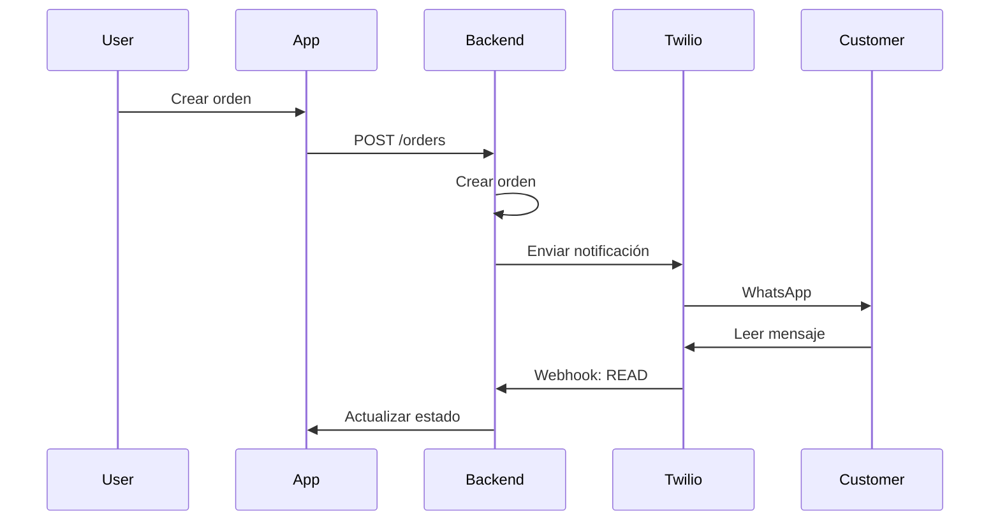

# 📱 Clase 13: WhatsApp y Comunicaciones

**Duración:** 4 horas  
**Objetivo:** Integrar Twilio para enviar notificaciones por WhatsApp y recibir mensajes de clientes  
**Proyecto:** Módulo de comunicaciones con notificaciones automáticas

---

## 📚 Contenido

### 1. Fundamentos de Twilio

Twilio es una plataforma de comunicaciones que permite enviar SMS, WhatsApp, llamadas, etc. mediante APIs.

**Ventajas:**
- API simple y documentada
- Soporte para múltiples canales (SMS, WhatsApp, Voz)
- Webhooks para recibir mensajes
- Sandbox para testing
- Precios competitivos

**Casos de uso en Stock Management:**
- Notificaciones de pedidos
- Confirmación de entregas
- Alertas de stock bajo
- Comunicación con clientes
- Recordatorios de pagos

```kotlin
// Dependencias en build.gradle.kts
dependencies {
    implementation("com.twilio.sdk:twilio:9.0.0")
    implementation("com.squareup.okhttp3:okhttp:4.11.0")
}
```

### 2. Configuración de Twilio

```kotlin
// TwilioConfig.kt
object TwilioConfig {
    const val ACCOUNT_SID = "your_account_sid"
    const val AUTH_TOKEN = "your_auth_token"
    const val TWILIO_PHONE = "+1234567890" // Número de Twilio
    const val TWILIO_WHATSAPP = "whatsapp:+1234567890"
}

// TwilioClient.kt
class TwilioClient {
    private val client = Twilio.init(TwilioConfig.ACCOUNT_SID, TwilioConfig.AUTH_TOKEN)

    fun sendWhatsAppMessage(
        toPhoneNumber: String,
        message: String
    ): String? {
        return try {
            val messageResource = Message.creator(
                PhoneNumber("whatsapp:$toPhoneNumber"),
                PhoneNumber(TwilioConfig.TWILIO_WHATSAPP),
                message
            ).create()

            messageResource.sid
        } catch (e: Exception) {
            Log.e("TwilioClient", "Error sending message: ${e.message}")
            null
        }
    }

    fun sendSMS(
        toPhoneNumber: String,
        message: String
    ): String? {
        return try {
            val messageResource = Message.creator(
                PhoneNumber(toPhoneNumber),
                PhoneNumber(TwilioConfig.TWILIO_PHONE),
                message
            ).create()

            messageResource.sid
        } catch (e: Exception) {
            Log.e("TwilioClient", "Error sending SMS: ${e.message}")
            null
        }
    }
}
```

### 3. Modelos de Datos

```kotlin
// Message.kt (Room Entity)
@Entity(tableName = "messages")
data class Message(
    @PrimaryKey
    val id: String = UUID.randomUUID().toString(),
    val tenantId: String,
    val phoneNumber: String,
    val content: String,
    val type: MessageType = MessageType.OUTBOUND,
    val channel: Channel = Channel.WHATSAPP,
    val status: MessageStatus = MessageStatus.PENDING,
    val twilioSid: String? = null,
    val relatedOrderId: String? = null,
    val createdAt: LocalDateTime = LocalDateTime.now(),
    val sentAt: LocalDateTime? = null
)

enum class MessageType {
    OUTBOUND, INBOUND
}

enum class Channel {
    WHATSAPP, SMS, EMAIL
}

enum class MessageStatus {
    PENDING, SENT, DELIVERED, FAILED, READ
}

// MessageTemplate.kt
@Entity(tableName = "message_templates")
data class MessageTemplate(
    @PrimaryKey
    val id: String = UUID.randomUUID().toString(),
    val tenantId: String,
    val name: String,
    val content: String,
    val variables: List<String> = emptyList(), // {order_id}, {customer_name}, etc.
    val channel: Channel = Channel.WHATSAPP,
    val isActive: Boolean = true,
    val createdAt: LocalDateTime = LocalDateTime.now()
)

// Customer.kt (Extensión)
@Entity(tableName = "customers")
data class Customer(
    @PrimaryKey
    val id: String = UUID.randomUUID().toString(),
    val tenantId: String,
    val name: String,
    val email: String,
    val phoneNumber: String,
    val whatsappNumber: String? = null,
    val preferredChannel: Channel = Channel.WHATSAPP,
    val createdAt: LocalDateTime = LocalDateTime.now()
)
```

### 4. Servicio de Mensajes

```kotlin
// MessageService.kt
class MessageService(
    private val twilioClient: TwilioClient,
    private val messageDao: MessageDao,
    private val templateDao: MessageTemplateDao
) {
    suspend fun sendOrderNotification(
        orderId: String,
        customerId: String,
        customer: Customer,
        tenantId: String
    ) {
        try {
            val template = templateDao.getByName(tenantId, "order_confirmation")
                ?: return

            val message = template.content
                .replace("{order_id}", orderId)
                .replace("{customer_name}", customer.name)

            val phoneNumber = customer.whatsappNumber ?: customer.phoneNumber
            val twilioSid = when (customer.preferredChannel) {
                Channel.WHATSAPP -> twilioClient.sendWhatsAppMessage(phoneNumber, message)
                Channel.SMS -> twilioClient.sendSMS(phoneNumber, message)
                else -> null
            }

            val dbMessage = Message(
                tenantId = tenantId,
                phoneNumber = phoneNumber,
                content = message,
                type = MessageType.OUTBOUND,
                channel = customer.preferredChannel,
                status = MessageStatus.SENT,
                twilioSid = twilioSid,
                relatedOrderId = orderId,
                sentAt = LocalDateTime.now()
            )

            messageDao.insert(dbMessage)
        } catch (e: Exception) {
            Log.e("MessageService", "Error sending notification: ${e.message}")
        }
    }

    suspend fun sendLowStockAlert(
        productId: String,
        productName: String,
        currentStock: Int,
        tenantId: String,
        adminPhoneNumber: String
    ) {
        val message = "⚠️ Stock bajo: $productName (Stock actual: $currentStock)"

        val twilioSid = twilioClient.sendWhatsAppMessage(adminPhoneNumber, message)

        val dbMessage = Message(
            tenantId = tenantId,
            phoneNumber = adminPhoneNumber,
            content = message,
            type = MessageType.OUTBOUND,
            channel = Channel.WHATSAPP,
            status = if (twilioSid != null) MessageStatus.SENT else MessageStatus.FAILED,
            twilioSid = twilioSid
        )

        messageDao.insert(dbMessage)
    }

    suspend fun sendDeliveryConfirmation(
        orderId: String,
        customer: Customer,
        tenantId: String
    ) {
        val template = templateDao.getByName(tenantId, "delivery_confirmation")
            ?: return

        val message = template.content.replace("{order_id}", orderId)

        val phoneNumber = customer.whatsappNumber ?: customer.phoneNumber
        val twilioSid = twilioClient.sendWhatsAppMessage(phoneNumber, message)

        val dbMessage = Message(
            tenantId = tenantId,
            phoneNumber = phoneNumber,
            content = message,
            type = MessageType.OUTBOUND,
            channel = Channel.WHATSAPP,
            status = MessageStatus.SENT,
            twilioSid = twilioSid,
            relatedOrderId = orderId,
            sentAt = LocalDateTime.now()
        )

        messageDao.insert(dbMessage)
    }
}
```

### 5. Webhooks para Recibir Mensajes

```kotlin
// WebhookReceiver.kt
class WebhookReceiver(
    private val messageService: MessageService,
    private val messageDao: MessageDao
) {
    suspend fun handleIncomingMessage(
        from: String,
        body: String,
        messageSid: String,
        tenantId: String
    ) {
        try {
            val message = Message(
                tenantId = tenantId,
                phoneNumber = from,
                content = body,
                type = MessageType.INBOUND,
                channel = Channel.WHATSAPP,
                status = MessageStatus.DELIVERED,
                twilioSid = messageSid
            )

            messageDao.insert(message)

            // Procesar mensaje (ej: búsqueda de producto, estado de pedido)
            processIncomingMessage(from, body, tenantId)
        } catch (e: Exception) {
            Log.e("WebhookReceiver", "Error processing webhook: ${e.message}")
        }
    }

    private suspend fun processIncomingMessage(
        from: String,
        body: String,
        tenantId: String
    ) {
        when {
            body.contains("estado", ignoreCase = true) -> {
                // Enviar estado de pedidos
                val response = "Tus pedidos están siendo procesados. Pronto recibirás actualizaciones."
                val twilioClient = TwilioClient()
                twilioClient.sendWhatsAppMessage(from, response)
            }
            body.contains("stock", ignoreCase = true) -> {
                // Consultar disponibilidad
                val response = "¿Qué producto buscas? Escribe el nombre."
                val twilioClient = TwilioClient()
                twilioClient.sendWhatsAppMessage(from, response)
            }
        }
    }
}
```

### 6. Backend: Endpoints de Mensajes

```typescript
// backend/src/routes/messages.ts
import express from 'express';
import { PrismaClient } from '@prisma/client';
import twilio from 'twilio';

const router = express.Router();
const prisma = new PrismaClient();

// Enviar mensaje
router.post('/messages/send', async (req, res) => {
    try {
        const { customerId, templateId, variables } = req.body;
        const tenantId = req.headers['x-tenant-id'] as string;

        const template = await prisma.messageTemplate.findUnique({
            where: { id: templateId }
        });

        if (!template) {
            return res.status(404).json({ error: 'Template not found' });
        }

        let content = template.content;
        Object.entries(variables || {}).forEach(([key, value]) => {
            content = content.replace(`{${key}}`, String(value));
        });

        const customer = await prisma.customer.findUnique({
            where: { id: customerId }
        });

        if (!customer) {
            return res.status(404).json({ error: 'Customer not found' });
        }

        // Enviar con Twilio
        const client = twilio(process.env.TWILIO_ACCOUNT_SID, process.env.TWILIO_AUTH_TOKEN);
        
        const message = await client.messages.create({
            from: `whatsapp:${process.env.TWILIO_WHATSAPP_NUMBER}`,
            to: `whatsapp:${customer.whatsappNumber || customer.phoneNumber}`,
            body: content
        });

        // Guardar en BD
        const dbMessage = await prisma.message.create({
            data: {
                tenantId,
                customerId,
                content,
                channel: 'WHATSAPP',
                status: 'SENT',
                twilioSid: message.sid
            }
        });

        res.json(dbMessage);
    } catch (error) {
        console.error('Error sending message:', error);
        res.status(500).json({ error: 'Failed to send message' });
    }
});

// Webhook para mensajes entrantes
router.post('/webhooks/whatsapp', async (req, res) => {
    try {
        const { From, Body, MessageSid } = req.body;
        const tenantId = req.headers['x-tenant-id'] as string;

        // Guardar mensaje entrante
        await prisma.message.create({
            data: {
                tenantId,
                phoneNumber: From,
                content: Body,
                type: 'INBOUND',
                channel: 'WHATSAPP',
                status: 'DELIVERED',
                twilioSid: MessageSid
            }
        });

        // Respuesta automática
        const response = `Gracias por tu mensaje. Un agente te contactará pronto.`;

        const client = twilio(process.env.TWILIO_ACCOUNT_SID, process.env.TWILIO_AUTH_TOKEN);
        
        await client.messages.create({
            from: `whatsapp:${process.env.TWILIO_WHATSAPP_NUMBER}`,
            to: From,
            body: response
        });

        res.status(200).send('OK');
    } catch (error) {
        console.error('Webhook error:', error);
        res.status(500).send('Error');
    }
});

// Obtener historial de mensajes
router.get('/messages/:customerId', async (req, res) => {
    try {
        const { customerId } = req.params;
        const tenantId = req.headers['x-tenant-id'] as string;

        const messages = await prisma.message.findMany({
            where: {
                tenantId,
                customerId
            },
            orderBy: { createdAt: 'desc' },
            take: 50
        });

        res.json(messages);
    } catch (error) {
        res.status(500).json({ error: 'Failed to fetch messages' });
    }
});

export default router;
```

### 7. ViewModel de Mensajes

```kotlin
// MessageViewModel.kt
class MessageViewModel(
    private val messageService: MessageService,
    private val messageDao: MessageDao
) : ViewModel() {

    private val _messages = MutableLiveData<List<Message>>()
    val messages: LiveData<List<Message>> = _messages

    private val _sendState = MutableLiveData<SendState>(SendState.Idle)
    val sendState: LiveData<SendState> = _sendState

    private val _error = MutableLiveData<String?>()
    val error: LiveData<String?> = _error

    fun loadMessages(customerId: String, tenantId: String) {
        viewModelScope.launch {
            try {
                val msgs = messageDao.getByCustomer(customerId, tenantId)
                _messages.value = msgs
            } catch (e: Exception) {
                _error.value = e.message
            }
        }
    }

    fun sendOrderNotification(
        orderId: String,
        customerId: String,
        customer: Customer,
        tenantId: String
    ) {
        viewModelScope.launch {
            try {
                _sendState.value = SendState.Sending
                messageService.sendOrderNotification(orderId, customerId, customer, tenantId)
                _sendState.value = SendState.Success
                loadMessages(customerId, tenantId)
            } catch (e: Exception) {
                _sendState.value = SendState.Error(e.message ?: "Unknown error")
                _error.value = e.message
            }
        }
    }

    fun sendDeliveryConfirmation(
        orderId: String,
        customer: Customer,
        tenantId: String
    ) {
        viewModelScope.launch {
            try {
                _sendState.value = SendState.Sending
                messageService.sendDeliveryConfirmation(orderId, customer, tenantId)
                _sendState.value = SendState.Success
                loadMessages(customer.id, tenantId)
            } catch (e: Exception) {
                _sendState.value = SendState.Error(e.message ?: "Unknown error")
            }
        }
    }
}

sealed class SendState {
    object Idle : SendState()
    object Sending : SendState()
    object Success : SendState()
    data class Error(val message: String) : SendState()
}
```

### 8. UI de Mensajes

```kotlin
// MessageListFragment.kt
class MessageListFragment : Fragment() {
    private lateinit var viewModel: MessageViewModel
    private lateinit var adapter: MessageAdapter

    override fun onViewCreated(view: View, savedInstanceState: Bundle?) {
        super.onViewCreated(view, savedInstanceState)
        viewModel = ViewModelProvider(this).get(MessageViewModel::class.java)

        setupRecyclerView()
        setupObservers()

        val customerId = arguments?.getString("customer_id") ?: ""
        val tenantId = requireActivity().intent.getStringExtra("tenant_id") ?: ""
        viewModel.loadMessages(customerId, tenantId)
    }

    private fun setupRecyclerView() {
        adapter = MessageAdapter()
        binding.messagesRecycler.apply {
            layoutManager = LinearLayoutManager(requireContext()).apply {
                reverseLayout = true
                stackFromEnd = true
            }
            adapter = this@MessageListFragment.adapter
        }
    }

    private fun setupObservers() {
        viewModel.messages.observe(viewLifecycleOwner) { messages ->
            adapter.submitList(messages)
        }

        viewModel.sendState.observe(viewLifecycleOwner) { state ->
            when (state) {
                is SendState.Sending -> binding.progressBar.visibility = View.VISIBLE
                is SendState.Success -> {
                    binding.progressBar.visibility = View.GONE
                    Toast.makeText(requireContext(), "Message sent", Toast.LENGTH_SHORT).show()
                }
                is SendState.Error -> {
                    binding.progressBar.visibility = View.GONE
                    Toast.makeText(requireContext(), state.message, Toast.LENGTH_LONG).show()
                }
                else -> {}
            }
        }
    }
}

// MessageAdapter.kt
class MessageAdapter : ListAdapter<Message, MessageAdapter.ViewHolder>(MessageDiffCallback()) {

    override fun onCreateViewHolder(parent: ViewGroup, viewType: Int): ViewHolder {
        val binding = MessageItemBinding.inflate(
            LayoutInflater.from(parent.context),
            parent,
            false
        )
        return ViewHolder(binding)
    }

    override fun onBindViewHolder(holder: ViewHolder, position: Int) {
        holder.bind(getItem(position))
    }

    inner class ViewHolder(private val binding: MessageItemBinding) :
        RecyclerView.ViewHolder(binding.root) {

        fun bind(message: Message) {
            binding.apply {
                messageContent.text = message.content
                messageTime.text = message.createdAt.format(DateTimeFormatter.ofPattern("HH:mm"))
                
                val isOutbound = message.type == MessageType.OUTBOUND
                messageContent.setBackgroundResource(
                    if (isOutbound) R.drawable.bg_message_outbound
                    else R.drawable.bg_message_inbound
                )
                
                messageStatus.text = message.status.name
                messageStatus.visibility = if (isOutbound) View.VISIBLE else View.GONE
            }
        }
    }
}

class MessageDiffCallback : DiffUtil.ItemCallback<Message>() {
    override fun areItemsTheSame(oldItem: Message, newItem: Message) = oldItem.id == newItem.id
    override fun areContentsTheSame(oldItem: Message, newItem: Message) = oldItem == newItem
}
```

---

## 🎯 Ejercicio Práctico

### Objetivo
Implementar sistema completo de notificaciones por WhatsApp para pedidos.

### Paso 1: Configurar Twilio

```kotlin
// Obtener credenciales en https://www.twilio.com/console
// Guardar en local.properties o BuildConfig
```

### Paso 2: Crear DAOs

```kotlin
// MessageDao.kt
@Dao
interface MessageDao {
    @Insert(onConflict = OnConflictStrategy.REPLACE)
    suspend fun insert(message: Message)

    @Query("SELECT * FROM messages WHERE tenantId = :tenantId ORDER BY createdAt DESC")
    suspend fun getByTenant(tenantId: String): List<Message>

    @Query("SELECT * FROM messages WHERE phoneNumber = :phoneNumber AND tenantId = :tenantId")
    suspend fun getByPhone(phoneNumber: String, tenantId: String): List<Message>
}

// MessageTemplateDao.kt
@Dao
interface MessageTemplateDao {
    @Insert(onConflict = OnConflictStrategy.REPLACE)
    suspend fun insert(template: MessageTemplate)

    @Query("SELECT * FROM message_templates WHERE name = :name AND tenantId = :tenantId")
    suspend fun getByName(tenantId: String, name: String): MessageTemplate?
}
```

### Paso 3: Crear Repository

```kotlin
// MessageRepository.kt
class MessageRepository(
    private val messageDao: MessageDao,
    private val templateDao: MessageTemplateDao
) {
    suspend fun getMessages(tenantId: String): List<Message> {
        return messageDao.getByTenant(tenantId)
    }

    suspend fun saveMessage(message: Message) {
        messageDao.insert(message)
    }

    suspend fun getTemplate(tenantId: String, name: String): MessageTemplate? {
        return templateDao.getByName(tenantId, name)
    }
}
```

### Paso 4: Integrar en Orden

```kotlin
// OrderViewModel.kt (Extensión)
fun createOrder(order: Order, customer: Customer) {
    viewModelScope.launch {
        try {
            orderRepository.createOrder(order)
            // Enviar notificación
            messageService.sendOrderNotification(
                order.id,
                customer.id,
                customer,
                order.tenantId
            )
        } catch (e: Exception) {
            _error.value = e.message
        }
    }
}
```

### Paso 5: Configurar Webhook

```bash
# En Twilio Console:
# Webhook URL: https://tu-backend.com/webhooks/whatsapp
# Método: POST
```

---

## 📊 Diagramas

### Flujo de Notificación



### Arquitectura de Comunicaciones



### Ciclo de Vida de Mensaje



### Integración con Órdenes



---

## 📝 Resumen

- ✅ Integración Twilio para WhatsApp y SMS
- ✅ Envío de notificaciones automáticas
- ✅ Recepción de mensajes con webhooks
- ✅ Templates de mensajes reutilizables
- ✅ Historial de comunicaciones
- ✅ Manejo de estados de mensajes
- ✅ Backend: Endpoints de mensajes

---

## 🎓 Preguntas de Repaso

**P1:** ¿Por qué usar Twilio en lugar de enviar SMS directamente?  
**R1:** Twilio proporciona API unificada, manejo de errores, webhooks y soporte para múltiples canales.

**P2:** ¿Cómo procesar mensajes entrantes?  
**R2:** Mediante webhooks que Twilio envía cuando recibe un mensaje, permitiendo respuestas automáticas.

**P3:** ¿Qué información guardar de cada mensaje?  
**R3:** ID de Twilio, contenido, estado, timestamp, tipo (entrante/saliente) y cliente relacionado.

**P4:** ¿Cómo manejar errores de envío?  
**R4:** Implementar reintentos, registrar el error y notificar al usuario para reintento manual.

**P5:** ¿Por qué usar templates de mensajes?  
**R5:** Permite reutilizar mensajes, mantener consistencia y facilitar cambios sin modificar código.

---

## 🚀 Próxima Clase

**Clase 14: Mercado Libre y Publicaciones**

Integración con API de Mercado Libre para publicar productos y sincronizar ventas.

---

**Última actualización:** 2024  
**Tiempo estimado:** 4 horas  
**Complejidad:** ⭐⭐⭐⭐ (Avanzada)
