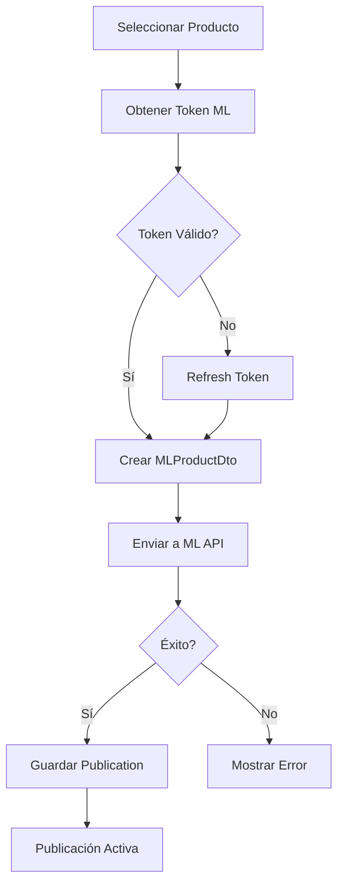
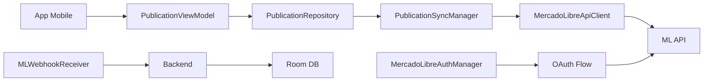
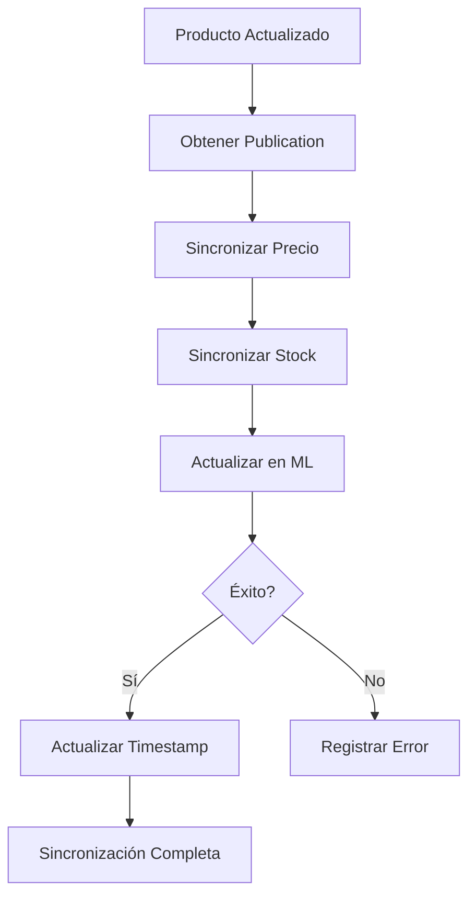
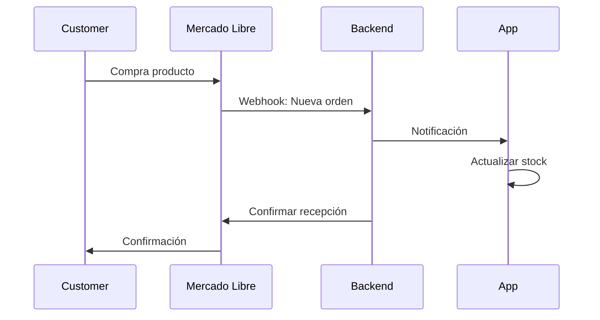

# 📱 Clase 14: Mercado Libre y Publicaciones

**Duración:** 4 horas  
**Objetivo:** Integrar API de Mercado Libre para publicar productos y sincronizar ventas  
**Proyecto:** Módulo de publicaciones y sincronización con Mercado Libre

---

## 📚 Contenido

### 1. Fundamentos de Mercado Libre API

Mercado Libre es el marketplace más grande de Latinoamérica. Su API permite:

- **Publicar productos** - Crear y actualizar listados
- **Sincronizar precios** - Actualizar en tiempo real
- **Gestionar órdenes** - Recibir y procesar compras
- **Consultar métricas** - Visualizaciones y estadísticas

**Flujo OAuth:**
1. Redirigir a Mercado Libre para autorización
2. Recibir código de autorización
3. Intercambiar por access token
4. Usar token para API calls

```kotlin
// Dependencias en build.gradle.kts
dependencies {
    implementation("com.squareup.okhttp3:okhttp:4.11.0")
    implementation("com.squareup.retrofit2:retrofit:2.9.0")
    implementation("com.squareup.retrofit2:converter-gson:2.9.0")
}
```

### 2. Autenticación OAuth con Mercado Libre

```kotlin
// MercadoLibreConfig.kt
object MercadoLibreConfig {
    const val CLIENT_ID = "your_client_id"
    const val CLIENT_SECRET = "your_client_secret"
    const val REDIRECT_URI = "com.stockapp://oauth/mercadolibre"
    const val AUTH_URL = "https://auth.mercadolibre.com.ar/authorization"
    const val TOKEN_URL = "https://api.mercadolibre.com/oauth/token"
    const val API_BASE_URL = "https://api.mercadolibre.com"
}

// MercadoLibreAuthManager.kt
class MercadoLibreAuthManager(
    private val context: Context,
    private val tokenDao: TokenDao
) {
    fun getAuthorizationUrl(): String {
        return "${MercadoLibreConfig.AUTH_URL}?" +
            "response_type=code&" +
            "client_id=${MercadoLibreConfig.CLIENT_ID}&" +
            "redirect_uri=${MercadoLibreConfig.REDIRECT_URI}"
    }

    suspend fun exchangeCodeForToken(code: String): MercadoLibreToken? {
        return try {
            val client = OkHttpClient()
            val request = Request.Builder()
                .url(MercadoLibreConfig.TOKEN_URL)
                .post(FormBody.Builder()
                    .add("grant_type", "authorization_code")
                    .add("client_id", MercadoLibreConfig.CLIENT_ID)
                    .add("client_secret", MercadoLibreConfig.CLIENT_SECRET)
                    .add("code", code)
                    .add("redirect_uri", MercadoLibreConfig.REDIRECT_URI)
                    .build())
                .build()

            val response = client.newCall(request).execute()
            val body = response.body?.string() ?: return null

            val token = Gson().fromJson(body, MercadoLibreToken::class.java)
            tokenDao.insert(token)
            token
        } catch (e: Exception) {
            Log.e("MercadoLibreAuth", "Error: ${e.message}")
            null
        }
    }

    suspend fun refreshToken(token: MercadoLibreToken): MercadoLibreToken? {
        return try {
            val client = OkHttpClient()
            val request = Request.Builder()
                .url(MercadoLibreConfig.TOKEN_URL)
                .post(FormBody.Builder()
                    .add("grant_type", "refresh_token")
                    .add("client_id", MercadoLibreConfig.CLIENT_ID)
                    .add("client_secret", MercadoLibreConfig.CLIENT_SECRET)
                    .add("refresh_token", token.refreshToken)
                    .build())
                .build()

            val response = client.newCall(request).execute()
            val body = response.body?.string() ?: return null

            val newToken = Gson().fromJson(body, MercadoLibreToken::class.java)
            tokenDao.insert(newToken)
            newToken
        } catch (e: Exception) {
            Log.e("MercadoLibreAuth", "Refresh error: ${e.message}")
            null
        }
    }
}

// MercadoLibreToken.kt
@Entity(tableName = "mercadolibre_tokens")
data class MercadoLibreToken(
    @PrimaryKey
    val id: String = UUID.randomUUID().toString(),
    val tenantId: String = "",
    val accessToken: String,
    val refreshToken: String,
    val expiresIn: Long,
    val userId: String,
    val createdAt: LocalDateTime = LocalDateTime.now()
) {
    fun isExpired(): Boolean {
        val expirationTime = createdAt.plusSeconds(expiresIn)
        return LocalDateTime.now().isAfter(expirationTime.minusMinutes(5))
    }
}
```

### 3. Cliente de API de Mercado Libre

```kotlin
// MercadoLibreApiClient.kt
interface MercadoLibreApiClient {
    suspend fun publishProduct(product: MLProductDto, token: String): MLPublicationDto
    suspend fun updatePrice(itemId: String, price: Double, token: String): Boolean
    suspend fun updateStock(itemId: String, quantity: Int, token: String): Boolean
    suspend fun getOrders(token: String): List<MLOrderDto>
    suspend fun getOrder(orderId: String, token: String): MLOrderDto
    suspend fun getUser(token: String): MLUserDto
}

// Implementación
class MercadoLibreApiClientImpl(
    private val httpClient: HttpClient
) : MercadoLibreApiClient {

    override suspend fun publishProduct(
        product: MLProductDto,
        token: String
    ): MLPublicationDto {
        return try {
            val response = httpClient.post("${MercadoLibreConfig.API_BASE_URL}/items") {
                header("Authorization", "Bearer $token")
                contentType(ContentType.Application.Json)
                setBody(product)
            }
            response.body()
        } catch (e: Exception) {
            Log.e("MLClient", "Publish error: ${e.message}")
            throw e
        }
    }

    override suspend fun updatePrice(
        itemId: String,
        price: Double,
        token: String
    ): Boolean {
        return try {
            val body = mapOf("price" to price)
            httpClient.put("${MercadoLibreConfig.API_BASE_URL}/items/$itemId") {
                header("Authorization", "Bearer $token")
                contentType(ContentType.Application.Json)
                setBody(body)
            }
            true
        } catch (e: Exception) {
            Log.e("MLClient", "Update price error: ${e.message}")
            false
        }
    }

    override suspend fun updateStock(
        itemId: String,
        quantity: Int,
        token: String
    ): Boolean {
        return try {
            val body = mapOf("available_quantity" to quantity)
            httpClient.put("${MercadoLibreConfig.API_BASE_URL}/items/$itemId") {
                header("Authorization", "Bearer $token")
                contentType(ContentType.Application.Json)
                setBody(body)
            }
            true
        } catch (e: Exception) {
            Log.e("MLClient", "Update stock error: ${e.message}")
            false
        }
    }

    override suspend fun getOrders(token: String): List<MLOrderDto> {
        return try {
            val response = httpClient.get("${MercadoLibreConfig.API_BASE_URL}/orders/search") {
                header("Authorization", "Bearer $token")
                parameter("seller_id", "me")
            }
            response.body()
        } catch (e: Exception) {
            Log.e("MLClient", "Get orders error: ${e.message}")
            emptyList()
        }
    }

    override suspend fun getOrder(orderId: String, token: String): MLOrderDto {
        return httpClient.get("${MercadoLibreConfig.API_BASE_URL}/orders/$orderId") {
            header("Authorization", "Bearer $token")
        }.body()
    }

    override suspend fun getUser(token: String): MLUserDto {
        return httpClient.get("${MercadoLibreConfig.API_BASE_URL}/users/me") {
            header("Authorization", "Bearer $token")
        }.body()
    }
}

// DTOs
data class MLProductDto(
    val title: String,
    val category_id: String,
    val price: Double,
    val currency_id: String = "ARS",
    val available_quantity: Int,
    val description: String,
    val pictures: List<MLPictureDto> = emptyList(),
    val attributes: List<MLAttributeDto> = emptyList()
)

data class MLPictureDto(
    val url: String
)

data class MLAttributeDto(
    val id: String,
    val value_id: String? = null,
    val value_name: String? = null
)

data class MLPublicationDto(
    val id: String,
    val title: String,
    val price: Double,
    val available_quantity: Int,
    val status: String,
    val permalink: String
)

data class MLOrderDto(
    val id: String,
    val status: String,
    val date_created: String,
    val buyer: MLBuyerDto,
    val order_items: List<MLOrderItemDto>,
    val total_amount: Double
)

data class MLBuyerDto(
    val id: String,
    val nickname: String,
    val email: String
)

data class MLOrderItemDto(
    val item: MLItemDto,
    val quantity: Int,
    val unit_price: Double
)

data class MLItemDto(
    val id: String,
    val title: String,
    val category_id: String
)

data class MLUserDto(
    val id: String,
    val nickname: String,
    val email: String,
    val seller_reputation: MLSellerReputation
)

data class MLSellerReputation(
    val level_id: String,
    val power_seller_status: String?,
    val transactions: MLTransactions
)

data class MLTransactions(
    val total: Int,
    val completed: Int,
    val canceled: Int,
    val rating: Double
)
```

### 4. Sincronización de Productos

```kotlin
// MLPublication.kt (Room Entity)
@Entity(tableName = "ml_publications")
data class MLPublication(
    @PrimaryKey
    val id: String = UUID.randomUUID().toString(),
    val tenantId: String,
    val productId: String,
    val mlItemId: String,
    val title: String,
    val price: BigDecimal,
    val quantity: Int,
    val status: String,
    val permalink: String,
    val lastSyncedAt: LocalDateTime = LocalDateTime.now(),
    val createdAt: LocalDateTime = LocalDateTime.now()
)

// PublicationSyncManager.kt
class PublicationSyncManager(
    private val mlClient: MercadoLibreApiClient,
    private val publicationDao: MLPublicationDao,
    private val productDao: ProductDao,
    private val tokenDao: TokenDao
) {
    suspend fun publishProduct(
        product: Product,
        tenantId: String
    ): MLPublication? {
        return try {
            val token = tokenDao.getLatest(tenantId) ?: return null

            if (token.isExpired()) {
                // Refresh token
                val newToken = refreshToken(token)
                if (newToken == null) return null
            }

            val mlProduct = MLProductDto(
                title = product.name,
                category_id = "MLA1000", // Categoría genérica
                price = product.price.toDouble(),
                available_quantity = product.stock,
                description = product.description ?: ""
            )

            val publication = mlClient.publishProduct(mlProduct, token.accessToken)

            val dbPublication = MLPublication(
                tenantId = tenantId,
                productId = product.id,
                mlItemId = publication.id,
                title = publication.title,
                price = publication.price.toBigDecimal(),
                quantity = publication.available_quantity,
                status = publication.status,
                permalink = publication.permalink
            )

            publicationDao.insert(dbPublication)
            dbPublication
        } catch (e: Exception) {
            Log.e("PublicationSync", "Publish error: ${e.message}")
            null
        }
    }

    suspend fun syncPrice(
        product: Product,
        tenantId: String
    ): Boolean {
        return try {
            val token = tokenDao.getLatest(tenantId) ?: return false
            val publication = publicationDao.getByProductId(product.id, tenantId) ?: return false

            mlClient.updatePrice(publication.mlItemId, product.price.toDouble(), token.accessToken)
        } catch (e: Exception) {
            Log.e("PublicationSync", "Price sync error: ${e.message}")
            false
        }
    }

    suspend fun syncStock(
        product: Product,
        tenantId: String
    ): Boolean {
        return try {
            val token = tokenDao.getLatest(tenantId) ?: return false
            val publication = publicationDao.getByProductId(product.id, tenantId) ?: return false

            mlClient.updateStock(publication.mlItemId, product.stock, token.accessToken)
        } catch (e: Exception) {
            Log.e("PublicationSync", "Stock sync error: ${e.message}")
            false
        }
    }

    suspend fun syncOrders(tenantId: String): List<MLOrderDto> {
        return try {
            val token = tokenDao.getLatest(tenantId) ?: return emptyList()
            mlClient.getOrders(token.accessToken)
        } catch (e: Exception) {
            Log.e("PublicationSync", "Orders sync error: ${e.message}")
            emptyList()
        }
    }

    private suspend fun refreshToken(token: MercadoLibreToken): MercadoLibreToken? {
        return try {
            val authManager = MercadoLibreAuthManager(context, tokenDao)
            authManager.refreshToken(token)
        } catch (e: Exception) {
            null
        }
    }
}
```

### 5. ViewModel de Publicaciones

```kotlin
// PublicationViewModel.kt
class PublicationViewModel(
    private val publicationRepository: PublicationRepository,
    private val syncManager: PublicationSyncManager
) : ViewModel() {

    private val _publications = MutableLiveData<List<MLPublication>>()
    val publications: LiveData<List<MLPublication>> = _publications

    private val _syncState = MutableLiveData<SyncState>(SyncState.Idle)
    val syncState: LiveData<SyncState> = _syncState

    private val _error = MutableLiveData<String?>()
    val error: LiveData<String?> = _error

    fun loadPublications(tenantId: String) {
        viewModelScope.launch {
            try {
                val pubs = publicationRepository.getPublications(tenantId)
                _publications.value = pubs
            } catch (e: Exception) {
                _error.value = e.message
            }
        }
    }

    fun publishProduct(product: Product, tenantId: String) {
        viewModelScope.launch {
            try {
                _syncState.value = SyncState.Publishing
                syncManager.publishProduct(product, tenantId)
                _syncState.value = SyncState.Success
                loadPublications(tenantId)
            } catch (e: Exception) {
                _syncState.value = SyncState.Error(e.message ?: "Unknown error")
            }
        }
    }

    fun syncPrices(tenantId: String) {
        viewModelScope.launch {
            try {
                _syncState.value = SyncState.Syncing
                val products = publicationRepository.getProducts(tenantId)
                products.forEach { product ->
                    syncManager.syncPrice(product, tenantId)
                }
                _syncState.value = SyncState.Success
            } catch (e: Exception) {
                _syncState.value = SyncState.Error(e.message ?: "Unknown error")
            }
        }
    }

    fun syncOrders(tenantId: String) {
        viewModelScope.launch {
            try {
                _syncState.value = SyncState.Syncing
                val orders = syncManager.syncOrders(tenantId)
                publicationRepository.saveOrders(orders, tenantId)
                _syncState.value = SyncState.Success
            } catch (e: Exception) {
                _syncState.value = SyncState.Error(e.message ?: "Unknown error")
            }
        }
    }
}

sealed class SyncState {
    object Idle : SyncState()
    object Publishing : SyncState()
    object Syncing : SyncState()
    object Success : SyncState()
    data class Error(val message: String) : SyncState()
}
```

### 6. Backend: Gestión de Publicaciones

```typescript
// backend/src/routes/mercadolibre.ts
import express from 'express';
import { PrismaClient } from '@prisma/client';

const router = express.Router();
const prisma = new PrismaClient();

// Obtener publicaciones
router.get('/publications', async (req, res) => {
    try {
        const tenantId = req.headers['x-tenant-id'] as string;

        const publications = await prisma.mLPublication.findMany({
            where: { tenantId },
            include: { product: true }
        });

        res.json(publications);
    } catch (error) {
        res.status(500).json({ error: 'Failed to fetch publications' });
    }
});

// Publicar producto
router.post('/publications', async (req, res) => {
    try {
        const { productId } = req.body;
        const tenantId = req.headers['x-tenant-id'] as string;

        const product = await prisma.product.findUnique({
            where: { id: productId }
        });

        if (!product) {
            return res.status(404).json({ error: 'Product not found' });
        }

        // Aquí iría la lógica de publicación en ML
        const publication = await prisma.mLPublication.create({
            data: {
                tenantId,
                productId,
                mlItemId: `ML_${Date.now()}`,
                title: product.name,
                price: product.price,
                quantity: product.stock,
                status: 'ACTIVE',
                permalink: `https://mercadolibre.com.ar/item/ML_${Date.now()}`
            }
        });

        res.json(publication);
    } catch (error) {
        res.status(500).json({ error: 'Failed to publish' });
    }
});

// Sincronizar órdenes
router.post('/sync-orders', async (req, res) => {
    try {
        const tenantId = req.headers['x-tenant-id'] as string;

        // Aquí iría la lógica de sincronización
        res.json({
            success: true,
            message: 'Orders synced'
        });
    } catch (error) {
        res.status(500).json({ error: 'Sync failed' });
    }
});

export default router;
```

### 7. Webhooks de Mercado Libre

```kotlin
// MLWebhookReceiver.kt
class MLWebhookReceiver(
    private val publicationRepository: PublicationRepository,
    private val orderRepository: OrderRepository
) {
    suspend fun handleOrderNotification(
        orderId: String,
        status: String,
        tenantId: String
    ) {
        try {
            when (status) {
                "paid" -> {
                    // Procesar pago
                    orderRepository.updateOrderStatus(orderId, "PAID")
                }
                "shipped" -> {
                    // Procesar envío
                    orderRepository.updateOrderStatus(orderId, "SHIPPED")
                }
                "delivered" -> {
                    // Procesar entrega
                    orderRepository.updateOrderStatus(orderId, "DELIVERED")
                }
            }
        } catch (e: Exception) {
            Log.e("MLWebhook", "Error: ${e.message}")
        }
    }

    suspend fun handlePriceChange(
        itemId: String,
        newPrice: Double,
        tenantId: String
    ) {
        try {
            publicationRepository.updatePrice(itemId, newPrice, tenantId)
        } catch (e: Exception) {
            Log.e("MLWebhook", "Price update error: ${e.message}")
        }
    }
}
```

---

## 🎯 Ejercicio Práctico

### Objetivo
Implementar publicación de productos en Mercado Libre con sincronización de precios y órdenes.

### Paso 1: Configurar OAuth

```kotlin
// Obtener CLIENT_ID y CLIENT_SECRET en https://developers.mercadolibre.com.ar
// Configurar REDIRECT_URI en la app
```

### Paso 2: Crear DAOs

```kotlin
// MLPublicationDao.kt
@Dao
interface MLPublicationDao {
    @Insert(onConflict = OnConflictStrategy.REPLACE)
    suspend fun insert(publication: MLPublication)

    @Query("SELECT * FROM ml_publications WHERE tenantId = :tenantId")
    suspend fun getByTenant(tenantId: String): List<MLPublication>

    @Query("SELECT * FROM ml_publications WHERE productId = :productId AND tenantId = :tenantId")
    suspend fun getByProductId(productId: String, tenantId: String): MLPublication?
}

// TokenDao.kt
@Dao
interface TokenDao {
    @Insert(onConflict = OnConflictStrategy.REPLACE)
    suspend fun insert(token: MercadoLibreToken)

    @Query("SELECT * FROM mercadolibre_tokens WHERE tenantId = :tenantId ORDER BY createdAt DESC LIMIT 1")
    suspend fun getLatest(tenantId: String): MercadoLibreToken?
}
```

### Paso 3: Crear Repository

```kotlin
// PublicationRepository.kt
class PublicationRepository(
    private val publicationDao: MLPublicationDao,
    private val productDao: ProductDao
) {
    suspend fun getPublications(tenantId: String): List<MLPublication> {
        return publicationDao.getByTenant(tenantId)
    }

    suspend fun getProducts(tenantId: String): List<Product> {
        return productDao.getByTenant(tenantId)
    }

    suspend fun saveOrders(orders: List<MLOrderDto>, tenantId: String) {
        // Guardar órdenes en BD
    }
}
```

### Paso 4: Crear UI Fragment

```kotlin
// PublicationListFragment.kt
class PublicationListFragment : Fragment() {
    private lateinit var viewModel: PublicationViewModel
    private lateinit var adapter: PublicationAdapter

    override fun onViewCreated(view: View, savedInstanceState: Bundle?) {
        super.onViewCreated(view, savedInstanceState)
        viewModel = ViewModelProvider(this).get(PublicationViewModel::class.java)

        setupRecyclerView()
        setupObservers()
        setupListeners()

        val tenantId = requireActivity().intent.getStringExtra("tenant_id") ?: ""
        viewModel.loadPublications(tenantId)
    }

    private fun setupRecyclerView() {
        adapter = PublicationAdapter()
        binding.publicationsRecycler.adapter = adapter
    }

    private fun setupObservers() {
        viewModel.publications.observe(viewLifecycleOwner) { pubs ->
            adapter.submitList(pubs)
        }

        viewModel.syncState.observe(viewLifecycleOwner) { state ->
            when (state) {
                is SyncState.Publishing, is SyncState.Syncing -> {
                    binding.progressBar.visibility = View.VISIBLE
                }
                is SyncState.Success -> {
                    binding.progressBar.visibility = View.GONE
                    Toast.makeText(requireContext(), "Sync completed", Toast.LENGTH_SHORT).show()
                }
                is SyncState.Error -> {
                    binding.progressBar.visibility = View.GONE
                    Toast.makeText(requireContext(), state.message, Toast.LENGTH_LONG).show()
                }
                else -> {}
            }
        }
    }

    private fun setupListeners() {
        binding.syncPricesButton.setOnClickListener {
            val tenantId = requireActivity().intent.getStringExtra("tenant_id") ?: ""
            viewModel.syncPrices(tenantId)
        }

        binding.syncOrdersButton.setOnClickListener {
            val tenantId = requireActivity().intent.getStringExtra("tenant_id") ?: ""
            viewModel.syncOrders(tenantId)
        }
    }
}
```

### Paso 5: Integración en Proyecto

```xml
<!-- navigation.xml -->
<fragment
    android:id="@+id/publicationListFragment"
    android:name="com.stockapp.ui.publication.PublicationListFragment"
    android:label="Mercado Libre" />
```

---

## 📊 Diagramas

### Flujo de Publicación



### Arquitectura de Mercado Libre



### Ciclo de Sincronización



### Integración de Órdenes



---

## 📝 Resumen

- ✅ Autenticación OAuth con Mercado Libre
- ✅ Publicación de productos
- ✅ Sincronización de precios y stock
- ✅ Gestión de órdenes
- ✅ Webhooks para eventos
- ✅ Manejo de tokens con refresh
- ✅ Backend: Endpoints de publicaciones

---

## 🎓 Preguntas de Repaso

**P1:** ¿Por qué usar OAuth en lugar de credenciales directas?  
**R1:** OAuth es más seguro, no expone credenciales y permite revocar acceso sin cambiar contraseña.

**P2:** ¿Cómo manejar tokens expirados?  
**R2:** Verificar expiración antes de cada request y usar refresh token para obtener uno nuevo.

**P3:** ¿Qué información sincronizar de Mercado Libre?  
**R3:** Órdenes, cambios de estado, métricas de vendedor y notificaciones de eventos.

**P4:** ¿Cómo evitar conflictos de precios?  
**R4:** Sincronizar precios regularmente y usar webhooks para cambios en tiempo real.

**P5:** ¿Por qué guardar publicaciones en BD local?  
**R5:** Para caché, historial, análisis y funcionamiento offline.

---

## 🚀 Próxima Clase

**Clase 15: IA, Estadísticas y Reportes**

Implementar dashboard con análisis de datos, predicciones y reportes automáticos.

---

**Última actualización:** 2024  
**Tiempo estimado:** 4 horas  
**Complejidad:** ⭐⭐⭐⭐⭐ (Muy Avanzada)
