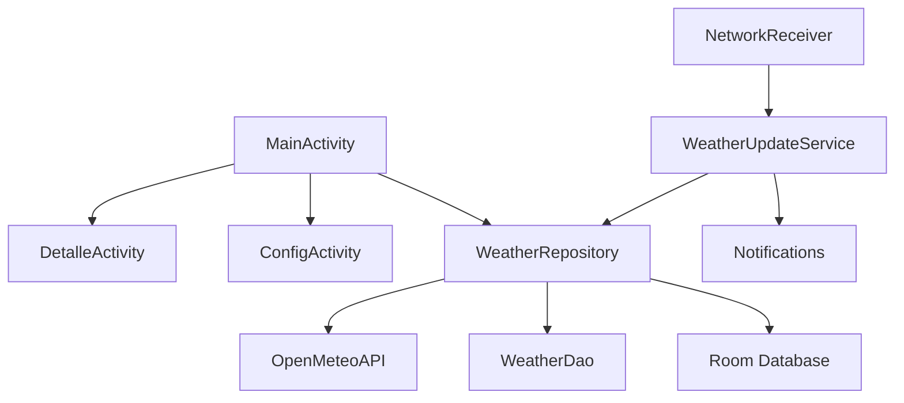

# LABORATORIO 2: Aplicacion Android Completa

## Fecha de presentacion: Miercoles 10 de junio de 2026
## Duracion de la presentacion: 10 minutos por grupo
## Formacion: Se mantienen los mismos grupos del Laboratorio 1. Si tu grupo no puede continuar o necesita reestructurarse, consultar con el docente antes de comenzar.

---

## 1. OBJETIVO

Desarrollar una aplicacion Android completa que integre **todos los componentes del ecosistema Android**, siga el ciclo de desarrollo profesional, y demuestre competencias en arquitectura, testing, documentacion y presentacion.

---

## 2. ESCENARIOS DISPONIBLES

Cada grupo debe elegir **UNO** de los siguientes cinco escenarios. **Importante:** los escenarios son **propuestas base**. Cada grupo tiene la libertad de enriquecerlos, modificarlos y hacerlos propios, siempre que cumplan con las consignas tecnicas obligatorias detalladas en la Seccion 3. Pueden agregar funcionalidades extras, cambiar el enfoque del escenario, o combinar ideas, siempre que la complejidad sea similar y se cubran todos los componentes Android requeridos.

> **Atencion sobre las APIs:** Las APIs y endpoints listados en cada escenario son orientativos. Es posible que algun endpoint no funcione de la forma esperada, cambie su formato, o tenga limitaciones de uso. **Es responsabilidad exclusiva del grupo investigar, validar y, de ser necesario, buscar una API alternativa** que cumpla con el mismo proposito. El docente no proveera APIs de reemplazo. Se recomienda probar los endpoints antes de comprometerse con un escenario.

### Escenario A: ClimaApp — Seguimiento Meteorologico

App de clima que muestra condiciones actuales, pronostico de 7 dias y alertas meteorologicas.

- **API libre:** [Open-Meteo](https://open-meteo.com/) (gratuita, sin API key)
- **Endpoints:**
  - `GET https://api.open-meteo.com/v1/forecast?latitude={lat}&longitude={lon}&current_weather=true&daily=temperature_2m_max,temperature_2m_min,weathercode&timezone=auto`
  - `GET https://geocoding-api.open-meteo.com/v1/search?name={ciudad}&count=1`
- **Datos que devuelve:** Temperatura, humedad, velocidad del viento, codigo de clima, pronostico diario.

**Pantallas:**
1. Busqueda de ciudad
2. Clima actual + pronostico 7 dias
3. Detalle historico del clima

### Escenario B: RecetaApp — Buscador de Recetas

App para buscar recetas de cocina, guardar favoritos y generar lista de compras.

- **API libre:** [TheMealDB](https://www.themealdb.com/api.php) (gratuita, sin API key)
- **Endpoints:**
  - `GET https://www.themealdb.com/api/json/v1/1/search.php?s={nombre}`
  - `GET https://www.themealdb.com/api/json/v1/1/random.php`
  - `GET https://www.themealdb.com/api/json/v1/1/lookup.php?i={id}`
- **Datos que devuelve:** Nombre, categoria, area, instrucciones, ingredientes, imagen.

**Pantallas:**
1. Busqueda de recetas
2. Detalle de receta con ingredientes e instrucciones
3. Favoritos + Lista de compras

### Escenario C: CryptoTracker — Monitor de Criptomonedas

App para monitorear precios de criptomonedas en tiempo real, con alertas de precio y portfolio personal.

- **API libre:** [CoinGecko](https://docs.coingecko.com/reference/introduction) (gratuita, sin API key para uso basico)
- **Endpoints:**
  - `GET https://api.coingecko.com/api/v3/coins/markets?vs_currency=usd&order=market_cap_desc&per_page=50&page=1`
  - `GET https://api.coingecko.com/api/v3/coins/{id}?localization=false&tickers=false&market_data=true`
  - `GET https://api.coingecko.com/api/v3/search?query={nombre}`
- **Datos que devuelve:** Precio, variacion 24h, capitalizacion de mercado, grafico historico.

**Pantallas:**
1. Lista de cryptos con precios en tiempo real
2. Detalle de crypto con historico
3. Mi portfolio + alertas configuradas

### Escenario D: CineApp — Catalogo de Peliculas

App para explorar peliculas, ver detalles, calificar y guardar una lista para ver.

- **API libre:** [TMDB - The Movie Database](https://developer.themoviedb.org/docs/getting-started) (gratuita, requiere registrarse para obtener API key — tarda 2 minutos)
- **Endpoints:**
  - `GET https://api.themoviedb.org/3/movie/popular?api_key={API_KEY}&language=es-ES&page=1`
  - `GET https://api.themoviedb.org/3/movie/{id}?api_key={API_KEY}&language=es-ES`
  - `GET https://api.themoviedb.org/3/search/movie?api_key={API_KEY}&query={busqueda}&language=es-ES`
- **Datos que devuelve:** Titulo, poster, overview, voto promedio, fecha de estreno, generos.

**Pantallas:**
1. Peliculas populares + busqueda
2. Detalle de pelicula con trailer (YouTube embed)
3. Mi Watchlist + peliculas por genero

### Escenario E: NewsApp — Lector de Noticias

App para leer noticias de diferentes categorias, guardar articulos y recibir notificaciones de noticias de ultima hora.

- **API libre:** [NewsAPI](https://newsapi.org/) (gratuita para desarrollo, requiere registrarse — tarda 2 minutos) O [GNews](https://gnews.io/) (alternativa)
- **Endpoints (NewsAPI):**
  - `GET https://newsapi.org/v2/top-headlines?country=ar&apiKey={API_KEY}`
  - `GET https://newsapi.org/v2/everything?q={termino}&apiKey={API_KEY}`
  - `GET https://newsapi.org/v2/top-headlines?category=technology&country=ar&apiKey={API_KEY}`
- **Datos que devuelve:** Titulo, descripcion, autor, imagen URL, fecha de publicacion, URL original.

**Pantallas:**
1. Noticias principales por categoria
2. Detalle del articulo
3. Articulos guardados + configuracion de categorias

---

## 3. REQUISITOS TECNICOS OBLIGATORIOS

### 3.1 Componentes Android que DEBEN implementar

| Componente | Requerimiento | Ejemplo de uso |
|------------|--------------|----------------|
| **Activity** | Minimo 3 Activities o 1 Activity con navegacion a 3 pantallas | Lista, detalle, configuracion |
| **Fragment** | Minimo 2 Fragments reutilizables | Card de item, panel de detalle |
| **Service** | 1 Service en segundo plano | Actualizacion periodica de datos, notificaciones |
| **BroadcastReceiver** | 1 BroadcastReceiver | Detectar cambio de red, boot completed |
| **ContentProvider / Room** | Base de datos local | Guardar favoritos, cache de datos |
| **Intent** | Navegacion entre pantallas + al menos 1 Intent externo | Abrir URL en navegador, compartir |
| **Notification** | Notificaciones desde el Service | Alertas de precio, noticias nuevas |
| **Sensor / Periferico** | Usar al menos 1 sensor o periferico | GPS para ubicacion, acelerometro, vibracion |
| **Navegacion** | Minimo 3 paginas/pantallas navegables | Lista → Detalle → Configuracion |
| **API Externa** | Llamada a la API publica del escenario elegido | Retrofit o Ktor para HTTP |

### 3.2 Arquitectura

La app debe seguir una arquitectura organizada en capas:

```
┌─────────────────────────────────────────────────────────┐
│                    PRESENTACION                          │
│  Activities / Fragments / Composables / XML Views        │
│  (UI + ViewModel si aplica)                              │
└──────────────────────┬──────────────────────────────────┘
                       │
┌──────────────────────▼──────────────────────────────────┐
│                    DOMINIO (opcional)                    │
│  Casos de uso / Use Cases                                │
│  (Transforma datos para la UI)                           │
└──────────────────────┬──────────────────────────────────┘
                       │
┌──────────────────────▼──────────────────────────────────┐
│                    DATOS                                 │
│  Repository + DAO + API Client (Retrofit/Ktor)           │
│  Room Database + SharedPreferences                       │
└─────────────────────────────────────────────────────────┘
```

### 3.3 Tecnologias permitidas

Pueden usar **cualquier** stack de los siguientes:

| Stack | Lenguaje | UI | Notas |
|-------|----------|----|----|
| Android Nativo | Kotlin + Jetpack Compose | Compose | Recomendado |
| Android Nativo | Kotlin + XML | Views/ViewBinding | Clasico |
| Android Nativo | Java + XML | Views | Soportado |
| Flutter | Dart | Widgets | Cross-platform |
| React Native | JavaScript/TypeScript | Componentes RN | Cross-platform |

**Cualquier tecnologia que elijan, DEBEN cumplir con los componentes Android listados arriba.** Si usan Flutter o React Native, deben implementar los equivalentes nativos (Background Tasks, Broadcast, etc.) via plugins nativos.

---

## 4. CICLO DE DESARROLLO — PASO A PASO

### FASE 1: Planificacion (Dia 1)

#### Paso 1.1: Elegir escenario
- Reunirse como grupo
- Elegir uno de los 5 escenarios
- Definir nombre del proyecto y package name

#### Paso 1.2: Diagrama de arquitectura
- Dibujar el diagrama de componentes de la app (ver formato en Seccion 5)
- Definir que tecnologias usaran
- Distribuir tareas entre los miembros

#### Paso 1.3: Crear repositorio Git
```bash
# Crear repositorio en GitHub/GitLab
git init
git remote add origin <url-del-repo>

# Estructura inicial del proyecto
mkdir docs
touch README.md
touch .gitignore
```

### FASE 2: Desarrollo (Dias 2-5)

#### Paso 2.1: Crear el proyecto

**Android Studio (Kotlin/Compose o Kotlin/XML):**
1. File → New → New Project
2. Elegir Empty Activity (Compose) o Empty Views Activity (XML)
3. Configurar:
   - Name: nombre de la app
   - Package name: `com.grupo.miapp`
   - Language: Kotlin (o Java)
   - Minimum SDK: API 26

**Flutter:**
```bash
flutter create mi_app
cd mi_app
```

**React Native:**
```bash
npx react-native init MiApp
cd MiApp
```

#### Paso 2.2: Configurar dependencias

Agregar las librerias necesarias (ejemplo para Android/Kotlin):

```kotlin
// app/build.gradle.kts
dependencies {
    // Networking
    implementation("com.squareup.retrofit2:retrofit:2.9.0")
    implementation("com.squareup.retrofit2:converter-gson:2.9.0")
    implementation("com.squareup.okhttp3:logging-interceptor:4.12.0")

    // Room Database
    implementation("androidx.room:room-runtime:2.6.1")
    implementation("androidx.room:room-ktx:2.6.1")
    ksp("androidx.room:room-compiler:2.6.1")

    // Coroutines
    implementation("org.jetbrains.kotlinx:kotlinx-coroutines-android:1.7.3")

    // Testing
    testImplementation("junit:junit:4.13.2")
    testImplementation("org.jetbrains.kotlinx:kotlinx-coroutines-test:1.7.3")
    testImplementation("io.mockk:mockk:1.13.9")
    androidTestImplementation("androidx.test.ext:junit:1.1.5")
    androidTestImplementation("androidx.test.espresso:espresso-core:3.5.1")
}
```

#### Paso 2.3: Implementar capa de datos

1. **Modelos/Entidades** — Clases que representan los datos de la API y la BD
2. **API Client** — Retrofit/Ktor para llamadas HTTP
3. **DAO** — Interfaz de acceso a datos local con Room
4. **Database** — Clase RoomDatabase singleton
5. **Repository** — Intermediario entre API, BD y UI

#### Paso 2.4: Implementar presentacion

1. **Activities/Fragments** — Pantallas de la app
2. **ViewModel** (si aplica) — Estado y logica de presentacion
3. **UI** — XML layouts o Composables
4. **Adapter** (si usa RecyclerView)

#### Paso 2.5: Implementar componentes de fondo

1. **Service** — Trabajo en segundo plano (ej: actualizar datos cada X minutos)
2. **BroadcastReceiver** — Escuchar eventos (cambio de red, boot)
3. **Notifications** — Mostrar alertas al usuario
4. **Sensor/Periferico** — GPS, acelerometro, etc.

#### Paso 2.6: Implementar navegacion

- Al menos 3 pantallas navegables
- Usar Intents (Android nativo), Navigator (Compose), Navigator widget (Flutter), o React Navigation (React Native)

### FASE 3: Testing (Dias 6-7)

#### Paso 3.1: Tests Unitarios

**Herramientas gratuitas:** JUnit + MockK (Kotlin) o Mockito (Java)

Escribir tests para:
- Repository (mockeando API y DAO)
- ViewModel (mockeando Repository)
- Utilidades y helpers

Ejemplo (Kotlin + JUnit + MockK):
```kotlin
// test/java/com/grupo/miapp/NotaRepositorioTest.kt
@Test
fun `insertar nota devuelve ID positivo`() = runTest {
    val mockDao = mockk<NotaDao>()
    every { mockDao.insertar(any()) } returns 1L

    val repo = NotaRepositorio(mockDao)
    val id = repo.insertar(Nota(id = 0, titulo = "Test"))

    assertEquals(1L, id)
}

@Test
fun `obtener notas retorna lista de Room`() = runTest {
    val mockDao = mockk<NotaDao>()
    val notasEsperadas = listOf(Nota(1, "Test"))
    coEvery { mockDao.obtenerTodas() } returns flowOf(notasEsperadas)

    val repo = NotaRepositorio(mockDao)
    val resultado = repo.todasLasNotas.first()

    assertEquals(notasEsperadas, resultado)
}
```

Ejecutar:
```bash
# Android Studio: Click derecho en test folder → Run Tests
# O por consola:
./gradlew test
```

#### Paso 3.2: Tests de Integracion

**Herramientas gratuitas:** Espresso (Android), Flutter Driver, Detox (React Native)

Escribir tests para:
- Flujo de navegacion entre pantallas
- Interaccion con la base de datos Room (test con BD en memoria)
- Llamada a API real o mock

Ejemplo (Espresso):
```kotlin
// androidTest/java/com/grupo/miapp/NavigationTest.kt
@Test
fun alTocarNota_navegaADetalle() {
    // Dado: Una nota en la lista
    launchActivity<MainActivity>()

    // Cuando: Toco una nota
    onView(withId(R.id.recyclerNotas))
        .perform(RecyclerViewActions.actionOnItemAtPosition<NotaViewHolder>(0, click()))

    // Entonces: Se abre la pantalla de detalle
    onView(withText("Detalle de Nota")).check(matches(isDisplayed()))
}
```

Ejecutar:
```bash
./gradlew connectedAndroidTest
```

#### Paso 3.3: Tests de Performance

**Herramientas gratuitas:**

| Herramienta | Que mide | Como usarla |
|------------|----------|-------------|
| **Android Profiler** (built-in) | CPU, memoria, red | Android Studio → View → Tool Windows → Profiler |
| **Benchmark Library** | Tiempo de ejecucion | `androidx.benchmark:benchmark-junit4` |
| **LeakCanary** | Memory leaks | `com.squareup.leakcanary:leakcanary-android` |
| **Baseline Profiles** | Tiempo de arranque | Genera perfil de compilacion |

Configurar LeakCanary (solo agregar dependencia, detecta leaks automaticamente):
```kotlin
debugImplementation("com.squareup.leakcanary:leakcanary-android:2.14")
```

Configurar Benchmark:
```kotlin
// Crear modulo :benchmark o agregar en app/build.gradle.kts
androidTestImplementation("androidx.benchmark:benchmark-junit4:1.2.4")
```

Ejemplo de test de benchmark:
```kotlin
// androidTest/java/com/grupo/miapp/BenchmarkTest.kt
@RunWith(AndroidJUnit4::class)
class RepositoryBenchmark {
    @get:Rule
    val benchmarkRule = BenchmarkRule()

    @Test
    fun benchmarkInsertarNota() {
        benchmarkRule.measureRepeated {
            runBlocking {
                repositorio.insertar(Nota(id = 0, titulo = "Benchmark"))
            }
        }
    }
}
```

**Metricas minimas a reportar:**
- Tiempo de arranque de la app (debe ser < 2 segundos)
- Uso de memoria (debe ser < 150 MB en estado normal)
- Tiempo de respuesta de la API (debe ser < 3 segundos)
- No memory leaks (reporte de LeakCanary limpio)

### FASE 4: Documentacion y Entrega (Dias 8-9)

#### Paso 4.1: Documentar en Git

Crear estos archivos en el repositorio:

```
mi-app/
├── README.md                    # Descripcion del proyecto, como ejecutar, screenshots
├── docs/
│   ├── arquitectura.md          # Diagrama de componentes + explicacion
│   ├── api.md                   # Documentacion de la API usada
│   ├── componentes.md           # Lista de componentes Android usados
│   ├── testing.md               # Reporte de tests con resultados
│   └── desarrollo.md            # Decisiones de disenio, distribucion de tareas
├── app/                         # Codigo fuente
├── .gitignore
└── LICENSE
```

**README.md minimo debe incluir:**
- Nombre del grupo e integrantes
- Escenario elegido
- Stack tecnologico
- Como configurar y ejecutar el proyecto
- Screenshots de la app
- Link al video demo

#### Paso 4.2: Diagrama de componentes

Crear un diagrama que muestre **todos** los componentes Android usados. Formato aceptable:

**Opcion A:** Markdown ASCII art (ejemplo):
```
┌─────────────────────────────────────────────────────────────┐
│                    ClimaApp                                  │
├─────────────────────────────────────────────────────────────┤
│  PRESENTACION                                                │
│  ┌─────────────────┐  ┌─────────────────┐  ┌─────────────┐ │
│  │ MainActivity    │  │ DetalleActivity │  │ ConfigAct.  │ │
│  │ (Lista ciudades)│  │ (Clima detallado)│ │ (Preferencias)│ │
│  └────────┬────────┘  └────────┬────────┘  └──────┬──────┘ │
│           │ Fragment            │ Fragment          │        │
│  ┌────────▼────────┐  ┌────────▼────────┐          │        │
│  │ CiudadCardFrag. │  │ PronosticoFrag. │          │        │
│  └─────────────────┘  └─────────────────┘          │        │
├─────────────────────────────────────────────────────────────┤
│  DATOS                                                       │
│  ┌─────────────────────────────────────────────────────┐   │
│  │  WeatherRepository                                   │   │
│  │  ├── OpenMeteoAPI (Retrofit)                        │   │
│  │  └── WeatherDao (Room)                              │   │
│  └─────────────────────────────────────────────────────┘   │
├─────────────────────────────────────────────────────────────┤
│  SEGUNDO PLANO                                               │
│  ┌──────────────────────┐  ┌──────────────────────┐        │
│  │ WeatherUpdateService │  │ NetworkReceiver      │        │
│  │ (actualiza cada 30m) │  │ (detecta conexion)   │        │
│  └──────────┬───────────┘  └──────────────────────┘        │
│             │                                                │
│             ▼                                                │
│  ┌──────────────────────┐                                   │
│  │ Notifications        │                                   │
│  │ (alertas de clima)   │                                   │
│  └──────────────────────┘                                   │
├─────────────────────────────────────────────────────────────┤
│  PERIFERICOS / INTENTS                                       │
│  ┌─────────────┐  ┌──────────────┐  ┌────────────────────┐ │
│  │ GPS/Location│  │ Acelerometro │  │ Intent → Navegador │ │
│  └─────────────┘  └──────────────┘  └────────────────────┘ │
└─────────────────────────────────────────────────────────────┘
```

**Opcion B:** Imagen PNG/JPG generada con:
- [Draw.io](https://app.diagrams.net/) (gratis)
- [PlantUML](https://plantuml.com/) (gratis)
- [Mermaid.js](https://mermaid.js.org/) (gratis, renderiza en GitHub)

**Opcion C:** Mermaid en el README (GitHub lo renderiza automatico):
```markdown

```

#### Paso 4.3: Grabar video demo (30 segundos)

**Requisitos del video:**
- Duracion: **exactamente ~30 segundos** (25-35 seg aceptable)
- Debe verse el **emulador de Android** en pantalla
- Formato: MP4
- Maximo 15 MB

**Que debe mostrar:**
1. Inicio de la app (2 seg)
2. Navegacion entre al menos 3 pantallas (10 seg)
3. Funcionalidad principal (buscar, ver detalle, guardar) (8 seg)
4. Componente en segundo plano funcionando (notificacion) (5 seg)
5. Cierre (5 seg)

**Como grabar:**
- **Emulador integrado:** Android Studio tiene boton de grabar video en la barra del emulador (icono de camara)
- **scrcpy + OBS:** `scrcpy --record archivo.mp4`
- **Android Studio:** Emulator → Extended Controls (⋮) → Screen Record

#### Paso 4.4: Presentacion (PPT)

Crear una presentacion de **maximo 8 slides** para los 10 minutos de exposicion:

| Slide | Contenido | Tiempo |
|-------|-----------|--------|
| 1 | Portada: nombre app, integrantes, escenario | 30 seg |
| 2 | Problema que resuelve + tecnologias usadas | 1 min |
| 3 | Diagrama de arquitectura | 1.5 min |
| 4 | Componentes Android implementados (tabla) | 1 min |
| 5 | Demo en vivo o video (30 seg) | 1 min |
| 6 | Resultados de testing (unitarios, integracion, performance) | 1.5 min |
| 7 | Desafios y aprendizaajes | 1 min |
| 8 | Conclusiones + link al repo | 30 seg |

**Herramientas gratuitas para PPT:**
- Google Slides (slides.google.com)
- Canva (canva.com)
- PowerPoint Online (office.com)
- LibreOffice Impress

---

## 5. ENTREGABLES

### 5.1 Lista de entrega

| # | Entregable | Formato | Donde | Cuándo |
|---|-----------|---------|-------|--------|
| 1 | **Mocks de la UI** | Imagenes o link editable | `docs/mocks/` en el repo | **Primer monitoreo (validar con docente)** |
| 2 | Codigo fuente completo | Repositorio Git | GitHub/GitLab publico | Presentacion final |
| 3 | README.md documentado | Markdown | En el repositorio | Presentacion final |
| 4 | Diagrama de componentes | Imagen o Mermaid | `docs/arquitectura.md` | Presentacion final |
| 5 | Reporte de tests | Markdown | `docs/testing.md` | Presentacion final |
| 6 | Video demo (30 seg) | MP4 | Link en README + Drive del grupo | Presentacion final |
| 7 | Presentacion PPT | PDF o PPTX | `docs/presentacion.pdf` | Presentacion final |
| 8 | Presentacion en vivo | 10 minutos | En clase, miercoles 10 de junio | Presentacion final |

### 5.1.1 Mocks de la UI (Primer Monitoreo)

**Que son los mocks:** Son disenos visuales de cada pantalla de la aplicacion. No son codigo funcional, son imagenes o prototipos que muestran **como se vera la app** antes de desarrollarla.

**Que deben incluir:**
- Mock de **todas las pantallas** (minimo 3)
- Estado de carga / loading
- Estado de error (ej: sin conexion a internet)
- Estado vacio (ej: sin datos guardados)
- Flujo de navegacion entre pantallas (flechas o anotaciones)

**Herramientas gratuitas recomendadas:**

| Herramienta | Tipo | URL | Notas |
|------------|------|-----|-------|
| **Figma** | Diseno + prototipo | figma.com | Gratis, colaborativo, mas usado en la industria |
| **Penpot** | Diseno + prototipo | penpot.app | Open source, alternativa libre a Figma |
| **Balsamiq Wireframes** | Wireframes (baja fidelidad) | balsamiq.com | Gratis para educacion, ideal para bocetos rapidos |
| **Excalidraw** | Wireframes a mano alzada | excalidraw.com | Gratis, sin registro, estilo sketch |
| **MockFlow** | Wireframes + prototipo | mockflow.com | Plan gratuito disponible |
| **Papel y lapiz** | Boceto manual | — | Foto al papel y subir al repo. Valido como primer borrador |

**Como entregar los mocks:**
1. Crear la carpeta `docs/mocks/` en el repositorio
2. Subir las imagenes (PNG, JPG o link editable de Figma/Penpot)
3. Incluir en `docs/mocks/index.md` una breve descripcion de cada pantalla y el flujo de navegacion
4. **Presentar al docente en el primer monitoreo para validar disenio y alcance**

**Recomendacion:** Hacer primero wireframes de baja fidelidad (lapiz o Excalidraw) para validar la estructura rapido, y luego pasar a alta fidelidad (Figma) para la presentacion final.

### 5.2 Estructura obligatoria del repositorio

```
mi-app/
├── README.md                        ← Documentacion principal
├── .gitignore
├── app/                             ← Codigo fuente de la app
│   ├── build.gradle.kts
│   └── src/
│       ├── main/
│       │   ├── AndroidManifest.xml
│       │   ├── java/...             ← Codigo Kotlin/Java
│       │   └── res/                 ← Recursos
│       ├── test/                    ← Tests unitarios
│       └── androidTest/             ← Tests de integracion + benchmark
├── docs/
│   ├── mocks/                       ← Mocks de la UI
│   │   ├── index.md                 ← Descripcion de cada pantalla
│   │   └── *.png                    ← Imagenes de los mocks
│   ├── arquitectura.md              ← Diagrama de componentes
│   ├── api.md                       ← Documentacion API usada
│   ├── componentes.md               ← Componentes Android usados
│   ├── testing.md                   ← Reporte de tests
│   ├── desarrollo.md                ← Decisiones y distribucion
│   └── presentacion.pdf             ← Slides de la presentacion
└── video/
    └── demo.mp4                     ← Video de 30 segundos (o link)
```

### 5.3 Contenido minimo del README.md

```markdown
# Nombre de la App

## Grupo X — Integrantes
- Nombre 1 — Legajo
- Nombre 2 — Legajo
- Nombre 3 — Legajo

## Escenario
Escenario elegido: [A/B/C/D/E] — Nombre del escenario

## Stack Tecnologico
- Lenguaje: Kotlin/Java/Dart/JavaScript
- UI: Compose/XML/Flutter Widgets/React Native
- API: Open-Meteo/TheMealDB/CoinGecko/TMDB/NewsAPI
- BD: Room/SQLite/SharedPreferences

## Como ejecutar
1. Clonar el repo
2. Abrir en Android Studio / Flutter / etc
3. Sync/Install dependencias
4. Run

## Screenshots
[Aqui van capturas de pantalla]

## Video Demo
[Link al video de 30 segundos]

## Componentes Android
- Activity: X pantallas
- Fragment: X fragments
- Service: nombre y funcion
- BroadcastReceiver: evento que escucha
- Room: entidades
- Notifications: tipo de alertas
- Sensor: cual se usa
- Intent externo: que abre

## Tests
- Unitarios: X tests, X% cobertura
- Integracion: X tests
- Performance: metricas

## API Utilizada
- URL: ...
- Endpoints usados: ...
```

---

## 6. RBRICA DE EVALUACION

| Criterio | Puntos | Detalle |
|----------|--------|---------|
| **Componentes Android** | 25 | Todos los componentes requeridos implementados y funcionales |
| **Navegacion** | 10 | Minimo 3 pantallas navegables, flujo logico |
| **API Externa** | 10 | Llamada funcional, manejo de errores, loading states |
| **Arquitectura** | 10 | Capas separadas, codigo limpio, nombres descriptivos |
| **Tests Unitarios** | 8 | Minimo 5 tests unitarios pasando |
| **Tests Integracion** | 7 | Minimo 3 tests de integracion pasando |
| **Tests Performance** | 5 | Metricas reportadas, sin memory leaks |
| **Diagrama de componentes** | 5 | Completo, claro, en el repositorio |
| **Documentacion Git** | 5 | README completo, docs en orden |
| **Video demo** | 5 | 30 seg, se ve emulador, funcionalidad clara |
| **Presentacion PPT** | 5 | Max 8 slides, dentro de 10 minutos |
| **GIT** | 5 | Commits incrementales, historial ordenado |
| **TOTAL** | **100** | |

---

## 7. REGLAS IMPORTANTES

1. **El codigo debe subirse a Git de forma incremental.** No se acepta un solo commit con todo el codigo. Minimo 10 commits significativos.
2. **Cada miembro del grupo debe hacer commits.** Si un solo miembro sube todo, se penaliza.
3. **La app debe compilar y ejecutarse sin errores.** Si no corre, no se evalua.
4. **El video debe ser grabado por el grupo.** No se aceptan videos descargados de internet.
5. **Los tests deben pasar.** `./gradlew test` y `./gradlew connectedAndroidTest` deben dar OK.
6. **Presentarse en 10 minutos.** Si se pasan del tiempo, se corta la presentacion.
7. **Todos los miembros deben hablar en la presentacion.** Al menos una parte cada uno.

---

## 8. RECURSOS Y HERRAMIENTAS GRATUITAS

### Herramientas de desarrollo
| Herramienta | Para que | URL |
|------------|----------|-----|
| Android Studio | IDE Android | developer.android.com/studio |
| VS Code | IDE generico | code.visualstudio.com |
| Git | Control de versiones | git-scm.com |
| GitHub/GitLab | Hosting de repos | github.com / gitlab.com |

### Herramientas de testing
| Herramienta | Para que | Costo |
|------------|----------|-------|
| JUnit | Tests unitarios | Gratis |
| MockK / Mockito | Mocking | Gratis |
| Espresso | Tests UI Android | Gratis |
| Android Profiler | CPU/Memoria/Red | Gratis (built-in) |
| LeakCanary | Detectar memory leaks | Gratis |
| Benchmark Library | Tests de performance | Gratis |

### Herramientas de documentacion
| Herramienta | Para que | URL |
|------------|----------|-----|
| Draw.io | Diagramas | app.diagrams.net |
| Mermaid.js | Diagramas en Markdown | mermaid.js.org |
| Google Slides | Presentaciones | slides.google.com |
| Canva | Presentaciones | canva.com |

### Herramientas de diseno (Mocks/UI)
| Herramienta | Para que | URL |
|------------|----------|-----|
| Figma | Diseno + prototipo interactivo | figma.com |
| Penpot | Diseno open source | penpot.app |
| Excalidraw | Wireframes a mano alzada | excalidraw.com |
| Balsamiq | Wireframes baja fidelidad | balsamiq.com |
| MockFlow | Wireframes + prototipo | mockflow.com |

### APIs gratuitas
| API | Data | API Key | URL |
|-----|------|---------|-----|
| Open-Meteo | Clima | No requiere | open-meteo.com |
| TheMealDB | Recetas | No requiere | themealdb.com |
| CoinGecko | Crypto | No requiere (basico) | coingecko.com |
| TMDB | Peliculas | Si (gratis) | themoviedb.org |
| NewsAPI | Noticias | Si (gratis dev) | newsapi.org |
| PokeAPI | Pokemon | No requiere | pokeapi.co |
| REST Countries | Paises | No requiere | restcountries.com |

---

## 9. EJEMPLO DE DIAGRAMA DE COMPONENTES COMPLETO

A continuacion un ejemplo completo del diagrama para el **Escenario A: ClimaApp**. Cada grupo debe crear su propio diagrama adaptado a su escenario.

```
┌─────────────────────────────────────────────────────────────────────┐
│                         ClimaApp                                     │
│              Arquitectura MVVM + Repository Pattern                  │
├─────────────────────────────────────────────────────────────────────┤
│                                                                     │
│  ┌───────────────────────────────────────────────────────────┐     │
│  │                    PRESENTACION (UI)                       │     │
│  │                                                            │     │
│  │  ┌────────────────┐  ┌────────────────┐  ┌────────────┐  │     │
│  │  │ BusquedaScreen │──│  ClimaScreen   │──│DetalleScreen│  │     │
│  │  │ (Activity)     │  │  (Activity)    │  │ (Activity)  │  │     │
│  │  └───────┬────────┘  └───────┬────────┘  └─────┬──────┘  │     │
│  │          │                   │                 │          │     │
│  │  ┌───────▼────────┐  ┌──────▼───────┐  ┌──────▼───────┐  │     │
│  │  │ SearchFragment │  │ CurrentFrag  │  │ DetailFragment│  │     │
│  │  │ (busqueda)     │  │ (clima actual)│  │ (historico)  │  │     │
│  │  └────────────────┘  └──────────────┘  └──────────────┘  │     │
│  │                                                            │     │
│  │  ┌──────────────────────────────────────────────────┐    │     │
│  │  │               ViewModels                          │    │     │
│  │  │  BusquedaViewModel | ClimaViewModel | ConfigVM    │    │     │
│  │  │  (StateFlow + corrutinas)                         │    │     │
│  │  └──────────────────────────────────────────────────┘    │     │
│  └───────────────────────────┬───────────────────────────────┘     │
│                              │ observa                             │
│  ┌───────────────────────────▼───────────────────────────────┐     │
│  │                        DATOS                               │     │
│  │                                                            │     │
│  │  ┌──────────────────────────────────────────────────┐    │     │
│  │  │               WeatherRepository                   │    │     │
│  │  │                                                    │    │     │
│  │  │  fun obtenerClima(ciudad): Flow<ClimaData>        │    │     │
│  │  │  fun guardarFavorito(ciudad)                       │    │     │
│  │  │  fun obtenerFavoritos(): Flow<List<Ciudad>>        │    │     │
│  │  └──────────┬───────────────────────────┬────────────┘    │     │
│  │             │                           │                 │     │
│  │  ┌──────────▼──────────┐   ┌────────────▼──────────┐     │     │
│  │  │  OpenMeteoAPI       │   │   WeatherDatabase     │     │     │
│  │  │  (Retrofit)         │   │   (Room)              │     │     │
│  │  │                     │   │                       │     │     │
│  │  │  GET /v1/forecast   │   │   ┌──────────────┐   │     │     │
│  │  │  GET /v1/search     │   │   │ WeatherDao   │   │     │     │
│  │  │                     │   │   │ insertar()   │   │     │     │
│  │  │  Modelos:           │   │   │ obtener()    │   │     │     │
│  │  │  ClimaData,         │   │   │ delete()     │   │     │     │
│  │  │  Pronostico         │   │   └──────────────┘   │     │     │
│  │  └─────────────────────┘   │   Entidad:           │     │     │
│  │                            │   CiudadFavorita     │     │     │
│  │                            └──────────────────────┘     │     │
│  └─────────────────────────────────────────────────────────┘     │
│                                                                   │
│  ┌───────────────────────────────────────────────────────────┐   │
│  │                  COMPONENTES ANDROID                       │   │
│  │                                                            │   │
│  │  ┌───────────────────────┐   ┌────────────────────────┐  │   │
│  │  │WeatherUpdateService   │   │NetworkChangeReceiver   │  │   │
│  │  │                       │   │                        │  │   │
│  │  │ Corre cada 30 min:    │   │ Escucha:               │  │   │
│  │  │ 1. Obtiene clima      │   │ - CONNECTIVITY_CHANGE  │  │   │
│  │  │ 2. Compara con umbral │   │ - BOOT_COMPLETED       │  │   │
│  │  │ 3. Si alerta → notifica│   │                        │  │   │
│  │  └───────────┬───────────┘   │ Si hay red → reanuda   │  │   │
│  │              │               │ actualizacion           │  │   │
│  │              ▼               └────────────────────────┘  │   │
│  │  ┌───────────────────────┐                                │   │
│  │  │ NotificationManager   │                                │   │
│  │  │                       │                                │   │
│  │  │ Canal: AlertasClima   │                                │   │
│  │  │ Notificacion cuando:  │                                │   │
│  │  │ - Temp > 35°C         │                                │   │
│  │  │ - Lluvia detectada    │                                │   │
│  │  └───────────────────────┘                                │   │
│  │                                                            │   │
│  │  ┌───────────────────────┐   ┌────────────────────────┐  │   │
│  │  │ GPS / LocationManager │   │ Intent Externo         │  │   │
│  │  │                       │   │                        │  │   │
│  │  │ Obtiene ubicacion     │   │ Abre navegador con:    │  │   │
│  │  │ actual para buscar    │   │ - Mapa del clima       │  │   │
│  │  │ clima local           │   │ - Compartir pronostico │  │   │
│  │  └───────────────────────┘   └────────────────────────┘  │   │
│  └───────────────────────────────────────────────────────────┘   │
│                                                                   │
└───────────────────────────────────────────────────────────────────┘
```

### Leyenda del diagrama

| Elemento | Representa |
|----------|-----------|
| `Activity` | Pantalla completa de la app |
| `Fragment` | Porcion reutilizable de UI dentro de un Activity |
| `ViewModel` | Estado de la pantalla, sobrevive rotaciones |
| `Repository` | Unica fuente de datos (API + BD local) |
| `API Client (Retrofit)` | Llamadas HTTP a la API externa |
| `Room Database` | Base de datos SQLite local |
| `DAO` | Acceso tipado a la base de datos |
| `Service` | Trabajo en segundo plano sin UI |
| `BroadcastReceiver` | Escucha eventos del sistema |
| `NotificationManager` | Muestra notificaciones al usuario |
| `GPS/Location` | Sensor de ubicacion del dispositivo |
| `Intent Externo` | Abre otra app (navegador, compartir) |

---

## 10. FAQ — PREGUNTAS FRECUENTES

**¿Puedo usar una API diferente a las sugeridas?**
Si, siempre que sea gratuita, publica y no requiera pago. Deben aprobarla con el docente. **Recuerden: es responsabilidad del grupo validar que la API funcione.**

**¿Que pasa si el endpoint de la API que elegimos no funciona o cambio el formato?**
Es responsabilidad del grupo investigar y buscar una alternativa. Las APIs publicas pueden cambiar, caerse o modificar sus endpoints sin previo aviso. Tengan siempre un plan B (otra API, otro endpoint, o datos de prueba locales).

**¿Puedo mezclar tecnologias (ej: Flutter + nativo)?**
Si. Pueden usar plugins nativos en Flutter/React Native para acceder a Services, Receivers, etc.

**¿Cuantos tests unitarios son suficientes?**
Minimo 5. Recomendado: 1 por cada funcion del Repository y ViewModel.

**¿El video puede ser de mas de 30 segundos?**
No. Maximo 35 segundos. Deben ser concisos.

**¿Que pasa si la app no compila el dia de la presentacion?**
No se evalua. La app debe estar funcional antes de presentar.

**¿Puedo presentar solo sin grupo?**
Si, pero se mantienen los grupos del Laboratorio 1. Consultar con el docente.

**¿El repositorio debe ser publico?**
Si. El docente debe poder acceder sin pedir permisos.
