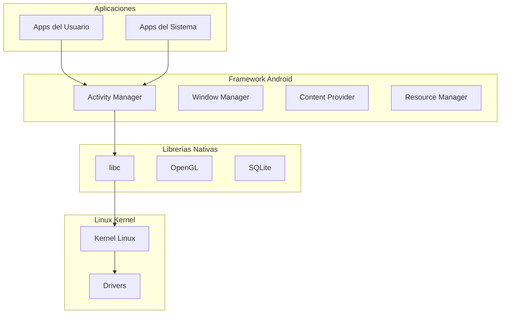
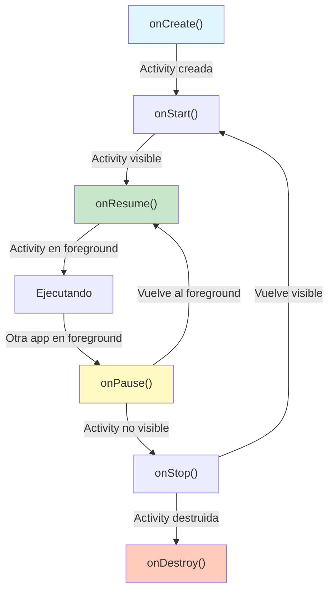
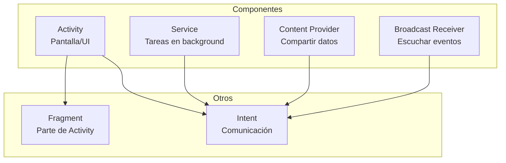
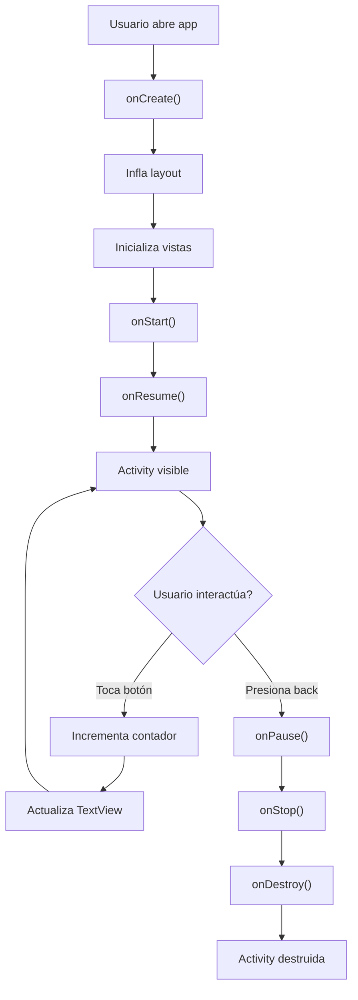

# 📱 Clase 01: Fundamentos de Android y Kotlin

**Objetivo:** Entender Android, Kotlin y prepararse para desarrollo profesional  
**Proyecto:** Crear primera Activity con ciclo de vida

---

## 📚 Contenido

### 1. ¿Qué es Android?

Android es un sistema operativo basado en Linux para dispositivos móviles. Características principales:

- **Open Source:** Código disponible públicamente
- **Basado en Linux:** Kernel Linux 5.x+
- **Máquina Virtual:** Dalvik/ART (Android Runtime)
- **Versiones:** API 26 (Android 8.0) hasta API 35 (Android 15)
- **Mercado:** 70%+ de dispositivos móviles

#### Arquitectura de Android



---

### 2. Kotlin: Lenguaje Moderno para Android

Kotlin es el lenguaje oficial de Android desde 2019. Ventajas sobre Java:

| Característica | Kotlin | Java |
|---|---|---|
| Null Safety | ✅ Integrado | ❌ Excepciones |
| Sintaxis | ✅ Concisa | ❌ Verbosa |
| Extensiones | ✅ Sí | ❌ No |
| Corrutinas | ✅ Nativas | ❌ Threads |
| Interoperabilidad | ✅ 100% con Java | ✅ Sí |

#### Conceptos Básicos de Kotlin

**Variables y Tipos:**
```kotlin
// Inmutable (preferido)
val nombre: String = "Juan"
val edad = 25  // Type inference

// Mutable
var contador: Int = 0
contador = 1

// Null safety
val email: String? = null  // Puede ser null
val email2: String = "test@example.com"  // No puede ser null
```

**Funciones:**
```kotlin
// Función simple
fun saludar(nombre: String): String {
    return "Hola, $nombre"
}

// Función con expresión
fun sumar(a: Int, b: Int) = a + b

// Función con parámetros por defecto
fun crearUsuario(nombre: String, edad: Int = 18) {
    println("$nombre tiene $edad años")
}
```

**Clases y Herencia:**
```kotlin
// Clase simple
class Usuario(val nombre: String, val email: String) {
    fun mostrarInfo() = println("$nombre - $email")
}

// Herencia
open class Animal(val nombre: String) {
    open fun hacer_sonido() = println("Sonido genérico")
}

class Perro(nombre: String) : Animal(nombre) {
    override fun hacer_sonido() = println("Guau!")
}

// Data class (para modelos)
data class Producto(
    val id: Int,
    val nombre: String,
    val precio: Double
)
```

**Null Safety:**
```kotlin
val nombre: String? = null

// Safe call operator
val longitud = nombre?.length  // null si nombre es null

// Elvis operator
val longitud2 = nombre?.length ?: 0  // 0 si nombre es null

// Not-null assertion (¡cuidado!)
val longitud3 = nombre!!.length  // Lanza excepción si null
```

**Colecciones:**
```kotlin
// Listas
val numeros = listOf(1, 2, 3)  // Inmutable
val numeros2 = mutableListOf(1, 2, 3)  // Mutable

// Mapas
val usuario = mapOf("nombre" to "Juan", "edad" to 25)

// Operaciones funcionales
numeros.filter { it > 2 }
    .map { it * 2 }
    .forEach { println(it) }
```

---

### 3. Ciclo de Vida de una Activity

Una Activity es la pantalla de la aplicación. Tiene un ciclo de vida bien definido:



**Métodos del Ciclo de Vida:**

```kotlin
class MainActivity : AppCompatActivity() {
    
    override fun onCreate(savedInstanceState: Bundle?) {
        super.onCreate(savedInstanceState)
        setContentView(R.layout.activity_main)
        // Inicializar vistas, variables
        // Se llama UNA SOLA VEZ
    }
    
    override fun onStart() {
        super.onStart()
        // Activity se vuelve visible
        // Puede llamarse múltiples veces
    }
    
    override fun onResume() {
        super.onResume()
        // Activity en foreground, lista para interacción
        // Iniciar animaciones, listeners
    }
    
    override fun onPause() {
        super.onPause()
        // Activity pierde foreground
        // Pausar animaciones, liberar recursos
    }
    
    override fun onStop() {
        super.onStop()
        // Activity no visible
        // Guardar datos importantes
    }
    
    override fun onDestroy() {
        super.onDestroy()
        // Activity se destruye
        // Limpiar recursos
    }
}
```

---

### 4. Componentes Principales de Android



**Activity:** Pantalla de la aplicación
```kotlin
class MainActivity : AppCompatActivity() {
    // Implementación
}
```

**Fragment:** Parte reutilizable de una Activity
```kotlin
class HomeFragment : Fragment() {
    override fun onCreateView(
        inflater: LayoutInflater,
        container: ViewGroup?,
        savedInstanceState: Bundle?
    ): View? {
        return inflater.inflate(R.layout.fragment_home, container, false)
    }
}
```

**Service:** Tareas en background
```kotlin
class MiServicio : Service() {
    override fun onStartCommand(intent: Intent?, flags: Int, startId: Int): Int {
        // Ejecutar tarea en background
        return START_STICKY
    }
    
    override fun onBind(intent: Intent?): IBinder? = null
}
```

**Intent:** Comunicación entre componentes
```kotlin
// Iniciar Activity
val intent = Intent(this, MainActivity::class.java)
intent.putExtra("usuario_id", 123)
startActivity(intent)

// Recibir datos
val usuarioId = intent.getIntExtra("usuario_id", -1)
```

---

### 5. Estructura de un Proyecto Android

```
MiApp/
├── app/
│   ├── src/
│   │   ├── main/
│   │   │   ├── java/com/example/miapp/
│   │   │   │   ├── MainActivity.kt
│   │   │   │   ├── ui/
│   │   │   │   ├── data/
│   │   │   │   └── domain/
│   │   │   ├── res/
│   │   │   │   ├── layout/
│   │   │   │   │   └── activity_main.xml
│   │   │   │   ├── values/
│   │   │   │   │   └── strings.xml
│   │   │   │   ├── drawable/
│   │   │   │   └── mipmap/
│   │   │   └── AndroidManifest.xml
│   │   ├── test/
│   │   └── androidTest/
│   └── build.gradle.kts
└── settings.gradle.kts
```

---

### 6. Manifest y Permisos

El `AndroidManifest.xml` declara la estructura de la app:

```xml
<?xml version="1.0" encoding="utf-8"?>
<manifest xmlns:android="http://schemas.android.com/apk/res/android"
    package="com.example.stockapp">

    <!-- Permisos -->
    <uses-permission android:name="android.permission.INTERNET" />
    <uses-permission android:name="android.permission.CAMERA" />
    <uses-permission android:name="android.permission.ACCESS_FINE_LOCATION" />

    <application
        android:allowBackup="true"
        android:icon="@mipmap/ic_launcher"
        android:label="@string/app_name"
        android:theme="@style/Theme.StockApp">

        <!-- Activities -->
        <activity
            android:name=".MainActivity"
            android:exported="true">
            <intent-filter>
                <action android:name="android.intent.action.MAIN" />
                <category android:name="android.intent.category.LAUNCHER" />
            </intent-filter>
        </activity>

        <!-- Services -->
        <service android:name=".services.SyncService" />

    </application>

</manifest>
```

---

## 🎯 Ejercicio Práctico: Mi Primera Activity

### Objetivo
Crear una Activity que muestre un contador con botones para incrementar/decrementar.

## Ejemplo 1
🚀 1. Instalación de Android Studio
Descarga: Ve a la página oficial de Android Developers y baja el instalador para tu sistema (Windows, Mac o Linux).

Instalación: Ejecuta el archivo. Asegúrate de marcar la casilla "Android Virtual Device" durante la instalación, ya que es lo que nos permitirá simular el teléfono.

Wizard de Configuración: Al abrirlo por primera vez, elige la instalación "Standard". Esto descargará el SDK (Software Development Kit), que son las herramientas necesarias para compilar código Android.

🛠️ 2. Crear y Correr tu App
Una vez instalado, sigue estos pasos para ver tu código en acción:

Nuevo Proyecto: Haz clic en New Project -> Empty Views Activity (es la más sencilla para empezar).

Configuración: Ponle un nombre a tu app y asegúrate de que el lenguaje sea Kotlin o Java.

Sincronización: Espera a que la barra de progreso inferior (Gradle) termine. Si hay errores aquí, suele ser por falta de conexión a internet o permisos de administrador.

📱 3. Cómo Simular (Android Virtual Device - AVD)
Para ver la app sin necesidad de un cable y un teléfono físico, usamos el Emulador.

Configurar el Emulador:
En la esquina superior derecha, busca el icono de un teléfono pequeño o ve a Tools > Device Manager.

Haz clic en Create Device.

Elige un modelo: Un "Pixel 7" o "Pixel 8" son buenas opciones estándar.

Sistema Operativo: Descarga la versión más reciente (ej. Android 14 o 15).

Finalizar: Dale un nombre y haz clic en Finish.

Correr la simulación:
En la barra superior de Android Studio, selecciona tu dispositivo en el menú desplegable.

Presiona el botón de Play (triángulo verde) o Shift + F10.

 Se abrirá una ventana con un teléfono funcional donde aparecerá tu "Hello World".

⚡ Tip: Simular en un teléfono real
Si tu PC va lento con el emulador, puedes usar tu propio móvil:

Ve a Ajustes > Acerca del teléfono y toca 7 veces el Número de compilación para activar las "Opciones de desarrollador".

Activa la Depuración por USB (USB Debugging).

Conecta el cable al PC y Android Studio lo reconocerá automáticamente.

Un detalle importante: Si estás en Windows, a veces el emulador falla si no tienes activado Hyper-V en las características de Windows o si usas un procesador AMD sin configurar el driver de hipervisor.

El Diseño (Activity_main.xml)
Busca en la carpeta res/layout/activity_main.xml. Cambia a la vista de Code (arriba a la derecha) y pega esto dentro del ConstraintLayout:

```XML
<LinearLayout
    xmlns:android="http://schemas.android.com/apk/res/android"
    android:layout_width="match_parent"
    android:layout_height="match_parent"
    android:orientation="vertical"
    android:gravity="center"
    android:padding="20dp">

    <TextView
        android:id="@+id/miTexto"
        android:layout_width="wrap_content"
        android:layout_height="wrap_content"
        android:text="¡Hola Mundo!"
        android:textSize="24sp"
        android:layout_marginBottom="20dp"/>

    <Button
        android:id="@+id/miBoton"
        android:layout_width="wrap_content"
        android:layout_height="wrap_content"
        android:text="Presióname" />

</LinearLayout>
```

🧠 Paso 2: La Lógica (MainActivity.kt)
Ahora ve a java/com.tu.paquete/MainActivity.kt. Dentro de la función onCreate, después de setContentView, añade este código:

```Kotlin

// 1. Buscamos los elementos del diseño por su ID
val boton = findViewById<Button>(R.id.miBoton)
val texto = findViewById<TextView>(R.id.miTexto)

// 2. Definimos qué pasa al hacer clic
boton.setOnClickListener {
    // Cambiamos el texto del TextView
    texto.text = "¡Botón presionado! 🚀"
    
    // Mostramos un mensaje rápido en pantalla
    Toast.makeText(this, "¡Acción ejecutada!", Toast.LENGTH_SHORT).show()
}

```
Nota: Si ves letras en rojo, pon el cursor sobre ellas y presiona Alt + Enter para que Android Studio importe automáticamente las librerías necesarias (import android.widget.Button, etc.).

🏃‍♂️ Paso 3: 
Asegúrate de que tu Emulador esté seleccionado en la barra superior.

Presiona el botón Play (Triángulo Verde).

Espera a que cargue (la primera vez puede tardar un par de minutos).

¡Prueba tu botón!

## Ejemplo 2

### Paso 1: Crear el Layout (activity_main.xml)

```xml
<?xml version="1.0" encoding="utf-8"?>
<LinearLayout xmlns:android="http://schemas.android.com/apk/res/android"
    android:layout_width="match_parent"
    android:layout_height="match_parent"
    android:orientation="vertical"
    android:gravity="center"
    android:padding="16dp">

    <TextView
        android:id="@+id/titulo"
        android:layout_width="wrap_content"
        android:layout_height="wrap_content"
        android:text="Mi Primer Contador"
        android:textSize="24sp"
        android:textStyle="bold"
        android:layout_marginBottom="32dp" />

    <TextView
        android:id="@+id/contador"
        android:layout_width="wrap_content"
        android:layout_height="wrap_content"
        android:text="0"
        android:textSize="48sp"
        android:textStyle="bold"
        android:layout_marginBottom="32dp" />

    <LinearLayout
        android:layout_width="wrap_content"
        android:layout_height="wrap_content"
        android:orientation="horizontal"
        android:gravity="center">

        <Button
            android:id="@+id/btnMenos"
            android:layout_width="wrap_content"
            android:layout_height="wrap_content"
            android:text="- Decrementar"
            android:layout_marginEnd="16dp" />

        <Button
            android:id="@+id/btnMas"
            android:layout_width="wrap_content"
            android:layout_height="wrap_content"
            android:text="+ Incrementar" />

    </LinearLayout>

</LinearLayout>
```

### Paso 2: Implementar la Activity (MainActivity.kt)

```kotlin
package com.example.stockapp

import android.os.Bundle
import android.widget.Button
import android.widget.TextView
import androidx.appcompat.app.AppCompatActivity

class MainActivity : AppCompatActivity() {
    
    private var contador = 0
    private lateinit var tvContador: TextView
    private lateinit var btnMas: Button
    private lateinit var btnMenos: Button
    
    override fun onCreate(savedInstanceState: Bundle?) {
        super.onCreate(savedInstanceState)
        setContentView(R.layout.activity_main)
        
        // Inicializar vistas
        tvContador = findViewById(R.id.contador)
        btnMas = findViewById(R.id.btnMas)
        btnMenos = findViewById(R.id.btnMenos)
        
        // Configurar listeners
        btnMas.setOnClickListener {
            contador++
            actualizarContador()
        }
        
        btnMenos.setOnClickListener {
            contador--
            actualizarContador()
        }
        
        // Restaurar estado si existe
        if (savedInstanceState != null) {
            contador = savedInstanceState.getInt("contador", 0)
            actualizarContador()
        }
    }
    
    private fun actualizarContador() {
        tvContador.text = contador.toString()
    }
    
    override fun onSaveInstanceState(outState: Bundle) {
        super.onSaveInstanceState(outState)
        outState.putInt("contador", contador)
    }
    
    override fun onResume() {
        super.onResume()
        println("MainActivity: onResume()")
    }
    
    override fun onPause() {
        super.onPause()
        println("MainActivity: onPause()")
    }
}
```

### Paso 3: Ejecutar en Emulador

```bash
# Compilar
./gradlew build

# Ejecutar en emulador
./gradlew installDebug
adb shell am start -n com.example.stockapp/.MainActivity

# Ver logs
adb logcat | grep MainActivity
```

---

## 📊 Diagrama: Flujo de la Aplicación



---

## 🔍 Debugging

### Logcat
```kotlin
// Agregar logs
Log.d("MainActivity", "Contador: $contador")
Log.e("MainActivity", "Error: ${e.message}")

// Ver en Android Studio: Logcat tab
```

### Breakpoints
1. Click en número de línea
2. Run → Debug 'app'
3. Inspeccionar variables

### Android Profiler
1. Run → Profiler
2. Ver CPU, memoria, red

---

## 📝 Resumen

- ✅ Android es un SO basado en Linux
- ✅ Kotlin es el lenguaje oficial
- ✅ Activity es la pantalla de la app
- ✅ Ciclo de vida: onCreate → onStart → onResume → onPause → onStop → onDestroy
- ✅ Manifest declara componentes y permisos
- ✅ Layouts en XML, lógica en Kotlin

---

---

## 📱 El Ciclo de Vida (Activity Lifecycle)

En el mundo de Android, el **Foreground** (primer plano) es el estado en el que una aplicación es la protagonista absoluta de la pantalla y de la atención del usuario.

Se divide principalmente en dos conceptos: el **Estado de la Actividad** y el **Servicio de Primer Plano**.

---

### 1. El Foreground en la Interfaz (Activity)
Cuando decimos que una App está en *foreground*, significa que su ventana es visible y el usuario puede interactuar con ella (escribir, tocar botones, etc.).

* **Punto de entrada:** El método `onResume()` del ciclo de vida marca el inicio oficial del foreground.
* **Prioridad del Sistema:** El sistema operativo le da la **máxima prioridad** de CPU y RAM. Android intentará cerrar cualquier otra cosa antes de cerrar una app que el usuario está viendo.

---

### 2. Foreground Services (Servicios de Primer Plano)
A veces, una app necesita seguir haciendo algo importante aunque el usuario cambie de aplicación (por ejemplo, Google Maps dándote indicaciones o Spotify reproduciendo música). Para que Android no mate ese proceso al pasar a segundo plano (*background*), se usa un **Foreground Service**.

**Características clave:**
* **Notificación persistente:** Es obligatorio mostrar una notificación que el usuario no puede descartar fácilmente. Esto es por **transparencia**: el usuario debe saber que la app está consumiendo batería.
* **Inmunidad relativa:** El sistema trata a este servicio con casi la misma prioridad que si la app estuviera abierta.


---

### 3. Diferencias Críticas: Foreground vs. Background

| Característica | Foreground | Background |
| :--- | :--- | :--- |
| **Visibilidad** | Totalmente visible al usuario. | Invisible o solo una tarea interna. |
| **Prioridad RAM** | Crítica (No se cierra). | Baja (El sistema la cierra si falta RAM). |
| **Interacción** | Directa (Toques, gestos). | Nula (Solo procesos). |
| **Restricciones** | Sin límites de red o CPU. | Muy restringido (Doze Mode) para ahorrar batería. |

---

### 🛠️ ¿Cómo se ve en código?
Para lanzar un servicio que el sistema respete aunque cierres la pantalla principal, se usa algo como esto:

```kotlin
val intent = Intent(this, MiServicioMusica::class.java)
// En versiones modernas de Android se usa esto:
ContextCompat.startForegroundService(this, intent)
```

**Un detalle importante:** Desde Android 14, el sistema es mucho más estricto. Ahora debes declarar específicamente **qué tipo** de trabajo hace tu servicio en el `AndroidManifest.xml` (ej. `mediaPlayback`, `location` o `health`). Si dices que es de música y usas el GPS, Android podría detener tu app por seguridad.

---


### Los Métodos y sus Responsabilidades:

| Método | ¿Quién lo dispara? | Responsabilidad |
| :--- | :--- | :--- |
| **`onCreate()`** | **Sistema** | Es el primero. Aquí inflas el layout (XML), inicializas variables y preparas la UI. Solo ocurre **una vez**. |
| **`onStart()`** | **Sistema** | La app se hace visible, pero el usuario aún no puede tocar nada.  |
| **`onResume()`** | **Sistema** | ¡La app está en primer plano! Aquí es donde el **Usuario** interactúa. Es el estado ideal para animaciones o cámara. |
| **`onPause()`** | **Sistema/Usuario** | El usuario abre otra app o una notificación tapa parte de la pantalla. Debes pausar procesos pesados o guardar datos rápidos. |
| **`onStop()`** | **Sistema** | La pantalla ya no es visible. Es el momento de liberar recursos que no necesitas (ej. detener el GPS). |
| **`onDestroy()`** | **Sistema** | La pantalla se cierra definitivamente (o el sistema necesita RAM). Es la limpieza final. |

**Escenario común:** Si el usuario recibe una llamada, el sistema dispara `onPause()` y `onStop()`. Si el usuario vuelve a la app, el sistema salta directamente de `onRestart()` a `onStart()`.

---

## 🧪 Programación Reactiva en Kotlin (Flows)

La programación reactiva no es "pedir datos", es **"suscribirse a cambios"**. En lugar de que tú vayas a buscar la información, la información "fluye" hacia ti cuando está lista.

En Kotlin, usamos **Flow**. Imagina que un Flow es una tubería de agua donde los datos son las gotas.

### Ejemplo: Iterando una lista de forma reactiva

En la programación tradicional (imperativa), haces un `for`. En la reactiva, **emites** elementos y alguien los **recolecta**.

```kotlin
import kotlinx.coroutines.flow.*
import kotlinx.coroutines.*

fun main() = runBlocking {
    // 1. CREAR EL FLUJO (Productores)
    val nombresFlow = flow {
        val lista = listOf("Android", "Kotlin", "Reactivo")
        for (item in lista) {
            delay(500) // Simulamos una carga lenta (ej. base de datos)
            emit(item) // Enviamos el dato a la tubería
        }
    }

    // 2. RECOLECTAR EL FLUJO (Consumidores)
    println("Esperando datos...")
    
    nombresFlow
        .map { it.uppercase() } // Transformamos cada dato al vuelo
        .filter { it.startsWith("K") } // Filtramos
        .collect { valor -> 
            // Esto se ejecuta cada vez que llega una gota de agua
            println("Recibido: $valor") 
        }
    
    println("Flujo terminado.")
}
```

### ¿Por qué es mejor que un simple `for`?
1.  **Asincronía:** El hilo principal (la UI) no se bloquea mientras esperas el siguiente dato.
2.  **Transformación:** Puedes usar operadores como `.map`, `.filter` o `.zip` para manipular los datos antes de que lleguen a la pantalla.
3.  **Manejo de errores:** Si algo falla en la mitad de la lista, el flujo tiene mecanismos integrados para capturar la excepción sin que la app explote.


---


## 🎓 Preguntas de Repaso

**P1:** ¿Cuál es la diferencia entre onPause() y onStop()?
**R1:** onPause() se llama cuando la Activity pierde foreground (otra app se abre), onStop() cuando no es visible.

**P2:** ¿Por qué usar val en lugar de var?
**R2:** val es inmutable, más seguro. var es mutable, úsalo solo si necesitas cambiar el valor.

**P3:** ¿Qué es el safe call operator (?.) en Kotlin?
**R3:** Permite llamar métodos en objetos nullable sin lanzar excepción si es null.

---


