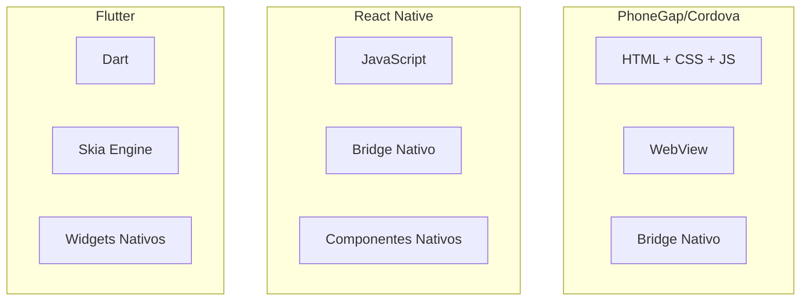
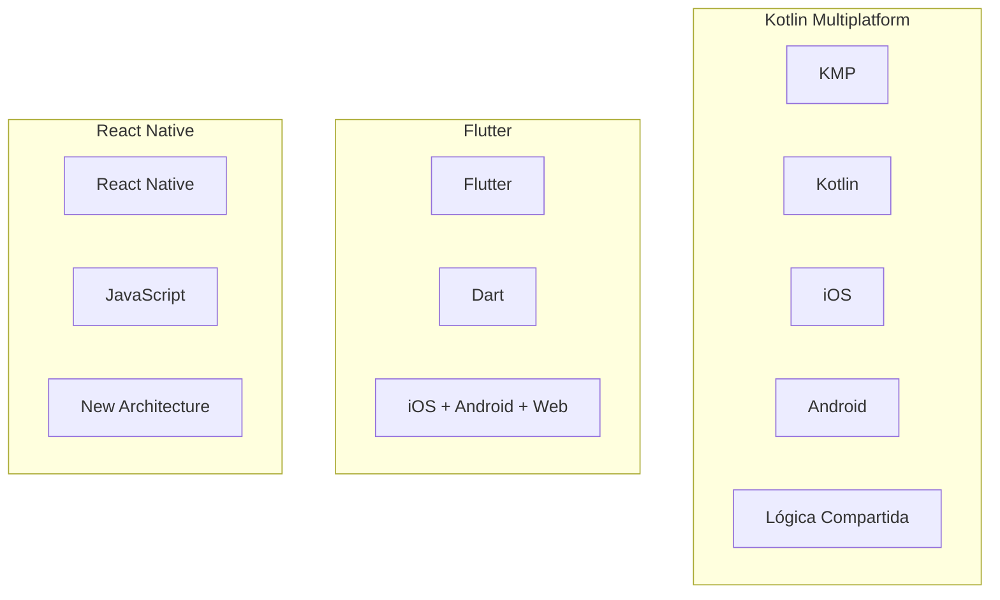
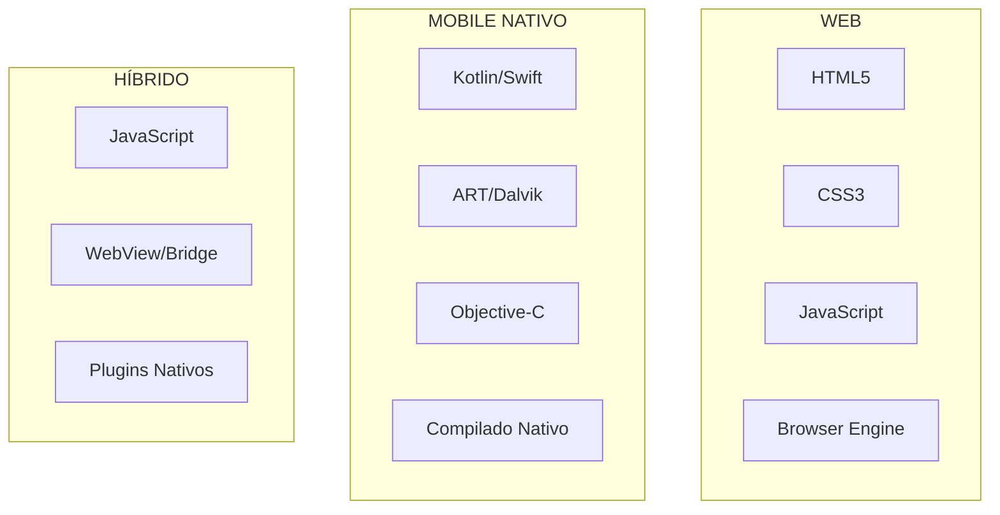
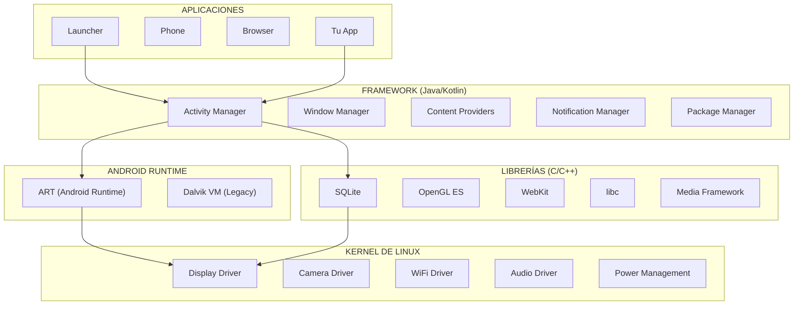
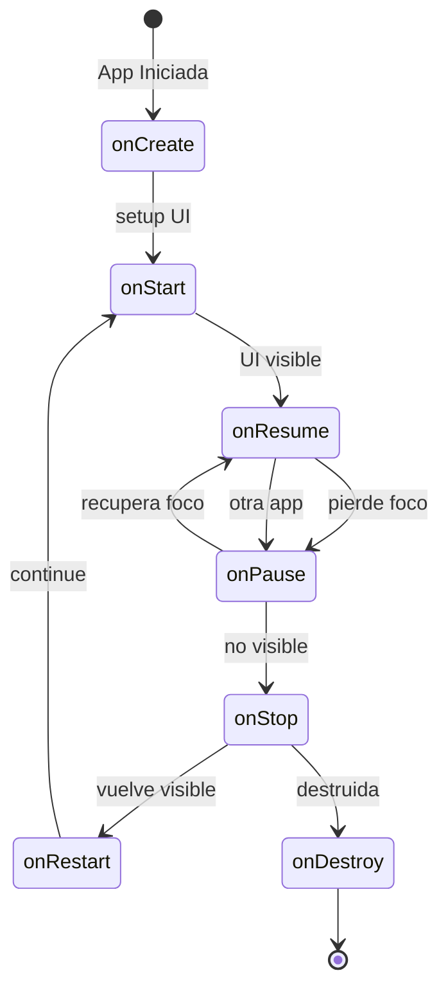
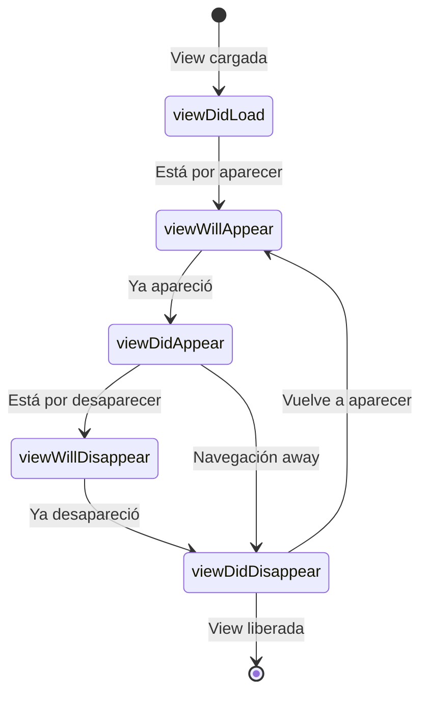
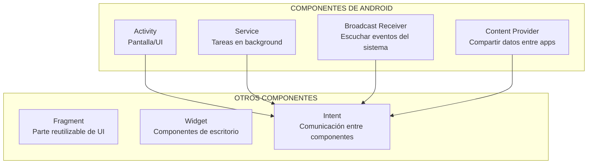
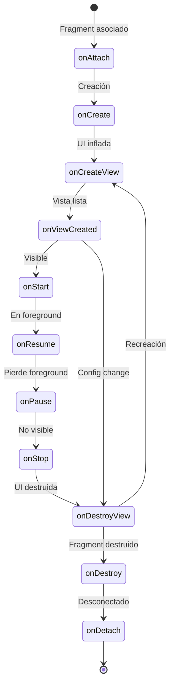

# 📱 Clase 02: Fundamentos del Desarrollo Mobile (Cont)

**Objetivo:** Dominar fundamentos de Android, iOS, ciclos de vida, componentes, APIs y arquitectura  


---

## Tabla de Contenidos

1. [Evolución de la Programación Mobile](#1-evoluci%C3%B3n-de-la-programaci%C3%B3n-mobile)
2. [Diferencias: Web vs Mobile vs Apps Híbridas](#2-diferencias-web-vs-mobile-vs-apps-h%C3%ADbridas)
3. [Arquitectura de Android](#3-arquitectura-de-android)
4. [Ciclo de Vida de Android](#4-ciclo-de-vida-de-android)
5. [Ciclo de Vida de iOS](#5-ciclo-de-vida-de-ios)
6. [Comparativa: Android vs iOS](#6-comparativa-android-vs-ios)
7. [Componentes Principales de Android](#7-componentes-principales-de-android)
8. [Services y IntentService](#8-services-y-intentservice)
9. [Clases Base Recomendadas](#9-clases-base-recomendadas)
10. [Comunicación con APIs](#10-comunicaci%C3%B3n-con-apis)
11. [Estructura de Proyectos](#11-estructura-de-proyectos)
12. [Instalación y Configuración de Android Studio](#12-instalaci%C3%B3n-y-configuraci%C3%B3n-de-android-studio)
13. [Ejemplo Práctico Completo](#13-ejemplo-pr%C3%A1ctico-completo)

---

## 1. Evolución de la Programación Mobile

### Línea de Tiempo

```mermaid
graph LR
    A["2007<br/>iPhone SDK"] --> B["2008<br/>Android SDK"]
    B --> C["2010<br/>PhoneGap/Cordova"]
    C --> D["2013<br/>React Native Preview"]
    D --> E["2015<br/>React Native 1.0"]
    E --> F["2016<br/>Flutter Preview"]
    F --> G["2017<br/>Kotlin<br/>Oficial Android"]
    G --> H["2018<br/>Flutter 1.0"]
    H --> I["2019<br/>Jetpack Compose"]
    I --> J["2021<br/>Compose 1.0"]
    J --> K["2024<br/>Kotlin Multiplatform"]
    K --> L["2025<br/>Compose Multiplatform"]
    
    style A fill:#e3f2fd
    style B fill:#e8f5e9
    style E fill:#fff3e0
    style G fill:#fce4ec
    style I fill:#e1f5ff
    style K fill:#f3e5f5
```



### Generación 1: Apps Nativas (2007-2012)

| Característica | iOS | Android |
|----------------|-----|---------|
| **Lenguaje** | Objective-C | Java |
| **IDE** | Xcode | Eclipse + ADT |
| **UI** | UIKit | XML + Views |
| **Distribución** | App Store | Google Play |
| **Pros** | Performance máxima | Mercado más grande |
| **Contras** | Solo Apple | Fragmentación de dispositivos |

### Generación 2: Apps Híbridas (2013-2018)



**Frameworks híbridos populares:**

| Framework | Lenguaje | Renderizado | Performance |
|-----------|----------|-------------|-------------|
| **Ionic** | TypeScript | WebView | Media |
| **PhoneGap** | JavaScript | WebView | Baja |
| **React Native** | JavaScript | Nativo | Alta |
| **Flutter** | Dart | Skia | Muy Alta |
| **Xamarin** | C# | Nativo | Alta |

### Generación 3: Desarrollo Multiplataforma (2019-Actual)




**Flutter** es un "framework" (un conjunto de herramientas) de código abierto creado por **Google**. Su objetivo principal es permitir a los desarrolladores crear aplicaciones para múltiples plataformas usando **un solo código base**.

En lugar de escribir una app en Swift para iOS y otra en Java/Kotlin para Android, con Flutter escribes una sola vez y funciona en ambos, además de en la web y el escritorio (Windows, macOS, Linux).

---

### Las 3 claves que definen a Flutter

#### 1. El lenguaje: Dart
Flutter no usa JavaScript. Utiliza **Dart**, un lenguaje también creado por Google que es fácil de aprender si vienes de Java, C# o JavaScript. Está diseñado para que las aplicaciones sean rápidas y las animaciones fluidas (a 60 o 120 FPS).

#### 2. Todo es un "Widget"
En Flutter, la interfaz de usuario se construye como si fueran piezas de LEGO. Un botón es un widget, un margen (padding) es un widget, e incluso la alineación es un widget. Los vas anidando para crear pantallas complejas.


#### 3. Hot Reload (Recarga rápida)
Esta es la función favorita de los programadores. Te permite hacer un cambio en el código y verlo reflejado en el simulador o el teléfono en menos de un segundo **sin perder el estado de la app** (por ejemplo, si estabas en un formulario, no se borra lo que escribiste).

---

### Diferencia con otras tecnologías

| Característica | Flutter | React Native | Nativo (Swift/Kotlin) |
| :--- | :--- | :--- | :--- |
| **Rendimiento** | Casi nativo (muy fluido) | Bueno (usa un "puente") | Máximo |
| **Lenguaje** | Dart | JavaScript | Swift / Kotlin |
| **Interfaz** | Propia (se ve igual en todo) | Usa componentes del sistema | Usa componentes del sistema |
| **Curva de aprendizaje** | Media | Baja (si sabes JS) | Alta (dos lenguajes) |


---

### ¿Por qué deberías usarlo?
* **Velocidad de desarrollo:** Creas apps para dos tiendas (App Store y Play Store) en la mitad de tiempo.
* **Diseño hermoso:** Al no depender de los botones estándar de Android o iOS, tienes control total sobre cada píxel de la pantalla.
* **Gran comunidad:** Es actualmente uno de los frameworks más populares del mundo, por lo que hay muchísima ayuda en internet.


### Estadísticas del Mercado (2024)

```
┌─────────────────────────────────────────────────────────────────┐
│                    Distribución de Mercado                       │
├─────────────────────────────────────────────────────────────────┤
│  Android     ████████████████████████████████████░░░  71.8%    │
│  iOS          █████████████████████░░░░░░░░░░░░░░░░  27.4%    │
│  Otros        █░░░░░░░░░░░░░░░░░░░░░░░░░░░░░░░░░░░   0.8%    │
└─────────────────────────────────────────────────────────────────┘

┌─────────────────────────────────────────────────────────────────┐
│              Frameworks Multiplataforma Preferidos               │
├─────────────────────────────────────────────────────────────────┤
│  React Native     ████████████████████████████████░░░  38%     │
│  Flutter          ████████████████████████████████████  42%     │
│  Kotlin Multi     ████████░░░░░░░░░░░░░░░░░░░░░░░░░  12%     │
│  Otros            ████████░░░░░░░░░░░░░░░░░░░░░░░░░   8%     │
└─────────────────────────────────────────────────────────────────┘
```

---

## 2. Diferencias: Web vs Mobile vs Apps Híbridas

### Comparativa Técnica



### Tabla Comparativa

| Característica | Web App | PWA | Híbrida | Nativa |
|----------------|---------|-----|---------|--------|
| **Acceso a hardware** | Limitado | Medio | Alto | Total |
| **Performance** | ⭐⭐ | ⭐⭐⭐ | ⭐⭐⭐ | ⭐⭐⭐⭐⭐ |
| **Offline** | No | Parcial | Sí | Sí |
| **Notificaciones** | No | Sí | Sí | Sí |
| **Instalación** | No | Opcional | Sí | Sí |
| **App Store** | No | No | Sí | Sí |
| **Desarrollo** | $ | $$ | $$$ | $$$$ |
| **Tiempo de desarrollo** | Rápido | Rápido | Medio | Lento |

### Casos de Uso Ideales

```
┌─────────────────────────────────────────────────────────────────┐
│                         ÁRBOL DE DECISIÓN                        │
├─────────────────────────────────────────────────────────────────┤
│                                                                  │
│  ¿Necesita acceso profundo al hardware?                          │
│  ├── NO → ¿Necesita estar en App Store?                         │
│  │         ├── NO → PWA ✅                                       │
│  │         └── SÍ → ¿Tiempo limitado?                            │
│  │                   ├── SÍ → React Native ✅                     │
│  │                   └── NO → Nativo ✅                          │
│  └── SÍ → ¿Performance crítica?                                 │
│            ├── SÍ → ¿Grafico 3D/Juegos?                         │
│            │         └── SÍ → Nativo (Unity/Unreal) ✅          │
│            └── NO → Nativo ✅                                    │
│                                                                  │
└─────────────────────────────────────────────────────────────────┘
```

### Ejemplo: ¿Qué tecnología elegir?

| Proyecto | Tecnología Recomendada | Razón |
|----------|----------------------|-------|
| **App bancaria** | Nativa (Kotlin/Swift) | Seguridad, performance |
| **Red social** | React Native/Flutter | Desarrollo rápido, buena UX |
| **Catálogo simple** | PWA | Bajo costo, web |
| **Juego 3D** | Nativa (Unity) | Performance gráfica |
| **MVP startup** | React Native | Tiempo de mercado |

---

## 3. Arquitectura de Android

### Capas de Android



### Componentes del Sistema

```
┌─────────────────────────────────────────────────────────────────┐
│                      ARQUITECTURA DE ANDROID                     │
│                                                                   │
│    ┌─────────────┐   ┌─────────────┐   ┌─────────────┐           │
│    │  APLICACIÓN │   │  APLICACIÓN │   │    SISTEMA  │           │
│    │    (App)    │   │   (App)     │   │   (System)  │           │
│    └──────┬──────┘   └──────┬──────┘   └──────┬──────┘           │
│           │                │                │                   │
│    ┌──────┴────────────────┴────────────────┴──────┐           │
│    │              ANDROID FRAMEWORK                 │           │
│    │  ┌──────────┐ ┌──────────┐ ┌──────────────────┐ │           │
│    │  │Activity  │ │ Service  │ │Content Provider  │ │           │
│    │  │ Manager  │ │ Manager  │ │                  │ │           │
│    │  └──────────┘ └──────────┘ └──────────────────┘ │           │
│    └──────────────────────┬───────────────────────────┘           │
│                           │                                       │
│    ┌──────────────────────┴───────────────────────────┐          │
│    │              NATIVE LIBRARIES                     │          │
│    │  ┌────────┐ ┌────────┐ ┌────────┐ ┌────────┐    │          │
│    │  │OpenGL  │ │SQLite  │ │ libc   │ │Media   │    │          │
│    │  └────────┘ └────────┘ └────────┘ └────────┘    │          │
│    └──────────────────────┬───────────────────────────┘          │
│                           │                                       │
│    ┌──────────────────────┴───────────────────────────┐          │
│    │              ANDROID RUNTIME (ART)                │          │
│    │  ┌──────────────────────────────────────────┐     │          │
│    │  │  Core Libraries (Java/Kotlin)            │     │          │
│    │  │  • java.lang.*                            │     │          │
│    │  │  • android.app.*                         │     │          │
│    │  │  • android.os.*                          │     │          │
│    │  └──────────────────────────────────────────┘     │          │
│    └──────────────────────┬───────────────────────────┘          │
│                           │                                       │
│    ┌──────────────────────┴───────────────────────────┐          │
│    │              LINUX KERNEL                        │          │
│    │  Display │ Camera │ WiFi │ Bluetooth │ Audio     │          │
│    └──────────────────────────────────────────────────┘          │
└─────────────────────────────────────────────────────────────────┘
```

---

## 4. Ciclo de Vida de Android

### Diagrama Completo del Ciclo de Vida



### Estados de la Activity

```
┌─────────────────────────────────────────────────────────────────┐
│                   ESTADOS DE UNA ACTIVITY                        │
│                                                                   │
│  ┌─────────────────────────────────────────────────────────────┐ │
│  │                    ACTIVITY CREADA                         │ │
│  │  onCreate() → onStart() → onResume()                       │ │
│  │                                                              │ │
│  │  ████████████████████████████████████████████  100%        │ │
│  │                                                              │ │
│  │  ✓ UI visible                                               │ │
│  │  ✓ Usuario puede interactuar                                │ │
│  │  ✓ Máxima prioridad en memoria                              │ │
│  └─────────────────────────────────────────────────────────────┘ │
│                              │                                   │
│                              ▼                                   │
│  ┌─────────────────────────────────────────────────────────────┐ │
│  │              ACTIVITY EN SEGUNDO PLANO                      │ │
│  │  onPause() → onStop()                                      │ │
│  │                                                              │ │
│  │  ████████████████████░░░░░░░░░░░░░░░░░░░░░░░░░  60%        │ │
│  │                                                              │ │
│  │  ⚠ UI parcialmente visible (diálogos)                      │ │
│  │  ⚠ Guardar estado crítico                                  │ │
│  │  ⚠ Pausar animaciones/actualizaciones                      │ │
│  └─────────────────────────────────────────────────────────────┘ │
│                              │                                   │
│                              ▼                                   │
│  ┌─────────────────────────────────────────────────────────────┐ │
│  │                  ACTIVITY DESTRUIDA                        │ │
│  │  onStop() → onDestroy()                                   │ │
│  │                                                              │ │
│  │  ████████████████░░░░░░░░░░░░░░░░░░░░░░░░░░░  30%        │ │
│  │                                                              │ │
│  │  ✗ UI no visible                                            │ │
│  │  ✗ Recursos liberados                                       │ │
│  │  ✗ Puede ser eliminada por sistema                          │ │
│  └─────────────────────────────────────────────────────────────┘ │
└─────────────────────────────────────────────────────────────────┘
```

### Métodos del Ciclo de Vida - Detalle Completo

| Método | Cuándo se llama | Qué hacer aquí | Frecuencia |
|--------|-----------------|----------------|------------|
| `onCreate()` | Primera creación | Inicializar variables, inflar UI, setContentView | **UNA VEZ** |
| `onStart()` | Activity visible | Iniciar animaciones, registrar receivers | Varias veces |
| `onResume()` | Activity en foreground | Reanudar cámara, sensores, animaciones | Varias veces |
| `onPause()` | Pierde foreground | Pausar animaciones, guardar estado | Varias veces |
| `onStop()` | No visible | Liberar recursos pesados, desregistrar | Varias veces |
| `onDestroy()` | Antes de destruir | Limpiar recursos finales | Una vez |
| `onRestart()` | Después de onStop | Restaurar estado | Después de stop |

### Ejemplo de Código - Activity Completa

```kotlin
class MainActivity : AppCompatActivity() {

    private val TAG = "MainActivity"
    
    override fun onCreate(savedInstanceState: Bundle?) {
        super.onCreate(savedInstanceState)
        setContentView(R.layout.activity_main)
        
        Log.d(TAG, "onCreate: Activity creada")
        // 1. Inflar layouts
        // 2. Inicializar vistas
        // 3. Configurar listeners
        // 4. Preparar datos iniciales
    }
    
    override fun onStart() {
        super.onStart()
        Log.d(TAG, "onStart: Activity visible")
        // 1. Iniciar animaciones de entrada
        // 2. Registrar observers
    }
    
    override fun onResume() {
        super.onResume()
        Log.d(TAG, "onResume: En foreground")
        // 1. Reanudar sensores/cámara
        // 2. Iniciar actualizaciones de UI
        // 3. Reanudar juego/multimedia
    }
    
    override fun onPause() {
        super.onPause()
        Log.d(TAG, "onPause: Pierde foreground")
        // 1. Pausar animaciones
        // 2. Guardar datos no guardados
        // 3. Pausar multimedia
    }
    
    override fun onStop() {
        super.onStop()
        Log.d(TAG, "onStop: No visible")
        // 1. Liberar recursos de red
        // 2. Desregistrar broadcast receivers
        // 3. Detener location updates
    }
    
    override fun onDestroy() {
        super.onDestroy()
        Log.d(TAG, "onDestroy: Siendo destruida")
        // 1. Liberar recursos finales
        // 2. Cancelar coroutines
        // 3. Cerrar base de datos
    }
    
    override fun onRestart() {
        super.onRestart()
        Log.d(TAG, "onRestart: Volviendo a visible")
        // 1. Restaurar estado
    }
    
    override fun onSaveInstanceState(outState: Bundle) {
        super.onSaveInstanceState(outState)
        outState.putString("usuario_nombre", "Juan")
        outState.putInt("contador", 42)
        Log.d(TAG, "onSaveInstanceState: Estado guardado")
    }
    
    override fun onRestoreInstanceState(savedInstanceState: Bundle) {
        super.onRestoreInstanceState(savedInstanceState)
        val nombre = savedInstanceState.getString("usuario_nombre")
        val contador = savedInstanceState.getInt("contador")
        Log.d(TAG, "onRestoreInstanceState: Estado restaurado - $nombre, $contador")
    }
}
```

### onSaveInstanceState - Cuándo y Por Qué

```
┌─────────────────────────────────────────────────────────────────┐
│                  CUÁNDO SE GUARDA EL ESTADO                      │
│                                                                   │
│  ✓ Rotación de pantalla                                          │
│  ✓ Cambio de idioma                                              │
│  ✓ Teclado aparece/desaparece                                    │
│  ✓ Multi-window mode                                             │
│  ✓ App va a background (en algunos casos)                        │
│                                                                   │
│  ✗ Presionar botón BACK                                          │
│  ✗ finish() llamado explícitamente                               │
│  ✗ Cambios de configuración menores                              │
│                                                                   │
└─────────────────────────────────────────────────────────────────┘
```

```kotlin
// Ejemplo de guardado de estado
class MiActivity : AppCompatActivity() {
    
    private var textoUsuario: String = ""
    private var posicionScroll: Int = 0
    
    override fun onSaveInstanceState(outState: Bundle) {
        super.onSaveInstanceState(outState)
        
        // Guardar estado
        outState.putString("texto_usuario", textoUsuario)
        outState.putInt("posicion_scroll", posicionScroll)
    }
    
    override fun onRestoreInstanceState(savedInstanceState: Bundle) {
        super.onRestoreInstanceState(savedInstanceState)
        
        // Restaurar estado
        textoUsuario = savedInstanceState.getString("texto_usuario", "")
        posicionScroll = savedInstanceState.getInt("posicion_scroll", 0)
        
        // Aplicar a la UI
        editText.setText(textoUsuario)
        scrollView.scrollTo(0, posicionScroll)
    }
}
```

---

## 5. Ciclo de Vida de iOS

### Estados del ViewController



### Estados de la Aplicación iOS

```
┌─────────────────────────────────────────────────────────────────┐
│                    APP LIFECYCLE EN iOS                          │
│                                                                   │
│  ┌─────────────────────────────────────────────────────────────┐ │
│  │                    NOT RUNNING                              │ │
│  │  App no ha sido iniciada o fue terminada completamente     │ │
│  └─────────────────────────────────────────────────────────────┘ │
│                              │                                   │
│                              ▼                                   │
│  ┌─────────────────────────────────────────────────────────────┐ │
│  │                    INACTIVE                                  │ │
│  │  App en foreground pero no recibiendo eventos               │ │
│  │  • Llamada entrante                                          │ │
│  │  • Notification center                                       │ │
│  │  • Alertas del sistema                                       │ │
│  └─────────────────────────────────────────────────────────────┘ │
│                              │                                   │
│                              ▼                                   │
│  ┌─────────────────────────────────────────────────────────────┐ │
│  │                     ACTIVE                                   │ │
│  │  App en foreground y recibiendo eventos                     │ │
│  │  Estado normal de ejecución                                  │ │
│  └─────────────────────────────────────────────────────────────┘ │
│                              │                                   │
│                              ▼                                   │
│  ┌─────────────────────────────────────────────────────────────┐ │
│  │                    BACKGROUN                                 │ │
│  │  App en background, no visible                              │ │
│  │  • Ejecución limitada                                       │ │
│  │  • 30 segundos para completar tareas                         │ │
│  │  • Background tasks disponibles                             │ │
│  └─────────────────────────────────────────────────────────────┘ │
│                              │                                   │
│                              ▼                                   │
│  ┌─────────────────────────────────────────────────────────────┐ │
│  │                   SUSPENDED                                  │ │
│  │  App en memoria pero no ejecutando código                   │ │
│  │  • Preparada para ser terminada si hay poca memoria         │ │
│  └─────────────────────────────────────────────────────────────┘ │
└─────────────────────────────────────────────────────────────────┘
```

### Métodos del AppDelegate

```swift
import UIKit

class AppDelegate: UIResponder, UIApplicationDelegate {

    func application(
        _ application: UIApplication,
        didFinishLaunchingWithOptions launchOptions: [UIApplication.LaunchOptionsKey: Any]?
    ) -> Bool {
        print("✅ App va a iniciar")
        // 1. Configurar appearance
        // 2. Inicializar servicios
        // 3. Configurar analytics
        return true
    }

    func applicationWillEnterForeground(_ application: UIApplication) {
        print("📱 App va a entrar en foreground")
        // 1. Refrescar datos
        // 2. Reanudar animaciones
    }

    func applicationDidBecomeActive(_ application: UIApplication) {
        print("🎯 App está activa")
        // 1. Reanudar tareas
        // 2. Resetear estado de badges
    }

    func applicationWillResignActive(_ application: UIApplication) {
        print("⏸️ App va a perder actividad")
        // 1. Guardar estado
        // 2. Pausar tareas
    }

    func applicationDidEnterBackground(_ application: UIApplication) {
        print("🔵 App entró en background")
        // 1. Guardar datos
        // 2. Liberar recursos compartidos
    }

    func applicationWillTerminate(_ application: UIApplication) {
        print("❌ App va a terminar")
        // 1. Guardado final
        // 2. Cleanup
    }
}
```

### Métodos del ViewController

```swift
class ViewController: UIViewController {

    // MARK: - Lifecycle Methods

    override func viewDidLoad() {
        super.viewDidLoad()
        print("📦 viewDidLoad: Vista cargada en memoria")
        // 1. Configurar UI
        // 2. Inicializar datos
        // 3. Configurar observers
    }

    override func viewWillAppear(_ animated: Bool) {
        super.viewWillAppear(animated)
        print("👁️ viewWillAppear: Vista está por aparecer")
        // 1. Preparar animaciones de entrada
    }

    override func viewDidAppear(_ animated: Bool) {
        super.viewDidAppear(animated)
        print("👀 viewDidAppear: Vista ya apareció")
        // 1. Iniciar animaciones
        // 2. Comenzar tracking
    }

    override func viewWillDisappear(_ animated: Bool) {
        super.viewWillDisappear(animated)
        print("👋 viewWillDisappear: Vista está por desaparecer")
        // 1. Guardar cambios pendientes
        // 2. Detener animaciones
    }

    override func viewDidDisappear(_ animated: Bool) {
        super.viewDidDisappear(animated)
        print("👋 viewDidDisappear: Vista ya desapareció")
        // 1. Liberar recursos si no son necesarios
    }

    override func viewWillLayoutSubviews() {
        super.viewWillLayoutSubviews()
        print("📐 viewWillLayoutSubviews: Layout va a calcular")
    }

    override func viewDidLayoutSubviews() {
        super.viewDidLayoutSubviews()
        print("📐 viewDidLayoutSubviews: Layout calculado")
    }
}
```

---

## 6. Comparativa Android vs iOS

### Tabla Comparativa Detallada

| Aspecto | Android | iOS |
|---------|---------|-----|
| **Lenguaje** | Kotlin (principal), Java | Swift (principal), Objective-C |
| **IDE** | Android Studio | Xcode |
| **UI Framework** | XML + Views, Jetpack Compose | UIKit, SwiftUI |
| **Arquitectura** | MVVM, MVP, Clean Architecture | MVC, MVVM, VIPER |
| **DI Framework** | Hilt, Koin, Dagger | Swinject |
| **Navegación** | Jetpack Navigation | UINavigationController, SwiftUI Navigation |
| **Persistencia** | Room, SharedPreferences, DataStore | CoreData, UserDefaults |
| **Networking** | Retrofit, OkHttp | URLSession |
| **Gráficos** | Canvas, OpenGL, Vulkan | Metal, Core Animation |
| **Distribución** | Google Play, APK directa | App Store, TestFlight |

### Comparación de Ciclos de Vida

```
┌────────────────────────────────────────────────────────────────────────┐
│                    COMPARACIÓN DE CICLOS DE VIDA                       │
├────────────────────────────────────────────────────────────────────────┤
│                                                                         │
│  ANDROID                          │  iOS                                │
│  ────────                         │  ───                                │
│                                   │                                     │
│  onCreate()                       │  viewDidLoad()                     │
│      │                            │      │                             │
│      ▼                            │      ▼                             │
│  onStart()                        │  viewWillAppear()                  │
│      │                            │      │                             │
│      ▼                            │      ▼                             │
│  onResume() ◄──────────────────────│  viewDidAppear()                   │
│      │                            │      │                             │
│      │   [ACTIVE/IN FOREGROUND]   │      │   [ACTIVE]                   │
│      │                            │      │                             │
│  onPause() ◄──────────────────────│  viewWillDisappear()               │
│      │                            │      │                             │
│      ▼                            │      ▼                             │
│  onStop()                         │  viewDidDisappear()                │
│      │                            │      │                             │
│      │   [BACKGROUND]             │      │   [BACKGROUND/SUSPENDED]     │
│      │                            │      │                             │
│  onDestroy()                      │  (dealloc)                         │
│                                   │                                     │
└────────────────────────────────────────────────────────────────────────┘
```

### Diferencias en Comportamiento

| Escenario | Android | iOS |
|-----------|---------|-----|
| **Rotación de pantalla** | `onPause()` → `onStop()` → `onCreate()` | `viewWillDisappear()` → `viewDidDisappear()` → recalcula layout |
| **Ir a background** | `onPause()` → `onStop()` | `viewWillDisappear()` → appWillResign → appDidEnterBackground |
| **Volver a foreground** | `onRestart()` → `onStart()` → `onResume()` | `viewWillAppear()` → `viewDidAppear()` |
| **Memoria baja** | `onLowMemory()` | `didReceiveMemoryWarning()` |
| **Configuración cambia** | `onConfigurationChanged()` | Recrea la vista automáticamente |

---

## 7. Componentes Principales de Android

### Los 4 Componentes Fundamentales



### 1. Activity

```kotlin
class MainActivity : AppCompatActivity() {
    
    override fun onCreate(savedInstanceState: Bundle?) {
        super.onCreate(savedInstanceState)
        setContentView(R.layout.activity_main)
    }
}
```

### 2. Service

```kotlin
class MiServicio : Service() {
    
    override fun onCreate() {
        super.onCreate()
        Log.d("Servicio", "Creado")
    }
    
    override fun onStartCommand(intent: Intent?, flags: Int, startId: Int): Int {
        Log.d("Servicio", "Iniciado")
        
        // Trabajo en background
        thread {
            // hacer algo
        }
        
        return START_STICKY
    }
    
    override fun onBind(intent: Intent?): IBinder? = null
    
    override fun onDestroy() {
        super.onDestroy()
        Log.d("Servicio", "Destruido")
    }
}
```

### 3. Broadcast Receiver

```kotlin
class MiReceiver : BroadcastReceiver() {
    
    override fun onReceive(context: Context?, intent: Intent?) {
        when (intent?.action) {
            Intent.ACTION_BOOT_COMPLETED -> {
                Log.d("Receiver", "Sistema iniciado")
            }
            "com.miapp.MI_ACCION" -> {
                val datos = intent.getStringExtra("dato")
                Log.d("Receiver", "Datos recibidos: $datos")
            }
        }
    }
}
```

### 4. Content Provider

```kotlin
class MiProvider : ContentProvider() {
    
    override fun onCreate(): Boolean = true
    
    override fun query(
        uri: Uri,
        projection: Array<String>?,
        selection: String?,
        selectionArgs: Array<String>?,
        sortOrder: String?
    ): Cursor? {
        // Consultar datos
        return null
    }
    
    override fun getType(uri: Uri): String? = null
    
    override fun insert(uri: Uri, values: ContentValues?): Uri? = null
    
    override fun delete(uri: Uri, selection: String?, selectionArgs: Array<String>?): Int = 0
    
    override fun update(
        uri: Uri,
        values: ContentValues?,
        selection: String?,
        selectionArgs: Array<String>?
    ): Int = 0
}
```

### 5. Fragment

```kotlin
class HomeFragment : Fragment() {
    
    private var _binding: FragmentHomeBinding? = null
    private val binding get() = _binding!!
    
    override fun onCreateView(
        inflater: LayoutInflater,
        container: ViewGroup?,
        savedInstanceState: Bundle?
    ): View {
        _binding = FragmentHomeBinding.inflate(inflater, container, false)
        return binding.root
    }
    
    override fun onViewCreated(view: View, savedInstanceState: Bundle?) {
        super.onViewCreated(view, savedInstanceState)
        binding.btnClick.setOnClickListener {
            Toast.makeText(context, "Click!", Toast.LENGTH_SHORT).show()
        }
    }
    
    override fun onDestroyView() {
        super.onDestroyView()
        _binding = null
    }
}
```

### Ciclo de Vida de Fragment



---

## 8. Services y IntentService

### Tipos de Services

```
┌─────────────────────────────────────────────────────────────────┐
│                        TIPOS DE SERVICES                         │
│                                                                   │
│  ┌─────────────────────────────────────────────────────────────┐ │
│  │                    FOREGROUND SERVICE                        │ │
│  │  • Notificación persistente                                 │ │
│  │  • Para tareas críticas (música, GPS)                      │ │
│  │  • No es killable fácilmente                               │ │
│  └─────────────────────────────────────────────────────────────┘ │
│                                                                 │
│  ┌─────────────────────────────────────────────────────────────┐ │
│  │                   BACKGROUND SERVICE                        │ │
│  │  • Tareas no críticas                                      │ │
│  │  • Puede ser killable por sistema                         │ │
│  │  • Desde Android 8+, con restricciones                     │ │
│  └─────────────────────────────────────────────────────────────┘ │
│                                                                 │
│  ┌─────────────────────────────────────────────────────────────┐ │
│  │                      BOUND SERVICE                          │ │
│  │  • Vinculado a una Activity                               │ │
│  │  • Se destruye cuando la Activity se destruye              │ │
│  │  • Comunicación mediante IBinder                           │ │
│  └─────────────────────────────────────────────────────────────┘ │
│                                                                 │
│  ┌─────────────────────────────────────────────────────────────┐ │
│  │                    JOB INTENTSERVICE                        │ │
│  │  • (Deprecated) Service con cola de intents                │ │
│  │  • Creado para tareas asíncronas                           │ │
│  │  • Ahora se usa WorkManager                               │ │
│  └─────────────────────────────────────────────────────────────┘ │
└─────────────────────────────────────────────────────────────────┘
```

### Foreground Service

```kotlin
class MusicaService : Service() {

    private var mediaPlayer: MediaPlayer? = null
    
    override fun onCreate() {
        super.onCreate()
        mediaPlayer = MediaPlayer.create(this, R.raw.cancion)
    }
    
    override fun onStartCommand(intent: Intent?, flags: Int, startId: Int): Int {
        when (intent?.action) {
            ACTION_PLAY -> startMusica()
            ACTION_STOP -> stopMusica()
        }
        return START_STICKY
    }
    
    private fun startMusica() {
        mediaPlayer?.start()
        
        // Crear notificación foreground
        val notification = NotificationCompat.Builder(this, CHANNEL_ID)
            .setContentTitle("Reproduciendo música")
            .setContentText("Artista - Canción")
            .setSmallIcon(R.drawable.ic_music)
            .setPriority(NotificationCompat.PRIORITY_LOW)
            .setOngoing(true)
            .build()
        
        // Iniciar como foreground
        startForeground(NOTIFICATION_ID, notification)
    }
    
    private fun stopMusica() {
        mediaPlayer?.stop()
        stopForeground(STOP_FOREGROUND_REMOVE)
        stopSelf()
    }
    
    override fun onBind(intent: Intent?): IBinder? = null
    
    override fun onDestroy() {
        mediaPlayer?.release()
        super.onDestroy()
    }
    
    companion object {
        const val ACTION_PLAY = "com.app.action.PLAY"
        const val ACTION_STOP = "com.app.action.STOP"
        const val CHANNEL_ID = "musica_channel"
        const val NOTIFICATION_ID = 1
    }
}
```

### IntentService (Deprecated - Usar WorkManager)

```kotlin
// ⚠️ DEPRECATED - Usar WorkManager en su lugar

class MiIntentService : IntentService("MiIntentService") {
    
    override fun onHandleIntent(intent: Intent?) {
        when (intent?.action) {
            ACTION_SYNC -> sincronizarDatos()
            ACTION_UPLOAD -> subirArchivo()
        }
    }
    
    private fun sincronizarDatos() {
        // Tarea en background
        // Se ejecuta en un hilo separado
        // Se autodestruye al terminar
    }
    
    private fun subirArchivo() {
        val archivo = intent.getStringExtra("archivo")
        // Subir archivo
    }
    
    companion object {
        const val ACTION_SYNC = "com.app.action.SYNC"
        const val ACTION_UPLOAD = "com.app.action.UPLOAD"
    }
}
```

### WorkManager (Reemplazo Moderno)

```kotlin
class MiWorker(
    context: Context,
    params: WorkerParameters
) : CoroutineWorker(context, params) {

    override suspend fun doWork(): Result {
        return try {
            // Trabajo en background
            sincronizarDatos()
            Result.success()
        } catch (e: Exception) {
            if (runAttemptCount < 3) {
                Result.retry()
            } else {
                Result.failure()
            }
        }
    }
    
    private suspend fun sincronizarDatos() {
        // Tarea asíncrona con coroutines
    }
}

// Ejecutar el worker
class MainActivity : AppCompatActivity() {
    
    fun iniciarSincronizacion() {
        val constraints = Constraints.Builder()
            .setRequiredNetworkType(NetworkType.CONNECTED)
            .setRequiresBatteryNotLow(true)
            .build()
        
        val syncRequest = OneTimeWorkRequestBuilder<MiWorker>()
            .setConstraints(constraints)
            .build()
        
        WorkManager.getInstance(this)
            .enqueue(syncRequest)
    }
}
```

### Bound Service con IBinder

```kotlin
class MiBoundService : Service() {
    
    private val binder = MiBinder()
    private var datos = mutableListOf<String>()
    
    inner class MiBinder : Binder() {
        fun getService(): MiBoundService = this@MiBoundService
    }
    
    fun agregarDato(dato: String) {
        datos.add(dato)
    }
    
    fun obtenerDatos(): List<String> = datos.toList()
    
    override fun onBind(intent: Intent?): IBinder = binder
}

// Usar en Activity
class MainActivity : AppCompatActivity() {
    
    private var miServicio: MiBoundService? = null
    private var conectado = false
    
    private val conexion = object : ServiceConnection {
        override fun onServiceConnected(name: ComponentName?, service: IBinder?) {
            val binder = service as MiBoundService.MiBinder
            miServicio = binder.getService()
            conectado = true
        }
        
        override fun onServiceDisconnected(name: ComponentName?) {
            miServicio = null
            conectado = false
        }
    }
    
    override fun onStart() {
        super.onStart()
        Intent(this, MiBoundService::class.java).also { intent ->
            bindService(intent, conexion, Context.BIND_AUTO_CREATE)
        }
    }
    
    override fun onStop() {
        super.onStop()
        if (conectado) {
            unbindService(conexion)
            conectado = false
        }
    }
}
```

---

## 9. Clases Base Recomendadas

### Android

```kotlin
// Activity Base
abstract class BaseActivity : AppCompatActivity() {
    
    abstract val layoutId: Int
    
    override fun onCreate(savedInstanceState: Bundle?) {
        super.onCreate(savedInstanceState)
        setContentView(layoutId)
        setupView()
        observeData()
    }
    
    abstract fun setupView()
    abstract fun observeData()
}

// Fragment Base
abstract class BaseFragment : Fragment() {
    
    private var _binding: ViewBinding? = null
    protected val binding get() = _binding!!
    
    abstract fun inflateBinding(inflater: LayoutInflater, container: ViewGroup?): ViewBinding
    
    override fun onCreateView(
        inflater: LayoutInflater,
        container: ViewGroup?,
        savedInstanceState: Bundle?
    ): View? {
        _binding = inflateBinding(inflater, container)
        return binding.root
    }
    
    override fun onViewCreated(view: View, savedInstanceState: Bundle?) {
        super.onViewCreated(view, savedInstanceState)
        setupView()
        observeData()
    }
    
    abstract fun setupView()
    abstract fun observeData()
    
    override fun onDestroyView() {
        super.onDestroyView()
        _binding = null
    }
}

// ViewModel Base
abstract class BaseViewModel : ViewModel() {
    
    protected val _isLoading = MutableLiveData<Boolean>()
    val isLoading: LiveData<Boolean> = _isLoading
    
    protected val _error = MutableLiveData<String?>()
    val error: LiveData<String?> = _error
    
    protected fun <T> safeCall(call: suspend () -> T): T? {
        return try {
            call()
        } catch (e: Exception) {
            _error.value = e.message
            null
        }
    }
}

// Repository Base
abstract class BaseRepository {
    
    protected suspend fun <T> handleResult(
        result: Result<T>
    ): T? {
        return result.getOrNull()
    }
}
```

### iOS

```swift
import UIKit

// UIViewController Base
class BaseViewController: UIViewController {
    
    override func viewDidLoad() {
        super.viewDidLoad()
        setupUI()
        setupBindings()
    }
    
    func setupUI() {
        // Override en subclases
    }
    
    func setupBindings() {
        // Override en subclases para MVVM
    }
}

// ViewModel Base (Protocol)
protocol ViewModelType {
    associatedtype Input
    associatedtype Output
    
    func transform(input: Input) -> Output
}

// Network Layer Base
class BaseNetworkService {
    
    func request<T: Decodable>(
        _ endpoint: Endpoint,
        completion: @escaping (Result<T, Error>) -> Void
    ) {
        // Implementación base
    }
}
```

---

## 10. Comunicación con APIs

### Retrofit - Cliente HTTP para Android

```kotlin
// 1. Definir API Service
interface ApiService {
    
    @GET("usuarios")
    suspend fun getUsuarios(): Response<List<Usuario>>
    
    @GET("usuarios/{id}")
    suspend fun getUsuario(@Path("id") id: Int): Response<Usuario>
    
    @POST("usuarios")
    suspend fun crearUsuario(@Body usuario: Usuario): Response<Usuario>
    
    @PUT("usuarios/{id}")
    suspend fun actualizarUsuario(
        @Path("id") id: Int,
        @Body usuario: Usuario
    ): Response<Usuario>
    
    @DELETE("usuarios/{id}")
    suspend fun eliminarUsuario(@Path("id") id: Int): Response<Unit>
    
    @FormUrlEncoded
    @POST("login")
    suspend fun login(
        @Field("email") email: String,
        @Field("password") password: String
    ): Response<AuthResponse>
}

// 2. Modelo de Datos
data class Usuario(
    val id: Int,
    val nombre: String,
    val email: String,
    val edad: Int? = null
)

data class AuthResponse(
    val token: String,
    val usuario: Usuario
)

// 3. Configurar Retrofit
object RetrofitClient {
    
    private const val BASE_URL = "https://api.example.com/v1/"
    
    private val loggingInterceptor = HttpLoggingInterceptor().apply {
        level = HttpLoggingInterceptor.Level.BODY
    }
    
    private val authInterceptor = Interceptor { chain ->
        val original = chain.request()
        val request = original.newBuilder()
            .header("Authorization", "Bearer ${getToken()}")
            .header("Content-Type", "application/json")
            .method(original.method, original.body)
            .build()
        chain.proceed(request)
    }
    
    private val client = OkHttpClient.Builder()
        .addInterceptor(loggingInterceptor)
        .addInterceptor(authInterceptor)
        .connectTimeout(30, TimeUnit.SECONDS)
        .readTimeout(30, TimeUnit.SECONDS)
        .writeTimeout(30, TimeUnit.SECONDS)
        .build()
    
    val api: ApiService = Retrofit.Builder()
        .baseUrl(BASE_URL)
        .client(client)
        .addConverterFactory(GsonConverterFactory.create())
        .build()
        .create(ApiService::class.java)
    
    private fun getToken(): String {
        return "token-del-usuario"
    }
}

// 4. Repository
class UsuarioRepository {
    
    private val api = RetrofitClient.api
    
    suspend fun getUsuarios(): Result<List<Usuario>> {
        return try {
            val response = api.getUsuarios()
            if (response.isSuccessful) {
                Result.success(response.body() ?: emptyList())
            } else {
                Result.failure(Exception("Error: ${response.code()}"))
            }
        } catch (e: Exception) {
            Result.failure(e)
        }
    }
    
    suspend fun crearUsuario(usuario: Usuario): Result<Usuario> {
        return try {
            val response = api.crearUsuario(usuario)
            if (response.isSuccessful) {
                Result.success(response.body()!!)
            } else {
                Result.failure(Exception("Error: ${response.code()}"))
            }
        } catch (e: Exception) {
            Result.failure(e)
        }
    }
}

// 5. ViewModel con Coroutines
class UsuarioViewModel(
    private val repository: UsuarioRepository
) : ViewModel() {
    
    private val _usuarios = MutableLiveData<List<Usuario>>()
    val usuarios: LiveData<List<Usuario>> = _usuarios
    
    private val _isLoading = MutableLiveData<Boolean>()
    val isLoading: LiveData<Boolean> = _isLoading
    
    private val _error = MutableLiveData<String?>()
    val error: LiveData<String?> = _error
    
    fun cargarUsuarios() {
        viewModelScope.launch {
            _isLoading.value = true
            _error.value = null
            
            val result = repository.getUsuarios()
            result.fold(
                onSuccess = { lista ->
                    _usuarios.value = lista
                },
                onFailure = { exception ->
                    _error.value = exception.message
                }
            )
            
            _isLoading.value = false
        }
    }
}

// 6. Usar en Activity
class MainActivity : AppCompatActivity() {
    
    private val viewModel: UsuarioViewModel by viewModels()
    
    override fun onCreate(savedInstanceState: Bundle?) {
        super.onCreate(savedInstanceState)
        setContentView(R.layout.activity_main)
        
        viewModel.usuarios.observe(this) { usuarios ->
            recyclerView.adapter = UsuarioAdapter(usuarios)
        }
        
        viewModel.isLoading.observe(this) { isLoading ->
            progressBar.visibility = if (isLoading) View.VISIBLE else View.GONE
        }
        
        viewModel.error.observe(this) { error ->
            error?.let {
                Toast.makeText(this, it, Toast.LENGTH_SHORT).show()
            }
        }
        
        viewModel.cargarUsuarios()
    }
}
```

### URLSession - Cliente HTTP para iOS

```swift
import Foundation

// NetworkManager
class NetworkManager {
    
    static let shared = NetworkManager()
    private init() {}
    
    private let session: URLSession
    
    init() {
        let config = URLSessionConfiguration.default
        config.timeoutIntervalForRequest = 30
        config.timeoutIntervalForResource = 60
        session = URLSession(configuration: config)
    }
    
    func request<T: Decodable>(
        endpoint: String,
        method: HTTPMethod,
        body: Encodable? = nil,
        completion: @escaping (Result<T, Error>) -> Void
    ) {
        guard let url = URL(string: endpoint) else {
            completion(.failure(NetworkError.invalidURL))
            return
        }
        
        var request = URLRequest(url: url)
        request.httpMethod = method.rawValue
        request.setValue("application/json", forHTTPHeaderField: "Content-Type")
        
        if let token = UserDefaults.standard.string(forKey: "authToken") {
            request.setValue("Bearer \(token)", forHTTPHeaderField: "Authorization")
        }
        
        if let body = body {
            request.httpBody = try? JSONEncoder().encode(body)
        }
        
        session.dataTask(with: request) { data, response, error in
            DispatchQueue.main.async {
                if let error = error {
                    completion(.failure(error))
                    return
                }
                
                guard let httpResponse = response as? HTTPURLResponse else {
                    completion(.failure(NetworkError.invalidResponse))
                    return
                }
                
                guard (200...299).contains(httpResponse.statusCode) else {
                    completion(.failure(NetworkError.httpError(httpResponse.statusCode)))
                    return
                }
                
                guard let data = data else {
                    completion(.failure(NetworkError.noData))
                    return
                }
                
                do {
                    let decoded = try JSONDecoder().decode(T.self, from: data)
                    completion(.success(decoded))
                } catch {
                    completion(.failure(error))
                }
            }
        }.resume()
    }
}

// HTTP Method
enum HTTPMethod: String {
    case get = "GET"
    case post = "POST"
    case put = "PUT"
    case delete = "DELETE"
    case patch = "PATCH"
}

// Network Error
enum NetworkError: Error {
    case invalidURL
    case invalidResponse
    case noData
    case httpError(Int)
}

// Uso
class UsuarioService {
    
    func getUsuarios(completion: @escaping (Result<[Usuario], Error>) -> Void) {
        NetworkManager.shared.request(
            endpoint: "https://api.example.com/v1/usuarios",
            method: .get,
            completion: completion
        )
    }
    
    func crearUsuario(_ usuario: Usuario, completion: @escaping (Result<Usuario, Error>) -> Void) {
        NetworkManager.shared.request(
            endpoint: "https://api.example.com/v1/usuarios",
            method: .post,
            body: usuario,
            completion: completion
        )
    }
}
```

---

## 11. Estructura de Proyectos

### Estructura Android (MVVM + Clean Architecture)

```
mi-proyecto-android/
├── app/
│   ├── src/
│   │   ├── main/
│   │   │   ├── java/com/example/miapp/
│   │   │   │   │
│   │   │   │   ├── di/                    # Dependency Injection
│   │   │   │   │   ├── AppModule.kt
│   │   │   │   │   ├── NetworkModule.kt
│   │   │   │   │   └── RepositoryModule.kt
│   │   │   │   │
│   │   │   │   ├── data/                  # Data Layer
│   │   │   │   │   ├── api/
│   │   │   │   │   │   ├── ApiService.kt
│   │   │   │   │   │   └── ApiClient.kt
│   │   │   │   │   ├── local/
│   │   │   │   │   │   ├── database/
│   │   │   │   │   │   │   ├── AppDatabase.kt
│   │   │   │   │   │   │   └── dao/
│   │   │   │   │   │   └── preferences/
│   │   │   │   │   │       └── PreferencesManager.kt
│   │   │   │   │   └── repository/
│   │   │   │   │       ├── UsuarioRepositoryImpl.kt
│   │   │   │   │       └── ProductoRepositoryImpl.kt
│   │   │   │   │
│   │   │   │   ├── domain/                 # Domain Layer
│   │   │   │   │   ├── model/
│   │   │   │   │   │   ├── Usuario.kt
│   │   │   │   │   │   └── Producto.kt
│   │   │   │   │   ├── repository/
│   │   │   │   │   │   ├── UsuarioRepository.kt
│   │   │   │   │   │   └── ProductoRepository.kt
│   │   │   │   │   └── usecase/
│   │   │   │   │       ├── GetUsuariosUseCase.kt
│   │   │   │   │       └── CrearProductoUseCase.kt
│   │   │   │   │
│   │   │   │   ├── ui/                    # Presentation Layer
│   │   │   │   │   ├── base/
│   │   │   │   │   │   ├── BaseActivity.kt
│   │   │   │   │   │   ├── BaseFragment.kt
│   │   │   │   │   │   └── BaseViewModel.kt
│   │   │   │   │   ├── main/
│   │   │   │   │   │   ├── MainActivity.kt
│   │   │   │   │   ├── MainViewModel.kt
│   │   │   │   │   └── MainFragment.kt
│   │   │   │   │   ├── usuarios/
│   │   │   │   │   │   ├── UsuariosFragment.kt
│   │   │   │   │   │   ├── UsuariosViewModel.kt
│   │   │   │   │   │   └── UsuarioAdapter.kt
│   │   │   │   │   └── detalle/
│   │   │   │   │       └── DetalleFragment.kt
│   │   │   │   │
│   │   │   │   └── util/                  # Utilities
│   │   │   │       ├── Constants.kt
│   │   │   │       ├── Extensions.kt
│   │   │   │       └── NetworkUtils.kt
│   │   │   │
│   │   │   ├── res/
│   │   │   │   ├── layout/
│   │   │   │   │   ├── activity_main.xml
│   │   │   │   │   ├── fragment_usuarios.xml
│   │   │   │   │   └── item_usuario.xml
│   │   │   │   ├── values/
│   │   │   │   │   ├── strings.xml
│   │   │   │   │   ├── colors.xml
│   │   │   │   │   ├── themes.xml
│   │   │   │   │   └── dimens.xml
│   │   │   │   ├── drawable/
│   │   │   │   ├── navigation/
│   │   │   │   │   └── nav_graph.xml
│   │   │   │   └── menu/
│   │   │   │
│   │   │   └── AndroidManifest.xml
│   │   │
│   │   ├── test/java/com/example/miapp/
│   │   └── androidTest/java/com/example/miapp/
│   │
│   ├── build.gradle.kts
│   └── proguard-rules.pro
│
├── build.gradle.kts                    # Proyecto
├── settings.gradle.kts
├── gradle.properties
└── gradle/
    └── wrapper/
```

### Estructura iOS (MVVM)

```
MiApp/
├── MiApp/
│   ├── App/
│   │   ├── AppDelegate.swift
│   │   ├── SceneDelegate.swift
│   │   └── Info.plist
│   │
│   ├── Core/
│   │   ├── Base/
│   │   │   ├── BaseViewController.swift
│   │   │   ├── BaseViewModel.swift
│   │   │   └── BaseView.swift
│   │   ├── Network/
│   │   │   ├── NetworkManager.swift
│   │   │   ├── APIEndpoint.swift
│   │   │   └── NetworkError.swift
│   │   ├── Storage/
│   │   │   ├── UserDefaultsManager.swift
│   │   │   └── KeychainManager.swift
│   │   └── Extensions/
│   │       ├── UIView+Extensions.swift
│   │       └── String+Extensions.swift
│   │
│   ├── Features/
│   │   ├── Home/
│   │   │   ├── HomeViewController.swift
│   │   │   ├── HomeViewModel.swift
│   │   │   └── HomeView.swift
│   │   ├── Users/
│   │   │   ├── UsersViewController.swift
│   │   │   ├── UsersViewModel.swift
│   │   │   ├── UserCell.swift
│   │   │   └── UserDetailViewController.swift
│   │   └── Settings/
│   │       ├── SettingsViewController.swift
│   │       └── SettingsViewModel.swift
│   │
│   ├── Models/
│   │   ├── User.swift
│   │   ├── Product.swift
│   │   └── APIResponse.swift
│   │
│   ├── Services/
│   │   ├── UserService.swift
│   │   ├── AuthService.swift
│   │   └── ProductService.swift
│   │
│   ├── Resources/
│   │   ├── Assets.xcassets/
│   │   ├── LaunchScreen.storyboard
│   │   └── Localizable.strings
│   │
│   └── Navigation/
│       ├── AppCoordinator.swift
│       └── Router.swift
│
├── project.yml                          # XcodeGen
├── Podfile                              # CocoaPods
└── MiApp.xcworkspace
```

### Estructura Flutter

```
mi_app/
├── lib/
│   ├── main.dart
│   │
│   ├── core/
│   │   ├── constants/
│   │   │   ├── app_colors.dart
│   │   │   ├── app_strings.dart
│   │   │   └── app_dimensions.dart
│   │   ├── errors/
│   │   │   ├── exceptions.dart
│   │   │   └── failures.dart
│   │   ├── network/
│   │   │   ├── api_client.dart
│   │   │   └── api_endpoints.dart
│   │   └── utils/
│   │       └── validators.dart
│   │
│   ├── data/
│   │   ├── models/
│   │   │   ├── user_model.dart
│   │   │   └── product_model.dart
│   │   ├── repositories/
│   │   │   ├── user_repository_impl.dart
│   │   │   └── product_repository_impl.dart
│   │   └── datasources/
│   │       ├── remote/
│   │       │   ├── user_remote_datasource.dart
│   │       │   └── product_remote_datasource.dart
│   │       └── local/
│   │           └── local_storage.dart
│   │
│   ├── domain/
│   │   ├── entities/
│   │   │   ├── user.dart
│   │   │   └── product.dart
│   │   ├── repositories/
│   │   │   ├── user_repository.dart
│   │   │   └── product_repository.dart
│   │   └── usecases/
│   │       ├── get_users.dart
│   │       ├── create_product.dart
│   │       └── delete_user.dart
│   │
│   └── presentation/
│       ├── app.dart
│       ├── routes/
│       │   └── app_routes.dart
│       ├── widgets/
│       │   ├── custom_button.dart
│       │   ├── loading_indicator.dart
│       │   └── error_widget.dart
│       └── pages/
│           ├── home/
│           │   ├── home_page.dart
│           │   ├── home_bloc.dart
│           │   └── home_state.dart
│           └── users/
│               ├── users_page.dart
│               └── users_bloc.dart
│
├── pubspec.yaml
└── test/
```

---

## 12. Instalación y Configuración de Android Studio

### Requisitos del Sistema

```
┌─────────────────────────────────────────────────────────────────┐
│                    REQUISITOS MÍNIMOS                            │
├─────────────────────────────────────────────────────────────────┤
│  Componente        │  Mínimo         │  Recomendado            │
│  ──────────────────┼─────────────────┼────────────────────────│
│  RAM               │  8 GB           │  16 GB                  │
│  CPU               │  Dual-core      │  Quad-core+             │
│  Espacio           │  8 GB           │  16 GB (SSD)            │
│  Pantalla          │  1280x800       │  1920x1080+             │
│  OS                │  Windows 10     │  Windows 11/macOS      │
└─────────────────────────────────────────────────────────────────┘
```

### Paso 1: Descargar Android Studio

1. Ir a: https://developer.android.com/studio
2. Descargar la versión para tu sistema operativo
3. Ejecutar el instalador

### Paso 2: Configuración Inicial

```
┌─────────────────────────────────────────────────────────────────┐
│                   WIZARD DE CONFIGURACIÓN                        │
│                                                                   │
│  1️⃣  Choose Components                                          │
│      ☑ Android Studio                                            │
│      ☑ Android Virtual Device                                    │
│      ☑ Android SDK                                               │
│      ☑ Performance (Intel HAXM)                                 │
│                                                                   │
│  2️⃣  SDK Components Setup                                       │
│      ☑ Android SDK Platform-API 34                              │
│      ☑ Android SDK Build-Tools 34.0.0                           │
│      ☑ Android SDK Platform-Tools                                │
│      ☑ Android SDK Tools                                         │
│                                                                   │
│  3️⃣  Emulator Configuration                                     │
│      ☑ Device: Pixel 7 / Pixel 8                                │
│      ☑ System Image: API 34 (Android 14)                         │
│      ☑ ABI: x86_64 (o arm64-v8a para Apple Silicon)            │
│                                                                   │
└─────────────────────────────────────────────────────────────────┘
```

### Paso 3: Crear Primer Proyecto

```
1. Android Studio → New Project

2. Elegir Plantilla:
   ┌─────────────────────────────────────────────────────────────┐
   │  Templates                                                   │
   │  ─────────                                                    │
   │  ○ Empty Activity           ⭐ Recomendada para beginners   │
   │  ○ Empty Views Activity                                        │
   │  ○ Basic Activity                                             │
   │  ○ Bottom Navigation Activity                                 │
   │  ○ Navigation Drawer Activity                                 │
   │  ○ Fullscreen Activity                                        │
   │  ○ Google Maps Activity                                       │
   │  ○ Google AdMob Ads Activity                                  │
   │  ○ Wear OS App                                                 │
   │  ○ Android TV App                                             │
   └─────────────────────────────────────────────────────────────┘

3. Configurar Proyecto:
   ┌─────────────────────────────────────────────────────────────┐
   │  Name: MiPrimeraApp                                          │
   │  Package name: com.example.miprimeraapp                        │
   │  Save location: ~/AndroidStudioProjects/MiPrimeraApp         │
   │  Language: Kotlin              ⭐ Recomendado                 │
   │  Minimum SDK: API 26          ⭐ Android 8.0+                 │
   │  Build configuration language: Kotlin DSL                    │
   └─────────────────────────────────────────────────────────────┘

4. Esperar sincronización de Gradle (2-5 minutos)

5. ¡Listo! Proyecto creado.
```

### Paso 4: Configurar Emulador (AVD)

```
1. Tools → Device Manager

2. Click en "Create Device"

3. Seleccionar Hardware:
   ┌─────────────────────────────────────────────────────────────┐
   │  Category: Phone                                             │
   │  ───────────────────────────────────────────────────────────│
   │  ○ Pixel 2              │ 1080x1920  │ 420dpi  │ 5.0"      │
   │  ○ Pixel 3              │ 1080x2160  │ 440dpi  │ 5.5"      │
   │  ○ Pixel 4              │ 1080x2280  │ 440dpi  │ 5.7"      │
   │  ○ Pixel 5              │ 1080x2340  │ 440dpi  │ 6.0"      │
   │  ○ Pixel 6      ⭐      │ 1080x2400  │ 411dpi  │ 6.4"      │
   │  ○ Pixel 7 Pro          │ 1440x3120  │ 512dpi  │ 6.7"      │
   │  ○ Pixel 8 Pro          │ 1344x2992  │ 490dpi  │ 6.7"      │
   └─────────────────────────────────────────────────────────────┘
   → Seleccionar: Pixel 7 Pro ⭐

4. Seleccionar imagen del sistema:
   ┌─────────────────────────────────────────────────────────────┐
   │  API Level  │  Version    │  ABI      │  Target            │
   │  ───────────────────────────────────────────────────────────│
   │  API 35     │  15         │  x86_64   │  Android 15 (2024) │
   │  API 34     │  14         │  x86_64   │  Android 14 ⭐     │
   │  API 33     │  13         │  x86_64   │  Android 13        │
   │  API 30     │  11         │  x86_64   │  Android 11        │
   └─────────────────────────────────────────────────────────────┘
   → Seleccionar: API 34 ⭐ (Recomendado)

5. Finalizar: "Finish"

6. Esperar descarga (~3 GB)
```

### Paso 5: Ejecutar en Emulador

```
┌─────────────────────────────────────────────────────────────────┐
│                        EJECUTAR EN EMULADOR                      │
│                                                                   │
│  MÉTODO 1: Botón de Play                                          │
│  ─────────────────────────                                         │
│  1. Seleccionar emulador en barra superior (Pixel 7 Pro API 34)  │
│  2. Click en botón ▶️ verde                                       │
│  3. Esperar boot (~1-2 minutos primera vez)                      │
│                                                                   │
│  MÉTODO 2: Atajos                                                 │
│  ─────────────                                                     │
│  • Shift + F10  → Ejecutar app                                    │
│  • Shift + F9   → Debug app                                       │
│  • Ctrl + F11   → Rotar pantalla                                  │
│  • Ctrl + F12   → Mostrar status bar                              │
│                                                                   │
│  MÉTODO 3: Menú                                                    │
│  ────────────                                                     │
│  Run → Run 'app'                                                  │
│  Run → Debug 'app'                                                │
│                                                                   │
└─────────────────────────────────────────────────────────────────┘
```

### Paso 6: Ejecutar en Dispositivo Físico

```
┌─────────────────────────────────────────────────────────────────┐
│                    CONFIGURAR DISPOSITIVO FÍSICO                 │
│                                                                   │
│  EN EL MÓVIL (Android):                                          │
│  ─────────────────────────                                        │
│  1. Ajustes → Acerca del teléfono                                │
│  2. Tocar 7 veces "Número de compilación"                         │
│  3. Volver a Ajustes → Opciones de desarrollador                  │
│  4. Activar "Depuración USB"                                      │
│  5. (Opcional) Activar "Instalar por USB"                        │
│                                                                   │
│  EN WINDOWS:                                                      │
│  ────────────                                                     │
│  1. Conectar cable USB                                            │
│  2. Instalar drivers ADB:                                         │
│     • https://developer.android.com/studio/run/win-usb            │
│  3. Verificar conexión:                                            │
│     $ adb devices                                                 │
│     # Debería mostrar: device                                    │
│                                                                   │
│  EN MAC/LINUX:                                                    │
│  ──────────────                                                   │
│  1. Conectar cable USB                                            │
│  2. No requiere drivers                                           │
│  3. Verificar conexión:                                            │
│     $ adb devices                                                 │
│                                                                   │
│  EJECUTAR:                                                        │
│  ──────────                                                       │
│  1. Conectar dispositivo                                          │
│  2. Seleccionar dispositivo en Android Studio                     │
│  3. Click en ▶️ verde                                              │
│                                                                   │
└─────────────────────────────────────────────────────────────────┘
```

### Comandos ADB Útiles

```bash
# Listar dispositivos conectados
adb devices

# Ver estado de un dispositivo
adb -s <device_id> shell

# Instalar APK
adb install app-debug.apk

# Reiniciar app (cerrar + abrir)
adb shell am force-stop com.example.miapp
adb shell am start -n com.example.miapp/.MainActivity

# Ver logs
adb logcat | grep com.example.miapp

# Capturar pantalla
adb exec-out screencap -p > screenshot.png

# Grabar pantalla (máx 180s)
adb shell screenrecord /sdcard/video.mp4
adb pull /sdcard/video.mp4

# Simular rotación
adb shell content insert --uri content://settings/system \
  --bind name:s:user_rotation --bind value:i:1

# Enviar texto
adb shell input text "Hola mundo"

# Simular tap
adb shell input tap 500 500

# Simular swipe
adb shell input swipe 300 1000 300 500
```

---

## 13. Ejemplo Práctico Completo

### Proyecto: "Mi Contador" - Paso a Paso

### Estructura Final del Proyecto

```
MiContador/
├── app/
│   ├── src/
│   │   ├── main/
│   │   │   ├── java/com/example/micontador/
│   │   │   │   ├── MainActivity.kt
│   │   │   │   └── MiAplicacion.kt
│   │   │   ├── res/
│   │   │   │   ├── layout/
│   │   │   │   │   └── activity_main.xml
│   │   │   │   ├── values/
│   │   │   │   │   ├── strings.xml
│   │   │   │   │   ├── colors.xml
│   │   │   │   │   └── themes.xml
│   │   │   │   └── drawable/
│   │   │   │       └── ic_launcher_foreground.xml
│   │   │   └── AndroidManifest.xml
│   │   └── build.gradle.kts
│   └── proguard-rules.pro
├── build.gradle.kts
├── settings.gradle.kts
├── gradle.properties
└── gradle/
```

### Archivo: app/build.gradle.kts

```kotlin
plugins {
    id("com.android.application")
    id("org.jetbrains.kotlin.android")
}

android {
    namespace = "com.example.micontador"
    compileSdk = 34

    defaultConfig {
        applicationId = "com.example.micontador"
        minSdk = 26
        targetSdk = 34
        versionCode = 1
        versionName = "1.0"
    }

    buildTypes {
        release {
            isMinifyEnabled = false
        }
    }

    compileOptions {
        sourceCompatibility = JavaVersion.VERSION_17
        targetCompatibility = JavaVersion.VERSION_17
    }

    kotlinOptions {
        jvmTarget = "17"
    }

    buildFeatures {
        viewBinding = true
    }
}

dependencies {
    implementation("androidx.core:core-ktx:1.12.0")
    implementation("androidx.appcompat:appcompat:1.6.1")
    implementation("com.google.android.material:material:1.11.0")
    implementation("androidx.constraintlayout:constraintlayout:2.1.4")
}
```

### Archivo: AndroidManifest.xml

```xml
<?xml version="1.0" encoding="utf-8"?>
<manifest xmlns:android="http://schemas.android.com/apk/res/android">

    <application
        android:name=".MiAplicacion"
        android:allowBackup="true"
        android:icon="@mipmap/ic_launcher"
        android:label="@string/app_name"
        android:roundIcon="@mipmap/ic_launcher_round"
        android:supportsRtl="true"
        android:theme="@style/Theme.MiContador">
        
        <activity
            android:name=".MainActivity"
            android:exported="true">
            <intent-filter>
                <action android:name="android.intent.action.MAIN" />
                <category android:name="android.intent.category.LAUNCHER" />
            </intent-filter>
        </activity>
        
    </application>

</manifest>
```

### Archivo: res/values/strings.xml

```xml
<resources>
    <string name="app_name">Mi Contador</string>
    <string name="btn_incrementar">+ Incrementar</string>
    <string name="btn_decrementar">- Decrementar</string>
    <string name="btn_reset">Resetear</string>
    <string name="contador_label">Contador</string>
</resources>
```

### Archivo: res/values/colors.xml

```xml
<?xml version="1.0" encoding="utf-8"?>
<resources>
    <color name="purple_200">#FFBB86FC</color>
    <color name="purple_500">#FF6200EE</color>
    <color name="purple_700">#FF3700B3</color>
    <color name="teal_200">#FF03DAC5</color>
    <color name="teal_700">#FF018786</color>
    <color name="black">#FF000000</color>
    <color name="white">#FFFFFFFF</color>
    <color name="primary">#2196F3</color>
    <color name="accent">#FF5722</color>
</resources>
```

### Archivo: res/values/themes.xml

```xml
<?xml version="1.0" encoding="utf-8"?>
<resources>
    <style name="Theme.MiContador" parent="Theme.MaterialComponents.DayNight.DarkActionBar">
        <item name="colorPrimary">@color/primary</item>
        <item name="colorPrimaryVariant">@color/purple_700</item>
        <item name="colorOnPrimary">@color/white</item>
        <item name="colorSecondary">@color/accent</item>
        <item name="colorSecondaryVariant">@color/teal_700</item>
        <item name="colorOnSecondary">@color/black</item>
        <item name="android:statusBarColor">@color/purple_700</item>
    </style>
</resources>
```

### Archivo: res/layout/activity_main.xml

```xml
<?xml version="1.0" encoding="utf-8"?>
<androidx.constraintlayout.widget.ConstraintLayout
    xmlns:android="http://schemas.android.com/apk/res/android"
    xmlns:app="http://schemas.android.com/apk/res-auto"
    xmlns:tools="http://schemas.android.com/tools"
    android:layout_width="match_parent"
    android:layout_height="match_parent"
    android:padding="24dp"
    tools:context=".MainActivity">

    <TextView
        android:id="@+id/tvTitulo"
        android:layout_width="wrap_content"
        android:layout_height="wrap_content"
        android:text="@string/contador_label"
        android:textSize="24sp"
        android:textStyle="bold"
        app:layout_constraintTop_toTopOf="parent"
        app:layout_constraintStart_toStartOf="parent"
        app:layout_constraintEnd_toEndOf="parent"
        android:layout_marginTop="48dp" />

    <TextView
        android:id="@+id/tvContador"
        android:layout_width="wrap_content"
        android:layout_height="wrap_content"
        android:text="0"
        android:textSize="72sp"
        android:textStyle="bold"
        android:textColor="@color/primary"
        app:layout_constraintTop_toBottomOf="@id/tvTitulo"
        app:layout_constraintBottom_toTopOf="@id/layoutBotones"
        app:layout_constraintStart_toStartOf="parent"
        app:layout_constraintEnd_toEndOf="parent" />

    <LinearLayout
        android:id="@+id/layoutBotones"
        android:layout_width="wrap_content"
        android:layout_height="wrap_content"
        android:orientation="horizontal"
        android:gravity="center"
        app:layout_constraintBottom_toBottomOf="parent"
        app:layout_constraintStart_toStartOf="parent"
        app:layout_constraintEnd_toEndOf="parent"
        android:layout_marginBottom="100dp">

        <com.google.android.material.button.MaterialButton
            android:id="@+id/btnDecrementar"
            android:layout_width="wrap_content"
            android:layout_height="wrap_content"
            android:text="@string/btn_decrementar"
            android:layout_marginEnd="16dp"
            style="@style/Widget.MaterialComponents.Button.OutlinedButton" />

        <com.google.android.material.button.MaterialButton
            android:id="@+id/btnResetear"
            android:layout_width="wrap_content"
            android:layout_height="wrap_content"
            android:text="@string/btn_reset"
            android:layout_marginEnd="16dp" />

        <com.google.android.material.button.MaterialButton
            android:id="@+id/btnIncrementar"
            android:layout_width="wrap_content"
            android:layout_height="wrap_content"
            android:text="@string/btn_incrementar" />

    </LinearLayout>

</androidx.constraintlayout.widget.ConstraintLayout>
```

### Archivo: MainActivity.kt

```kotlin
package com.example.micontador

import android.os.Bundle
import android.util.Log
import android.widget.Toast
import androidx.appcompat.app.AppCompatActivity
import com.example.micontador.databinding.ActivityMainBinding

class MainActivity : AppCompatActivity() {

    private lateinit var binding: ActivityMainBinding
    private var contador = 0
    private val TAG = "MainActivity"

    override fun onCreate(savedInstanceState: Bundle?) {
        super.onCreate(savedInstanceState)
        binding = ActivityMainBinding.inflate(layoutInflater)
        setContentView(binding.root)

        Log.d(TAG, "onCreate: Activity creada")
        
        setupUI()
        setupListeners()
        restoreState(savedInstanceState)
    }

    private fun setupUI() {
        actualizarContador()
    }

    private fun setupListeners() {
        binding.btnIncrementar.setOnClickListener {
            contador++
            actualizarContador()
            Log.d(TAG, "Contador incrementado: $contador")
        }

        binding.btnDecrementar.setOnClickListener {
            contador--
            actualizarContador()
            Log.d(TAG, "Contador decrementado: $contador")
        }

        binding.btnResetear.setOnClickListener {
            contador = 0
            actualizarContador()
            Toast.makeText(this, "Contador reseteado", Toast.LENGTH_SHORT).show()
            Log.d(TAG, "Contador reseteado")
        }
    }

    private fun actualizarContador() {
        binding.tvContador.text = contador.toString()
    }

    private fun restoreState(savedInstanceState: Bundle?) {
        if (savedInstanceState != null) {
            contador = savedInstanceState.getInt("contador", 0)
            actualizarContador()
            Log.d(TAG, "Estado restaurado: $contador")
        }
    }

    override fun onSaveInstanceState(outState: Bundle) {
        super.onSaveInstanceState(outState)
        outState.putInt("contador", contador)
        Log.d(TAG, "Estado guardado: $contador")
    }

    override fun onStart() {
        super.onStart()
        Log.d(TAG, "onStart: Activity visible")
    }

    override fun onResume() {
        super.onResume()
        Log.d(TAG, "onResume: Activity en foreground")
    }

    override fun onPause() {
        super.onPause()
        Log.d(TAG, "onPause: Pierde foreground")
    }

    override fun onStop() {
        super.onStop()
        Log.d(TAG, "onStop: No visible")
    }

    override fun onDestroy() {
        super.onDestroy()
        Log.d(TAG, "onDestroy: Siendo destruida")
    }

    override fun onRestart() {
        super.onRestart()
        Log.d(TAG, "onRestart: Volviendo")
    }
}
```

### Archivo: MiAplicacion.kt

```kotlin
package com.example.micontador

import android.app.Application
import android.util.Log

class MiAplicacion : Application() {

    override fun onCreate() {
        super.onCreate()
        Log.d("MiAplicacion", "Aplicación iniciada")
    }
}
```

### Ejecutar el Proyecto

```bash
# 1. Abrir Android Studio
# 2. File → Open → seleccionar carpeta del proyecto
# 3. Esperar sincronización de Gradle

# 4. Seleccionar dispositivo (emulador o físico)
#    - Barra superior → Seleccionar "Pixel 7 Pro API 34"

# 5. Ejecutar
#    - Click en botón verde ▶️
#    - O presiona Shift + F10

# 6. Ver logs en Logcat
#    - Ver → Tool Windows → Logcat
#    - Filtrar por: com.example.micontador
```

### Resultado Esperado

```
┌─────────────────────────────────────────────────────────────────┐
│                     MI CONTADOR - PANTALLA                       │
│                                                                   │
│                                                                 │
│                         Contador                                 │
│                                                                 │
│                           42                                     │
│                     (texto grande azul)                          │
│                                                                 │
│                                                                 │
│       [ - Decrementar ]  [ Resetear ]  [ + Incrementar ]        │
│                                                                 │
│                                                                 │
└─────────────────────────────────────────────────────────────────┘
```

---

## Resumen Final

### Puntos Clave

| Tema | Concepto Principal |
|------|---------------------|
| **Evolución Mobile** | De nativo → híbrido → multiplataforma moderno |
| **Android Lifecycle** | `onCreate()` → `onStart()` → `onResume()` → `onPause()` → `onStop()` → `onDestroy()` |
| **iOS Lifecycle** | `viewDidLoad()` → `viewWillAppear()` → `viewDidAppear()` → ... |
| **Componentes Android** | Activity, Fragment, Service, BroadcastReceiver, ContentProvider |
| **Services** | Foreground (con notificación), Background, Bound |
| **Comunicación APIs** | Retrofit (Android), URLSession (iOS) |
| **Arquitectura** | MVVM + Clean Architecture |
| **Android Studio** | IDE oficial para desarrollo Android |


