# Clase 01 — Introducción a NoSQL y Categorías de Bases de Datos

> **Duración estimada:** 4 horas  
> **Nivel:** Introductorio  
> **Requisitos previos:** Conocimientos básicos de bases de datos relacionales  
> **Objetivo:** Comprender el ecosistema NoSQL, sus categorías, fundamentos teóricos y levantar un entorno de trabajo funcional

---

## Índice

1. [Marco Teórico General](#1-marco-teórico-general)
2. [Las 5 Categorías de NoSQL](#2-las-5-categorías-de-nosql)
3. [Teorema CAP](#3-teorema-cap)
4. [Propiedades ACID vs Modelo BASE](#4-propiedades-acid-vs-modelo-base)
5. [Consistencia en Sistemas Distribuidos](#5-consistencia-en-sistemas-distribuidos)
6. [Instalación del Entorno](#6-instalación-del-entorno)
7. [Ejercicio Práctico](#7-ejercicio-práctico)

---

## 1. Marco Teórico General

### 1.1 Historia de las Bases de Datos: de Jerárquicas a NoSQL

La historia de las bases de datos es la historia de cómo la humanidad ha intentado organizar,
almacenar y recuperar información de manera cada vez más eficiente y escalable.

**Cronología de las bases de datos:**

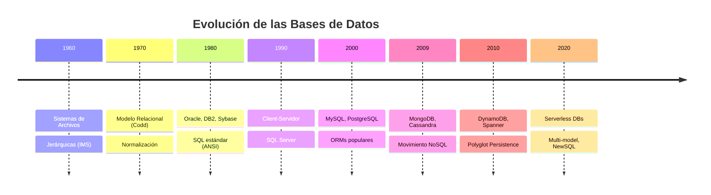

**Era de los Archivos (1960s):**

Antes de las bases de datos, la información se almacenaba en archivos planos (flat files).
Cada aplicación tenía su propio sistema de archivos, lo que generaba:

- **Redundancia de datos:** La misma información se duplicaba entre múltiples archivos.
- **Inconsistencia:** Diferentes versiones de la misma información existían simultáneamente.
- **Dependencia física:** La estructura del archivo estaba codificada en el programa.
- **Acceso secuencial:** No había forma eficiente de acceder a registros individuales.
- **No concurrencia:** Múltiples usuarios no podían modificar datos simultáneamente.

```
# Ejemplo de archivo plano (clientes.txt)
1|Juan Pérez|35|Calle Mayor 10|Madrid
2|María García|28|Gran Vía 25|Barcelona
3|Carlos López|42|Alameda 8|Valencia
```

**Sistemas Jerárquicos (1960s-1970s):**

IBM IMS (Information Management System), lanzado en 1966, introdujo el modelo jerárquico.
Los datos se organizaban en una estructura de árbol, donde cada nodo padre puede tener
múltiples hijos, pero cada hijo solo tiene un padre.

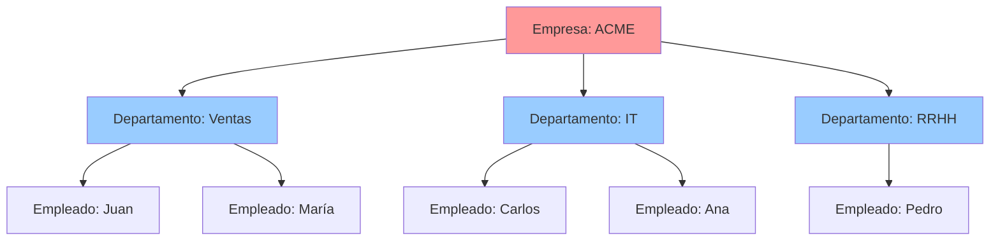

**Ventajas del modelo jerárquico:**
- Acceso rápido a relaciones padre-hijo
- Eficiente para datos con estructura natural de árbol

**Desventajas:**
- No soporta relaciones many-to-many
- Navegación compleja para consultas no jerárquicas
- Inflexibilidad estructural
- Programación en lenguajes de bajo nivel (COBOL, PL/I)

**Modelo Relacional (1970s-2000s):**

En 1970, Edgar F. Codd publicó su artículo seminal *"A Relational Model of Data for Large Shared Data Banks"*
donde propuso un modelo basado en la teoría de conjuntos y la lógica de primer orden.
Cada pieza de datos se representa como una tupla (fila) en una relación (tabla),
identificada por una clave primaria.

```sql
-- Modelo relacional clásico
CREATE TABLE clientes (
    id INT PRIMARY KEY AUTO_INCREMENT,
    nombre VARCHAR(100) NOT NULL,
    email VARCHAR(150) UNIQUE,
    fecha_registro TIMESTAMP DEFAULT CURRENT_TIMESTAMP
);

CREATE TABLE productos (
    id INT PRIMARY KEY AUTO_INCREMENT,
    nombre VARCHAR(200) NOT NULL,
    precio DECIMAL(10,2) CHECK (precio > 0),
    stock INT DEFAULT 0
);

CREATE TABLE pedidos (
    id INT PRIMARY KEY AUTO_INCREMENT,
    cliente_id INT REFERENCES clientes(id),
    producto_id INT REFERENCES productos(id),
    cantidad INT NOT NULL,
    fecha TIMESTAMP DEFAULT CURRENT_TIMESTAMP
);
```

**Ventajas del modelo relacional:**
- Normalización elimina redundancia
- SQL como lenguaje declarativo estándar
- Integridad referencial
- Transacciones ACID completas
- Ecosistema maduro de herramientas

**Desventajas en la era del Big Data:**
- Escalabilidad vertical costosa
- Esquemas rígidos difíciles de cambiar
- ORMs y complejidad de mapeo objeto-relacional
- Fragmentación horizontal (sharding) compleja
- Rendimiento degradado con joins en tablas masivas

### 1.2 El Problema de la Escalabilidad Vertical

La escalabilidad vertical (scaling up) consiste en aumentar los recursos de un único servidor
más potente: más CPU, más RAM, más almacenamiento SSD, etc.

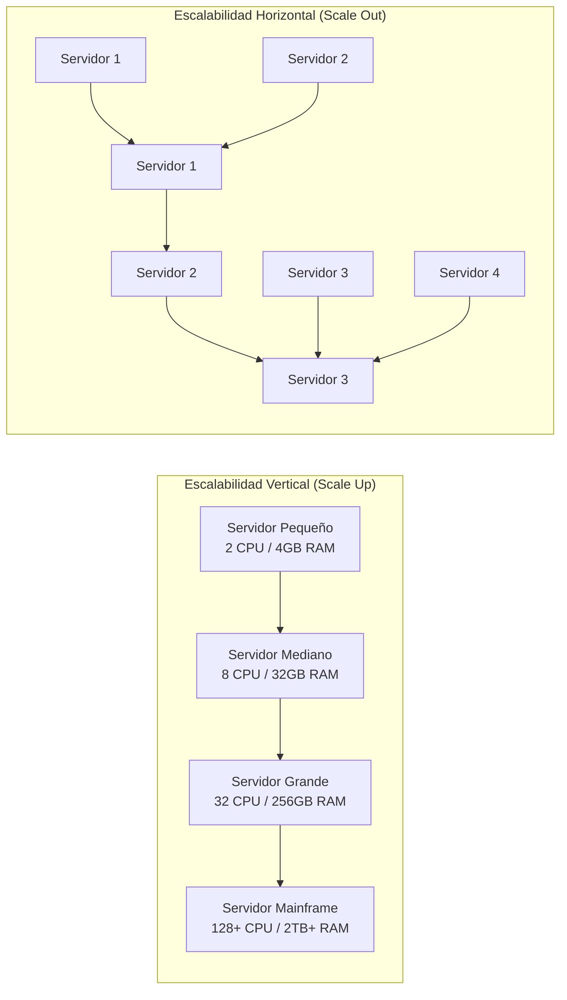

**El problema concreto:**

| Recurso | Servidor Pequeño | Servidor Grande | Costo Aprox. |
|---------|-----------------|-----------------|--------------|
| CPU | 2 núcleos | 128 núcleos | x64 |
| RAM | 4 GB | 2 TB | x512 |
| Almacenamiento | 500 GB SSD | 20 TB SSD | x40 |
| **Costo Total** | **$1,000** | **$200,000+** | **x200** |
| **Rendimiento/USD** | **1.0x** | **~0.3x** | **Degradado** |

Además, existen límites físicos insalvables:
- Un único servidor no puede tener infinitos cores de CPU
- La latencia de acceso a memoria crece con la cantidad de RAM
- Un solo punto de fallo (SPOF) inevitable
- Los costos crecen exponencialmente, no linealmente

**La solución: Escalabilidad Horizontal (Scale Out):**

En lugar de un servidor enorme, se utilizan múltiples servidores más pequeños y económicos
conectados en red. Cada base de datos NoSQL está diseñada desde sus cimientos para
distribuir datos automáticamente entre múltiples nodos.

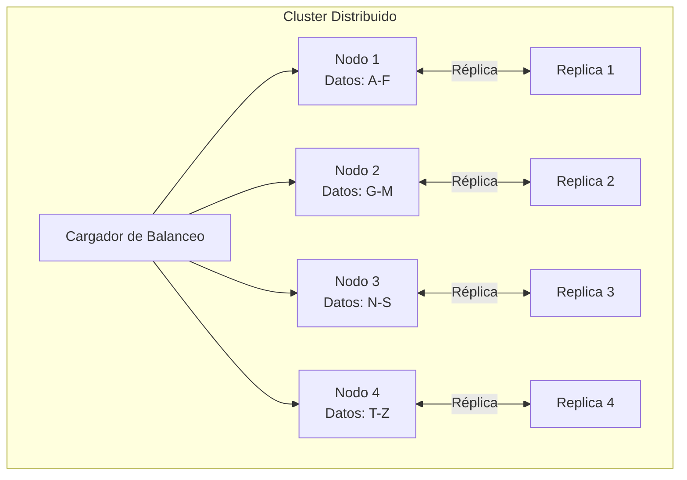

### 1.3 El Movimiento NoSQL (2009+)

El movimiento NoSQL no surgió de la nada. Fue el resultado de necesidades concretas
que el modelo relacional no podía satisfacer de manera económica:

**Google File System (2003) y BigTable (2006):**
Google necesitaba almacenar petabytes de datos web. Crearon GFS para almacenamiento
distribuido y BigTable como base de datos columnar sobre él.

**Amazon Dynamo (2007):**
Amazon publicó el paper *"Dynamo: Amazon's Highly Available Key-value Store"*
que describía un sistema distribuido con alta disponibilidad y tolerancia a particiones,
priorizando disponibilidad sobre consistencia.

**Facebook Cassandra (2008):**
Facebook desarrolló Cassandra para manejar la bandeja de entrada de mensajes
del usuario, inspirándose en BigTable y Dynamo. Lo liberaron como open source.

**MongoDB (2009):**
10gen (actual MongoDB Inc.) lanzó MongoDB como una base de datos documental
diseñada para desarrolladores, con un modelo de datos flexible basado en JSON.

**Clausura de 10gen (2009):**
La conferencia "NoSQL: Past, Present, Future" en noviembre de 2009 consolidó el término
"NoSQL" como paraguas para todas las bases de datos no relacionales.

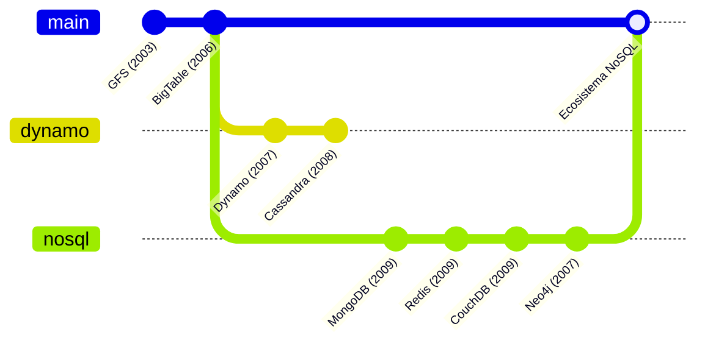

**Definición formal:**

NoSQL significa literalmente "Not Only SQL" (No solo SQL). No es "No SQL" ni "Sin SQL".
Es un conjunto de tecnologías de bases de datos que:

1. **No utilizan el modelo relacional tradicional** como única representación de datos
2. **No requieren esquema fijo** (schema-on-write vs schema-on-read)
3. **Están diseñadas para escalabilidad horizontal** desde su concepción
4. **Ofrecen modelos de datos alternativos:** documentos, grafos, columnas, clave-valor
5. **Pueden sacrificar consistencia fuerte** por disponibilidad y tolerancia a particiones
6. **Optimizan para casos de uso específicos** en lugar de ser una solución general

### 1.4 Polyglot Persistence: Usar la BD Correcta para Cada Problema

Polyglot Persistence (persistencia políglota) es la estrategia de utilizar múltiples
tecnologías de bases de datos dentro de una misma aplicación o sistema, aprovechando
las fortalezas de cada una para el caso de uso específico.

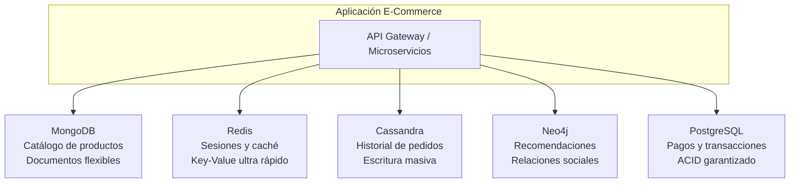

**Ejemplo práctico: Netflix**

Netflix utiliza más de 10 tecnologías diferentes de bases de datos:
- **Cassandra:** Historial de visualización, preferencias (petabytes de datos)
- **MySQL:** Facturación, información de cuentas (transacciones financieras)
- **EVCache (Memcached):** Caché en memoria para thumbnails y metadatos
- **MongoDB:** Metadatos de contenido, perfiles de usuario
- **Neo4j:** Grafo de relaciones entre contenido y usuarios

**Ejemplo práctico: Uber (2023)**

- **MySQL:** Viajes, pagos (ACID crítico)
- **Redis:** Geoubicación en tiempo real de conductores
- **Cassandra:** Historial de viajes, analytics
- **Couchbase:** Perfiles de usuario
- **Schemaless (MySQL on-top):** Esquemas flexibles

---

## 2. Las 5 Categorías de NoSQL

### 2.1 Documental (Document Store)

**Filosofía:** Los datos se almacenan como documentos autosuficientes, típicamente en formato
JSON o BSON. Cada documento puede tener una estructura diferente, lo que permite
un modelado flexible y cercano al modelo de objetos de las aplicaciones.

**Representación de un documento:**

```json
{
  "_id": "64a7b3c9e1234567890abcde",
  "nombre": "Notebook Pro X1",
  "marca": "TechBrand",
  "precio": 1299.99,
  "especificaciones": {
    "procesador": "Intel Core i7-13700H",
    "ram": "16GB DDR5",
    "almacenamiento": "512GB NVMe SSD",
    "pantalla": {
      "pulgadas": 15.6,
      "resolucion": "2560x1440",
      "tipo": "IPS"
    }
  },
  "categorias": ["laptops", "gaming", "profesional"],
  "etiquetas": ["oferta", "nuevo"],
  "disponible": true,
  "fecha_lanzamiento": "2024-03-15T00:00:00Z",
  "opiniones": [
    {
      "usuario": "ana_tech",
      "rating": 5,
      "comentario": "Excelente rendimiento"
    },
    {
      "usuario": "carlos_dev",
      "rating": 4,
      "comentario": "Buena pantalla"
    }
  ]
}
```

**Principales bases de datos documentales:**

| BD | Licencia | Lenguaje Original | Casos de Uso |
|----|----------|-------------------|--------------|
| MongoDB | SSPL | C++ | E-commerce, CMS, IoT, Apps móviles |
| CouchDB | Apache 2.0 | Erlang | Sync offline, Apps con replicación |
| Firestore | Propietario | — | Apps móviles/serverless de Google |
| Couchbase | Apache 2.0 | C++ | caché + persistencia, Apps de alto tráfico |
| RavenDB | SLA | C# | .NET ecosystem |

**Ejemplo de inserción en MongoDB:**

```javascript
// Conexión con mongosh
use tienda;

// Insertar un documento
db.productos.insertOne({
  nombre: "Auriculares Bluetooth Pro",
  marca: "SoundMax",
  precio: 79.99,
  categorias: ["audio", "bluetooth", "inalámbrico"],
  especificaciones: {
    conexion: "Bluetooth 5.3",
    bateria: "40 horas",
    cancelacion_ruido: true,
    microphone: true
  },
  stock: {
    tienda_central: 150,
    tienda_norte: 45,
    tienda_sur: 0
  },
  fecha_creacion: new Date()
});

// Resultado:
// {
//   acknowledged: true,
//   insertedId: ObjectId("64a7b3c9e1234567890abcde")
// }
```

### 2.2 Clave-Valor (Key-Value Store)

**Filosofía:** El modelo más simple y rápido de NoSQL. Cada valor se almacena y recupera
mediante una clave única. El valor es una "caja negra" para la base de datos —
no puede consultarse por el contenido del valor, solo por la clave.

**Estructura conceptual:**

```
┌─────────────┬──────────────────────────────────┐
│    KEY       │              VALUE               │
├─────────────┼──────────────────────────────────┤
│ user:1001   │ {"nombre":"Ana","rol":"admin"}    │
│ session:abc │ "eyJhbGciOiJIUzI1NiJ9..."        │
│ cart:user:1 │ [produto1, producto2, producto3]  │
│ config:app  │ {"theme":"dark","lang":"es"}      │
│ cache:api:1 │ {respuesta: "...", ttl: 3600}     │
│ lock:mutex  │ "owner:node1:1693420800"          │
└─────────────┴──────────────────────────────────┘
```

**Principales bases de datos clave-valor:**

| BD | Licencia | Lenguaje | Persistencia | Casos de Uso |
|----|----------|----------|--------------|--------------|
| Redis | BSD | C | Snapshot + AOF | Caché, sesiones, colas, pub/sub, leaderboard |
| Memcached | BSD | C | Solo memoria | Caché distribuida simple |
| Amazon DynamoDB | Propietario | — | Persistente | Apps serverless, gaming, IoT |
| Etcd | Apache 2.0 | Go | Persistente | Configuración de clúster, service discovery |
| KeyDB | BSD | C | Persistente | Redis fork con multi-threading |

**Ejemplo en Redis:**

```bash
# Conectar a Redis
redis-cli

# Operaciones básicas
SET user:1001 '{"nombre":"Ana García","email":"ana@ejemplo.com","rol":"admin"}'
# OK

GET user:1001
# '{"nombre":"Ana García","email":"ana@ejemplo.com","rol":"admin"}'

# Con expiración (TTL)
SET session:abc123 "eyJhbGciOiJIUzI1NiJ9.payload.signature" EX 3600
# OK — expira en 1 hora (3600 segundos)

TTL session:abc123
# 3542 (segundos restantes)

# Contadores atómicos
INCR article:1234:views
# (integer) 1
INCR article:1234:views
# (integer) 2
INCRBY article:1234:views 50
# (integer) 52

# Listas (como cola de mensajes)
LPUSH notifications:user:1001 "Nuevo pedido recibido"
LPUSH notifications:user:1001 "Envío en camino"
LRANGE notifications:user:1001 0 -1
# 1) "Envío en camino"
# 2) "Nuevo pedido recibido"

# Hashes (estructuras clave-valor anidadas)
HSET product:5001 nombre "Laptop Pro" precio 1299.99 stock 25
HGETALL product:5001
# 1) "nombre"
# 2) "Laptop Pro"
# 3) "precio"
# 4) "1299.99"
# 5) "stock"
# 6) "25"

# Sets (conjuntos únicos)
SADD tags:product:5001 "gaming" "portátil" "oferta" "nuevo"
SMEMBERS tags:product:5001
# 1) "gaming"
# 2) "portátil"
# 3) "oferta"
# 4) "nuevo"
```

### 2.3 Columnar / Ampliamente Distribuido (Wide-Column Store)

**Filosofía:** Los datos se organizan en familias de columnas (column families), donde cada
fila puede tener un conjunto diferente de columnas. Optimizado para escrituras masivas
y lecturas de rangos de columnas. Inspirado en BigTable de Google.

**Estructura de una familia de columnas:**

```
Tabla: eventos_usuarios
┌──────────┬──────────────────────────────────────────────────────────────┐
│ Row Key  │ Column Family: perfil         │ Column Family: actividad    │
│          │ ┌──────┬────────┐ ┌─────┬───┐ │ ┌────────┬─────┐ ┌──────┬──┤
│          │ │nombre│ email  │ │edad │ Rol│ │ │ last_  │login│ │page_ │  │
│          │ │      │        │ │     │    │ │ │ login  │ cnt │ │views │  │
│──────────┼───────┼────────┼┼──────┼───┼┼─┼┼────────┼─────┼┼──────┼──┤
│ user001  │ Ana   │ a@e.com│ │ 28  │adm│ │ │12:34:05│ 142 │ │home  │  │
│          │       │        │ │     │   │ │ │        │     │ │prod  │  │
│──────────┼───────┼────────┼┼──────┼───┼┼─┼┼────────┼─────┼┼──────┼──┤
│ user002  │ Carlos│ c@e.com│ │ 35  │usr│ │ │09:12:33│  89 │ │about │  │
│          │       │        │ │     │   │ │ │        │     │ │blog  │  │
└──────────┴───────┴────────┴┴──────┴───┴┴─┴┴────────┴─────┴┴──────┴──┘
```

**Principales bases de datos columnares:**

| BD | Licencia | Inspiración | Casos de Uso |
|----|----------|-------------|--------------|
| Apache Cassandra | Apache 2.0 | BigTable + Dynamo | IoT, messaging, time series, logs |
| Apache HBase | Apache 2.0 | BigTable | Analytics sobre Hadoop, random read/write |
| ScyllaDB | AGPL | Cassandra (reescrita en C++) | Cassandra con mejor rendimiento |
| ClickHouse | Apache 2.0 | Column-oriented OLAP | Analytics en tiempo real, data warehousing |

**Ejemplo en Cassandra (CQL):**

```sql
-- Crear keyspace (base de datos)
CREATE KEYSPACE IF NOT EXISTS tienda
WITH replication = {
  'class': 'NetworkTopologyStrategy',
  'datacenter1': 3,
  'datacenter2': 2
};

USE tienda;

-- Crear tabla de pedidos
CREATE TABLE pedidos (
    cliente_id UUID,
    fecha_pedido TIMESTAMP,
    pedido_id UUID,
    producto TEXT,
    cantidad INT,
    precio_unitario DECIMAL,
    estado TEXT,
    PRIMARY KEY ((cliente_id), fecha_pedido, pedido_id)
) WITH CLUSTERING ORDER BY (fecha_pedido DESC);

-- Insertar pedidos
INSERT INTO pedidos (cliente_id, fecha_pedido, pedido_id, producto, cantidad, precio_unitario, estado)
VALUES (
  uuid(),
  '2024-08-15 10:30:00',
  uuid(),
  'Laptop Pro X1',
  1,
  1299.99,
  'enviado'
);

-- Insertar otro pedido del mismo cliente
INSERT INTO pedidos (cliente_id, fecha_pedido, pedido_id, producto, cantidad, precio_unitario, estado)
VALUES (
  550e8400-e29b-41d4-a716-446655440000,
  '2024-08-16 14:20:00',
  uuid(),
  'Auriculares Bluetooth',
  2,
  79.99,
  'pendiente'
);

-- Consultar pedidos de un cliente (más recientes primero)
SELECT * FROM pedidos
WHERE cliente_id = 550e8400-e29b-41d4-a716-446655440000
LIMIT 10;

-- Consultar pedidos de un cliente en un rango de fechas
SELECT fecha_pedido, producto, cantidad, estado FROM pedidos
WHERE cliente_id = 550e8400-e29b-41d4-a716-446655440000
AND fecha_pedido >= '2024-08-01 00:00:00'
AND fecha_pedido < '2024-08-31 23:59:59';
```

### 2.4 Grafo (Graph Database)

**Filosofía:** Los datos se modelan como nodos (entidades) y aristas (relaciones/conexiones).
Cada arista puede tener propiedades y dirección. Optimizado para consultas que
exploran relaciones complejas: recomendaciones, fraudes, redes sociales, rutas.

**Representación visual de un grafo:**

```mermaid
graph LR
    Ana[Ana:Cliente] -->|COMPRÓ| L1[Laptop Pro X1:Producto]
    Ana -->|COMPRÓ| A1[Auriculares BT:Producto]
    Ana -->|VALORÓ| L1
    Carlos[Carlos:Cliente] -->|COMPRÓ| L1
    Carlos -->|COMPRÓ| T1[Tablet Air:Producto]
    Carlos -->|SEGURO| Ana
    María[María:Cliente] -->|COMPRÓ| T1
    María -->|VALORÓ| A1
    María -->|SUSCRITO| Canal1[Canal:Newsletter]
    Ana -->|SUSCRITO| Canal1
    L1 ->|CATEGORÍA| Cat1[Categoría: Laptops]
    T1 ->|CATEGORÍA| Cat2[Categoría: Tablets]
    A1 ->|CATEGORÍA| Cat3[Categoría: Audio]

    style Ana fill:#ff9999
    style Carlos fill:#99ccff
    style María fill:#99ff99
    style L1 fill:#ffcc99
    style T1 fill:#ffcc99
    style A1 fill:#ffcc99
```

**Principales bases de datos de grafos:**

| BD | Licencia | Modelo | Casos de Uso |
|----|----------|--------|--------------|
| Neo4j | GPLv3 (CE) / Propietaria (EE) | Propietario (Cypher) | Redes sociales, fraude, recomendaciones |
| ArangoDB | Apache 2.0 | Multi-model (grafo+doc+KV) | Grafos + documentos en una sola BD |
| Amazon Neptune | Propietario | Gremlin / SPARQL | Grafos en AWS, knowledge graphs |
| JanusGraph | Apache 2.0 | Multi-backend | Grafos masivos en Cassandra/HBase |
| TigerGraph | Propietario | GSQL | Analytics de grafos en tiempo real |

**Ejemplo en Neo4j (Cypher):**

```cypher
// Crear nodos
CREATE (ana:Cliente {nombre: 'Ana García', email: 'ana@ejemplo.com', edad: 28})
CREATE (carlos:Cliente {nombre: 'Carlos López', email: 'carlos@ejemplo.com', edad: 35})
CREATE (maria:Cliente {nombre: 'María Torres', email: 'maria@ejemplo.com', edad: 31})
CREATE (laptop:Producto {nombre: 'Laptop Pro X1', precio: 1299.99, stock: 25})
CREATE (tablet:Producto {nombre: 'Tablet Air', precio: 599.99, stock: 40})
CREATE (auriculares:Producto {nombre: 'Auriculares BT', precio: 79.99, stock: 150})
CREATE (canal:Newsletter {nombre: 'Ofertas Tech', frecuencia: 'semanal'})
CREATE (laptops:Categoria {nombre: 'Laptops'})
CREATE (tablets:Categoria {nombre: 'Tablets'})
CREATE (audio:Categoria {nombre: 'Audio'})

// Crear relaciones
CREATE (ana)-[:COMPRÓ {fecha: date('2024-08-15'), cantidad: 1}]->(laptop)
CREATE (ana)-[:COMPRÓ {fecha: date('2024-08-20'), cantidad: 2}]->(auriculares)
CREATE (ana)-[:VALORÓ {estrellas: 5, comentario: 'Excelente'}]->(laptop)
CREATE (ana)-[:SUSCRITO {fecha: date('2024-01-10')}]->(canal)
CREATE (carlos)-[:COMPRÓ {fecha: date('2024-07-10'), cantidad: 1}]->(laptop)
CREATE (carlos)-[:COMPRÓ {fecha: date('2024-08-01'), cantidad: 1}]->(tablet)
CREATE (carlos)-[:SEGURO]->(ana)
CREATE (maria)-[:COMPRÓ {fecha: date('2024-08-22'), cantidad: 1}]->(tablet)
CREATE (maria)-[:COMPRÓ {fecha: date('2024-08-22'), cantidad: 1}]->(auriculares)
CREATE (maria)-[:VALORÓ {estrellas: 4, comentario: 'Muy buenos'}]->(auriculares)
CREATE (maria)-[:SUSCRITO {fecha: date('2024-03-05')}]->(canal)

// Relacionar productos con categorías
CREATE (laptop)-[:PERTENECE_A]->(laptops)
CREATE (tablet)-[:PERTENECE_A]->(tablets)
CREATE (auriculares)-[:PERTENECE_A]->(audio)

// CONSULTA: ¿Quiénes compraron laptops también y qué compraron?
MATCH (c:Cliente)-[:COMPRÓ]->(p:Producto)-[:PERTENECE_A]->(cat:Categoria)
WHERE cat.nombre = 'Laptops'
MATCH (c)-[:COMPRÓ]->(otro:Producto)
WHERE otro <> p
RETURN c.nombre AS cliente, collect(DISTINCT otro.nombre) AS otras_compras;

// Resultado:
// ┌──────────────┬────────────────────────┐
// │ cliente      │ otras_compras          │
// ├──────────────┼────────────────────────┤
// │ "Ana García" │ ["Auriculares BT"]     │
// │ "Carlos López"│ ["Tablet Air"]        │
// └──────────────┴────────────────────────┘

// CONSULTA: Recomendaciones — productos que compraron los seguidores de Ana
MATCH (ana:Cliente {nombre: 'Ana García'})<-[:SEGURO]-(seguidor:Cliente)
MATCH (seguidor)-[:COMPRÓ]->(producto:Producto)
WHERE NOT (ana)-[:COMPRÓ]->(producto)
RETURN producto.nombre AS recomendado, count(*) AS popularidad
ORDER BY popularidad DESC;

// Resultado:
// ┌──────────────────┬────────────┐
// │ recomendado      │ popularidad│
// ├──────────────────┼────────────┤
// │ "Tablet Air"     │ 1          │
// └──────────────────┴────────────┘
```

### 2.5 Orientado a Objetos (Object Database)

**Filosofía:** Almacena objetos directamente tal como se representan en memoria de un
programa orientado a objetos. Elimina el "impedance mismatch" (desajuste de impedancia)
entre el modelo de objetos del lenguaje de programación y el modelo de persistencia.

**Ejemplo en Java con ObjectDB:**

```java
// Definición de una entidad
import javax.persistence.*;

@Entity
public class Producto implements java.io.Serializable {

    @Id
    @GeneratedValue(strategy = GenerationType.IDENTITY)
    private long id;

    private String nombre;
    private double precio;
    private int stock;

    @ManyToOne
    private Categoria categoria;

    @OneToMany(mappedBy = "producto")
    private List<Opinion> opiniones;

    @Embedded
    private Especificaciones specs;

    // Constructor, getters, setters
    public Producto() {}

    public Producto(String nombre, double precio, int stock) {
        this.nombre = nombre;
        this.precio = precio;
        this.stock = stock;
        this.opiniones = new ArrayList<>();
    }

    // Métodos de negocio
    public void reducirStock(int cantidad) {
        if (this.stock >= cantidad) {
            this.stock -= cantidad;
        } else {
            throw new IllegalStateException("Stock insuficiente");
        }
    }

    public double getPromedioOpiniones() {
        return opiniones.stream()
            .mapToInt(Opinion::getRating)
            .average()
            .orElse(0.0);
    }

    // Getters y setters omitidos por brevedad
}

@Embeddable
class Especificaciones {
    private String procesador;
    private String ram;
    private String almacenamiento;
    // getters, setters
}

@Entity
class Categoria implements java.io.Serializable {
    @Id
    private String nombre;
    private String descripcion;
}

@Entity
class Opinion implements java.io.Serializable {
    @Id
    @GeneratedValue(strategy = GenerationType.IDENTITY)
    private long id;

    private String usuario;
    private int rating;
    private String comentario;

    @ManyToOne
    private Producto producto;
}
```

**Principales bases de datos orientadas a objetos:**

| BD | Licencia | Lenguaje | Casos de Uso |
|----|----------|----------|--------------|
| ObjectDB | Propietaria | Java/JDO/JPA | Apps Java Enterprise |
| db4o | Apache 2.0 | Java/.NET | Embeddable, dispositivos móviles |
| Versant | Propietaria | Java/C++/.NET | Modelos complejos, CAD/CAM |
| InterSystems Caché/IRIS | Propietaria | Multi-lingua | Healthcare, finanzas |

**Ventajas:**
- No hay mapeo objeto-relacional (ORM)
- Soporte natural para herencia
- Navegación por grafos de objetos
- Persistencia transparente

**Desventajas:**
- Ecosistema reducido
- Menos herramientas y comunidad
- Complejidad de migración
- No estándar SQL

---

### 2.6 Tabla Comparativa Completa de Categorías

| Característica | Documental | Clave-Valor | Columnar | Grafo | Objeto |
|---------------|-----------|-------------|----------|-------|--------|
| **Modelo de datos** | JSON/BSON | Par clave→valor | Column families | Nodos + Aristas | Objetos |
| **Esquema** | Flexible | Ninguno | Semi-estructurado | Flexible | Clases Java |
| **Escalabilidad** | Horizontal | Horizontal | Horizontal | Vertical/Horiz. | Vertical |
| **Escrituras** | Moderadas | Muy rápidas | Muy rápidas | Moderadas | Rápidas |
| **Lecturas** | Rápidas | Por clave: muy rápidas | Rápidas (rangos) | Rápidas (relaciones) | Rápidas |
| **Consultas complejas** | Sí (aggregation) | No (por valor) | Sí (analytics) | Sí (traversals) | Sí (JDO/JPA) |
| **Consistencia** | Configurable | Configurable | Configurable | Fuerte (local) | Fuerte |
| **Curva aprendizaje** | Baja | Muy baja | Media | Media | Alta |
| **Mejor para** | Catálogos, CMS, IoT | Caché, sesiones | Logs, time series | Redes, fraude | Apps Java EE |

### 2.7 Diagrama de Decisión: ¿Qué Categoría Uso?

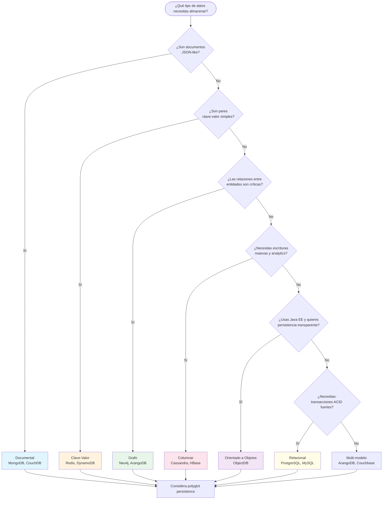

---

## 3. Teorema CAP

### 3.1 Definición Formal (Gilbert & Lynch, 2002)

El teorema CAP fue formalizado por Seth Gilbert y Nancy Lynch en 2002,
a partir de una conjetura de Eric Brewer en 2000. Establece que un sistema
distribuido **no puede garantizar simultáneamente** más de **dos** de las
siguientes **tres** propiedades:

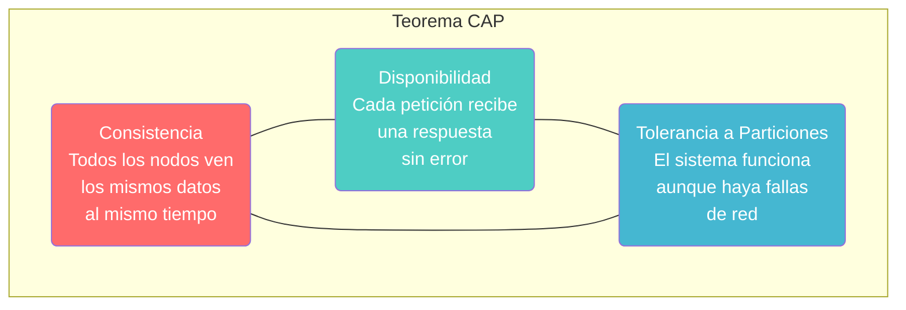

**Definiciones formales:**

- **Consistencia (C):** Cada lectura recibe la escritura más reciente confirmada, o un error.
  En otras palabras, todos los nodos ven los mismos datos al mismo tiempo.

- **Disponibilidad (A):** Cada petición a un nodo no erróneo recibe una respuesta (no un error),
  sin garantía de que contenga la escritura más reciente.

- **Tolerancia a Particiones (P):** El sistema continúa operando a pesar de la pérdida de
  mensajes o el fallo de enlace de red entre nodos del sistema.

### 3.2 Diagrama de Venn

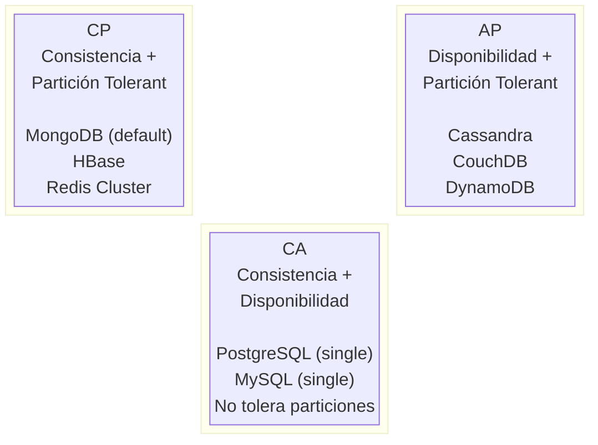

### 3.3 Clasificación de Bases de Datos

| Base de Datos | Clasificación | Comportamiento ante partición |
|--------------|---------------|------------------------------|
| **MongoDB** | CP (por defecto) | Rechaza escrituras si no hay mayoría de nodos |
| **Cassandra** | AP | Acepta escrituras en cualquier nodo, consistencia eventual |
| **Redis (standalone)** | CA | No tolera particiones (single node) |
| **Redis Cluster** | CP | Rechaza operaciones en slots sin consenso |
| **CouchDB** | AP | Siempre responde, puede tener datos stale |
| **HBase** | CP | Requiere consensus de ZK, rechaza si no hay |
| **DynamoDB** | CP o AP | Configurable con strongly consistent reads |
| **Neo4j (single)** | CA | Consistente y disponible sin particiones |
| **Neo4j Aura** | CP | Consistencia garantizada con réplicas |
| **etcd** | CP | Consenso Raft, rechaza si no hay mayoría |
| **ZooKeeper** | CP | Si no hay mayoría, el servicio no está disponible |

### 3.4 Tradeoffs Prácticos con Escenarios Reales

**Escenario 1: Red social con millones de usuarios**

Opción AP (disponibilidad prioritaria):
```
- Un usuario publica un post → la réplica en otro data center puede no verlo inmediatamente
- Pero la publicación SIEMPRE es exitosa (disponibilidad)
- Otros usuarios eventualmente verán el post
- Mejor UX: "publicado" inmediatamente
```

Opción CP (consistencia prioritaria):
```
- Un usuario publica un post → espera confirmación de todas las réplicas
- Si un data center está caído, el post falla o se retrasa
- Garantiza que todos ven el mismo contenido
- Peor UX en caso de fallas, pero datos siempre consistentes
```

**Escenario 2: Sistema de pagos bancarios**

Siempre CP:
```
- Un pago de $1000 NO puede ser procesado si no se garantiza consistencia
- Si hay una partición, es MEJOR rechazar la transacción que procesarla doble
- La disponibilidad se mantiene con redundancia, no con trades de consistencia
```

**Escenario 3: IoT — Sensores de temperatura**

Predominantemente AP:
```
- 100,000 sensores envían datos cada segundo
- Si un nodo está caído, los datos se almacenan localmente y se replican después
- Es aceptable tener datos ligeramente desactualizados
- Es INACEPTABLE perder datos de sensores
```

### 3.5 Teorema PACELC como Extensión del CAP

El teorema PACELC (2012, Daniel Abadi) extiende CAP considerando el comportamiento
del sistema **no solo durante una partición**, sino **también en condiciones normales**.

```
PACELC se lee así:

Si hay Partición (P):
    Elige entre Disponibilidad (A) y Consistencia (C)
Sino (E = Else, sin partición):
    Elige entre Latencia (L) y Consistencia (C)
```

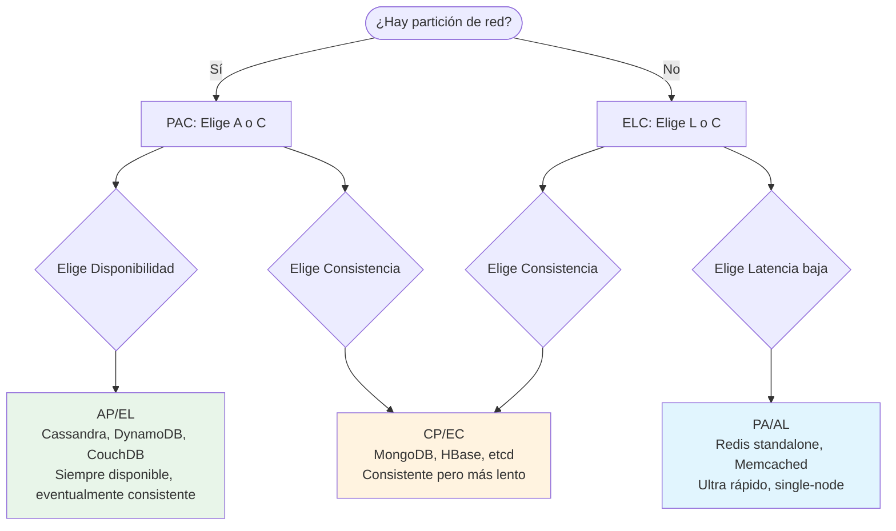

**Tabla PACELC completa:**

| BD | Sin Partición | Con Partición |
|----|--------------|---------------|
| **Cassandra** | Elige Latencia (EL) | Elige Disponibilidad (PA) |
| **MongoDB** | Elige Consistencia (EC) | Elige Consistencia (PC) |
| **Redis** | Elige Latencia (EL) | Consistente (PC, con cluster) |
| **DynamoDB** | Elige Latencia (EL) | Elige Disponibilidad (PA) |
| **HBase** | Elige Consistencia (EC) | Elige Consistencia (PC) |
| **CouchDB** | Elige Consistencia (EC) | Elige Disponibilidad (PA) |
| **etcd** | Elige Consistencia (EC) | Elige Consistencia (PC) |

---

## 4. Propiedades ACID vs Modelo BASE

### 4.1 ACID: Atomicidad, Consistencia, Aislamiento, Durabilidad

Las propiedades ACID son el estándar de oro para transacciones en bases de datos
relacionales, garantizando que las operaciones se ejecuten de manera confiable.

**Atomicidad (A):**

Toda transacción se ejecuta como una unidad indivisible: o se completan **todas** las
operaciones, o no se ejecuta **ninguna**. Si falla un paso intermedio, se deshacen
todos los cambios anteriores (rollback).

```sql
-- Transacción ACID: transferencia bancaria
BEGIN;

-- Paso 1: Debitar de la cuenta origen
UPDATE cuentas
SET saldo = saldo - 500.00
WHERE numero_cuenta = '1001-ABC';

-- Verificar fondos
DO $$
BEGIN
    IF (SELECT saldo FROM cuentas WHERE numero_cuenta = '1001-ABC') < 0 THEN
        RAISE EXCEPTION 'Fondos insuficientes';
    END IF;
END $$;

-- Paso 2: Acreditar a la cuenta destino
UPDATE cuentas
SET saldo = saldo + 500.00
WHERE numero_cuenta = '2002-XYZ';

-- Paso 3: Registrar el movimiento
INSERT INTO movimientos (cuenta_origen, cuenta_destino, monto, fecha)
VALUES ('1001-ABC', '2002-XYZ', 500.00, NOW());

COMMIT;

-- Si CUALQUIER paso falla, NADA se ejecuta:
-- - La cuenta origen no se debita
-- - La cuenta destino no se acredita
-- - No se registra el movimiento
```

**En MongoDB (transacciones multi-document desde 4.0):**

```javascript
// Transacción ACID en MongoDB
const session = client.startSession();

try {
    session.startTransaction({
        readConcern: { level: 'snapshot' },
        writeConcern: { w: 'majority' }
    });

    // Paso 1: Debitar de cuenta origen
    db.cuentas.updateOne(
        { numero_cuenta: '1001-ABC' },
        { $inc: { saldo: -500.00 } },
        { session }
    );

    // Verificar fondos
    const origen = db.cuentas.findOne(
        { numero_cuenta: '1001-ABC' },
        { session }
    );
    if (origen.saldo < 0) {
        throw new Error('Fondos insuficientes');
    }

    // Paso 2: Acreditar cuenta destino
    db.cuentas.updateOne(
        { numero_cuenta: '2002-XYZ' },
        { $inc: { saldo: 500.00 } },
        { session }
    );

    // Paso 3: Registrar movimiento
    db.movimientos.insertOne({
        cuenta_origen: '1001-ABC',
        cuenta_destino: '2002-XYZ',
        monto: 500.00,
        fecha: new Date()
    }, { session });

    // Confirmar
    await session.commitTransaction();
    console.log('Transacción completada exitosamente');
} catch (error) {
    await session.abortTransaction();
    console.error('Transacción abortada:', error.message);
} finally {
    session.endSession();
}
```

**Consistencia (C):**

Una transacción mueve la base de datos de un estado válido a otro estado válido.
Se respetan todas las restricciones de integridad (claves primarias, foráneas,
checks, triggers).

```sql
-- Restricciones que garantizan consistencia
ALTER TABLE productos
    ADD CONSTRAINT chk_precio_positivo CHECK (precio > 0),
    ADD CONSTRAINT chk_stock_no_negativo CHECK (stock >= 0),
    ADD CONSTRAINT uq_producto_nombre UNIQUE (nombre);

-- Un UPDATE que viole estas restricciones será rechazado
UPDATE productos SET stock = -5 WHERE id = 1;
-- ERROR: new row for relation "productos" violates check constraint "chk_stock_no_negativo"
```

**Aislamiento (I):**

Las transacciones concurrentes no se interfieren entre sí. Cada transacción
parece ejecutarse de manera aislada. Los niveles de aislamiento definidos
por el estándar SQL son:

| Nivel | Dirty Read | Non-Repeatable Read | Phantom Read |
|-------|-----------|---------------------|--------------|
| READ UNCOMMITTED | Sí posible | Sí posible | Sí posible |
| READ COMMITTED | No | Sí posible | Sí posible |
| REPEATABLE READ | No | No | Sí posible |
| SERIALIZABLE | No | No | No |

```sql
-- Ejemplo de dirty read (READ UNCOMMITTED)
-- Transacción A                          -- Transacción B
BEGIN;                                     BEGIN;
UPDATE productos SET precio = 0.01         SELECT precio FROM productos
  WHERE id = 1; -- precio modificado        WHERE id = 1;
-- NO COMMITTED AÚN                       -- Lee precio = 0.01 (dirty read!)
ROLLBACK; -- precio vuelve a 1299.99
-- Transacción B leyó un dato "sucio" que nunca existió oficialmente
```

**Durabilidad (D):**

Una vez que una transacción se confirma (COMMIT), sus cambios son permanentes,
incluso ante fallos del sistema. Se garantiza mediante WAL (Write-Ahead Logging),
replicación y/o discos no volátiles.

```sql
-- PostgreSQL: ver configuración de durabilidad
SHOW synchronous_commit;    -- on (por defecto)
SHOW fsync;                 -- on
SHOW full_page_writes;      -- on
```

### 4.2 BASE: Basically Available, Soft State, Eventual Consistency

El modelo BASE es la filosofía de diseño de sistemas distribuidos que priorizan
la **disponibilidad** y la **tolerancia a fallos** sobre la consistencia fuerte.

**Basically Available (Básicamente Disponible):**

El sistema garantiza una respuesta a cada petición, aunque no contenga
la información más reciente. "Básicamente" significa que el sistema está
operativo la mayoría del tiempo, pero puede haber respuestas parciales
o con datos ligeramente desactualizados.

```javascript
// Ejemplo: Redis con consistencia eventual
// Nodo Maestro (escrituras)
SET user:1001 '{"nombre":"Ana","email":"nuevo@ej.com"}'
// OK → confirmado al cliente

// Réplica (lecturas con routing)
GET user:1001
// '{"nombre":"Ana","email":"antiguo@ej.com"}'
// ← dato DESACTUALIZADO pero SÍ se responde (disponible)

// Después de 50-200ms de replicación:
GET user:1001
// '{"nombre":"Ana","email":"nuevo@ej.com"}'
// ← dato CONSISTENTE
```

**Soft State (Estado Blando):**

El estado del sistema puede cambiar con el tiempo, incluso sin nuevas escrituras,
debido a procesos de replicación, reconciliación o expiración. El estado no es
"firme" sino que se deriva de las operaciones.

```javascript
// Ejemplo: Sesi\u00f3n en Redis con TTL
SET session:user123 "activo" EX 1800  // expira en 30 min

// Estado "blando": la sesión existe Y puede desaparecer
// sin que nadie la borre explícitamente
```

**Eventual Consistency (Consistencia Eventual):**

Si no se realizan nuevas escrituras, eventualmente todas las réplicas
convergerán hacia el mismo estado. El tiempo de convergencia varía
según la red, la carga y la configuración.

```javascript
// Cassandra: consistencia configurada por operación
// Escritura con consistencia ONE (solo 1 nodo confirma)
INSERT INTO eventos (id, tipo, fecha)
VALUES (uuid(), 'login', toTimestamp(now()))
USING CONSISTENCY ONE;

// Lectura con consistencia QUORUM (mayoría de nodos)
SELECT * FROM eventos
WHERE id = ? USING CONSISTENCY QUORUM;

// Con quorum, la probabilidad de leer datos desactualizados es baja
// pero no nula en caso de fallas simultáneas
```

### 4.3 Cuándo Elegir ACID vs BASE

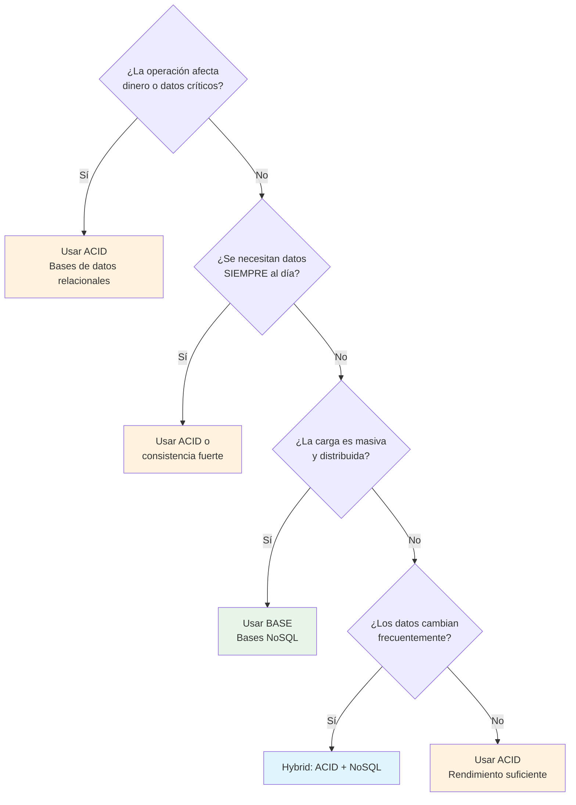

### 4.4 Tabla Comparativa ACID vs BASE

| Característica | ACID | BASE |
|---------------|------|------|
| **Filosofía** | Consistencia primero | Disponibilidad primero |
| **Transacciones** | Multi-operación con rollback | Operaciones individuales |
| **Consistencia** | Fuerte (inmediata) | Eventual (difiriendo) |
| **Disponibilidad** | Puede ser reducida | Siempre alta |
| **Escalabilidad** | Vertical | Horizontal |
| **Latencia** | Mayor (coordinación) | Menor (sin coordinación) |
| **Ejemplos** | PostgreSQL, MySQL, Oracle | Cassandra, DynamoDB, Redis |
| **Ideal para** | Banca, pagos, inventario | IoT, logs, caché, redes sociales |
| **Modelo de datos** | Relacional (tablas) | Documentos, KV, columnas, grafos |
| **Esquema** | Rígido (Schema-on-Write) | Flexible (Schema-on-Read) |
| **Rendimiento escritura** | Moderado | Muy alto |
| **Rendimiento lectura** | Alto (con índices) | Variable (según modelo) |
| **Fallo en escritura** | Rollback completo | Puede aceptar parcialmente |
| **Concurrencia** | Bloqueo/ MVCC | Sin bloqueo / conflictos |

---

## 5. Consistencia en Sistemas Distribuidos

### 5.1 Consistencia Fuerte (Linearizability / Strict Serializability)

Todos los nodos ven exactamente los mismos datos en el mismo orden. Es la garantía
más fuerte posible: cada operación parece ejecutarse atómicamente en algún punto
entre su inicio y su finalización, y todas las operaciones parecen ocurrir en
un orden secuencial total.

```javascript
// Ejemplo de consistencia fuerte (MongoDB con majority write concern)
db.collection.insertOne(
    { _id: "msg1", texto: "Hola mundo" },
    { writeConcern: { w: "majority", j: true, wtimeout: 5000 } }
);
// OK: insertado en la mayoría de nodos + journal

db.collection.findOne(
    { _id: "msg1" },
    { readConcern: { level: "majority" } }
);
// SIEMPRE retorna el documento si fue confirmado
// No hay ventana de inconsistencia
```

### 5.2 Consistencia Eventual (Eventual Consistency)

Si no se realizan nuevas actualizaciones, eventualmente todas las réplicas
convergerán al mismo valor. El tiempo de convergencia no está garantizado.

```javascript
// Ejemplo: Cassandra con consistencia ONE (débil)
// Escritura en nodo A
INSERT INTO mensajes (id, texto) VALUES (uuid(), 'Hola') USING CONSISTENCY ONE;

// Lectura inmediata desde nodo B (puede no ver el dato aún)
SELECT * FROM mensajes WHERE id = ? USING CONSISTENCY ONE;
// Puede retornar vacío

// Después de un tiempo (replicación), nodo B converge
// SELECT * → ahora sí muestra el dato
```

### 5.3 Consistencia Causal

Si la operación B "sabe" de la operación A (B depende causalmente de A),
entonces todos los nodos que ven B también deben ver A. Preserva la
relación causal sin necesidad de orden totally-ordered (como linearizability).

```javascript
// Ejemplo: Mensajes en chat
// 1. Ana envía mensaje
msg1 = chatDB.insert({ user: "Ana", text: "Hola!" });
// timestamp: T1

// 2. Carlos responde a Ana (dependencia causal)
msg2 = chatDB.insert({
    user: "Carlos",
    text: "Hola Ana!",
    replyTo: msg1._id  // referencia causal
});
// timestamp: T2 > T1

// Con consistencia causal, cualquier nodo que vea msg2
// SIEMPRE debe ver msg1 primero
// Sin consistencia causal, podría ordenarse msg2 ANTES de msg1
```

### 5.4 Consistencia de Sesión (Session Consistency)

Garantiza que dentro de una sesión, el usuario siempre ve sus propias escrituras.
Fuera de la sesión, puede ver datos desactualizados temporalmente.

```javascript
// MongoDB: causally consistent session
const session = client.startSession({
    causalConsistency: true
});

// Dentro de la sesión
session.startTransaction();
db.pedidos.insertOne({ user: "ana", status: "nuevo" }, { session });
db.pedidos.findOne({ user: "ana" }, { session });
// SIEMPRE ve el pedido que acaba de insertar (garantizado en la sesión)

// Fuera de la sesión, otro usuario podría no ver el pedido aún
```

### 5.5 Consistencia Monotónica

Si una lectura retorna un valor X, todas las lecturas futuras (desde el mismo
cliente o en un monitoreo creciente) nunca retornarán un valor anterior a X.
No "retrocede" en el tiempo.

### 5.6 Diagrama de Cuándo Usar Cada Nivel de Consistencia

| Nivel | Garantía | Costo | Caso de Uso |
|-------|----------|-------|-------------|
| **Linearizable** | Global order | Máxima latencia | Pagos, inventario, contadores |
| **Causal** | Orden causal preservado | Moderada | Chat, wikis, colaboración |
| **Session** | Misma sesión = misma vista | Baja-Moderada | Apps web, sesiones de usuario |
| **Eventual** | Convergencia eventual | Mínima latencia | IoT, logs, feeds, caché |

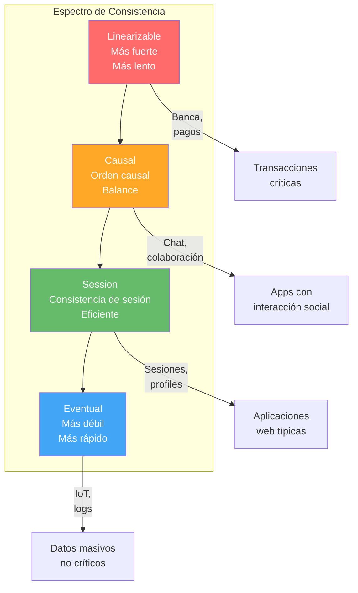

---

## 6. Instalación del Entorno

### 6.1 Docker Desktop en Windows

**Prerrequisitos:**
- Windows 10/11 (64-bit) con las actualizaciones más recientes
- Virtualización habilitada en BIOS/UEFI (Hyper-V o WSL 2)
- Al menos 4 GB de RAM disponibles para Docker
- 20 GB de espacio en disco libre

**Paso 1: Habilitar WSL 2 (recomendado)**

```powershell
# PowerShell como Administrador
wsl --install

# Reiniciar el equipo después de la instalación
# WSL 2 se instala con Ubuntu por defecto
```

**Paso 2: Descargar Docker Desktop**

```powershell
# Descargar el instalador
Invoke-WebRequest -Uri "https://desktop.docker.com/win/main/amd64/Docker%20Desktop%20Installer.exe" -OutFile "$env:TEMP\DockerDesktopInstaller.exe"

# Ejecutar el instalador
Start-Process -FilePath "$env:TEMP\DockerDesktopInstaller.exe" -ArgumentList "install --quiet"
```

Alternativamente, descargar manualmente desde:
`https://www.docker.com/products/docker-desktop/`

**Paso 3: Verificar instalación**

```powershell
# Abrir una nueva terminal y ejecutar:
docker --version
# Docker version 27.x.x, build xxxxxxx

docker-compose --version
# Docker Compose version v2.x.x

docker run hello-world
# Hello from Docker!
# This message shows that your installation appears to be working correctly.
```

**Paso 4: Configuración recomendada**

Abrir Docker Desktop → Settings (ícono de engranaje):

1. **General:**
   - ✅ Use WSL 2 based engine
   - ✅ Start Docker Desktop when you log in
   - ✅ Open Docker Dashboard at startup (opcional)

2. **Resources → WSL Integration:**
   - ✅ Enable integration with my default WSL distro
   - ✅ Ubuntu (tu distro WSL)

3. **Resources → Advanced:**
   - CPUs: 4 (mínimo)
   - Memory: 4096 MB (mínimo 2GB, recomendado 4GB)
   - Swap: 1024 MB
   - Disk image size: 64 GB

4. **Docker Engine → JSON:**
```json
{
  "debug": false,
  "experimental": false,
  "log-driver": "json-file",
  "log-opts": {
    "max-size": "10m",
    "max-file": "3"
  },
  "storage-driver": "overlay2"
}
```

### 6.2 Docker en Linux Ubuntu/Debian

**Paso 1: Actualizar el sistema**

```bash
sudo apt update && sudo apt upgrade -y
```

**Paso 2: Instalar dependencias**

```bash
sudo apt install -y \
    apt-transport-https \
    ca-certificates \
    curl \
    gnupg \
    lsb-release \
    software-properties-common
```

**Paso 3: Agregar la clave GPG oficial de Docker**

```bash
# Crear directorio de claves
sudo install -m 0755 -d /etc/apt/keyrings

# Descargar la clave GPG
curl -fsSL https://download.docker.com/linux/ubuntu/gpg | sudo gpg --dearmor -o /etc/apt/keyrings/docker.gpg

# Dar permisos
sudo chmod a+r /etc/apt/keyrings/docker.gpg
```

**Paso 4: Agregar el repositorio**

```bash
echo \
  "deb [arch=$(dpkg --print-architecture) signed-by=/etc/apt/keyrings/docker.gpg] https://download.docker.com/linux/ubuntu \
  $(. /etc/os-release && echo "$VERSION_CODENAME") stable" | \
  sudo tee /etc/apt/sources.list.d/docker.list > /dev/null
```

**Paso 5: Instalar Docker Engine**

```bash
sudo apt update
sudo apt install -y docker-ce docker-ce-cli containerd.io docker-buildx-plugin docker-compose-plugin
```

**Paso 6: Post-instalación (sin sudo)**

```bash
# Agregar usuario al grupo docker
sudo usermod -aG docker $USER

# Aplicar cambios de grupo (o cerrar sesión y volver a entrar)
newgrp docker

# Verificar
docker run hello-world
```

**Paso 7: Habilitar Docker en inicio automático**

```bash
sudo systemctl enable docker.service
sudo systemctl enable containerd.service
sudo systemctl start docker
```

**Paso 8: Verificar instalación completa**

```bash
# Verificar versión
docker --version
# Docker version 27.x.x

# Verificar compose
docker compose version
# Docker Compose version v2.x.x

# Verificar servicio
sudo systemctl status docker
# ● docker.service - Docker Application Container Engine
#      Loaded: loaded
#      Active: active (running) since ...

# Verificar permisos
docker run hello-world
# Hello from Docker!
```

### 6.3 Verificación de Docker (Ambos Sistemas Operativos)

```bash
# Test completo de funcionalidad
echo "=== Verificación de Docker ==="
echo "Versión:"
docker --version
echo ""
echo "Compose:"
docker compose version
echo ""
echo "Espacio en disco:"
docker system df
echo ""
echo "Run test:"
docker run --rm alpine echo "Docker funciona correctamente"
```

### 6.4 Estructura de Directorios del Curso

```bash
# Crear estructura del curso
mkdir -p nosql-curso/{clase01,clase02,clase03,data}
cd nosql-curso

# Crear archivos de configuración para cada BD
cat > docker-compose.yml << 'EOF'
version: '3.8'

services:
  # MongoDB 7.0
  mongodb:
    image: mongo:7.0
    container_name: nosql-mongo
    ports:
      - "27017:27017"
    environment:
      MONGO_INITDB_ROOT_USERNAME: admin
      MONGO_INITDB_ROOT_PASSWORD: admin123
    volumes:
      - ./data/mongodb:/data/db
    networks:
      - nosql-net
    healthcheck:
      test: ["CMD", "mongosh", "--eval", "db.adminCommand('ping')"]
      interval: 10s
      timeout: 5s
      retries: 5

  # Redis 7
  redis:
    image: redis:7-alpine
    container_name: nosql-redis
    ports:
      - "6379:6379"
    volumes:
      - ./data/redis:/data
    networks:
      - nosql-net
    healthcheck:
      test: ["CMD", "redis-cli", "ping"]
      interval: 10s
      timeout: 5s
      retries: 5

  # Apache Cassandra 4.1
  cassandra:
    image: cassandra:4.1
    container_name: nosql-cassandra
    ports:
      - "9042:9042"
    volumes:
      - ./data/cassandra:/var/lib/cassandra
    networks:
      - nosql-net
    environment:
      CASSANDRA_CLUSTER_NAME: "NoSQLCourse"
      CASSANDRA_DC: datacenter1
    healthcheck:
      test: ["CMD-SHELL", "cqlsh -e 'DESCRIBE KEYSPACES;'"]
      interval: 15s
      timeout: 10s
      retries: 10

  # Neo4j 5
  neo4j:
    image: neo4j:5
    container_name: nosql-neo4j
    ports:
      - "7474:7474"   # HTTP (Browser)
      - "7687:7687"   # Bolt
    volumes:
      - ./data/neo4j:/data
    networks:
      - nosql-net
    environment:
      NEO4J_AUTH: neo4j/grafos123
      NEO4J_PLUGINS: '["apoc"]'
    healthcheck:
      test: ["CMD-SHELL", "wget -qO- http://localhost:7474 || exit 1"]
      interval: 10s
      timeout: 5s
      retries: 5

networks:
  nosql-net:
    driver: bridge
EOF

echo "Estructura creada correctamente"
ls -la
```

### 6.5 Levantar una Instancia Básica de Cada BD

**MongoDB:**

```bash
# Levantar MongoDB
docker run -d \
  --name nosql-mongo \
  -p 27017:27017 \
  -e MONGO_INITDB_ROOT_USERNAME=admin \
  -e MONGO_INITDB_ROOT_PASSWORD=admin123 \
  -v $(pwd)/data/mongodb:/data/db \
  mongo:7.0

# Verificar
docker logs nosql-mongo
# {"t":{"$date":"2024-08-15T10:00:00.000+00:00"},"s":"I","c":"NETWORK","ctx":"listener","msg":"Listening on","attr":{"port":27017}}

# Conectar
docker exec -it nosql-mongo mongosh -u admin -p admin123
# test> db.version()
# '7.0.x'
# test> exit
```

**Redis:**

```bash
# Levantar Redis
docker run -d \
  --name nosql-redis \
  -p 6379:6379 \
  -v $(pwd)/data/redis:/data \
  redis:7-alpine

# Verificar
docker logs nosql-redis
# 1:M 15 Aug 10:00:00.000 * Ready to accept connections

# Conectar
docker exec -it nosql-redis redis-cli
# 127.0.0.1:6379> PING
# PONG
# 127.0.0.1:6379> SET curso "NoSQL"
# OK
# 127.0.0.1:6379> GET curso
# "NoSQL"
# 127.0.0.1:6379> EXIT
```

**Cassandra:**

```bash
# Levantar Cassandra (puede tardar 1-2 minutos en estar listo)
docker run -d \
  --name nosql-cassandra \
  -p 9042:9042 \
  -v $(pwd)/data/cassandra:/var/lib/cassandra \
  -e CASSANDRA_CLUSTER_NAME="NoSQLCourse" \
  -e CASSANDRA_DC=datacenter1 \
  cassandra:4.1

# Esperar a que esté listo
echo "Esperando a que Cassandra esté listo..."
until docker exec nosql-cassandra cqlsh -e "DESCRIBE KEYSPACES;" 2>/dev/null; do
  echo "Esperando..."
  sleep 5
done
echo "¡Cassandra listo!"

# Conectar
docker exec -it nosql-cassandra cqlsh
# Connected to NoSQLCourse at 127.0.0.1:9042
# [cqlsh 6.x]
# cqlsh> DESCRIBE KEYSPACES;
# system  system_schema  system_auth  ...
# cqlsh> EXIT
```

**Neo4j:**

```bash
# Levantar Neo4j
docker run -d \
  --name nosql-neo4j \
  -p 7474:7474 \
  -p 7687:7687 \
  -v $(pwd)/data/neo4j:/data \
  -e NEO4J_AUTH=neo4j/grafos123 \
  neo4j:5

# Verificar
docker logs nosql-neo4j
# ... Started Neo4j Database http://localhost:7474

# Abrir navegador para Neo4j Browser:
# http://localhost:7474
# Login: neo4j / grafos123

# Conectar por CLI (cypher-shell)
docker exec -it nosql-neo4j cypher-shell -u neo4j -p grafos123
# Connected to Neo4j at bolt://localhost:7687 as user neo4j.
# neo4j> RETURN 1 + 1 AS resultado;
# ┌──────────┐
# │ resultado│
# ├──────────┤
# │ 2        │
# └──────────┘
# neo4j> :exit
```

**ObjectDB (explicación breve):**

ObjectDB es una base de datos orientada a objetos para Java, basada en JPA/JDO.
No está disponible como container Docker estándar. Se instala como library Java.

```xml
<!-- Dependencia en pom.xml -->
<dependency>
    <groupId>com.objectdb</groupId>
    <artifactId>objectdb</artifactId>
    <version>2.8.5</version>
</dependency>
```

```java
// Ejemplo mínimo
import javax.persistence.*;

public class Main {
    public static void main(String[] args) {
        // Crear EntityManagerFactory
        EntityManagerFactory emf =
            Persistence.createEntityManagerFactory("miapp.odb");

        // Crear entidad
        EntityManager em = emf.createEntityManager();
        em.getTransaction().begin();

        Producto p = new Producto();
        p.setNombre("Mouse Gamer");
        p.setPrecio(49.99);
        em.persist(p);

        em.getTransaction().commit();
        em.close();
        emf.close();
    }
}
```

### 6.6 Verificación Final de Todo el Entorno

```bash
# Script de verificación completo
echo "========================================="
echo "  VERIFICACIÓN DEL ENTORNO NoSQL"
echo "========================================="

echo ""
echo "1. Docker:"
docker --version
echo ""

echo "2. MongoDB:"
docker exec nosql-mongo mongosh --eval "db.version()" --quiet 2>/dev/null | tail -1
echo ""

echo "3. Redis:"
docker exec nosql-redis redis-cli PING
echo ""

echo "4. Cassandra:"
docker exec nosql-cassandra cqlsh -e "SELECT release_version FROM system.local;" --no-pager 2>/dev/null | tail -1
echo ""

echo "5. Neo4j:"
docker exec nosql-neo4j cypher-shell -u neo4j -p grafos123 -q "RETURN 1 + 1 AS test;" 2>/dev/null | tail -1
echo ""

echo "========================================="
echo "  Todos los servicios están operativos"
echo "========================================="
```

---

## 7. Ejercicio Práctico

### Ejercicio 1: Levantar Cada Base de Datos

**Objetivo:** Familiarizarse con la instalación y levantamiento de cada base de datos.

**Instrucciones:**

1. Usando el `docker-compose.yml` creado anteriormente, levanta todos los servicios:

```bash
# Levantar todo de una vez
docker compose up -d

# Verificar estado
docker compose ps

# Salida esperada:
# NAME              STATUS          PORTS
# nosql-mongo       Up (healthy)    0.0.0.0:27017->27017/tcp
# nosql-redis       Up (healthy)    0.0.0.0:6379->6379/tcp
# nosql-cassandra   Up              0.0.0.0:9042->9042/tcp
# nosql-neo4j       Up (healthy)    0.0.0.0:7474->7474/tcp, 0.0.0.0:7687->7687/tcp
```

### Ejercicio 2: Operaciones Básicas en Cada BD

**Objetivo:** Realizar una operación CRUD básica en cada base de datos.

**MongoDB:**

```javascript
// Conectar: docker exec -it nosql-mongo mongosh -u admin -p admin123
use curso_nosql;

db.ejercicio.insertOne({
    ejercicio: 1,
    base_datos: "MongoDB",
    categoria: "documental",
    completado: false,
    fecha: new Date()
});

db.ejercicio.find().pretty();
```

**Redis:**

```bash
# Conectar: docker exec -it nosql-redis redis-cli
SET ejercicio:1 '{"base_datos":"Redis","categoria":"clave-valor","completado":true}'
GET ejercicio:1
```

**Cassandra:**

```cql
-- Conectar: docker exec -it nosql-cassandra cqlsh
CREATE KEYSPACE IF NOT EXISTS curso_nosql
WITH replication = {'class': 'SimpleStrategy', 'replication_factor': 1};

USE curso_nosql;

CREATE TABLE IF NOT EXISTS ejercicios (
    id UUID PRIMARY KEY,
    nombre TEXT,
    base_datos TEXT,
    categoria TEXT
);

INSERT INTO ejercicios (id, nombre, base_datos, categoria)
VALUES (uuid(), 'Ejercicio 1', 'Cassandra', 'columnar');

SELECT * FROM ejercicios;
```

**Neo4j:**

```cypher
-- Conectar: docker exec -it nosql-neo4j cypher-shell -u neo4j -p grafos123
CREATE (e:Ejercicio {
    nombre: 'Ejercicio 1',
    base_datos: 'Neo4j',
    categoria: 'grafo',
    completado: true
})
RETURN e;
```

### Ejercicio 3: Tabla Comparativa de Tiempos

**Objetivo:** Medir el rendimiento básico de escritura y lectura en cada BD.

```bash
# Crear archivo de benchmark
cat > benchmark.sh << 'SCRIPT'
#!/bin/bash

echo "=== Benchmark NoSQL ==="
echo ""

# MongoDB - 1000 inserts
echo "--- MongoDB ---"
time docker exec nosql-mongo mongosh -u admin -p admin123 --quiet --eval "
use curso_nosql;
for (let i = 0; i < 1000; i++) {
    db.benchmark.insertOne({ index: i, data: 'test', timestamp: new Date() });
}
print('MongoDB: 1000 inserts completados');
"

# Redis - 1000 SETs
echo "--- Redis ---"
time docker exec nosql-redis redis-cli << 'REDIS_CMDS'
MULTI
$(for i in $(seq 1 1000); do echo "SET bench:$i \"value_$i\""; done)
EXEC
REDIS_CMDS
echo "Redis: 1000 SETs completados"

echo ""
echo "=== Benchmark completado ==="
SCRIPT

chmod +x benchmark.sh
./benchmark.sh
```

**Tabla de resultados esperados (approximados):**

| Operación | MongoDB | Redis | Cassandra | Neo4j |
|-----------|---------|-------|-----------|-------|
| 1000 inserts | ~200ms | ~15ms | ~300ms | ~250ms |
| 1000 reads (por ID) | ~100ms | ~10ms | ~150ms | ~120ms |
| Lectura de rango | ~150ms | N/A (KV) | ~200ms | ~180ms |
| Memoria (1000 docs) | ~5MB | ~2MB | ~8MB | ~6MB |

> **Nota:** Los tiempos varían enormemente según hardware, configuración, red,
> y si se ejecuta en container o máquina nativa. Estos valores son orientativos.

### Ejercicio 4: Documentación

Crea un documento Markdown con:
1. Capturas de salida de cada operación
2. Tus observaciones sobre la sintaxis de cada BD
3. ¿Cuál te resultó más fácil de usar? ¿Por qué?
4. ¿Cuál crees que sería mejor para un blog? ¿Para un chat en tiempo real? ¿Para un IoT de 100K sensores?
5. ¿Qué diferencias notaste en los modelos de datos?

---

## Resumen de la Clase

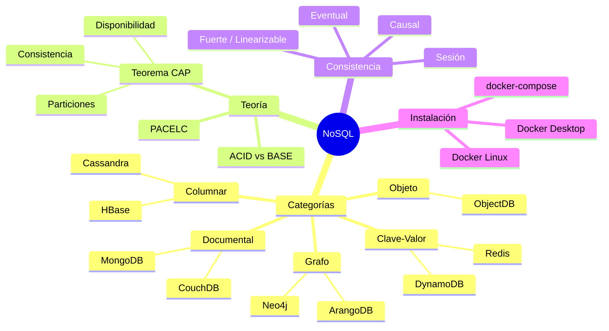

---

> **Próxima clase:** Clase 02 — MongoDB I: Fundamentos, Instalación y CRUD  
> Cubriremos en profundidad la instalación completa de MongoDB, su arquitectura interna con WiredTiger,
> el modelo de datos BSON, y operaciones CRUD completas con todos los operadores disponibles.

---

*Curso NoSQL — Clase 01 de 3 — Introducción a NoSQL y Categorías de Bases de Datos*
