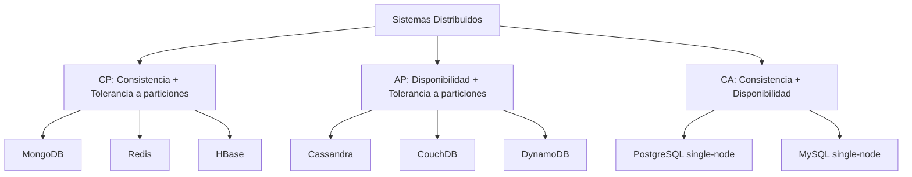
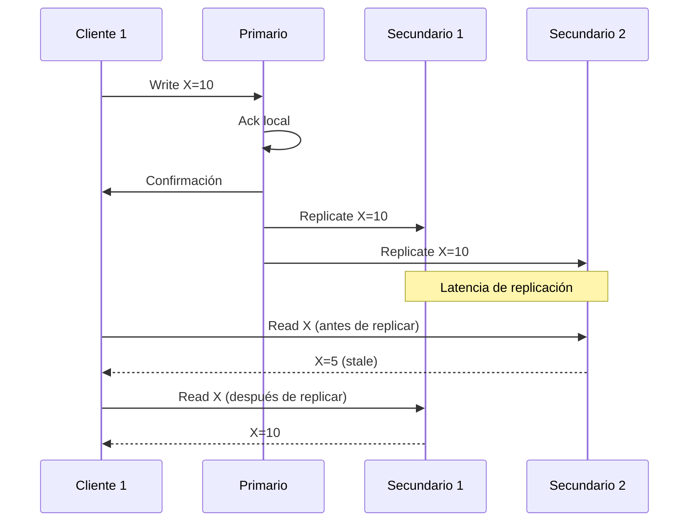

# Clase 2 — ACID, CAP Theorem y Consistencia

## 1. Propiedades ACID

### Definición

| Propiedad | Descripción |
|-----------|-------------|
| Atomicidad | La transacción se ejecuta completa o no se ejecuta |
| Consistencia | La base pasa de un estado válido a otro estado válido |
| Aislamiento | Transacciones concurrentes no interfieren entre sí |
| Durabilidad | Una vez confirmada, la transacción persiste ante fallos |

### Ejemplo: Transferencia bancaria (SQL)

```sql
BEGIN TRANSACTION;

-- Débito de la cuenta origen
UPDATE cuentas SET saldo = saldo - 100 WHERE id = 1;

-- Crédito de la cuenta destino
UPDATE cuentas SET saldo = saldo + 100 WHERE id = 2;

COMMIT;
-- Si algo falla, ROLLBACK;
```

### ACID en MongoDB (desde 4.0)

```javascript
const session = db.getMongo().startSession();
session.startTransaction();

try {
    session.getDatabase("banco").cuentas.updateOne(
        { id: 1 }, { $inc: { saldo: -100 } }
    );
    session.getDatabase("banco").cuentas.updateOne(
        { id: 2 }, { $inc: { saldo: 100 } }
    );
    session.commitTransaction();
} catch (error) {
    session.abortTransaction();
}
```

### Limitaciones de ACID en NoSQL

| Sistema | Soporte ACID |
|---------|--------------|
| PostgreSQL | Completo (multi-fila, multi-tabla) |
| MySQL (InnoDB) | Completo |
| MongoDB | Multi-documento (desde 4.0), con limitaciones de rendimiento |
| Redis | Operaciones individuales son atómicas, MULTI/EXEC para transacciones simples |
| Cassandra | Atomicidad a nivel de fila/partición |
| Neo4j | Completo |

## 2. Teorema CAP

### Definición

En un sistema distribuido, solo se pueden garantizar **dos de tres** propiedades simultáneamente:

| Propiedad | Descripción |
|-----------|-------------|
| Consistencia (C) | Todos los nodos ven los mismos datos al mismo tiempo |
| Disponibilidad (A) | Toda petición recibe respuesta, sin garantía de datos actuales |
| Tolerancia a particiones (P) | El sistema funciona aunque haya pérdida de comunicación entre nodos |

### Clasificación de Bases de Datos



### Escenarios de Tradeoff

**Escenario 1: Sistema bancario**

- Prioridad: Consistencia (CP)
- No se puede permitir saldos inconsistentes
- Sacrifica disponibilidad ante partición de red

**Escenario 2: Red social**

- Prioridad: Disponibilidad (AP)
- Es aceptable que un like tarde en propagarse
- Sacrifica consistencia inmediata

**Escenario 3: Catálogo de productos**

- Prioridad: Disponibilidad (AP)
- Un precio desactualizado por segundos es tolerable
- Mejor mostrar algo que no mostrar nada

## 3. Consistencia Fuerte vs Eventual

### Consistencia Fuerte

- Después de una escritura, todas las lecturas siguientes devuelven el valor actualizado
- Garantiza lineabilidad
- Mayor latencia, menor throughput

```
Cliente1: Escribe X=10 → Nodo A
Cliente2: Lee X → Nodo A (obtiene 10)
Cliente3: Lee X → Nodo B (obtiene 10, espera a que Nodo A replique)
```

### Consistencia Eventual

- Después de una escritura, las lecturas eventualmente devolverán el valor actualizado
- Puede haber ventanas de inconsistencia
- Menor latencia, mayor throughput

```
Cliente1: Escribe X=10 → Nodo A
Cliente2: Lee X → Nodo A (obtiene 10)
Cliente3: Lee X → Nodo B (obtiene valor viejo 5, hasta que se replique)
```

### Niveles de Consistencia en MongoDB

```javascript
// Write Concern
db.collection.insertOne(
    { nombre: "producto" },
    { writeConcern: { w: "majority", wtimeout: 5000 } }
)
// w: 1 → espera confirmación del primario
// w: "majority" → espera mayoría de nodos
// w: 0 → no espera confirmación

// Read Concern
db.collection.find({}).readConcern("majority")
// local → lee del nodo local (puede ser dato no replicado)
// majority → lee datos confirmados por la mayoría
// linearizable → lectura consistente tras lectura de escritura con "majority"
// available → lee sin esperar (puede ser dato stale)
```

### Niveles de Consistencia en Cassandra

```sql
-- Nivel de consistencia en lectura/escritura
CONSISTENCY ONE;      -- 1 nodo responde (máxima velocidad)
CONSISTENCY QUORUM;   -- mayoría de nodos (balance)
CONSISTENCY ALL;      -- todos los nodos (máxima consistencia)
CONSISTENCY LOCAL_QUORUM; -- mayoría en datacenter local
CONSISTENCY EACH_QUORUM;  -- mayoría en cada datacenter
```

## 4. Comparación Práctica: PostgreSQL vs MongoDB vs Cassandra

### Caso: Sistema de gestión de inventarios

**PostgreSQL (SQL, CA):**

```sql
CREATE TABLE inventario (
    producto_id SERIAL PRIMARY KEY,
    nombre VARCHAR(100),
    stock INT,
    precio DECIMAL(10,2),
    ultima_actualizacion TIMESTAMP
);

-- Transacción ACID completa
BEGIN;
UPDATE inventario SET stock = stock - 5 WHERE producto_id = 1;
UPDATE ventas SET total = total + 500 WHERE venta_id = 100;
COMMIT;
```

**MongoDB (NoSQL, CP):**

```javascript
db.inventario.insertOne({
    producto_id: 1,
    nombre: "Laptop",
    stock: 50,
    precio: 999.99,
    ultima_actualizacion: new Date()
})

// Con write concern para replicación
db.inventario.updateOne(
    { producto_id: 1 },
    { $inc: { stock: -5 } },
    { writeConcern: { w: "majority" } }
)
```

**Cassandra (NoSQL, AP):**

```sql
CREATE KEYSPACE tienda WITH REPLICATION = {
    'class': 'SimpleStrategy',
    'replication_factor': 3
};

CREATE TABLE inventario (
    producto_id UUID PRIMARY KEY,
    nombre TEXT,
    stock INT,
    precio DECIMAL,
    ultima_actualizacion TIMESTAMP
);

-- Write con consistencia configurable
CONSISTENCY QUORUM;
UPDATE inventario SET stock = 45, ultima_actualizacion = toTimestamp(now())
WHERE producto_id = uuid;
```

### Métricas comparativas

| Métrica | PostgreSQL | MongoDB | Cassandra |
|---------|-----------|---------|-----------|
| Lecturas/sec (single node) | 10,000 | 15,000 | 20,000 |
| Escrituras/sec (single node) | 5,000 | 10,000 | 50,000 |
| Latencia lectura | 1-5ms | 1-3ms | 1-5ms |
| Latencia escritura | 5-20ms | 3-10ms | 1-3ms |
| Escalamiento | Vertical + Read Replicas | Replica Sets + Sharding | Horizontal nativo |

## 5. Modelos de Consistencia en Sistemas Distribuidos

### Consistencia causal

- Si operación A causó operación B, todos los nodos ven A antes que B
- Ejemplo: un reply siempre se ve después del mensaje original

### Consistencia de sesión

- Dentro de una sesión, un cliente ve sus propias escrituras
- MongoDB usa este modelo por defecto en replica sets

### Consistencia monotónica de lectura

- Una vez que un cliente lee un valor, nunca lee un valor más viejo



## 6. Ejercicio Práctico

1. Configurar MongoDB con diferentes niveles de write concern
2. Medir latencia con `w: 1` vs `w: "majority"`
3. Simular fallo de red entre nodos de un replica set
4. Observar comportamiento con consistencia eventual
5. Implementar transferencia bancaria con transacciones en MongoDB y PostgreSQL
6. Comparar tiempos de ejecución y comportamiento ante errores
