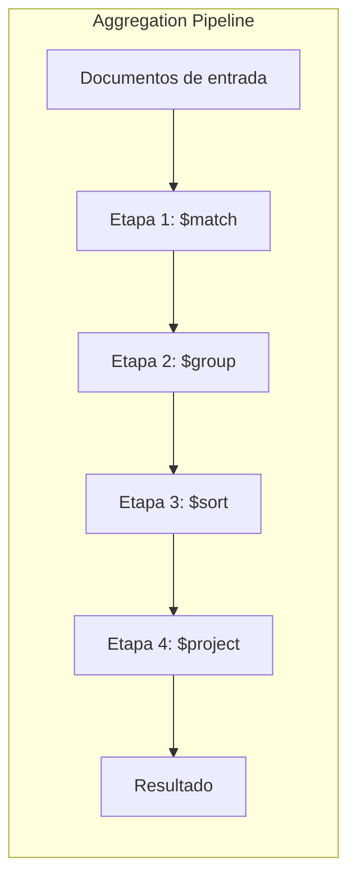
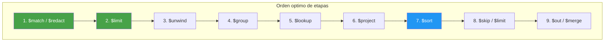
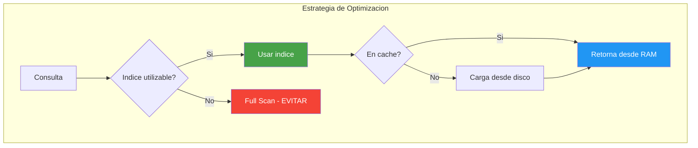
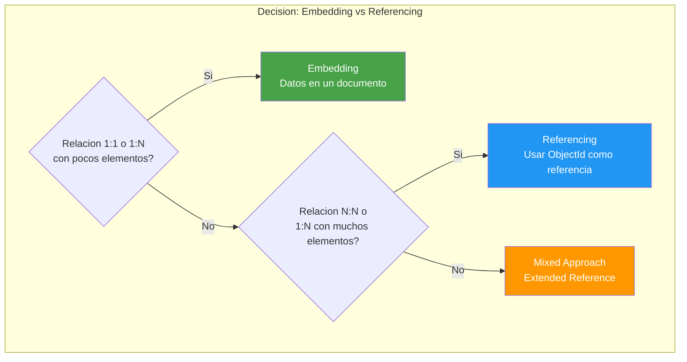
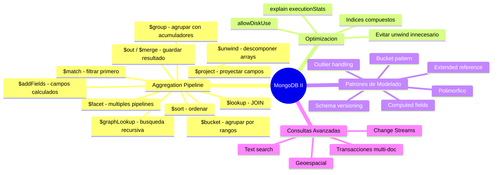

# Clase 03 — MongoDB II: Consultas Avanzadas y Aggregation Pipeline

> **Duracion estimada:** 6 horas  
> **Nivel:** Intermedio a Avanzado  
> **Requisitos previos:** Clase 02 completada, MongoDB instalado y funcionando  
> **Objetivo:** Dominar el pipeline de agregacion, consultas avanzadas, optimizacion y patrones de modelado

---

## Indice

1. [Marco Teorico](#1-marco-teorico)
2. [Aggregation Pipeline (Detallado)](#2-aggregation-pipeline-detallado)
3. [Ejemplos Completos de Aggregation](#3-ejemplos-completos-de-aggregation)
4. [Optimizacion de Pipeline](#4-optimizacion-de-pipeline)
5. [Patrones de Modelado Avanzados](#5-patrones-de-modelado-avanzados)
6. [Consultas Avanzadas Adicionales](#6-consultas-avanzadas-adicionales)
7. [Ejercicio Practico](#7-ejercicio-practico)

---

## 1. Marco Teorico

### 1.1 Pipeline de Agregacion: Concepto y Flujo

El **Aggregation Pipeline** es el mecanismo mas poderoso de MongoDB para
transformar, analizar y resumir datos. Funciona como una tuberia (pipeline)
donde los documentos pasan por multiples etapas, y en cada etapa se
transforman, filtran o reorganizan.



**Analogia con tuberia de datos:**

```
Think of it like a factory assembly line:

[Documentos crudos]
       |
       v
  +----------+     Filtra solo documentos de 2024
  |  $match  |     reduce: 1,000,000 -> 250,000
  +----------+
       |
       v
  +----------+     Agrupa por categoria
  |  $group  |     reduce: 250,000 -> 15 (15 categorias)
  +----------+
       |
       v
  +----------+     Ordena por total descendente
  |  $sort   |     reordena los 15 grupos
  +----------+
       |
       v
  +----------+     Muestra solo nombre y total
  | $project |     solo 2 campos por documento
  +----------+
       |
       v
[Resultado final: 15 documentos con 2 campos cada uno]
```

**Ejemplo basico:**

```javascript
db.ventas.aggregate([
    { $match: { fecha: { $gte: ISODate("2024-01-01") } } },   // Filtrar ventas de 2024
    { $group: { _id: "$categoria", total: { $sum: "$monto" } } },  // Agrupar por categoria
    { $sort: { total: -1 } }   // Ordenar de mayor a menor
]);

// Resultado:
// [
//   { _id: "electronica", total: 450000 },
//   { _id: "hogar", total: 230000 },
//   { _id: "ropa", total: 180000 },
//   ...
// ]
```

### 1.2 Etapas del Pipeline y su Orden Optimo

**Regla de oro: $match y $limit primero, $project y $sort despues.**



| Etapa | Funcion | Impacto | Poner primero? |
|-------|---------|---------|----------------|
| $match | Filtrar documentos | Reduce cantidad de datos | SI |
| $limit | Limitar cantidad | Reduce datos | SI |
| $project | Seleccionar campos | Reduce tamano por doc | No (despues de $group) |
| $group | Agregar datos | Cambia estructura | Despues de $match |
| $sort | Ordenar | Puede ser costoso | Despues de $match+$limit |
| $unwind | Descomponer arrays | Puede multiplicar docs | Despues de $match |
| $lookup | JOIN con otra coleccion | Muy costoso | Despues de filtrar |
| $addFields | Agregar campos calculados | No reduce datos | Despues de $group |
| $out / $merge | Guardar resultado | Final del pipeline | Siempre al final |

### 1.3 Optimizacion de Consultas en MongoDB



**Indices que ayudan al pipeline de agregacion:**

```javascript
// Indice compuesto para un pipeline tipico
db.ventas.createIndex({ fecha: 1, categoria: 1 });
// Ayuda a: $match por fecha + $group por categoria

// Indice para busquedas de texto
db.productos.createIndex({ nombre: "text", descripcion: "text" });

// Indice TTL para datos temporales
db.sessions.createIndex({ createdAt: 1 }, { expireAfterSeconds: 3600 });

// Indice para geolocalizacion
db.tiendas.createIndex({ coordenadas: "2dsphere" });

// Indice parcial (solo documentos que cumplen condicion)
db.productos.createIndex(
    { precio: 1 },
    { partialFilterExpression: { stock: { $gt: 0 } } }
);
```

### 1.4 Patrones de Modelado Avanzados



**Cuando usar embedding:**
- Datos que se acceden JUNTOS frecuentemente
- Relaciones 1:1 o 1:N con < 100 elementos
- Datos que cambian JUNTOS
- No se necesitan consultas independientes

**Cuando usar referencing:**
- Relaciones N:N
- 1:N con miles de elementos (arrays enormes)
- Datos que se acceden independientemente
- Cuando el documento excederia 16 MB con embedding

---

## 2. Aggregation Pipeline (Detallado)

### 2.1 $match — Filtrar Documentos

```javascript
// $match usa la sintaxis de query de MongoDB
// SIEMPRE ponerlo primero para reducir la cantidad de datos

// Filtrar por fecha
db.ventas.aggregate([
    { $match: {
        fecha: {
            $gte: ISODate("2024-01-01"),
            $lt: ISODate("2025-01-01")
        }
    }}
]);

// Filtrar por multiples condiciones
db.ventas.aggregate([
    { $match: {
        $and: [
            { categoria: "electronica" },
            { monto: { $gte: 100 } },
            { estado: "completada" }
        ]
    }}
]);

// Filtrar por valor en array
db.ventas.aggregate([
    { $match: { tags: "oferta" } }
]);

// Filtrar por campo anidado
db.ventas.aggregate([
    { $match: { "direccion.ciudad": "Madrid" } }
]);

// Filtrar por tipo de campo
db.ventas.aggregate([
    { $match: { descuento: { $exists: true, $gt: 0 } } }
]);
```

### 2.2 $group — Agrupar Documentos

```javascript
// Operadores de acumulacion disponibles en $group:

// $sum: suma total
db.ventas.aggregate([
    { $group: {
        _id: "$categoria",
        totalVentas: { $sum: "$monto" },
        cantidadDocumentos: { $sum: 1 }
    }}
]);
// [
//   { _id: "electronica", totalVentas: 450000, cantidadDocumentos: 150 },
//   { _id: "hogar", totalVentas: 230000, cantidadDocumentos: 80 }
// ]

// $avg: promedio
db.ventas.aggregate([
    { $group: {
        _id: "$categoria",
        promedioVenta: { $avg: "$monto" },
        ventaMinima: { $min: "$monto" },
        ventaMaxima: { $max: "$monto" }
    }}
]);

// $push: agregar todos los valores a un array
db.ventas.aggregate([
    { $group: {
        _id: "$categoria",
        todasLasVentas: { $push: "$monto" }
    }}
]);
// [
//   { _id: "electronica", todasLasVentas: [150, 200, 89, 300, ...] }
// ]

// $addToSet: agregar valores unicos a un array
db.ventas.aggregate([
    { $group: {
        _id: "$categoria",
        clientesUnicos: { $addToSet: "$cliente_id" }
    }}
]);

// $first y $last
db.ventas.aggregate([
    { $sort: { fecha: 1 } },
    { $group: {
        _id: "$categoria",
        primeraVenta: { $first: "$monto" },
        ultimaVenta: { $last: "$monto" }
    }}
]);

// $mergeObjects: combinar documentos
db.ventas.aggregate([
    { $group: {
        _id: "$cliente_id",
        datosCombinados: {
            $mergeObjects: {
                categoria: "$categoria",
                monto: "$monto",
                fecha: "$fecha"
            }
        }
    }}
]);

// Contar documentos por grupo (alternativa a $sum: 1)
db.ventas.aggregate([
    { $group: { _id: "$categoria", total: { $sum: 1 } } }
]);
// Equivalente a $count despues de $group
```

### 2.3 $sort — Ordenar

```javascript
// 1 = ascendente, -1 = descendente

// Ordenar por un campo
db.ventas.aggregate([
    { $group: { _id: "$categoria", total: { $sum: "$monto" } } },
    { $sort: { total: -1 } }  // mayor a menor
]);

// Ordenar por multiples campos
db.ventas.aggregate([
    { $group: { _id: "$categoria", total: { $sum: "$monto" } } },
    { $sort: { total: -1, _id: 1 } }  // total desc, categoria asc
]);
```

### 2.4 $project — Proyectar/Renombrar/Calcular Campos

```javascript
// Seleccionar campos
db.ventas.aggregate([
    { $project: {
        _id: 0,
        producto: 1,
        monto: 1,
        fecha: 1
    }}
]);

// Renombrar campos
db.ventas.aggregate([
    { $project: {
        _id: 0,
        nombre_producto: "$producto",
        precio_venta: "$monto"
    }}
]);

// Campos calculados
db.ventas.aggregate([
    { $project: {
        _id: 0,
        producto: 1,
        monto: 1,
        montoConImpuesto: { $multiply: ["$monto", 1.21] },
        descuento: { $multiply: ["$monto", -0.10] }
    }}
]);

// Operaciones string
db.ventas.aggregate([
    { $project: {
        _id: 0,
        productoUpper: { $toUpper: "$producto" },
        productoLower: { $toLower: "$producto" },
        fechaFormateada: { $dateToString: { format: "%Y-%m-%d", date: "$fecha" } },
        substr: { $substrCP: ["$producto", 0, 5] }  // primeros 5 caracteres
    }}
]);

// Condiciones en project
db.ventas.aggregate([
    { $project: {
        _id: 0,
        producto: 1,
        monto: 1,
        categoria: 1,
        montoTexto: {
            $switch: {
                branches: [
                    { case: { $gte: ["$monto", 1000] }, then: "premium" },
                    { case: { $gte: ["$monto", 100] }, then: "medio" }
                ],
                default: "economico"
            }
        }
    }}
]);
```

### 2.5 $unwind — Descomponer Arrays

```javascript
// $unwind descompone un array en documentos individuales
// Cada elemento del array genera un documento

// Ejemplo basico
db.pedidos.aggregate([
    { $match: { _id: ObjectId("...") } },
    { $unwind: "$items" }
]);

// Si un pedido tiene:
// { _id: 1, cliente: "Ana", items: [{prod: "A", cant: 2}, {prod: "B", cant: 1}] }

// Despues de $unwind:
// { _id: 1, cliente: "Ana", items: {prod: "A", cant: 2} }
// { _id: 1, cliente: "Ana", items: {prod: "B", cant: 1} }

// Con preserveNullAndEmptyArrays
db.pedidos.aggregate([
    { $unwind: {
        path: "$items",
        preserveNullAndEmptyArrays: true  // mantiene documentos sin array
    }}
]);

// Con includeArrayIndex
db.pedidos.aggregate([
    { $unwind: {
        path: "$items",
        includeArrayIndex: "indicePosicion"
    }}
]);
// Agrega campo "indicePosicion" con el indice del elemento en el array

// Ejemplo completo: ventas por producto
db.pedidos.aggregate([
    { $unwind: "$items" },
    { $group: {
        _id: "$items.producto",
        totalUnidades: { $sum: "$items.cantidad" },
        totalFacturado: { $sum: { $multiply: ["$items.precio", "$items.cantidad"] } },
        numPedidos: { $sum: 1 }
    }},
    { $sort: { totalFacturado: -1 } }
]);

// Resultado:
// [
//   { _id: "Laptop Pro X1", totalUnidades: 45, totalFacturado: 58499.55, numPedidos: 45 },
//   { _id: "Monitor 4K", totalUnidades: 30, totalFacturado: 23999.70, numPedidos: 30 },
//   ...
// ]
```

### 2.6 $lookup — JOIN con Otra Coleccion

```javascript
// $lookup es equivalente a LEFT OUTER JOIN en SQL

// Ejemplo basico
db.pedidos.aggregate([
    { $lookup: {
        from: "productos",          // coleccion a unir
        localField: "producto_id",  // campo en pedidos
        foreignField: "_id",        // campo en productos
        as: "detalle"               // nombre del nuevo campo (array)
    }}
]);

// Con pipeline (mas flexible, como JOIN ON)
db.pedidos.aggregate([
    { $lookup: {
        from: "productos",
        let: { pid: "$producto_id", cantidad: "$cantidad" },
        pipeline: [
            { $match: {
                $expr: { $eq: ["$_id", "$$pid"] }
            }},
            { $project: {
                nombre: 1,
                precio: 1,
                subtotal: { $multiply: ["$precio", "$$cantidad"] }
            }}
        ],
        as: "detalle"
    }}
]);

// Con unwind para aplanar
db.pedidos.aggregate([
    { $lookup: {
        from: "productos",
        localField: "producto_id",
        foreignField: "_id",
        as: "detalle"
    }},
    { $unwind: "$detalle" },
    { $project: {
        _id: 0,
        pedido_id: "$_id",
        producto: "$detalle.nombre",
        precio: "$detalle.precio",
        cantidad: 1,
        subtotal: { $multiply: ["$detalle.precio", "$cantidad"] }
    }}
]);

// Lookup con multiple condicion
db.pedidos.aggregate([
    { $lookup: {
        from: "clientes",
        let: { cid: "$cliente_id" },
        pipeline: [
            { $match: { $expr: { $eq: ["$_id", "$$cid"] } } },
            { $project: { nombre: 1, email: 1 } }
        ],
        as: "cliente"
    }},
    { $unwind: "$cliente" },
    { $unwind: "$items" },
    { $lookup: {
        from: "productos",
        let: { pid: "$items.producto_id" },
        pipeline: [
            { $match: { $expr: { $eq: ["$_id", "$$pid"] } } },
            { $project: { nombre: 1, precio: 1 } }
        ],
        as: "productoDetalle"
    }},
    { $unwind: "$productoDetalle" },
    { $project: {
        _id: 0,
        cliente: "$cliente.nombre",
        producto: "$productoDetalle.nombre",
        cantidad: "$items.cantidad",
        subtotal: { $multiply: ["$productoDetalle.precio", "$items.cantidad"] }
    }}
]);
```

### 2.7 $addFields — Agregar Campos Calculados

```javascript
// $addFields agrega campos nuevos sin eliminar los existentes

db.ventas.aggregate([
    { $addFields: {
        montoConImpuesto: { $multiply: ["$monto", 1.21] },
        anio: { $year: "$fecha" },
        mes: { $month: "$fecha" },
        diaSemana: { $dayOfWeek: "$fecha" },
        esPremium: { $gte: ["$monto", 500] },
        resumen: { $concat: ["$producto", " - ", "$categoria"] }
    }},
    { $project: {
        _id: 0,
        producto: 1,
        monto: 1,
        montoConImpuesto: 1,
        anio: 1,
        mes: 1,
        diaSemana: 1,
        esPremium: 1,
        resumen: 1
    }}
]);

// $set y $unset son aliases de $addFields y $project respectivamente
db.ventas.aggregate([
    { $set: { nuevoCampo: "valor" } },       // alias de $addFields
    { $unset: ["campoViejo", "otroCampo"] }  // alias de $project (excluir)
]);
```

### 2.8 $out / $merge — Guardar Resultado

```javascript
// $out: reemplaza o crea una coleccion con el resultado
// NOTA: si la coleccion existe, la elimina completamente
db.ventas.aggregate([
    { $group: { _id: "$categoria", total: { $sum: "$monto" } } },
    { $out: "resumen_ventas" }  // crea coleccion "resumen_ventas"
]);

// $merge: mas flexible que $out
// Puede insertar, actualizar, o hacer merge
db.ventas.aggregate([
    { $group: { _id: "$categoria", total: { $sum: "$monto" } } },
    { $merge: {
        into: "resumen_ventas",     // coleccion destino
        on: "_id",                  // campo clave para merge
        whenMatched: "replace",     // replace, merge, keepExisting, fail
        whenNotMatched: "insert"    // insert, discard, fail
    }}
]);

// $merge con time series
db.ventas.aggregate([
    { $group: {
        _id: {
            fecha: { $dateTrunc: { date: "$fecha", unit: "day" } },
            categoria: "$categoria"
        },
        total: { $sum: "$monto" }
    }},
    { $merge: {
        into: "ventas_diarias",
        on: "_id",
        whenMatched: "replace",
        whenNotMatched: "insert"
    }}
]);
```

### 2.9 $facet — Multiples Pipelines en Paralelo

```javascript
// $facet ejecuta multiples sub-pipelines sobre los mismos documentos
// Muy util para dashboards donde necesitas multiples metricas

db.ventas.aggregate([
    { $match: { fecha: { $gte: ISODate("2024-01-01") } } },
    { $facet: {
        // Sub-pipeline 1: Ventas por categoria
        porCategoria: [
            { $group: {
                _id: "$categoria",
                total: { $sum: "$monto" },
                cantidad: { $sum: 1 }
            }},
            { $sort: { total: -1 } }
        ],

        // Sub-pipeline 2: Ventas por mes
        porMes: [
            { $group: {
                _id: { $dateToString: { format: "%Y-%m", date: "$fecha" } },
                total: { $sum: "$monto" }
            }},
            { $sort: { _id: 1 } }
        ],

        // Sub-pipeline 3: Estadisticas generales
        estadisticas: [
            { $group: {
                _id: null,
                totalGeneral: { $sum: "$monto" },
                promedio: { $avg: "$monto" },
                minimo: { $min: "$monto" },
                maximo: { $max: "$monto" },
                count: { $sum: 1 }
            }}
        ],

        // Sub-pipeline 4: Top 5 ventas
        topVentas: [
            { $sort: { monto: -1 } },
            { $limit: 5 },
            { $project: { _id: 0, producto: 1, monto: 1, cliente_id: 1 } }
        ],

        // Sub-pipeline 5: Total de documentos
        totalDocumentos: [
            { $count: "total" }
        ]
    }}
]);

// Resultado (un solo documento con todos los arrays):
// {
//   porCategoria: [
//     { _id: "electronica", total: 450000, cantidad: 150 },
//     { _id: "hogar", total: 230000, cantidad: 80 },
//     ...
//   ],
//   porMes: [
//     { _id: "2024-01", total: 85000 },
//     { _id: "2024-02", total: 92000 },
//     ...
//   ],
//   estadisticas: [{
//     _id: null,
//     totalGeneral: 860000,
//     promedio: 342.50,
//     minimo: 12.99,
//     maximo: 2499.99,
//     count: 2500
//   }],
//   topVentas: [...],
//   totalDocumentos: [{ total: 2500 }]
// }
```

### 2.10 $bucket / $bucketAuto — Agrupar por Rangos

```javascript
// $bucket: agrupar por rangos definidos manualmente
db.ventas.aggregate([
    { $bucket: {
        groupBy: "$monto",
        boundaries: [0, 50, 100, 500, 1000, 5000],
        default: "5000+",
        output: {
            count: { $sum: 1 },
            promedio: { $avg: "$monto" },
            productos: { $addToSet: "$producto" }
        }
    }}
]);
// [
//   { _id: 0, count: 200, promedio: 25.50, productos: ["Cable", "Raton"] },
//   { _id: 50, count: 150, promedio: 75.30, productos: ["Auriculares"] },
//   { _id: 100, count: 80, promedio: 250.00, productos: ["Teclado"] },
//   { _id: 500, count: 40, promedio: 750.00, productos: ["Monitor"] },
//   { _id: 1000, count: 15, promedio: 2000.00, productos: ["Laptop"] },
//   { _id: "5000+", count: 3, promedio: 8000.00, productos: ["Servidor"] }
// ]

// $bucketAuto: MongoDB calcula los rangos automaticamente
db.ventas.aggregate([
    { $bucketAuto: {
        groupBy: "$monto",
        numBuckets: 5,   // numero de rangos
        output: {
            count: { $sum: 1 },
            rango: { $push: "$monto" }
        }
    }}
]);
```

### 2.11 $sample — Muestreo Aleatorio

```javascript
// Tomar una muestra aleatoria de documentos
db.ventas.aggregate([
    { $sample: { size: 100 } }  // 100 documentos aleatorios
]);

// Util para testing o estadisticas rapidas
db.productos.aggregate([
    { $match: { stock: { $gt: 0 } } },
    { $sample: { size: 10 } }  // 10 productos aleatorios con stock
]);
```

### 2.12 $graphLookup — Busqueda Recursiva en Grafos

```javascript
// Busqueda recursiva en estructuras jerarquicas
// Ejemplo: arbol de categorias

// Datos:
// { _id: "electronics", nombre: "Electronica", padre: null }
// { _id: "laptops", nombre: "Laptops", padre: "electronics" }
// { _id: "gaming-laptops", nombre: "Laptops Gaming", padre: "laptops" }

db.categorias.aggregate([
    { $graphLookup: {
        from: "categorias",
        startWith: "$padre",
        connectFromField: "padre",
        connectToField: "_id",
        as: "ancestros",
        maxDepth: 5,
        depthField: "profundidad"
    }}
]);

// Resultado para "gaming-laptops":
// {
//   _id: "gaming-laptops",
//   nombre: "Laptops Gaming",
//   padre: "laptops",
//   ancestros: [
//     { _id: "laptops", nombre: "Laptops", profundidad: 0 },
//     { _id: "electronics", nombre: "Electronica", profundidad: 1 }
//   ]
// }

// Buscar todos los descendientes
db.categorias.aggregate([
    { $match: { _id: "electronics" } },
    { $graphLookup: {
        from: "categorias",
        startWith: "$_id",
        connectFromField: "_id",
        connectToField: "padre",
        as: "descendientes",
        maxDepth: 3
    }}
]);
```

### 2.13 $count

```javascript
// Contar documentos al final del pipeline
db.ventas.aggregate([
    { $match: { categoria: "electronica" } },
    { $count: "totalElectronica" }
]);
// [{ totalElectronica: 150 }]

// Con nombre personalizado
db.ventas.aggregate([
    { $match: { monto: { $gte: 100 } } },
    { $count: "ventasMayores100" }
]);
// [{ ventasMayores100: 800 }]
```

### 2.14 $redact

```javascript
// $redact controla la visibilidad de campos basado en permisos
// Util para sistemas multi-tenant

db.documentos.aggregate([
    { $match: { tenant: "empresa_A" } },
    { $redact: {
        $cond: {
            if: { $eq: ["$visibilidad", "publico"] },
            then: "$$DESCEND",   // incluir y bajar en subdocumentos
            else: "$$PRUNE"      // eliminar este documento
        }
    }}
]);
```

### 2.15 $replaceRoot / $replaceWith

```javascript
// Reemplazar la raiz del documento con un subdocumento
db.usuarios.aggregate([
    { $replaceRoot: {
        newRoot: {
            nombreCompleto: { $concat: ["$nombre", " ", "$apellido"] },
            email: "$email",
            direccion: "$direccion.ciudad"
        }
    }}
]);
// Resultado: documentos planos con los campos especificados

// $replaceWith es alias de $replaceRoot
db.usuarios.aggregate([
    { $replaceWith: "$perfil" }  // reemplaza raiz con el campo "perfil"
]);
```

### 2.16 $switch / $cond (Condicionales)

```javascript
// $switch: multiples condiciones
db.ventas.aggregate([
    { $project: {
        _id: 0,
        producto: 1,
        monto: 1,
        clasificacion: {
            $switch: {
                branches: [
                    { case: { $gte: ["$monto", 1000] }, then: "Premium" },
                    { case: { $gte: ["$monto", 500] }, then: "Gold" },
                    { case: { $gte: ["$monto", 100] }, then: "Silver" }
                ],
                default: "Bronze"
            }
        }
    }}
]);

// $cond: if-then-else simple
db.ventas.aggregate([
    { $project: {
        _id: 0,
        producto: 1,
        monto: 1,
        aplicaDescuento: {
            $cond: {
                if: { $gte: ["$monto", 500] },
                then: true,
                else: false
            }
        },
        precioFinal: {
            $cond: {
                if: { $gte: ["$monto", 500] },
                then: { $multiply: ["$monto", 0.9] },
                else: "$monto"
            }
        }
    }}
]);

// $ifNull: manejar valores null/missing
db.ventas.aggregate([
    { $project: {
        _id: 0,
        producto: 1,
        descuento: { $ifNull: ["$descuento", 0] }
    }}
]);
```

### 2.17 Funciones de Fecha

```javascript
db.ventas.aggregate([
    { $project: {
        _id: 0,
        fechaCompleta: "$fecha",
        anio: { $year: "$fecha" },
        mes: { $month: "$fecha" },
        dia: { $dayOfMonth: "$fecha" },
        diaSemana: { $dayOfWeek: "$fecha" },    // 1=Dom, 7=Sab
        diaAnio: { $dayOfYear: "$fecha" },
        hora: { $hour: "$fecha" },
        minuto: { $minute: "$fecha" },
        segundo: { $second: "$fecha" },
        semana: { $week: "$fecha" },
        trimestre: { $quarter: "$fecha" },
        fechaFormateada: {
            $dateToString: {
                format: "%d/%m/%Y %H:%M",
                date: "$fecha"
            }
        },
        primerDiaMes: {
            $dateTrunc: { date: "$fecha", unit: "month" }
        },
        sumaDias: {
            $dateAdd: { startDate: "$fecha", unit: "day", amount: 7 }
        }
    }}
]);
```

---

## 3. Ejemplos Completos de Aggregation

### 3.1 Analisis de Ventas por Region y Periodo

```javascript
// Pipeline completo para dashboard de ventas
db.ventas.aggregate([
    // 1. Filtrar ventas del ultimo anio
    { $match: {
        fecha: { $gte: ISODate("2024-01-01") },
        estado: "completada"
    }},

    // 2. Enriquecer con info de productos
    { $lookup: {
        from: "productos",
        localField: "producto_id",
        foreignField: "_id",
        as: "producto"
    }},
    { $unwind: "$producto" },

    // 3. Enriquecer con info de clientes
    { $lookup: {
        from: "clientes",
        localField: "cliente_id",
        foreignField: "_id",
        as: "cliente"
    }},
    { $unwind: "$cliente" },

    // 4. Calcular campos derivados
    { $addFields: {
        subtotal: { $multiply: ["$cantidad", "$producto.precio"] },
        impuesto: { $multiply: ["$cantidad", "$producto.precio", 0.21] },
        totalConImpuesto: {
            $multiply: ["$cantidad", "$producto.precio", 1.21]
        },
        anioMes: { $dateToString: { format: "%Y-%m", date: "$fecha" } },
        region: "$cliente.region"
    }},

    // 5. Analisis por region y mes
    { $group: {
        _id: { region: "$region", mes: "$anioMes" },
        totalVentas: { $sum: "$subtotal" },
        totalImpuestos: { $sum: "$impuesto" },
        totalConImpuestos: { $sum: "$totalConImpuesto" },
        cantidadPedidos: { $sum: 1 },
        productosVendidos: { $sum: "$cantidad" },
        clientesUnicos: { $addToSet: "$cliente_id" },
        ticketPromedio: { $avg: "$subtotal" }
    }},

    // 6. Formatear resultado
    { $project: {
        _id: 0,
        region: "$_id.region",
        mes: "$_id.mes",
        totalVentas: { $round: ["$totalVentas", 2] },
        totalImpuestos: { $round: ["$totalImpuestos", 2] },
        totalConImpuestos: { $round: ["$totalConImpuestos", 2] },
        cantidadPedidos: 1,
        productosVendidos: 1,
        clientesUnicos: { $size: "$clientesUnicos" },
        ticketPromedio: { $round: ["$ticketPromedio", 2] }
    }},

    // 7. Ordenar
    { $sort: { region: 1, mes: 1 } }
]);

// Resultado esperado:
// [
//   {
//     region: "Europa",
//     mes: "2024-01",
//     totalVentas: 45000.00,
//     totalImpuestos: 9450.00,
//     totalConImpuestos: 54450.00,
//     cantidadPedidos: 120,
//     productosVendidos: 185,
//     clientesUnicos: 95,
//     ticketPromedio: 375.00
//   },
//   ...
// ]
```

### 3.2 Top N Productos por Categoria

```javascript
db.ventas.aggregate([
    // Filtrar ventas completadas
    { $match: { estado: "completada" } },

    // Unir con productos
    { $lookup: {
        from: "productos",
        localField: "producto_id",
        foreignField: "_id",
        as: "producto"
    }},
    { $unwind: "$producto" },

    // Agrupar por producto y categoria
    { $group: {
        _id: {
            producto: "$producto.nombre",
            categoria: "$producto.categoria"
        },
        totalUnidades: { $sum: "$cantidad" },
        totalFacturado: { $sum: { $multiply: ["$cantidad", "$producto.precio"] } },
        numTransacciones: { $sum: 1 }
    }},

    // Ordenar dentro de cada categoria
    { $sort: { "_id.categoria": 1, totalFacturado: -1 } },

    // Agrupar por categoria y tomar top 3
    { $group: {
        _id: "$_id.categoria",
        top3: {
            $push: {
                producto: "$_id.producto",
                totalUnidades: "$totalUnidades",
                totalFacturado: "$totalFacturado",
                numTransacciones: "$numTransacciones"
            }
        },
        totalCategoria: { $sum: "$totalFacturado" }
    }},

    // Limitar cada array a 3 elementos
    { $project: {
        _id: 0,
        categoria: "$_id",
        totalCategoria: 1,
        top3: { $slice: ["$top3", 3] }
    }},

    { $sort: { totalCategoria: -1 } }
]);

// Resultado:
// [
//   {
//     categoria: "electronica",
//     totalCategoria: 450000,
//     top3: [
//       { producto: "Laptop Pro X1", totalUnidades: 45, totalFacturado: 58499.55, numTransacciones: 45 },
//       { producto: "Monitor 4K", totalUnidades: 30, totalFacturado: 23999.70, numTransacciones: 30 },
//       { producto: "Tablet Air", totalUnidades: 25, totalFacturado: 14999.75, numTransacciones: 25 }
//     ]
//   },
//   ...
// ]
```

### 3.3 Estadisticas de Usuario con $facet

```javascript
// Dashboard completo de estadisticas de un usuario
db.pedidos.aggregate([
    { $match: { cliente_id: ObjectId("...") } },

    { $facet: {
        // Resumen general
        resumen: [
            { $group: {
                _id: null,
                totalPedidos: { $sum: 1 },
                montoTotal: { $sum: "$total" },
                ticketPromedio: { $avg: "$total" },
                primerPedido: { $min: "$fecha" },
                ultimoPedido: { $max: "$fecha" },
                categoriasCompradas: { $addToSet: "$categoria" }
            }}
        ],

        // Evolucion mensual
        evolucionMensual: [
            { $group: {
                _id: { $dateToString: { format: "%Y-%m", date: "$fecha" } },
                pedidos: { $sum: 1 },
                gasto: { $sum: "$total" }
            }},
            { $sort: { _id: 1 } }
        ],

        // Productos mas comprados
        productosFavoritos: [
            { $unwind: "$items" },
            { $group: {
                _id: "$items.producto_id",
                vecesComprado: { $sum: "$items.cantidad" },
                totalGastado: { $sum: { $multiply: ["$items.precio", "$items.cantidad"] } }
            }},
            { $sort: { vecesComprado: -1 } },
            { $limit: 5 },
            { $lookup: {
                from: "productos",
                localField: "_id",
                foreignField: "_id",
                as: "producto"
            }},
            { $unwind: "$producto" },
            { $project: {
                _id: 0,
                nombre: "$producto.nombre",
                vecesComprado: 1,
                totalGastado: { $round: ["$totalGastado", 2] }
            }}
        ],

        // Pedidos por dia de la semana
        pedidosPorDia: [
            { $group: {
                _id: { $dayOfWeek: "$fecha" },
                count: { $sum: 1 }
            }},
            { $sort: { _id: 1 } }
        ]
    }}
]);
```

### 3.4 Busqueda Recursiva con $graphLookup

```javascript
// Estructura: organigrama de empresa
// CEO -> VP -> Directors -> Managers -> Team Leads -> Engineers

// Buscar todos los subordinados de un VP (recursivo)
db.empleados.aggregate([
    { $match: { _id: ObjectId("vp_tech_id") } },
    { $graphLookup: {
        from: "empleados",
        startWith: "$_id",
        connectFromField: "_id",
        connectToField: "reporta_a",
        as: "subordinados",
        maxDepth: 10,
        depthField: "nivel"
    }},
    { $unwind: "$subordinados" },
    { $group: {
        _id: {
            nombre: "$subordinados.nombre",
            cargo: "$subordinados.cargo",
            nivel: "$subordinados.nivel"
            },
        count: { $sum: 1 }
    }},
    { $sort: { "_id.nivel": 1 } }
]);

// Resultado:
// [
//   { _id: { nombre: "Director 1", cargo: "Director", nivel: 0 }, count: 1 },
//   { _id: { nombre: "Manager A", cargo: "Manager", nivel: 1 }, count: 1 },
//   { _id: { nombre: "Manager B", cargo: "Manager", nivel: 1 }, count: 1 },
//   { _id: { nombre: "Team Lead 1", cargo: "Lead", nivel: 2 }, count: 1 },
//   ...
// ]
```

### 3.5 Pipeline de Ventas Mensuales con Campos Calculados

```javascript
db.ventas.aggregate([
    // Filtrar anio actual
    { $match: {
        fecha: { $gte: ISODate("2024-01-01"), $lt: ISODate("2025-01-01") }
    }},

    // Calcular campos
    { $addFields: {
        mes: { $dateToString: { format: "%Y-%m", date: "$fecha" } },
        subtotal: { $multiply: ["$cantidad", "$precio_unitario"] },
        impuesto: { $multiply: ["$cantidad", "$precio_unitario", 0.21] },
        descuentoMonto: {
            $cond: {
                if: { $gte: ["$descuento_pct", 0] },
                then: { $multiply: ["$cantidad", "$precio_unitario", "$descuento_pct", -0.01] },
                else: 0
            }
        }
    }},

    { $addFields: {
        total: {
            $add: ["$subtotal", "$impuesto", "$descuentoMonto"]
        }
    }},

    // Agrupar por mes
    { $group: {
        _id: "$mes",
        ingresosBrutos: { $sum: "$subtotal" },
        impuestosCobrados: { $sum: "$impuesto" },
        descuentosAplicados: { $sum: "$descuentoMonto" },
        ingresosNetos: { $sum: "$total" },
        unidadesVendidas: { $sum: "$cantidad" },
        transacciones: { $sum: 1 }
    }},

    // Agregar metricas derivadas
    { $addFields: {
        ticketPromedio: { $divide: ["$ingresosNetos", "$transacciones"] },
        unidadesPorTransaccion: { $divide: ["$unidadesVendidas", "$transacciones"] },
        tasaDescuento: {
            $multiply: [
                { $divide: ["$descuentosAplicados", "$ingresosBrutos"] },
                100
            ]
        }
    }},

    // Formatear
    { $project: {
        _id: 0,
        mes: "$_id",
        ingresosBrutos: { $round: ["$ingresosBrutos", 2] },
        impuestosCobrados: { $round: ["$impuestosCobrados", 2] },
        descuentosAplicados: { $round: ["$descuentosAplicados", 2] },
        ingresosNetos: { $round: ["$ingresosNetos", 2] },
        unidadesVendidas: 1,
        transacciones: 1,
        ticketPromedio: { $round: ["$ticketPromedio", 2] },
        unidadesPorTransaccion: { $round: ["$unidadesPorTransaccion", 2] },
        tasaDescuento: { $round: ["$tasaDescuento", 2] }
    }},

    { $sort: { mes: 1 } }
]);

// Resultado:
// [
//   {
//     mes: "2024-01",
//     ingresosBrutos: 85000.00,
//     impuestosCobrados: 17850.00,
//     descuentosAplicados: -4250.00,
//     ingresosNetos: 98600.00,
//     unidadesVendidas: 450,
//     transacciones: 120,
//     ticketPromedio: 821.67,
//     unidadesPorTransaccion: 3.75,
//     tasaDescuento: 5.00
//   },
//   ...
// ]
```

---

## 4. Optimizacion de Pipeline

### 4.1 Regla: $match y $limit Primero

```javascript
// MAL: agrupar todos los datos y luego filtrar
db.ventas.aggregate([
    { $group: { _id: "$categoria", total: { $sum: "$monto" } } },
    { $match: { total: { $gt: 10000 } } }  // despues de agrupar
]);

// BIEN: filtrar primero y luego agrupar
db.ventas.aggregate([
    { $match: { monto: { $gt: 10 } } },  // reducir antes de agrupar
    { $group: { _id: "$categoria", total: { $sum: "$monto" } } },
    { $match: { total: { $gt: 10000 } } }
]);

// Mejor aun: usar $match que sea sargable (use indice)
db.ventas.aggregate([
    { $match: { categoria: "electronica", fecha: { $gte: ISODate("2024-01-01") } } },
    { $group: { _id: "$mes", total: { $sum: "$monto" } } }
]);
// MongoDB puede usar el indice { fecha: 1, categoria: 1 }
```

### 4.2 Usar Indices en $match y $sort

```javascript
// Crear indice compuesto que cubra el pipeline
db.ventas.createIndex({ fecha: 1, categoria: 1, monto: 1 });

// Este pipeline puede usar el indice completo
db.ventas.aggregate([
    { $match: { fecha: { $gte: ISODate("2024-01-01") }, categoria: "electronica" } },
    { $group: { _id: "$categoria", total: { $sum: "$monto" } } },
    { $sort: { total: -1 } }
]);

// Verificar con explain
db.ventas.explain("executionStats").aggregate([
    { $match: { fecha: { $gte: ISODate("2024-01-01") }, categoria: "electronica" } },
    { $group: { _id: "$categoria", total: { $sum: "$monto" } } }
]);
```

### 4.3 Evitar $unwind Innecesario

```javascript
// MAL: unwind solo para contar
db.pedidos.aggregate([
    { $unwind: "$items" },
    { $count: "totalItems" }
]);

// BIEN: usar $size o $sum
db.pedidos.aggregate([
    { $group: {
        _id: null,
        totalItems: { $sum: { $size: "$items" } }
    }}
]);

// BIEN: unwind solo cuando necesitas operar por elemento
db.pedidos.aggregate([
    { $unwind: "$items" },
    { $group: { _id: "$items.producto_id", total: { $sum: "$items.cantidad" } } }
]);
```

### 4.4 explain("executionStats") para Analisis

```javascript
// Ver el plan de ejecucion de un pipeline
db.ventas.explain("executionStats").aggregate([
    { $match: { categoria: "electronica" } },
    { $group: { _id: "$mes", total: { $sum: "$monto" } } },
    { $sort: { total: -1 } }
]);

// Campos importantes en la salida:
// {
//   "queryPlanner": {
//     "plannerVersion": 1,
//     "namespace": "tienda.ventas",
//     "indexFilterSet": false,
//     "winningPlan": {
//       "stage": "GROUP",
//       "inputStage": {
//         "stage": "FETCH",
//         "inputStage": {
//           "stage": "IXSCAN",    // <-- usando indice!
//           "keyPattern": { "categoria": 1, "fecha": 1 },
//           "indexName": "categoria_1_fecha_1"
//         }
//       }
//     }
//   },
//   "executionStats": {
//     "executionSuccess": true,
//     "totalDocsExamined": 150,        // documentos examinados
//     "totalKeysExamined": 150,        // claves del indice examinadas
//     "executionTimeMillis": 5          // tiempo total en ms
//   }
// }

// Indicadores a monitorear:
// totalDocsExamined / totalKeysExamined: ratio cercano a 1 es bueno
// executionTimeMillis: debe ser bajo
// winningPlan.stage: ideally IXSCAN or FETCH
// Si ves COLLSCAN: necesita indice!
```

### 4.5 Limite de Memoria por Pipeline

```javascript
// MongoDB tiene un limite de 100MB de memoria por etapa de agregacion
// Para superar esto, usar allowDiskUse

db.ventas.aggregate([
    { $group: { _id: "$categoria", todos: { $push: "$$ROOT" } } },
    { $sort: { "_id": 1 } }
], { allowDiskUse: true });  // permite usar disco temporal

// Verificar uso de memoria
db.ventas.aggregate([
    { $group: { _id: "$categoria", total: { $sum: "$monto" } } }
]).explain("executionStats");

// Buscar en la salida:
// "memUsage" o "memory" - indica si uso disco
```

---

## 5. Patrones de Modelado Avanzados

### 5.1 Patron Bucket: Agrupar Datos por Tiempo

```javascript
// Metricas de sensores IoT: agrupar por hora
// Un "bucket" es un documento que contiene multiples mediciones

// Schema
{
    sensor_id: "sensor_001",
    hora: ISODate("2024-08-15T10:00:00Z"),
    mediciones: [
        { timestamp: ISODate("2024-08-15T10:00:01Z"), valor: 22.5 },
        { timestamp: ISODate("2024-08-15T10:00:06Z"), valor: 22.6 },
        { timestamp: ISODate("2024-08-15T10:00:11Z"), valor: 22.4 },
        // ... hasta 720 mediciones (cada 5 segundos por 1 hora)
    ],
    count: 720,
    min: 22.1,
    max: 23.2,
    avg: 22.55
}

// Insertar metricas con patron bucket
db.metricas.updateOne(
    {
        sensor_id: "sensor_001",
        hora: ISODate("2024-08-15T10:00:00Z")
    },
    {
        $push: {
            mediciones: {
                $each: [{ timestamp: new Date(), valor: 22.5 }],
                $slice: -720  // mantener ultimas 720 (1 hora a 5s)
            }
        },
        $inc: { count: 1 },
        $min: { min: 22.5 },
        $max: { max: 22.5 },
        $set: {
            avg: { $avg: "$mediciones.valor" }  // recalculado periodicamente
        }
    },
    { upsert: true }
);

// Consultar promedios por hora
db.metricas.aggregate([
    { $match: { sensor_id: "sensor_001", hora: { $gte: ISODate("2024-08-15T00:00:00Z") } } },
    { $project: {
        _id: 0,
        hora: 1,
        avg: 1,
        min: 1,
        max: 1
    }},
    { $sort: { hora: 1 } }
]);
```

### 5.2 Patron Polimorfico: Documentos Diferentes en Una Coleccion

```javascript
// Un blog donde cada tipo de post tiene campos diferentes
// pero se almacenan en la misma coleccion

// Post de texto
{
    _id: ObjectId("..."),
    tipo: "texto",
    titulo: "Mi primer post",
    contenido: "Lorem ipsum...",
    autor: "Ana",
    tags: ["tutorial", "mongodb"]
}

// Post de imagen
{
    _id: ObjectId("..."),
    tipo: "imagen",
    titulo: "Foto del dia",
    url: "https://...",
    pie: "Paisaje al atardecer",
    autor: "Carlos",
    dimensiones: { ancho: 1920, alto: 1080 }
}

// Post de video
{
    _id: ObjectId("..."),
    tipo: "video",
    titulo: "Tutorial MongoDB",
    url: "https://youtube.com/...",
    duracion_seg: 1800,
    tags: ["tutorial", "video"],
    autor: "Maria"
}

// Consultar con filtro por tipo
db.posts.aggregate([
    { $match: { tipo: "video" } },
    { $project: { titulo: 1, duracion_seg: 1, autor: 1 } }
]);

// Consultar todos con campos especificos por tipo
db.posts.aggregate([
    { $project: {
        _id: 0,
        titulo: 1,
        autor: 1,
        contenidoEspecifico: {
            $switch: {
                branches: [
                    { case: { $eq: ["$tipo", "texto"] }, then: { tipo: "texto", contenido: "$contenido" } },
                    { case: { $eq: ["$tipo", "imagen"] }, then: { tipo: "imagen", url: "$url", pie: "$pie" } },
                    { case: { $eq: ["$tipo", "video"] }, then: { tipo: "video", url: "$url", duracion: "$duracion_seg" } }
                ],
                default: { tipo: "desconocido" }
            }
        }
    }}
]);
```

### 5.3 Patron Schema Versioning: Versionar Esquemas para Migraciones

```javascript
// Cuando cambias la estructura de un documento, versionar el esquema

// Esquema v1 (version anterior)
{
    schema_version: 1,
    nombre: "Laptop Pro",
    precio: 1299.99,
    specs: "i7, 16GB RAM"  // string plano
}

// Esquema v2 (version nueva)
{
    schema_version: 2,
    nombre: "Laptop Pro",
    precio: 1299.99,
    specs: {                 // objeto estructurado
        procesador: "i7",
        ram: "16GB",
        almacenamiento: "512GB SSD"
    },
    migrated_at: ISODate("2024-08-15T00:00:00Z")
}

// Script de migracion
function migrarV1aV2() {
    const cursor = db.productos.find({ schema_version: 1 });

    cursor.forEach(function(doc) {
        const parts = doc.specs.split(", ");
        const newSpecs = {};
        parts.forEach(function(part) {
            const [key, val] = part.split(" ");
            newSpecs[key.toLowerCase()] = val;
        });

        db.productos.updateOne(
            { _id: doc._id },
            {
                $set: {
                    schema_version: 2,
                    specs: newSpecs,
                    migrated_at: new Date()
                }
            }
        );
    });

    print("Migracion v1 -> v2 completada");
}

migrarV1aV2();
```

### 5.4 Patron Extended Reference: Embeber + Referenciar

```javascript
// Datos frecuentes: embeber directamente
// Datos poco frecuentes: referenciar con $lookup

// Coleccion pedidos (datos embebidos del producto)
{
    _id: ObjectId("..."),
    cliente_id: ObjectId("cliente_001"),
    fecha: ISODate("2024-08-15"),
    items: [
        {
            producto_id: ObjectId("prod_001"),
            // Datos embebidos (denormalizados) - acceso rapido
            nombre: "Laptop Pro X1",
            precio_unitario: 1299.99,
            // Datos referenciados - acceso bajo demanda
            categoria_id: ObjectId("cat_001")
        }
    ],
    total: 1299.99
}

// Cuando necesitas info detallada del producto, usar $lookup
db.pedidos.aggregate([
    { $unwind: "$items" },
    { $lookup: {
        from: "productos",
        localField: "items.producto_id",
        foreignField: "_id",
        as: "items.detalle"
    }},
    { $unwind: "$items.detalle" }
]);
```

### 5.5 Patron Computed: Pre-Calcular Valores Derivados

```javascript
// Evitar calcular en tiempo de ejecucion; pre-calcular en escritura

// Cuando se crea una venta, calcular campos derivados
db.ventas.insertOne({
    producto_id: ObjectId("..."),
    cantidad: 3,
    precio_unitario: 1299.99,
    descuento_pct: 10,
    // Campos pre-calculados
    subtotal: 3899.97,
    descuento_monto: 389.997,
    impuesto: 720.19,
    total: 4230.17,
    fecha_creacion: new Date()
});

// Para consultas, no es necesario calcular nada
db.ventas.aggregate([
    { $group: {
        _id: "$producto_id",
        totalVentas: { $sum: "$total" },
        totalDescuentos: { $sum: "$descuento_monto" }
    }}
]);
// Rapido porque no hay operaciones computacionales
```

### 5.6 Patron Outlier: Manejar Documentos Atipicos

```javascript
// Cuando un documento es significativamente diferente a los demas

// Documento normal: ~100 opiniones
{
    _id: ObjectId("..."),
    producto: "Laptop Pro",
    opiniones: [ /* 100 opiniones */ ]
}

// Documento atipico: 50,000 opiniones (producto viral)
// Esto excederia 16MB!

// Solucion: separar opiniones en coleccion propia
{
    _id: ObjectId("..."),
    producto: "Laptop Pro",
    opiniones_count: 50000,
    rating_promedio: 4.7,
    opiniones_ref: "opiniones_prod_001"  // referencia a otra coleccion
}

// Coleccion de opiniones (separada)
{
    producto_id: ObjectId("..."),
    opiniones: [ /* batch de 1000 opiniones */ ],
    batch_number: 1
}
{
    producto_id: ObjectId("..."),
    opiniones: [ /* otro batch de 1000 */ ],
    batch_number: 2
}

// Consultar con $lookup
db.productos.aggregate([
    { $match: { _id: ObjectId("...") } },
    { $lookup: {
        from: "opiniones",
        localField: "_id",
        foreignField: "producto_id",
        as: "opiniones_data"
    }},
    { $unwind: "$opiniones_data" },
    { $unwind: "$opiniones_data.opiniones" },
    { $group: {
        _id: "$_id",
        producto: { $first: "$producto" },
        opiniones: { $push: "$opiniones_data.opiniones" },
        totalOpiniones: { $sum: 1 }
    }}
]);
```

---

## 6. Consultas Avanzadas Adicionales

### 6.1 Text Search con Indices de Texto

```javascript
// Crear indice de texto
db.productos.createIndex({ nombre: "text", descripcion: "text" });

// Busqueda en texto
db.productos.find({ $text: { $search: "laptop gaming" } });

// Busqueda con frase exacta
db.productos.find({ $text: { $search: "\"laptop gamer\"" } });

// Busqueda excluyendo terminos
db.productos.find({ $text: { $search: "laptop -notebook" } });

// Busqueda con idioma
db.productos.find({ $text: { $search: "auriculares", $language: "spanish" } });

// Busqueda en aggregation pipeline
db.productos.aggregate([
    { $match: { $text: { $search: "laptop gaming" } } },
    { $addFields: { score: { $meta: "textScore" } } },
    { $sort: { score: -1 } },
    { $project: { nombre: 1, precio: 1, score: 1 } }
]);

// Limitar campos de texto
db.productos.createIndex(
    { nombre: "text", descripcion: "text" },
    { weights: { nombre: 10, descripcion: 1 } }  // nombre 10x mas relevante
);
```

### 6.2 Busqueda Geoespacial

```javascript
// Crear indice geoespacial
db.tiendas.createIndex({ coordenadas: "2dsphere" });

// Buscar tiendas cerca de un punto
db.tiendas.find({
    coordenadas: {
        $near: {
            $geometry: { type: "Point", coordinates: [-3.7038, 40.4168] },  // Madrid
            $maxDistance: 5000,  // 5 km
            $minDistance: 100    // 100 metros
        }
    }
});

// Buscar dentro de un area
db.tiendas.find({
    coordenadas: {
        $geoWithin: {
            $geometry: {
                type: "Polygon",
                coordinates: [[
                    [-3.8, 40.3],  // esquina suroeste
                    [-3.6, 40.3],  // esquina sureste
                    [-3.6, 40.5],  // esquina noreste
                    [-3.8, 40.5],  // esquina noroeste
                    [-3.8, 40.3]   // cerrar el poligono
                ]]
            }
        }
    }
});

// Buscar dentro de un radio con aggregation
db.tiendas.aggregate([
    { $geoNear: {
        near: { type: "Point", coordinates: [-3.7038, 40.4168] },
        distanceField: "distancia",
        maxDistance: 5000,
        minDistance: 100,
        spherical: true,
        key: "coordenadas"
    }},
    { $project: { nombre: 1, distancia: 1, direccion: 1 } },
    { $sort: { distancia: 1 } }
]);
```

### 6.3 Transacciones Multi-Document

```javascript
// Disponible desde MongoDB 4.0 (standalone) y 4.2 (sharded)
// Requiere Replica Set (al menos 3 nodos)

// Ejemplo: transferencia bancaria
const session = client.startSession();

try {
    session.startTransaction({
        readConcern: { level: "snapshot" },
        writeConcern: { w: "majority" },
        readPreference: "primary"
    });

    // Paso 1: Debitar cuenta origen
    const resultadoDebito = db.cuentas.updateOne(
        { _id: ObjectId("cuenta_origen"), saldo: { $gte: 500 } },
        { $inc: { saldo: -500 } },
        { session }
    );

    if (resultadoDebito.modifiedCount === 0) {
        throw new Error("Fondos insuficientes o cuenta no encontrada");
    }

    // Paso 2: Acreditar cuenta destino
    const resultadoCredito = db.cuentas.updateOne(
        { _id: ObjectId("cuenta_destino") },
        { $inc: { saldo: 500 } },
        { session }
    );

    // Paso 3: Registrar movimiento
    db.movimientos.insertOne({
        cuenta_origen: ObjectId("cuenta_origen"),
        cuenta_destino: ObjectId("cuenta_destino"),
        monto: 500,
        tipo: "transferencia",
        fecha: new Date(),
        estado: "completada"
    }, { session });

    // Confirmar transaccion
    await session.commitTransaction();
    print("Transferencia completada exitosamente");

} catch (error) {
    // Deshacer todos los cambios
    await session.abortTransaction();
    print("Transferencia abortada: " + error.message);

} finally {
    session.endSession();
}

// NOTA: Las transacciones multi-document tienen overhead de rendimiento.
// Usarlas solo cuando sea estrictamente necesario (dinero, inventario critico).
```

### 6.4 Change Streams

```javascript
// Change Streams permiten escuchar cambios en tiempo real
// Requiere Replica Set

// Escuchar cambios en una coleccion
const changeStream = db.productos.watch();

changeStream.on("change", function(change) {
    print("Cambio detectado:");
    print("  Tipo: " + change.operationType);
    print("  Documento: " + JSON.stringify(change.fullDocument));
    print("  Timestamp: " + change.clusterTime);
});

// change.operationType puede ser:
// - "insert": nuevo documento
// - "update": documento modificado
// - "replace": documento reemplazado
// - "delete": documento eliminado
// - "drop": coleccion eliminada
// - "rename": coleccion renombrada

// Filtrar solo ciertos tipos de cambio
const filteredStream = db.productos.watch([
    { $match: { "operationType": "insert" } }
]);

filteredStream.on("change", function(change) {
    print("Nuevo producto: " + change.fullDocument.nombre);
});

// Change stream con pipeline completo
const pipelineStream = db.ventas.watch([
    { $match: { "operationType": { $in: ["insert", "update"] } } },
    { $match: { "fullDocument.monto": { $gte: 1000 } } }  // solo ventas grandes
]);

pipelineStream.on("change", function(change) {
    print("Venta grande detectada: $" + change.fullDocument.monto);
});

// Change stream en toda la base de datos
const dbStream = db.watch();

// Change stream en todo el cluster
const clusterStream = client.watch();

// Resumir desde un token (para reconexiones)
let resumeToken = null;

const resumeableStream = db.productos.watch();
resumeableStream.on("change", function(change) {
    print("Cambio: " + change.operationType);
    resumeToken = change._id;  // guardar token
});

// Al reconectar:
const resumedStream = db.productos.watch([], { resumeAfter: resumeToken });
```

---

## 7. Ejercicio Practico

### Ejercicio 1: Pipeline de Agregacion para Dashboard de Ventas

```javascript
// Crear pipeline completo que genere:
// 1. Ventas totales por categoria
// 2. Top 5 productos mas vendidos
// 3. Evolucion mensual
// 4. Estadisticas generales

db.ventas.aggregate([
    // Enriquecer con datos de productos y clientes
    { $lookup: {
        from: "productos",
        localField: "producto_id",
        foreignField: "_id",
        as: "producto"
    }},
    { $unwind: "$producto" },
    { $lookup: {
        from: "clientes",
        localField: "cliente_id",
        foreignField: "_id",
        as: "cliente"
    }},
    { $unwind: "$cliente" },

    // Agregar campos calculados
    { $addFields: {
        subtotal: { $multiply: ["$cantidad", "$producto.precio"] },
        mes: { $dateToString: { format: "%Y-%m", date: "$fecha" } }
    }},

    // Dashboard con facet
    { $facet: {
        ventasPorCategoria: [
            { $group: {
                _id: "$producto.categoria",
                total: { $sum: "$subtotal" },
                cantidad: { $sum: 1 }
            }},
            { $sort: { total: -1 } }
        ],

        top5Productos: [
            { $group: {
                _id: "$producto.nombre",
                totalVendido: { $sum: "$cantidad" },
                totalFacturado: { $sum: "$subtotal" }
            }},
            { $sort: { totalFacturado: -1 } },
            { $limit: 5 }
        ],

        evolucionMensual: [
            { $group: {
                _id: "$mes",
                ingresos: { $sum: "$subtotal" },
                pedidos: { $sum: 1 }
            }},
            { $sort: { _id: 1 } }
        ],

        estadisticas: [
            { $group: {
                _id: null,
                totalGeneral: { $sum: "$subtotal" },
                ticketPromedio: { $avg: "$subtotal" },
                clientesUnicos: { $addToSet: "$cliente._id" },
                totalTransacciones: { $sum: 1 }
            }},
            { $project: {
                _id: 0,
                totalGeneral: { $round: ["$totalGeneral", 2] },
                ticketPromedio: { $round: ["$ticketPromedio", 2] },
                totalClientes: { $size: "$clientesUnicos" },
                totalTransacciones: 1
            }}
        ]
    }}
]);
```

### Ejercicio 2: Busqueda de Texto

```javascript
// Crear indice de texto compuesto
db.productos.createIndex(
    { nombre: "text", descripcion: "text", categorias: "text" },
    { weights: { nombre: 10, descripcion: 5, categorias: 3 } }
);

// Realizar busquedas
db.productos.aggregate([
    { $match: { $text: { $search: "gaming laptop rapido" } } },
    { $addFields: { relevancia: { $meta: "textScore" } } },
    { $sort: { relevancia: -1 } },
    { $project: { nombre: 1, precio: 1, relevancia: 1 } },
    { $limit: 10 }
]);
```

### Ejercicio 3: Vista Materializada con $merge

```javascript
// Crear una "vista materializada" que se actualice periodicamente
// de ventas diarias

function actualizarResumenVentas() {
    db.ventas.aggregate([
        { $group: {
            _id: {
                fecha: { $dateTrunc: { date: "$fecha", unit: "day" } },
                categoria: "$categoria"
            },
            totalVentas: { $sum: "$monto" },
            numPedidos: { $sum: 1 },
            ticketPromedio: { $avg: "$monto" }
        }},
        { $merge: {
            into: "resumen_ventas_diarias",
            on: "_id",
            whenMatched: "replace",
            whenNotMatched: "insert"
        }}
    ]);
    print("Resumen actualizado: " + new Date());
}

// Ejecutar periadicamente (ej: cada noche)
// En produccion usar un cron job o scheduler
actualizarResumenVentas();

// Consultar la vista materializada (rapida, sin computacion)
db.resumen_ventas_diarias.find({
    "_id.fecha": { $gte: ISODate("2024-08-01") }
}).sort({ "_id.fecha": -1 });
```

### Ejercicio 4: Analizar Planes de Ejecucion

```javascript
// Analizar el rendimiento de consultas

// 1. Consulta sin indice
db.ventas.explain("executionStats").aggregate([
    { $match: { categoria: "electronica" } },
    { $group: { _id: "$mes", total: { $sum: "$monto" } } }
]);

// Ver: stage: COLLSCAN (mal - escaneo completo)

// 2. Crear indice
db.ventas.createIndex({ categoria: 1, fecha: 1, monto: 1 });

// 3. Consulta con indice
db.ventas.explain("executionStats").aggregate([
    { $match: { categoria: "electronica" } },
    { $group: { _id: "$mes", total: { $sum: "$monto" } } }
]);

// Ver: stage: IXSCAN (bueno - usa indice)

// 4. Analizar pipeline complejo
db.ventas.explain("executionStats").aggregate([
    { $match: { fecha: { $gte: ISODate("2024-01-01") } } },
    { $group: { _id: "$categoria", total: { $sum: "$monto" } } },
    { $sort: { total: -1 } },
    { $limit: 5 }
]);

// 5. Comparar con y sin allowDiskUse
db.ventas.explain("executionStats").aggregate([
    { $group: { _id: "$categoria", todos: { $push: "$$ROOT" } } }
]);

db.ventas.explain("executionStats").aggregate([
    { $group: { _id: "$categoria", todos: { $push: "$$ROOT" } } }
], { allowDiskUse: true });
```

### Ejercicio 5: Change Streams

```javascript
// Configurar un change stream para monitorear nuevos pedidos
const stream = db.pedidos.watch([
    { $match: { "operationType": "insert" } }
]);

stream.on("change", function(change) {
    const pedido = change.fullDocument;
    print("=== NUEVO PEDIDO ===");
    print("Cliente: " + pedido.cliente_id);
    print("Items: " + pedido.items.length);
    print("Total: $" + pedido.total);
    print("====================");

    // Aqui se podria enviar un email de confirmacion,
    // actualizar un dashboard, etc.
});
```

---

## Resumen de la Clase



---

> **Proxima sesion:** Ejercicios finales y proyecto integrador
> Aplicaremos todo lo aprendido en las 3 clases para construir un sistema
> completo de e-commerce con multiples bases de datos NoSQL.

---

*Curso NoSQL — Clase 03 de 3 — MongoDB II: Consultas Avanzadas y Aggregation Pipeline*
