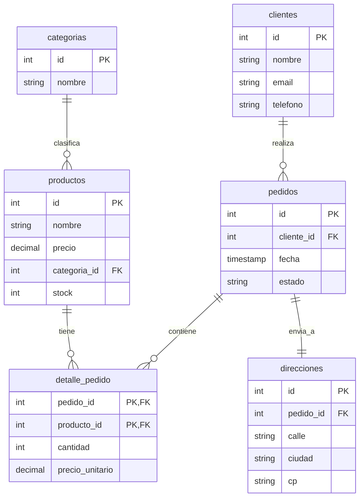
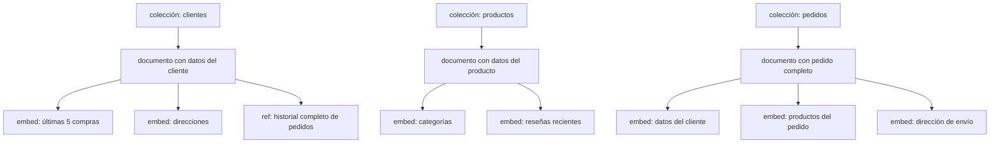

# Clase 3 — Normalización vs Desnormalización

## 1. Normalización en Bases Relacionales

### Formas Normales

**1FN (Primera Forma Normal):**

- Valores atómicos (sin grupos repetitivos)
- Cada columna contiene un solo valor

```sql
-- INCORRECTO (viola 1FN)
CREATE TABLE usuarios (
    id INT PRIMARY KEY,
    nombre VARCHAR(100),
    telefonos VARCHAR(200) -- "555-1234,555-5678"
);

-- CORRECTO (cumple 1FN)
CREATE TABLE usuarios (
    id INT PRIMARY KEY,
    nombre VARCHAR(100)
);

CREATE TABLE telefonos (
    id INT PRIMARY KEY,
    usuario_id INT REFERENCES usuarios(id),
    numero VARCHAR(20)
);
```

**2FN (Segunda Forma Normal):**

- Cumple 1FN
- Todos los atributos no clave dependen de toda la clave primaria

```sql
-- INCORRECTO (dependencia parcial)
CREATE TABLE detalle_pedido (
    pedido_id INT,
    producto_id INT,
    nombre_producto VARCHAR(100), -- depende solo de producto_id
    cantidad INT,
    PRIMARY KEY (pedido_id, producto_id)
);

-- CORRECTO (cumple 2FN)
CREATE TABLE detalle_pedido (
    pedido_id INT,
    producto_id INT,
    cantidad INT,
    PRIMARY KEY (pedido_id, producto_id)
);

CREATE TABLE productos (
    id INT PRIMARY KEY,
    nombre VARCHAR(100),
    precio DECIMAL(10,2)
);
```

**3FN (Tercera Forma Normal):**

- Cumple 2FN
- Sin dependencias transitivas

```sql
-- INCORRECTO (dependencia transitiva)
CREATE TABLE pedidos (
    id INT PRIMARY KEY,
    usuario_id INT,
    nombre_usuario VARCHAR(100), -- depende de usuario_id, no de id
    direccion_usuario VARCHAR(200)
);

-- CORRECTO (cumple 3FN)
CREATE TABLE pedidos (
    id INT PRIMARY KEY,
    usuario_id INT REFERENCES usuarios(id),
    fecha TIMESTAMP
);

CREATE TABLE usuarios (
    id INT PRIMARY KEY,
    nombre VARCHAR(100),
    direccion VARCHAR(200)
);
```

### E-commerce Normalizado (SQL)



```sql
CREATE TABLE clientes (
    id SERIAL PRIMARY KEY,
    nombre VARCHAR(100),
    email VARCHAR(150) UNIQUE,
    telefono VARCHAR(20)
);

CREATE TABLE categorias (
    id SERIAL PRIMARY KEY,
    nombre VARCHAR(50)
);

CREATE TABLE productos (
    id SERIAL PRIMARY KEY,
    nombre VARCHAR(100),
    precio DECIMAL(10,2),
    categoria_id INT REFERENCES categorias(id),
    stock INT
);

CREATE TABLE pedidos (
    id SERIAL PRIMARY KEY,
    cliente_id INT REFERENCES clientes(id),
    fecha TIMESTAMP DEFAULT NOW(),
    estado VARCHAR(20)
);

CREATE TABLE detalle_pedido (
    pedido_id INT REFERENCES pedidos(id),
    producto_id INT REFERENCES productos(id),
    cantidad INT,
    precio_unitario DECIMAL(10,2),
    PRIMARY KEY (pedido_id, producto_id)
);

CREATE TABLE direcciones (
    id SERIAL PRIMARY KEY,
    pedido_id INT REFERENCES pedidos(id),
    calle VARCHAR(100),
    ciudad VARCHAR(50),
    cp VARCHAR(10)
);
```

Consulta para obtener pedido completo:

```sql
SELECT c.nombre, p.fecha, p.estado,
       dp.cantidad, dp.precio_unitario,
       pr.nombre as producto,
       d.calle, d.ciudad
FROM pedidos p
JOIN clientes c ON p.cliente_id = c.id
JOIN detalle_pedido dp ON p.id = dp.pedido_id
JOIN productos pr ON dp.producto_id = pr.id
JOIN direcciones d ON p.id = d.pedido_id
WHERE p.id = 1;
```

## 2. Desnormalización en NoSQL

### Patrones de Desnormalización

**Patrón 1: Documento Embebido**

- Datos relacionados se almacenan dentro del mismo documento
- Lectura en una sola operación
- Ideal para relaciones 1:1 o 1:few

```javascript
db.pedidos.insertOne({
    cliente_id: ObjectId("..."),
    cliente_nombre: "María López",
    cliente_email: "maria@ejemplo.com",
    fecha: new Date(),
    estado: "pendiente",
    productos: [
        { producto_id: ObjectId("..."), nombre: "Laptop", cantidad: 1, precio: 999.99 },
        { producto_id: ObjectId("..."), nombre: "Mouse", cantidad: 2, precio: 25.50 }
    ],
    direccion_envio: {
        calle: "Av. Corrientes 1234",
        ciudad: "Buenos Aires",
        cp: "C1043"
    },
    total: 1050.99
})
```

**Patrón 2: Referencia**

- Similar al modelo relacional, con IDs apuntando a otros documentos
- Ideal para relaciones 1:many o many:many
- Requiere `$lookup` para unir datos

```javascript
db.clientes.insertOne({
    _id: ObjectId("64f1a2b3c4d5e6f7a8b9c0d1"),
    nombre: "María López",
    email: "maria@ejemplo.com"
})

db.pedidos.insertMany([
    {
        cliente_id: ObjectId("64f1a2b3c4d5e6f7a8b9c0d1"),
        fecha: new Date(),
        estado: "completado",
        total: 1050.99
    },
    {
        cliente_id: ObjectId("64f1a2b3c4d5e6f7a8b9c0d1"),
        fecha: new Date(),
        estado: "pendiente",
        total: 250.00
    }
])
```

**Patrón 3: Documento Polimórfico**

- Misma colección con documentos de estructuras diferentes
- Campo `tipo` para diferenciar

```javascript
db.contenido.insertMany([
    {
        tipo: "articulo",
        titulo: "Introducción a MongoDB",
        autor: "Carlos",
        cuerpo: "MongoDB es una base de datos...",
        tags: ["mongodb", "nosql"],
        fecha: new Date()
    },
    {
        tipo: "video",
        titulo: "Tutorial MongoDB Avanzado",
        autor: "Carlos",
        url: "https://youtube.com/...",
        duracion: 1200,
        thumbnail: "img.jpg",
        fecha: new Date()
    },
    {
        tipo: "podcast",
        titulo: "Episodio 5: NoSQL",
        autor: "Ana",
        audio_url: "https://audio.com/...",
        duracion: 3600,
        invitados: ["Pedro", "María"],
        fecha: new Date()
    }
])
```

**Patrón 4: Bucket**

- Agrupar múltiples sub-documentos en un "bucket" para reducir cantidad de documentos
- Ideal para series de tiempo o logs

```javascript
db.metricas_horarias.insertOne({
    servidor_id: "srv-001",
    fecha: "2024-01-15",
    hora: 14,
    lecturas: [
        { minuto: 0, cpu: 45.2, mem: 62.1 },
        { minuto: 1, cpu: 46.8, mem: 62.3 },
        { minuto: 2, cpu: 44.5, mem: 61.9 }
        // ... 60 lecturas por hora
    ]
})
```

**Patrón 5: Atributo (Tree)**

- Representar jerarquías con paths materializados

```javascript
db.categorias.insertMany([
    { _id: "electronics", path: "/electronics", nombre: "Electrónica" },
    { _id: "laptops", path: "/electronics/laptops", nombre: "Laptops" },
    { _id: "gaming", path: "/electronics/laptops/gaming", nombre: "Gaming" },
    { _id: "phones", path: "/electronics/phones", nombre: "Teléfonos" }
])

// Buscar todas las subcategorías de electronics
db.categorias.find({ path: /^\/electronics\// })
```

### E-commerce Desnormalizado (MongoDB)



```javascript
// Colección: clientes (desnormalizado)
db.clientes.insertOne({
    nombre: "María López",
    email: "maria@ejemplo.com",
    telefonos: ["555-1234", "555-5678"],
    direcciones: [
        { tipo: "casa", calle: "Av. Corrientes 1234", ciudad: "Buenos Aires", cp: "C1043" },
        { tipo: "trabajo", calle: "San Martín 567", ciudad: "Buenos Aires", cp: "C1000" }
    ],
    ultimas_compras: [
        { pedido_id: ObjectId("..."), fecha: new Date("2024-01-10"), total: 1050.99 },
        { pedido_id: ObjectId("..."), fecha: new Date("2024-01-05"), total: 250.00 }
    ],
    total_compras: 15,
    total_gastado: 8750.50
})

// Colección: productos (desnormalizado)
db.productos.insertOne({
    nombre: "Laptop Gaming Pro",
    precio: 1299.99,
    categorias: ["Electrónica", "Laptops", "Gaming"],
    stock: 45,
    especificaciones: {
        procesador: "Intel i7-13700H",
        ram: "16GB",
        disco: "512GB SSD",
        pantalla: '15.6" FHD 144Hz'
    },
    reseñas_recientes: [
        { usuario: "Juan", rating: 5, texto: "Excelente", fecha: new Date() },
        { usuario: "Ana", rating: 4, texto: "Muy buena", fecha: new Date() }
    ],
    rating_promedio: 4.6,
    total_reseñas: 128
})
```

## 3. Modelado Centrado en Consultas

### Principio fundamental

En NoSQL, se diseña el esquema basándose en las consultas que se van a realizar, no en la estructura de los datos.

### Ejercicio: Modelar un blog

**Consultas frecuentes:**

1. Mostrar posts recientes de un autor
2. Mostrar un post con sus comentarios
3. Buscar posts por tag
4. Mostrar perfil de autor con sus estadísticas

**Modelo:**

```javascript
// Colección: posts (embebido + referencias)
db.posts.insertOne({
    autor_id: ObjectId("..."),
    autor_nombre: "Carlos García",
    titulo: "Introducción a MongoDB",
    cuerpo: "MongoDB es una base de datos documental...",
    tags: ["mongodb", "nosql", "tutorial"],
    fecha: new Date(),
    comentarios: [
        {
            usuario_id: ObjectId("..."),
            usuario_nombre: "Ana",
            texto: "Muy útil, gracias!",
            fecha: new Date()
        }
    ],
    likes: 42,
    vistas: 1523
})

// Colección: autores
db.autores.insertOne({
    _id: ObjectId("..."),
    nombre: "Carlos García",
    bio: "Desarrollador backend...",
    posts_count: 15,
    seguidores_count: 230
})

// Índice para búsqueda por tags
db.posts.createIndex({ tags: 1 })

// Índice para posts por autor
db.posts.createIndex({ autor_id: 1, fecha: -1 })
```

## 4. Ejercicio Práctico: E-commerce en SQL y NoSQL

### Parte A: Modelar en PostgreSQL

1. Crear esquema normalizado (3FN) con tablas: clientes, productos, categorias, pedidos, detalle_pedido, direcciones
2. Insertar datos de ejemplo
3. Escribir consultas para: pedido completo, productos por categoría, top 10 clientes

### Parte B: Modelar en MongoDB

1. Crear colecciones desnormalizadas
2. Insertar los mismos datos con embebidos
3. Escribir las mismas consultas
4. Comparar: cantidad de queries, complejidad, rendimiento

### Comparación

| Aspecto | SQL Normalizado | NoSQL Desnormalizado |
|---------|-----------------|----------------------|
| Escritura | 1 INSERT por tabla (múltiples) | 1 INSERT con todo embebido |
| Lectura | JOINs (múltiples tablas) | 1 consulta al documento |
| Actualizar precio | UPDATE en 1 tabla | UPDATE en todos los pedidos que lo contienen |
| Agregar campo | ALTER TABLE (lock) | Sin schema, agregar en nuevos docs |
| Integridad referencial | Foreign keys (garantizada) | Application-level (no garantizada) |
| Espacio en disco | Mínimo (sin redundancia) | Mayor (datos duplicados) |
