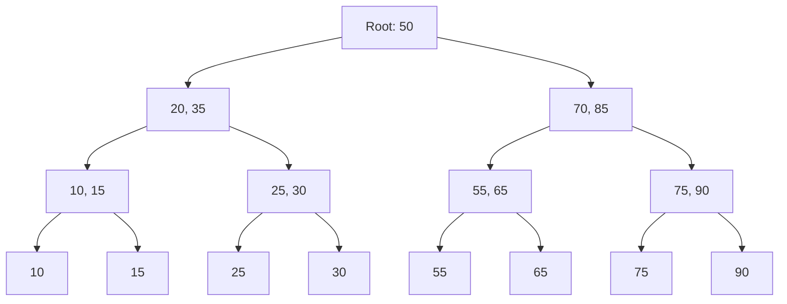
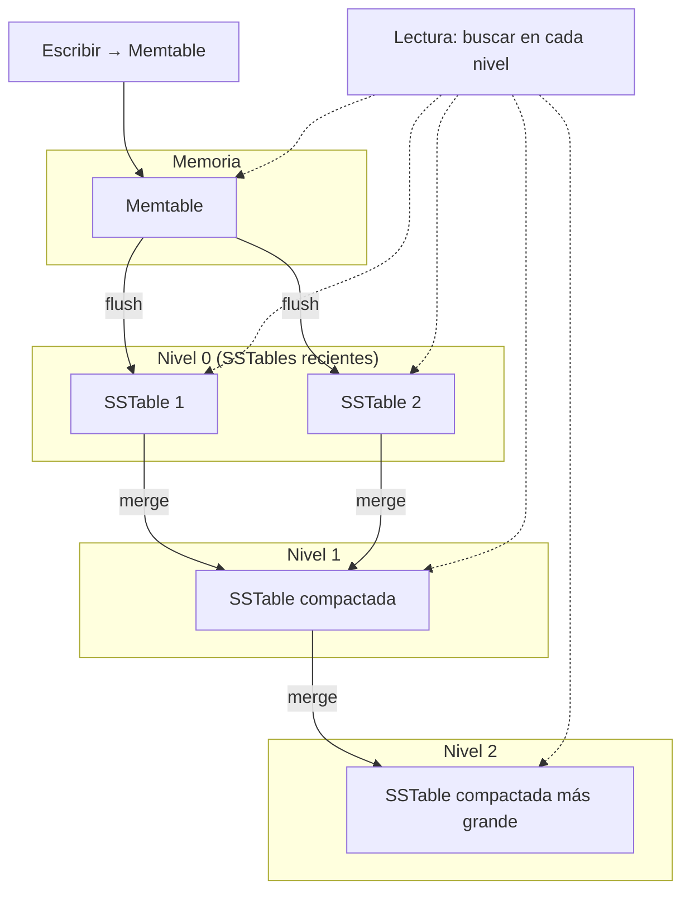

# Clase 4 — Indexación: B-Tree vs LSM Tree

## 1. Fundamentos de Indexación

### Qué es un índice

- Estructura de datos que acelera la búsqueda
- Tradeoff: lecturas más rápidas, escrituras más lentas
- Ocupa espacio adicional en disco

### Indexación sin índice vs con índice

```
Búsqueda sin índice (full collection scan):
[doc1] → [doc2] → [doc3] → ... → [docN] → encontrado
O(n): revisar cada documento

Búsqueda con índice:
índice → posición exacta → documento
O(log n): búsqueda binaria en árbol
```

## 2. B-Tree vs LSM Tree

### B-Tree

- Usado por: PostgreSQL, MySQL, MongoDB (índices), SQLite
- Estructura de árbol balanceado
- Optimizado para lecturas
- Las escrituras modifican el árbol in-place



**Búsqueda:**
- Lectura: O(log n)
- Escritura: O(log n) — puede requerir reordenamiento del árbol
- Rango: eficiente — recorrido in-order

### LSM Tree (Log-Structured Merge Tree)

- Usado por: Cassandra, RocksDB, LevelDB, HBase
- Optimizado para escrituras
- Escribe secuencialmente en memoria (memtable)
- Flushea a disco como SSTable (inmutable)
- Merge periódico de SSTables



**Escritura:**
- Memtable: O(1) — inserción en memoria
- Flush: O(n) — secuencial a disco
- Compaction: O(n log n) — en segundo plano

**Lectura:**
- O(k) donde k = niveles — puede requerir buscar en múltiples SSTables
- Bloom filters optimizan la búsqueda

### Comparación B-Tree vs LSM Tree

| Característica | B-Tree | LSM Tree |
|----------------|--------|----------|
| Lecturas | Rápidas (1-2 IOPS) | Variables (buscar en niveles) |
| Escrituras | Más lentas (random I/O) | Muy rápidas (sequential I/O) |
| Amplificación de escritura | Baja | Alta (compaction) |
| Amplificación de lectura | Baja | Media-Alta |
| Uso de disco | Eficiente | Mayor (datos duplicados antes de compactar) |
| Mejor para | Workloads mixtos o read-heavy | Write-heavy, time-series, logs |
| Ejemplos | PostgreSQL, MySQL, MongoDB índices | Cassandra, RocksDB, LevelDB |

## 3. Índices en MongoDB

### 3.1 Índice Simple

```javascript
// Crear índice ascendente en email
db.usuarios.createIndex({ email: 1 })

// Crear índice descendente en fecha
db.pedidos.createIndex({ fecha: -1 })
```

### 3.2 Índice Compuesto

```javascript
// Índice en múltiples campos
db.usuarios.createIndex({ ciudad: 1, edad: -1 })

// El orden importa: {ciudad, edad} sirve para:
// - {ciudad: "Buenos Aires"}
// - {ciudad: "Buenos Aires", edad: 30}
// NO sirve para:
// - {edad: 30} (no usa el índice)
```

### 3.3 Índice Multikey (para arrays)

```javascript
// Automático cuando se indexa un array
db.productos.createIndex({ tags: 1 })

// Busca en cada elemento del array
db.productos.find({ tags: "mongodb" })
```

### 3.4 Índice de Texto

```javascript
// Crear índice de texto
db.articulos.createIndex({ titulo: "text", cuerpo: "text" })

// Buscar texto
db.articulos.find({ $text: { $search: "mongodb indexación" } })

// Con score
db.articulos.find(
    { $text: { $search: "mongodb" } },
    { score: { $meta: "textScore" } }
).sort({ score: { $meta: "textScore" } })
```

### 3.5 Índice Geoespacial

```javascript
// 2dsphere para coordenadas
db.lugares.createIndex({ ubicacion: "2dsphere" })

// Insertar con GeoJSON
db.lugares.insertOne({
    nombre: "Plaza de Mayo",
    ubicacion: {
        type: "Point",
        coordinates: [-58.3701, -34.6083] // [longitud, latitud]
    }
})

// Buscar lugares cercanos
db.lugares.find({
    ubicacion: {
        $near: {
            $geometry: { type: "Point", coordinates: [-58.3701, -34.6083] },
            $maxDistance: 5000 // metros
        }
    }
})
```

### 3.6 Índice Parcial (Partial Index)

```javascript
// Solo indexar documentos que cumplan condición
db.usuarios.createIndex(
    { email: 1 },
    { partialFilterExpression: { activo: true } }
)
// Solo indexa usuarios activos, ahorra espacio
```

### 3.7 Índice TTL (Time-To-Live)

```javascript
// Eliminar documentos después de cierto tiempo
db.sesiones.createIndex({ ultima_actividad: 1 }, { expireAfterSeconds: 3600 })
// Documentos eliminados 1 hora después de ultima_actividad
```

### 3.8 Índice Único

```javascript
db.usuarios.createIndex({ email: 1 }, { unique: true })
// Error al insertar email duplicado
```

## 4. Índices en Redis

Redis no tiene índices tradicionales, pero sus estructuras de datos actúan como índices:

```redis
# Sorted Set como índice ordenado
ZADD usuarios:edad 25 "ana"
ZADD usuarios:edad 30 "carlos"
ZADD usuarios:edad 35 "maria"

# Rango por edad
ZRANGEBYSCORE usuarios:edad 20 30 WITHSCORES
# → ana (25), carlos (30)

# Hash como índice directo
HSET usuario:1 nombre "Carlos" edad 30 email "carlos@ejemplo.com"
HGETALL usuario:1
```

## 5. Análisis de Planes de Consulta con explain()

```javascript
// Ver plan de ejecución
db.usuarios.find({ ciudad: "Buenos Aires" }).explain("executionStats")
```

Salida relevante:

```json
{
    "queryPlanner": {
        "winningPlan": {
            "stage": "FETCH",
            "inputStage": {
                "stage": "IXSCAN",
                "keyPattern": { "ciudad": 1 },
                "indexName": "ciudad_1"
            }
        }
    },
    "executionStats": {
        "executionTimeMillis": 5,
        "totalKeysExamined": 100,
        "totalDocsExamined": 100,
        "nReturned": 100
    }
}
```

**Métricas clave:**

- `IXSCAN` → usa índice
- `COLLSCAN` → escaneo completo de colección (lento)
- `totalKeysExamined` ≈ `nReturned` → índice eficiente
- `totalDocsExamined` >> `nReturned` → índice poco selectivo

## 6. Ejercicio Práctico: Benchmark de Rendimiento

### Setup

```javascript
// Poblar colección con 100,000 documentos
let docs = [];
for (let i = 0; i < 100000; i++) {
    docs.push({
        nombre: `usuario_${i}`,
        email: `user${i}@ejemplo.com`,
        edad: Math.floor(Math.random() * 60) + 18,
        ciudad: ["Buenos Aires", "Córdoba", "Rosario", "Mendoza", "La Plata"][Math.floor(Math.random() * 5)],
        saldo: Math.floor(Math.random() * 10000),
        activo: Math.random() > 0.3
    });
}
db.usuarios.insertMany(docs);
```

### Benchmark

```javascript
// SIN índice
db.usuarios.find({ ciudad: "Córdoba", edad: { $gte: 25 } }).explain("executionStats")
// Anotar executionTimeMillis

// CON índice simple
db.usuarios.createIndex({ ciudad: 1 })
db.usuarios.find({ ciudad: "Córdoba", edad: { $gte: 25 } }).explain("executionStats")

// CON índice compuesto
db.usuarios.createIndex({ ciudad: 1, edad: 1 })
db.usuarios.find({ ciudad: "Córdoba", edad: { $gte: 25 } }).explain("executionStats")

// Comparar tiempos y documentos examinados
```

### Ver todos los índices

```javascript
db.usuarios.getIndexes()
```

### Eliminar índice

```javascript
db.usuarios.dropIndex("ciudad_1")
```
