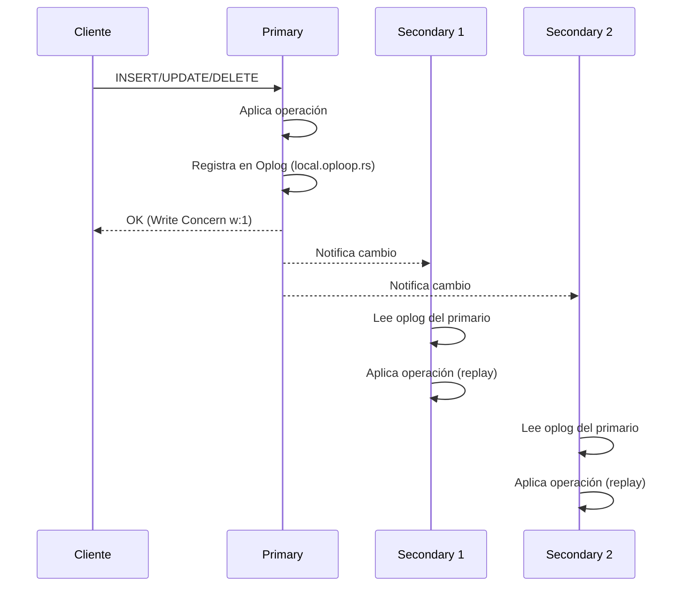
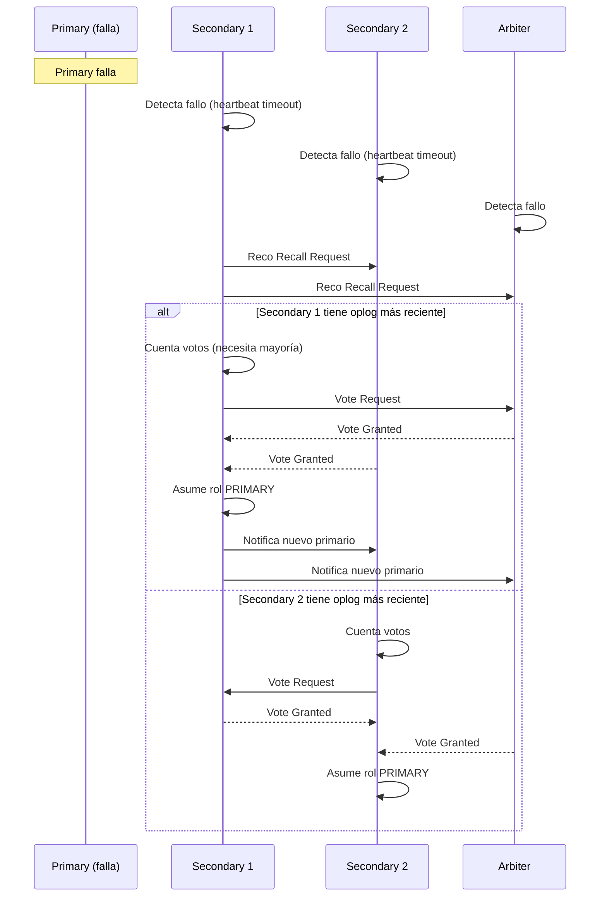

# Clase 04 — MongoDB III: Replicación y Alta Disponibilidad

---

## Contenido de la Clase

1. Marco Teórico
2. Configurar Replica Set en Localhost
3. Configurar Replica Set con Docker Compose
4. Oplog Detallado
5. Elección de Primario
6. Read Preferences
7. Write Concern
8. Read Concern
9. Simulación de Fallos
10. Backups en MongoDB
11. Ejercicio Práctico

---

## 1. Marco Teórico

### 1.1 ¿Qué es la replicación? ¿Por qué?

La replicación es el proceso de mantener **múltiples copias del mismo conjunto de datos** en diferentes servidores (nodos). En MongoDB, un grupo de nodos que mantiene el mismo dato se denomina **Replica Set**.

**¿Por qué es necesaria?**

- **Alta disponibilidad (HA):** Si un servidor falla, otro toma el control sin downtime.
- **Tolerancia a fallos:** Un Replica Set con 3 nodos puede sobrevivir a la caída de 1 nodo sin perder datos.
- **Lectura escalable:** Las réplicas secundarias pueden servir consultas de lectura, distribuyendo la carga.
- **Backup sin downtime:** Se puede hacer backup desde un secundario sin afectar al primario.

### 1.2 Replica Sets: Arquitectura Primario-Secundario

Un Replica Set en MongoDB está compuesto por **3 o más nodos** (se recomienda un número impar para votaciones):

```
┌─────────────────────────────────────────────────────┐
│                   REPLICA SET                       │
│                                                     │
│  ┌──────────────┐  ┌──────────────┐  ┌────────────┐ │
│  │   PRIMARY    │  │  SECONDARY   │  │ SECONDARY  │ │
│  │  (Primario)  │  │ (Secundario) │  │(Secundario)│ │
│  │              │  │              │  │            │ │
│  │ Escrituras   │  │ Copia del    │  │ Copia del  │ │
│  │ + Lecturas   │  │ primario     │  │ primario   │ │
│  └──────┬───────┘  └──────┬───────┘  └─────┬──────┘ │
│         │                 │                 │        │
│         └─────────┬───────┴────────┬────────┘        │
│                   │    Oplog       │                 │
│                   └────────────────┘                 │
│                                                     │
│  ┌──────────────┐                                   │
│  │   ARBITER    │  (opcional, solo vota)            │
│  │   (Árbitro)  │                                   │
│  └──────────────┘                                   │
└─────────────────────────────────────────────────────┘
```

**Roles:**

| Rol | Función | Escrituras | Lecturas |
|-----|---------|------------|----------|
| **Primary** | Recibe todas las escrituras | ✅ Sí | ✅ Sí (por defecto) |
| **Secondary** | Copia el oplog y aplica operaciones | ❌ No | ✅ Opcional |
| **Arbiter** | Solo vota, no almacena datos | ❌ No | ❌ No |

### 1.3 Oplog: Registro de Operaciones

El **Oplog** (operations log) es un registro circular (capped collection) en la base de datos `local` llamado `local.oplog.rs`. Cada operación de escritura en el primario se registra allí, y los secundarios leen el oplog para reproducir las operaciones.

**Flujo de replicación:**



**Características del Oplog:**
- Es una **capped collection** (tamaño fijo, sobrescribe datos antiguos)
- Cada entrada tiene un **timestamp** único (OpTime)
- Contiene operaciones de tipo: `i` (insert), `u` (update), `d` (delete), `c` (command)
- Por defecto, el tamaño es aproximadamente el 5% del disco, con un máximo de 50GB

### 1.4 Electores: Elección de Primario

Cuando el primario falla, los secundarios inician una **elección (election)** para determinar quién será el nuevo primario. Solo los nodos que pueden votar (votes >= 1) participan.

**Reglas de elección:**
1. Se necesita **mayoría absoluta** de votos (no mayoría simple)
2. Debe tener el **oplog más reciente** (imestamp más avanzado)
3. Debe ser **accesible** por la mayoría de los demás nodos

### 1.5 Consistencia en Réplicas

En un Replica Set, la **consistencia** depende de:
- **Write Concern:** cuántas réplicas deben confirmar la escritura
- **Read Concern:** desde qué réplicas se leen datos
- **Read Preference:** qué réplica se usa para lecturas

MongoDB ofrece **consistencia eventual** por defecto: los secundarios pueden tener datos ligeramente desactualizados hasta que apliquen el oplog.

### 1.6 Partition Tolerance en MongoDB

MongoDB implementa **CAP theorem** priorizando Consistency + Partition Tolerance (CP):
- Si hay una partición de red, el primario continuará aceptando escrituras si tiene mayoría
- Si pierde mayoría, se vuelve **secondary** automáticamente (no puede escribir)
- Esto garantiza que **nunca haya dos primarios** escribiendo simultáneamente

---

## 2. Configurar Replica Set en Localhost

### 2.1 Crear directorios de datos

**Windows (PowerShell):**

```powershell
# Crear directorios para 3 nodos
New-Item -ItemType Directory -Path "C:\data\rs0" -Force
New-Item -ItemType Directory -Path "C:\data\rs1" -Force
New-Item -ItemType Directory -Path "C:\data\rs2" -Force
```

**Linux (bash):**

```bash
# Crear directorios para 3 nodos
sudo mkdir -p /data/rs0 /data/rs1 /data/rs2
sudo chown -R mongodb:mongodb /data/rs0 /data/rs1 /data/rs2
```

### 2.2 Iniciar 3 nodos en puertos diferentes

**Windows:**

```powershell
# Terminal 1 - Nodo 0 (puerto 27017)
mongod --replSet rs0 --port 27017 --dbpath "C:\data\rs0" --bind_ip localhost

# Terminal 2 - Nodo 1 (puerto 27018)
mongod --replSet rs0 --port 27018 --dbpath "C:\data\rs1" --bind_ip localhost

# Terminal 3 - Nodo 2 (puerto 27019)
mongod --replSet rs0 --port 27019 --dbpath "C:\data\rs2" --bind_ip localhost
```

**Linux:**

```bash
# Terminal 1
mongod --replSet rs0 --port 27017 --dbpath /data/rs0 --bind_ip localhost

# Terminal 2
mongod --replSet rs0 --port 27018 --dbpath /data/rs1 --bind_ip localhost

# Terminal 3
mongod --replSet rs0 --port 27019 --dbpath /data/rs2 --bind_ip localhost
```

**Explicación de parámetros:**
- `--replSet rs0`: nombre del Replica Set
- `--port`: puerto de escucha de cada nodo
- `--dbpath`: directorio de datos de cada nodo
- `--bind_ip localhost`: solo escuchar conexiones locales (seguridad)

### 2.3 Inicializar Replica Set

Conectar al primer nodo y ejecutar:

```javascript
// Conectar al nodo en puerto 27017
mongosh --port 27017

// Definir configuración del Replica Set
rs.initiate({
    _id: "rs0",
    members: [
        { _id: 0, host: "localhost:27017", priority: 2 },
        { _id: 1, host: "localhost:27018", priority: 1 },
        { _id: 2, host: "localhost:27019", priority: 1 }
    ]
})

// Salida esperada:
// {
//     "ok" : 1,
//     "operationTime" : Timestamp(1693000000, 1),
//     "$clusterTime" : {
//         "clusterTime" : Timestamp(1693000000, 1),
//         "signature" : {
//             "hash" : BinData(0, "..."),
//             "keyId" : NumberLong("...")
//         }
//     }
// }
```

### 2.4 Verificar estado con rs.status()

```javascript
rs.status()

// Salida importante:
// {
//     "set" : "rs0",
//     "date" : ISODate("2026-08-20T10:00:00Z"),
//     "myState" : 1,                    // 1 = PRIMARY, 2 = SECONDARY, 0 = STARTUP
//     "members" : [
//         {
//             "_id" : 0,
//             "name" : "localhost:27017",
//             "stateStr" : "PRIMARY",
//             "state" : 1,
//             "uptime" : 120,
//             "optime" : { "ts" : Timestamp(1693000000, 1), "t" : NumberLong(1) },
//             "priority" : 2,
//             "votes" : 1
//         },
//         {
//             "_id" : 1,
//             "name" : "localhost:27018",
//             "stateStr" : "SECONDARY",
//             "state" : 2,
//             "uptime" : 120,
//             "optime" : { "ts" : Timestamp(1693000000, 1), "t" : NumberLong(1) },
//             "priority" : 1,
//             "votes" : 1
//         },
//         {
//             "_id" : 2,
//             "name" : "localhost:27019",
//             "stateStr" : "SECONDARY",
//             "state" : 2,
//             "uptime" : 120,
//             "optime" : { "ts" : Timestamp(1693000000, 1), "t" : NumberLong(1) },
//             "priority" : 1,
//             "votes" : 1
//         }
//     ]
// }
```

**Otros comandos útiles:**

```javascript
// Ver configuración del Replica Set
rs.conf()

// Ver solo miembros
rs.status().members.forEach(m => print(m.name + " -> " + m.stateStr))

// Ver quien es el primario
rs.isMaster()

// Ver info de replicación
rs.printReplicationInfo()
```

### 2.5 Verificar réplica insertando datos

```javascript
// Conectar al primario
mongosh --port 27017

// Insertar documento
use tienda
db.productos.insertOne({
    nombre: "Laptop Gamer",
    precio: 1299.99,
    stock: 25,
    fecha: new Date()
})

// Conectar a un secundario (sólo lectura)
mongosh --port 27018

// Habilitar lectura en secundario
rs.secondaryOk()

// Verificar que el dato se replicó
use tienda
db.productos.find()
// Debe mostrar el documento insertado en el primario
```

---

## 3. Configurar Replica Set con Docker Compose

### 3.1 docker-compose.yml completo

```yaml
version: '3.8'

services:
  mongo-primary:
    image: mongo:7.0
    container_name: mongo-primary
    hostname: mongo-primary
    ports:
      - "27017:27017"
    volumes:
      - mongo-primary-data:/data/db
      - ./init-rs.js:/docker-entrypoint-initdb.d/init-rs.js
    command: mongod --replSet rs0 --bind_ip_all --port 27017
    networks:
      - mongo-network
    depends_on:
      - mongo-secondary1
      - mongo-secondary2
    restart: unless-stopped

  mongo-secondary1:
    image: mongo:7.0
    container_name: mongo-secondary1
    hostname: mongo-secondary1
    ports:
      - "27018:27018"
    volumes:
      - mongo-secondary1-data:/data/db
    command: mongod --replSet rs0 --bind_ip_all --port 27018
    networks:
      - mongo-network
    restart: unless-stopped

  mongo-secondary2:
    image: mongo:7.0
    container_name: mongo-secondary2
    hostname: mongo-secondary2
    ports:
      - "27019:27019"
    volumes:
      - mongo-secondary2-data:/data/db
    command: mongod --replSet rs0 --bind_ip_all --port 27019
    networks:
      - mongo-network
    restart: unless-stopped

volumes:
  mongo-primary-data:
  mongo-secondary1-data:
  mongo-secondary2-data:

networks:
  mongo-network:
    driver: bridge
```

### 3.2 Script de inicialización (init-rs.js)

```javascript
// init-rs.js
// Script de inicialización automática del Replica Set

// Esperar a que los nodos estén listos
sleep(5000);

try {
    const status = rs.status();
    if (status.ok === 1) {
        print("Replica Set ya inicializado");
    }
} catch (e) {
    print("Inicializando Replica Set...");
    rs.initiate({
        _id: "rs0",
        members: [
            { _id: 0, host: "mongo-primary:27017", priority: 2 },
            { _id: 1, host: "mongo-secondary1:27018", priority: 1 },
            { _id: 2, host: "mongo-secondary2:27019", priority: 1 }
        ]
    });
    print("Replica Set inicializado correctamente");
}
```

### 3.3 Levantar y verificar

```bash
# Levantar containers
docker compose up -d

# Verificar estado
docker exec mongo-primary mongosh --eval "rs.status()"

# Verificar desde host
mongosh --port 27017 --eval "rs.status()"

# Verificar que el primario está activo
mongosh --port 27017 --eval "rs.isMaster()"
```

---

## 4. Oplog Detallado

### 4.1 ¿Qué es el Oplog?

El Oplog es una **capped collection** llamada `local.oplog.rs` que contiene un registro secuencial de todas las modificaciones de datos. Los secundarios leen este oplog para reproducir las escrituras del primario.

```javascript
// Conectar al primario
use local

// Ver la colección oplog
db.oplog.rs.stats()

// Salida:
// {
//     "ns" : "local.oplog.rs",
//     "count" : 1523,
//     "size" : 51200,
//     "maxSize" : 52428800,    // 50MB en este ejemplo
//     "capped" : true,
//     ...
// }
```

### 4.2 Operaciones registradas

```javascript
// Ver las últimas operaciones del oplog
use local
db.oplog.rs.find().sort({ $natural: -1 }).limit(5).pretty()

// Salida:
// {
//     "ts" : Timestamp(1693000000, 1),
//     "t" : NumberLong(1),
//     "h" : NumberLong("1234567890"),
//     "v" : 2,
//     "op" : "i",                    // i=insert, u=update, d=delete, c=command
//     "ns" : "tienda.productos",     // namespace
//     "ui" : UUID("..."),
//     "o" : {
//         "_id" : ObjectId("..."),
//         "nombre" : "Laptop Gamer",
//         "precio" : 1299.99
//     }
// }

// Filtrar por tipo de operación
db.oplog.rs.find({ "op": "i" }).count()   // Inserts
db.oplog.rs.find({ "op": "u" }).count()   // Updates
db.oplog.rs.find({ "op": "d" }).count()   // Deletes
db.oplog.rs.find({ "op": "c" }).count()   // Commands (create collection, etc.)
```

### 4.3 Tamaño y configuración

```javascript
// Ver tamaño actual del oplog
rs.printReplicationInfo()

// Salida:
// oplog main
// Date:     Aug 20 2026 10:00:00 GMT+0000
// log size: 1953.01171875MB     // Tamaño total configurado
// log end:  Aug 20 2026 10:00:00 GMT+0000  // Timestamp más reciente

// Para configurar tamaño del oplog al iniciar mongod:
// Windows:
// mongod --replSet rs0 --port 27017 --dbpath C:\data\rs0 --oplogSize 2048

// Linux:
// mongod --replSet rs0 --port 27017 --dbpath /data/rs0 --oplogSize 2048

// El tamaño está en MB. Se recomienda:
// - Mínimo: 1GB
// - Producción: 10-50GB dependiendo de escritura
// - Fórmula: (escrituras_segundo * tamaño_oplog_entry * 3600 * horas_deseadas) / 1024 / 1024
```

### 4.4 Monitorear el Oplog

```javascript
// Ver información de replicación del primario
rs.printReplicationInfo()

// Ver información de replicación de un secundario
rs.printSecondaryReplicationInfo()

// Ver el retraso de un secundario
rs.status().members.forEach(m => {
    print(m.name + ": " + m.stateStr + " - lag: " +
        (m.lag ? m.lag + "s" : "N/A"))
})

// Calcular retraso manualmente
use local
var primaryOp = db.oplog.rs.find().sort({$natural:-1}).limit(1).next()
var secondaryOp = // (en secundario) db.oplog.rs.find().sort({$natural:-1}).limit(1).next()
var lagSeconds = (primaryOp.ts.getTime() - secondaryOp.ts.getTime())
print("Retraso del secundario: " + lagSeconds + " segundos")
```

### 4.5 Resync de Secundario

Si un secundario se retrasa demasiado o necesita resincronización completa:

```javascript
// Método 1: Reiniciar el secundario (se resincroniza automáticamente)
// Detener el proceso del secundario, borrar su data, y reiniciarlo

// Método 2: Forzar resync (si el oplog es insuficiente)
// En el primario, usar rs.syncFrom() para especificar la fuente

// En el secundario:
rs.syncFrom("mongo-primary:27017")

// El secundario copiará todos los datos del primario primero,
// y luego comenzará a aplicar el oplog
```

---

## 5. Elección de Primario

### 5.1 Proceso de elección



### 5.2 Configuración de prioridades

```javascript
// Configurar prioridades para controlar quién se convierte en primario
rs.reconfig({
    members: [
        { _id: 0, host: "localhost:27017", priority: 10 },   // Mayor prioridad
        { _id: 1, host: "localhost:27018", priority: 5 },    // Prioridad media
        { _id: 2, host: "localhost:27019", priority: 1 }     // Menor prioridad
    ]
})

// Reglas de prioridad:
// - priority > 1: puede ser primario Y tiene preferencia
// - priority = 1: puede ser primario (default)
// - priority = 0: NUNCA puede ser primario (solo secundario)
// - priority < 0: nunca puede ser primario

// Hacer que un nodo NUNCA sea primario (para data center secundario)
rs.reconfig({
    members: [
        { _id: 0, host: "localhost:27017", priority: 2 },
        { _id: 1, host: "localhost:27018", priority: 1 },
        { _id: 2, host: "localhost:27019", priority: 0, hidden: true }
    ]
}, { force: true })
```

### 5.3 Configuración de voting

```javascript
// Configurar votos (máximo 7 votos en total)
rs.reconfig({
    members: [
        { _id: 0, host: "localhost:27017", votes: 1 },
        { _id: 1, host: "localhost:27018", votes: 1 },
        { _id: 2, host: "localhost:27019", votes: 1 }
        // total: 3 votos
    ]
})

// Miembro dedicado de backup (solo lectura, sin voto)
rs.reconfig({
    members: [
        { _id: 0, host: "localhost:27017", priority: 2 },
        { _id: 1, host: "localhost:27018", priority: 1 },
        { _id: 2, host: "localhost:27019", priority: 1 },
        { _id: 3, host: "localhost:27020", priority: 0, votes: 0, hidden: true }
    ]
})
```

### 5.4 Step down manual

```javascript
// Forzar que el primario se convierta en secundario
// (útil para mantenimiento del servidor primario)

// Conectar al primario
mongosh --port 27017

// Ejecutar step down (con tiempo de gracia de 60 segundos)
rs.stepDown(60)

// Salida esperada:
// {
//     "ok" : 1,
//     "operationTime" : Timestamp(1693000000, 1),
//     "$clusterTime" : { ... }
// }

// Verificar que ya no es primario
rs.isMaster().ismaster   // false

// Verificar que otro nodo asumió el rol
rs.status().members.forEach(m => {
    print(m.name + ": " + m.stateStr)
})
```

### 5.5 Prevenir elección: recon members

```javascript
// members hidden: true → oculto en rs.status() (no aparece en lista de nodos)
// members priority: 0 → nunca será primario
// members votes: 0 → no participa en elecciones

// Ejemplo: nodo de datos secundarios
rs.reconfig({
    members: [
        { _id: 0, host: "localhost:27017", priority: 2, votes: 1 },
        { _id: 1, host: "localhost:27018", priority: 1, votes: 1 },
        { _id: 2, host: "localhost:27019", priority: 1, votes: 1 },
        { _id: 3, host: "localhost:27020", priority: 0, votes: 0, hidden: true }
    ]
}, { force: true })
```

---

## 6. Read Preferences

### 6.1 Tipos de Read Preference

| Read Preference | Descripción | Consistencia | Latencia |
|-----------------|-------------|--------------|----------|
| **primary** | Solo lee del primario | Fuerte | Depende del primario |
| **primaryPreferred** | Primario preferido, fallback a secundarios | Eventual | Baja |
| **secondary** | Solo lee de secundarios | Eventual | Variable |
| **secondaryPreferred** | Secundarios preferidos, fallback a primario | Eventual | Baja |
| **nearest** | Replica con menor latencia de red | Eventual | Mínima |

### 6.2 Configuración

```javascript
// 1. Por conexión
const conn = Mongo("mongodb://localhost:27017/?readPreference=secondaryPreferred")

// 2. Por base de datos
use miBase
db.getMongo().setReadPref("secondaryPreferred")

// 3. Por consulta individual
db.productos.find({}).readPref("secondary")

// 4. Por consulta con tag sets
db.productos.find({}).readPref("secondary", [
    { "dc": "ny", "rack": "a" }   // Preferir réplicas en NY rack A
])

// 5. En URI de conexión
// mongodb://localhost:27017,localhost:27018/?readPreference=secondaryPreferred&readPreferenceTags=dc:ny
```

### 6.3 Cuándo usar cada una

```
¿Cuándo usar cada Read Preference?

primary (default):
  → Datos que requieren consistencia inmediata
  → Lecturas críticas (pagos, stocks)
  → Cuando la escritura es más frecuente que la lectura

primaryPreferred:
  → Balance entre consistencia y disponibilidad
  → Cuando el primario tiene alta carga pero necesitas datos recientes

secondary:
  → Reports y analytics (no requieren datos en tiempo real)
  → Distribuir carga de lectura
  → Cuando el primario está saturado

secondaryPreferred:
  → Cuando quieres offload de lecturas al primario
  → Lecturas con tolerancia a datos ligeramente antiguos

nearest:
  → Aplicaciones multi-datacenter
  → Cuando la latencia de red es crítica
  → Datos que no cambian frecuentemente
```

---

## 7. Write Concern

### 7.1 Niveles de Write Concern

```javascript
// w: 0 — Fire and forget (no confirmación)
db.productos.insertOne({ nombre: "Test" }, { writeConcern: { w: 0 } })
// Retorna inmediatamente, no sabe si se guardó

// w: 1 — Solo primario confirma (default)
db.productos.insertOne({ nombre: "Test" }, { writeConcern: { w: 1 } })
// Espera confirmación del primario

// w: "majority" — Mayoría de nodos confirma
db.productos.insertOne({ nombre: "Test" }, { writeConcern: { w: "majority" } })
// Espera que la mayoría de los nodos escriban el dato
// Garantiza que el dato NUNCA se perderá aunque el primario caiga

// w: N — Número específico de nodos
db.productos.insertOne({ nombre: "Test" }, { writeConcern: { w: 2 } })
// Espera confirmación de 2 nodos

// j: true — Esperar que el dato se escriba en journal (disco)
db.productos.insertOne(
    { nombre: "Test" },
    { writeConcern: { w: "majority", j: true } }
)

// wtimeout: timeout en ms para evitar bloqueos indefinidos
db.productos.insertOne(
    { nombre: "Test" },
    { writeConcern: { w: "majority", wtimeout: 5000 } }
)
// Si no se confirma en 5 segundos, retorna error

// Combinación completa
db.productos.insertOne(
    { nombre: "Test" },
    { writeConcern: { w: "majority", j: true, wtimeout: 3000 } }
)
```

### 7.2 Configurar Write Concern por defecto

```javascript
// Configurar en la base de datos
db.adminCommand({
    setParameter: 1,
    writeConcernDefault: { w: "majority", j: true, wtimeout: 5000 }
})

// Configurar en la colección
db.createCollection("productos", {
    writeConcern: { w: "majority", j: true }
})

// Verificar configuración actual
db.getWriteConcern()
```

---

## 8. Read Concern

### 8.1 Niveles de Read Concern

```javascript
// local (default) — Lee datos más recientes del nodo, sin garantía de replicación
db.productos.find().readConcern("local")

// majority — Solo datos confirmados por mayoría de nodos
db.productos.find().readConcern("majority")
// Garantiza que el dato fue replicado a la mayoría
// Previene reads "fantasma" que luego se revierten

// linearizable — Consistencia total (el dato existe y es único)
db.productos.find({ _id: ... }).readConcern("linearizable")
// Más lento porque espera confirmación de la mayoría
// Solo funciona con w: "majority"

// available — Lee del nodo más cercano, sin garantía
db.productos.find().readConcern("available")
// Más rápido, usado en sharded clusters

// snapshot — Para transacciones multi-documento
// (se usa automáticamente en transacciones)
```

### 8.2 Cuándo usar cada nivel

```
local (default):
  → Lecturas normales donde toleras leer datos que pueden revertirse
  → Operaciones CRUD estándar

majority:
  → Cuando NUNCA quieres leer un dato que luego se revierta
  → Pagos, transferencias, datos críticos
  → Transacciones

linearizable:
  → Cuando necesitas la mayor consistencia posible
  → Uniqueness checks (saber que un valor es único)
  → Operaciones que requieren lectura después de escritura

available:
  → Máximo rendimiento en clústeres sharded
  → Datos que no cambian frecuentemente

snapshot:
  → Transacciones multi-documento
  → Lectura consistente dentro de una transacción
```

---

## 9. Simulación de Fallos

### 9.1 Matar el primario y observar elección

```bash
# Paso 1: Identificar el primario
mongosh --port 27017 --eval "rs.status().members.forEach(m => print(m.name + ': ' + m.stateStr))"

# Paso 2: Matar el primario
# En el terminal donde corre el primario, presiona Ctrl+C
# O en otro terminal:
mongosh --port 27017 --eval "db.adminCommand({ shutdown: 1 })"
# O forzar kill:
# Windows: taskkill /PID <PID> /F
# Linux: kill -9 <PID>

# Paso 3: Observar el proceso de elección en otro secundario
mongosh --port 27018

# Verificar el estado (esperar 5-15 segundos)
rs.status()
// El secondary debería ahora ser PRIMARY

// Ver logs de elección
// grep "Election" /var/log/mongodb/mongod.log

# Paso 4: Verificar que el nuevo primario acepta escrituras
use tienda
db.productos.insertOne({ nombre: "Test post-failover", precio: 99.99 })

# Paso 5: Medir tiempo de failover
// Desde el cliente que intenta escribir:
var start = Date.now()
try {
    db.productos.insertOne({ nombre: "Test" })
    print("Éxito después de: " + (Date.now() - start) + "ms")
} catch (e) {
    print("Falló después de: " + (Date.now() - start) + "ms")
    // Reintentar después del failover
}
```

### 9.2 Reincorporar nodo caído

```bash
# Reiniciar el nodo que estaba como primario
mongod --replSet rs0 --port 27017 --dbpath /data/rs0 --bind_ip localhost

# Verificar que se reincorpora como secundario
mongosh --port 27017 --eval "rs.status()"
// Debe mostrar stateStr: "SECONDARY"

# Verificar sincronización del oplog
mongosh --port 27017 --eval "rs.printSecondaryReplicationInfo()"

# Forzar resync si es necesario
mongosh --port 27017 --eval "rs.syncFrom('localhost:27018')"

# Verificar que los datos se sincronizaron
mongosh --port 27017
rs.secondaryOk()
use tienda
db.productos.countDocuments()
// Debe coincidir con el conteo del primario
```

### 9.3 Simular partición de red

```bash
# En Linux, bloquear tráfico a un nodo:
sudo iptables -A INPUT -s <IP_DEL_NODO> -j DROP
sudo iptables -A OUTPUT -d <IP_DEL_NODO> -j DROP

# Restaurar:
sudo iptables -D INPUT -s <IP_DEL_NODO> -j DROP
sudo iptables -D OUTPUT -d <IP_DEL_NODO> -j DROP

# En Windows:
netsh advfirewall firewall add rule name="Block Mongo" ^
    dir=out action=block remoteip=<IP_DEL_NODO> protocol=tcp port=27017

# Para limpiar:
netsh advfirewall firewall delete rule name="Block Mongo"
```

---

## 10. Backups en MongoDB

### 10.1 mongodump: Backup lógico

```bash
# Backup completo de todas las bases de datos
mongodump --host localhost --port 27017 --out /backup/full_$(date +%Y%m%d)

# Backup de una sola base de datos
mongodump --db tienda --out /backup/tienda_$(date +%Y%m%d)

# Backup de una sola colección
mongodump --db tienda --collection productos --out /backup/productos_$(date +%Y%m%d)

# Backup con autenticación
mongodump --host localhost --port 27017 --username admin --password "secreto" --authenticationDatabase admin --db tienda

# Backup comprimido
mongodump --db tienda --gzip --out /backup/tienda_gz_$(date +%Y%m%d)

# Backup desde un secundario (no afecta al primario)
mongodump --host localhost --port 27018 --readPreference secondary --db tienda --out /backup/tienda_sec

# Backup del oplog
mongodump --host localhost --port 27017 --oplog --out /backup/oplog_$(date +%Y%m%d)

# Backup en un archivo único
mongodump --host localhost --port 27017 --db tienda --archive=/backup/tienda.archive

# Backup comprimido en archivo único
mongodump --host localhost --port 27017 --db tienda --gzip --archive=/backup/tienda.archive.gz
```

### 10.2 mongorestore: Restauración

```bash
# Restaurar un backup completo
mongorestore --host localhost --port 27017 --dir /backup/full_20260820

# Restaurar solo una base de datos
mongorestore --host localhost --port 27017 --db tienda /backup/tienda_20260820/tienda

# Restaurar con --drop (elimina datos existentes antes de restaurar)
mongorestore --host localhost --port 27017 --drop /backup/full_20260820

# Restaurar archivo comprimido
mongorestore --host localhost --port 27017 --gzip --archive=/backup/tienda.archive.gz

# Restaurar desde archivo único
mongorestore --host localhost --port 27017 --archive=/backup/tienda.archive

# Restaurar oplog (para point-in-time recovery)
mongorestore --host localhost --port 27017 --oplogReplay --dir /backup/oplog_20260820
```

### 10.3 Copias de directorio de datos (File System Snapshots)

```bash
# Método: detener mongod → copiar directorio → reiniciar mongod

# 1. Congelar escrituras (para consistencia)
mongosh --port 27017 --eval "db.adminCommand({ fsync: 1, lock: true })"

# 2. Copiar directorio de datos
# Linux:
rsync -av /data/rs0/ /backup/snapshot_$(date +%Y%m%d)/

# Windows:
robocopy C:\data\rs0 C:\backup\snapshot_$(date +%Y%m%d) /MIR

# 3. Descongelar escrituras
mongosh --port 27017 --eval "db.adminCommand({ fsync: 1, unlock: true })"
```

### 10.4 File System Snapshots (LVM)

```bash
# Para volúmenes LVM en Linux:
# 1. Crear snapshot del volumen LVM
lvcreate --size 10G --snapshot --name snap_data /dev/vg0/data

# 2. Montar snapshot
mkdir /mnt/snap
mount /dev/vg0/snap_data /mnt/snap

# 3. Copiar datos
rsync -av /mnt/snap/ /backup/lvm_$(date +%Y%m%d)/

# 4. Desmontar y eliminar snapshot
umount /mnt/snap
lvremove -f /dev/vg0/snap_data
```

### 10.5 Scripts de automatización

**Script de backup en bash:**

```bash
#!/bin/bash
# backup-mongo.sh — Backup automatizado de MongoDB

BACKUP_DIR="/backup/mongodb"
DATE=$(date +%Y%m%d_%H%M%S)
RETENTION_DAYS=7
MONGO_HOST="localhost"
MONGO_PORT="27017"
MONGO_USER="backup_user"
MONGO_PASS="backup_password"

# Crear directorio de backup
mkdir -p "${BACKUP_DIR}/${DATE}"

# Ejecutar mongodump
mongodump \
    --host "${MONGO_HOST}" \
    --port "${MONGO_PORT}" \
    --username "${MONGO_USER}" \
    --password "${MONGO_PASS}" \
    --authenticationDatabase admin \
    --gzip \
    --oplog \
    --out "${BACKUP_DIR}/${DATE}"

# Verificar éxito
if [ $? -eq 0 ]; then
    echo "[$(date)] Backup completado: ${BACKUP_DIR}/${DATE}" >> /var/log/mongo_backup.log
else
    echo "[$(date)] ERROR: Backup falló" >> /var/log/mongo_backup.log
    exit 1
fi

# Limpiar backups antiguos
find "${BACKUP_DIR}" -type d -mtime +${RETENTION_DAYS} -exec rm -rf {} \;

echo "Backup y limpieza completados"
```

**Script de backup en PowerShell:**

```powershell
# backup-mongo.ps1 — Backup automatizado de MongoDB

$BackupDir = "C:\Backup\MongoDB"
$Date = Get-Date -Format "yyyyMMdd_HHmmss"
$RetentionDays = 7
$MongoHost = "localhost"
$MongoPort = "27017"
$MongoUser = "backup_user"
$MongoPass = "backup_password"

# Crear directorio
$FullBackupPath = Join-Path $BackupDir $Date
New-Item -ItemType Directory -Path $FullBackupPath -Force

# Ejecutar mongodump
& mongodump `
    --host $MongoHost `
    --port $MongoPort `
    --username $MongoUser `
    --password $MongoPass `
    --authenticationDatabase admin `
    --gzip `
    --oplog `
    --out $FullBackupPath

if ($LASTEXITCODE -eq 0) {
    Write-Host "Backup completado: $FullBackupPath"
} else {
    Write-Error "Backup falló con código: $LASTEXITCODE"
    exit 1
}

# Limpiar backups antiguos
$CutoffDate = (Get-Date).AddDays(-$RetentionDays)
Get-ChildItem $BackupDir -Directory |
    Where-Object { $_.CreationTime -lt $CutoffDate } |
    Remove-Item -Recurse -Force

Write-Host "Backup y limpieza completados"
```

### 10.6 Verificación de backups

```bash
# Verificar contenido del backup
ls -la /backup/mongodb/20260820_120000/
# Debe contener: admin/, local/, tienda/

# Verificar que el archivo de dump es válido
mongorestore --host localhost --port 27017 --dryRun --dir /backup/mongodb/20260820_120000/
# dryRun no restaura, solo verifica que el backup es legible

# Verificar integridad de archivos comprimidos
gunzip -t /backup/mongodb/20260820_120000/tienda/productos.bson.gz
# Si no retorna errores, el archivo está intacto
```

### 10.7 Estrategia de retención

```
Estrategia de retención recomendada:

Backup Diario:
  - Retener 7 días
  - Ejecutar a las 2:00 AM (hora de menor actividad)
  - Usar mongodump --gzip --oplog

Backup Semanal:
  - Retener 4 semanas
  - Ejecutar los domingos
  - Copiar a almacenamiento secundario

Backup Mensual:
  - Retener 12 meses
  - Copiar a almacenamiento offsite/cloud

Verificación:
  - Test de restauración mensual
  - Documentar proceso de restauración
  - Medir tiempo de restauración (RTO)
  - Verificar que se puede restaurar a un punto específico (PITR)
```

---

## 11. Ejercicio Práctico

### Ejercicio 1: Configurar Replica Set de 3 nodos

```bash
# Paso 1: Crear directorios
mkdir -p /data/rs0 /data/rs1 /data/rs2

# Paso 2: Iniciar 3 nodos (en terminales diferentes)
mongod --replSet rs0 --port 27017 --dbpath /data/rs0 --bind_ip localhost &
mongod --replSet rs0 --port 27018 --dbpath /data/rs1 --bind_ip localhost &
mongod --replSet rs0 --port 27019 --dbpath /data/rs2 --bind_ip localhost &

# Paso 3: Inicializar Replica Set
mongosh --port 27017 --eval "
rs.initiate({
    _id: 'rs0',
    members: [
        { _id: 0, host: 'localhost:27017' },
        { _id: 1, host: 'localhost:27018' },
        { _id: 2, host: 'localhost:27019' }
    ]
})"

# Paso 4: Verificar
mongosh --port 27017 --eval "rs.status()"
```

### Ejercicio 2: Insertar datos y verificar replicación

```javascript
// Conectar al primario
mongosh --port 27017

// Crear base de datos y colección
use escuela

// Insertar 1000 documentos
for (let i = 0; i < 1000; i++) {
    db.alumnos.insertOne({
        numero: i + 1,
        nombre: `Alumno_${i + 1}`,
        carrera: ["Ing. Sistemas", "Ing. Industrial", "Medicina", "Derecho"][Math.floor(Math.random() * 4)],
        promedio: parseFloat((Math.random() * 10).toFixed(2)),
        activo: Math.random() > 0.3
    })
}

// Verificar en el secundario
// mongosh --port 27018
rs.secondaryOk()
use escuela
db.alumnos.countDocuments()  // Debe mostrar 1000
db.alumnos.aggregate([{ $group: { _id: "$carrera", count: { $sum: 1 } } }])
```

### Ejercicio 3: Cambiar read preference y medir latencia

```javascript
// Primero, configurar lectura desde primario
db.getMongo().setReadPref("primary")
var start = Date.now()
db.alumnos.find({ carrera: "Ing. Sistemas" }).toArray()
var primaryTime = Date.now() - start
print("Tiempo primario: " + primaryTime + "ms")

// Configurar lectura desde secundario
db.getMongo().setReadPref("secondary")
var start = Date.now()
db.alumnos.find({ carrera: "Ing. Sistemas" }).toArray()
var secondaryTime = Date.now() - start
print("Tiempo secundario: " + secondaryTime + "ms")

// Comparar
print("Diferencia: " + (secondaryTime - primaryTime) + "ms")
```

### Ejercicio 4: Matar primario y observar failover

```bash
# Paso 1: Verificar primario actual
mongosh --port 27017 --eval "rs.isMaster().primary"

# Paso 2: Matar el primario (Ctrl+C en su terminal)

# Paso 3: Esperar y verificar nuevo primario (desde otro terminal)
mongosh --port 27018 --eval "
print('Esperando elección...');
sleep(5000);
printjson(rs.status().members.map(m => ({name: m.name, state: m.stateStr})));
print('Nuevo primario: ' + rs.isMaster().primary);
"

# Paso 4: Insertar datos en el nuevo primario
mongosh --port 27018 --eval "
use escuela;
db.alumnos.insertOne({ numero: 1001, nombre: 'Alumno_Nuevo' });
print('Insertado en nuevo primario');
"

# Paso 5: Reiniciar nodo caído y verificar sincronización
# mongod --replSet rs0 --port 27017 --dbpath /data/rs0 --bind_ip localhost &

# Verificar que el nodo recuperado se sincronizó
mongosh --port 27017 --eval "
rs.secondaryOk();
use escuela;
print('Total documentos: ' + db.alumnos.countDocuments());
"
```

### Ejercicio 5: Backup y restore

```bash
# Paso 1: Backup completo
mongodump --host localhost --port 27017 --gzip --oplog --out /backup/ejercicio_$(date +%Y%m%d)

# Paso 2: Verificar backup
ls -la /backup/ejercicio_*/

# Paso 3: Restore en otra base de datos
mongorestore --host localhost --port 27017 --gzip --db escuela_backup --drop /backup/ejercicio_*/escuela

# Paso 4: Verificar restauración
mongosh --port 27017 --eval "
use escuela_backup;
print('Documentos restaurados: ' + db.alumnos.countDocuments());
"
```

### Ejercicio 6: Script de backup automatizado

```bash
#!/bin/bash
# backup-escuela.sh

BACKUP_DIR="/backup/escuela"
DATE=$(date +%Y%m%d_%H%M%S)

mkdir -p "${BACKUP_DIR}"

# Backup de la base de datos escuela
mongodump \
    --host localhost \
    --port 27017 \
    --db escuela \
    --gzip \
    --out "${BACKUP_DIR}/${DATE}"

# Verificar éxito
if [ $? -eq 0 ]; then
    echo "[$(date)] Backup exitoso: ${BACKUP_DIR}/${DATE}" >> /var/log/backup.log
    
    # Calcular tamaño del backup
    SIZE=$(du -sh "${BACKUP_DIR}/${DATE}" | cut -f1)
    echo "[$(date)] Tamaño: ${SIZE}" >> /var/log/backup.log
else
    echo "[$(date)] ERROR en backup" >> /var/log/backup.log
fi

# Retener solo últimos 7 backups
cd "${BACKUP_DIR}"
ls -dt */ | tail -n +8 | xargs rm -rf

# Agregar a crontab:
# crontab -e
# 0 2 * * * /path/to/backup-escuela.sh
```

---

## Resumen de la Clase

| Tema | Comando Clave |
|------|---------------|
| Iniciar Replica Set | `rs.initiate()` |
| Ver estado | `rs.status()` |
| Step down | `rs.stepDown()` |
| Reconfigurar | `rs.reconfig()` |
| Backup | `mongodump --gzip --oplog` |
| Restore | `mongorestore --gzip --drop` |
| Read Preference | `setReadPref("secondary")` |
| Write Concern | `writeConcern: { w: "majority" }` |
| Read Concern | `readConcern("majority")` |
| Ver oplog | `rs.printReplicationInfo()` |

---

*Próxima clase: MongoDB IV — Sharding, Administración y Seguridad Completa*
