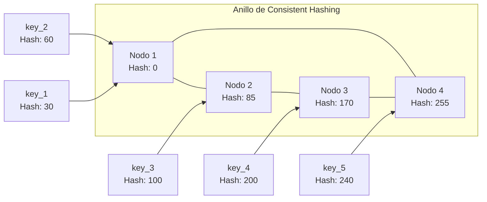
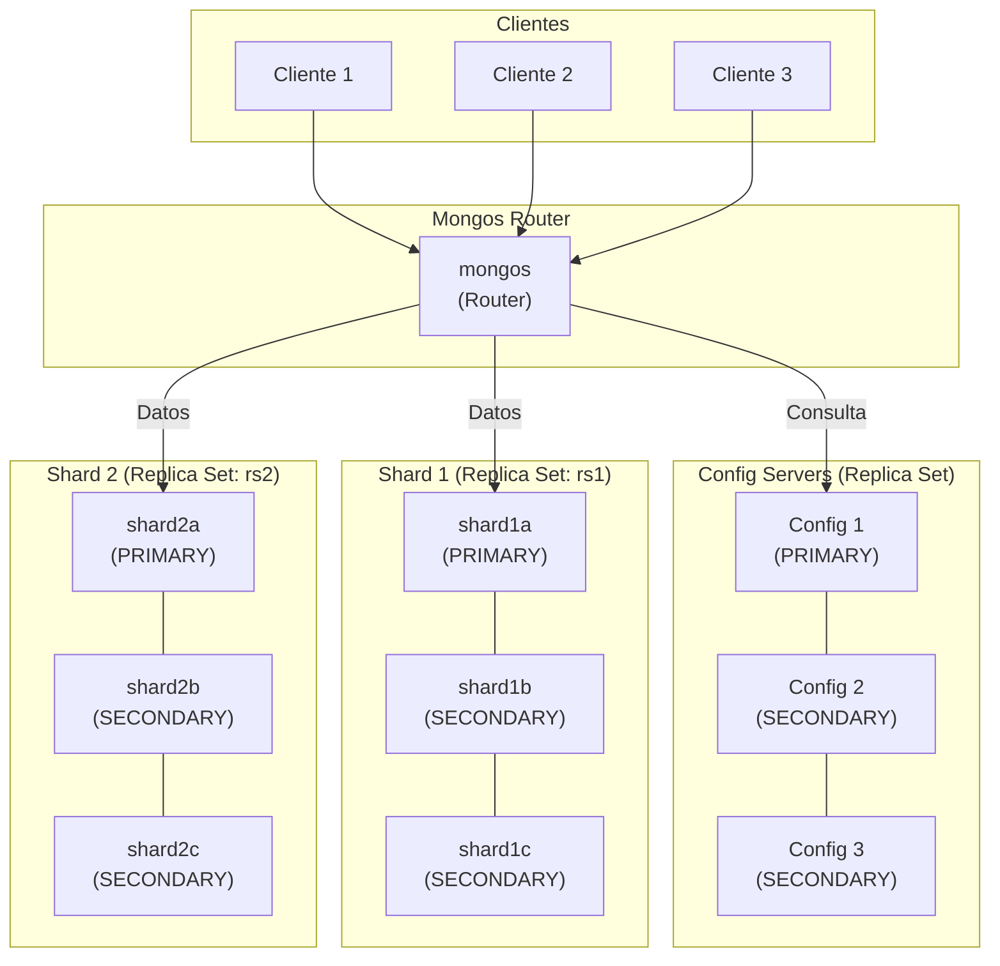
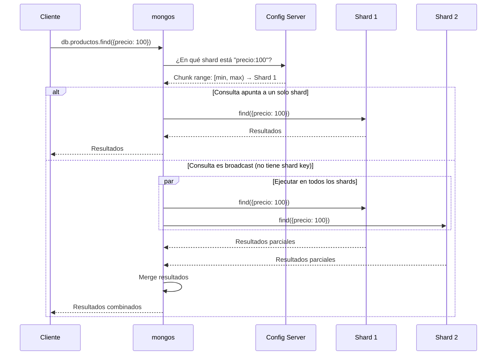
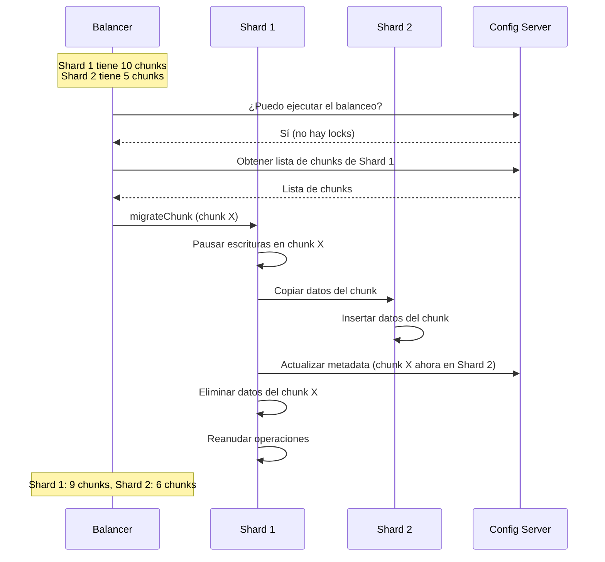

# Clase 05 — MongoDB IV: Sharding, Administración y Seguridad Completa

---

## Contenido de la Clase

1. Marco Teórico de Sharding
2. Clave de Shard
3. Configurar Cluster Shardado con Docker
4. Balancing
5. Administración de MongoDB
6. Seguridad Completa de MongoDB
7. Ejercicio Práctico

---

## 1. Marco Teórico de Sharding

### 1.1 ¿Qué es el sharding? ¿Por qué?

El **sharding** (particionamiento horizontal) es una técnica para distribuir datos entre múltiples servidores. Cada servidor (shard) contiene un **subconjunto** de los datos. A diferencia de la replicación (que mantiene copias completas), el sharding **divide** los datos.

**¿Por qué sharding?**

- **Escalabilidad vertical tiene límite:** no puedes poner infinita RAM/disco en un servidor
- **Escalabilidad horizontal:** agregar más shards = más capacidad
- **Mayor throughput:** consultas se ejecutan en paralelo sobre múltiples shards
- **Mayor capacidad de almacenamiento:** TB o PB de datos distribuidos

### 1.2 Particionamiento vs Sharding

```
REPLICACIÓN (cada nodo tiene TODOS los datos):

┌──────────────┐  ┌──────────────┐  ┌──────────────┐
│   Shard 1    │  │   Shard 2    │  │   Shard 3    │
│ [A-H] [A-H]  │  │ [A-H] [A-H]  │  │ [A-H] [A-H]  │  ← Cada shard tiene
│ [A-H] [A-H]  │  │ [A-H] [A-H]  │  │ [A-H] [A-H]  │     TODOS los datos
└──────────────┘  └──────────────┘  └──────────────┘

SHARDING (cada shard tiene una PARTE de los datos):

┌──────────────┐  ┌──────────────┐  ┌──────────────┐
│   Shard 1    │  │   Shard 2    │  │   Shard 3    │
│   [A-D]      │  │   [E-H]      │  │   [I-Z]      │  ← Cada shard tiene
│              │  │              │  │              │     solo su porción
└──────────────┘  └──────────────┘  └──────────────┘
```

### 1.3 Consistent Hashing: Teoría Completa

#### Problema del Hashing Simple

Si usamos `hash(key) % N` donde N = número de shards:

```
Ejemplo con 3 shards:
hash("usuario_1") % 3 = 0 → Shard 0
hash("usuario_2") % 3 = 1 → Shard 1
hash("usuario_3") % 3 = 2 → Shard 2

Cuando agregamos Shard 4 (N = 4):
hash("usuario_1") % 4 = 1 → Shard 1  ← ¡CAMBIÓ!
hash("usuario_2") % 4 = 2 → Shard 2  ← ¡CAMBIÓ!
hash("usuario_3") % 4 = 3 → Shard 3  ← ¡CAMBIÓ!

Resultado: Casi TODOS los datos deben reasignarse
```

#### Consistent Hashing: El Anillo de Hash



**Cómo funciona:**
1. Cada nodo se mapea a un punto en un anillo de hash (0 a 2^32)
2. Cada clave se mapea al mismo anillo
3. La clave pertenece al nodo **siguiente** en sentido horario
4. Al agregar un nodo, solo se mueven las claves entre el nodo anterior y el nuevo

**Ventaja:** Al agregar/quitar nodos, solo se reasigna ~1/N de las claves.

#### Implementación en Python

```python
import hashlib
import bisect
import random


class ConsistentHashRing:
    """
    Implementación de Consistent Hashing con anillo virtual.
    
    Cada nodo físico se mapea a múltiples nodos virtuales (vnodes)
    para mejor distribución.
    """
    
    def __init__(self, nodes=None, vnodes=150):
        """
        Inicializa el anillo de hash.
        
        Args:
            nodes: Lista de IDs de nodos iniciales
            vnodes: Número de nodos virtuales por nodo físico
        """
        self.vnodes = vnodes
        self.ring = {}         # hash_value -> node_id
        self.sorted_keys = []  # Lista ordenada de hashes
        self.nodes = set()
        
        if nodes:
            for node in nodes:
                self.add_node(node)
    
    def _hash(self, key):
        """Genera un hash de 32 bits para una clave."""
        return int(hashlib.md5(str(key).encode()).hexdigest(), 16)
    
    def add_node(self, node):
        """Agrega un nodo físico al anillo con sus vnodes."""
        if node in self.nodes:
            return
        
        self.nodes.add(node)
        
        for i in range(self.vnodes):
            vnode_key = f"{node}:vnode{i}"
            h = self._hash(vnode_key)
            self.ring[h] = node
            bisect.insort(self.sorted_keys, h)
    
    def remove_node(self, node):
        """Remueve un nodo físico del anillo."""
        if node not in self.nodes:
            return
        
        self.nodes.remove(node)
        
        for i in range(self.vnodes):
            vnode_key = f"{node}:vnode{i}"
            h = self._hash(vnode_key)
            del self.ring[h]
            self.sorted_keys.remove(h)
    
    def get_node(self, key):
        """Obtiene el nodo responsible para una clave dada."""
        if not self.ring:
            return None
        
        h = self._hash(key)
        idx = bisect.bisect_right(self.sorted_keys, h)
        
        if idx == len(self.sorted_keys):
            idx = 0  # Wrap around
        
        return self.ring[self.sorted_keys[idx]]
    
    def get_distribution(self, keys):
        """Calcula la distribución de claves entre nodos."""
        distribution = {node: 0 for node in self.nodes}
        
        for key in keys:
            node = self.get_node(key)
            if node:
                distribution[node] += 1
        
        return distribution


# === SIMULACIÓN ===
print("=" * 60)
print("SIMULACIÓN DE CONSISTENT HASHING")
print("=" * 60)

# Crear anillo con 3 nodos
ring = ConsistentHashRing(nodes=["Shard_A", "Shard_B", "Shard_C"])

# Generar 10000 claves aleatorias
keys = [f"usuario_{i:06d}" for i in range(10000)]

# Distribución inicial
dist = ring.get_distribution(keys)
print("\n--- Distribución INICIAL (3 shards) ---")
for node, count in sorted(dist.items()):
    pct = count / len(keys) * 100
    print(f"  {node}: {count} claves ({pct:.1f}%)")

# Calcular cuántas claves se mueven al agregar un nodo
old_mapping = {key: ring.get_node(key) for key in keys[:1000]}

ring.add_node("Shard_D")

new_mapping = {key: ring.get_node(key) for key in keys[:1000]}

moved = sum(1 for key in old_mapping if old_mapping[key] != new_mapping[key])
print(f"\n--- Después de agregar Shard_D ---")
print(f"  Claves verificadas: 1000")
print(f"  Claves MOVIDAS: {moved} ({moved/10:.1f}%)")
print(f"  Claves sin mover: {1000 - moved} ({(1000-moved)/10:.1f}%)")

# Distribución final
dist = ring.get_distribution(keys)
print("\n--- Distribución FINAL (4 shards) ---")
for node, count in sorted(dist.items()):
    pct = count / len(keys) * 100
    print(f"  {node}: {count} claves ({pct:.1f}%)")

# Con hashing simple (para comparar)
print("\n--- Comparación con hashing simple (hash % N) ---")
old_assignments = {key: hash(key) % 3 for key in keys[:1000]}
new_assignments = {key: hash(key) % 4 for key in keys[:1000]}
moved_simple = sum(1 for key in old_assignments if old_assignments[key] != new_assignments[key])
print(f"  Con hashing simple: {moved_simple}/1000 claves moverían ({moved_simple/10:.1f}%)")
print(f"  Con consistent hashing: {moved}/1000 claves se movieron ({moved/10:.1f}%)")
```

**Salida esperada:**
```
============================================================
SIMULACIÓN DE CONSISTENT HASHING
============================================================

--- Distribución INICIAL (3 shards) ---
  Shard_A: 3342 claves (33.4%)
  Shard_B: 3328 claves (33.3%)
  Shard_C: 3330 claves (33.3%)

--- Después de agregar Shard_D ---
  Claves verificadas: 1000
  Claves MOVIDAS: 248 (24.8%)
  Claves sin mover: 752 (75.2%)

--- Distribución FINAL (4 shards) ---
  Shard_A: 2510 claves (25.1%)
  Shard_B: 2495 claves (25.0%)
  Shard_C: 2502 claves (25.0%)
  Shard_D: 2493 claves (24.9%)

--- Comparación con hashing simple (hash % N) ---
  Con hashing simple: 746/1000 claves moverían (74.6%)
  Con consistent hashing: 248/1000 claves se movieron (24.8%)
```

### 1.4 Arquitectura de Cluster Shardado



**Componentes:**

| Componente | Función | Cantidad mínima |
|-----------|---------|-----------------|
| **mongos** | Router: recibe consultas, consulta metadatos, dirige al shard correcto | 1+ (recomendado 2+) |
| **Config Server** | Almacena metadatos: mapeo chunk → shard | 3 (Replica Set) |
| **Shard** | Cada uno es un Replica Set que almacena una porción de datos | 2+ |

**Flujo de una consulta:**



---

## 2. Clave de Shard

### 2.1 Tipos de Sharding

**Ranged Sharding (por rangos):**

```javascript
// Los datos se dividen en rangos continuos
// Ejemplo: campo "edad" con rangos [0-20), [20-40), [40-60), [60+)

sh.shardCollection("escuela.alumnos", { edad: 1 })

// Ventaja: rangos agrupados, eficiente para consultas de rango
// Desventaja: hotspot si los datos están skewed (muchos insert en un rango)
```

**Hashed Sharding (por hash):**

```javascript
// Se aplica un hash a la clave de shard
// Distribución uniforme garantizada

sh.shardCollection("escuela.alumnos", { _id: "hashed" })

// Ventaja: distribución uniforme, sin hotspot
// Desventaja: no se pueden hacer range queries eficientemente
```

**Tagged Sharding (por etiquetas):**

```javascript
// Asignar rangos de datos a shards específicos
// Útil para data locality (región geográfica)

sh.addShardTag("rs1", "NORTE")
sh.addShardTag("rs2", "SUR")

// Asignar rangos a tags
sh.updateZoneKeyRange("escuela.alumnos",
    { ciudad: "Montevideo" },
    { ciudad: "Montevideo\uffff" },
    "NORTE"
)

sh.updateZoneKeyRange("escuela.alumnos",
    { ciudad: "Punta del Este" },
    { ciudad: "Punta del Este\uffff" },
    "SUR"
)
```

### 2.2 Tabla de decisión: qué campo elegir

```
¿Qué campo elegir como Shard Key?

Criterios:
├── Cardinalidad alta: el campo debe tener muchos valores únicos
├── Distribución uniforme: los valores deben estar equilibrados
├── Escritura distribuida: no todos los writes deben ir al mismo valor
├── Lectura por shard key: la mayoría de consultas deben incluir el shard key
└── No cambiar: el shard key no se puede modificar después

Malo:
  - _id (ObjectId): secuencial → hotspot en un solo shard (para writes)
  - Campo con pocos valores (ej: "activo: true/false"): solo 2 chunks
  - Campo que cambia frecuentemente

Bueno:
  - Campo con alta cardinalidad (ej: "email", "usuarioId")
  - Hashed _id (distribución uniforme)
  - Compound shard key: { "region": 1, "fecha": 1 }
```

### 2.3 Shard Key Examples

```javascript
// Ejemplo 1: E-commerce
// Shard key: { "pais": 1, "productoId": 1 }
// Agrupa por país (tagged sharding por región) y distribuye por producto
sh.shardCollection("ecommerce.ordenes", { pais: 1, productoId: 1 })

// Ejemplo 2: Red social
// Shard key: hashed userId
// Distribución uniforme de usuarios
sh.shardCollection("social.posts", { userId: "hashed" })

// Ejemplo 3: IoT / Time series
// Shard key: { "deviceId": 1, "timestamp": 1 }
// Agrupa datos por dispositivo y tiempo
sh.shardCollection("iot.lecturas", { deviceId: 1, timestamp: 1 })

// Ejemplo 4: Multi-tenant SaaS
// Shard key: { "tenantId": 1, "collection": 1 }
// Aísla datos de cada tenant
sh.shardCollection("saas.datos", { tenantId: 1, collection: 1 })
```

---

## 3. Configurar Cluster Shardado con Docker

### 3.1 docker-compose.yml COMPLETO

```yaml
version: '3.8'

services:
  # ===== CONFIG SERVERS (Replica Set) =====
  cfg1:
    image: mongo:7.0
    container_name: cfg1
    hostname: cfg1
    command: mongod --configsvr --replSet configRS --bind_ip_all --port 27019
    volumes:
      - cfg1-data:/data/db
    ports:
      - "27019:27019"
    networks:
      - shard-network
    restart: unless-stopped

  cfg2:
    image: mongo:7.0
    container_name: cfg2
    hostname: cfg2
    command: mongod --configsvr --replSet configRS --bind_ip_all --port 27019
    volumes:
      - cfg2-data:/data/db
    ports:
      - "27020:27019"
    networks:
      - shard-network
    restart: unless-stopped

  cfg3:
    image: mongo:7.0
    container_name: cfg3
    hostname: cfg3
    command: mongod --configsvr --replSet configRS --bind_ip_all --port 27019
    volumes:
      - cfg3-data:/data/db
    ports:
      - "27021:27019"
    networks:
      - shard-network
    restart: unless-stopped

  # ===== SHARD 1 (Replica Set) =====
  s1a:
    image: mongo:7.0
    container_name: s1a
    hostname: s1a
    command: mongod --shardsvr --replSet shard1RS --bind_ip_all --port 27018
    volumes:
      - s1a-data:/data/db
    ports:
      - "27022:27018"
    networks:
      - shard-network
    restart: unless-stopped

  s1b:
    image: mongo:7.0
    container_name: s1b
    hostname: s1b
    command: mongod --shardsvr --replSet shard1RS --bind_ip_all --port 27018
    volumes:
      - s1b-data:/data/db
    ports:
      - "27023:27018"
    networks:
      - shard-network
    restart: unless-stopped

  # ===== SHARD 2 (Replica Set) =====
  s2a:
    image: mongo:7.0
    container_name: s2a
    hostname: s2a
    command: mongod --shardsvr --replSet shard2RS --bind_ip_all --port 27018
    volumes:
      - s2a-data:/data/db
    ports:
      - "27024:27018"
    networks:
      - shard-network
    restart: unless-stopped

  s2b:
    image: mongo:7.0
    container_name: s2b
    hostname: s2b
    command: mongod --shardsvr --replSet shard2RS --bind_ip_all --port 27018
    volumes:
      - s2b-data:/data/db
    ports:
      - "27025:27018"
    networks:
      - shard-network
    restart: unless-stopped

  # ===== MONGOS ROUTER =====
  mongos:
    image: mongo:7.0
    container_name: mongos
    hostname: mongos
    command: mongos --configdb configRS/cfg1:27019,cfg2:27019,cfg3:27019 --bind_ip_all --port 27017
    ports:
      - "27017:27017"
    networks:
      - shard-network
    depends_on:
      - cfg1
      - cfg2
      - cfg3
    restart: unless-stopped

volumes:
  cfg1-data:
  cfg2-data:
  cfg3-data:
  s1a-data:
  s1b-data:
  s2a-data:
  s2b-data:

networks:
  shard-network:
    driver: bridge
```

### 3.2 Script de inicialización paso a paso

```bash
#!/bin/bash
# init-sharded-cluster.sh

echo "=== Paso 1: Levantar containers ==="
docker compose up -d
sleep 10

echo "=== Paso 2: Inicializar Config Server Replica Set ==="
docker exec cfg1 mongosh --port 27019 --eval '
rs.initiate({
    _id: "configRS",
    configsvr: true,
    members: [
        { _id: 0, host: "cfg1:27019" },
        { _id: 1, host: "cfg2:27019" },
        { _id: 2, host: "cfg3:27019" }
    ]
})
'
sleep 10

echo "=== Paso 3: Inicializar Shard 1 Replica Set ==="
docker exec s1a mongosh --port 27018 --eval '
rs.initiate({
    _id: "shard1RS",
    members: [
        { _id: 0, host: "s1a:27018" },
        { _id: 1, host: "s1b:27018" }
    ]
})
'
sleep 10

echo "=== Paso 4: Inicializar Shard 2 Replica Set ==="
docker exec s2a mongosh --port 27018 --eval '
rs.initiate({
    _id: "shard2RS",
    members: [
        { _id: 0, host: "s2a:27018" },
        { _id: 1, host: "s2b:27018" }
    ]
})
'
sleep 10

echo "=== Paso 5: Conectar a mongos y agregar shards ==="
docker exec mongos mongosh --port 27017 --eval '
sh.addShard("shard1RS/s1a:27018,s1b:27018")
sh.addShard("shard2RS/s2a:27018,s2b:27018")
'
sleep 5

echo "=== Paso 6: Habilitar sharding en base de datos y colección ==="
docker exec mongos mongosh --port 27017 --eval '
// Habilitar sharding en la base de datos
sh.enableSharding("tienda")

// Shard collection con hashed key
sh.shardCollection("tienda.productos", { _id: "hashed" })

// O con compound key
// sh.shardCollection("tienda.ordenes", { pais: 1, fecha: 1 })
'

echo "=== Paso 7: Verificar estado ==="
docker exec mongos mongosh --port 27017 --eval 'sh.status()'

echo "=== ¡Cluster shardado listo! ==="
```

### 3.3 Verificar distribución con sh.status()

```javascript
// Conectar al mongos
docker exec mongos mongosh --port 27017

// Ver estado completo del cluster
sh.status()

// Salida esperada:
// --- Sharding Status ---
//   sharding version: { "_id" : 1, "clusterId" : ObjectId("...") }
//
//   shards:
//     { "_id" : "shard1RS", "host" : "shard1RS/s1a:27018,s1b:27018", "state" : 1 }
//     { "_id" : "shard2RS", "host" : "shard2RS/s2a:27018,s2b:27018", "state" : 1 }
//
//   databases:
//     { "db" : "tienda", "primary" : "shard1RS", "partitioned" : true }
//
//   tienda.productos
//     shard key: { "_id" : "hashed" }
//     unique: false
//     balancing: true
//     chunks:
//       shard1RS    2
//       shard2RS    3

// Ver chunks específicos
use config
db.chunks.find({ ns: "tienda.productos" }).pretty()

// Ver distribución por shard
db.chunks.aggregate([
    { $match: { ns: "tienda.productos" } },
    { $group: { _id: "$shard", count: { $sum: 1 } } }
])

// Verificar datos en cada shard
db.adminCommand({ listShards: 1 })
```

---

## 4. Balancing

### 4.1 Migración automática de chunks

El **balancer** de MongoDB migra chunks entre shards automáticamente para mantener la distribución equilibrada. Cuando un shard tiene más chunks que otro, el balancer mueve chunks del shard con más datos al shard con menos.



### 4.2 Comandos de Balancing

```javascript
// Ver estado del balancer
sh.getBalancerState()    // true si está activo

// Iniciar el balancer
sh.startBalancer()

// Detener el balancer (útil para mantenimiento)
sh.stopBalancer()

// Verificar si hay migraciones en progreso
db.adminCommand({ moveChunk: "tienda.productos._id" })  // No ejecutar realmente

// Configurar ventana de balancing (no molestar a ciertas horas)
use config
db.settings.update(
    { _id: "balancer" },
    { $set: { activeWindow: { start: "02:00", stop: "06:00" } } },
    { upsert: true }
)

// Monitorear migraciones
db.changelog.find({ what: "moveChunk" }).sort({ time: -1 }).limit(5).pretty()

// Deshabilitar balancing en una colección
sh.disableBalancing("tienda.productos")

// Habilitar balancing en una colección
sh.enableBalancing("tienda.productos")
```

---

## 5. Administración de MongoDB

### 5.1 Monitoreo

```javascript
// === db.serverStatus() ===
db.serverStatus()

// Campos importantes:
db.serverStatus().connections    // Conexiones actuales
db.serverStatus().opcounters     // Conteo de operaciones
db.serverStatus().mem            // Uso de memoria
db.serverStatus().wiredTiger     // Estadísticas de WiredTiger
db.serverStatus().globalLock     // Bloqueos globales
db.serverStatus().network        // Bytes enviados/recibidos

// Simplificar salida
printjson(db.serverStatus().connections)
// { "current" : 5, "available" : 51195, "totalCreated" : 10 }

printjson(db.serverStatus().opcounters)
// { "insert" : 1520, "query" : 3400, "update" : 210, "delete" : 5, ... }

// === db.stats() ===
db.stats()
// { "db" : "tienda", "collections" : 5, "views" : 0, "objects" : 10000,
//   "avgObjSize" : 256, "dataSize" : 2560000, "storageSize" : 3200000, ... }

// === db.collection.stats() ===
db.productos.stats()
// { "ns" : "tienda.productos", "count" : 5000, "size" : 1280000, ... }

// === mongostat (desde terminal) ===
// mongostat --host localhost:27017
// Desglose por operación:
// insert query update delete getmore command
//    *0    *0     *0     *0       0     *1

// Mongostat con filtros:
// mongostat --host localhost:27017 --rowcount 10 1
// mongostat --host localhost:27017 --json

// === mongotop (desde terminal) ===
// mongotop --host localhost:27017 1
// Muestra tiempo dedicado a cada operación por colección
```

### 5.2 Mantenimiento

```javascript
// === Compactación de colecciones ===
// Libera espacio en disco eliminando documentos marcados como eliminados
db.runCommand({ compact: "productos" })
// Solo funciona en primario, requiere espacio libre

// === Reindexación ===
db.productos.reIndex()
// Reconstruye todos los índices de la colección
// ⚠️ Bloquea operaciones durante la ejecución

// === Limpieza de datos antiguos ===
// Eliminar documentos más antiguos de 30 días
db.logs.deleteMany({
    fecha: { $lt: new Date(Date.now() - 30 * 24 * 60 * 60 * 1000) }
})

// === Rotación de logs ===
// En Linux:
// mv /var/log/mongodb/mongod.log /var/log/mongodb/mongod.log.$(date +%Y%m%d)
// kill -SIGUSR1 $(pgrep mongod)
// MongoDB reabrirá el archivo de log

// En Docker:
docker exec mongo-primary mongosh --eval "db.adminCommand({ logRotate: 1 })"
```

### 5.3 Performance Tuning

```javascript
// === explain() detallado ===
db.productos.find({ categoria: "electronica", precio: { $lt: 500 } })
    .explain("executionStats")

// Salida importante:
// "winningPlan" : {
//     "stage" : "FETCH",
//     "inputStage" : {
//         "stage" : "IXSCAN",           // Index Scan = BUENO
//         "indexName" : "categoria_1_precio_1"
//     }
// }
//
// Si ves "COLLSCAN" = Collection Scan = MALO (falta índice)

// "executionStats" : {
//     "totalDocsExamined" : 150,
//     "totalKeysExamined" : 150,
//     "executionTimeMillis" : 2,
//     "nReturned" : 45
// }

// === Índices ===

// Índice simple
db.productos.createIndex({ categoria: 1 })

// Índice compuesto
db.productos.createIndex({ categoria: 1, precio: -1 })

// Índice multikey (arrays)
db.productos.createIndex({ tags: 1 })

// Índice de texto
db.productos.createIndex({ nombre: "text", descripcion: "text" })

// Índice TTL (expira documentos después de X segundos)
db.sessions.createIndex({ expireAt: 1 }, { expireAfterSeconds: 0 })

// Índice geoespacial
db.ubicaciones.createIndex({ coordenadas: "2dsphere" })

// Índice parcial (solo indexa documentos que cumplen condición)
db.productos.createIndex(
    { precio: 1 },
    { partialFilterExpression: { precio: { $gt: 100 } } }
)

// Índice oculto (útil para testing sin afectar consultas)
db.productos.createIndex({ testField: 1 }, { hidden: true })

// Ver índices de una colección
db.productos.getIndexes()

// Analizar uso de índices
db.productos.aggregate([{ $indexStats: {} }])

// Eliminar un índice
db.productos.dropIndex("categoria_1")

// === Profiler de consultas ===
// Activar profiler (nivel 2 = todas las consultas)
db.setProfilingLevel(2)

// O con umbral de tiempo (solo consultas lentas)
db.setProfilingLevel(1, { slowms: 100 })  // Queries > 100ms

// Ver consultas lentas
db.system.profile.find().sort({ ts: -1 }).limit(10).pretty()

// Desactivar profiler
db.setProfilingLevel(0)

// === Optimización de aggregation pipeline ===
// MALO: $unwind antes de $match
db.productos.aggregate([
    { $unwind: "$tags" },           // Procesa TODOS los documentos
    { $match: { "tags": "oferta" } } // Filtra después
])

// BUENO: $match antes de $unwind
db.productos.aggregate([
    { $match: { tags: "oferta" } },  // Filtra primero
    { $unwind: "$tags" }            // Procesa menos documentos
])

// Usar $project para reducir campos transmitidos
db.productos.aggregate([
    { $match: { precio: { $gt: 100 } } },
    { $project: { nombre: 1, precio: 1, _id: 0 } }  // Solo traer campos necesarios
])

// Usar $limit temprano
db.productos.aggregate([
    { $match: { activo: true } },
    { $sort: { ventas: -1 } },
    { $limit: 10 }                  // Limitar antes de etapas costosas
])
```

---

## 6. Seguridad Completa de MongoDB

### 6.1 Autenticación

#### SCRAM-SHA-256 (default desde MongoDB 4.0)

```javascript
// Crear usuario administrador
use admin
db.createUser({
    user: "admin",
    pwd: "SuperSegura123!",
    roles: [
        { role: "userAdminAnyDatabase", db: "admin" },
        { role: "readWriteAnyDatabase", db: "admin" },
        { role: "clusterAdmin", db: "admin" }
    ]
})

// Crear usuario para una base de datos específica
use tienda
db.createUser({
    user: "tienda_user",
    pwd: "TiendaPass456!",
    roles: [
        { role: "readWrite", db: "tienda" }
    ]
})

// Crear usuario de solo lectura (reports)
db.createUser({
    user: "report_reader",
    pwd: "Report789!",
    roles: [
        { role: "read", db: "tienda" }
    ]
})

// Conectar con autenticación
// mongosh --username admin --password "SuperSegura123!" --authenticationDatabase admin

// Verificar usuarios
db.getUsers()
db.system.users.find().pretty()

// Cambiar contraseña
db.changeUserPassword("tienda_user", "NuevaPass000!")

// Eliminar usuario
db.dropUser("report_reader")
```

**Iniciar mongod con autenticación habilitada:**

```bash
# Usando keyfile (para replica sets)
openssl rand -base64 756 > /etc/mongo/keyfile
chmod 400 /etc/mongo/keyfile
chown mongodb:mongodb /etc/mongo/keyfile

# Iniciar mongod con --auth y --keyfile
mongod --auth --keyFile /etc/mongo/keyfile --replSet rs0

# O en el archivo de configuración (mongod.conf):
# security:
#   authorization: enabled
#   keyFile: /etc/mongo/keyfile
```

#### X.509 Certificates

```bash
# Generar CA
openssl genrsa -out ca.key 4096
openssl req -new -x509 -days 365 -key ca.key -out ca.pem -subj "/CN=MongoDB-CA"

# Generar certificado del servidor
openssl genrsa -out server.key 4096
openssl req -new -key server.key -out server.csr -subj "/CN=mongo-primary"
openssl x509 -req -days 365 -in server.csr -CA ca.pem -CAkey ca.key -CAcreateserial -out server.pem

# Generar certificado del cliente
openssl genrsa -out client.key 4096
openssl req -new -key client.key -out client.csr -subj "/CN=client-app"
openssl x509 -req -days 365 -in client.csr -CA ca.pem -CAkey ca.key -CAcreateserial -out client.pem

# Iniciar mongod con TLS
mongod --sslMode requireSSL \
    --sslPEMKeyFile /etc/ssl/server.pem \
    --sslCAFile /etc/ssl/ca.pem \
    --sslClusterFile /etc/ssl/server.pem

# Conectar con TLS
mongosh --tls \
    --tlsCertificateKeyFile /etc/ssl/client.pem \
    --tlsCAFile /etc/ssl/ca.pem
```

### 6.2 Autorización (RBAC)

```javascript
// === Roles predefinidos detallados ===

// Roles de base de datos:
// read:               Solo lectura
// readWrite:          Lectura y escritura
// dbAdmin:            Mantenimiento (compact, reindex, stats)
// dbOwner:            readWrite + dbAdmin + userAdmin
// userAdmin:          Crear/eliminar usuarios
// clusterAdmin:       Admin de clúster (sharding, replica sets)

// Roles de sistema:
// readAnyDatabase:    Lectura en todas las BDs
// readWriteAnyDatabase: Lectura/escritura en todas las BDs
// userAdminAnyDatabase: Admin de usuarios en todas las BDs
// dbAdminAnyDatabase:  Admin de BDs en todas las BDs

// Ver roles disponibles
show roles
show privileges

// Crear rol personalizado
use admin
db.createRole({
    role: "backupOperator",
    privileges: [
        { resource: { db: "", collection: "" }, actions: ["find", "listCollectionSizes"] },
        { resource: { db: "admin", collection: "system.users" }, actions: ["find"] }
    ],
    roles: []
})

// Asignar rol a usuario
db.createUser({
    user: "backup_user",
    pwd: "Backup123!",
    roles: [
        { role: "backupOperator", db: "admin" }
    ]
})

// Ver privilegios de un rol
db.getRole("backupOperator", { showPrivileges: true })
```

### 6.3 Cifrado

#### Encryption at Rest (WiredTiger)

```bash
# MongoDB Enterprise: cifrado transparente de datos en disco
mongod --enableEncryption \
    --encryptionKeyFile /etc/mongo/encryption.key

# Generar key de cifrado
openssl rand -base64 32 > /etc/mongo/encryption.key
chmod 400 /etc/mongo/encryption.key

# MongoDB Community: usar LUKS (Linux) o BitLocker (Windows)
# LUKS:
cryptsetup luksFormat /dev/sdb1
cryptsetup luksOpen /dev/sdb1 mongo_encrypted
mkfs.ext4 /dev/mapper/mongo_encrypted
mount /dev/mapper/mongo_encrypted /data
```

#### Encryption in Transit (SSL/TLS)

```yaml
# mongod.conf
net:
  port: 27017
  bindIp: 0.0.0.0
  tls:
    mode: requireTLS
    certificateKeyFile: /etc/ssl/mongo.pem
    CAFile: /etc/ssl/ca.pem
```

#### Client-Side Field Level Encryption (CSFLE)

```javascript
// Cifrar campos específicos del lado del cliente
// Útil para datos sensibles (SSN, tarjetas de crédito, etc.)

const { ClientEncryption } = require('mongodb');

// Generar master key
const masterKey = crypto.randomBytes(96);

// Crear cliente con encryption
const encryptedClient = new MongoClient(uri, {
    autoEncryption: {
        keyVaultNamespace: "encryption.__keyVault",
        kmsProviders: {
            local: {
                key: masterKey
            }
        },
        schemaMap: {
            "tienda.clientes": {
                bsonType: "object",
                properties: {
                    email: {
                        encrypt: {
                            bsonType: "string",
                            algorithm: "AEAD_AES_256_CBC_HMAC_SHA_512-Deterministic"
                        }
                    },
                    telefono: {
                        encrypt: {
                            bsonType: "string",
                            algorithm: "AEAD_AES_256_CBC_HMAC_SHA_512-Random"
                        }
                    }
                }
            }
        }
    }
});
```

### 6.4 Seguridad de Red

```bash
# bindIp: solo escuchar en IPs específicas
# mongod.conf:
net:
  bindIp: 127.0.0.1,192.168.1.100  # Solo localhost y una IP interna
  port: 27017

# Firewall rules (Linux - iptables)
# Permitir solo IPs específicas al puerto 27017
sudo iptables -A INPUT -p tcp --dport 27017 -s 192.168.1.0/24 -j ACCEPT
sudo iptables -A INPUT -p tcp --dport 27017 -j DROP

# UFW (Ubuntu):
sudo ufw allow from 192.168.1.0/24 to any port 27017
sudo ufw deny 27017

# Windows Firewall:
netsh advfirewall firewall add rule name="Allow Mongo Internal" ^
    dir=in action=allow protocol=tcp localport=27017 remoteip=192.168.1.0/24
netsh advfirewall firewall add rule name="Block Mongo External" ^
    dir=in action=block protocol=tcp localport=27017

# Puerto no estándar (obscurity, no seguridad, pero ayuda):
net:
  port: 31337  # En vez de 27017
```

### 6.5 Auditoría

```yaml
# mongod.conf (MongoDB Enterprise)
auditLog:
  destination: file
  format: JSON
  path: /var/log/mongodb/audit.json
  filter: '{ atype: { $in: [ "authenticate", "createCollection", "dropCollection", "dropDatabase", "createUser", "dropUser", "grantRolesToUser", "updateUser" ] } }'
```

```javascript
// Verificar que la auditoría está habilitada
db.adminCommand({ getParameter: 1, auditAuthorizationSuccess: true })

// Tipos de eventos auditables:
// - authenticate: intentos de autenticación
// - createCollection/dropCollection: creación/eliminación de colecciones
// - createUser/dropUser: gestión de usuarios
// - createIndex/dropIndex: gestión de índices
// - insert/update/delete: operaciones de datos
// - command: comandos ejecutados
```

### 6.6 Hardening

```yaml
# mongod.conf completo de seguridad
security:
  authorization: enabled
  keyFile: /etc/mongo/keyfile
  clusterAuthMode: keyFile
  redactClientLogData: true

setParameter:
  auditAuthorizationSuccess: true
  auditLogRotationFileSize: 104857600  # 100MB
  diagnosticDataCollectionEnabled: false
  honorSystemUmask: true

net:
  port: 27017
  bindIp: 127.0.0.1,10.0.0.5
  tls:
    mode: requireTLS
    certificateKeyFile: /etc/ssl/mongo.pem
    CAFile: /etc/ssl/ca.pem
  http:
    enabled: false   # Deshabilitar interfaz HTTP
  REST:
    enabled: false   # Deshabilitar REST API

operationProfiling:
  slowOpThresholdMs: 100
  mode: slowOp

storage:
  journal:
    enabled: true

# Deshabilitar script engine
# En command line:
# mongod --noscripting

# Deshabilitar comandos peligrosos (en command line):
# mongod --setParameter enableLocalhostAuthBypass=0
```

```javascript
// === Prevención de NoSQL Injection ===

// MALO (vulnerable a injection):
const userInput = req.body.username;  // "admin\" || true || \""
db.users.find({ username: userInput })  // ¡Busca TODOS los usuarios!

// BUENO (sanitizar input):
const username = String(req.body.username)  // Forzar a string
const sanitized = username.replace(/[^a-zA-Z0-9_]/g, '')  // Limpiar caracteres
db.users.find({ username: sanitized })

// BUENO (usar queries parametrizadas):
const query = { username: { $eq: String(req.body.username) } }
db.users.find(query)

// Deshabilitar comandos peligrosos via mongod.conf:
#setParameter:
  diagnosticDataCollectionEnabled: false
```

### 6.7 Backup Security

```bash
# Cifrar backups con openssl
tar -czf - /backup/mongodb/ | openssl enc -aes-256-cbc -salt -out /backup/encrypted.tar.gz.enc

# Descifrar para restaurar
openssl enc -aes-256-cbc -d -in /backup/encrypted.tar.gz.enc | tar -xzf -

# Cifrar con GPG
gpg --symmetric --cipher-algo AES256 /backup/mongodb/backup.tar.gz
# Descifrar
gpg --decrypt /backup/mongodb/backup.tar.gz.gpg > /backup/mongodb/backup.tar.gz

# Almacenamiento seguro:
# - Offsite backup (diferente ubicación geográfica)
# - Acceso restringido (solo usuarios de backup)
# - Retención documentada
# - Pruebas de restauración periódicas
```

---

## 7. Ejercicio Práctico

### Ejercicio 1: Configurar cluster shardado con Docker

```bash
# Paso 1: Crear docker-compose.yml (usar la sección 3.1)

# Paso 2: Levantar cluster
docker compose up -d

# Paso 3: Verificar todos los containers
docker ps --format "table {{.Names}}\t{{.Status}}\t{{.Ports}}"

# Paso 4: Ejecutar script de inicialización
chmod +x init-sharded-cluster.sh
./init-sharded-cluster.sh

# Paso 5: Verificar sharding status
docker exec mongos mongosh --port 27017 --eval "sh.status()"
```

### Ejercicio 2: Insertar 50,000 documentos

```javascript
// Conectar al mongos
docker exec mongos mongosh --port 27017

use tienda

// Insertar 50,000 productos
const productos = ["Laptop", "Mouse", "Teclado", "Monitor", "Tablet",
    "Celular", "Audífonos", "Cable USB", "Cargador", "Funda"]

for (let i = 0; i < 50000; i++) {
    db.productos.insertOne({
        sku: `PROD-${String(i).padStart(6, '0')}`,
        nombre: `${productos[i % productos.length]} ${Math.floor(i / productos.length) + 1}`,
        categoria: ["electronica", "accesorios", "oferta", "nuevo"][i % 4],
        precio: parseFloat((Math.random() * 1000 + 10).toFixed(2)),
        stock: Math.floor(Math.random() * 100),
        activo: i % 5 !== 0,
        fecha: new Date(Date.now() - Math.random() * 365 * 24 * 60 * 60 * 1000),
        tags: ["oferta", "nuevo", "bestseller", "temporada"].slice(0, (i % 4) + 1)
    })
}

print("Total documentos: " + db.productos.countDocuments())
```

### Ejercicio 3: Verificar distribución

```javascript
// Verificar sharding status
sh.status()

// Verificar chunks por shard
use config
db.chunks.aggregate([
    { $match: { ns: "tienda.productos" } },
    { $group: { _id: "$shard", totalChunks: { $sum: 1 } } }
])

// Verificar distribución de datos
db.adminCommand({ listShards: 1 })

// Verificar que las consultas van al shard correcto
db.productos.find({ sku: "PROD-025000" }).explain("executionStats")
// Debe mostrar "shards" con solo 1 shard (uso de shard key)
```

### Ejercicio 4: Agregar tercer shard

```bash
# Agregar servicios al docker-compose.yml:
# s3a y s3b (similar a s1a/s1b)

# Levantar nuevos nodos
docker compose up -d s3a s3b

# Inicializar replica set del shard 3
docker exec s3a mongosh --port 27018 --eval '
rs.initiate({
    _id: "shard3RS",
    members: [
        { _id: 0, host: "s3a:27018" },
        { _id: 1, host: "s3b:27018" }
    ]
})'

# Agregar shard al cluster
docker exec mongos mongosh --port 27017 --eval '
sh.addShard("shard3RS/s3a:27018,s3b:27018")
'

# Verificar que el balancer redistribuye chunks
docker exec mongos mongosh --port 27017 --eval "
sh.startBalancer();
print('Balancer iniciado');
sh.getBalancerState();
"
```

### Ejercicio 5: Configurar seguridad completa

```javascript
// Paso 1: Crear usuario admin
use admin
db.createUser({
    user: "admin",
    pwd: "AdminSeguro2026!",
    roles: [
        { role: "userAdminAnyDatabase", db: "admin" },
        { role: "readWriteAnyDatabase", db: "admin" },
        { role: "clusterAdmin", db: "admin" }
    ]
})

// Paso 2: Crear usuario de aplicación
use tienda
db.createUser({
    user: "app_tienda",
    pwd: "AppTienda2026!",
    roles: [
        { role: "readWrite", db: "tienda" }
    ]
})

// Paso 3: Crear usuario de solo lectura
db.createUser({
    user: "reports",
    pwd: "Reports2026!",
    roles: [
        { role: "read", db: "tienda" }
    ]
})

// Paso 4: Verificar roles
show roles
show users
db.getUsers({ showPrivileges: true })

// Paso 5: Probar autenticación
// mongosh --username app_tienda --password "AppTienda2026!" --authenticationDatabase tienda
```

### Ejercicio 6: Backup automatizado

```bash
#!/bin/bash
# backup-sharded-cluster.sh

BACKUP_DIR="/backup/mongodb-sharded"
DATE=$(date +%Y%m%d_%H%M%S)
RETENTION_DAYS=7

mkdir -p "${BACKUP_DIR}/${DATE}"

# Backup de cada base de datos
for DB in admin tienda local; do
    docker exec mongos mongodump \
        --host localhost \
        --port 27017 \
        --db "${DB}" \
        --gzip \
        --out "/backup/${DATE}" 2>/dev/null
done

# Cifrar backup
cd "${BACKUP_DIR}"
tar -czf "${DATE}.tar.gz" "${DATE}"
openssl enc -aes-256-cbc -salt -in "${DATE}.tar.gz" \
    -out "${DATE}.tar.gz.enc" -pass pass:"BackupKey2026!"
rm -rf "${DATE}" "${DATE}.tar.gz"

# Limpiar backups antiguos
find "${BACKUP_DIR}" -name "*.enc" -mtime +${RETENTION_DAYS} -delete

echo "[$(date)] Backup completado y cifrado: ${DATE}.tar.gz.enc" >> /var/log/sharded_backup.log
```

### Ejercicio 7: Script de monitoreo

```bash
#!/bin/bash
# monitor-sharded-cluster.sh

LOG="/var/log/mongo_monitor.log"

# Función para verificar estado del cluster
check_cluster() {
    echo "=== $(date) ===" >> "$LOG"
    
    # Verificar mongos
    mongos_ok=$(docker exec mongos mongosh --quiet --eval "db.adminCommand('ping').ok" 2>/dev/null)
    if [ "$mongos_ok" == "1" ]; then
        echo "mongos: OK" >> "$LOG"
    else
        echo "mongos: FALLO" >> "$LOG"
    fi
    
    # Verificar cada shard
    for shard in shard1RS shard2RS shard3RS; do
        primary=$(docker exec mongos mongosh --quiet --eval "
            rs.status().members.filter(m => m.stateStr === 'PRIMARY' && m.setName === '${shard}').length
        " 2>/dev/null)
        if [ "$primary" == "1" ]; then
            echo "${shard}: OK" >> "$LOG"
        else
            echo "${shard}: FALLO" >> "$LOG"
        fi
    done
    
    # Verificar datos
    total=$(docker exec mongos mongosh --quiet --port 27017 --eval "
        db.getSiblingDB('tienda').productos.countDocuments()
    " 2>/dev/null)
    echo "Documentos en tienda.productos: ${total}" >> "$LOG"
    
    # Verificar tamaño de datos
    docker exec mongos mongosh --quiet --port 27017 --eval "
        db.getSiblingDB('tienda').productos.stats().size
    " 2>/dev/null | xargs -I {} echo "Tamaño: {} bytes" >> "$LOG"
}

check_cluster

# Ejecutar cada 5 minutos con cron:
# */5 * * * * /path/to/monitor-sharded-cluster.sh
```

---

## Resumen de la Clase

| Tema | Comando/Concepto Clave |
|------|------------------------|
| Shard key | `sh.shardCollection()` |
| Consistent Hashing | Anillo de hash, ~1/N de movimiento |
| Config Servers | 3 nodos (Replica Set), metadatos |
| mongos | Router, conexión del cliente |
| Balancing | `sh.startBalancer()` / `sh.stopBalancer()` |
| Monitoreo | `db.serverStatus()`, `mongostat`, `mongotop` |
| Explain | `explain("executionStats")` → IXSCAN vs COLLSCAN |
| Índices | Compuestos, TTL, parciales, de texto |
| Autenticación | SCRAM-SHA-256, X.509 |
| Autorización | RBAC con roles predefinidos y personalizados |
| Cifrado | At rest (WiredTiger), in transit (TLS), CSFLE |
| Hardening | `noscripting`, `bindIp`, HTTP disabled |

---

*Próxima clase: Redis I — Fundamentos, Tipos de Datos y Persistencia*
