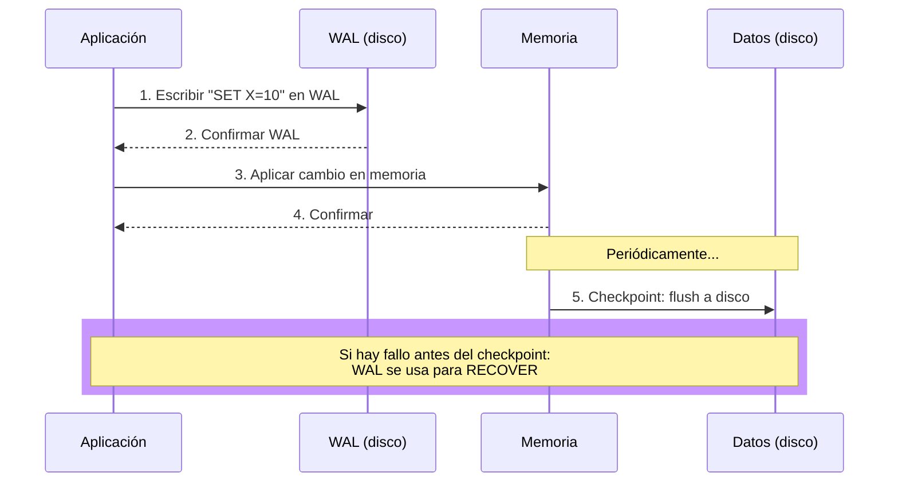
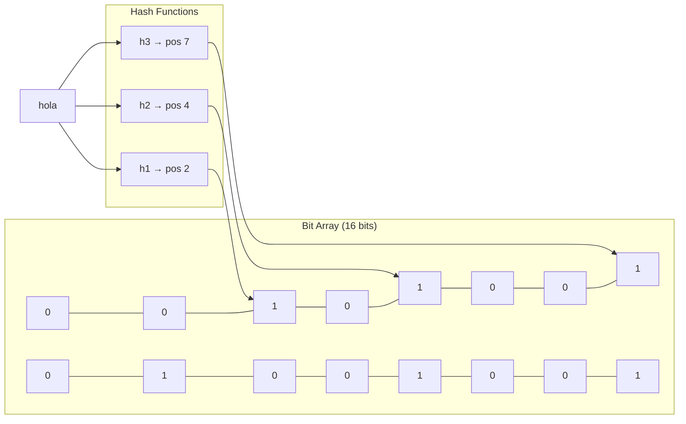

# Clase 5 — WAL y Bloom Filters

## 1. Write-Ahead Log (WAL)

### Concepto

- Log secuencial de escrituras antes de aplicarlas a la base de datos
- Garantiza durabilidad: si hay fallo, el log permite reconstruir
- Escritura secuencial = más rápida que I/O aleatorio

### Funcionamiento



### WAL en PostgreSQL

**Configuración (`postgresql.conf`):**

```conf
wal_level = replica          -- minimal, replica, logical
max_wal_size = 1GB           -- tamaño máximo antes de checkpoint
min_wal_size = 80MB          -- tamaño mínimo
wal_keep_size = 512MB        -- retener WAL para replication
checkpoint_timeout = 5min    -- frecuencia de checkpoints
```

**Verificar WAL:**

```sql
-- Ver configuración actual
SHOW wal_level;
SHOW max_wal_size;

-- Ver tamaño de WAL actual
SELECT pg_size_pretty(pg_wal_lsn_diff(pg_current_wal_lsn(), '0/0'));

-- Ver directorio de WAL
SELECT * FROM pg_ls_waldir();
```

**Simular recuperación con WAL:**

```bash
# Ver logs de PostgreSQL
tail -f /var/log/postgresql/postgresql-16-main.log

# Forzar checkpoint
CHECKPOINT;

# Simular fallo (NO ejecutar en producción)
# PostgreSQL detecta WAL incompleto al reiniciar y hace recovery automático
sudo systemctl restart postgresql
```

### WAL en Redis

Redis usa AOF (Append Only File), equivalente a WAL:

**Configuración (`redis.conf`):**

```conf
appendonly yes                    -- habilitar AOF
appendfilename "appendonly.aof"   -- nombre del archivo
appendfsync everysec              -- always, everysec, no
auto-aof-rewrite-percentage 100   -- trigger rewrite al crecer 100%
auto-aof-rewrite-min-size 64mb    -- tamaño mínimo para rewrite
```

**Comparación `appendfsync`:**

| Valor | Durabilidad | Rendimiento |
|-------|-------------|-------------|
| `always` | Máxima (cada operación) | Más lento |
| `everysec` | Pierde máx. 1 segundo | Balanceado |
| `no` | Depende del SO | Más rápido |

**Verificar AOF:**

```redis
# Ver configuración
CONFIG GET appendonly
CONFIG GET appendfsync

# Ver tamaño del AOF
INFO persistence
# → aof_current_size
```

## 2. Bloom Filters

### Concepto

- Estructura probabilística que indica si un elemento **puede estar** o **definitivamente no está**
- Falsos positivos: posibles
- Falsos negativos: imposibles
- Espacio muy eficiente



### Funcionamiento

```python
import hashlib

class BloomFilter:
    def __init__(self, size, hash_count):
        self.bit_array = [0] * size
        self.size = size
        self.hash_count = hash_count

    def _hashes(self, item):
        hashes = []
        for i in range(self.hash_count):
            h = hashlib.md5(f"{item}{i}".encode()).hexdigest()
            hashes.append(int(h, 16) % self.size)
        return hashes

    def add(self, item):
        for pos in self._hashes(item):
            self.bit_array[pos] = 1

    def might_contain(self, item):
        return all(self.bit_array[pos] == 1 for pos in self._hashes(item))

# Uso
bf = BloomFilter(size=100, hash_count=3)
bf.add("usuario:1001")
bf.add("usuario:2045")

print(bf.might_contain("usuario:1001"))  # True (definitivamente)
print(bf.might_contain("usuario:9999"))  # False (definitivamente no está)
```

### Bloom Filters en Cassandra

- Cada SSTable tiene un Bloom Filter en memoria
- Antes de buscar en SSTable, consulta el Bloom Filter
- Si dice "no está", evita I/O de disco innecesario

```
Consulta GET clave X:
1. Check Bloom Filter de SSTable 1 → ¿contiene X? → NO → saltar
2. Check Bloom Filter de SSTable 2 → ¿contiene X? → SÍ (posible) → buscar
3. Check Bloom Filter de SSTable 3 → ¿contiene X? → NO → saltar
```

### Bloom Filters en Redis (con RedisBloom)

```bash
# Instalar RedisBloom
docker run -p 6379:6379 redislabs/rebloom:latest

redis-cli
```

```redis
# Agregar elementos
BF.ADD misUsuarios "usuario:1001"
BF.ADD misUsuarios "usuario:2045"

# Verificar existencia
BF.EXISTS misUsuarios "usuario:1001"
# → (integer) 1 (probablemente existe)

BF.EXISTS misUsuarios "usuario:9999"
# → (integer) 0 (definitivamente NO existe)

# Crear con parámetros
BF.RESERVE misUsuarios2 0.01 1000
# error_rate: 0.01 (1% falsos positivos)
# capacity: 1000 elementos
```

### Tasa de falsos positivos

```python
# Fórmula: p ≈ (1 - e^(-kn/m))^k
# k = número de hash functions
# n = número de elementos
# m = tamaño del bit array

import math

def false_positive_rate(n, m, k):
    return (1 - math.exp(-k * n / m)) ** k

# Ejemplo: 10000 elementos, 100000 bits, 7 hash functions
rate = false_positive_rate(10000, 100000, 7)
print(f"Tasa de falsos positivos: {rate:.4f}")  # ~0.0081 (0.81%)
```

## 3. Configuración de WAL en PostgreSQL

### Setup completo

```bash
# Instalar PostgreSQL en Ubuntu
sudo apt update
sudo apt install -y postgresql postgresql-contrib

# Iniciar servicio
sudo systemctl start postgresql
sudo systemctl enable postgresql

# Conectar como postgres
sudo -u postgres psql
```

```sql
-- Crear base de datos
CREATE DATABASE curso_nosql;
\c curso_nosql

-- Crear tabla
CREATE TABLE logs (
    id SERIAL PRIMARY KEY,
    mensaje TEXT,
    nivel VARCHAR(10),
    creado_en TIMESTAMP DEFAULT NOW()
);

-- Insertar datos de prueba
INSERT INTO logs (mensaje, nivel) VALUES
    ('Inicio del sistema', 'INFO'),
    ('Error de conexión', 'ERROR'),
    ('Usuario autenticado', 'INFO');
```

### Configurar WAL

```bash
# Editar configuración
sudo nano /etc/postgresql/16/main/postgresql.conf
```

```conf
# WAL
wal_level = logical
max_wal_senders = 3
max_replication_slots = 3
wal_keep_size = 256MB
```

```bash
# Reiniciar PostgreSQL
sudo systemctl restart postgresql
```

## 4. Ejercicio Práctico: Simular Recuperación con WAL

### Paso 1: Verificar WAL

```sql
-- En PostgreSQL
SELECT pg_current_wal_lsn();
SELECT * FROM pg_stat_wal;
```

### Paso 2: Verificar AOF en Redis

```redis
CONFIG SET appendonly yes
CONFIG SET appendfsync always

SET clave1 "valor1"
SET clave2 "valor2"

# Ver archivo AOF
# Linux: ls /var/lib/redis/appendonly.aof*
```

### Paso 3: Implementar Bloom Filter en Python

```python
# Instalar dependencia
pip install mmh3 bitarray

import mmh3
from bitarray import bitarray

class BloomFilterOptimized:
    def __init__(self, num_items, false_positive_rate):
        import math
        self.size = int(-num_items * math.log(false_positive_rate) / (math.log(2) ** 2))
        self.hash_count = int(self.size / num_items * math.log(2))
        self.bit_array = bitarray(self.size)
        self.bit_array.setall(0)

    def _hashes(self, item):
        return [mmh3.hash(item, i) % self.size for i in range(self.hash_count)]

    def add(self, item):
        for pos in self._hashes(item):
            self.bit_array[pos] = 1

    def might_contain(self, item):
        return all(self.bit_array[pos] == 1 for pos in self._hashes(item))

    def false_positive_rate_actual(self, items_tested, num_tests=10000):
        import random, string
        false_positives = 0
        for _ in range(num_tests):
            random_item = ''.join(random.choices(string.ascii_letters, k=10))
            if random_item not in items_tested and self.might_contain(random_item):
                false_positives += 1
        return false_positives / num_tests

# Uso
bf = BloomFilterOptimized(num_items=10000, false_positive_rate=0.01)

# Agregar emails
emails = [f"usuario{i}@ejemplo.com" for i in range(10000)]
for email in emails:
    bf.add(email)

# Verificar
print(bf.might_contain("usuario5000@ejemplo.com"))  # True
print(bf.might_contain("no_existe@ejemplo.com"))     # False
print(f"FP Rate: {bf.false_positive_rate_actual(set(emails)):.4f}")
```

### Paso 4: Verificar archivos de WAL/AOF

```bash
# PostgreSQL WAL
ls -la /var/lib/postgresql/16/main/pg_wal/

# Redis AOF
ls -la /var/lib/redis/appendonly.aof*
```
