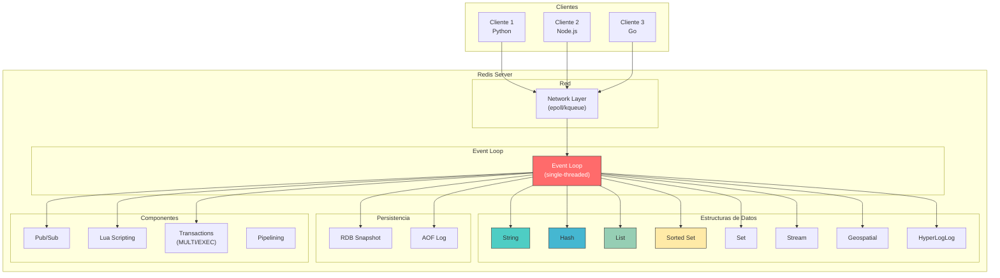
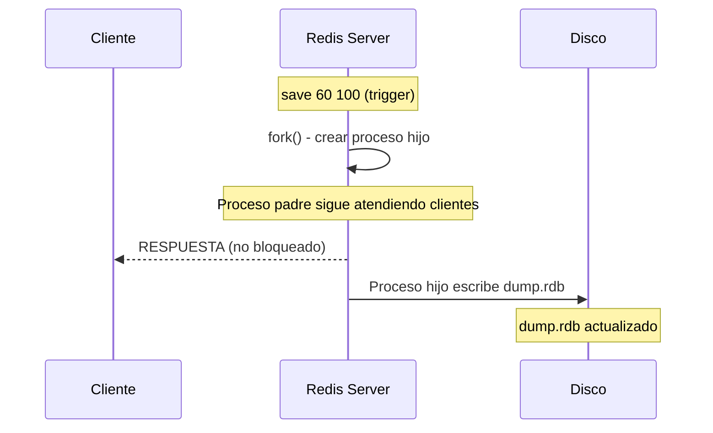

# Clase 06 — Redis I: Fundamentos, Tipos de Datos y Persistencia

---

## Contenido de la Clase

1. Marco Teorico
2. Instalacion
3. Arquitectura Detallada
4. Configuracion (redis.conf COMPLETO explicado)
5. Tipos de Datos COMPLETO
6. Persistencia Detallada
7. Seguridad Basica
8. Ejercicio Practico

---

## 1. Marco Teorico

### 1.1 Que es Redis?

**Redis** (Remote Dictionary Server) es una base de datos de codigo abierto, creada por **Salvatore Sanfilippo** en 2009, que almacena datos en estructuras de datos en memoria (RAM). Originalmente fue disenado como un cache con estructuras ricas, pero hoy es usado como base de datos primaria para muchos casos de uso.

**Datos clave:**
- Lenguaje original: C (ahora con componentes en Rust y otros)
- Licencia: BSD (codigo abierto)
- Version actual: 7.4.x
- Modelo: cliente-servidor, single-threaded
- Protocolo: RESP (REdis Serialization Protocol)

### 1.2 Modelo de datos clave-valor

Redis almacena pares **clave -> valor** donde:
- La **clave** es un string (maximo 512MB)
- El **valor** puede ser diferentes tipos de estructuras de datos

```
+-----------------------------------------------------+
|                    REDIS                             |
|                                                     |
|  Clave          ->  Tipo           ->  Valor        |
|  -------------------------------------------------  |
|  "usuario:1"   ->  Hash           ->  {nombre,email}|
|  "sesion:abc"  ->  String         ->  "token123"    |
|  "carrito:1"   ->  List           ->  [prod1,prod2] |
|  "tags:js"     ->  Set            ->  {js, node, ts}|
|  "leaderboard" ->  Sorted Set     ->  {user1: 100}  |
|  "visitas"     ->  String         ->  42             |
|  "ubicacion:1" ->  Geospatial     ->  [-58.4,-34.6] |
|  "hyperloglog" ->  HyperLogLog    ->  cardinalidad   |
|  "stream:log"  ->  Stream         ->  eventos        |
|  "bandera:1"   ->  Bitmap         ->  01101001       |
+-----------------------------------------------------+
```

### 1.3 Por que es tan rapido?

Redis es excepcionalmente rapido debido a tres factores principales:

1. **Single-threaded:** Un solo hilo ejecuta comandos, eliminando overhead de concurrencia (locks, context switching)
2. **I/O Multiplexing:** Usa epoll/kqueue para manejar miles de conexiones simultaneas sin threads adicionales
3. **Todo en memoria:** No hay acceso a disco para lecturas (disco solo para persistencia)

```
Comparacion de rendimiento tipico:

+----------------------+----------------+-----------------+
| Operacion            | Redis          | MongoDB         |
+----------------------+----------------+-----------------+
| GET simple           | ~0.1ms (100K/s)| ~1-2ms (5K/s)   |
| SET simple           | ~0.1ms (100K/s)| ~2-3ms (3K/s)   |
| Lectura por indice   | ~0.1ms (100K/s)| ~1-5ms (2K/s)   |
| Operacion compleja   | ~0.5ms (20K/s) | ~10-50ms        |
+----------------------+----------------+-----------------+
```

### 1.4 Memoria vs Disco: Tradeoffs

```
+-------------------------------------------------------------+
|                    MEMORIA (RAM)                             |
|  Velocidad extrema (~100ns vs ~10ms disco)                  |
|  Latencia consistente                                        |
|  Costoso: ~$5-10/GB vs ~$0.02/GB en disco                   |
|  Volatil: se pierde al apagar (mitigado con persistencia)   |
|  Limitado: servidores tipicos 64-512GB RAM                   |
+-------------------------------------------------------------+

+-------------------------------------------------------------+
|                    DISCO (SSD/HDD)                           |
|  Economico: TB por poco dinero                               |
|  Persistente: sobrevive reinicios                            |
|  Lento: 1000x mas lento que RAM                              |
|  Latencia variable (HDD: seeks, SSD: mas consistente)       |
+-------------------------------------------------------------+

Redis combina ambos: datos en RAM para velocidad + persistencia
en disco para sobrevivir reinicios.
```

### 1.5 Casos de Uso

| Caso de Uso | Tipo de Dato | Descripcion |
|------------|--------------|-------------|
| **Cache** | String/Hash | Almacenar resultados de consultas costosas |
| **Sesiones** | Hash | Datos de sesion de usuarios (expiration automatica) |
| **Colas de mensajes** | List/Stream | Procesamiento asincrono de tareas |
| **Rate Limiting** | String (INCR) | Controlar tasa de peticiones por IP |
| **Leaderboards** | Sorted Set | Ranking de puntuaciones en tiempo real |
| **Contadores** | String (INCR) | Contar visitas, likes, etc. |
| **Geolocalizacion** | Geospatial | Encontrar tiendas cercanas |
| **Filtros de existencia** | Bitmap | Verificar si un elemento existe |

### 1.6 Comparacion con otros sistemas

```
+--------------+--------------+--------------+--------------+
| Caracterist. | Redis        | Memcached    | DynamoDB     |
+--------------+--------------+--------------+--------------+
| Modelo       | Clave-Valor  | Clave-Valor  | Clave-Valor  |
|              | estructuras  | solo strings | + tablas     |
| Almacenamiento| RAM + disco | Solo RAM     | Disco (SSD)  |
| Persistencia | RDB + AOF    | No           | Automatica   |
| TTL          | Si           | Si           | TTL (opcional)|
| Datos        | Strings,     | Strings      | Cualquier    |
|              | Hashes, Lists|              | tipo BSON    |
|              | Sets, ZSets  |              |              |
| Replicacion  | Si (master-  | No (client-  | Automatica   |
|              | replica)     | side)        |              |
| Sorting      | Si (ZSet)    | No           | Si           |
| Lua Scripting| Si           | No           | No           |
| Pub/Sub      | Si           | No           | No           |
| Streams      | Si (5.0+)   | No           | Kinesis (aws)|
| Latencia     | <1ms         | <1ms         | 5-20ms       |
| Escalabilidad| Manual       | Client-side  | Automatica   |
| Costo (prod) | Medio        | Bajo         | Alto (AWS)   |
+--------------+--------------+--------------+--------------+
```

---

## 2. Instalacion

### 2.1 Windows: WSL2 (Recomendado)

```powershell
# Verificar que WSL2 esta instalado
wsl --list --verbose

# Si no esta instalado:
wsl --install -d Ubuntu

# Reiniciar el equipo
# Despues de reiniciar, configurar usuario de Ubuntu en la terminal

# Dentro de WSL2 (Ubuntu):
sudo apt update
sudo apt install redis-server -y

# Verificar instalacion
redis-server --version
# Redis server v=7.0.15 sha=00000000:0 malloc=jemalloc-5.3.0 bits=64

# Iniciar Redis
sudo systemctl start redis-server
sudo systemctl enable redis-server

# Probar conexion
redis-cli ping
# PONG
```

### 2.2 Linux Ubuntu/Debian

```bash
# Actualizar repositorios
sudo apt update

# Instalar Redis
sudo apt install redis-server -y

# Verificar que Redis esta corriendo
sudo systemctl status redis-server

# Configurar para que inicie automaticamente
sudo systemctl enable redis-server

# Probar conexion
redis-cli ping
# PONG

# Ver informacion del servidor
redis-cli INFO server
```

### 2.3 macOS

```bash
# Instalar con Homebrew
brew install redis

# Iniciar Redis
brew services start redis

# O ejecutar en foreground
redis-server /opt/homebrew/etc/redis.conf

# Verificar
redis-cli ping
# PONG
```

### 2.4 Docker

```bash
# Redis basico (sin persistencia)
docker run -d --name redis-basic -p 6379:6379 redis:7-alpine

# Redis con persistencia AOF
docker run -d --name redis-persist \
    -p 6379:6379 \
    -v redis-data:/data \
    redis:7-alpine redis-server --appendonly yes

# Redis con configuracion personalizada
docker run -d --name redis-custom \
    -p 6379:6379 \
    -v $(pwd)/redis.conf:/usr/local/etc/redis/redis.conf \
    redis:7-alpine redis-server /usr/local/etc/redis/redis.conf

# Verificar
docker exec -it redis-basic redis-cli ping
# PONG

# Con Docker Compose:
cat > docker-compose.yml << 'EOF'
version: '3.8'
services:
  redis:
    image: redis:7-alpine
    container_name: redis
    ports:
      - "6379:6379"
    volumes:
      - redis-data:/data
    command: redis-server --appendonly yes --maxmemory 256mb --maxmemory-policy allkeys-lru
    restart: unless-stopped

volumes:
  redis-data:
EOF

docker compose up -d
```

### 2.5 Verificar instalacion

```bash
# Conectar a Redis
redis-cli

# Ping basico
127.0.0.1:6379> PING
PONG

# Ver informacion del servidor
127.0.0.1:6379> INFO server
# Server
# redis_version:7.0.15
# redis_mode:standalone
# os:Linux 5.15.0 x86_64
# multiplexing_api:epoll
# ...

# Probar escritura y lectura
127.0.0.1:6379> SET test "Hello Redis"
OK
127.0.0.1:6379> GET test
"Hello Redis"
127.0.0.1:6379> DEL test
(integer) 1

# Verificar persistencia
127.0.0.1:6379> LASTSAVE
(integer) 1693000000
```

---

## 3. Arquitectura Detallada

### 3.1 Single-Threaded Model

Redis ejecuta **todos los comandos en un solo hilo**. Esto significa que:
- No hay condiciones de carrera
- No se necesitan locks
- Cada comando se ejecuta atomicamente
- No hay overhead de concurrencia

```
+-------------------------------------------------------------+
|                    EVENT LOOP DE REDIS                       |
|                                                             |
|   +----------+    +--------------+    +--------------+      |
|   |  Accept  |--->|     Read     |--->|   Compute    |      |
|   |  (nueva  |    |  (comando    |    |  (ejecutar   |      |
|   | conexion)|    |   del cliente)|   |   comando)   |      |
|   +----------+    +--------------+    +------+-------+      |
|        |                                      |             |
|        |          +--------------+    +-------v------+      |
|        +----------|    Write     |<---|    Reply     |      |
|                   |  (responder  |    |  (preparar   |      |
|                   |   al cliente)|    |   respuesta) |      |
|                   +--------------+    +--------------+      |
|                                                             |
|   I/O Multiplexing (epoll/kqueue) maneja miles de          |
|   conexiones simultaneas sin threads adicionales            |
+-------------------------------------------------------------+
```

### 3.2 Estructuras de Datos Internas

Redis usa estructuras de datos optimizadas para minimizar uso de memoria:

```
+-----------------+------------------------------------------+
| Tipo            | Implementacion Interna                   |
+-----------------+------------------------------------------+
| String          | SDS (Simple Dynamic String)              |
|                 | -> sin null terminator, O(1) append       |
+-----------------+------------------------------------------+
| List            │ Listpack (Redis 7.0+) o Quicklist        |
|                 | -> compacto para listas pequenas          |
+-----------------+------------------------------------------+
| Hash            │ Listpack (pequeno) o hashtable           |
|                 | -> transicion automatica cuando crece     |
+-----------------+------------------------------------------+
| Set             │ Intset (solo enteros) o hashtable         |
|                 | -> intset es extremadamente eficiente      |
+-----------------+------------------------------------------+
| Sorted Set      │ Skiplist + hashtable                      |
|                 | -> O(log N) para busqueda por rango       |
+-----------------+------------------------------------------+
| Stream          │ Radix Tree + listpack                     |
|                 | -> eficiente para datos temporales         |
+-----------------+------------------------------------------+
```

### 3.3 Diagrama de Arquitectura Completo



---

## 4. Configuracion (redis.conf COMPLETO explicado)

### 4.1 Red

```conf
# ==========================================
# SECCION DE RED
# ==========================================

# IP donde Redis escucha conexiones
# 0.0.0.0 = todas las interfaces (solo para desarrollo)
# 127.0.0.1 = solo localhost (produccion segura)
bind 127.0.0.1

# Puerto de escucha
port 6379

# Proteccion: si bind es 127.0.0.1 y alguien intenta conectarse
# desde fuera, se rechaza la conexion
protected-mode yes

# TCP backlog: tamanio de la cola de conexiones pendientes
# Aumentar si hay muchas conexiones simultaneas
tcp-backlog 511

# Timeout de conexion: 0 = nunca cerrar por timeout
timeout 0

# TCP Keepalive: detecta conexiones muertas
tcp-keepalive 300
```

### 4.2 General

```conf
# ==========================================
# GENERAL
# ==========================================

# Ejecutar como daemon (background)
# Windows: no soportado (siempre foreground)
daemonize no

# PID file
pidfile /var/run/redis_6379.pid

# Nivel de log: debug, verbose, notice, warning
loglevel notice

# Archivo de log (vacio = stdout)
logfile ""

# Numero de bases de datos (0-15 por defecto)
databases 16

# Mostrar logo al iniciar
always-show-logo yes
```

### 4.3 Memory

```conf
# ==========================================
# MEMORIA
# ==========================================

# Limite de memoria maxima
# Cuando se alcanza, Redis ejecuta la politica de eviction
maxmemory 256mb

# Politica de eviction cuando se llena la memoria
# noeviction:      no evict, retorna error en escrituras
# allkeys-lru:     evict la clave menos usada (general)
# volatile-lru:    evict la clave menos usada solo con TTL
# allkeys-random:  evict aleatorio
# volatile-random: evict aleatorio con TTL
# volatile-ttl:    evict la clave con TTL mas corto
# allkeys-lfu:     evict la clave menos frecuentemente usada
# volatile-lfu:    evict la clave LFU con TTL
maxmemory-policy allkeys-lru

# Precision de la politica LRU/LFU
# 5 (default) = cada 5 acciones se actualiza la meta
maxmemory-samples 5
```

### 4.4 Persistence

```conf
# ==========================================
# PERSISTENCIA - RDB
# ==========================================

# Guardar si al menos X claves cambiaron en Y segundos
save 3600 1      # 1 clave en 3600 segundos (1 hora)
save 300 100     # 100 claves en 300 segundos (5 min)
save 60 10000    # 10000 claves en 60 segundos

# Detener writes si el save falla
stop-writes-on-bgsave-error yes

# Comprimir snapshots RDB con LZF
rdbcompression yes

# Verificar checksum del archivo RDB
rdbchecksum yes

# Nombre del archivo RDB
dbfilename dump.rdb

# Directorio de datos
dir /var/lib/redis

# ==========================================
# PERSISTENCIA - AOF
# ==========================================

# Habilitar AOF (Append Only File)
appendonly yes

# Nombre del archivo AOF
appendfilename "appendonly.aof"

# Frecuencia de fsync al AOF
# always:    cada escritura (maxima durabilidad, mas lento)
# everysec:  cada segundo (balance entre rendimiento y durabilidad)
# no:        nunca (mas rapido, pierde 1 segundo de datos)
appendfsync everysec

# Reescritura automatica del AOF cuando crece mucho
auto-aof-rewrite-percentage 100
auto-aof-rewrite-min-size 64mb

# Cargar AOF corrupto
aof-load-pamaged yes

# Usar RDB como preambulo del AOF (Redis 4+)
aof-use-rdb-preamble yes
```

### 4.5 Replication

```conf
# ==========================================
# REPLICACION
# ==========================================

# Esclavos: configurar maestro
# replicaof <masterip> <masterport>
# replicaof 192.168.1.100 6379

# Contrasena del maestro (si tiene requirepass)
# masterauth <master-password>

# El secundario acepta lecturas
replica-read-only yes
```

### 4.6 Security

```conf
# ==========================================
# SEGURIDAD
# ==========================================

# Contrasena para acceder a Redis
# requirepass <password>

# Renombrar o deshabilitar comandos peligrosos
# rename-command FLUSHALL ""
# rename-command FLUSHDB ""
# rename-command CONFIG ""
# rename-command DEBUG ""
```

### 4.7 Clients

```conf
# ==========================================
# CLIENTES
# ==========================================

# Maximo numero de clientes conectados
maxclients 10000

# Timeout de clientes inactivos (0 = no timeout)
timeout 0

# Buffer de clientes: limite de salida por cliente
client-output-buffer-limit normal 0 0 0
client-output-buffer-limit replica 256mb 64mb 60
client-output-buffer-limit pubsub 32mb 8mb 60
```

---

## 5. Tipos de Datos COMPLETO

### 5.1 Strings

El tipo mas basico. Puede contener strings, enteros, floats, o datos binarios (hasta 512MB).

```bash
# === Operaciones basicas ===

# SET: almacenar un valor
127.0.0.1:6379> SET nombre "Carlos"
OK

# GET: obtener un valor
127.0.0.1:6379> GET nombre
"Carlos"

# MSET: almacenar multiples pares clave-valor
127.0.0.1:6379> MSET nombre "Carlos" edad "25" ciudad "Montevideo"
OK

# MGET: obtener multiples valores
127.0.0.1:6379> MGET nombre edad ciudad
1) "Carlos"
2) "25"
3) "Montevideo"

# SETNX: solo si NO existe (Not eXists)
127.0.0.1:6379> SETNX nombre "Ana"
(integer) 0
127.0.0.1:6379> SETNX telefono "099123456"
(integer) 1

# SETEX: SET con expiracion en segundos
127.0.0.1:6379> SETEX sesion 3600 "token_abc123"
OK
127.0.0.1:6379> TTL sesion
(integer) 3598

# PSETEX: SET con expiracion en milisegundos
127.0.0.1:6379> PSETEX cache 5000 "datos_temporales"
OK

# === Operaciones atomicas ===

# INCR: incrementar en 1
127.0.0.1:6379> SET visitas 0
OK
127.0.0.1:6379> INCR visitas
(integer) 1
127.0.0.1:6379> INCR visitas
(integer) 2

# DECR: decrementar en 1
127.0.0.1:6379> DECR visitas
(integer) 1

# INCRBY: incrementar en N
127.0.0.1:6379> INCRBY visitas 10
(integer) 11

# DECRBY: decrementar en N
127.0.0.1:6379> DECRBY visitas 5
(integer) 6

# INCRBYFLOAT: incrementar en float
127.0.0.1:6379> SET precio 10.50
OK
127.0.0.1:6379> INCRBYFLOAT precio 1.50
"12"
127.0.0.1:6379> INCRBYFLOAT precio 0.75
"12.75"

# === Manipulacion de strings ===

# APPEND: agregar al final
127.0.0.1:6379> SET saludo "Hola"
OK
127.0.0.1:6379> APPEND saludo " Mundo"
(integer) 9
127.0.0.1:6379> GET saludo
"Hola Mundo"

# STRLEN: longitud del string
127.0.0.1:6379> STRLEN saludo
(integer) 9

# GETRANGE: obtener subcadena (0-indexed)
127.0.0.1:6379> GETRANGE saludo 0 3
"Hola"
127.0.0.1:6379> GETRANGE saludo -5 -1
"Mundo"

# SETRANGE: reemplazar parte del string
127.0.0.1:6379> SETRANGE saludo 5 "Redis"
(integer) 9
127.0.0.1:6379> GET saludo
"Hola Redis"

# GETDEL: obtener y eliminar
127.0.0.1:6379> GETDEL nombre
"Carlos"
127.0.0.1:6379> GET nombre
(nil)

# GETEX: obtener con expiracion actualizada
127.0.0.1:6379> SETEX temporal 60 "valor"
OK
127.0.0.1:6379> GETEX temporal EX 120
"valor"
127.0.0.1:6379> TTL temporal
(integer) 119

# === Informacion de tipo ===

# Object encoding: muestra la implementacion interna
127.0.0.1:6379> SET entero 42
OK
127.0.0.1:6379> OBJECT ENCODING entero
"int"
127.0.0.1:6379> SET texto "Hola"
OK
127.0.0.1:6379> OBJECT ENCODING texto
"embstr"
127.0.0.1:6379> SET largo "cadena muy larga con mucho texto para que Redis use raw encoding"
OK
127.0.0.1:6379> OBJECT ENCODING largo
"raw"
```

### 5.2 Hashes

Almacenan pares campo-valor. Ideales para representar objetos.

```bash
# === Crear y obtener ===

# HSET: establecer un campo
127.0.0.1:6379> HSET usuario:1 nombre "Carlos Perez"
(integer) 1
127.0.0.1:6379> HSET usuario:1 email "carlos@email.com"
(integer) 1
127.0.0.1:6379> HSET usuario:1 edad 25
(integer) 1

# HMSET: multiples campos de una vez
127.0.0.1:6379> HMSET usuario:2 nombre "Ana Garcia" email "ana@email.com" edad 30
OK

# HGET: obtener un campo
127.0.0.1:6379> HGET usuario:1 nombre
"Carlos Perez"

# HMGET: obtener multiples campos
127.0.0.1:6379> HMGET usuario:1 nombre email
1) "Carlos Perez"
2) "carlos@email.com"

# HGETALL: obtener todos los campos y valores
127.0.0.1:6379> HGETALL usuario:1
1) "nombre"
2) "Carlos Perez"
3) "email"
4) "carlos@email.com"
5) "edad"
6) "25"

# === Verificar y contar ===

# HKEYS: listar todos los campos
127.0.0.1:6379> HKEYS usuario:1
1) "nombre"
2) "email"
3) "edad"

# HVALS: listar todos los valores
127.0.0.1:6379> HVALS usuario:1
1) "Carlos Perez"
2) "carlos@email.com"
3) "25"

# HLEN: contar campos
127.0.0.1:6379> HLEN usuario:1
(integer) 3

# HEXISTS: verificar si un campo existe
127.0.0.1:6379> HEXISTS usuario:1 nombre
(integer) 1
127.0.0.1:6379> HEXISTS usuario:1 telefono
(integer) 0

# === Modificar ===

# HINCRBY: incrementar un campo entero
127.0.0.1:6379> HINCRBY usuario:1 edad 1
(integer) 26

# HINCRBYFLOAT: incrementar un campo float
127.0.0.1:6379> HSET producto:1 precio 19.99
(integer) 1
127.0.0.1:6379> HINCRBYFLOAT producto:1 precio 5.00
"24.99"

# HDEL: eliminar un campo
127.0.0.1:6379> HDEL usuario:1 email
(integer) 1

# HSETNX: establecer solo si el campo no existe
127.0.0.1:6379> HSETNX usuario:1 telefono "099123456"
(integer) 1
127.0.0.1:6379> HSETNX usuario:1 telefono "099999999"
(integer) 0

# HRANDFIELD: obtener campo(s) aleatorio(s)
127.0.0.1:6379> HRANDFIELD usuario:1
"nombre"
127.0.0.1:6379> HRANDFIELD usuario:1 2
1) "edad"
2) "nombre"
```

### 5.3 Lists

Listas ordenadas de strings. Soportan push/pop por ambos extremos.

```bash
# === Insercion ===

# LPUSH: insertar por la izquierda
127.0.0.1:6379> LPUSH cola "tarea1"
(integer) 1
127.0.0.1:6379> LPUSH cola "tarea2"
(integer) 2
127.0.0.1:6379> LPUSH cola "tarea3"
(integer) 3

# RPUSH: insertar por la derecha
127.0.0.1:6379> RPUSH cola "tarea4"
(integer) 4

# LINSERT BEFORE/AFTER: insertar antes/despues de un valor
127.0.0.1:6379> LINSERT cola BEFORE "tarea3" "tarea2.5"
(integer) 5

# === Obtencion ===

# LRANGE: obtener rango de elementos
127.0.0.1:6379> LRANGE cola 0 -1
1) "tarea3"
2) "tarea2.5"
3) "tarea2"
4) "tarea1"
5) "tarea4"

# LLEN: longitud de la lista
127.0.0.1:6379> LLEN cola
(integer) 5

# LINDEX: obtener elemento por indice
127.0.0.1:6379> LINDEX cola 0
"tarea3"
127.0.0.1:6379> LINDEX cola -1
"tarea4"

# LPOS: buscar posicion de un valor
127.0.0.1:6379> LPOS cola "tarea2"
(integer) 2

# === Extraccion ===

# LPOP: extraer por la izquierda
127.0.0.1:6379> LPOP cola
"tarea3"

# RPOP: extraer por la derecha
127.0.0.1:6379> RPOP cola
"tarea4"

# === Modificacion ===

# LSET: modificar elemento por indice
127.0.0.1:6379> LSET cola 0 "tarea_actualizada"
OK

# LREM: remover N ocurrencias de un valor
127.0.0.1:6379> LPUSH dup "a"
(integer) 1
127.0.0.1:6379> LPUSH dup "a"
(integer) 2
127.0.0.1:6379> LPUSH dup "a"
(integer) 3
127.0.0.1:6379> LPUSH dup "b"
(integer) 4
127.0.0.1:6379> LREM dup 2 "a"
(integer) 2

# === Operaciones bloqueantes ===

# BLPOP: extraer por la izquierda con timeout (espera si esta vacia)
127.0.0.1:6379> BLPOP cola 5
# Si cola esta vacia, espera hasta 5 segundos
# Si se inserta algo en ese tiempo, lo retorna

# BRPOP: extraer por la derecha con timeout
127.0.0.1:6379> BRPOP cola 5

# === Movimiento ===

# LMOVE: mover elemento de una lista a otra (atomico)
127.0.0.1:6379> LPUSH origen "dato1"
(integer) 1
127.0.0.1:6379> LMOVE origen destino LEFT RIGHT
"dato1"
# "dato1" se movio de 'origen' a 'destino'
```

### 5.4 Sets

Conjuntos no ordenados de strings unicos. Soportan operaciones de teoria de conjuntos.

```bash
# === Crear y agregar ===

# SADD: agregar elementos al set
127.0.0.1:6379> SADD lenguajes "JavaScript" "Python" "Go" "Rust"
(integer) 4
127.0.0.1:6379> SADD lenguajes "JavaScript"
(integer) 0  # No se agrega porque ya existe

# === Consultar ===

# SMEMBERS: listar todos los elementos
127.0.0.1:6379> SMEMBERS lenguajes
1) "JavaScript"
2) "Python"
3) "Go"
4) "Rust"

# SCARD: contar elementos
127.0.0.1:6379> SCARD lenguajes
(integer) 4

# SISMEMBER: verificar si un elemento existe
127.0.0.1:6379> SISMEMBER lenguajes "Python"
(integer) 1
127.0.0.1:6379> SISMEMBER lenguajes "Java"
(integer) 0

# SMISMEMBER: verificar multiples elementos
127.0.0.1:6379> SMISMEMBER lenguajes "Python" "Java" "Go"
1) (integer) 1
2) (integer) 0
3) (integer) 1

# === Operaciones de conjuntos ===

# Crear segundo set
127.0.0.1:6379> SADD frontend "JavaScript" "TypeScript" "HTML" "CSS"
(integer) 4

# SINTER: interseccion (elementos en AMBOS sets)
127.0.0.1:6379> SINTER lenguajes frontend
1) "JavaScript"

# SUNION: union (elementos en CUALQUIER set)
127.0.0.1:6379> SUNION lenguajes frontend
1) "JavaScript"
2) "Python"
3) "Go"
4) "Rust"
5) "TypeScript"
6) "HTML"
7) "CSS"

# SDIFF: diferencia (en lenguajes pero NO en frontend)
127.0.0.1:6379> SDIFF lenguajes frontend
1) "Python"
2) "Go"
3) "Rust"

# SDIFFSTORE: diferencia y guardar en nuevo set
127.0.0.1:6379> SDIFFSTORE solo_backend lenguajes frontend
(integer) 3

# SINTERSTORE: interseccion y guardar
127.0.0.1:6379> SINTERSTORE compartidos lenguajes frontend
(integer) 1

# === Extraccion ===

# SRANDMEMBER: obtener elemento(s) aleatorio(s)
127.0.0.1:6379> SRANDMEMBER lenguajes
"Go"
127.0.0.1:6379> SRANDMEMBER lenguajes 2
1) "Python"
2) "Rust"

# SPOP: extraer y eliminar elemento(s) aleatorio(s)
127.0.0.1:6379> SPOP lenguajes
"Rust"
127.0.0.1:6379> SCARD lenguajes
(integer) 3

# === Eliminar ===

# SREM: eliminar elementos
127.0.0.1:6379> SREM lenguajes "Go"
(integer) 1
```

### 5.5 Sorted Sets

Conjuntos ordenados por score (puntuacion). Ideales para leaderboards, rankings, y rangos.

```bash
# === Crear ===

# ZADD: agregar elementos con score
# Opciones: NX (solo nuevo), XX (solo existente), GT (score mayor), LT (score menor)
127.0.0.1:6379> ZADD leaderboard 1500 "jugador1"
(integer) 1
127.0.0.1:6379> ZADD leaderboard 2300 "jugador2"
(integer) 1
127.0.0.1:6379> ZADD leaderboard 1800 "jugador3"
(integer) 1
127.0.0.1:6379> ZADD leaderboard 2100 "jugador4"
(integer) 1
127.0.0.1:6379> ZADD leaderboard 1950 "jugador5"
(integer) 1

# ZADD con NX: solo si no existe
127.0.0.1:6379> ZADD leaderboard NX 3000 "jugador6"
(integer) 1
127.0.0.1:6379> ZADD leaderboard NX 1000 "jugador1"
(integer) 0  # No actualiza porque ya existe

# ZADD con XX: solo si existe
127.0.0.1:6379> ZADD leaderboard XX 2500 "jugador1"
(integer) 0  # Ahora si actualiza

# ZADD con INCR: incrementar score
127.0.0.1:6379> ZADD leaderboard INCR 100 "jugador3"
"1900"

# === Consultar ===

# ZRANGE: obtener rango (de menor a mayor score)
127.0.0.1:6379> ZRANGE leaderboard 0 -1
1) "jugador1"
2) "jugador5"
3) "jugador3"
4) "jugador4"
5) "jugador2"
6) "jugador6"

# ZRANGE con WITHSCORES
127.0.0.1:6379> ZRANGE leaderboard 0 2 WITHSCORES
1) "jugador1"
2) "2500"
3) "jugador5"
4) "1950"
5) "jugador3"
6) "1900"

# ZREVRANGE: obtener rango invertido (mayor a menor)
127.0.0.1:6379> ZREVRANGE leaderboard 0 2 WITHSCORES
1) "jugador6"
2) "3000"
3) "jugador1"
4) "2500"
5) "jugador2"
6) "2300"

# ZRANGEBYSCORE: obtener por rango de score
127.0.0.1:6379> ZRANGEBYSCORE leaderboard 1800 2100
1) "jugador3"
2) "jugador5"
3) "jugador4"

# ZREVRANGEBYSCORE: rango invertido
127.0.0.1:6379> ZREVRANGEBYSCORE leaderboard 2500 1800
1) "jugador1"
2) "jugador2"
3) "jugador4"
4) "jugador5"
5) "jugador3"

# ZRANK: obtener posicion (0-indexed, menor a mayor)
127.0.0.1:6379> ZRANK leaderboard "jugador3"
(integer) 2

# ZREVRANK: posicion invertida (mayor a menor)
127.0.0.1:6379> ZREVRANK leaderboard "jugador3"
(integer) 3

# ZSCORE: obtener score de un elemento
127.0.0.1:6379> ZSCORE leaderboard "jugador3"
"1900"

# ZMSCORE: obtener scores de multiples elementos
127.0.0.1:6379> ZMSCORE leaderboard "jugador1" "jugador3" "jugador6"
1) "2500"
2) "1900"
3) "3000"

# === Contar ===

# ZCARD: total de elementos
127.0.0.1:6379> ZCARD leaderboard
(integer) 6

# ZCOUNT: contar elementos en rango de score
127.0.0.1:6379> ZCOUNT leaderboard 1800 2100
(integer) 3

# ZLEXCOUNT: contar elementos en rango lexico (misma puntuacion)
127.0.0.1:6379> ZADD precios 100 "apple" 100 "banana" 100 "cherry" 100 "date"
127.0.0.1:6379> ZLEXCOUNT precios "[apple" "[cherry"
(integer) 3

# === Modificar ===

# ZINCRBY: incrementar score
127.0.0.1:6379> ZINCRBY leaderboard 50 "jugador5"
"2000"

# ZREM: eliminar elementos
127.0.0.1:6379> ZREM leaderboard "jugador6"
(integer) 1

# === Operaciones entre sorted sets ===

# Crear segundo sorted set
127.0.0.1:6379> ZADD torneo2 800 "jugador1" 900 "jugador3" 700 "jugador7"
(integer) 3

# ZDIFF: diferencia
127.0.0.1:6379> ZDIFF 2 leaderboard torneo2 WITHSCORES
1) "jugador2"
2) "2300"
3) "jugador4"
4) "2100"
5) "jugador5"
6) "2000"

# ZINTER: interseccion (con score sumado)
127.0.0.1:6379> ZINTER 2 leaderboard torneo2 AGGREGATE SUM WITHSCORES
1) "jugador1"
2) "3300"
3) "jugador3"
4) "2800"

# ZUNION: union
127.0.0.1:6379> ZUNION 2 leaderboard torneo2 AGGREGATE MAX WITHSCORES
# Toma el maximo score de cada jugador en ambos sets

# === Extraccion bloqueante ===

# ZPOPMIN: extraer el de menor score
127.0.0.1:6379> ZPOPMIN leaderboard
1) "jugador5"
2) "2000"

# ZPOPMAX: extraer el de mayor score
127.0.0.1:6379> ZPOPMAX leaderboard
1) "jugador2"
2) "2300"

# BZPOPMIN: version bloqueante (espera si esta vacia)
127.0.0.1:6379> BZPOPMIN leaderboard 10
```

### 5.6 Bitmaps

Operaciones a nivel de bit sobre strings. Utiles para contadores de bits, filtros, y flags.

```bash
# === Operaciones basicas ===

# SETBIT: establecer un bit en una posicion
127.0.0.1:6379> SETBIT user:1:visitas 0 1
(integer) 0
127.0.0.1:6379> SETBIT user:1:visitas 3 1
(integer) 0
127.0.0.1:6379> SETBIT user:1:visitas 7 1
(integer) 0

# GETBIT: obtener un bit
127.0.0.1:6379> GETBIT user:1:visitas 0
(integer) 1
127.0.0.1:6379> GETBIT user:1:visitas 1
(integer) 0

# BITCOUNT: contar bits activos (1)
127.0.0.1:6379> BITCOUNT user:1:visitas
(integer) 3

# BITPOS: primera posicion de un bit
127.0.0.1:6379> BITPOS user:1:visitas 1
(integer) 0

# BITOP: operaciones bitwise entre claves
127.0.0.1:6379> SETBIT user:2:visitas 1 1
(integer) 0
127.0.0.1:6379> SETBIT user:2:visitas 3 1
(integer) 0
127.0.0.1:6379> BITOP AND resultado user:1:visitas user:2:visitas
(integer) 1
127.0.0.1:6379> BITCOUNT resultado
(integer) 2
```

### 5.7 HyperLogLog

Estructura probabilistica para contar elementos unicos con ~0.81% de error. Usa solo 12KB de memoria sin importar el numero de elementos.

```bash
# === Uso basico ===

# PFADD: agregar elementos
127.0.0.1:6379> PFADD visitasUnicas "user1" "user2" "user3" "user4" "user5"
(integer) 1

# PFCOUNT: contar elementos unicos (estimacion)
127.0.0.1:6379> PFCOUNT visitasUnicas
(integer) 5

# Agregar mas elementos (algunos duplicados)
127.0.0.1:6379> PFADD visitasUnicas "user6" "user7" "user1" "user2"
(integer) 1

127.0.0.1:6379> PFCOUNT visitasUnicas
(integer) 7  # Aproximado, puede variar ~0.81%

# PFMERGE: combinar multiples HyperLogLogs
127.0.0.1:6379> PFADD visitasDia1 "u1" "u2" "u3"
127.0.0.1:6379> PFADD visitasDia2 "u2" "u3" "u4"
127.0.0.1:6379> PFMERGE visitasTotales visitasDia1 visitasDia2
OK
127.0.0.1:6379> PFCOUNT visitasTotales
(integer) 4  # u1, u2, u3, u4
```

### 5.8 Streams (Redis 5+)

Streams son logs de eventos append-only con consumo por consumer groups.

```bash
# === Agregar y leer ===

# XADD: agregar un evento al stream
127.0.0.1:6379> XADD mystream * sensor 1 temperatura 22.5
"1693000000000-0"
127.0.0.1:6379> XADD mystream * sensor 2 temperatura 21.3
"1693000001000-0"
127.0.0.1:6379> XADD mystream * sensor 1 temperatura 23.1
"1693000002000-0"

# XRANGE: leer eventos por rango de ID
127.0.0.1:6379> XRANGE mystream - +
1) 1) "1693000000000-0"
   2) 1) "sensor"
      2) "1"
      3) "temperatura"
      4) "22.5"
2) 1) "1693000001000-0"
   2) 1) "sensor"
      2) "2"
      3) "temperatura"
      4) "21.3"
3) 1) "1693000002000-0"
   2) 1) "sensor"
      2) "1"
      3) "temperatura"
      4) "23.1"

# XREVRANGE: leer en reversa
127.0.0.1:6379> XREVRANGE mystream + - COUNT 1

# XLEN: longitud del stream
127.0.0.1:6379> XLEN mystream
(integer) 3

# === Consumer Groups ===

# XGROUP CREATE: crear un consumer group
127.0.0.1:6379> XGROUP CREATE mystream mygroup 0
OK

# XREADGROUP: leer como consumer
127.0.0.1:6379> XREADGROUP GROUP mygroup consumer1 COUNT 1 BLOCK 0 STREAMS mystream >
1) 1) "mystream"
   2) 1) 1) "1693000000000-0"
         2) 1) "sensor"
            2) "1"
            3) "temperatura"
            4) "22.5"

# XACK: confirmar que el evento fue procesado
127.0.0.1:6379> XACK mystream mygroup "1693000000000-0"
(integer) 1

# XPENDING: ver eventos pendientes
127.0.0.1:6379> XPENDING mystream mygroup

# XCLAIM: reclamar eventos no procesados
127.0.0.1:6379> XCLAIM mystream mygroup consumer2 3600000 "1693000000000-0"

# XINFO: informacion del stream
127.0.0.1:6379> XINFO STREAM mystream
127.0.0.1:6379> XINFO GROUPS mystream
127.0.0.1:6379> XINFO CONSUMERS mystream mygroup

# XTRIM: recortar el stream
127.0.0.1:6379> XTRIM mystream MAXLEN 100

# XDEL: eliminar eventos por ID
127.0.0.1:6379> XDEL mystream "1693000000000-0"
```

### 5.9 Geospatial

Operaciones geoespaciales para calcular distancias y buscar por ubicacion.

```bash
# === Agregar ubicaciones ===

# GEOADD: agregar coordenadas (longitud, latitud)
127.0.0.1:6379> GEOADD tiendas -58.4033 -34.6037 "CasaCentral"
(integer) 1
127.0.0.1:6379> GEOADD tiendas -58.4200 -34.6100 "SucursalNorte"
(integer) 1
127.0.0.1:6379> GEOADD tiendas -58.3800 -34.5900 "SucursalSur"
(integer) 1
127.0.0.1:6379> GEOADD tiendas -58.4500 -34.6200 "SucursalOeste"
(integer) 1

# === Consultas ===

# GEODIST: distancia entre dos puntos (en metros)
127.0.0.1:6379> GEODIST tiendas CasaCentral SucursalNorte km
"1.8927"

# GEOHASH: hash geohash de una posicion
127.0.0.1:6379> GEOHASH tiendas CasaCentral
1) "6g9rfy1w80"

# GEOPOS: obtener coordenadas
127.0.0.1:6379> GEOPOS tiendas CasaCentral SucursalNorte
1) 1) "-58.40330123901367188"
   2) "-34.60370141261824873"
2) 1) "-58.42000007629394531"
   2) "-34.60999947274173084"

# GEOSEARCH: buscar por radio (Redis 6.2+)
127.0.0.1:6379> GEOSEARCH tiendas FROMLONLAT -58.4033 -34.6037 BYRADIUS 2 km ASC
1) "CasaCentral"
2) "SucursalNorte"

# GEOSEARCH con opciones
127.0.0.1:6379> GEOSEARCH tiendas FROMLONLAT -58.4033 -34.6037 BYBOX 4 4 km ASC COUNT 3 WITHCOORD WITHDIST
1) 1) "CasaCentral"
   2) "0.0000"
   3) 1) "-58.40330123901367188"
      2) "-34.60370141261824873"
2) 1) "SucursalNorte"
   2) "1.8927"
   3) 1) "-58.42000007629394531"
      2) "-34.60999947274173084"
```

---

## 6. Persistencia Detallada

### 6.1 RDB (Redis Database Backup)

RDB toma snapshots periodicos del estado completo de la base de datos en un archivo binario.

**Como funciona:**



**Configuracion:**

```conf
# Snapshot automatico
save 3600 1      # Si 1 clave cambia en 1 hora
save 300 100     # Si 100 claves cambian en 5 minutos
save 60 10000    # Si 10000 claves cambian en 1 minuto

# Deshabilitar RDB
save ""

# Manual
127.0.0.1:6379> SAVE    # Bloquea el servidor (NO usar en produccion)
127.0.0.1:6379> BGSAVE  # Fork, no bloquea (recomendado)
```

**Ventajas:**
- Backup rapido, archivo compacto
- Restore rapido
- Buen rendimiento en produccion (fork es eficiente en Linux)
- Ideal para backups programados

**Desventajas:**
- Puede perder hasta N segundos de datos (ultima ventana de save)
- Fork puede consumir mucha memoria si hay muchos datos
- No ideal si se pierden datos facilmente

### 6.2 AOF (Append Only File)

AOF registra **cada operacion de escritura** en un archivo de texto. Al restaurar, Redis re-executa todas las operaciones.

**Como funciona:**

```
Cliente escribe: SET nombre "Carlos"
   |
   v
Redis escribe en AOF: *3\r\n$3\r\nSET\r\n$6\r\nnombre\r\n$7\r\nCarlos\r\n
   |
   v
fsync() segun appendfsync:
   always  -> cada escritura (maxima durabilidad)
   everysec -> cada segundo (default, recomendado)
   no -> nunca (rapido, riesgo)
```

**Configuracion:**

```conf
appendonly yes
appendfilename "appendonly.aof"

# Frecuencia de fsync
appendfsync everysec

# Reescritura automatica
auto-aof-rewrite-percentage 100  # Cuando AOF crezca 100% mas, reescribir
auto-aof-rewrite-min-size 64mb   # Minimo 64MB antes de reescribir

# Cargar AOF corrupto
aof-load-pamaged yes

# Preámbulo RDB en AOF (Redis 4+)
aof-use-rdb-preamble yes
```

**Ejemplo de archivo AOF:**

```
*2
$6
SELECT
$1
0
*3
$3
SET
$4
name
$5
Carlos
*3
$3
SET
$6
number
$1
42
*2
$4
INCR
$6
number
```

**Reparar AOF corrupto:**

```bash
# Usar redis-check-aof para verificar y reparar
redis-check-aof --fix appendonly.aof

# Verificar integridad
redis-check-aof appendonly.aof
```

**Ventajas:**
- Mejor durabilidad (puede perder solo 1 segundo con everysec)
- Archivo de texto legible
- Auto-repair con redis-check-aof

**Desventajas:**
- Archivo mas grande que RDB
- Restore mas lento (re-ejecutar comandos)
- Reescritura puede consumir CPU

### 6.3 Hibrido (Redis 4+)

Combina RDB + AOF: el archivo AOF contiene un preambulo RDB seguido de comandos AOF.

```conf
# Habilitado por defecto en Redis 4+
aof-use-rdb-preamble yes

# El archivo AOF se ve asi:
# [RDB binary data] [AOF commands after last RDB]
```

### 6.4 Tabla Comparativa

```
+------------------+------------+------------+--------------+
| Caracteristica   | RDB        | AOF        | Hibrido      |
+------------------+------------+------------+--------------+
| Metodos          | BGSAVE     | appendonly | Ambos        |
| Durabilidad      | Baja       | Alta       | Alta         |
| Velocidad backup | Rapido     | N/A        | N/A          |
| Tamanio archivo  | Pequeno    | Grande     | Medio        |
| Velocidad restore| Rapido     | Lento      | Medio        |
| Rendimiento      | Excelente  | Bueno      | Bueno        |
| Fork overhead    | Si         | En rewrite | Si           |
| Uso recomendado  | Backups    | Durabilidad| Produccion   |
+------------------+------------+------------+--------------+
```

**Recomendacion para produccion:** Usar **hibrido** (RDB + AOF) con `appendfsync everysec` y backups programados con `BGSAVE`.

---

## 7. Seguridad Basica

### 7.1 requirepass (legacy)

```conf
# En redis.conf
requirepass MiContrasenaSegura123!
```

```bash
# Conectar con contrasena
redis-cli -a MiContrasenaSegura123!

# O dentro de redis-cli
127.0.0.1:6379> AUTH MiContrasenaSegura123!
OK
```

### 7.2 ACL (Redis 6+)

ACL permite crear usuarios con permisos granulares.

```bash
# Crear usuario con permisos especificos
127.0.0.1:6379> ACL SETUSER app_user on >AppPass123 ~app:* +get +set +del

# Ver usuarios
127.0.0.1:6379> ACL LIST
1) "user default on #<hash> ~* &* +@all"
2) "user app_user on #<hash> ~app:* +get +set +del"

# Ver privilegios de un usuario
127.0.0.1:6379> ACL GETUSER app_user

# Conectar como usuario
redis-cli --user app_user --askpass

# Deshabilitar usuario
127.0.0.1:6379> ACL SETUSER app_user off

# Eliminar usuario
127.0.0.1:6379> ACL DELUSER app_user

# Guardar ACL a archivo
127.0.0.1:6379> ACL SAVE
```

**Categorias de comandos:**

```bash
# +@all      = todos los comandos
# +@read     = solo comandos de lectura
# +@write    = solo comandos de escritura
# +@set      = comandos de SET
# +@hash     = comandos de HASH
# -@dangerous = bloquear comandos peligrosos (FLUSHALL, etc.)
```

### 7.3 Protected Mode

```conf
# Si bind es 127.0.0.1, protected-mode actua como firewall
protected-mode yes

# Deshabilitar solo si se configura contrasena Y bind adecuado
protected-mode no
```

### 7.4 Rename-command

```conf
# Deshabilitar comandos peligrosos
rename-command FLUSHALL ""
rename-command FLUSHDB ""
rename-command DEBUG ""
```

### 7.5 TLS basico

```bash
# Generar certificados auto-firmados
openssl req -x509 -newkey rsa:4096 -keyout redis-key.pem \
    -out redis-cert.pem -days 365 -nodes \
    -subj "/CN=localhost"

# Configurar en redis.conf
tls-port 6380
tls-cert-file /etc/ssl/redis-cert.pem
tls-key-file /etc/ssl/redis-key.pem

# Conectar con TLS
redis-cli --tls --cert redis-cert.pem --key redis-key.pem --cacert redis-cert.pem
```

---

## 8. Ejercicio Practico

### Ejercicio 1: Instalar Redis en Docker

```bash
# Levantar Redis con persistencia AOF
docker run -d --name redis-ejercicio \
    -p 6379:6379 \
    -v redis-ej-data:/data \
    redis:7-alpine redis-server --appendonly yes --maxmemory 128mb --maxmemory-policy allkeys-lru

# Verificar
docker exec -it redis-ejercicio redis-cli ping
# PONG
```

### Ejercicio 2: Explorar cada tipo de dato

```bash
docker exec -it redis-ejercicio redis-cli

# --- Strings ---
SET curso "NoSQL"
GET curso
SET contador 0
INCR contador
INCRBY contador 10
MSET k1 v1 k2 v2 k3 v3
MGET k1 k2 k3

# --- Hashes ---
HSET user:1 nombre "Juan" email "juan@mail.com" edad 22
HGETALL user:1
HINCRBY user:1 edad 1
HGET user:1 edad

# --- Lists ---
LPUSH tareas "diseño" "backend" "testing" "deploy"
LRANGE tareas 0 -1
RPOP tareas
LLEN tareas

# --- Sets ---
SADD tags "nosql" "redis" "cache" "memoria"
SMEMBERS tags
SISMEMBER tags "redis"
SADD tags2 "redis" "noSQL" "stream"
SINTER tags tags2

# --- Sorted Sets ---
ZADD ranking 100 "Alice" 200 "Bob" 150 "Charlie"
ZREVRANGE ranking 0 -1 WITHSCORES
ZINCRBY ranking 50 "Alice"
ZRANK ranking "Alice"

# --- Bitmaps ---
SETBIT user:1:days 0 1
SETBIT user:1:days 1 1
SETBIT user:1:days 3 1
BITCOUNT user:1:days

# --- HyperLogLog ---
PFADD visitas "u1" "u2" "u3" "u4" "u5"
PFCOUNT visitas
```

### Ejercicio 3: Configurar persistencia AOF

```bash
# Verificar estado actual de persistencia
docker exec -it redis-ejercicio redis-cli INFO persistence

# Salida relevante:
# aof_enabled:1
# aof_rewrite_in_progress:0
# aof_last_rewrite_status:ok
# aof_current_size:123
# aof_base_size:89
```

### Ejercicio 4: Estructuras de datos para caso de uso real

```bash
# --- Sesion de usuario (Hash) ---
HSET session:abc123 userId "1001" username "carlos" role "admin" expiresAt "1724000000"
HGET session:abc123 username

# --- Cola de tareas (List) ---
LPUSH tasks:pending '{"id":1,"type":"email","to":"user@mail.com"}'
LPUSH tasks:pending '{"id":2,"type":"sms","to":"+598991234"}'
RPOP tasks:pending

# --- Leaderboard (Sorted Set) ---
ZADD game:leaderboard 1500 "player1" 2300 "player2" 1800 "player3" 2100 "player4"
ZREVRANGE game:leaderboard 0 2 WITHSCORES

# --- Tags unicos (Set) ---
SADD article:1:tags "redis" "nosql" "cache" "memoria"
SMEMBERS article:1:tags

# --- Contador de visitas (String INCR) ---
SET page:/home:visits 0
INCR page:/home:visits
INCR page:/home:visits
INCRBY page:/home:visits 10
GET page:/home:visits
```

---

## Resumen de la Clase

| Tema | Comando/Concepto Clave |
|------|------------------------|
| String | SET, GET, INCR, MSET, SETEX, APPEND |
| Hash | HSET, HGET, HGETALL, HMSET, HINCRBY |
| List | LPUSH, RPUSH, LPOP, RPOP, LRANGE, BLPOP |
| Set | SADD, SMEMBERS, SINTER, SUNION, SDIFF |
| Sorted Set | ZADD, ZRANGE, ZRANK, ZSCORE, ZPOPMIN |
| Bitmap | SETBIT, GETBIT, BITCOUNT, BITOP |
| HyperLogLog | PFADD, PFCOUNT, PFMERGE |
| Stream | XADD, XRANGE, XREADGROUP, XACK |
| Geospatial | GEOADD, GEODIST, GEOSEARCH |
| Persistencia RDB | BGSAVE, save config |
| Persistencia AOF | appendonly, appendfsync |
| Seguridad | requirepass, ACL, rename-command |
| Memoria | maxmemory, maxmemory-policy |

---

*Proxima clase: Redis II — Replicacion, Pub/Sub y Casos de Uso Avanzados*
