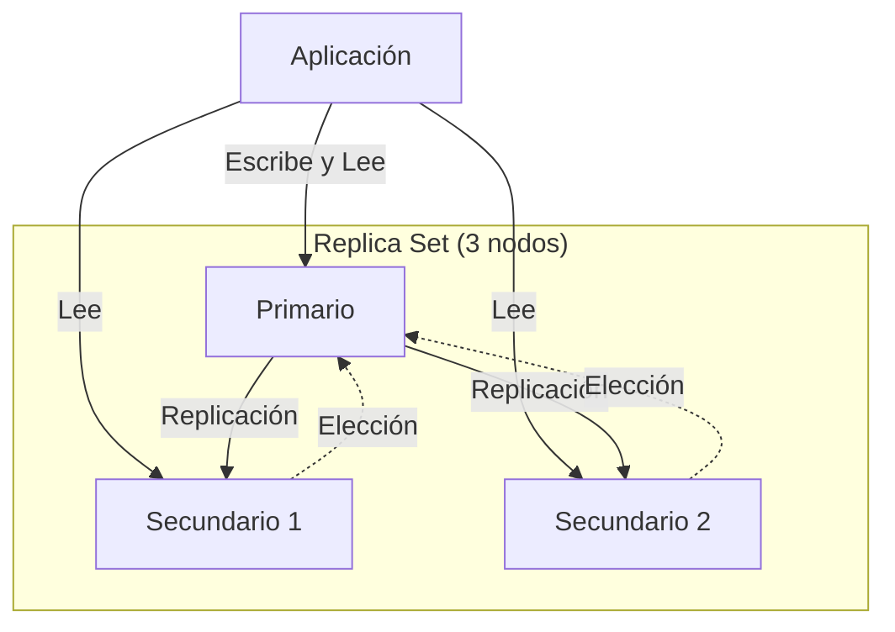
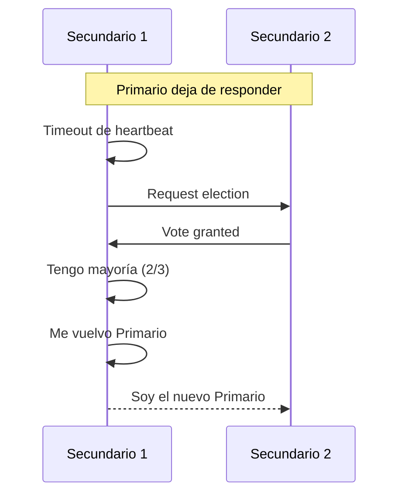

# Clase 7 — MongoDB: Replicación y Alta Disponibilidad

## 1. Replica Sets: Concepto

### Arquitectura



### Roles

| Rol | Descripción |
|-----|-------------|
| Primario | Recibe todas las escrituras. Solo hay uno a la vez. |
| Secundario | Replica datos del primario. Puede servir lecturas. |
| Arbiter | Vota en elecciones pero no almacena datos (no tiene datos). |

### Oplog

- Colección especial `local.oplog.rs`
- Registro de todas las operaciones de escritura
- Los secundarios leen y aplican el oplog

## 2. Configurar Replica Set en Localhost

### 2.1 Crear directorios de datos

```bash
# Linux/macOS
mkdir -p /tmp/rs0-0 /tmp/rs0-1 /tmp/rs0-2
mkdir -p /tmp/rs0-0/logs /tmp/rs0-1/logs /tmp/rs0-2/logs

# Windows (PowerShell)
mkdir C:\tmp\rs0-0, C:\tmp\rs0-1, C:\tmp\rs0-2
mkdir C:\tmp\rs0-0\logs, C:\tmp\rs0-1\logs, C:\tmp\rs0-2\logs
```

### 2.2 Iniciar los 3 nodos

```bash
# Nodo 0 (puerto 27017)
mongod --replSet rs0 --port 27017 --dbpath /tmp/rs0-0 --logpath /tmp/rs0-0/logs/mongod.log --fork

# Nodo 1 (puerto 27018)
mongod --replSet rs0 --port 27018 --dbpath /tmp/rs0-1 --logpath /tmp/rs0-1/logs/mongod.log --fork

# Nodo 2 (puerto 27019)
mongod --replSet rs0 --port 27019 --dbpath /tmp/rs0-2 --logpath /tmp/rs0-2/logs/mongod.log --fork
```

### 2.3 Inicializar Replica Set

```bash
mongosh --port 27017
```

```javascript
rs.initiate({
    _id: "rs0",
    members: [
        { _id: 0, host: "localhost:27017" },
        { _id: 1, host: "localhost:27018" },
        { _id: 2, host: "localhost:27019" }
    ]
})

// Ver estado
rs.status()

// Ver configuración
rs.conf()
```

### 2.4 Verificar réplica

```javascript
// En primario: insertar datos
rs0:PRIMARY> use test
rs0:PRIMARY> db.usuarios.insertOne({ nombre: "Carlos" })

// En secundario: permitir lectura
rs0:SECONDARY> db.getMongo().setReadPref("secondaryPreferred")
rs0:SECONDARY> use test
rs0:SECONDARY> db.usuarios.find()
// → { nombre: "Carlos" }
```

## 3. Elección de Primario

### Proceso de Elección



### Reglas de Elección

1. Necesita mayoría absoluta (>50% de los votos)
2. El nodo con el oplog más reciente tiene prioridad
3. Se puede configurar prioridad manual

```javascript
// Configurar prioridad
cfg = rs.conf()
cfg.members[0].priority = 2  // Nodo 0 tiene más prioridad
cfg.members[1].priority = 1
cfg.members[2].priority = 0  // Nunca será primario
rs.reconfig(cfg)
```

## 4. Read Replicas y Preferencias de Lectura

### Read Preference Modes

| Modo | Descripción |
|------|-------------|
| `primary` | Lee solo del primario (default) |
| `primaryPreferred` | Lee del primario, si no está disponible lee de secundario |
| `secondary` | Lee solo de secundarios |
| `secondaryPreferred` | Lee de secundarios, si no hay lee del primario |
| `nearest` | Lee del nodo con menor latencia |

```javascript
// Desde mongosh
db.getMongo().setReadPref("secondary")
db.usuarios.find()

// Desde driver Node.js
const client = new MongoClient(uri, {
    readPreference: "secondary"
});

// Por consulta
db.usuarios.find().readPref("secondary")
```

## 5. Write Concern y Read Concern

### Write Concern

```javascript
// w: 1 → confirmar del primario (default)
db.usuarios.insertOne(
    { nombre: "test" },
    { writeConcern: { w: 1 } }
)

// w: "majority" → confirmar de la mayoría
db.usuarios.insertOne(
    { nombre: "test" },
    { writeConcern: { w: "majority", wtimeout: 5000 } }
)

// w: 0 → fire and forget (no confirmar)
db.usuarios.insertOne(
    { nombre: "test" },
    { writeConcern: { w: 0 } }
)

// j: true → esperar journal (durabilidad)
db.usuarios.insertOne(
    { nombre: "test" },
    { writeConcern: { w: "majority", j: true } }
)
```

### Read Concern

```javascript
// local → leer del nodo local (puede ser dato no replicado)
db.usuarios.find().readConcern("local")

// majority → solo datos confirmados por mayoría
db.usuarios.find().readConcern("majority")

// linearizable → consistente con escritura "majority"
db.usuarios.find().readConcern("linearizable")
```

## 6. Simulación de Fallo

### 6.1 Matar el primario

```bash
# Identificar primario
rs.status().members.forEach(m => print(m.name, m.stateStr))

# Matar proceso del primario
kill <pid_del_primario>

# En otro nodo, verificar nueva elección
mongosh --port 27018
rs.status()
// → El secundario ahora es PRIMARY
```

### 6.2 Reincorporar nodo

```bash
# Reiniciar el nodo caído
mongod --replSet rs0 --port 27017 --dbpath /tmp/rs0-0 --logpath /tmp/rs0-0/logs/mongod.log --fork

# Ver estado
rs.status()
// → El nodo vuelve como SECONDARY y sincroniza oplog pendiente
```

## 7. Replica Set con Docker

```yaml
# docker-compose.yml
version: '3.8'
services:
  mongo1:
    image: mongo:7.0
    command: mongod --replSet rs0 --port 27017
    ports:
      - "27017:27017"
    volumes:
      - mongo1-data:/data/db

  mongo2:
    image: mongo:7.0
    command: mongod --replSet rs0 --port 27017
    ports:
      - "27018:27017"
    volumes:
      - mongo2-data:/data/db

  mongo3:
    image: mongo:7.0
    command: mongod --replSet rs0 --port 27017
    ports:
      - "27019:27017"
    volumes:
      - mongo3-data:/data/db

volumes:
  mongo1-data:
  mongo2-data:
  mongo3-data:
```

```bash
docker compose up -d

# Esperar que arranquen
sleep 10

# Inicializar
docker exec -it mongo1 mongosh --eval '
rs.initiate({
    _id: "rs0",
    members: [
        { _id: 0, host: "mongo1:27017" },
        { _id: 1, host: "mongo2:27017" },
        { _id: 2, host: "mongo3:27017" }
    ]
})
'
```

## 8. Ejercicio Práctico

1. Configurar Replica Set de 3 nodos
2. Insertar datos en el primario
3. Verificar replicación en secundarios
4. Cambiar read preference a `secondary` y hacer lecturas
5. Matar el primario y observar la elección
6. Medir tiempo de failover
7. Reincorporar el nodo caído
8. Verificar que el oplog se sincronizó
9. Configurar prioridades personalizadas
10. Probar diferentes write concern y medir latencia
