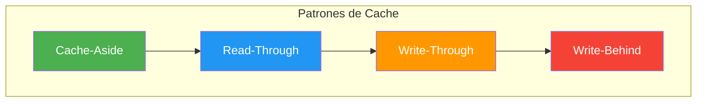
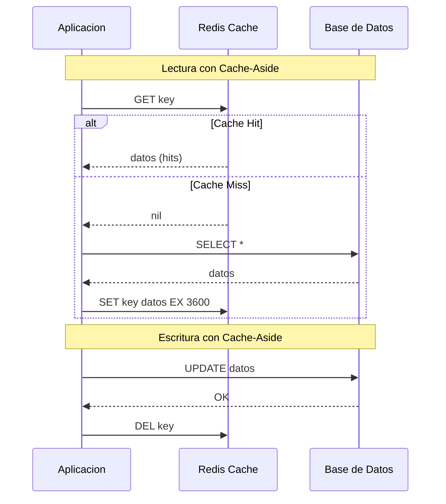
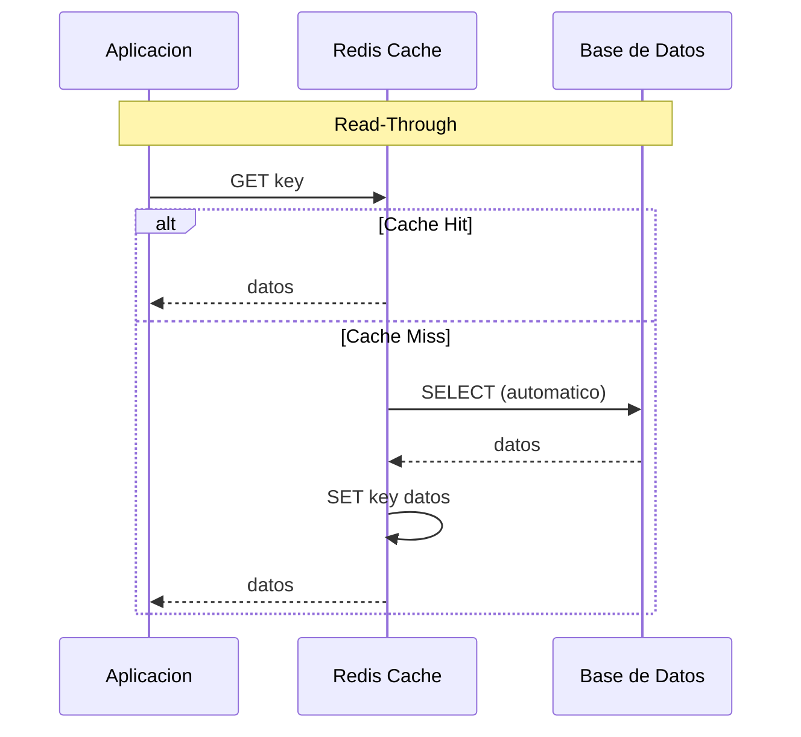
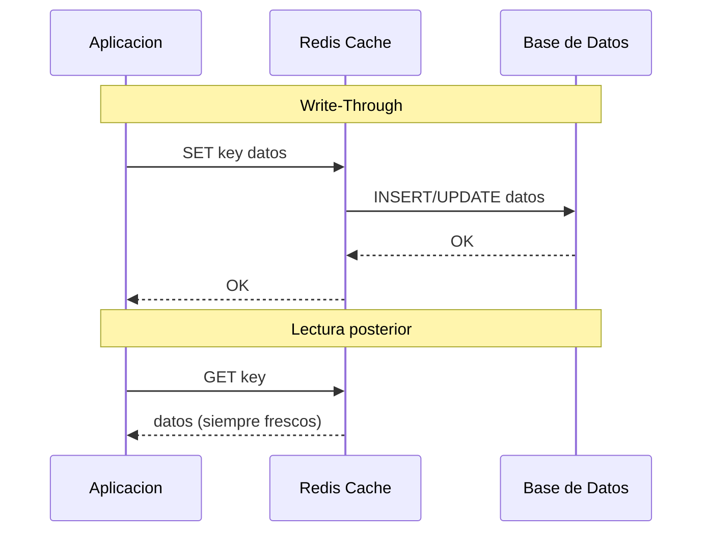
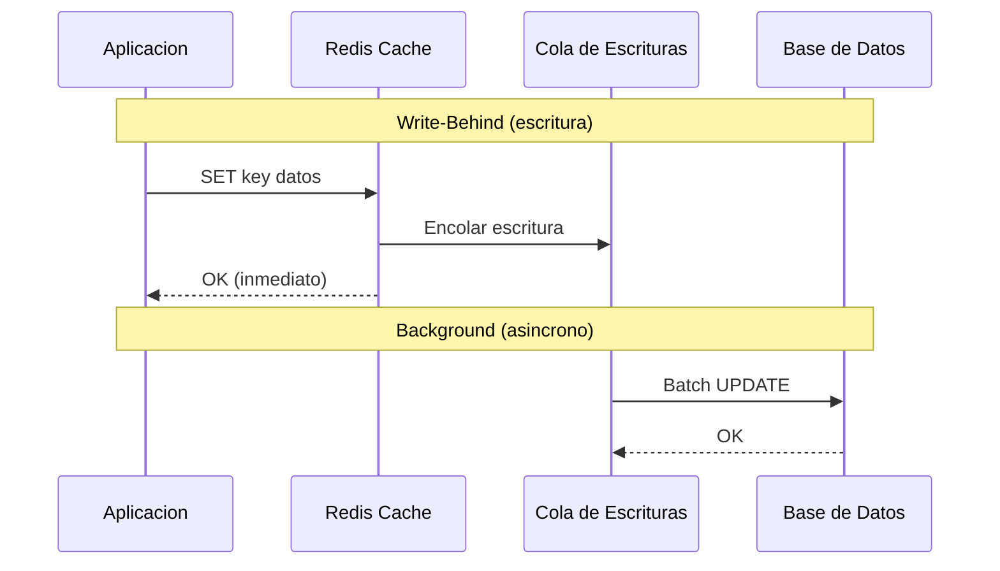
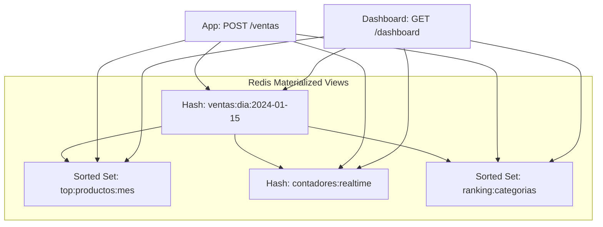
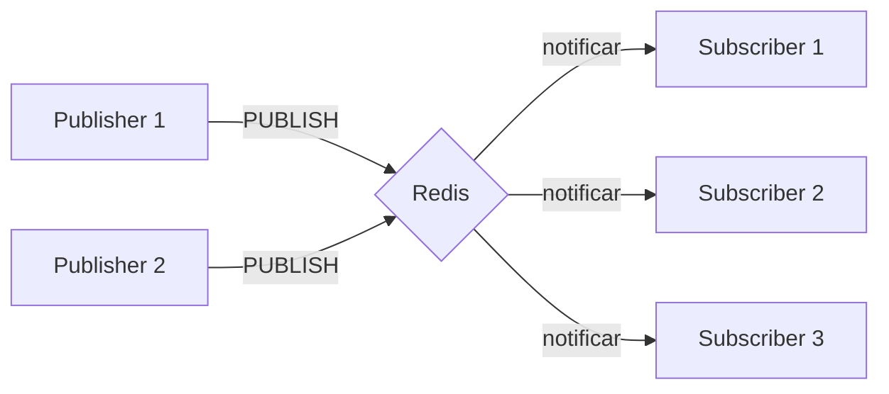
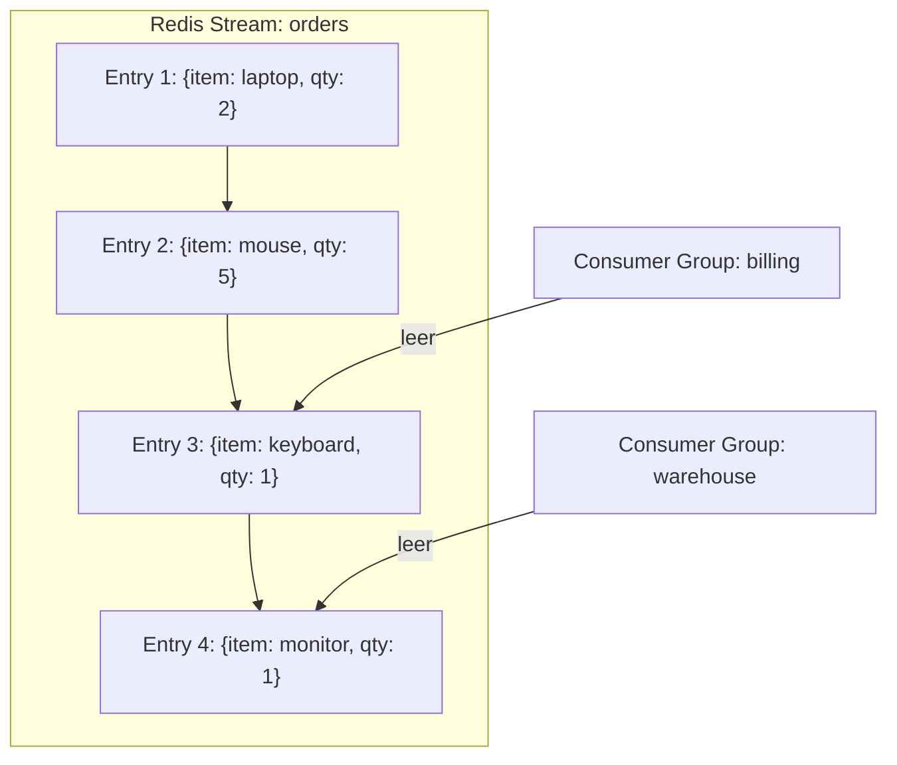

# Clase 07 — Redis II: Cache, Patrones y Pub/Sub

---

## Indice

1. Marco Teorico
2. Patrones de Cache
3. Eviccion y TTL
4. Materialized Views con Redis
5. Redis como Message Broker: Pub/Sub
6. Redis Streams
7. Casos de Uso Comunes
8. Ejercicio Practico

---

## 1. Marco Teorico

### 1.1 Que es la cache? Por que es necesaria

Una **cache** es un almacen de datos de alta velocidad que almacena copias de datos frecuentemente accedidos para servir futuras peticiones mas rapido que acceder al almacenamiento primario (base de datos, disco, red).

**Problema que resuelve:**
- Las bases de datos son lentas en comparacion con la memoria RAM
- Cada peticion a la BD implica: serializacion -> red -> disk I/O -> deserializacion -> procesamiento -> serializacion -> red -> deserializacion
- Con cache: serializacion -> memoria RAM -> deserializacion

**Analogia:** Imagina una biblioteca. La cache es como tener los libros mas prestados en una estanteria justo a la entrada, sin tener que ir hasta el deposito cada vez.

### 1.2 Latencia Comparada

| Accion | Latencia | Factor |
|--------|----------|--------|
| L1 Cache CPU | ~0.5 ns | 1x |
| L2 Cache CPU | ~7 ns | 14x |
| L3 Cache CPU | ~20 ns | 40x |
| **RAM (Redis)** | **~0.1 ms** | **200,000x** |
| SSD | ~0.1 ms | 200,000x |
| **Disco Duro (HDD)** | **~10 ms** | **2,000,000x** |
| **Red local (LAN)** | **~0.5 ms** | **1,000,000x** |
| **Red (WAN/Internet)** | **~50-200 ms** | **100,000,000x** |
| Base de datos (consulta) | ~1-100 ms | 2,000,000-200,000,000x |

**Redis en RAM** proporciona latencias de ~0.1ms, lo cual es **100x mas rapido** que un disco duro y **500-2000x mas rapido** que una consulta a una base de datos tradicional.

### 1.3 Patrones de Cache



### 1.4 Eviccion: LRU, LFU, TTL

- **LRU (Least Recently Used):** Elimina los datos menos recientemente usados
- **LFU (Least Frequently Used):** Elimina los datos menos frecuentemente accedidos
- **TTL (Time To Live):** Elimina datos despues de un tiempo especifico

### 1.5 Materialized Views con Redis

Una **Materialized View** en Redis es un conjunto de datos pre-computados y almacenados que se actualizan en tiempo real, permitiendo consultas O(1) sin necesidad de procesamiento adicional.

### 1.6 Pub/Sub y Message Brokers

Redis implementa un patron **Publish/Subscribe** donde:
- Los **publishers** envian mensajes a canales
- Los **subscribers** reciben mensajes de canales a los que han suscrito
- Redis actua como intermediario (broker)

---

## 2. Patrones de Cache

### 2.1 Cache-Aside (Lazy Loading)

El patron **Cache-Aside** es el mas comun. La aplicacion es responsable de leer y escribir en la cache y la base de datos.



**Flujo de lectura:**
1. La aplicacion intenta leer de Redis
2. Si los datos estan en cache (hit), los retorna directamente
3. Si no estan (miss), consulta la base de datos
4. Almacena el resultado en Redis con un TTL
5. Retorna los datos a la aplicacion

**Flujo de escritura:**
1. La aplicacion escribe en la base de datos
2. Elimina la clave de Redis (invalidacion)
3. La proxima lectura cargara los datos actualizados

#### Codigo en Python

```python
import redis
import json
import time
from functools import wraps

# Conexion a Redis
r = redis.Redis(host='localhost', port=6379, db=0, decode_responses=True)

# ============================================
# Implementacion Cache-Aside completa
# ============================================

class CacheAside:
    def __init__(self, redis_client, default_ttl=3600):
        self.redis = redis_client
        self.default_ttl = default_ttl
        self.stats = {'hits': 0, 'misses': 0}

    def get(self, key, fetch_fn=None, ttl=None):
        cached = self.redis.get(key)

        if cached is not None:
            self.stats['hits'] += 1
            return json.loads(cached)

        self.stats['misses'] += 1

        if fetch_fn is None:
            return None

        data = fetch_fn()

        if data is not None:
            self.redis.setex(key, ttl or self.default_ttl, json.dumps(data))

        return data

    def invalidate(self, key):
        return self.redis.delete(key)

    def invalidate_pattern(self, pattern):
        keys = self.redis.keys(pattern)
        if keys:
            return self.redis.delete(*keys)
        return 0

    def get_stats(self):
        total = self.stats['hits'] + self.stats['misses']
        hit_rate = (self.stats['hits'] / total * 100) if total > 0 else 0
        return {
            'hits': self.stats['hits'],
            'misses': self.stats['misses'],
            'total': total,
            'hit_rate': f"{hit_rate:.2f}%"
        }


# Simulacion de base de datos
PRODUCT_DB = {
    'prod:1': {'id': 1, 'name': 'Laptop', 'price': 999.99, 'stock': 50},
    'prod:2': {'id': 2, 'name': 'Mouse', 'price': 29.99, 'stock': 200},
    'prod:3': {'id': 3, 'name': 'Teclado', 'price': 79.99, 'stock': 150},
}

def fetch_product_from_db(product_id):
    time.sleep(0.05)
    return PRODUCT_DB.get(f'prod:{product_id}')

def update_product_in_db(product_id, updates):
    time.sleep(0.05)
    key = f'prod:{product_id}'
    if key in PRODUCT_DB:
        PRODUCT_DB[key].update(updates)
        return True
    return False


cache = CacheAside(r, default_ttl=300)

# Primera lectura (Cache Miss)
product = cache.get('product:1',
    fetch_fn=lambda: fetch_product_from_db(1), ttl=300)
print(f"Producto: {product}")
print(f"Stats: {cache.get_stats()}")
# Salida:
# Producto: {'id': 1, 'name': 'Laptop', 'price': 999.99, 'stock': 50}
# Stats: {'hits': 0, 'misses': 1, 'total': 1, 'hit_rate': '0.00%'}

# Segunda lectura (Cache Hit)
product = cache.get('product:1',
    fetch_fn=lambda: fetch_product_from_db(1), ttl=300)
print(f"Stats: {cache.get_stats()}")
# Salida:
# Stats: {'hits': 1, 'misses': 1, 'total': 2, 'hit_rate': '50.00%'}

# Escritura con invalidacion
update_product_in_db(1, {'price': 899.99, 'stock': 45})
cache.invalidate('product:1')
product = cache.get('product:1',
    fetch_fn=lambda: fetch_product_from_db(1), ttl=300)
print(f"Producto actualizado: {product}")
# Salida:
# Producto actualizado: {'id': 1, 'name': 'Laptop', 'price': 899.99, 'stock': 45}
```

#### Codigo en Node.js

```javascript
const redis = require('redis');

class CacheAside {
    constructor(client, defaultTTL = 3600) {
        this.client = client;
        this.defaultTTL = defaultTTL;
        this.stats = { hits: 0, misses: 0 };
    }

    async get(key, fetchFn = null, ttl = null) {
        const cached = await this.client.get(key);
        if (cached !== null) {
            this.stats.hits++;
            return JSON.parse(cached);
        }
        this.stats.misses++;
        if (fetchFn === null) return null;
        const data = await fetchFn();
        if (data !== null) {
            await this.client.setEx(key, ttl || this.defaultTTL, JSON.stringify(data));
        }
        return data;
    }

    async invalidate(key) {
        return await this.client.del(key);
    }

    getStats() {
        const total = this.stats.hits + this.stats.misses;
        const hitRate = total > 0
            ? (this.stats.hits / total * 100).toFixed(2) : 0;
        return { hits: this.stats.hits, misses: this.stats.misses,
                 total, hitRate: `${hitRate}%` };
    }
}

async function main() {
    const client = redis.createClient();
    await client.connect();
    const cache = new CacheAside(client, 300);
    const product = await cache.get('product:1',
        async () => ({ id: 1, name: 'Laptop', price: 999.99 }), 300);
    console.log('Producto:', product);
    console.log('Stats:', cache.getStats());
}
main();
```

#### Ventajas y Desventajas

| Aspecto | Ventaja | Desventaja |
|---------|---------|------------|
| **Simplicidad** | Facil de implementar | Mas codigo que otros patrones |
| **Consistencia** | Control total sobre invalidacion | Riesgo de datos obsoletos si se olvida invalidar |
| **Performance** | Reduce carga en DB significativamente | Primer request siempre es lento (cold start) |
| **Memoria** | Solo cachea lo necesario | Puede haber datos redundantes |

**Cuando usar:** La mayoria de las aplicaciones. Es el patron por defecto recomendado.

### 2.2 Read-Through

En **Read-Through**, la cache se encarga de cargar los datos automaticamente de la DB cuando hay un miss.



#### Codigo en Python

```python
import redis
import json
import time

r = redis.Redis(host='localhost', port=6379, db=0, decode_responses=True)

class ReadThroughCache:
    def __init__(self, redis_client, default_ttl=3600):
        self.redis = redis_client
        self.default_ttl = default_ttl
        self.loaders = {}

    def register_loader(self, prefix, loader_fn):
        self.loaders[prefix] = loader_fn

    def _get_loader(self, key):
        for prefix, loader in self.loaders.items():
            if key.startswith(prefix):
                return prefix, loader
        return None, None

    def get(self, key):
        cached = self.redis.get(key)
        if cached is not None:
            return json.loads(cached)
        prefix, loader = self._get_loader(key)
        if loader is None:
            return None
        item_id = key[len(prefix):]
        data = loader(item_id)
        if data is not None:
            self.redis.setex(key, self.default_ttl, json.dumps(data))
        return data


def load_product(product_id):
    time.sleep(0.05)
    products = {
        '1': {'id': 1, 'name': 'Laptop', 'price': 999.99},
        '2': {'id': 2, 'name': 'Mouse', 'price': 29.99},
    }
    return products.get(str(product_id))

def load_user(user_id):
    time.sleep(0.05)
    users = {
        '100': {'id': 100, 'name': 'Juan', 'email': 'juan@email.com'},
        '101': {'id': 101, 'name': 'Maria', 'email': 'maria@email.com'},
    }
    return users.get(str(user_id))


cache = ReadThroughCache(r, default_ttl=300)
cache.register_loader('product:', load_product)
cache.register_loader('user:', load_user)

# La cache carga automaticamente
product = cache.get('product:1')
print(f"Producto: {product}")
# Salida: Producto: {'id': 1, 'name': 'Laptop', 'price': 999.99}

user = cache.get('user:100')
print(f"Usuario: {user}")
# Salida: Usuario: {'id': 100, 'name': 'Juan', 'email': 'juan@email.com'}

# Segunda lectura (cache hit, sin delay)
product2 = cache.get('product:1')
print(f"Producto (hit): {product2}")
```

### 2.3 Write-Through

En **Write-Through**, cada escritura se realiza tanto en la cache como en la DB simultaneamente.



#### Codigo en Python

```python
import redis
import json

r = redis.Redis(host='localhost', port=6379, db=0, decode_responses=True)

class WriteThroughCache:
    def __init__(self, redis_client, db_handler, default_ttl=3600):
        self.redis = redis_client
        self.db = db_handler
        self.default_ttl = default_ttl

    def set(self, key, data, ttl=None):
        try:
            db_success = self.db.save(key, data)
            if not db_success:
                return False
            self.redis.setex(key, ttl or self.default_ttl, json.dumps(data))
            return True
        except Exception as e:
            print(f"Error en Write-Through: {e}")
            self.redis.delete(key)
            return False

    def get(self, key):
        cached = self.redis.get(key)
        if cached is not None:
            return json.loads(cached)
        data = self.db.get(key)
        if data is not None:
            self.redis.setex(key, self.default_ttl, json.dumps(data))
        return data

    def delete(self, key):
        self.redis.delete(key)
        return self.db.delete(key)


class MockDatabase:
    def __init__(self):
        self.data = {}
    def save(self, key, data):
        self.data[key] = data
        return True
    def get(self, key):
        return self.data.get(key)
    def delete(self, key):
        if key in self.data:
            del self.data[key]
            return True
        return False


db = MockDatabase()
cache = WriteThroughCache(r, db, default_ttl=300)

success = cache.set('product:1', {
    'id': 1, 'name': 'Laptop', 'price': 999.99, 'stock': 50
})
print(f"Exito: {success}")
# Salida: Exito: True

product = cache.get('product:1')
print(f"Producto: {product}")
# Salida: Producto: {'id': 1, 'name': 'Laptop', 'price': 999.99, 'stock': 50}

print(f"DB tiene: {db.data}")
# Salida: DB tiene: {'product:1': {'id': 1, ...}}
```

**Ventajas:** Consistencia garantizada entre cache y DB.
**Desventajas:** Latencia de escritura doble (cache + DB).

### 2.4 Write-Behind (Write-Back)

En **Write-Behind**, solo se escribe en la cache. La actualizacion de la DB se realiza en background de forma asincrona.



#### Codigo en Python

```python
import redis
import json
import time
import threading
from queue import Queue

r = redis.Redis(host='localhost', port=6379, db=0, decode_responses=True)

class WriteBehindCache:
    def __init__(self, redis_client, db_handler, default_ttl=3600,
                 flush_interval=5, batch_size=100):
        self.redis = redis_client
        self.db = db_handler
        self.default_ttl = default_ttl
        self.flush_interval = flush_interval
        self.batch_size = batch_size
        self.write_queue = Queue()
        self.running = False
        self.worker_thread = None

    def start(self):
        self.running = True
        self.worker_thread = threading.Thread(target=self._flush_worker, daemon=True)
        self.worker_thread.start()
        print("Write-Behind worker iniciado")

    def stop(self):
        self.running = False
        if self.worker_thread:
            self.worker_thread.join(timeout=10)
        self._flush_pending()
        print("Write-Behind worker detenido")

    def _flush_worker(self):
        while self.running:
            try:
                self._flush_pending()
                time.sleep(self.flush_interval)
            except Exception as e:
                print(f"Error en flush worker: {e}")

    def _flush_pending(self):
        batch = []
        while not self.write_queue.empty() and len(batch) < self.batch_size:
            try:
                item = self.write_queue.get_nowait()
                batch.append(item)
            except:
                break
        if batch:
            print(f"Flush: escribiendo {len(batch)} items a la DB")
            for item in batch:
                self.db.save(item['key'], item['data'])

    def set(self, key, data, ttl=None):
        self.redis.setex(key, ttl or self.default_ttl, json.dumps(data))
        self.write_queue.put({'key': key, 'data': data, 'timestamp': time.time()})
        return True

    def get(self, key):
        cached = self.redis.get(key)
        if cached is not None:
            return json.loads(cached)
        data = self.db.get(key)
        if data is not None:
            self.redis.setex(key, self.default_ttl, json.dumps(data))
        return data

    def pending_count(self):
        return self.write_queue.qsize()


class MockDatabase:
    def __init__(self):
        self.data = {}
    def save(self, key, data):
        self.data[key] = data
        return True
    def get(self, key):
        return self.data.get(key)


db = MockDatabase()
cache = WriteBehindCache(r, db, default_ttl=300, flush_interval=2, batch_size=50)
cache.start()

start = time.time()
for i in range(5):
    cache.set(f'item:{i}', {'id': i, 'value': f'data_{i}'})
elapsed = time.time() - start
print(f"5 escrituras completadas en {elapsed:.4f}s")
print(f"Pendientes en cola: {cache.pending_count()}")

time.sleep(3)
print(f"DB tiene {len(db.data)} items")
cache.stop()

# Salida:
# Write-Behind worker iniciado
# 5 escrituras completadas en 0.0012s
# Pendientes en cola: 5
# Flush: escribiendo 5 items a la DB
# DB tiene 5 items
# Write-Behind worker detenido
```

**Ventajas:** Escrituras extremadamente rapidas. Ideal para alta write-throughput.
**Desventajas:** Riesgo de perdida de datos si Redis falla antes del flush.

---

## 3. Eviccion y TTL

### 3.1 Politicas de Eviccion (maxmemory-policy)

Redis permite configurar que hacer cuando se alcanza el limite de memoria (`maxmemory`).

| Politica | Descripcion | Claves con TTL | Sin TTL |
|----------|-------------|----------------|---------|
| `allkeys-lru` | Elimina la menos recientemente usada | Si | Si |
| `volatile-lru` | LRU solo en claves con TTL | Si | No |
| `allkeys-lfu` | Elimina la menos frecuentemente usada | Si | Si |
| `volatile-lfu` | LFU solo en claves con TTL | Si | No |
| `allkeys-random` | Elimina aleatoriamente | Si | Si |
| `volatile-random` | Elimina aleatoriamente (con TTL) | Si | No |
| `volatile-ttl` | Elimina las que expiran antes | Si | No |
| `noeviction` | Error al alcanzar limite | - | - |

#### Configurar en redis.conf

```conf
# Limite de memoria: 256MB
maxmemory 256mb

# Politica de eviccion: LRU en todas las claves
maxmemory-policy allkeys-lru

# Cuantas claves evaluar para LRU
maxmemory-samples 5
```

#### Cambiar en tiempo real

```bash
redis-cli CONFIG SET maxmemory 512mb
redis-cli CONFIG SET maxmemory-policy allkeys-lfu
```

### 3.2 TTL en Practica

```bash
# SET con TTL (segundos)
SET session:abc123 '{"user": "juan"}' EX 3600

# SET con TTL (milisegundos)
SET session:def456 '{"user": "maria"}' PX 3600000

# Establecer TTL a una clave existente
EXPIRE session:abc123 7200
PEXPIRE session:abc123 7200000

# Establecer expiracion en timestamp Unix
EXPIREAT session:abc123 1735689600

# Consultar TTL restante
TTL session:abc123
PTTL session:abc123

# Quitar TTL (hacer la clave persistente)
PERSIST session:abc123

# TTL en estructuras de datos
HSET user:1 name "Juan" age 30
EXPIRE user:1 3600

LPUSH queue:tasks "task1" "task2"
EXPIRE queue:tasks 86400

SADD tags:post:1 "python" "redis"
EXPIRE tags:post:1 604800

ZADD leaderboard 100 "player:1" 200 "player:2"
EXPIRE leaderboard 2592000
```

### 3.3 Tabla de Decision: Que Politica Usar

```
Necesitas persistir TODOS los datos?
  SI --> noeviction (o usa Persistence: RDB/AOF)
  NO --> Algunas claves son mas importantes?
    SI --> volatile-lru (las importantes sin TTL, las temporales con TTL)
    NO --> Cual es el patron de acceso?
      Reciente --> allkeys-lru
      Frecuente --> allkeys-lfu
      No hay patron --> allkeys-random
```

---

## 4. Materialized Views con Redis

### 4.1 Concepto

Una **Materialized View** en Redis es un conjunto de datos pre-computados que se mantienen actualizados en tiempo real. A diferencia de una vista SQL (que se calcula on-demand), una materialized view esta fisicamente almacenada y se actualiza con cada escritura.

**Ventajas:**
- Lecturas O(1) sin procesamiento adicional
- Actualizacion en tiempo real
- Reduccion drastica de carga en la DB

### 4.2 Ejemplo Completo: Dashboard de Ventas



#### Codigo Python Completo

```python
import redis
import json
from datetime import datetime

r = redis.Redis(host='localhost', port=6379, db=0, decode_responses=True)

class VentasDashboard:
    def __init__(self, redis_client):
        self.redis = redis_client

    def registrar_venta(self, venta):
        now = datetime.fromisoformat(venta.get('timestamp', datetime.now().isoformat()))
        fecha = now.strftime('%Y-%m-%d')
        hora = now.strftime('%H')
        mes = now.strftime('%Y-%m')
        monto_total = venta['cantidad'] * venta['precio_unitario']
        venta_id = f"v:{now.timestamp()}"

        pipe = self.redis.pipeline()

        # VISTA 1: Ventas por dia (Hash)
        key_dia = f"ventas:dia:{fecha}"
        pipe.hincrby(key_dia, "total_ventas", 1)
        pipe.hincrbyfloat(key_dia, "monto_total", monto_total)
        pipe.hincrby(key_dia, f"cantidad:{venta['producto_id']}", venta['cantidad'])
        pipe.expire(key_dia, 86400 * 90)

        # VISTA 2: Top productos del mes (Sorted Set)
        key_top = f"top:productos:{mes}"
        pipe.zincrby(key_top, venta['cantidad'], venta['producto_id'])
        pipe.expire(key_top, 86400 * 365)

        # VISTA 3: Contadores en tiempo real (INCR)
        pipe.incr("contadores:realtime:total_ventas")
        pipe.incrbyfloat("contadores:realtime:monto_total", monto_total)
        pipe.hincrby("contadores:realtime:por_hora", hora, 1)
        pipe.expire("contadores:realtime", 86400)

        # VISTA 4: Estadisticas por categoria
        key_cat = f"stats:categoria:{mes}"
        pipe.hincrbyfloat(key_cat, f"{venta['categoria']}:monto", monto_total)
        pipe.hincrby(key_cat, f"{venta['categoria']}:cantidad", venta['cantidad'])
        pipe.zincrby(f"ranking:categorias:{mes}", monto_total, venta['categoria'])
        pipe.expire(key_cat, 86400 * 365)
        pipe.expire(f"ranking:categorias:{mes}", 86400 * 365)

        pipe.execute()
        return venta_id

    def ventas_del_dia(self, fecha=None):
        if fecha is None:
            fecha = datetime.now().strftime('%Y-%m-%d')
        key = f"ventas:dia:{fecha}"
        data = self.redis.hgetall(key)
        return {
            'fecha': fecha,
            'total_ventas': int(data.get('total_ventas', 0)),
            'monto_total': float(data.get('monto_total', 0)),
        }

    def top_productos_mes(self, mes=None, top_n=10):
        if mes is None:
            mes = datetime.now().strftime('%Y-%m')
        key = f"top:productos:{mes}"
        productos = self.redis.zrevrange(key, 0, top_n - 1, withscores=True)
        return [{'producto_id': pid, 'cantidad': int(score)} for pid, score in productos]

    def stats_realtime(self):
        pipe = self.redis.pipeline()
        pipe.get("contadores:realtime:total_ventas")
        pipe.get("contadores:realtime:monto_total")
        pipe.hgetall("contadores:realtime:por_hora")
        results = pipe.execute()
        return {
            'total_ventas': int(results[0] or 0),
            'monto_total': float(results[1] or 0),
            'ventas_por_hora': results[2]
        }

    def ranking_categorias(self, mes=None, top_n=5):
        if mes is None:
            mes = datetime.now().strftime('%Y-%m')
        key = f"ranking:categorias:{mes}"
        cats = self.redis.zrevrange(key, 0, top_n - 1, withscores=True)
        return [{'categoria': cat, 'monto': score} for cat, score in cats]


dashboard = VentasDashboard(r)

# Limpiar datos previos
for key in r.keys("ventas:*") + r.keys("top:*") + r.keys("contadores:*") + r.keys("stats:*") + r.keys("ranking:*"):
    r.delete(key)

ventas = [
    {'producto_id': 'P001', 'producto_nombre': 'Laptop', 'categoria': 'Electronica',
     'cantidad': 2, 'precio_unitario': 999.99, 'timestamp': '2024-01-15T10:30:00'},
    {'producto_id': 'P002', 'producto_nombre': 'Mouse', 'categoria': 'Accesorios',
     'cantidad': 10, 'precio_unitario': 29.99, 'timestamp': '2024-01-15T11:15:00'},
    {'producto_id': 'P001', 'producto_nombre': 'Laptop', 'categoria': 'Electronica',
     'cantidad': 1, 'precio_unitario': 999.99, 'timestamp': '2024-01-15T14:00:00'},
    {'producto_id': 'P003', 'producto_nombre': 'Teclado', 'categoria': 'Accesorios',
     'cantidad': 5, 'precio_unitario': 79.99, 'timestamp': '2024-01-15T16:45:00'},
    {'producto_id': 'P004', 'producto_nombre': 'Monitor 4K', 'categoria': 'Electronica',
     'cantidad': 3, 'precio_unitario': 449.99, 'timestamp': '2024-01-15T18:00:00'},
]

for venta in ventas:
    vid = dashboard.registrar_venta(venta)
    print(f"Venta: {vid}")

# Consultas
ventas_dia = dashboard.ventas_del_dia('2024-01-15')
print(f"Ventas del dia: {ventas_dia['total_ventas']}, Monto: ${ventas_dia['monto_total']:.2f}")

top = dashboard.top_productos_mes('2024-01')
for i, p in enumerate(top, 1):
    print(f"  Top {i}: {p['producto_id']} ({p['cantidad']} uds)")

rt = dashboard.stats_realtime()
print(f"Realtime: {rt['total_ventas']} ventas, ${rt['monto_total']:.2f}")

ranking = dashboard.ranking_categorias('2024-01')
for i, c in enumerate(ranking, 1):
    print(f"  Cat {i}: {c['categoria']} (${c['monto']:.2f})")
```

---

## 5. Redis como Message Broker: Pub/Sub

### 5.1 Modelo Pub/Sub

Redis implementa un sistema de mensajeria **Publish/Subscribe** donde los mensajes se envian a **canales** y los suscriptores reciben todos los mensajes de los canales a los que estan suscritos.



### 5.2 Comandos Basicos

```bash
# Suscribirse a canales
SUBSCRIBE canal1 canal2

# Publicar mensaje
PUBLISH canal1 "Hola mundo"
# (integer) 1

# Suscripcion por patron
PSUBSCRIBE "notificaciones:*"

# Desuscribirse
UNSUBSCRIBE canal1
PUNSUBSCRIBE "notificaciones:*"
```

### 5.3 Limitaciones de Pub/Sub

- **No persiste mensajes:** Si un subscriber no esta conectado, lo pierde
- **Fire-and-forget:** No hay confirmacion de entrega
- **Sin historial:** No se puede retroceder en el tiempo
- **Un mensaje por subscriber:** Cada subscriber recibe exactamente una copia

### 5.4 Codigo Python con Threading

```python
import redis
import threading
import time
import json

r = redis.Redis(host='localhost', port=6379, db=0, decode_responses=True)

class RedisPubSubBroker:
    def __init__(self, redis_client):
        self.redis = redis_client
        self.pubsub = self.redis.pubsub()
        self.running = False
        self.handlers = {}

    def subscribe(self, channel, handler):
        self.handlers[channel] = handler
        self.pubsub.subscribe(**{channel: handler})

    def subscribe_pattern(self, pattern, handler):
        self.handlers[pattern] = handler
        self.pubsub.psubscribe(**{pattern: handler})

    def publish(self, channel, message):
        if isinstance(message, dict):
            message = json.dumps(message)
        subscribers = self.redis.publish(channel, message)
        print(f"  Mensaje enviado a '{channel}': {subscribers} subscriber(s)")
        return subscribers

    def start_listening(self):
        self.running = True
        self.thread = threading.Thread(target=self._listen, daemon=True)
        self.thread.start()
        print("  Broker Pub/Sub iniciado")

    def stop_listening(self):
        self.running = False
        self.pubsub.unsubscribe()
        self.pubsub.punsubscribe()
        print("  Broker Pub/Sub detenido")

    def _listen(self):
        while self.running:
            message = self.pubsub.get_message(timeout=0.1)
            time.sleep(0.01)


broker = RedisPubSubBroker(r)
mensajes = []

def handler_notificaciones(message):
    data = message['data']
    if isinstance(data, str):
        mensajes.append({'canal': message['channel'], 'datos': data})
        print(f"    [NOTIFICACION] {data}")

def handler_eventos(message):
    data = message['data']
    if isinstance(data, str):
        mensajes.append({'canal': message['channel'], 'datos': data})
        print(f"    [EVENTO] {message['channel']}: {data}")

broker.subscribe('notificaciones', handler_notificaciones)
broker.subscribe_pattern('eventos:*', handler_eventos)
broker.start_listening()
time.sleep(0.5)

broker.publish('notificaciones', 'Nuevo pedido #1234 recibido')
time.sleep(0.1)
broker.publish('eventos:login', json.dumps({'user': 'juan', 'ip': '192.168.1.1'}))
time.sleep(0.1)
broker.publish('eventos:compra', json.dumps({'user': 'maria', 'total': 99.99}))
time.sleep(0.1)
broker.publish('notificaciones', 'Pedido #1234 enviado')
time.sleep(0.5)

print(f"Mensajes recibidos: {len(mensajes)}")
for msg in mensajes:
    print(f"  Canal: {msg['canal']}, Datos: {msg['datos']}")

broker.stop_listening()

# Salida:
#   Broker Pub/Sub iniciado
#     [NOTIFICACION] Nuevo pedido #1234 recibido
#   Mensaje enviado a 'notificaciones': 1 subscriber(s)
#     [EVENTO] eventos:login: {"user": "juan", "ip": "192.168.1.1"}
#   Mensaje enviado a 'eventos:login': 1 subscriber(s)
#     [EVENTO] eventos:compra: {"user": "maria", "total": 99.99}
#   Mensaje enviado a 'eventos:compra': 1 subscriber(s)
#     [NOTIFICACION] Pedido #1234 enviado
#   Mensaje enviado a 'notificaciones': 1 subscriber(s)
# Mensajes recibidos: 4
#   Canal: notificaciones, Datos: Nuevo pedido #1234 recibido
#   Canal: eventos:login, Datos: {"user": "juan", ...}
#   Canal: eventos:compra, Datos: {"user": "maria", ...}
#   Canal: notificaciones, Datos: Pedido #1234 enviado
# Broker Pub/Sub detenido
```

---

## 6. Redis Streams (Mejor Alternativa a Pub/Sub)

### 6.1 Concepto

Redis Streams es un **log de eventos persistente** que combina lo mejor de Pub/Sub con persistencia y procesamiento por lotes. A diferencia de Pub/Sub, los mensajes **no se pierden** y pueden ser procesados multiples veces.



### 6.2 Comandos Basicos

```bash
# XADD: Agregar entradas al stream
XADD orders * item laptop qty 2 price 999.99

# Limitar tamano del stream (MAXLEN)
XADD orders MAXLEN ~ 1000 * item keyboard qty 1 price 79.99

# XRANGE: Leer entradas del stream
XRANGE orders - +
XRANGE orders - + COUNT 10

# XREAD: Leer nuevas entradas (bloqueante)
XREAD COUNT 5 STREAMS orders 0
XREAD COUNT 5 BLOCK 2000 STREAMS orders $

# Consumer Groups
XGROUP CREATE orders warehouse 0
XGROUP CREATE orders billing 0 MKSTREAM

# Leer como consumer
XREADGROUP GROUP warehouse worker1 COUNT 3 BLOCK 2000 STREAMS orders >

# Confirmar procesamiento
XACK orders warehouse 1705312200000-0

# Ver mensajes pendientes
XPENDING orders warehouse

# Reclamar mensajes abandonados
XCLAIM orders warehouse worker2 3600000 1705312200000-0
```

### 6.3 Codigo Python Completo

```python
import redis
import json
import time

r = redis.Redis(host='localhost', port=6379, db=0, decode_responses=True)

class StreamManager:
    def __init__(self, redis_client):
        self.redis = redis_client

    def create_stream(self, stream_name, group_name, start_id='0'):
        try:
            self.redis.xgroup_create(stream_name, group_name, start_id)
            print(f"  Consumer group '{group_name}' creada")
        except redis.exceptions.ResponseError as e:
            if 'BUSYGROUP' in str(e):
                print(f"  Consumer group '{group_name}' ya existe")
            else:
                raise

    def add_event(self, stream_name, event_data, max_len=None):
        kwargs = {}
        if max_len:
            kwargs['MAXLEN'] = max_len
        return self.redis.xadd(stream_name, event_data, **kwargs)

    def read_group(self, stream_name, group_name, consumer_name, count=10, block=None):
        kwargs = {'COUNT': count}
        if block is not None:
            kwargs['BLOCK'] = block
        return self.redis.xreadgroup(group_name, consumer_name, {stream_name: '>'}, **kwargs)

    def acknowledge(self, stream_name, group_name, *entry_ids):
        if entry_ids:
            return self.redis.xack(stream_name, group_name, *entry_ids)
        return 0

    def pending(self, stream_name, group_name):
        return self.redis.xpending(stream_name, group_name)

    def claim(self, stream_name, group_name, consumer_name, min_idle_ms, *entry_ids):
        return self.redis.xclaim(stream_name, group_name, consumer_name, min_idle_ms, *entry_ids)

    def get_history(self, stream_name, count=100):
        return self.redis.xrange(stream_name, '-', '+', count=count)


stream = StreamManager(r)
try:
    r.delete('orders')
except:
    pass

print("1. Configurando Stream y Consumer Groups...")
stream.create_stream('orders', 'warehouse')
stream.create_stream('orders', 'billing')

print("
2. Agregando pedidos...")
pedidos = [
    {'item': 'laptop', 'qty': '2', 'price': '999.99', 'customer': 'juan'},
    {'item': 'mouse', 'qty': '5', 'price': '29.99', 'customer': 'maria'},
    {'item': 'keyboard', 'qty': '1', 'price': '79.99', 'customer': 'pedro'},
    {'item': 'monitor', 'qty': '1', 'price': '449.99', 'customer': 'ana'},
    {'item': 'headphones', 'qty': '3', 'price': '149.99', 'customer': 'luis'},
]

for pedido in pedidos:
    entry_id = stream.add_event('orders', pedido)
    print(f"  Pedido: {entry_id} - {pedido['item']} x{pedido['qty']}")

print("
3. Warehouse procesando pedidos...")
messages_wh = stream.read_group('orders', 'warehouse', 'worker-1', count=3)
for msg in messages_wh:
    stream_name, entries = msg
    for entry_id, data in entries:
        print(f"  [Warehouse] {data['item']} x{data['qty']} -> {data['customer']}")
        stream.acknowledge('orders', 'warehouse', entry_id)

print("
4. Billing procesando pedidos...")
messages_bl = stream.read_group('orders', 'billing', 'worker-1', count=3)
for msg in messages_bl:
    stream_name, entries = msg
    for entry_id, data in entries:
        total = int(data['qty']) * float(data['price'])
        print(f"  [Billing] {data['item']} - Total: ${total:.2f}")
        stream.acknowledge('orders', 'billing', entry_id)

print("
5. Mensajes pendientes:")
pending_wh = stream.pending('orders', 'warehouse')
pending_bl = stream.pending('orders', 'billing')
print(f"  Warehouse: {pending_wh['pending']}")
print(f"  Billing: {pending_bl['pending']}")

print("
6. Historial del stream:")
history = stream.get_history('orders', count=10)
for entry_id, data in history:
    print(f"  {entry_id}: {data['item']} x{data['qty']} ({data['customer']})")
```

### 6.4 Comparacion Pub/Sub vs Streams

| Caracteristica | Pub/Sub | Streams |
|----------------|---------|---------|
| **Persistencia** | No (fire-and-forget) | Si (log persistente) |
| **Consumer Groups** | No | Si |
| **Replay** | No | Si (puedes releer) |
| **Backpressure** | No | Si (COUNT + BLOCK) |
| **Acknowledgment** | No | Si (XACK) |
| **Tamano maximo** | Sin limite | Configurable (MAXLEN) |
| **Uso ideal** | Notificaciones en tiempo real | Colas de trabajo, auditoria, event sourcing |
| **Latencia** | Ultra-baja | Muy baja |
| **Complejidad** | Baja | Media |

---

## 7. Casos de Uso Comunes

### 7.1 Session Store (Almacenar Sesiones de Usuario)

```python
import redis
import json
import uuid
import time

r = redis.Redis(host='localhost', port=6379, db=0, decode_responses=True)

class SessionStore:
    def __init__(self, redis_client, ttl=3600):
        self.redis = redis_client
        self.ttl = ttl

    def create_session(self, user_data):
        session_id = str(uuid.uuid4())
        key = f"session:{session_id}"
        session_data = {
            'user_id': user_data.get('user_id'),
            'username': user_data.get('username'),
            'email': user_data.get('email'),
            'role': user_data.get('role', 'user'),
            'created_at': time.time(),
            'last_activity': time.time(),
            'ip_address': user_data.get('ip_address', ''),
        }
        self.redis.setex(key, self.ttl, json.dumps(session_data))
        user_id = user_data.get('user_id')
        if user_id:
            self.redis.sadd(f"user:{user_id}:sessions", session_id)
            self.redis.expire(f"user:{user_id}:sessions", self.ttl)
        return session_id

    def get_session(self, session_id):
        key = f"session:{session_id}"
        data = self.redis.get(key)
        if data is None:
            return None
        session = json.loads(data)
        session['last_activity'] = time.time()
        self.redis.setex(key, self.ttl, json.dumps(session))
        return session

    def destroy_session(self, session_id):
        key = f"session:{session_id}"
        data = self.redis.get(key)
        if data:
            session = json.loads(data)
            user_id = session.get('user_id')
            if user_id:
                self.redis.srem(f"user:{user_id}:sessions", session_id)
        return self.redis.delete(key)

    def destroy_all_user_sessions(self, user_id):
        key = f"user:{user_id}:sessions"
        session_ids = self.redis.smembers(key)
        if session_ids:
            keys_to_delete = [f"session:{sid}" for sid in session_ids]
            self.redis.delete(*keys_to_delete)
            self.redis.delete(key)
        return len(session_ids)

    def get_active_sessions(self, user_id):
        key = f"user:{user_id}:sessions"
        session_ids = self.redis.smembers(key)
        sessions = []
        for sid in session_ids:
            session = self.get_session(sid)
            if session:
                sessions.append(session)
        return sessions


store = SessionStore(r, ttl=1800)

s1 = store.create_session({
    'user_id': 'u100', 'username': 'juan', 'email': 'juan@email.com',
    'role': 'admin', 'ip_address': '192.168.1.10'
})
print(f"Sesion 1: {s1}")

s2 = store.create_session({
    'user_id': 'u100', 'username': 'juan', 'email': 'juan@email.com',
    'role': 'admin', 'ip_address': '10.0.0.5'
})
print(f"Sesion 2: {s2}")

session = store.get_session(s1)
print(f"Usuario: {session['username']}, IP: {session['ip_address']}")

active = store.get_active_sessions('u100')
print(f"Sesiones activas: {len(active)}")

store.destroy_session(s1)
active = store.get_active_sessions('u100')
print(f"Despues de cerrar 1: {len(active)} sesiones")

store.destroy_all_user_sessions('u100')
print("Todas las sesiones eliminadas")
```

### 7.2 Rate Limiting (Limitar Peticiones por IP/Usuario)

#### Algoritmo 1: Fixed Window

```python
import redis
import time

r = redis.Redis(host='localhost', port=6379, db=0, decode_responses=True)

class FixedWindowRateLimiter:
    def __init__(self, redis_client, max_requests=100, window_seconds=60):
        self.redis = redis_client
        self.max_requests = max_requests
        self.window_seconds = window_seconds

    def is_allowed(self, identifier):
        now = int(time.time())
        window = now // self.window_seconds
        key = f"ratelimit:{identifier}:{window}"
        count = self.redis.incr(key)
        if count == 1:
            self.redis.expire(key, self.window_seconds)
        allowed = count <= self.max_requests
        remaining = max(0, self.max_requests - count)
        return {'allowed': allowed, 'count': count, 'remaining': remaining}


limiter = FixedWindowRateLimiter(r, max_requests=5, window_seconds=60)
print("Fixed Window (max 5/min):")
for i in range(7):
    result = limiter.is_allowed("192.168.1.1")
    status = "ALLOWED" if result['allowed'] else "BLOCKED"
    print(f"  Peticion {i+1}: {status} ({result['count']}/{5})")

# Salida:
# Fixed Window (max 5/min):
#   Peticion 1: ALLOWED (1/5)
#   Peticion 2: ALLOWED (2/5)
#   Peticion 3: ALLOWED (3/5)
#   Peticion 4: ALLOWED (4/5)
#   Peticion 5: ALLOWED (5/5)
#   Peticion 6: BLOCKED (6/5)
#   Peticion 7: BLOCKED (7/5)
```

#### Algoritmo 2: Sliding Window

```python
class SlidingWindowRateLimiter:
    def __init__(self, redis_client, max_requests=100, window_seconds=60):
        self.redis = redis_client
        self.max_requests = max_requests
        self.window_seconds = window_seconds

    def is_allowed(self, identifier):
        now = time.time()
        window_start = now - self.window_seconds
        key = f"sliding:{identifier}"
        pipe = self.redis.pipeline()
        pipe.zremrangebyscore(key, 0, window_start)
        pipe.zcard(key)
        pipe.zadd(key, {str(now): now})
        pipe.expire(key, self.window_seconds)
        results = pipe.execute()
        current_count = results[1]
        allowed = current_count < self.max_requests
        remaining = max(0, self.max_requests - current_count - 1)
        return {'allowed': allowed, 'count': current_count + 1, 'remaining': remaining}


limiter = SlidingWindowRateLimiter(r, max_requests=5, window_seconds=60)
print("
Sliding Window (max 5/min):")
for i in range(7):
    result = limiter.is_allowed("10.0.0.1")
    status = "ALLOWED" if result['allowed'] else "BLOCKED"
    print(f"  Peticion {i+1}: {status} ({result['count']}/{5})")
```

#### Algoritmo 3: Token Bucket

```python
class TokenBucketRateLimiter:
    def __init__(self, redis_client, capacity=10, refill_rate=1):
        self.redis = redis_client
        self.capacity = capacity
        self.refill_rate = refill_rate

    def is_allowed(self, identifier):
        now = time.time()
        key = f"tokenbucket:{identifier}"
        data = self.redis.hgetall(key)
        if not data:
            tokens = self.capacity - 1
            self.redis.hset(key, mapping={'tokens': tokens, 'last_refill': now})
            self.redis.expire(key, 3600)
            return {'allowed': True, 'tokens': tokens, 'capacity': self.capacity}
        tokens = float(data['tokens'])
        last_refill = float(data['last_refill'])
        elapsed = now - last_refill
        tokens = min(self.capacity, tokens + elapsed * self.refill_rate)
        if tokens >= 1:
            tokens -= 1
            self.redis.hset(key, mapping={'tokens': tokens, 'last_refill': now})
            return {'allowed': True, 'tokens': int(tokens), 'capacity': self.capacity}
        return {'allowed': False, 'tokens': 0, 'capacity': self.capacity}


limiter = TokenBucketRateLimiter(r, capacity=5, refill_rate=1)
print("
Token Bucket (capacity: 5, refill: 1/s):")
for i in range(7):
    result = limiter.is_allowed("api-key-123")
    status = "ALLOWED" if result['allowed'] else "BLOCKED"
    print(f"  Peticion {i+1}: {status} (tokens: {result['tokens']}/{result['capacity']})")

print("
Esperando 3 segundos...")
time.sleep(3)

for i in range(3):
    result = limiter.is_allowed("api-key-123")
    status = "ALLOWED" if result['allowed'] else "BLOCKED"
    print(f"  Post-espera {i+1}: {status} (tokens: {result['tokens']}/{result['capacity']})")
```

### 7.3 Leaderboards (Tabla de Posiciones)

```python
import redis

r = redis.Redis(host='localhost', port=6379, db=0, decode_responses=True)

class Leaderboard:
    def __init__(self, redis_client, name):
        self.redis = redis_client
        self.key = f"leaderboard:{name}"

    def add_player(self, player_id, score):
        self.redis.zadd(self.key, {player_id: score})

    def increment_score(self, player_id, amount=1):
        return self.redis.zincrby(self.key, amount, player_id)

    def get_rank(self, player_id):
        rank = self.redis.zrevrank(self.key, player_id)
        return rank if rank is not None else -1

    def get_score(self, player_id):
        score = self.redis.zscore(self.key, player_id)
        return score if score is not None else 0

    def get_top_n(self, n=10):
        return self.redis.zrevrange(self.key, 0, n - 1, withscores=True)

    def get_around_me(self, player_id, n=5):
        rank = self.get_rank(player_id)
        if rank == -1:
            return []
        start = max(0, rank - n // 2)
        end = rank + n // 2
        return self.redis.zrevrange(self.key, start, end, withscores=True)

    def total_players(self):
        return self.redis.zcard(self.key)


lb = Leaderboard(r, 'game_scores')
r.delete('leaderboard:game_scores')

jugadores = [
    ('ana', 2500), ('beto', 3100), ('carla', 1800),
    ('diego', 4200), ('elena', 2900), ('franco', 3500),
    ('gabi', 1200), ('hugo', 3800), ('iris', 2100), ('julia', 4000),
]

for nombre, score in jugadores:
    lb.add_player(nombre, score)

print(f"Total: {lb.total_players()} jugadores")

top5 = lb.get_top_n(5)
print("\nTOP 5:")
for i, (player, score) in enumerate(top5, 1):
    print(f"  #{i} {player}: {int(score)} pts")

rank = lb.get_rank('elena')
print(f"\nElena: posicion #{rank+1}, score {int(lb.get_score('elena'))}")

print("\nAlrededor de Elena:")
around = lb.get_around_me('elena', n=5)
for player, score in around:
    marker = " <-- TU" if player == 'elena' else ""
    print(f"  {player}: {int(score)} pts{marker}")

lb.increment_score('elena', 500)
print(f"\nElena +500: nueva posicion #{lb.get_rank('elena')+1}")
```

### 7.4 Distributed Lock (Bloqueo Distribuido)

```python
import redis
import time
import uuid
import threading

r = redis.Redis(host='localhost', port=6379, db=0, decode_responses=True)

class DistributedLock:
    def __init__(self, redis_client, lock_name, ttl=10):
        self.redis = redis_client
        self.lock_name = f"lock:{lock_name}"
        self.ttl = ttl
        self.lock_value = str(uuid.uuid4())

    def acquire(self, blocking=True, timeout=None):
        start_time = time.time()
        while True:
            acquired = self.redis.set(self.lock_name, self.lock_value, nx=True, ex=self.ttl)
            if acquired:
                return True
            if not blocking:
                return False
            if timeout and (time.time() - start_time) >= timeout:
                return False
            time.sleep(0.1)

    def release(self):
        lua_script = (
            "if redis.call('get', KEYS[1]) == ARGV[1] then "
            "return redis.call('del', KEYS[1]) "
            "else return 0 end"
        )
        return self.redis.eval(lua_script, 1, self.lock_name, self.lock_value)

    def extend(self, additional_time=None):
        ttl = additional_time or self.ttl
        lua_script = (
            "if redis.call('get', KEYS[1]) == ARGV[1] then "
            "return redis.call('expire', KEYS[1], ARGV[2]) "
            "else return 0 end"
        )
        return self.redis.eval(lua_script, 1, self.lock_name, self.lock_value, ttl)


def worker(worker_name, lock_name, work_time):
    lock = DistributedLock(r, lock_name, ttl=10)
    print(f"  [{worker_name}] Intentando lock...")
    if lock.acquire(blocking=True, timeout=5):
        print(f"  [{worker_name}] Lock adquirido! Trabajando...")
        time.sleep(work_time)
        lock.release()
        print(f"  [{worker_name}] Lock liberado")
    else:
        print(f"  [{worker_name}] Timeout")

print("Escenario 1: Dos workers compitiendo por el mismo lock")
t1 = threading.Thread(target=worker, args=('Worker-A', 'resource-x', 2))
t2 = threading.Thread(target=worker, args=('Worker-B', 'resource-x', 1))
t1.start()
time.sleep(0.1)
t2.start()
t1.join()
t2.join()

print("\nEscenario 2: Workers con locks diferentes (paralelo)")
t3 = threading.Thread(target=worker, args=('Worker-C', 'resource-y', 1))
t4 = threading.Thread(target=worker, args=('Worker-D', 'resource-z', 1))
t3.start()
t4.start()
t3.join()
t4.join()
```

### 7.5 Job Queue (Cola de Trabajos con List)

```python
import redis
import json
import time

r = redis.Redis(host='localhost', port=6379, db=0, decode_responses=True)

class JobQueue:
    def __init__(self, redis_client, queue_name):
        self.redis = redis_client
        self.queue_name = f"queue:{queue_name}"
        self.processing_key = f"queue:{queue_name}:processing"
        self.completed_key = f"queue:{queue_name}:completed"
        self.failed_key = f"queue:{queue_name}:failed"

    def enqueue(self, job_data):
        job = {
            'id': str(time.time()),
            'data': job_data,
            'status': 'pending',
            'created_at': time.time()
        }
        self.redis.rpush(self.queue_name, json.dumps(job))
        return job['id']

    def dequeue(self, timeout=0):
        result = self.redis.blpop(self.queue_name, timeout=timeout)
        if result:
            job = json.loads(result[1])
            job['status'] = 'processing'
            job['started_at'] = time.time()
            self.redis.hset(self.processing_key, job['id'], json.dumps(job))
            return job
        return None

    def complete(self, job_id, result=None):
        job_data = self.redis.hget(self.processing_key, job_id)
        if job_data:
            job = json.loads(job_data)
            job['status'] = 'completed'
            job['result'] = result
            job['completed_at'] = time.time()
            self.redis.hdel(self.processing_key, job_id)
            self.redis.hset(self.completed_key, job_id, json.dumps(job))

    def fail(self, job_id, error=None):
        job_data = self.redis.hget(self.processing_key, job_id)
        if job_data:
            job = json.loads(job_data)
            job['status'] = 'failed'
            job['error'] = str(error)
            job['failed_at'] = time.time()
            self.redis.hdel(self.processing_key, job_id)
            self.redis.hset(self.failed_key, job_id, json.dumps(job))

    def stats(self):
        return {
            'pending': self.redis.llen(self.queue_name),
            'processing': self.redis.hlen(self.processing_key),
            'completed': self.redis.hlen(self.completed_key),
            'failed': self.redis.hlen(self.failed_key),
        }


queue = JobQueue(r, 'email_notifications')
r.delete('queue:email_notifications', 'queue:email_notifications:processing',
         'queue:email_notifications:completed', 'queue:email_notifications:failed')

emails = [
    {'to': 'juan@email.com', 'subject': 'Bienvenido', 'template': 'welcome'},
    {'to': 'maria@email.com', 'subject': 'Tu pedido', 'template': 'order'},
    {'to': 'pedro@email.com', 'subject': 'Factura', 'template': 'invoice'},
    {'to': 'ana@email.com', 'subject': 'Newsletter', 'template': 'newsletter'},
]

for email in emails:
    job_id = queue.enqueue(email)
    print(f"  Encolado: {email['subject']} -> {email['to']}")

print(f"Stats: {queue.stats()}")

for i in range(4):
    job = queue.dequeue(timeout=1)
    if job:
        time.sleep(0.1)
        success = i != 2
        if success:
            queue.complete(job['id'], result={'message_id': f'msg_{i}'})
            print(f"  Completado: {job['data']['subject']}")
        else:
            queue.fail(job['id'], error='SMTP timeout')
            print(f"  Fallido: {job['data']['subject']}")

print(f"Stats finales: {queue.stats()}")
```

---

## 8. Ejercicio Practico

### Ejercicio 1: Cache para API REST

**Objetivo:** Implementar Cache-Aside para una API con FastAPI + Redis + MongoDB.

**Instrucciones:**
1. Crear una API REST con FastAPI
2. Conectar a MongoDB como base de datos
3. Implementar Cache-Aside para los endpoints de lectura
4. Medir tiempos de respuesta con y sin cache
5. Implementar invalidacion de cache en escrituras

```python
from fastapi import FastAPI, HTTPException
from pydantic import BaseModel
import redis
import json
import time

app = FastAPI()
r = redis.Redis(host='localhost', port=6379, db=0, decode_responses=True)

class Producto(BaseModel):
    nombre: str
    precio: float
    stock: int = 0

db_productos = {}

@app.get("/productos/{producto_id}")
async def get_producto(producto_id: str):
    cache_key = f"producto:{producto_id}"
    cached = r.get(cache_key)
    if cached:
        return json.loads(cached)
    time.sleep(0.05)
    producto = db_productos.get(producto_id)
    if not producto:
        raise HTTPException(status_code=404, detail="Producto no encontrado")
    r.setex(cache_key, 300, json.dumps(producto))
    return producto

@app.post("/productos/{producto_id}")
async def create_producto(producto_id: str, producto: Producto):
    db_productos[producto_id] = producto.dict()
    r.delete(f"producto:{producto_id}")
    return {"mensaje": "Producto creado", "producto": producto}
```

### Ejercicio 2: Rate Limiting Avanzado

**Objetivo:** Implementar un rate limiter con las 3 estrategias y comparar resultados.

**Instrucciones:**
1. Implementar Fixed Window, Sliding Window y Token Bucket
2. Simular 100 peticiones por segundo
3. Comparar cuantas peticiones permite cada algoritmo
4. Documentar las diferencias de comportamiento

### Ejercicio 3: Leaderboard Completo

**Objetivo:** Crear un leaderboard completo para un juego.

**Instrucciones:**
1. Crear tabla de posiciones con 1000 jugadores
2. Implementar: top 10, ranking de un jugador, alrededor del jugador
3. Implementar sistema de torneos con TTL
4. Crear vista materializada con estadisticas

### Ejercicio 4: Sistema de Mensajes con Streams

**Objetivo:** Implementar un sistema de pedidos completo con Redis Streams.

**Instrucciones:**
1. Crear stream de pedidos
2. Crear consumer groups: warehouse, billing, shipping
3. Implementar workers que procesen pedidos
4. Implementar dead letter queue para mensajes fallidos
5. Crear dashboard con estadisticas en tiempo real

**Criterios de evaluacion:**
- [ ] Todos los ejercicios funcionan correctamente
- [ ] Codigo limpio y documentado
- [ ] Manejo de errores implementado
- [ ] Benchmarks ejecutados y documentados
- [ ] Solucion subida a repositorio
