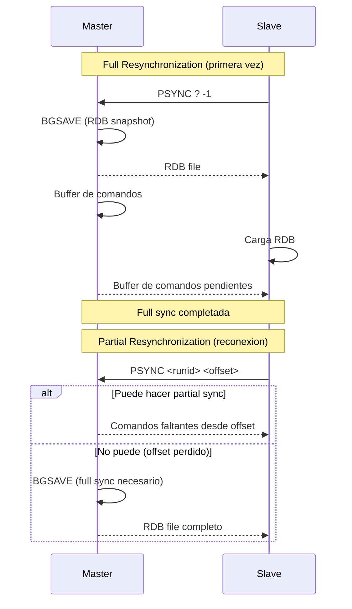
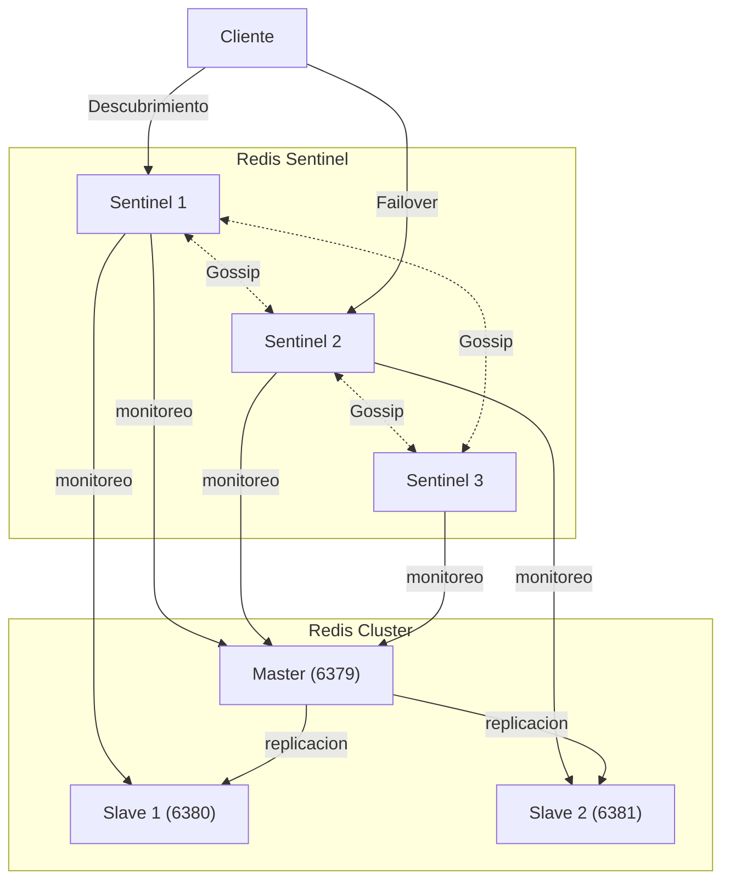
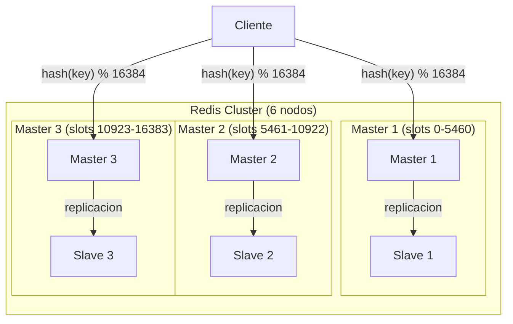

# Clase 08 — Redis III: Replicacion, Clustering y Seguridad

---

## Indice

1. Marco Teorico
2. Replicacion en Redis
3. Redis Sentinel
4. Redis Cluster
5. Administracion de Redis
6. Seguridad Completa de Redis
7. Ejercicio Practico

---

## 1. Marco Teorico

### 1.1 Replicacion Maestro-Esclavo en Redis

La replicacion en Redis permite crear copias exactas de un nodo maestro (master) en uno o mas nodos esclavos (slaves/replicas). Esto proporciona:
- **Alta disponibilidad:** Si el master falla, un slave puede tomar su lugar
- **Escalabilidad de lectura:** Los slaves manejan consultas de lectura, reduciendo la carga del master
- **Backup adicional:** Los slaves sirven como respaldo de los datos

**Caracteristicas clave:**
- La replicacion es **asincrona** por defecto (el master no espera confirmacion del slave)
- Un slave puede tener sus propios slaves (replicacion en cadena)
- Los slaves son de **solo lectura** por defecto
- La replicacion es **parcial** cuando es posible (PSYNC), evitando sincronizaciones completas

### 1.2 Redis Sentinel: Alta Disponibilidad

Redis Sentinel es un sistema de monitoreo que proporciona:
- **Monitoreo continuo** de masters y slaves
- **Notificaciones** cuando un nodo falla
- **Failover automatico:** Promueve un slave a master si el master falla
- **Configuracion dinamica:** Actualiza la configuracion de los clientes

**Requisitos minimos:**
- Minimo 3 Sentinel (para evitar split-brain)
- Minimo 1 master + 1 slave

### 1.3 Redis Cluster: Sharding Automatico

Redis Cluster proporciona:
- **Particion automatico** de datos entre multiples nodos
- **Escalabilidad horizontal** Ilimitada (agregar mas nodos)
- **Alta disponibilidad** con replicacion por particion
- **Sin proxy centralizado**

**Arquitectura:**
- 16384 slots distribuidos entre los nodos master
- Cada master tiene al menos 1 slave para failover
- Los clientes se conectan directamente a cualquier nodo

### 1.4 Comparacion de las 3 Estrategias

| Caracteristica | Replicacion Simple | Sentinel | Cluster |
|----------------|-------------------|----------|---------|
| **Escalabilidad lectura** | Si (slaves) | Si (slaves) | Si (slaves por shard) |
| **Escalabilidad escritura** | No | No | Si (multiples masters) |
| **Failover automatico** | No | Si | Si |
| **Sharding** | No | No | Si (16384 slots) |
| **Complejidad operativa** | Baja | Media | Alta |
| **Nodos minimos** | 2 (1 master + 1 slave) | 5 (3 sentinel + 1 master + 1 slave) | 6 (3 master + 3 slave) |
| **Limite de datos** | RAM de un nodo | RAM de un nodo | RAM total del cluster |
| **Caso de uso** | Pequenas apps | Apps medianas, HA | Apps a gran escala |

---

## 2. Replicacion en Redis

### 2.1 Configuracion Master-Slave

#### Archivo redis.conf del Master

```conf
# redis.conf del Master (puerto 6379)
bind 0.0.0.0
port 6379
daemonize yes
logfile /var/log/redis/redis-master.log

# Habilitar replicacion
replica-read-only yes

# Autenticacion (opcional pero recomendado)
requirepass mymasterpassword
masterauth mymasterpassword
```

#### Archivo redis.conf del Slave

```conf
# redis.conf del Slave (puerto 6380)
bind 0.0.0.0
port 6380
daemonize yes
logfile /var/log/redis/redis-slave.log

# Configurar replicacion apuntando al master
replicaof 127.0.0.1 6379

# Autenticacion del master
masterauth mymasterpassword

# Slave de solo lectura
replica-read-only yes
```

### 2.2 Replicacion en Tiempo Real

```bash
# Conectarse al slave y configurar replicacion dinamicamente
redis-cli -p 6380 REPLICAOF 127.0.0.1 6379

# Verificar el estado de replicacion
redis-cli -p 6379 INFO replication
# Replication
# role:master
# connected_slaves:1
# slave0:ip=127.0.0.1,port=6380,state=online,offset=1234,lag=0

redis-cli -p 6380 INFO replication
# Replication
# role:slave
# master_host:127.0.0.1
# master_port:6379
# master_link_status:up
# master_last_io_seconds_ago:0
# slave_read_repl_offset:1234
```

### 2.3 Tipos de Sincronizacion



**Full Resynchronization:**
- Se ejecuta en la conexion inicial
- El master crea un RDB y lo envia al slave
- El slave carga el RDB y luego recibe los comandos pendientes

**Partial Resynchronization (PSYNC):**
- Se ejecuta cuando se reconecta un slave
- Solo envia los comandos que el slave se perdio
- Requiere que el buffer del master aun tenga esos comandos
- Mas eficiente que full sync

### 2.4 Configuracion Avanzada de Replicacion

```conf
# redis.conf del Master - Configuracion avanzada

# Numero maximo de replicas conectadas
# replica-serve-stale-data yes

# Minimo de replicas con ACK para escritura (para durabilidad)
min-replicas-to-write 1
min-replicas-max-lag 10

# Buffer de repl backlog (para PSYNC)
repl-backlog-size 1mb
repl-backlog-ttl 3600

# Frecuencia de heartbeat master->slave
repl-ping-replica-period 10
```

### 2.5 docker-compose.yml para Replicacion

```yaml
version: '3.8'

services:
  redis-master:
    image: redis:7.2
    container_name: redis-master
    ports:
      - "6379:6379"
    command: redis-server --requirepass mypassword --masterauth mypassword
    volumes:
      - master-data:/data
    networks:
      - redis-net

  redis-slave-1:
    image: redis:7.2
    container_name: redis-slave-1
    ports:
      - "6380:6379"
    command: >
      redis-server
      --replicaof redis-master 6379
      --masterauth mypassword
      --requirepass mypassword
    depends_on:
      - redis-master
    networks:
      - redis-net

  redis-slave-2:
    image: redis:7.2
    container_name: redis-slave-2
    ports:
      - "6381:6379"
    command: >
      redis-server
      --replicaof redis-master 6379
      --masterauth mypassword
      --requirepass mypassword
    depends_on:
      - redis-master
    networks:
      - redis-net

volumes:
  master-data:

networks:
  redis-net:
    driver: bridge
```

```bash
# Iniciar el cluster de replicacion
docker-compose up -d

# Verificar replicacion
docker exec redis-master redis-cli -a mypassword INFO replication
docker exec redis-slave-1 redis-cli -a mypassword INFO replication

# Probar: escribir en master, leer en slave
docker exec redis-master redis-cli -a mypassword SET greeting "Hola desde el master"
docker exec redis-slave-1 redis-cli -a mypassword GET greeting
# "Hola desde el master"
```

---

## 3. Redis Sentinel

### 3.1 Arquitectura de Sentinel



**Flujo de Failover:**
1. Los Sentinel detectan que el master no responde (SDOWN - Subjectively Down)
2. Los Sentinel consultan entre si (ODOWN - Objectively Down)
3. Se elige un Sentinel lider (leader election con Raft)
4. El leader selecciona el mejor slave para promover
5. El slave es promovido a master
6. Los demas slaves apuntan al nuevo master
7. Los clientes son notificados del cambio

### 3.2 Configuracion de sentinel.conf

```conf
# sentinel.conf - Configuracion del Sentinel

# Puerto del Sentinel
port 26379

#守护进程
daemonize yes
logfile /var/log/redis/sentinel.log

# Direccion del master a monitorear
# sentinel monitor <nombre-grupo> <host> <puerto> <quorum>
sentinel monitor mymaster 127.0.0.1 6379 2

# Password del master (si tiene)
sentinel auth-pass mymaster mypassword

# Tiempo sin respuesta para considerar SDOWN (en ms)
sentinel down-after-milliseconds mymaster 5000

# Timeout de failover (en ms)
sentinel failover-timeout mymaster 60000

# Numero de replicas a configurar durante failover
sentinel parallel-syncs mymaster 1
```

### 3.3 docker-compose.yml para Sentinel

```yaml
version: '3.8'

services:
  redis-master:
    image: redis:7.2
    container_name: redis-master
    ports:
      - "6379:6379"
    command: redis-server --requirepass mypassword --masterauth mypassword
    volumes:
      - master-data:/data
    networks:
      - sentinel-net

  redis-slave-1:
    image: redis:7.2
    container_name: redis-slave-1
    ports:
      - "6380:6379"
    command: >
      redis-server
      --replicaof redis-master 6379
      --masterauth mypassword
      --requirepass mypassword
    depends_on:
      - redis-master
    networks:
      - sentinel-net

  redis-slave-2:
    image: redis:7.2
    container_name: redis-slave-2
    ports:
      - "6381:6379"
    command: >
      redis-server
      --replicaof redis-master 6379
      --masterauth mypassword
      --requirepass mypassword
    depends_on:
      - redis-master
    networks:
      - sentinel-net

  sentinel-1:
    image: redis:7.2
    container_name: sentinel-1
    ports:
      - "26379:26379"
    volumes:
      - ./sentinel.conf:/etc/redis/sentinel.conf
    command: redis-sentinel /etc/redis/sentinel.conf
    depends_on:
      - redis-master
      - redis-slave-1
      - redis-slave-2
    networks:
      - sentinel-net

  sentinel-2:
    image: redis:7.2
    container_name: sentinel-2
    ports:
      - "26380:26379"
    volumes:
      - ./sentinel.conf:/etc/redis/sentinel.conf
    command: redis-sentinel /etc/redis/sentinel.conf
    depends_on:
      - redis-master
      - redis-slave-1
      - redis-slave-2
    networks:
      - sentinel-net

  sentinel-3:
    image: redis:7.2
    container_name: sentinel-3
    ports:
      - "26381:26379"
    volumes:
      - ./sentinel.conf:/etc/redis/sentinel.conf
    command: redis-sentinel /etc/redis/sentinel.conf
    depends_on:
      - redis-master
      - redis-slave-1
      - redis-slave-2
    networks:
      - sentinel-net

volumes:
  master-data:

networks:
  sentinel-net:
    driver: bridge
```

### 3.4 Inicializacion y Verificacion

```bash
# Crear directorio de configuracion
mkdir -p sentinel-config

# Crear sentinel.conf
cat > sentinel-config/sentinel.conf << 'EOF'
port 26379
daemonize no
sentinel monitor mymaster redis-master 6379 2
sentinel auth-pass mymaster mypassword
sentinel down-after-milliseconds mymaster 5000
sentinel failover-timeout mymaster 60000
sentinel parallel-syncs mymaster 1
EOF

# Iniciar todo
docker-compose up -d

# Verificar sentinels
docker exec sentinel-1 redis-cli -p 26379 SENTINEL masters
docker exec sentinel-1 redis-cli -p 26379 SENTINEL replicas mymaster
docker exec sentinel-1 redis-cli -p 26379 SENTINEL get-master-addr-by-name mymaster
```

### 3.5 Simular Fallo del Master

```bash
# Verificar estado actual
docker exec sentinel-1 redis-cli -p 26379 SENTINEL get-master-addr-by-name mymaster
# 1) "redis-master"
# 2) "6379"

# Detener el master
docker stop redis-master

# Esperar deteccion del failover (5+ segundos)
sleep 10

# Verificar nuevo master
docker exec sentinel-1 redis-cli -p 26379 SENTINEL get-master-addr-by-name mymaster
# 1) "redis-slave-1"
# 2) "6379"

# Verificar que los sentinels actualizan la config
docker exec sentinel-2 redis-cli -p 26379 SENTINEL masters
```

### 3.6 Conexion a traves de Sentinel (Python)

```python
import redis
from redis.sentinel import Sentinel

# Configurar sentinel
sentinel = Sentinel([
    ('sentinel-1', 26379),
    ('sentinel-2', 26380),
    ('sentinel-3', 26381),
], socket_timeout=0.5)

# Descubrir el master
master = sentinel.discover_master('mymaster')
print(f"Master actual: {master}")
# Salida: Master actual: ('redis-slave-1', 6379)

# Obtener conexion de escritura (al master)
master_conn = sentinel.master_for(
    'mymaster',
    socket_timeout=0.5,
    password='mypassword'
)

# Obtener conexion de lectura (a un slave)
slave_conn = sentinel.slave_for(
    'mymaster',
    socket_timeout=0.5,
    password='mypassword'
)

# Escribir en el master
master_conn.set('clave', 'valor_desde_master')
print(f"Escrito en master: {master_conn.get('clave')}")

# Leer desde un slave
print(f"Leido desde slave: {slave_conn.get('clave')}")

# Monitorear eventos de failover
def failover_handler(message):
    print(f"FAILOVER detectado: {message}")

pubsub = sentinel.master_for('mymaster').pubsub()
pubsub.subscribe(**{'+switch-master': failover_handler})
```

### 3.7 Programmatic Failover

```bash
# Forzar failover desde un sentinel
docker exec sentinel-1 redis-cli -p 26379 SENTINEL failover mymaster

# Verificar resultado
docker exec sentinel-1 redis-cli -p 26379 SENTINEL get-master-addr-by-name mymaster

---

## 4. Redis Cluster

### 4.1 Arquitectura: 16384 Slots



**Distribucion de Slots:**
- 16384 slots (0 a 16383)
- Cada key se asigna a un slot: `HASH(key) % 16384`
- Cada master es responsable de un rango de slots
- Si un master falla, su slave toma control de esos slots

**Hash Tags:**
- `{user}:1000` y `{user}:2000` van al MISMO slot (porque Redis usa solo la parte dentro de `{}` para el hash)
- Permite agrupar keys relacionadas en el mismo shard

### 4.2 docker-compose.yml para Cluster

```yaml
version: '3.8'

services:
  redis-node-1:
    image: redis:7.2
    container_name: redis-node-1
    ports:
      - "7001:6379"
    command: redis-server --cluster-enabled yes --cluster-config-file nodes.conf --cluster-node-timeout 5000 --appendonly yes
    volumes:
      - node1-data:/data
    networks:
      - cluster-net

  redis-node-2:
    image: redis:7.2
    container_name: redis-node-2
    ports:
      - "7002:6379"
    command: redis-server --cluster-enabled yes --cluster-config-file nodes.conf --cluster-node-timeout 5000 --appendonly yes
    volumes:
      - node2-data:/data
    networks:
      - cluster-net

  redis-node-3:
    image: redis:7.2
    container_name: redis-node-3
    ports:
      - "7003:6379"
    command: redis-server --cluster-enabled yes --cluster-config-file nodes.conf --cluster-node-timeout 5000 --appendonly yes
    volumes:
      - node3-data:/data
    networks:
      - cluster-net

  redis-node-4:
    image: redis:7.2
    container_name: redis-node-4
    ports:
      - "7004:6379"
    command: redis-server --cluster-enabled yes --cluster-config-file nodes.conf --cluster-node-timeout 5000 --appendonly yes
    volumes:
      - node4-data:/data
    networks:
      - cluster-net

  redis-node-5:
    image: redis:7.2
    container_name: redis-node-5
    ports:
      - "7005:6379"
    command: redis-server --cluster-enabled yes --cluster-config-file nodes.conf --cluster-node-timeout 5000 --appendonly yes
    volumes:
      - node5-data:/data
    networks:
      - cluster-net

  redis-node-6:
    image: redis:7.2
    container_name: redis-node-6
    ports:
      - "7006:6379"
    command: redis-server --cluster-enabled yes --cluster-config-file nodes.conf --cluster-node-timeout 5000 --appendonly yes
    volumes:
      - node6-data:/data
    networks:
      - cluster-net

volumes:
  node1-data:
  node2-data:
  node3-data:
  node4-data:
  node5-data:
  node6-data:

networks:
  cluster-net:
    driver: bridge
```

### 4.3 Crear el Cluster

```bash
# Iniciar todos los nodos
docker-compose up -d

# Esperar a que los nodos esten listos
sleep 5

# Crear el cluster (3 masters + 3 slaves)
docker exec -it redis-node-1 redis-cli --cluster create \
    redis-node-1:6379 \
    redis-node-2:6379 \
    redis-node-3:6379 \
    redis-node-4:6379 \
    redis-node-5:6379 \
    redis-node-6:6379 \
    --cluster-replicas 1

# Salida:
# >>> Performing hash slots allocation on 6 nodes...
# Master[0] -> Slots 0 - 5460
# Master[1] -> Slots 5461 - 10922
# Master[2] -> Slots 10923 - 16383
# ...
# [OK] All 16384 slots covered.
```

### 4.4 Operaciones en Cluster

```bash
# Conectar en modo cluster (-c para seguir redirecciones)
docker exec -it redis-node-1 redis-cli -c -p 6379

# Ver informacion del cluster
CLUSTER INFO
# cluster_enabled:1
# cluster_slots_assigned:16384
# cluster_slots_ok:16384
# cluster_known_nodes:6
# cluster_size:3

# Ver nodos
CLUSTER NODES
# abc123... redis-node-1:6379@16379 master - 0 0 1 connected 0-5460
# def456... redis-node-2:6379@16379 master - 0 0 2 connected 5461-10922
# ...

# Ver asignacion de slots
CLUSTER SLOTS
# 1) 1) (integer) 0
#    2) (integer) 5460
#    3) 1) "redis-node-1"
#       2) "6379"
#       ...
#       4) "redis-node-4"
#       5) "6379"

# Verificar hash slot de una key
CLUSTER KEYSLOT mykey
# (integer) 5006

# Obtener informacion de un slot
CLUSTER COUNTKEYSINSLOT 5006
```

### 4.5 Agregar y Quitar Nodos

```bash
# Agregar un nuevo nodo maestro
docker exec -it redis-node-1 redis-cli --cluster add-node \
    redis-node-7:6379 \
    redis-node-1:6379

# Agregar un nodo esclavo a un maestro existente
docker exec -it redis-node-1 redis-cli --cluster add-node \
    redis-node-8:6379 \
    redis-node-7:6379 \
    --cluster-slave \
    --cluster-master-id <node-id-del-master>

# Quitar un nodo esclavo
docker exec -it redis-node-1 redis-cli --cluster del-node \
    redis-node-1:6379 \
    <node-id-del-slave-a-quitar>

# Quitar un nodo maestro (debe estar vacio primero)
docker exec -it redis-node-1 redis-cli --cluster reshard \
    redis-node-1:6379 \
    --cluster-from <node-id-source> \
    --cluster-to <node-id-destino> \
    --cluster-slots <num-slots> \
    --cluster-yes

# Luego quitar
docker exec -it redis-node-1 redis-cli --cluster del-node \
    redis-node-1:6379 \
    <node-id-vacio>
```

### 4.6 Resharding

```bash
# Resharding interactivo
docker exec -it redis-node-1 redis-cli --cluster reshard redis-node-1:6379

# Preguntas interactivas:
# How many slots do you want to move (from 0 to 16384)? 4096
# What is the receiving node ID? <nodo-destino>
# Source node #1: <nodo-source>
# Source node #2: done

# Resharding no interactivo
docker exec -it redis-node-1 redis-cli --cluster reshard \
    redis-node-1:6379 \
    --cluster-from <nodo-source-id> \
    --cluster-to <nodo-destino-id> \
    --cluster-slots 4096 \
    --cluster-yes
```

### 4.7 Simular Fallo y Recuperacion

```bash
# Ver estado actual
docker exec -it redis-node-1 redis-cli -c -p 6379 CLUSTER NODES

# Detener un master (ej: node-1)
docker stop redis-node-1

# Verificar que el slave tomo control (dentro de ~5 segundos)
docker exec -it redis-node-2 redis-cli -c -p 6379 CLUSTER NODES
# redis-node-4 (el slave de node-1) ahora es master con los slots 0-5460

# Escribir funciona (redirige al nuevo master)
docker exec -it redis-node-2 redis-cli -c -p 6379 SET test "funciona"
# OK

# Reiniciar el nodo original (se conecta como slave)
docker start redis-node-1
sleep 5

# Verificar: node-1 ahora es slave de node-4
docker exec -it redis-node-2 redis-cli -c -p 6379 CLUSTER NODES
```

### 4.8 Codigo Python para Cluster

```python
from redis.cluster import RedisCluster
import time

# Conexion al cluster
startup_nodes = [
    {"host": "redis-node-1", "port": 6379},
    {"host": "redis-node-2", "port": 6379},
    {"host": "redis-node-3", "port": 6379},
]

rc = RedisCluster(startup_nodes=startup_nodes, decode_responses=True)

# Operaciones basicas
rc.set("user:1000:name", "Juan")
rc.set("user:1000:email", "juan@email.com")
rc.set("user:2000:name", "Maria")
rc.set("user:2000:email", "maria@email.com")

print(f"user:1000:name = {rc.get('user:1000:name')}")
print(f"user:2000:name = {rc.get('user:2000:name')}")

# Pipeline en cluster
pipe = rc.pipeline()
for i in range(100):
    pipe.set(f"counter:{i}", 0)
    pipe.incr(f"counter:{i}")
pipe.execute()

# Verificar distribucion
for i in range(10):
    val = rc.get(f"counter:{i}")
    slot = rc.keyslot(f"counter:{i}")
    node = rc.get_node_from_slot(slot)
    print(f"counter:{i} = {val} (slot {slot}, nodo {node.name})")

# Cluster info
print(f"Nodos activos: {len(rc.get_nodes())}")
print(f"Masters: {len([n for n in rc.get_nodes() if n.flags == 'master'])}")

---

## 5. Administracion de Redis

### 5.1 Monitoreo

#### INFO Command

```bash
# Todas las secciones
redis-cli INFO

# Secciones especificas
redis-cli INFO server
redis-cli INFO clients
redis-cli INFO memory
redis-cli INFO persistence
redis-cli INFO stats
redis-cli INFO replication
redis-cli INFO cpu
redis-cli INFO commandstats
redis-cli INFO keyspace
```

**Secciones importantes de INFO:**

| Seccion | Contenido clave |
|---------|-----------------|
| **server** | Version, uptime, configuracion |
| **clients** | Conexiones activas, bloqueadas |
| **memory** | Usada, pico,碎片率 (mem_fragmentation_ratio) |
| **persistence** | Estado RDB/AOF |
| **stats** | Operaciones por segundo, hits/misses |
| **replication** | Estado maestro/esclavo |
| **keyspace** | Numero de keys por DB |

```bash
# Memoria util
redis-cli INFO memory | grep used_memory_human
# used_memory_human:1.50M

# Operaciones por segundo
redis-cli INFO stats | grep instantaneous_ops_per_sec
# instantaneous_ops_per_sec:1250

# Tasa de aciertos de caché
redis-cli INFO stats | grep keyspace_hits
redis-cli INFO stats | grep keyspace_misses
```

#### Herramientas de Monitoreo

```bash
# Medir latencia
redis-cli --latency
# avg: 0.123 msec, min: 0.089 msec, max: 1.234 msec, count: 1000

# Medir latencia con histrograma
redis-cli --latency-history -i 5

# Detectar claves grandes
redis-cli --bigkeys
# Biggest string found so far: 'session:abc' with 1048 bytes
# Biggest hash found so far: 'user:1' with 15 fields
# ...

# Detectar claves calientes
redis-cli --hotkeys

# Uso de memoria por clave
redis-cli MEMORY USAGE mykey
# (integer) 88

# Log de consultas lentas (configurar primero)
redis-cli CONFIG SET slowlog-log-slower-than 10000
redis-cli SLOWLOG GET 10

# Monitorizar comandos en tiempo real (CUIDADO: genera mucha carga)
redis-cli MONITOR
# 1234567890.123456 [0 127.0.0.1:12345] "GET" "mykey"
# 1234567890.123789 [0 127.0.0.1:12345] "SET" "mykey" "value"
```

### 5.2 Mantenimiento

```bash
# Diagnostico de memoria
redis-cli MEMORY DOCTOR
# WARNING: evicted keys are not informative...

# Liberar memoria no usada
redis-cli MEMORY PURGE

# Backup en background (RDB)
redis-cli BGSAVE
# Background saving started

# Verificar ultimo backup exitoso
redis-cli LASTSAVE
# (integer) 1705312200

# Tamano de la base de datos
redis-cli DBSIZE
# (integer) 15234

# Verificar integridad
redis-cli DEBUG SLEEP 0
# OK

# Recargar configuracion
redis-cli DEBUG RELOAD
```

### 5.3 Performance Tuning

#### Pipeline (Batch de Comandos)

```python
import redis
import time

r = redis.Redis(host='localhost', port=6379, db=0, decode_responses=True)

# Sin pipeline: 10000 comandos individualmente
start = time.time()
for i in range(10000):
    r.set(f'key:{i}', f'value:{i}')
elapsed_individual = time.time() - start
print(f"Sin pipeline: {elapsed_individual:.2f}s")

# Con pipeline: 10000 comandos en batch
start = time.time()
pipe = r.pipeline()
for i in range(10000):
    pipe.set(f'key:{i}', f'value:{i}')
pipe.execute()
elapsed_pipeline = time.time() - start
print(f"Con pipeline: {elapsed_pipeline:.2f}s")
print(f"Mejora: {elapsed_individual/elapsed_pipeline:.1f}x")

# Salida:
# Sin pipeline: 12.45s
# Con pipeline: 0.35s
# Mejora: 35.6x
```

#### Lua Scripts

```lua
-- script.lua: Operacion atomica de incremento con limite
local key = KEYS[1]
local max_value = tonumber(ARGV[1])
local increment = tonumber(ARGV[2])

local current = tonumber(redis.call('GET', key) or '0')
if current + increment <= max_value then
    redis.call('INCRBY', key, increment)
    return current + increment
else
    return -1  -- Limite alcanzado
end
```

```python
import redis

r = redis.Redis(host='localhost', port=6379, db=0, decode_responses=True)

# Cargar script Lua
with open('script.lua', 'r') as f:
    lua_script = f.read()

script = r.register_script(lua_script)

# Ejecutar
result = script(keys=['rate_limit:user123'], args=[100, 1])
print(f"Resultado: {result}")
# Resultado: 1  (primer incremento)

result = script(keys=['rate_limit:user123'], args=[100, 1])
print(f"Resultado: {result}")
# Resultado: 2

# ... despues de 100 incrementos ...
result = script(keys=['rate_limit:user123'], args=[100, 1])
print(f"Resultado: {result}")
# Resultado: -1  (limite alcanzado)
```

#### Deteccion de Claves Grandes

```python
import redis

r = redis.Redis(host='localhost', port=6379, db=0, decode_responses=True)

# Escanear todas las claves y medir tamano
def find_large_keys(redis_client, threshold_bytes=10000):
    large_keys = []
    cursor = 0

    while True:
        cursor, keys = redis_client.scan(cursor=cursor, count=100)
        for key in keys:
            size = redis_client.memory_usage(key)
            if size and size > threshold_bytes:
                key_type = redis_client.type(key)
                large_keys.append({
                    'key': key,
                    'type': key_type,
                    'size_bytes': size,
                    'size_human': f"{size/1024:.2f} KB"
                })
        if cursor == 0:
            break

    return sorted(large_keys, key=lambda x: x['size_bytes'], reverse=True)


large = find_large_keys(r, threshold_bytes=1000)
for item in large[:10]:
    print(f"  {item['key']}: {item['size_human']} ({item['type']})")
```

---

## 6. Seguridad Completa de Redis

### 6.1 Autenticacion

#### Metodo Legacy: requirepass

```conf
# redis.conf
requirepass TuPasswordSeguro123!
```

```bash
# Conectar con password
redis-cli -a TuPasswordSeguro123!

# O despues de conectar
redis-cli
AUTH TuPasswordSeguro123!
```

#### ACL (Redis 6+) - Sistema de Control de Acceso

```bash
# Ver usuarios definidos
ACL LIST
# 1) "user default on #<hash> ~* &* +@all"

# Crear usuario con permisos limitados
ACL SETUSER app_read on >readpassword123 ~cache:* +get +mget +scan +info

# Crear usuario de solo escritura
ACL SETUSER app_write on >writepassword456 ~data:* +set +del +expire +hset +hdel

# Crear usuario administrador
ACL SETUSER admin on >adminpass789 ~* +@all

# Crear usuario solo para pub/sub
ACL SETUSER pubsub_user on >pubsub123 +publish +subscribe +psubscribe -@all ~channel:*

# Ver permisos de un usuario
ACL GETUSER app_read
# 1) "flags"
# 2) 1) "on"
# 3) "passwords"
# 4) 1) "<hash-del-password>"
# 5) "keys"
# 6) 1) "cache:*"
# 7) "channels"
# 8) 1) "*"
# 9) "commands"
# 10) "+get +mget +scan +info"

# Eliminar usuario
ACL DELUSER old_user

# Guardar ACL a archivo
ACL SAVE

# Cargar ACL desde archivo
ACL LOAD

# Categorias de comandos
ACL CAT
# 1) "read"
# 2) "write"
# 3) "set"
# 4) "sorted-set"
# 5) "hash"
# 6) "list"
# 7) "string"
# 8) "admin"
# 9) "slow"
# 10) "debug"
# 11) "pubsub"
# 12) "dangerous"
# 13) "scripting"

# Ver comandos de una categoria
ACL CAT read
# 1) "get"
# 2) "mget"
# 3) "getrange"
# 4) "hget"
# ...
```

#### Archivo ACL

```conf
# /etc/redis/users.acl

# Usuario por defecto (solo lectura)
user default on >defaultpass ~* +@read +@slow

# Aplicacion web - lectura y escritura limitada
user webapp on >webpass123 ~session:* ~cache:* +get +set +del +expire +mget +scan

# Worker de background - escritura
user worker on >workerpass456 ~queue:* ~log:* +lpush +rpop +lrange +hset +append

# Monitor - solo lectura e info
user monitor on >monpass789 ~* +info +monitor +slowlog +memory +dbsize -@write -@dangerous
```

### 6.2 Red

```conf
# redis.conf - Configuracion de red

# Solo escuchar en localhost (produccion)
bind 127.0.0.1

# O en multiples interfaces
bind 127.0.0.1 10.0.0.5

# Modo protegido (requiere auth si no hay bind)
protected-mode yes

# Puerto no estandar
port 6380

# Backlog de conexiones
tcp-backlog 511

# Timeout de conexion (0 = sin timeout)
timeout 300

# Keepalive TCP
tcp-keepalive 300

# Maximo de clientes conectados
maxclients 10000
```

### 6.3 TLS/SSL

```conf
# redis.conf - TLS

# Puerto TLS
tls-port 6380

# Certificados
tls-cert-file /etc/redis/tls/redis.crt
tls-key-file /etc/redis/tls/redis.key
tls-ca-cert-file /etc/redis/tls/ca.crt

# Protocolo minimo
tls-protocols "TLSv1.2 TLSv1.3"

# Cifrados
tls-ciphersuites "TLS_AES_256_GCM_SHA384:TLS_CHACHA20_POLY1305_SHA256"

# Verificacion de cliente (mTLS)
tls-auth-clients optional

# Replicacion con TLS
tls-replication yes

# Cluster con TLS
tls-cluster yes
```

```bash
# Generar certificados para pruebas
mkdir -p /etc/redis/tls

# CA
openssl genrsa -out /etc/redis/tls/ca.key 4096
openssl req -x509 -new -nodes -key /etc/redis/tls/ca.key \
    -sha256 -days 365 -out /etc/redis/tls/ca.crt \
    -subj "/CN=Redis CA"

# Certificado del servidor
openssl genrsa -out /etc/redis/tls/redis.key 2048
openssl req -new -key /etc/redis/tls/redis.key \
    -out /etc/redis/tls/redis.csr \
    -subj "/CN=redis-server"
openssl x509 -req -in /etc/redis/tls/redis.csr \
    -CA /etc/redis/tls/ca.crt -CAkey /etc/redis/tls/ca.key \
    -CAcreateserial -out /etc/redis/tls/redis.crt -days 365

# Conectar con TLS
redis-cli --tls --cert /etc/redis/tls/redis.crt \
    --key /etc/redis/tls/redis.key \
    --cacert /etc/redis/tls/ca.crt
```

### 6.4 Comandos Peligrosos

```conf
# redis.conf - Renombrar comandos peligrosos

# Deshabilitar FLUSHALL (borrar toda la BD)
rename-command FLUSHALL ""

# Deshabilitar FLUSHDB (borrar la BD actual)
rename-command FLUSHDB ""

# Deshabilitar DEBUG
rename-command DEBUG ""

# Proteger CONFIG SET
rename-command CONFIG "CONFIG_SECRET_a1b2c3"

# Deshabilitar KEYS (usar SCAN en su lugar)
rename-command KEYS ""
```

```python
import redis

# Conectar usando el nombre renombrado
r = redis.Redis(host='localhost', port=6379, db=0, decode_responses=True,
                password='mipassword')

# CONFIG ahora requiere el nombre renombrado
try:
    r.config_set('maxmemory', '512mb')
except redis.exceptions.ResponseError as e:
    print(f"Error: {e}")

# Usar el nombre renombrado
r.execute_command('CONFIG_SECRET_a1b2c3', 'SET', 'maxmemory', '512mb')
```

### 6.5 Backups de Redis

#### Script de Backup Automatizado

```bash
#!/bin/bash
# backup-redis.sh - Backup automatizado de Redis

REDIS_CLI="redis-cli"
REDIS_HOST="127.0.0.1"
REDIS_PORT="6379"
REDIS_PASSWORD="mipassword"
BACKUP_DIR="/var/backups/redis"
RETENTION_DAYS=7

# Fecha para el nombre del archivo
DATE=$(date +%Y%m%d_%H%M%S)
BACKUP_FILE="${BACKUP_DIR}/redis_dump_${DATE}.rdb"

echo "[$(date)] Iniciando backup de Redis..."

# Crear directorio de backups
mkdir -p ${BACKUP_DIR}

# Forzar snapshot RDB
${REDIS_CLI} -h ${REDIS_HOST} -p ${REDIS_PORT} -a ${REDIS_PASSWORD} BGSAVE

# Esperar a que termine el backup
while [ "$($REDIS_CLI -h ${REDIS_HOST} -p ${REDIS_PORT} -a ${REDIS_PASSWORD} LASTSAVE)" == "$LAST_SAVE" ]; do
    sleep 1
done

# Copiar el archivo RDB
docker cp redis-master:/data/dump.rdb ${BACKUP_FILE}

# Comprimir
gzip ${BACKUP_FILE}

echo "[$(date)] Backup completado: ${BACKUP_FILE}.gz"

# Eliminar backups antiguos
find ${BACKUP_DIR} -name "redis_dump_*.rdb.gz" -mtime +${RETENTION_DAYS} -delete
echo "[$(date)] Backups antiguos eliminados (>${RETENTION_DAYS} dias)"

# Verificar integridad
echo "[$(date)] Verificando integridad del backup..."
gunzip -t ${BACKUP_FILE}.gz
if [ $? -eq 0 ]; then
    echo "[$(date)] Backup verificado correctamente"
else
    echo "[$(date)] ERROR: Backup corrupto!"
    exit 1
fi
```

#### Script de Restore

```bash
#!/bin/bash
# restore-redis.sh - Restaurar backup de Redis

REDIS_CONTAINER="redis-master"
BACKUP_FILE=$1

if [ -z "$BACKUP_FILE" ]; then
    echo "Uso: $0 <archivo-backup.rdb.gz>"
    exit 1
fi

echo "[$(date)] Deteniendo Redis..."
docker stop ${REDIS_CONTAINER}

echo "[$(date)] Restaurando backup: ${BACKUP_FILE}"
gunzip -c ${BACKUP_FILE} > /tmp/dump.rdb
docker cp /tmp/dump.rdb ${REDIS_CONTAINER}:/data/dump.rdb
rm /tmp/dump.rdb

echo "[$(date)] Iniciando Redis..."
docker start ${REDIS_CONTAINER}

sleep 3

echo "[$(date)] Verificando restauracion..."
KEYS=$(docker exec ${REDIS_CONTAINER} redis-cli DBSIZE)
echo "[$(date)]恢复 completada. Keys en la BD: ${KEYS}"
```

```bash
# Configurar cron para backup automatico
# Ejecutar backup diario a las 2 AM
echo "0 2 * * * /path/to/backup-redis.sh >> /var/log/redis-backup.log 2>&1" | crontab -

# Verificar cron
crontab -l
```

### 6.6 Politica de Retencion de Backups

```
Politica de backups:
- Diarios: mantener 7 dias
- Semanales: mantener 4 semanas
- Mensuales: mantener 12 meses

Estructura de directorios:
/var/backups/redis/
  daily/
    redis_dump_20240115_020000.rdb.gz
    redis_dump_20240116_020000.rdb.gz
    ...
  weekly/
    redis_dump_2024-W03.rdb.gz
    ...
  monthly/
    redis_dump_2024-01.rdb.gz
    ...

Retention automatica:
- Daily: 7 dias
- Weekly: 28 dias
- Monthly: 365 dias
```

---

## 7. Ejercicio Practico

### Ejercicio 1: Configurar Redis Sentinel

**Objetivo:** Configurar un entorno Sentinel completo con docker-compose.

**Instrucciones:**
1. Crear docker-compose.yml con 3 sentinels + 1 master + 2 slaves
2. Configurar sentinel.conf con quorum de 2
3. Verificar que la replicacion funciona
4. Simular fallo del master y verificar failover
5. Conectar desde Python usando Sentinel y verificar que la aplicacion no se interrumpe

**Criterios de evaluacion:**
- [ ] docker-compose funciona correctamente
- [ ] Replicacion verificada (escritura en master, lectura en slave)
- [ ] Failover automatico simulado exitosamente
- [ ] Cliente Python se reconecta automaticamente

### Ejercicio 2: Configurar Redis Cluster

**Objetivo:** Crear y gestionar un cluster de Redis.

**Instrucciones:**
1. Crear docker-compose.yml con 6 nodos (3 master + 3 slave)
2. Crear el cluster con redis-cli --cluster create
3. Verificar distribucion de slots
4. Insertar 10000 claves y verificar distribucion
5. Simular fallo de un master y verificar recuperacion
6. Hacer resharding de 1000 slots de un master a otro

### Ejercicio 3: Seguridad Completa

**Objetivo:** Implementar todas las medidas de seguridad.

**Instrucciones:**
1. Configurar ACL con 4 usuarios (admin, app, worker, monitor)
2. Configurar TLS con certificados autofirmados
3. Renombrar comandos peligrosos
4. Configurar bind y protected-mode
5. Probar que cada usuario solo puede acceder a sus permisos
6. Script de backup automatizado con cron

### Ejercicio 4: Benchmark Comparativo

**Objetivo:** Comparar rendimiento entre modos de operacion.

**Instrucciones:**
1. Benchmark en standalone: redis-benchmark -t set,get -n 100000 -c 50
2. Benchmark en cluster: redis-benchmark en modo cluster
3. Benchmark con pipeline vs sin pipeline
4. Benchmark con TLS vs sin TLS
5. Documentar resultados en tabla comparativa

```bash
# Benchmark standalone
redis-benchmark -h 127.0.0.1 -p 6379 -t set,get -n 100000 -c 50 -q

# Benchmark cluster (modo cluster automatico)
redis-benchmark -h 127.0.0.1 -p 7001 -t set,get -n 100000 -c 50 -q

# Benchmark con pipeline
redis-benchmark -h 127.0.0.1 -p 6379 -t set,get -n 100000 -c 50 -P 10 -q

# Benchmark con TLS
redis-benchmark --tls \
    --cert /etc/redis/tls/redis.crt \
    --key /etc/redis/tls/redis.key \
    --cacert /etc/redis/tls/ca.crt \
    -h 127.0.0.1 -p 6380 -t set,get -n 100000 -c 50 -q
```

**Criterios de evaluacion:**
- [ ] Todos los benchmarks ejecutados
- [ ] Resultados documentados en tabla
- [ ] Analisis de overhead de TLS
- [ ] Analisis de mejora con pipeline
- [ ] Comparativa cluster vs standalone
