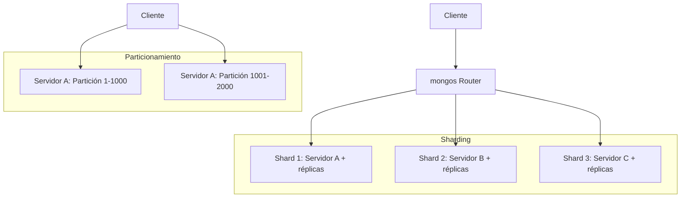
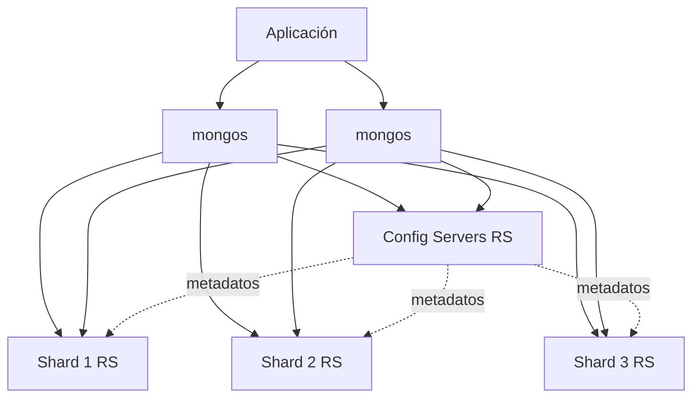

# Clase 8 — Sharding, Particionamiento y Consistent Hashing

## 1. Sharding vs Particionamiento

### Particionamiento

- Dividir una tabla/colección en partes más pequeñas
- Todas las partes están en el mismo servidor
- Manejo de tablas muy grandes

### Sharding

- Particionamiento distribuido en múltiples servidores
- Cada shard es un servidor/replica set independiente
- Escalamiento horizontal real



## 2. Arquitectura de Sharding en MongoDB

### Componentes

| Componente | Función |
|------------|---------|
| mongos | Router: recibe consultas del cliente y dirige al shard correcto |
| Config Servers | Metadatos: mapeo de chunks a shards (3 nodos mínimo) |
| Shard Servers | Datos: cada shard es un replica set |



## 3. Clave de Shard

### Tipos

**Ranged Sharding:**

- Rango de valores asignados a shards
- Ejemplo: A-M → Shard 1, N-Z → Shard 2
- Riesgo: hotspots si los datos no se distribuyen uniformemente

**Hashed Sharding:**

- Hash del campo distribuye uniformemente
- Ejemplo: hash(email) → shard
- Mejor distribución, peor para rangos

**Tagged Sharding:**

- Asignar rangos específicos a shards específicos
- Útil para data locality (geolocalización)

### Elegir Clave de Shard

| Campo | Distribución | Rango | Cardinalidad | Recomendado |
|-------|-------------|-------|-------------|-------------|
| `_id` (ObjectId) | Alta | No | Alta | Sí (hashed) |
| `email` (hashed) | Alta | No | Alta | Sí |
| `fecha` | Baja (hotspot) | Sí | Media | No |
| `ciudad` | Media | No | Baja | No (pocos valores) |

## 4. Configurar Cluster Shardado con Docker

### 4.1 docker-compose.yml

```yaml
version: '3.8'
services:
  # Config Servers (replica set de 3)
  cfg1:
    image: mongo:7.0
    command: mongod --configsvr --replSet cfgRS --port 27019
    ports: ["27021:27019"]
    volumes: [cfg1-data:/data/db]

  cfg2:
    image: mongo:7.0
    command: mongod --configsvr --replSet cfgRS --port 27019
    ports: ["27022:27019"]
    volumes: [cfg2-data:/data/db]

  cfg3:
    image: mongo:7.0
    command: mongod --configsvr --replSet cfgRS --port 27019
    ports: ["27023:27019"]
    volumes: [cfg3-data:/data/db]

  # Shard 1 (replica set de 2)
  s1a:
    image: mongo:7.0
    command: mongod --shardsvr --replSet s1RS --port 27018
    ports: ["27031:27018"]
    volumes: [s1a-data:/data/db]

  s1b:
    image: mongo:7.0
    command: mongod --shardsvr --replSet s1RS --port 27018
    ports: ["27032:27018"]
    volumes: [s1b-data:/data/db]

  # Shard 2 (replica set de 2)
  s2a:
    image: mongo:7.0
    command: mongod --shardsvr --replSet s2RS --port 27018
    ports: ["27033:27018"]
    volumes: [s2a-data:/data/db]

  s2b:
    image: mongo:7.0
    command: mongod --shardsvr --replSet s2RS --port 27018
    ports: ["27034:27018"]
    volumes: [s2b-data:/data/db]

  # mongos Router
  mongos:
    image: mongo:7.0
    command: mongos --configdb cfgRS/cfg1:27019,cfg2:27019,cfg3:27019 --port 27017 --bind_ip_all
    ports: ["27017:27017"]
    depends_on: [cfg1, cfg2, cfg3, s1a, s1b, s2a, s2b]

volumes:
  cfg1-data: cfg2-data: cfg3-data:
  s1a-data: s1b-data: s2a-data: s2b-data:
```

### 4.2 Inicializar

```bash
docker compose up -d
sleep 15

# 1. Inicializar Config Server RS
docker exec -it cfg1 mongosh --port 27019 --eval '
rs.initiate({
    _id: "cfgRS",
    configsvr: true,
    members: [
        { _id: 0, host: "cfg1:27019" },
        { _id: 1, host: "cfg2:27019" },
        { _id: 2, host: "cfg3:27019" }
    ]
})
'

# 2. Inicializar Shard 1 RS
docker exec -it s1a mongosh --port 27018 --eval '
rs.initiate({
    _id: "s1RS",
    members: [
        { _id: 0, host: "s1a:27018" },
        { _id: 1, host: "s1b:27018" }
    ]
})
'

# 3. Inicializar Shard 2 RS
docker exec -it s2a mongosh --port 27018 --eval '
rs.initiate({
    _id: "s2RS",
    members: [
        { _id: 0, host: "s2a:27018" },
        { _id: 1, host: "s2b:27018" }
    ]
})
'

sleep 15

# 4. Conectar al mongos y agregar shards
docker exec -it mongos mongosh --eval '
sh.addShard("s1RS/s1a:27018,s1b:27018")
sh.addShard("s2RS/s2a:27018,s2b:27018")
'
```

### 4.3 Habilitar Sharding

```bash
docker exec -it mongos mongosh
```

```javascript
// Habilitar sharding en la base de datos
sh.enableSharding("tienda")

// Shard una colección con hashed key
sh.shardCollection("tienda.productos", { sku: "hashed" })

// Shard una colección con ranged key
sh.shardCollection("tienda.pedidos", { fecha: 1, cliente_id: 1 })

// Ver estado del cluster
sh.status()
```

### 4.4 Poblar y verificar distribución

```javascript
// Insertar 10,000 productos
use tienda
for (let i = 0; i < 10000; i++) {
    db.productos.insertOne({
        sku: `PROD-${String(i).padStart(5, '0')}`,
        nombre: `Producto ${i}`,
        precio: Math.floor(Math.random() * 1000),
        categoria: ["electronics", "clothing", "food"][i % 3]
    })
}

// Ver distribución de chunks
sh.status()
// → Ver cuántos chunks hay en cada shard
```

## 5. Balancing

### Migración de Chunks

- El balancer mueve chunks entre shards automáticamente
- Se activa cuando hay diferencia significativa de chunks

```javascript
// Ver estado del balancer
sh.getBalancerState()

// Activar/desactivar
sh.startBalancer()
sh.stopBalancer()

// Ver migraciones en curso
db.adminCommand({ listShards: 1 })
```

## 6. Consistent Hashing

### Problema del hashing simple

```
hash(clave) % N_shards
```

Si N cambia (agregar/quitar shard), casi todas las claves se remapean.

### Solución: Anillo Hash

```mermaid
graph LR
    subgraph "Anillo de Hash (0 → 2^128)"
        A[Nodo A: hash 0x12...]
        B[Nodo B: hash 0x45...]
        C[Nodo C: hash 0x78...]
        D[Nodo D: hash 0xAB...]
    end
    
    K1[Key "user1": hash 0x20] -.->|va a| B
    K2[Key "user2": hash 0x80] -.->|va a| D
    K3[Key "user3": hash 0x50] -.->|va a| C
    
    style B fill:#90EE90
    style D fill:#90EE90
    style C fill:#90EE90
```

### Implementación en Python

```python
import hashlib

class ConsistentHash:
    def __init__(self, nodes, replicas=150):
        self.ring = {}
        self.sorted_keys = []
        self.replicas = replicas

        for node in nodes:
            for i in range(replicas):
                h = self._hash(f"{node}:{i}")
                self.ring[h] = node
                self.sorted_keys.append(h)
        self.sorted_keys.sort()

    def _hash(self, key):
        return int(hashlib.md5(key.encode()).hexdigest(), 16)

    def add_node(self, node):
        for i in range(self.replicas):
            h = self._hash(f"{node}:{i}")
            self.ring[h] = node
            self.sorted_keys.append(h)
        self.sorted_keys.sort()

    def remove_node(self, node):
        for i in range(self.replicas):
            h = self._hash(f"{node}:{i}")
            del self.ring[h]
            self.sorted_keys.remove(h)

    def get_node(self, key):
        h = self._hash(key)
        import bisect
        idx = bisect.bisect(self.sorted_keys, h) % len(self.sorted_keys)
        return self.ring[self.sorted_keys[idx]]

# Uso
ch = ConsistentHash(["shard1", "shard2", "shard3"])

print(ch.get_node("usuario:1001"))  # → shard2
print(ch.get_node("usuario:2045"))  # → shard1
print(ch.get_node("usuario:9999"))  # → shard3

# Agregar shard
ch.add_node("shard4")
# Solo una fracción de las claves se remapean
```

### Simulación: cuántas claves se mueven al agregar un nodo

```python
import random, string

def simulate():
    ch = ConsistentHash(["shard1", "shard2", "shard3"])
    keys = [''.join(random.choices(string.ascii_letters, k=10)) for _ in range(10000)]

    initial_mapping = {k: ch.get_node(k) for k in keys}

    ch.add_node("shard4")

    moved = sum(1 for k in keys if ch.get_node(k) != initial_mapping[k])
    print(f"Claves movidas: {moved}/{len(keys)} ({moved/len(keys)*100:.1f}%)")
    # → ~25% se mueven (1 de 4 nodos nuevos)
    # Con hashing simple: ~75% se moverían

simulate()
```

## 7. Ejercicio Práctico

1. Configurar cluster shardado con Docker Compose
2. Habilitar sharding en una colección
3. Insertar 50,000 documentos
4. Verificar distribución de chunks con `sh.status()`
5. Agregar un tercer shard y observar rebalanceo
6. Implementar consistent hashing en Python
7. Simular agregar/quitar nodos y medir impacto en re-distribución
8. Comparar consistent hashing vs hashing simple en cantidad de re-mapeos
