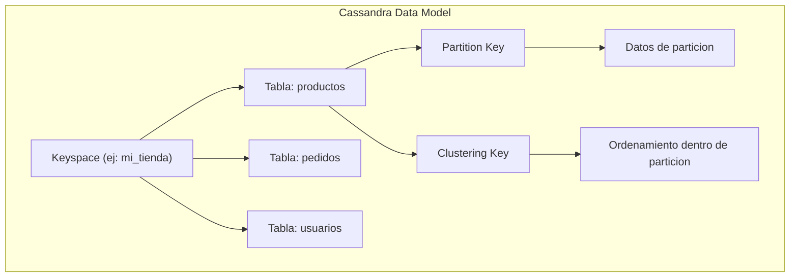
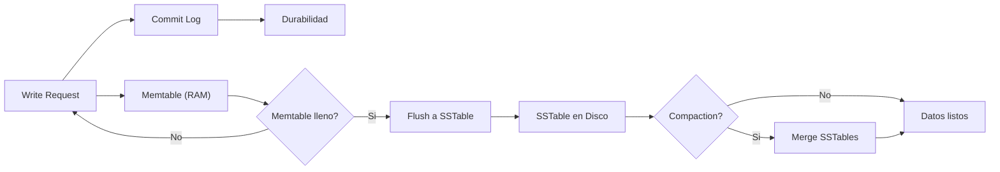
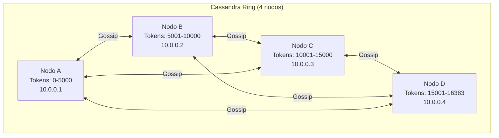
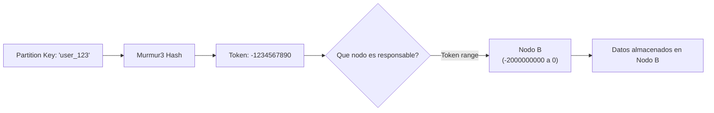
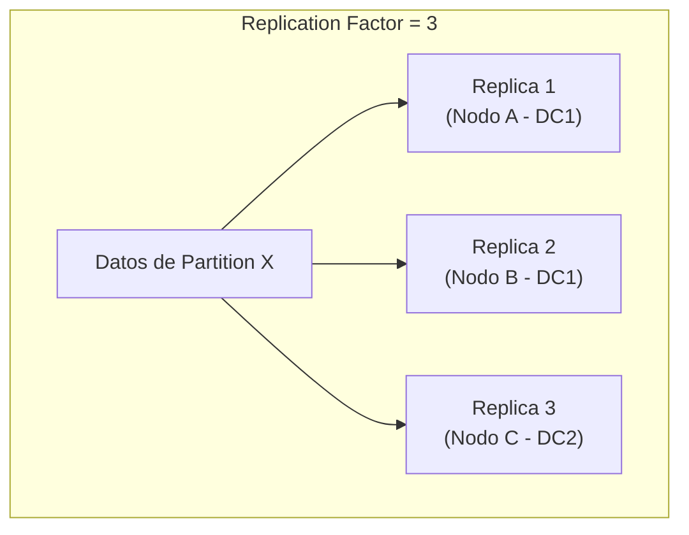
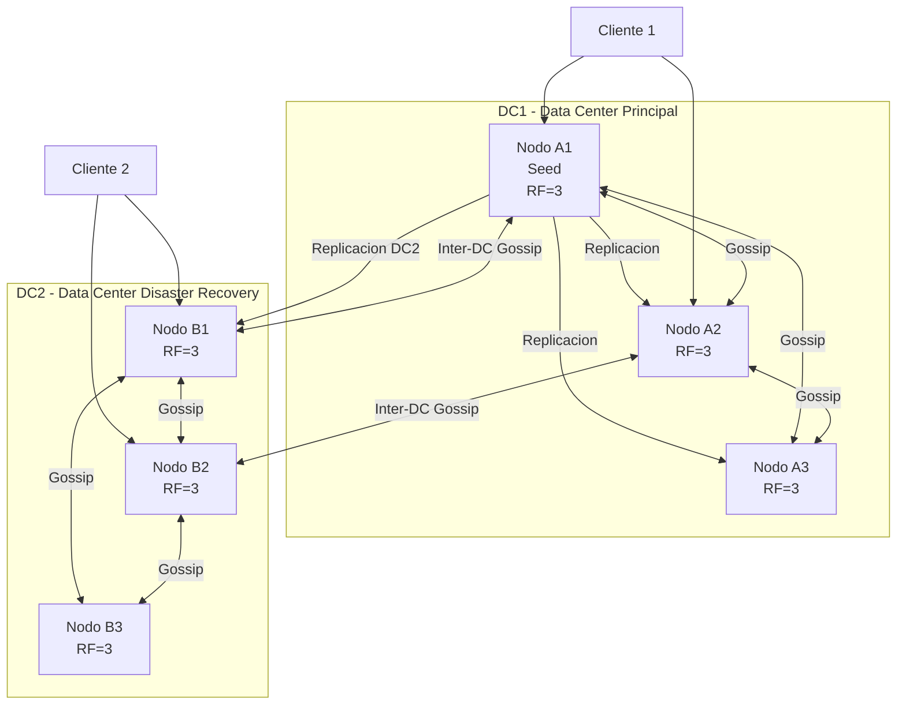
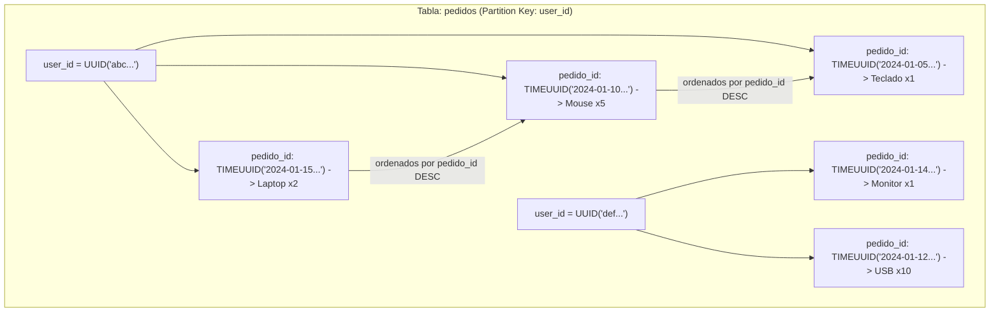

# Clase 09 — Cassandra I: Fundamentos, Arquitectura y CQL

---

## Indice

1. Marco Teorico
2. Arquitectura Cassandra
3. Instalacion
4. Modelo de Datos CQL
5. CQL (Cassandra Query Language) COMPLETO
6. Time-Series Data en Cassandra
7. Ejercicio Practico

---

## 1. Marco Teorico

### 1.1 Que es Cassandra?

Apache Cassandra es una base de datos **NoSQL distribuida, peer-to-peer**, diseñada para manejar grandes volumenes de datos en multiples centros de datos con alta disponibilidad y sin punto unico de fallo.

**Historia:**
- **2008:** Creada en Facebook por Avinash Lakshman y Prashant Malik
- **2009:** Donada a la Fundacion Apache
- **2011:** Se convierte en proyecto Apache de nivel superior (TLP)
- **Actualmente:** Version 4.1+, utilizada por las empresas mas grandes del mundo

### 1.2 Por que Cassandra?

**Caracteristicas principales:**
- **Escalabilidad horizontal masiva:** Agregar nodos sin downtime
- **Alta disponibilidad:** Sin punto unico de fallo
- **Tolerancia a fallos de red:** Partition tolerance (teorema CAP: CP/AP)
- **Escritura y lectura rapida:** O(1) en la mayoria de operaciones
- **Sin esquema rigido:** Cada tabla puede tener columnas diferentes

**Casos de uso reales:**

| Empresa | Uso |
|---------|-----|
| **Netflix** | 7+ billones de eventos/dia, recomendaciones |
| **Apple** | 200,000+ nodos, datos de dispositivos |
| **Instagram** | Datos de usuarios, feeds |
| **Discord** | Mensajes de chat (5+ billones/dia) |
| **Uber** | Datos de viajes en tiempo real |
| **Spotify** | Metadatos de musica y usuarios |
| **Samsung** | Datos de IoT y dispositivos conectados |

### 1.3 Modelo de Datos



- **Keyspace:** Contenedor de tablas (equivalente a base de datos en SQL)
- **Tabla:** Coleccion de datos con columnas (equivalente a tabla en SQL)
- **Partition Key:** Determina en que nodo se almacenan los datos
- **Clustering Key:** Define el orden dentro de una particion

### 1.4 LSM Tree: Como Cassandra Escribe Datos



**Proceso de escritura:**
1. El write llega al nodo
2. Se escribe en el **Commit Log** (para durabilidad)
3. Se escribe en el **Memtable** (cache en RAM)
4. Cuando el Memtable se llena, se hace flush a un **SSTable** en disco
5. Periodicamente, se ejecuta **Compaction** para merge SSTables

**Ventajas de LSM Tree:**
- Escrituras extremadamente rapidas (solo append)
- No hay aleatoriedad en disco (sequential writes)
- Compaction en background no bloquea escrituras

### 1.5 Distribucion de Datos con Tokens

- Cada nodo es responsable de un rango de tokens (0 a 2^127-1)
- El **partition key** se hashea con **Murmur3** para obtener un token
- El dato se almacena en el nodo responsible del rango que contiene ese token
- Los **virtual nodes (vnodes)** permiten que cada nodo physical sea responsable de multiples rangos

---

## 2. Arquitectura Cassandra

### 2.1 Peer-to-Peer Ring



**Caracteristicas:**
- **Sin master:** Todos los nodos son iguales
- **Sin punto unico de fallo:** Si un nodo cae, los demas siguen funcionando
- **Gossip Protocol:** Cada nodo se comunica con otros para mantener estado

### 2.2 Gossip Protocol

El protocolo **Gossip** es como el "chisme" de la oficina: cada nodo periodicamente comparte informacion con nodos aleatorios.

**Que informacion se comparte:**
- Estado del nodo (UP, DOWN, JOINING, LEAVING)
- Load balancing information
- Versión de Cassandra
- Datacenter y rack de pertenencia

**Funcionamiento:**
1. Cada nodo cada segundo contacta a un nodo aleatorio
2. Intercambia tabla de estados (heartbeat + getState)
3. Si un nodo no ha respondido en 10 segundos, se marca como DOWN
4. La informacion se propaga a todos los nodos en ~1-2 segundos

### 2.3 Partitioning



**Token Ring:**
- Rango: 0 a 2^127-1 (Murmur3)
- Cada nodo cubre un rango de tokens
- Virtual nodes (vnodes): cada nodo physical cubre multiples rangos (default: 256 vnodes)

**Configuracion de vnodes:**

```yaml
# cassandra.yaml
num_tokens: 256
allocate_tokens_for_local_replication_factor: 3
```

### 2.4 Replication



**Replication Factor (RF):**
- Numero de copias de cada dato en el cluster
- RF=1: Sin redundancia (peligroso)
- RF=3: Recomendado para produccion (tolera 2 fallos)
- RF=5: Para datos criticos

**Replicacion por Datacenter:**

```sql
-- Estrategia NetworkTopologyStrategy
CREATE KEYSPACE mi_keyspace WITH replication = {
    'class': 'NetworkTopologyStrategy',
    'DC1': 3,
    'DC2': 3
};
```

### 2.5 Snitch

El **Snitch** determina el datacenter y rack de cada nodo.

| Snitch | Descripcion |
|--------|-------------|
| **SimpleSnitch** | Para desarrollo (1 datacenter) |
| **GossipingPropertyFileSnitch** | Para produccion (auto-descubre) |
| **PropertyFileSnitch** | Configuracion manual por archivo |
| **RackInferringSnitch** | Basado en IP (tercera octeto = rack) |
| **DynamicEndpointSnitch** | Se adapta al rendimiento de nodos |

```properties
# cassandra-rackdc.properties (GossipingPropertyFileSnitch)
dc=数据中心1
rack=rack1
```

### 2.6 Arquitectura Completa



---

## 3. Instalacion

### 3.1 Requisitos: Java 11+

```bash
# Ubuntu/Debian
sudo apt update
sudo apt install openjdk-11-jdk -y

# Verificar
java -version
# openjdk version "11.0.20" 2023-07-18

# CentOS/RHEL
sudo yum install java-11-openjdk-devel -y

# Windows
# Descargar OpenJDK 11 desde https://adoptium.net/
# Configurar JAVA_HOME y agregar al PATH
```

### 3.2 Instalacion en Ubuntu/Debian

```bash
# Agregar repositorio de Apache Cassandra
echo "deb https://debian.cassandra.apache.org 41x main" | \
    sudo tee /etc/apt/sources.list.d/cassandra.sources.list

# Agregar clave GPG
curl https://downloads.apache.org/cassandra/KEYS | sudo apt-key add -

# Instalar
sudo apt update
sudo apt install cassandra -y

# Iniciar y habilitar
sudo systemctl start cassandra
sudo systemctl enable cassandra

# Verificar
nodetool status
# Datacenter: datacenter1
# ===============
# Status=Up/Down
# |/ State=Normal/Leaving/Joining/Moving
# --  Address    Load       Tokens  Owns   Host ID     Rack
# UN  127.0.0.1  100 KB     256     100%   abc-123     rack1
```

### 3.3 Instalacion en Windows

```bash
# 1. Descargar binario de Cassandra desde
# https://cassandra.apache.org/download/

# 2. Extraer a C:\cassandra

# 3. Configurar JAVA_HOME
set JAVA_HOME=C:\Program Files\OpenJDK\jdk-11
set PATH=%JAVA_HOME%in;%PATH%

# 4. Configurar Cassandra
# Editar C:\cassandra\conf\cassandra.yaml:
#   - cluster_name: 'Test Cluster'
#   - listen_address: 127.0.0.1
#   - rpc_address: 127.0.0.1
#   - seeds: 127.0.0.1

# 5. Iniciar
cd C:\cassandra\bin
cassandra.bat

# 6. En otra terminal, verificar
cqlsh localhost 9042
```

### 3.4 Instalacion con Docker

```bash
# Cassandra individual
docker run -d \
    --name cassandra-single \
    -p 9042:9042 \
    -p 7199:7199 \
    cassandra:4.1

# Esperar a que este listo (puede tardar 1-2 minutos)
docker exec cassandra-single nodetool status
```

### 3.5 docker-compose.yml para Cluster de 3 Nodos

```yaml
version: '3.8'

services:
  cassandra-1:
    image: cassandra:4.1
    container_name: cassandra-1
    ports:
      - "9042:9042"
      - "7199:7199"
    environment:
      CASSANDRA_CLUSTER_NAME: "MiCluster"
      CASSANDRA_DC: DC1
      CASSANDRA_RACK: rack1
      CASSANDRA_SEEDS: cassandra-1,cassandra-2
      CASSANDRA_ENDPOINT_SNITCH: GossipingPropertyFileSnitch
      CASSANDRA_NUM_TOKENS: 256
    volumes:
      - cassandra-1-data:/var/lib/cassandra
    networks:
      - cassandra-net
    restart: unless-stopped

  cassandra-2:
    image: cassandra:4.1
    container_name: cassandra-2
    ports:
      - "9043:9042"
    environment:
      CASSANDRA_CLUSTER_NAME: "MiCluster"
      CASSANDRA_DC: DC1
      CASSANDRA_RACK: rack2
      CASSANDRA_SEEDS: cassandra-1,cassandra-2
      CASSANDRA_ENDPOINT_SNITCH: GossipingPropertyFileSnitch
      CASSANDRA_NUM_TOKENS: 256
    volumes:
      - cassandra-2-data:/var/lib/cassandra
    depends_on:
      - cassandra-1
    networks:
      - cassandra-net
    restart: unless-stopped

  cassandra-3:
    image: cassandra:4.1
    container_name: cassandra-3
    ports:
      - "9044:9042"
    environment:
      CASSANDRA_CLUSTER_NAME: "MiCluster"
      CASSANDRA_DC: DC1
      CASSANDRA_RACK: rack3
      CASSANDRA_SEEDS: cassandra-1,cassandra-2
      CASSANDRA_ENDPOINT_SNITCH: GossipingPropertyFileSnitch
      CASSANDRA_NUM_TOKENS: 256
    volumes:
      - cassandra-3-data:/var/lib/cassandra
    depends_on:
      - cassandra-1
    networks:
      - cassandra-net
    restart: unless-stopped

volumes:
  cassandra-1-data:
  cassandra-2-data:
  cassandra-3-data:

networks:
  cassandra-net:
    driver: bridge
```

```bash
# Iniciar el cluster
docker-compose up -d

# Esperar a que todos los nodos esten listos (2-3 minutos)
echo "Esperando a que los nodos esten listos..."
sleep 120

# Verificar estado del cluster
docker exec cassandra-1 nodetool status
# Datacenter: DC1
# ===============
# Status=Up/Down
# |/
# --  Address    Load       Tokens  Owns   Host ID     Rack
# UN  10.0.0.2   256 KB     256     33%    ...         rack2
# UN  10.0.0.3   256 KB     256     33%    ...         rack3
# UN  10.0.0.1   256 KB     256     34%    ...         rack1

# Conectar con cqlsh
docker exec -it cassandra-1 cqlsh
# Connected to MiCluster at 127.0.0.1:9042
# [cqlsh 6.1.0 | Cassandra 4.1.3 | CQL spec 3.4.6 | Native protocol v5]
# Use HELP for help.
# cqlsh>
```

### 3.6 Verificar Instalacion

```bash
# Ver version de Cassandra
docker exec cassandra-1 cqlsh -e "DESCRIBE CLUSTER;"
# Cluster: MiCluster
# Partitioner: Murmur3Partitioner
# Snitch: GossipingPropertyFileSnitch

# Ver nodos
docker exec cassandra-1 nodetool status

# Ver info del nodo
docker exec cassandra-1 nodetool info
# ID                     : abc-def-123
# Gossip active          : true
# Native Transport active: true
# Load                   : 256 KB
# Thrift Active          : false

# Ver tablas del sistema
docker exec cassandra-1 cqlsh -e "DESCRIBE KEYSPACES;"
# system  system_auth  system_distributed  system_traces

# Test basico
docker exec cassandra-1 cqlsh -e "
    CREATE KEYSPACE test WITH replication = {'class': 'SimpleStrategy', 'replication_factor': 1};
    CREATE TABLE test.hello (id int PRIMARY KEY, msg text);
    INSERT INTO test.hello (id, msg) VALUES (1, 'Hola Cassandra!');
    SELECT * FROM test.hello;
"
#  id | msg
# ----+----------------
#   1 | Hola Cassandra!
```

---

## 4. Modelo de Datos CQL

### 4.1 Keyspace

```sql
-- Keyspace con SimpleStrategy (1 datacenter)
CREATE KEYSPACE mi_tienda
WITH replication = {
    'class': 'SimpleStrategy',
    'replication_factor': 3
}
AND durable_writes = true;

-- Keyspace con NetworkTopologyStrategy (multi-datacenter)
CREATE KEYSPACE mi_tienda_produccion
WITH replication = {
    'class': 'NetworkTopologyStrategy',
    'DC1': 3,
    'DC2': 2
}
AND durable_writes = true;

-- Usar keyspace
USE mi_tienda;

-- Verificar keyspace actual
DESCRIBE KEYSPACE mi_tienda;

-- Modificar keyspace
ALTER KEYSPACE mi_tienda
WITH replication = {
    'class': 'SimpleStrategy',
    'replication_factor': 5
};

-- Eliminar keyspace
DROP KEYSPACE IF EXISTS mi_tienda;
```

### 4.2 Tablas: Partition Key vs Clustering Key

```sql
-- ============================================
-- EJEMPLO 1: Tabla simple con Partition Key
-- ============================================
CREATE TABLE usuarios (
    user_id UUID PRIMARY KEY,
    nombre TEXT,
    email TEXT,
    fecha_registro TIMESTAMP
);
-- user_id es la Partition Key
-- Todos los campos son "regular columns"

-- ============================================
-- EJEMPLO 2: Tabla con Clustering Key
-- ============================================
CREATE TABLE pedidos (
    user_id UUID,
    pedido_id TIMEUUID,
    producto TEXT,
    cantidad INT,
    precio DECIMAL,
    estado TEXT,
    PRIMARY KEY (user_id, pedido_id)
) WITH CLUSTERING ORDER BY (pedido_id DESC);
-- user_id es la Partition Key
-- pedido_id es la Clustering Key
-- Los datos se ordenan por pedido_id DESC dentro de cada user_id

-- ============================================
-- EJEMPLO 3: Tabla con Multiple Clustering Keys
-- ============================================
CREATE TABLE mensajes_chat (
    canal_id UUID,
    usuario TEXT,
    fecha_hora TIMESTAMP,
    mensaje TEXT,
    PRIMARY KEY (canal_id, fecha_hora, usuario)
) WITH CLUSTERING ORDER BY (fecha_hora DESC, usuario ASC);
-- canal_id: Partition Key
-- fecha_hora, usuario: Clustering Keys
-- Dentro de un canal, los mensajes se ordenan por fecha DESC, luego por usuario ASC

-- ============================================
-- EJEMPLO 4: Counter Table
-- ============================================
CREATE TABLE contadores (
    entidad TEXT,
    tipo TEXT,
    valor COUNTER,
    PRIMARY KEY (entidad, tipo)
);
-- Para contadores, NO se puede usar IF NOT EXISTS en INSERT
```

### 4.3 Diagrama de Particion



**Regla de oro:** La Partition Key (user_id) determina EN QUE NODO estan los datos. Las Clustering Keys determinan EL ORDEN dentro de ese nodo.

### 4.4 Tipos de Datos

| Tipo | Descripcion | Ejemplo |
|------|-------------|---------|
| **text** | Texto variable | 'Hola mundo' |
| **ascii** | Texto ASCII | 'hello' |
| **varchar** | Texto UTF-8 | 'texto unicode' |
| **int** | Entero 32 bits | 42 |
| **bigint** | Entero 64 bits | 1234567890 |
| **smallint** | Entero 16 bits | 100 |
| **tinyint** | Entero 8 bits | 10 |
| **float** | Flotante 32 bits | 3.14 |
| **double** | Flotante 64 bits | 3.14159265 |
| **decimal** | Decimal preciso | 99.99 |
| **boolean** | Verdadero/Falso | true |
| **timestamp** | Fecha y hora | '2024-01-15T10:30:00Z' |
| **date** | Fecha sin hora | '2024-01-15' |
| **time** | Hora sin fecha | '10:30:00' |
| **uuid** | UUID estandar | 550e8400-e29b-41d4-a716-446655440000 |
| **timeuuid** | UUID con timestamp | (auto-generado con UNIQUE) |
| **blob** | Datos binarios | 0x48656c6c6f |
| **list** | Lista ordenada, duplicados | ['python', 'java', 'python'] |
| **set** | Set sin duplicados, sin orden | {'python', 'java'} |
| **map** | Mapa key-value | {'clave': 'valor'} |
| **tuple** | Tupla fija | ('calle', 'ciudad', 12345) |
| **udt** | User Defined Type | (ver abajo) |

```sql
-- User Defined Type (UDT)
CREATE TYPE direccion (
    calle TEXT,
    ciudad TEXT,
    codigo_postal TEXT,
    pais TEXT
);

-- Usar UDT en tabla
CREATE TABLE usuarios_completos (
    user_id UUID PRIMARY KEY,
    nombre TEXT,
    direcciones FROZEN<list<direccion>>,
    metadata MAP<TEXT, TEXT>
);
```

### 4.5 ALTER y DROP Table

```sql
-- Agregar columna
ALTER TABLE usuarios ADD telefono TEXT;

-- Cambiar tipo de columna
ALTER TABLE usuarios ALTER telefono TYPE VARCHAR;

-- Eliminar columna
ALTER TABLE usuarios DROP telefono;

-- Agregar columna con condicion (solo si no existe)
ALTER TABLE usuarios ADD IF NOT EXISTS telefono TEXT;

-- Eliminar tabla
DROP TABLE IF EXISTS usuarios;

-- Truncar tabla (elimina datos, mantiene estructura)
TRUNCATE TABLE usuarios;
```

---

## 5. CQL (Cassandra Query Language) COMPLETO

### 5.1 DDL (Data Definition Language)

```sql
-- Crear keyspace
CREATE KEYSPACE IF NOT EXISTS tienda
WITH replication = {'class': 'SimpleStrategy', 'replication_factor': 3};

USE tienda;

-- Crear tabla de productos
CREATE TABLE IF NOT EXISTS productos (
    categoria TEXT,
    producto_id UUID,
    nombre TEXT,
    precio DECIMAL,
    stock INT,
    descripcion TEXT,
    created_at TIMESTAMP,
    tags SET<TEXT>,
    PRIMARY KEY (categoria, producto_id)
) WITH CLUSTERING ORDER BY (producto_id DESC)
AND compaction = {'class': 'SizeTieredCompactionStrategy'}
AND gc_grace_seconds = 8640000;

-- Crear indice secundario
CREATE INDEX IF NOT EXISTS idx_producto_nombre
ON productos (nombre);

CREATE INDEX IF NOT EXISTS idx_producto_precio
ON productos (precio);

-- Crear Materialized View
CREATE MATERIALIZED VIEW productos_por_precio AS
    SELECT * FROM productos
    WHERE precio IS NOT NULL
    AND producto_id IS NOT NULL
    AND categoria IS NOT NULL
    PRIMARY KEY (precio, producto_id, categoria)
    WITH CLUSTERING ORDER BY (producto_id DESC);
```

### 5.2 DML (Data Manipulation Language)

```sql
USE tienda;

-- ============================================
-- INSERT
-- ============================================

-- Insert basico
INSERT INTO productos (categoria, producto_id, nombre, precio, stock, created_at, tags)
VALUES (
    'Electronica',
    uuid(),
    'Laptop Gamer',
    1299.99,
    25,
    toTimestamp(now()),
    {'gaming', 'laptop', 'nvidia'}
);

-- Insert con IF NOT EXISTS (Lightweight Transaction)
INSERT INTO productos (categoria, producto_id, nombre, precio, stock, created_at, tags)
VALUES (
    'Electronica',
    550e8400-e29b-41d4-a716-446655440000,
    'Laptop Gamer',
    1299.99,
    25,
    toTimestamp(now()),
    {'gaming'}
) IF NOT EXISTS;
-- RetornaApplied (true si se inserto, false si ya existia)

-- Insertar multiples filas
BEGIN BATCH
    INSERT INTO productos (categoria, producto_id, nombre, precio, stock, created_at)
    VALUES ('Electronica', uuid(), 'Mouse RGB', 29.99, 100, toTimestamp(now()));
    INSERT INTO productos (categoria, producto_id, nombre, precio, stock, created_at)
    VALUES ('Electronica', uuid(), 'Teclado Mecanico', 89.99, 50, toTimestamp(now()));
    INSERT INTO productos (categoria, producto_id, nombre, precio, stock, created_at)
    VALUES ('Electronica', uuid(), 'Monitor 4K', 449.99, 15, toTimestamp(now()));
APPLY BATCH;

-- ============================================
-- UPDATE
-- ============================================

-- Update basico
UPDATE productos
SET stock = 20,
    precio = 1199.99
WHERE categoria = 'Electronica'
AND producto_id = 550e8400-e29b-41d4-a716-446655440000;

-- Update con incremento de counter
-- (requiere tabla de counters)

-- Update de collection
UPDATE productos
SET tags = tags + {'nuevo-tag'}
WHERE categoria = 'Electronica'
AND producto_id = 550e8400-e29b-41d4-a716-446655440000;

-- Update con ADD (list/set)
UPDATE productos
SET tags = tags + {'promo', 'oferta'}
WHERE categoria = 'Electronica'
AND producto_id = 550e8400-e29b-41d4-a716-446655440000;

-- Update con REMOVE
UPDATE productos
REMOVE tags
WHERE categoria = 'Electronica'
AND producto_id = 550e8400-e29b-41d4-a716-446655440000;

-- Update con IF EXISTS (LWT)
UPDATE productos
SET stock = 18
WHERE categoria = 'Electronica'
AND producto_id = 550e8400-e29b-41d4-a716-446655440000
IF EXISTS;

-- ============================================
-- DELETE
-- ============================================

-- Delete una columna
DELETE descripcion
FROM productos
WHERE categoria = 'Electronica'
AND producto_id = 550e8400-e29b-41d4-a716-446655440000;

-- Delete una fila completa
DELETE FROM productos
WHERE categoria = 'Electronica'
AND producto_id = 550e8400-e29b-41d4-a716-446655440000;

-- Delete con IF EXISTS (LWT)
DELETE FROM productos
WHERE categoria = 'Electronica'
AND producto_id = 550e8400-e29b-41d4-a716-446655440000
IF EXISTS;

-- Delete con TTL (auto-eliminacion)
INSERT INTO productos (categoria, producto_id, nombre, precio, stock, created_at)
VALUES ('Temporal', uuid(), 'Oferta 24h', 99.99, 10, toTimestamp(now()))
USING TTL 86400;  -- 24 horas

-- Ver TTL restante
SELECT TTL(nombre) FROM productos
WHERE categoria = 'Temporal'
AND producto_id = ...;
```

### 5.3 SELECT y Consultas

```sql
USE tienda;

-- SELECT basico
SELECT * FROM productos WHERE categoria = 'Electronica';

-- Seleccionar columnas especificas
SELECT nombre, precio, stock FROM productos
WHERE categoria = 'Electronica';

-- Filtrar por Clustering Key (debe seguir el orden)
SELECT * FROM productos
WHERE categoria = 'Electronica'
AND producto_id > 550e8400-e29b-41d4-a716-446655440000;

-- Filtrar por rango de clustering key
SELECT * FROM productos
WHERE categoria = 'Electronica'
AND producto_id >= minuuid()
AND producto_id <= maxuuid();

-- LIMIT
SELECT * FROM productos
WHERE categoria = 'Electronica'
LIMIT 10;

-- ORDER BY (solo en clustering key, solo funciona en ASC/DESC opuesto al CLUSTERING ORDER)
SELECT * FROM productos
WHERE categoria = 'Electronica'
ORDER BY producto_id ASC;  -- La tabla tiene DESC, esta consulta ordena ASC

-- Contar filas
SELECT COUNT(*) FROM productos WHERE categoria = 'Electronica';

-- ALLOW FILTERING (CUIDADO: anti-pattern, escanea todos los nodos)
-- Solo usar en tablas pequenas o para debugging
SELECT * FROM productos WHERE precio < 100 ALLOW FILTERING;

-- Consistency Level
SELECT * FROM productos
WHERE categoria = 'Electronica'
USING CONSISTENCY LOCAL_QUORUM;

-- IN (solo en partition key, con precaucion)
SELECT * FROM productos
WHERE categoria IN ('Electronica', 'Accesorios');
```

### 5.4 BATCH

```sql
-- ============================================
-- LOGGED BATCH (default)
-- ============================================
-- Garantiza atomicidad en un solo partition key
-- recomendado para operaciones en la misma particion
BEGIN BATCH
    INSERT INTO productos (categoria, producto_id, nombre, precio, stock)
    VALUES ('Electronica', uuid(), 'Laptop', 999.99, 10);
    UPDATE productos
    SET stock = stock - 1
    WHERE categoria = 'Electronica'
    AND producto_id = 550e8400-e29b-41d4-a716-446655440000;
APPLY BATCH;

-- ============================================
-- UNLOGGED BATCH
-- ============================================
-- No garantiza atomicidad, pero es mas rapido
-- Usar cuando las operaciones son en diferentes partition keys
BEGIN UNLOGGED BATCH
    INSERT INTO productos (categoria, producto_id, nombre, precio)
    VALUES ('Electronica', uuid(), 'Laptop', 999.99);
    INSERT INTO productos (categoria, producto_id, nombre, precio)
    VALUES ('Accesorios', uuid(), 'Mouse', 29.99);
APPLY BATCH;

-- ============================================
-- Counter BATCH
-- ============================================
BEGIN BATCH
    UPDATE contadores SET valor = valor + 1
    WHERE entidad = 'producto' AND tipo = 'vistas';
    UPDATE contadores SET valor = valor + 1
    WHERE entidad = 'producto' AND tipo = 'compras';
APPLY BATCH;
```

### 5.5 Pagination

```sql
-- Automatic paging (cqlsh maneja automaticamente)
SELECT * FROM productos WHERE categoria = 'Electronica';

-- Token-based pagination
SELECT * FROM productos
WHERE token(categoria) > token('Electronica')
LIMIT 10;

-- Paging state (en Python driver)
-- cursor = session.execute("SELECT * FROM productos", paging_size=100)
-- for row in cursor:
--     print(row)
```

### 5.6 Lightweight Transactions (LWT)

```sql
-- IF NOT EXISTS: Solo insertar si no existe
INSERT INTO usuarios (user_id, nombre, email)
VALUES (uuid(), 'Juan', 'juan@email.com')
IF NOT EXISTS;
-- Applied: true/false

-- IF EXISTS: Solo actualizar si existe
UPDATE usuarios
SET nombre = 'Juan Perez'
WHERE user_id = 550e8400-e29b-41d4-a716-446655440000
IF EXISTS;

-- IF con condicion
UPDATE productos
SET stock = stock - 1
WHERE categoria = 'Electronica'
AND producto_id = 550e8400-e29b-41d4-a716-446655440000
IF stock > 0;

-- DELETE condicional
DELETE FROM productos
WHERE categoria = 'Electronica'
AND producto_id = 550e8400-e29b-41d4-a716-446655440000
IF stock = 0;
```

**Nota sobre LWT:**
- Usa el protocolo **Paxos** internamente
- Implica 2 round-trips adicionales (prepare, propose, commit)
- Solo usar cuando sea estrictamente necesario
- No usar para operaciones de alto volumen

---

## 6. Time-Series Data en Cassandra

### 6.1 Patron de Modelado para Series de Tiempo

```sql
-- ============================================
-- Tabla de metricas de servidor
-- ============================================
CREATE TABLE metricas_servidor (
    servidor_id TEXT,
    fecha DATE,
    hora TIME,
    metrica TEXT,
    valor DOUBLE,
    PRIMARY KEY ((servidor_id, fecha), hora, metrica)
) WITH CLUSTERING ORDER BY (hora DESC, metrica ASC)
AND compaction = {
    'class': 'TimeWindowCompactionStrategy',
    'compaction_window_unit': 'DAYS',
    'compaction_window_size': 1
}
AND default_time_to_live = 2592000;  -- 30 dias TTL

-- Partition Key compuesta: (servidor_id, fecha)
-- Cada servidor por dia es una particion
-- Dentro de la particion, los datos se ordenan por hora DESC
```

### 6.2 Insercion de Metricas

```sql
USE tienda;

-- Insertar metricas simuladas
INSERT INTO metricas_servidor (servidor_id, fecha, hora, metrica, valor)
VALUES ('srv-001', '2024-01-15', '10:30:00', 'cpu_usage', 75.5);

INSERT INTO metricas_servidor (servidor_id, fecha, hora, metrica, valor)
VALUES ('srv-001', '2024-01-15', '10:30:00', 'memory_usage', 62.3);

INSERT INTO metricas_servidor (servidor_id, fecha, hora, metrica, valor)
VALUES ('srv-001', '2024-01-15', '10:30:00', 'disk_io', 1250000.0);

INSERT INTO metricas_servidor (servidor_id, fecha, hora, metrica, valor)
VALUES ('srv-001', '2024-01-15', '11:00:00', 'cpu_usage', 82.1);

INSERT INTO metricas_servidor (servidor_id, fecha, hora, metrica, valor)
VALUES ('srv-001', '2024-01-15', '11:00:00', 'memory_usage', 68.7);

-- Usando TTL por defecto (30 dias)
INSERT INTO metricas_servidor (servidor_id, fecha, hora, metrica, valor)
VALUES ('srv-001', '2024-01-15', '12:00:00', 'cpu_usage', 45.2)
USING TTL 86400;  -- 24 horas en este caso
```

### 6.3 Consultas de Series de Tiempo

```sql
-- Obtener todas las metricas de un servidor en un dia
-- (USANDO la Partition Key completa -> rapido)
SELECT * FROM metricas_servidor
WHERE servidor_id = 'srv-001'
AND fecha = '2024-01-15';

-- Obtener metricas de CPU en un rango de horas
SELECT hora, valor FROM metricas_servidor
WHERE servidor_id = 'srv-001'
AND fecha = '2024-01-15'
AND metrica = 'cpu_usage'
AND hora >= '08:00:00'
AND hora <= '18:00:00';

-- Obtener ultimas metricas (ya ordenadas por hora DESC)
SELECT * FROM metricas_servidor
WHERE servidor_id = 'srv-001'
AND fecha = '2024-01-15'
LIMIT 10;

-- Obtener metricas de multiples dias
-- IMPORTANTE: Esto requiere ALLOW FILTERING o queries separadas
-- Cassandra NO permite scanner sin partition key eficientemente
SELECT * FROM metricas_servidor
WHERE servidor_id = 'srv-001'
AND fecha = '2024-01-15'
AND hora >= '08:00:00'
AND hora <= '18:00:00'
AND metrica = 'cpu_usage';
```

### 6.4 TimeWindowCompactionStrategy

```sql
-- TimeWindowCompactionStrategy (TWCS) es ideal para time series
-- Agrupa SSTables por ventana de tiempo
-- Los SSTables antiguos se合并 automaticamente

ALTER TABLE metricas_servidor
WITH compaction = {
    'class': 'TimeWindowCompactionStrategy',
    'compaction_window_unit': 'HOURS',
    'compaction_window_size': 4
};

-- Opciones de ventana:
-- MINUTES, HOURS, DAYS, WEEKS, MONTHS
```

### 6.5 TTL para Datos Temporales

```sql
-- Establecer TTL por defecto en la tabla
CREATE TABLE metricas_temporales (
    sensor_id TEXT,
    timestamp TIMESTAMP,
    valor DOUBLE,
    PRIMARY KEY (sensor_id, timestamp)
) WITH CLUSTERING ORDER BY (timestamp DESC)
AND default_time_to_live = 86400;  -- 24 horas

-- TTL por operacion
INSERT INTO metricas_temporales (sensor_id, timestamp, valor)
VALUES ('sensor-1', toTimestamp(now()), 23.5)
USING TTL 3600;  -- 1 hora

-- Ver TTL restante
SELECT sensor_id, valor, TTL(valor) as ttl_restante
FROM metricas_temporales
WHERE sensor_id = 'sensor-1';
```

---

## 7. Ejercicio Practico

### Ejercicio 1: Instalar Cassandra con Docker (3 nodos)

**Instrucciones:**
1. Crear docker-compose.yml con 3 nodos de Cassandra
2. Iniciar el cluster
3. Verificar con `nodetool status` que los 3 nodos estan UP
4. Conectar con `cqlsh` y ejecutar `DESCRIBE CLUSTER`

**Resultado esperado:**
```
Datacenter: DC1
===============
Status=Up/Down
|/
--  Address    Load       Tokens  Owns   Host ID     Rack
UN  10.0.0.2   ...        256     33%    ...         rack2
UN  10.0.0.3   ...        256     33%    ...         rack3
UN  10.0.0.1   ...        256     34%    ...         rack1
```

### Ejercicio 2: Crear Keyspace con RF=3

```sql
CREATE KEYSPACE IF NOT EXISTS tienda_online
WITH replication = {
    'class': 'NetworkTopologyStrategy',
    'DC1': 3
}
AND durable_writes = true;

USE tienda_online;
```

### Ejercicio 3: Crear Tabla de Productos

```sql
CREATE TABLE productos (
    categoria TEXT,
    producto_id UUID,
    nombre TEXT,
    precio DECIMAL,
    stock INT,
    descripcion TEXT,
    created_at TIMESTAMP,
    tags SET<TEXT>,
    PRIMARY KEY (categoria, producto_id)
) WITH CLUSTERING ORDER BY (producto_id DESC);
```

### Ejercicio 4: Insertar 100 Productos

```python
# Ejecutar con Python driver de Cassandra
from cassandra.cluster import Cluster
from cassandra.query import BatchStatement
import uuid
import random
from datetime import datetime

cluster = Cluster(['127.0.0.1'])
session = cluster.connect('tienda_online')

categorias = ['Electronica', 'Accesorios', 'Ropa', 'Hogar', 'Deportes']
productos_ejemplo = [
    ('Laptop', 999.99), ('Mouse', 29.99), ('Teclado', 79.99),
    ('Monitor', 449.99), ('Auriculares', 149.99), ('Camiseta', 24.99),
    ('Zapatillas', 89.99), ('Sillon', 299.99), ('Pelota', 19.99),
]

insert_stmt = session.prepare(
    "INSERT INTO productos (categoria, producto_id, nombre, precio, stock, created_at, tags) "
    "VALUES (?, ?, ?, ?, ?, ?, ?)"
)

batch = BatchStatement()
for i in range(100):
    cat = random.choice(categorias)
    nombre, precio = random.choice(productos_ejemplo)
    stock = random.randint(0, 200)
    tags = set(random.sample(['nuevo', 'oferta', 'popular', 'limitado', 'exclusivo'], k=2))
    batch.add(insert_stmt, (cat, uuid.uuid4(), f"{nombre} {i}", precio + random.uniform(-10, 10), stock, datetime.now(), tags))

    if (i + 1) % 25 == 0:
        session.execute(batch)
        batch = BatchStatement()
        print(f"  Insertados {i+1}/100 productos...")

print("  100 productos insertados correctamente")
```

### Ejercicio 5: Consultar por Partition Key

```sql
-- Buscar todos los productos de una categoria
SELECT nombre, precio, stock FROM productos
WHERE categoria = 'Electronica'
LIMIT 10;

-- Buscar un producto especifico
SELECT * FROM productos
WHERE categoria = 'Electronica'
AND producto_id = 550e8400-e29b-41d4-a716-446655440000;
```

### Ejercicio 6: Consultar con Filtros de Clustering Key

```sql
-- Obtener productos de una categoria con filtro por ID
SELECT nombre, precio FROM productos
WHERE categoria = 'Electronica'
AND producto_id > 550e8400-e29b-41d4-a716-446655440000
LIMIT 5;
```

### Ejercicio 7: Tabla Time-Series de Metricas

```sql
CREATE TABLE metricas_servidor (
    servidor_id TEXT,
    fecha DATE,
    hora TIME,
    metrica TEXT,
    valor DOUBLE,
    PRIMARY KEY ((servidor_id, fecha), hora, metrica)
) WITH CLUSTERING ORDER BY (hora DESC, metrica ASC)
AND default_time_to_live = 2592000;
```

### Ejercicio 8: Insertar 1000 Metricas Simuladas

```python
import random
from datetime import datetime, timedelta

insert_stmt = session.prepare(
    "INSERT INTO metricas_servidor (servidor_id, fecha, hora, metrica, valor) "
    "VALUES (?, ?, ?, ?, ?)"
)

batch = BatchStatement()
base_time = datetime(2024, 1, 15, 0, 0, 0)

for i in range(1000):
    offset = timedelta(minutes=random.randint(0, 1439))
    ts = base_time + offset
    metrica = random.choice(['cpu_usage', 'memory_usage', 'disk_io', 'network_in', 'network_out'])
    valor = random.uniform(0, 100) if 'usage' in metrica else random.uniform(1000000, 5000000)
    servidor = f"srv-{random.choice(['001', '002', '003'])}"

    batch.add(insert_stmt, (servidor, ts.date(), ts.time(), metrica, valor))

    if (i + 1) % 100 == 0:
        session.execute(batch)
        batch = BatchStatement()
        print(f"  Insertadas {i+1}/1000 metricas...")

print("  1000 metricas insertadas")
```

### Ejercicio 9: Consultar Ultimas 24 Horas

```sql
-- Obtener metricas de CPU de srv-001 en el dia 15 de enero
SELECT hora, valor FROM metricas_servidor
WHERE servidor_id = 'srv-001'
AND fecha = '2024-01-15'
AND metrica = 'cpu_usage';

-- Obtener las ultimas 10 metricas (ya ordenadas por hora DESC)
SELECT * FROM metricas_servidor
WHERE servidor_id = 'srv-001'
AND fecha = '2024-01-15'
LIMIT 10;

-- Obtener metricas en un rango de horas
SELECT hora, metrica, valor FROM metricas_servidor
WHERE servidor_id = 'srv-001'
AND fecha = '2024-01-15'
AND hora >= '08:00:00'
AND hora <= '12:00:00'
AND metrica = 'cpu_usage';
```

**Criterios de evaluacion:**
- [ ] Cluster de 3 nodos funcionando
- [ ] Keyspace con RF=3 creado
- [ ] Tabla de productos con Partition Key y Clustering Key
- [ ] 100 productos insertados
- [ ] Consultas por Partition Key ejecutadas correctamente
- [ ] Consultas con filtros de Clustering Key funcionando
- [ ] Tabla time-series con TTL configurado
- [ ] 1000 metricas insertadas
- [ ] Consultas de ultimas 24 horas ejecutadas
