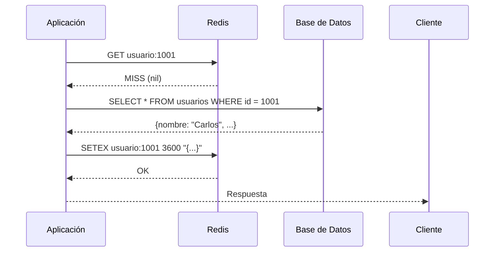
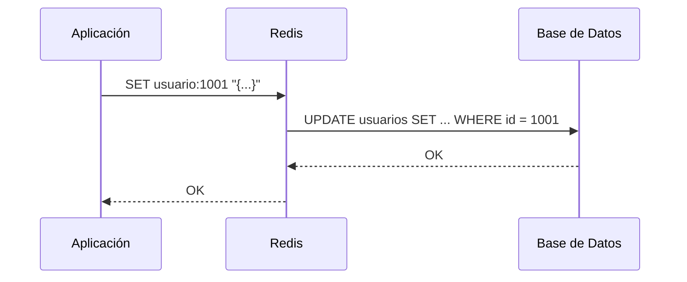

# Clase 9 — Redis: Caché y Almacenamiento Clave-Valor

## 1. Instalación y Configuración de Redis

### Ubuntu/Debian

```bash
sudo apt update
sudo apt install -y redis-server

sudo systemctl start redis-server
sudo systemctl enable redis-server
sudo systemctl status redis-server
```

### Windows (con WSL o Redis para Windows)

```bash
# WSL
sudo apt update
sudo apt install -y redis-server
redis-server
```

### Docker

```bash
docker run -d \
  --name redis-clase9 \
  -p 6379:6379 \
  redis:7-alpine

# Con persistencia
docker run -d \
  --name redis-clase9 \
  -p 6379:6379 \
  -v redis-data:/data \
  redis:7-alpine \
  redis-server --appendonly yes
```

### macOS

```bash
brew install redis
brew services start redis
```

## 2. Configuración (redis.conf)

```conf
# Red
bind 127.0.0.1
port 6379
protected-mode yes

# Persistencia
appendonly yes
appendfilename "appendonly.aof"
appendfsync everysec

# Memoria
maxmemory 256mb
maxmemory-policy allkeys-lru

# Logs
loglevel notice
logfile "/var/log/redis/redis-server.log"

# Seguridad
requirepass mi_password_secreto
```

## 3. Tipos de Datos

### 3.1 Strings

```redis
SET nombre "Carlos"
GET nombre
# → "Carlos"

# Operaciones numéricas
SET contador 10
INCR contador
# → 11
INCRBY contador 5
# → 16

SET precio 99.99
GET precio
# → "99.99"
```

### 3.2 Hashes

```redis
HSET usuario:1001 nombre "Carlos" email "carlos@ejemplo.com" edad 35
HGET usuario:1001 nombre
# → "Carlos"

HGETALL usuario:1001
# → 1) "nombre" 2) "Carlos" 3) "email" 4) "carlos@ejemplo.com" ...

HMSET usuario:1002 nombre "Ana" email "ana@ejemplo.com" edad 28
HINCRBY usuario:1001 visitas 1
```

### 3.3 Lists

```redis
LPUSH cola:emails "email1@ejemplo.com" "email2@ejemplo.com"
RPUSH cola:emails "email3@ejemplo.com"

LLEN cola:emails
# → 3

LPOP cola:emails
# → "email1@ejemplo.com"

RPOP cola:emails
# → "email3@ejemplo.com"

LRANGE cola:emails 0 -1
# → todos los elementos
```

### 3.4 Sets

```redis
SADD tags:articulo:1 "mongodb" "nosql" "database"
SADD tags:articulo:2 "redis" "nosql" "cache"

# Intersección: tags comunes
SINTER tags:articulo:1 tags:articulo:2
# → "nosql"

# Unión
SUNION tags:articulo:1 tags:articulo:2
# → "mongodb", "nosql", "database", "redis", "cache"

# Diferencia
SDIFF tags:articulo:1 tags:articulo:2
# → "mongodb", "database"
```

### 3.5 Sorted Sets

```redis
ZADD leaderboard 100 "Carlos"
ZADD leaderboard 85 "Ana"
ZADD leaderboard 120 "Pedro"
ZADD leaderboard 95 "María"

# Top 3
ZREVRANGE leaderboard 0 2 WITHSCORES
# → 1) "Pedro" 2) "120" 3) "Carlos" 4) "100" 5) "María" 6) "95"

# Ranking de un usuario
ZRANK leaderboard "Ana"
# → 2 (posición)

ZSCORE leaderboard "Carlos"
# → "100"
```

### 3.6 Streams

```redis
# Agregar evento
XADD eventos:clicks * usuario "carlos" pagina "/home" timestamp 1705312800
XADD eventos:clicks * usuario "ana" pagina "/productos" timestamp 1705312801

# Leer eventos
XRANGE eventos:clicks - +

# Leer como cola (consumidores)
XREADGROUP GROUP grupo1 consumidor1 STREAMS eventos:clicks >
```

## 4. Patrones de Caché

### 4.1 Cache-Aside (Lazy Loading)



```python
import redis
import json
import psycopg2

r = redis.Redis(host='localhost', port=6379, decode_responses=True)

def get_usuario(user_id):
    cache_key = f"usuario:{user_id}"

    # Intentar caché
    data = r.get(cache_key)
    if data:
        return json.loads(data)

    # Cache miss: consultar DB
    conn = psycopg2.connect("dbname=tienda user=postgres")
    cur = conn.cursor()
    cur.execute("SELECT id, nombre, email FROM usuarios WHERE id = %s", (user_id,))
    row = cur.fetchone()
    cur.close()
    conn.close()

    if not row:
        return None

    result = {"id": row[0], "nombre": row[1], "email": row[2]}

    # Guardar en caché con TTL de 1 hora
    r.setex(cache_key, 3600, json.dumps(result))

    return result
```

### 4.2 Write-Through



```python
def update_usuario(user_id, data):
    cache_key = f"usuario:{user_id}"

    # Escribir en caché
    r.set(cache_key, json.dumps(data))

    # Escribir en DB
    conn = psycopg2.connect("dbname=tienda user=postgres")
    cur = conn.cursor()
    cur.execute(
        "UPDATE usuarios SET nombre = %s, email = %s WHERE id = %s",
        (data["nombre"], data["email"], user_id)
    )
    conn.commit()
    cur.close()
    conn.close()
```

### 4.3 Write-Behind (Write-Back)

```python
import queue
import threading
import time

write_queue = queue.Queue()

def worker_db():
    while True:
        operation = write_queue.get()
        # Batch de escrituras cada 1 segundo
        conn = psycopg2.connect("dbname=tienda user=postgres")
        cur = conn.cursor()
        for op in batch_operations(write_queue):
            cur.execute(op["sql"], op["params"])
        conn.commit()
        cur.close()
        conn.close()

threading.Thread(target=worker_db, daemon=True).start()

def write_behind_user(user_id, data):
    # Solo actualizar caché
    r.set(f"usuario:{user_id}", json.dumps(data))
    # Encolar para DB
    write_queue.put({
        "sql": "UPDATE usuarios SET nombre = %s WHERE id = %s",
        "params": (data["nombre"], user_id)
    })
```

## 5. Evicción y TTL

### Políticas de Evicción

```conf
# redis.conf
maxmemory-policy allkeys-lru       # Eliminar least recently used (cualquier key)
maxmemory-policy volatile-lru      # LRU solo en keys con TTL
maxmemory-policy allkeys-lfu       # Least frequently used
maxmemory-policy volatile-lfu      # LFU solo en keys con TTL
maxmemory-policy allkeys-random    # Aleatorio
maxmemory-policy volatile-ttl      # Eliminar las que expiran antes
maxmemory-policy noeviction        # Error al alcanzar límite (default)
```

### TTL en práctica

```redis
SET session:abc123 "datos_de_sesion"
EXPIRE session:abc123 1800
# → OK (expira en 30 min)

SET producto:1 "Laptop" EX 3600
# → EX = segundos, expira en 1 hora

TTL session:abc123
# → 1750 (segundos restantes)

PTTL producto:1
# → 3598000 (milisegundos restantes)
```

## 6. Materialized Views con Redis

### Concepto

- Precomputed query results almacenados en Redis
- Se actualizan cuando los datos cambian
- Lecturas instantáneas

### Ejemplo: Dashboard de ventas

```python
import redis
import json

r = redis.Redis(decode_responses=True)

# Materialized view: ventas por día
def actualizar_ventas_dia(fecha, monto):
    key = f"ventas:{fecha}"
    r.hincrby(key, "total", monto)
    r.hincrby(key, "cantidad", 1)
    r.expire(key, 86400 * 90)  # 90 días de retención

# Materialized view: top productos del mes
def actualizar_top_productos(producto_id, monto):
    r.zincrby("top_productos:2024-01", monto, producto_id)

# Obtener resultados precomputados (O(1))
def get_ventas_dia(fecha):
    data = r.hgetall(f"ventas:{fecha}")
    if not data:
        return {"total": 0, "cantidad": 0}
    return {"total": int(data["total"]), "cantidad": int(data["cantidad"])}

def get_top_productos(mes, limit=10):
    return r.zrevrange(f"top_productos:{mes}", 0, limit-1, withscores=True)
```

## 7. Redis como Message Broker: Pub/Sub

```redis
# Suscriptor
SUBSCRIBE canal:notificaciones
# → Waiting for messages...

# Publicador
PUBLISH canal:notificaciones "Nuevo pedido #1234"
# → (integer) 1 (cantidad de suscriptores)
```

```python
import redis
import threading

r = redis.Redis(decode_responses=True)

# Suscriptor
def subscriber():
    pubsub = r.pubsub()
    pubsub.subscribe("canal:notificaciones")
    for message in pubsub.listen():
        if message["type"] == "message":
            print(f"Recibido: {message['data']}")

threading.Thread(target=subscriber, daemon=True).start()

# Publicador
r.publish("canal:notificaciones", "Nuevo pedido #1234")
```

## 8. Ejercicio Práctico: Sistema de Caché para API REST

### Flask + Redis + MongoDB

```python
from flask import Flask, jsonify
import redis
import json
from pymongo import MongoClient

app = Flask(__name__)
r = redis.Redis(decode_responses=True)
mongo = MongoClient("mongodb://localhost:27017")
db = mongo["tienda"]

CACHE_TTL = 300  # 5 minutos

@app.route("/api/productos/<int:producto_id>")
def get_producto(producto_id):
    cache_key = f"producto:{producto_id}"

    # Caché
    cached = r.get(cache_key)
    if cached:
        return jsonify({"source": "cache", "data": json.loads(cached)})

    # MongoDB
    producto = db.productos.find_one({"id": producto_id}, {"_id": 0})
    if not producto:
        return jsonify({"error": "No encontrado"}), 404

    r.setex(cache_key, CACHE_TTL, json.dumps(producto))
    return jsonify({"source": "db", "data": producto})

@app.route("/api/categorias")
def get_categorias():
    cache_key = "categorias:all"

    cached = r.get(cache_key)
    if cached:
        return jsonify({"source": "cache", "data": json.loads(cached)})

    categorias = list(db.categorias.find({}, {"_id": 0}))
    r.setex(cache_key, CACHE_TTL, json.dumps(categorias))
    return jsonify({"source": "db", "data": categorias})

@app.route("/api/cache/flush", methods=["POST"])
def flush_cache():
    r.flushdb()
    return jsonify({"status": "cache cleared"})

if __name__ == "__main__":
    app.run(debug=True, port=5000)
```

### Benchmark: con vs sin caché

```bash
# Instalar wrk o usar ab
sudo apt install apache2-utils

# Sin caché (flush primero)
curl -X POST http://localhost:5000/api/cache/flush
ab -n 1000 -c 10 http://localhost:5000/api/productos/1

# Con caché (segunda corrida)
ab -n 1000 -c 10 http://localhost:5000/api/productos/1
```
