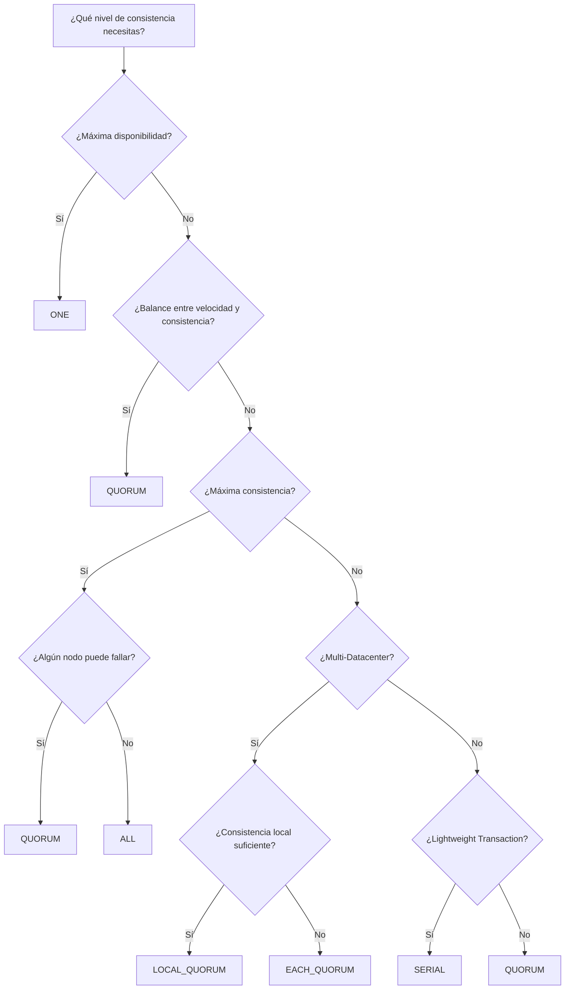
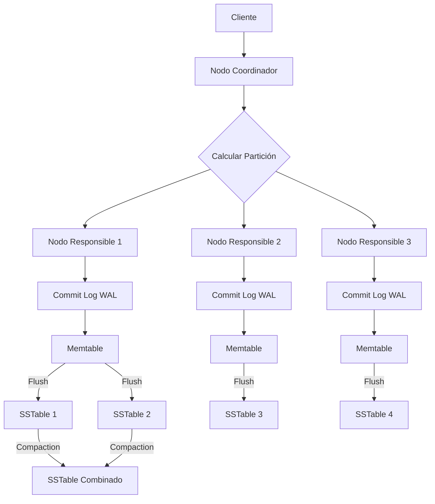
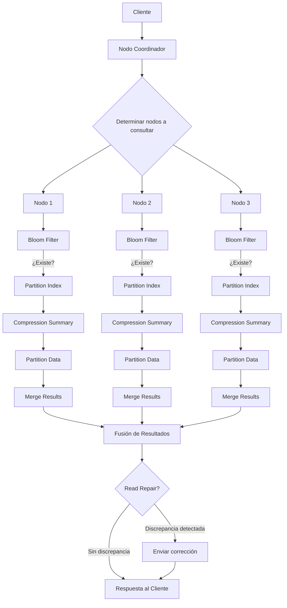
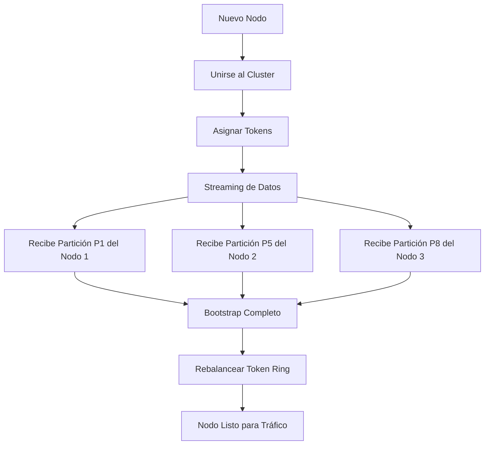

# Clase 10 — Cassandra II: Consistencia, Compaction y Escalamiento

---

## 1. Marco Teórico de Consistencia

### 1.1 Consistencia en Sistemas Distribuidos

En un sistema distribuido como Apache Cassandra, los datos se replican en múltiples nodos para garantizar disponibilidad y tolerancia a fallos. Sin embargo, replicar datos introduce un desafío fundamental: **¿cómo garantizar que todos los nodos tengan los mismos datos al mismo tiempo?**

El **Teorema CAP** (Brewer, 2000) establece que un sistema distribuido solo puede garantizar simultáneamente dos de las siguientes tres propiedades:

| Propiedad | Descripción |
|-----------|-------------|
| **Consistency (C)** | Todos los nodos ven los mismos datos al mismo tiempo |
| **Availability (A)** | Cada petición recibe una respuesta (éxito o error) |
| **Partition Tolerance (P)** | El sistema funciona incluso cuando hay particiones de red |

Cassandra es un sistema **AP**: garantiza Disponibilidad y Tolerancia a Particiones, pero sacrifice Consistencia fuerte en favor de disponibilidad. Sin embargo, Cassandra ofrece **consistencia tunable**, lo que significa que el usuario puede ajustar el nivel de consistencia por operación.

### 1.2 Niveles de Consistencia en Cassandra

Cassandra implementa el modelo de consistencia ** eventual** por defecto, pero permite al usuario subir el nivel de consistencia según sus necesidades. Esto es lo que se conoce como **consistencia tunable**.

La fórmula fundamental que gobierna la consistencia en Cassandra es:

```
R + W > N
```

Donde:
- **R** = Número de nodos que deben confirmar la **lectura** (Read)
- **W** = Número de nodos que deben confirmar la **escritura** (Write)
- **N** = Factor de Replicación (RF) = número total de copias del dato

### 1.3 Fórmula R + W > N (Explicada con Detalle)

Esta fórmula es la base de la consistencia en Cassandra. Si R + W > N, **siempre hay al menos un nodo que participó tanto en la escritura como en la lectura**, garantizando que leemos el dato más reciente.

#### Ejemplo 1: RF = 3 (replicación en 3 nodos)

| Escenario | R | W | N | R + W > N | Consistente |
|-----------|---|---|---|-----------|-------------|
| Escritura en 1 nodo, lectura en 1 nodo | 1 | 1 | 3 | 1+1=2 > 3? NO | No garantizado |
| Escritura en 2 nodos, lectura en 1 nodo | 1 | 2 | 3 | 1+2=3 > 3? NO | No garantizado (borde) |
| Escritura en 2 nodos, lectura en 2 nodos | 2 | 2 | 3 | 2+2=4 > 3? **SI** | **Garantizado** |
| Escritura en 3 nodos, lectura en 1 nodo | 1 | 3 | 3 | 1+3=4 > 3? **SI** | **Garantizado** |
| Escritura en 3 nodos, lectura en 3 nodos | 3 | 3 | 3 | 3+3=6 > 3? **SI** | **Garantizado** |

#### Ejemplo 2: RF = 5 (replicación en 5 nodos)

| Escenario | R | W | N | R + W > N | Consistente |
|-----------|---|---|---|-----------|-------------|
| QUORUM write + QUORUM read | 3 | 3 | 5 | 3+3=6 > 5? **SI** | **Garantizado** |
| ONE write + ALL read | 5 | 1 | 5 | 5+1=6 > 5? **SI** | **Garantizado** |
| ALL write + ONE read | 1 | 5 | 5 | 1+5=6 > 5? **SI** | **Garantizado** |

#### Ejemplo 3: RF = 4 (número par - problemático)

| Escenario | R | W | N | R + W > N | Consistente |
|-----------|---|---|---|-----------|-------------|
| QUORUM write + QUORUM read | 3 | 3 | 4 | 3+3=6 > 4? **SI** | **Garantizado** |
| 2 write + 2 read | 2 | 2 | 4 | 2+2=4 > 4? NO | No garantizado |

> **IMPORTANTE**: Se recomienda usar un **factor de replicación impar** (3, 5, 7) para facilitar el cálculo de QUORUM y evitar situaciones ambiguas.

### 1.4 Quorum Consensus

**QUORUM** significa "la mayoría". En términos matemáticos:

```
QUORUM = ⌊N/2⌋ + 1
```

Donde N es el factor de replicación.

| RF (N) | QUORUM (⌊N/2⌋ + 1) |
|--------|---------------------|
| 1 | 1 |
| 2 | 2 |
| 3 | 2 |
| 4 | 3 |
| 5 | 3 |
| 6 | 4 |
| 7 | 4 |
| 9 | 5 |
| 10 | 6 |

### 1.5 Consistencia Configurable por Operación

En Cassandra, puedes configurar el nivel de consistencia **por cada operación** individual:

```sql
-- Escritura con QUORUM
INSERT INTO usuarios (id, nombre, email)
VALUES (uuid(), 'Juan', 'juan@mail.com')
USING CONSISTENCY QUORUM;

-- Lectura con ONE (máxima velocidad)
SELECT * FROM usuarios WHERE id = ?
USING CONSISTENCY ONE;

-- Lectura con ALL (máxima consistencia)
SELECT * FROM usuarios WHERE id = ?
USING CONSISTENCY ALL;
```

También se puede configurar a nivel de sesión:

```
CONSISTENCY QUORUM;
-- Todas las operaciones posteriores usarán QUORUM
```

---

## 2. Niveles de Consistencia (COMPLETO)

### 2.1 Resumen de Todos los Niveles

| Nivel | Nodos de Escritura | Nodos de Lectura | Velocidad | Consistencia | Uso Recomendado |
|-------|--------------------|------------------|-----------|--------------|-----------------|
| **ONE** | 1 | 1 | ⚡⚡⚡ | Baja | Reads rápidos, logs, datos temporales |
| **TWO** | 2 | 2 | ⚡⚡ | Media-Baja | Balance básico |
| **THREE** | 3 | 3 | ⚡⚡ | Media | Balance medio |
| **QUORUM** | ⌊N/2⌋+1 | ⌊N/2⌋+1 | ⚡ | Alta | **Recomendado** para la mayoría |
| **ALL** | N | N | 🐢 | Máxima | Datos críticos,金融 |
| **LOCAL_QUORUM** | ⌊Ndc/2⌋+1 | ⌊Ndc/2⌋+1 | ⚡⚡ | Alta (local) | Multi-DC, baja latencia |
| **EACH_QUORUM** | ⌊Ndc/2⌋+1 por DC | ⌊Ndc/2⌋+1 por DC | ⚡⚡ | Alta (cada DC) | Consistencia cross-DC |
| **SERIAL** | ⌊N/2⌋+1 | - | 🐢 | Linearizable | Lightweight Transactions |
| **LOCAL_SERIAL** | ⌊Ndc/2⌋+1 | - | 🐢⚡ | Linearizable (local) | LWT en multi-DC |

### 2.2 CONSISTENCY ONE

La escritura se confirma con **solo 1 nodo**. La lectura también consulta **1 nodo**.

```
Client → Write → Nodo A (confirma) ← OK
                     ↓ (replicación asíncrona)
                  Nodo B (copia)
                  Nodo C (copia)
```

**Ventajas:**
- Máxima velocidad de escritura y lectura
- Tolerancia máxima a fallos de red
- Ideal para alta escritura throughput

**Desventajas:**
- Puede leer datos stale (obsoletos) si el nodo consultado no tiene la última escritura
- No garantiza consistencia

**Cuándo usar:**
- Logs de aplicaciones
- Datos de telemetría
- Datos temporales que no requieren consistencia inmediata
- Métricas y contadores aproximados

```sql
INSERT INTO logs (id, mensaje, timestamp)
VALUES (uuid(), 'Error en servicio', toTimestamp(now()))
USING CONSISTENCY ONE AND TTL 86400;

SELECT * FROM logs WHERE id = ? USING CONSISTENCY ONE;
```

### 2.3 CONSISTENCY TWO

La escritura se confirma con **2 nodos**. La lectura consulta **2 nodos**.

**Ventajas:**
- Mejor consistencia que ONE
- Buena velocidad

**Desventajas:**
- Requiere RF >= 2
- Menos tolerante a fallos que ONE

**Cuándo usar:**
- Cuando se necesita algo más que ONE pero se quiere mantener velocidad
- RF = 3 con QUORUM es generalmente mejor

### 2.4 CONSISTENCY THREE

La escritura se confirma con **3 nodos**. La lectura consulta **3 nodos**.

**Ventajas:**
- Consistencia razonable
- Funciona bien con RF = 3 o mayor

**Desventajas:**
- Requiere RF >= 3
- Si RF = 3, three = ALL (máxima consistencia)

**Cuándo usar:**
- RF >= 5 cuando se quiere un balance entre ONE y QUORUM

### 2.5 CONSISTENCY QUORUM

**El nivel recomendado para la mayoría de casos de uso.** La escritura se confirma con la mayoría de nodos (⌊N/2⌋+1). La lectura también consulta la mayoría.

```
RF = 3, QUORUM = 2

Client → Write → Nodo A ✓
                → Nodo B ✓ (2 de 3 confirmaron = QUORUM alcanzado)
                     ↓ (replicación al tercero)
                  Nodo C (recibe copia después)
```

**Cálculo de QUORUM:**

```
QUORUM = (RF / 2) + 1  (redondeando hacia abajo)

RF = 3: QUORUM = 1 + 1 = 2
RF = 5: QUORUM = 2 + 1 = 3
RF = 7: QUORUM = 3 + 1 = 4
RF = 9: QUORUM = 4 + 1 = 5
```

**Garantía de consistencia con QUORUM:**

```
QUORUM write + QUORUM read = (⌊N/2⌋+1) + (⌊N/2⌋+1) > N (siempre para N impar)
```

**Ventajas:**
- Garantiza consistencia con R + W > N
- Balance entre rendimiento y consistencia
- Tolerancia a ⌊(N-1)/2⌋ fallos de nodo

**Desventajas:**
- Mayor latencia que ONE
- Menor throughput que ONE

**Cuándo usar:**
- La mayoría de aplicaciones de negocio
- Datos que requieren consistencia razonable
- Cuándo no estás seguro, usa QUORUM

```sql
INSERT INTO cuentas (id, saldo, usuario_id)
VALUES (uuid(), 1500.00, 12345)
USING CONSISTENCY QUORUM;

SELECT saldo FROM cuentas WHERE id = ? USING CONSISTENCY QUORUM;
```

### 2.6 CONSISTENCY ALL

**Máxima consistencia posible.** TODOS los nodos deben confirmar la escritura y la lectura.

```
Client → Write → Nodo A ✓
                → Nodo B ✓
                → Nodo C ✓ (3 de 3 = ALL alcanzado)
```

**Ventajas:**
- Máxima consistencia garantizada
- Todos los nodos tienen los datos al mismo tiempo

**Desventajas:**
- Si **un solo nodo falla**, la operación falla
- Máxima latencia
- Mínimo throughput

**Cuándo usar:**
- Datos financieros críticos
- Datos donde la consistencia es más importante que la disponibilidad
- Operaciones administrativas que no pueden fallar

```sql
-- Transferencia bancaria crítica
BEGIN BATCH USING CONSISTENCY ALL
  UPDATE cuentas SET saldo = saldo - 500 WHERE id = 'cuenta_origen';
  UPDATE cuentas SET saldo = saldo + 500 WHERE id = 'cuenta_destino';
APPLY BATCH;
```

> **ADVERTENCIA**: Si algún nodo está caído, CONSISTENCY ALL hará que la operación falle. Úsalo solo cuando la consistencia sea absolutamente crítica.

### 2.7 CONSISTENCY LOCAL_QUORUM

Quorum dentro del **datacenter local**. No espera confirmación de otros datacenters.

```
DC-East (local):
  Client → Write → Nodo A (DC-East) ✓
                  → Nodo B (DC-East) ✓ (LOCAL_QUORUM alcanzado con 2)
                       ↓ (replicación asíncrona a DC-West)
DC-West:
                  → Nodo C (recibe después)
                  → Nodo D (recibe después)
```

**Ventajas:**
- Baja latencia (no espera cross-DC)
- Consistencia alta dentro del datacenter
- Ideal para multi-datacenter

**Desventajas:**
- No garantiza consistencia cross-DC inmediata

**Cuándo usar:**
- Aplicaciones multi-datacenter
- Cuando la latencia cross-DC es alta
- Cuando cada datacenter sirve usuarios locales

### 2.8 CONSISTENCY EACH_QUORUM

Quorum en **cada datacenter**. Todos los datacenters deben alcanzar quorum individualmente.

**Ventajas:**
- Consistencia en cada datacenter
- Cross-DC consistencia

**Desventajas:**
- Mayor latencia (espera todos los DCs)
- Si un DC falla, la operación falla

**Cuándo usar:**
- Cuando necesitas consistencia cross-DC
- Datos que deben ser consistentes globalmente

### 2.9 CONSISTENCY SERIAL y LOCAL_SERIAL

Usados exclusivamente para **Lightweight Transactions (LWT)** con `IF NOT EXISTS` o `IF EXISTS`.

```
INSERT INTO usuarios (id, email) VALUES (1, 'juan@mail.com')
IF NOT EXISTS USING CONSISTENCY SERIAL;
```

Garantizan **linearizabilidad** (equivalente a serialización en bases de datos tradicionales).

### 2.10 Tabla de Referencia Completa: RF, QUORUM y R+W>N

| RF | QUORUM | ONE + ONE | ONE + QUORUM | QUORUM + QUORUM | ONE + ALL | ALL + ALL |
|----|--------|-----------|--------------|-----------------|-----------|-----------|
| 1 | 1 | 2 > 1 ✓ | 2 > 1 ✓ | 2 > 1 ✓ | 2 > 1 ✓ | 2 > 1 ✓ |
| 2 | 2 | 2 > 2 ✗ | 3 > 2 ✓ | 4 > 2 ✓ | 3 > 2 ✓ | 4 > 2 ✓ |
| 3 | 2 | 2 > 3 ✗ | 3 > 3 ✗ | 4 > 3 ✓ | 4 > 3 ✓ | 6 > 3 ✓ |
| 5 | 3 | 2 > 5 ✗ | 4 > 5 ✗ | 6 > 5 ✓ | 6 > 5 ✓ | 10 > 5 ✓ |
| 7 | 4 | 2 > 7 ✗ | 5 > 7 ✗ | 8 > 7 ✓ | 8 > 7 ✓ | 14 > 7 ✓ |

### 2.11 Diagrama de Decisiones de Consistencia



---

## 3. Write Path y Read Path (Detallado)

### 3.1 Write Path (Ruta de Escritura)

El proceso de escritura en Cassandra sigue un camino optimizado para maximizar throughput:

#### Paso 1: Coordinador recibe la escritura

El cliente envía una escritura a un nodo coordinador. El coordinador determina qué nodos son responsables de la partición basándose en el **partitioner** (Murmur3Hash) y el **replication strategy**.

#### Paso 2: Commit Log (WAL - Write-Ahead Log)

**Primero** se escribe en el **Commit Log**, un archivo secuencial en disco que actúa como Write-Ahead Log. Esto garantiza que la escritura sobreviva incluso si el nodo falla antes de que se flush a disco.

```
Commit Log:
[timestamp=1001, mutation=INSERT INTO tabla (id=1) VALUES (...)]
[timestamp=1002, mutation=UPDATE tabla SET val=2 WHERE id=1]
[timestamp=1003, mutation=DELETE FROM tabla WHERE id=3]
```

**Configuración del Commit Log (cassandra.yaml):**
```yaml
commitlog_sync: periodic
commitlog_sync_period_in_ms: 10000  # Flush cada 10 segundos
commitlog_segment_size_in_mb: 32     # Tamaño de cada segmento
commitlog_total_space_in_mb: 8192    # Tamaño total del commit log
```

#### Paso 3: Memtable (Memoria)

Simultáneamente, la escritura se agrega al **Memtable**, una estructura de datos en memoria ordenada por clave. El Memtable es un **ConcurrentSkipListMap** que permite acceso concurrente seguro.

```
Memtable (en memoria):
┌─────────────────────────────────────────────┐
│ Partition Key │ Column Name │ Value │ Time  │
├───────────────┼─────────────┼───────┼───────│
│ user:1001     │ nombre      │ Juan  │ t1    │
│ user:1001     │ email       │ j@m.c │ t1    │
│ user:1002     │ nombre      │ Ana   │ t2    │
│ user:1003     │ nombre      │ Luis  │ t3    │
└─────────────────────────────────────────────┘
```

**Configuración del Memtable:**
```yaml
memtable_allocation_type: offheap_objects  # Usar memoria off-heap
memtable_heap_space_in_mb: 2048
memtable_offheap_space_in_mb: 2048
memtable_cleanup_threshold: 0.11
```

**El Memtable tiene un tamaño máximo**. Cuando se alcanza, se crea un nuevo Memtable y el anterior se programa para flush.

#### Paso 4: Flush (Memtable → SSTable)

Cuando el Memtable está lleno o se alcanza el período de flush, se **erializa** el contenido del Memtable a un **SSTable** (Sorted String Table) en disco.

```
Flush proceso:
Memtable (memoria) → Serialización → Escritura en disco → SSTable
                                   → Eliminar entradas correspondientes del Commit Log
```

El flush es **no bloqueante**: se crea una copia del Memtable actual, y la escritura continúa en un nuevo Memtable.

#### Diagrama del Write Path



#### Flujo detallado de la escritura:

```
1. Cliente envía: INSERT INTO tabla (pk, col) VALUES (1, 'dato')
2. Coordinador calcula: hash(1) → partición → nodos responsables
3. Para CADA nodo responsable:
   a. Escribir en Commit Log (ACK inmediato si commitlog_sync = batch)
   b. Agregar al Memtable (operación en memoria, muy rápida)
   c. Responder al coordinador
4. Coordinador espera según CONSISTENCY LEVEL:
   - ONE: responde al cliente después del 1er ACK
   - QUORUM: responde después de ⌊N/2⌋+1 ACKs
   - ALL: responde después de N ACKs
5. La replicación a nodos que no respondieron se hace asíncronamente
```

### 3.2 Read Path (Ruta de Lectura)

La ruta de lectura es más compleja porque debe consultar **múltiples fuentes** de datos y fusionar los resultados.

#### Paso 1: Coordinador recibe la lectura

El coordinador determina qué nodos son responsables de la partición y qué nodos contactar según el nivel de consistencia.

#### Paso 2: Bloom Filter

Cada SSTable tiene un **Bloom Filter**, una estructura de datos probabilística que responde: **"¿podría esta partición estar en esta SSTable?"**

```
Bloom Filter:
- Si dice "NO" → la partición NO está en esta SSTable (100% seguro)
- Si dice "SÍ" → la partición PODRÍA estar (falso positivo posible)
```

**Configuración:**
```yaml
bloom_filter_fp_chance: 0.1  # 10% de falsos positivos
```

Menor valor = menos falsos positivos pero más memoria consumida.

#### Paso 3: Partition Index

Si el Bloom Filter dice "SÍ", se busca en el **Partition Index**, un índice que mapea partition keys a offsets en el SSTable.

```
Partition Index:
┌──────────────┬──────────┐
│ Partition Key │ Offset   │
├──────────────┼──────────┤
│ user:1001    │ 0x0000   │
│ user:1002    │ 0x01A0   │
│ user:1003    │ 0x02B0   │
└──────────────┴──────────┘
```

#### Paso 4: Compression Summary

El SSTable está comprimido en bloques. El **Compression Summary** (también llamado **Compression Offset Map**) mapea bloques comprimidos a sus posiciones en disco.

```
Compression Summary:
┌─────────────┬───────────────────┬──────────────────┐
│ Block Start │ Uncompressed Size │ Compressed Size   │
├─────────────┼───────────────────┼──────────────────┤
│ 0x0000      │ 65536 bytes       │ 45000 bytes       │
│ 0x0AF0      │ 65536 bytes       │ 42000 bytes       │
│ 0x1B00      │ 65536 bytes       │ 44000 bytes       │
└─────────────┴───────────────────┴──────────────────┘
```

#### Paso 5: Partition Data

Se lee y descomprime el bloque específico que contiene la partición, y se buscan las columnas solicitadas.

#### Paso 6: Merge de resultados

Si la partición está en **múltiples SSTables** (lo cual es común después de varias escrituras), se fusionan los resultados usando la **regla de timestamp más reciente**.

```
SSTable 1 (viejo): user:1001 → nombre="Juan" (ts=1000)
SSTable 2 (medio): user:1001 → nombre="Juan" (ts=2000), email="j@n.c" (ts=2000)
SSTable 3 (nuevo): user:1001 → nombre="Juan Pérez" (ts=3000)

Resultado merge:
  nombre = "Juan Pérez" (ts=3000, más reciente)
  email = "j@n.c" (ts=2000, único disponible)
```

#### Paso 7: Read Repair

Si el coordinador detecta que un nodo tiene un timestamp más viejo que otros, envía una **corrección** automáticamente para sincronizar los datos.

```
Read Repair:
1. Coordinador lee de 2 nodos (QUORUM con RF=3)
2. Nodo A: nombre="Juan Pérez" (ts=3000)
3. Nodo B: nombre="Juan" (ts=1000)  ← dato viejo
4. Coordinador detecta la discrepancia
5. Coordinador envía la versión correcta a Nodo B
6. Responde al cliente con el dato correcto
```

**Configuración:**
```yaml
read_repair_chance: 0.0  # Deprecated en 4.0+
# En Cassandra 4.0+:
read_repair: BLOCKING  # o NONE
```

#### Paso 8: Anti-Entropy (Merkle Trees)

Para sincronización a largo plazo, Cassandra usa **Merkle Trees** (árboles de Hash) para comparar datos entre nodos y detectar discrepancias.

```
Merkle Tree:
           [Hash Root]
          /           \
    [Hash AB]       [Hash CD]
    /      \        /      \
[A:data] [B:data] [C:data] [D:data]
```

Cada nodo construye un Merkle Tree de sus datos. Al comparar árboles entre nodos, se pueden identificar **subárboles diferentes** y sincronizar solo las partes que difieren, en lugar de todos los datos.

#### Diagrama del Read Path



#### Resumen comparativo Write vs Read:

| Aspecto | Write Path | Read Path |
|---------|-----------|-----------|
| **Velocidad** | Rápida (memoria) | Más lenta (disco + merge) |
| **Complejidad** | Baja (WAL + Memtable) | Alta (Bloom + Index + Merge) |
| **I/O** | Escritura secuencial | Lectura aleatoria |
| **Optimización** | Batch de escrituras | Caché y Bloom Filters |
| **Repair** | N/A | Read Repair + Anti-Entropy |

---

## 4. Compaction Strategies (MUY Detallado)

### 4.1 ¿Qué es la Compaction?

Cada vez que se hace un **flush** del Memtable a disco, se crea un nuevo **SSTable**. Con el tiempo, hay muchos SSTables, y una lectura debe consultar **todos ellos**. La **compaction** es el proceso de **fusionar múltiples SSTables en uno(s) nuevo(s)**, eliminando:
- **Dados obsoletos** (superseded por versiones más recientes)
- **Dados eliminados** (tombstones)
- **Datos duplicados**

```
Antes de compaction:
SSTable 1: {A:1, B:2, C:3}
SSTable 2: {A:5, B:2, D:4}     ← A:5 es más reciente que A:1
SSTable 3: {C:3, E:6}          ← C:3 es el mismo valor

Después de compaction:
SSTable Nuevo: {A:5, B:2, C:3, D:4, E:6}
  - A:1 eliminado (superseded por A:5)
  - C:3 eliminado (duplicado)
  - B:2, D:4, E:6 conservados
```

### 4.2 SizeTieredCompactionStrategy (STCS)

**Estrategia por defecto** en Cassandra.

**Cómo funciona:**
1. Agrupa SSTables de **tamaño similar**
2. Cuando hay suficientes SSTables de un tamaño similar, los fusiona
3. El resultado es un SSTable más grande
4. El proceso se repite

```
Nivel 1: [S1: 10MB] [S2: 12MB] [S3: 11MB] [S4: 9MB]  ← agrupados por tamaño
              ↓ Compaction
Nivel 2: [S5: 42MB] [S6: 40MB] [S7: 38MB]
              ↓ Compaction
Nivel 3: [S8: 120MB]
```

**Parámetros de configuración:**
```yaml
compaction = {
    'class': 'SizeTieredCompactionStrategy',
    'min_threshold': 4,          # Mínimo SSTables para iniciar compaction
    'max_threshold': 32,         # Máximo SSTables en una compaction
    'min_sstable_size': 50       # MB, SSTables más pequeños se agrupan juntos
}
```

**Configurar en CREATE TABLE:**
```sql
CREATE TABLE eventos (
    id UUID PRIMARY KEY,
    tipo TEXT,
    datos TEXT
) WITH compaction = {
    'class': 'SizeTieredCompactionStrategy',
    'min_threshold': 4,
    'max_threshold': 32
};
```

**Ventajas:**
- **Write-optimized**: write amplification bajo (~4x)
- Simple y predecible
- Bueno para write-heavy workloads

**Desventajas:**
- **Read amplification alto**: más SSTables = más reads por query
- Space amplification alto durante compaction
- No ideal para read-heavy workloads
- Puede causar "compaction storm" con muchos SSTables pequeños

**Write amplification vs Read amplification:**

```
Write Amplification (cuántas veces se reescribe un dato):
  STCS: ~4x (bueno para writes)
  
Read Amplification (cuántos SSTables se leen por query):
  STCS: Alto (malo para reads)
  
Space Amplification (espacio extra usado durante compaction):
  STCS: Alto durante compaction (~50% extra temporal)
```

### 4.3 LeveledCompactionStrategy (LCS)

Organiza los SSTables en **niveles** donde cada nivel es **10 veces más grande** que el anterior.

**Cómo funciona:**
1. **L0**: SSTables que salen del flush (tamaño variable)
2. **L1**: SSTables de tamaño fijo (~160MB por defecto)
3. **L2**: Hasta 10x L1 (~1.6GB)
4. **L3**: Hasta 10x L2 (~16GB)
5. ... y así sucesivamente

```
Estructura de niveles:

L0: [S1] [S2] [S3]           ← SSTables sin ordenar
         ↓ Compaction selectiva
L1: [S4][S5][S6][S7][S8]     ← SSTables no solapan, ~160MB cada uno
         ↓ Compaction selectiva  
L2: [S9][S10][S11]...[S20]   ← ~1.6GB total
         ↓ Compaction selectiva
L3: [S21]...[S50]             ← ~16GB total
```

**Regla clave de LCS**: Dentro de cada nivel, **ningún par de SSTables solapa** en rangos de partición. Esto significa que para leer una partición, solo necesitas consultar **un SSTable por nivel**.

**Parámetros de configuración:**
```yaml
compaction = {
    'class': 'LeveledCompactionStrategy',
    'sstable_size_in_mb': 160,      # Tamaño de cada SSTable
    'fanout_size': 10               # Factor de crecimiento entre niveles
}
```

**Configurar en CREATE TABLE:**
```sql
CREATE TABLE usuarios (
    id UUID PRIMARY KEY,
    nombre TEXT,
    email TEXT,
    telefono TEXT
) WITH compaction = {
    'class': 'LeveledCompactionStrategy',
    'sstable_size_in_mb': 160
};
```

**Ventajas:**
- **Read amplification bajo**: solo ~4 SSTables por query (1 por nivel)
- **Space amplification bajo**: solo 10% extra durante compaction
- Ideal para read-heavy workloads
- Predecible rendimiento

**Desventajas:**
- **Write amplification alto**: hasta ~10x (cada写入 puede reescribirse 10 veces)
- Más I/O en escrituras
- Más uso de CPU para compaction
- No ideal para write-heavy workloads

### 4.4 TimeWindowCompactionStrategy (TWCS)

**Ideal para datos de series temporales (time-series)**. Agrupa SSTables por **ventanas de tiempo**.

**Cómo funciona:**
1. Los SSTables se agrupan por la ventana de tiempo en la que se escribieron
2. Dentro de una ventana, se usa STCS para compactar
3. **No se compacta entre ventanas de tiempo diferentes**

```
Ventanas de tiempo (compaction_window_unit: HOURS, compaction_window_size: 1):

Hora 0: [S1][S2][S3]  → compacta a [S1_merged]
Hora 1: [S4][S5]      → compacta a [S4_merged]  
Hora 2: [S6][S7][S8]  → compacta a [S6_merged]

Las ventanas NUNCA se compactan entre sí:
  [S1_merged] ← NUNCA se compacta con → [S4_merged]
```

**Parámetros de configuración:**
```yaml
compaction = {
    'class': 'TimeWindowCompactionStrategy',
    'compaction_window_unit': 'HOURS',    # MINUTES, HOURS, DAYS
    'compaction_window_size': 1,          # Tamaño de la ventana
    'max_threshold': 32,
    'min_threshold': 4
}
```

**Configurar en CREATE TABLE:**
```sql
CREATE TABLE metrics (
    metric_id UUID,
    metric_time TIMESTAMP,
    metric_name TEXT,
    metric_value DOUBLE,
    PRIMARY KEY (metric_id, metric_time)
) WITH compaction = {
    'class': 'TimeWindowCompactionStrategy',
    'compaction_window_unit': 'HOURS',
    'compaction_window_size': 1
};
```

**Ventajas:**
- **Óptimo para time-series**: los datos antiguos rara vez se acceden
- Write amplification bajo
- Space amplification bajo
- Data expiration natural (puedes dropear ventanas antiguas)

**Desventajas:**
- No ideal para datos no temporales
- Si accedes a datos antiguos, read performance es pobre
- Si las ventanas son muy pequeñas, muchos SSTables

### 4.5 Choosing Strategy: Tabla de Decisión

| Workload | Estrategia Recomendada | Razón |
|----------|----------------------|-------|
| **Write-heavy, lecturas poco frecuentes** | STCS | Write amplification bajo |
| **Read-heavy, escrituras moderadas** | LCS | Read amplification bajo |
| **Time-series data** | TWCS | Agrupación por tiempo |
| **Mixed read/write** | LCS | Balance general |
| **Caching/Session data** | LCS | Lecturas frecuentes |
| **IoT/Metrics** | TWCS | Datos temporales, expiración |
| **Graph data (adjacency lists)** | LCS | Lecturas por partición |
| **Audit/Compliance logs** | TWCS | Escritura única, lectura rara |
| **User profiles** | LCS | Lecturas frecuentes, writes ocasionales |
| **Queue/Event streaming** | STCS | Escritura intensiva, lectura secuencial |

### 4.6 Cambiar Estrategia

```sql
-- Cambiar de STCS a LCS
ALTER TABLE usuarios WITH compaction = {
    'class': 'LeveledCompactionStrategy',
    'sstable_size_in_mb': 160
};

-- Cambiar de STCS a TWCS
ALTER TABLE metrics WITH compaction = {
    'class': 'TimeWindowCompactionStrategy',
    'compaction_window_unit': 'HOURS',
    'compaction_window_size': 1
};

-- Verificar la estrategia actual
DESCRIBE TABLE usuarios;
-- o
SELECT * FROM system_schema.tables WHERE keyspace_name = 'mi_keyspace' AND table_name = 'usuarios';
```

### 4.7 Monitorear Compaction

```bash
# Ver estado actual de compaction
nodetool compactionstats

# Salida típica:
# pending tasks: 0
# compaction id: abc-123-def
# keyspace: mi_keyspace
# table: usuarios
# bytes total: 1073741824
# bytes compacted: 536870912
# progress: 50.0%
# SSTables to compact: 8
# Compaction type: SizeTieredCompactionStrategy

# Forzar compaction en una tabla
nodetool compact mi_keyspace usuarios

# Forzar flush (memtable → SSTable)
nodetool flush mi_keyspace usuarios

# Ver tamaño de SSTables
ls -la /var/lib/cassandra/data/mi_keyspace/usuarios-*/

# Ver estadísticas de la tabla
nodetool cfstats mi_keyspace.usuarios
```

---

## 5. Escalamiento Horizontal

### 5.1 Agregar Nodos al Cluster (Bootstrap)

#### Paso 1: Configurar el nuevo nodo

```bash
# Instalar Cassandra en el nuevo nodo
# Configurar cassandra.yaml:
cluster_name: 'MiCluster'
seeds: ['10.0.0.1', '10.0.0.2']  # IPs de nodos existentes
listen_address: 10.0.0.4          # IP del nuevo nodo
rpc_address: 0.0.0.0              # Escuchar en todas las interfaces
```

#### Paso 2: Iniciar el nuevo nodo (Bootstrap)

```bash
# El nuevo nodo se une al cluster y comienza bootstrap
# Cassandra 4.0+:
cassandra -Dcassandra.replace_address=0.0.0.0

# Durante el bootstrap:
# 1. El nodo se une al cluster
# 2. Se le asignan tokens (vnodes o manuales)
# 3. Recibe streaming de datos de otros nodos
# 4. Una vez completo, puede servir tráfico
```

#### Paso 3: Monitorear el bootstrap

```bash
# Ver el progreso del bootstrap
nodetool netstats

# Ver el estado del cluster
nodetool status
#输出:
# Datacenter: DC1
# ===============
# Status=Up/Down
# |/ State=Normal/Leaving/Joining/Moving
# --
# Address   Load       Tokens  Owns (effective)  Host ID    Rack
# 10.0.0.1  256.00 GB  256     33.3%             abc-123    rack1
# 10.0.0.2  248.00 GB  256     33.3%             def-456    rack1
# 10.0.0.4  0.50 GB    256     33.4%             ghi-789    rack1  ← Joining
```

#### Diagrama del Bootstrap



### 5.2 Quitar Nodos del Cluster (Decommission)

```bash
# Paso 1: Verificar que el nodo está UP
nodetool status

# Paso 2: Decommissar el nodo
# IMPORTANTE: Solo en nodos que están UP
nodetool decommission

# Durante el decommission:
# 1. El nodo deja de recibir nuevas escrituras
# 2. Migra sus particiones a otros nodos
# 3. Se retira del cluster
# 4. Se puede apagar y eliminar

# Paso 3: Cleanup en nodos restantes
# Eliminar datos que ya no pertenecen a estos nodos
nodetool cleanup mi_keyspace

# Paso 4: Verificar
nodetool status
# El nodo ya no aparece en la lista
```

### 5.3 Rebalancing de Tokens

Con **Virtual Nodes (vnodes)**, el rebalancing es **automático**. Cuando agregas o quitas nodos, Cassandra redistribuye automáticamente las particiones.

```yaml
# cassandra.yaml
num_tokens: 256  # Cada nodo tiene 256 tokens virtuales
allocate_tokens_for_local_replication_factor: 3  # Optimizar para RF=3
```

**Sin vnodes (legacy):** tendrías que calcular manualmente los tokens y hacer un `nodetool move`.

### 5.4 Virtual Nodes (Vnodes): Ventajas

| Aspecto | Sin Vnodes | Con Vnodes |
|---------|-----------|------------|
| **Tokens por nodo** | 1 | 256 (default) |
| **Balance de carga** | Difícil de lograr | Automático |
| **Agregar nodo** | Cálculo manual de tokens | Automático |
| **Quitar nodo** | Cálculo manual | Automático |
| **Nodos con diferentes specs** | No soportado | Balance automático |
| **Recovery** | Difícil | Fácil (distribute across remaining) |
| **Operaciones** | Más simples | Más eficiente |

---

## 6. Multi-Datacenter

### 6.1 NetworkTopologyStrategy

Para clusters multi-datacenter, se debe usar **NetworkTopologyStrategy** en lugar de **SimpleStrategy**.

```sql
-- SimpleStrategy (solo un DC)
CREATE KEYSPACE mi_keyspace WITH replication = {
    'class': 'SimpleStrategy',
    'replication_factor': 3
};

-- NetworkTopologyStrategy (multi-DC)
CREATE KEYSPACE mi_keyspace WITH replication = {
    'class': 'NetworkTopologyStrategy',
    'DC_East': 3,
    'DC_West': 2
};
```

### 6.2 Replicación Cross-DC

```
Cliente en DC-East escribe:
1. Coordinador en DC-East escribe localmente (RF=3 en DC-East)
2. Asincronamente, replica a DC-West (RF=2 en DC-West)

Tiempo de replicación cross-DC:
- Sincrónico con ALL o EACH_QUORUM
- Asincrónico con ONE, QUORUM o LOCAL_QUORUM
```

### 6.3 Consistencia Cross-DC

| Consistency Level | Efecto en Multi-DC |
|-------------------|-------------------|
| **LOCAL_QUORUM** | Espera quorum solo en DC local (baja latencia) |
| **EACH_QUORUM** | Espera quorum en cada DC (mayor latencia) |
| **QUORUM** | Espera quorum en total (cross-DC) |
| **ALL** | Espera todos los nodos en todos los DCs |

### 6.4 Configuración de Datacenters

```yaml
# cassandra-rackdc.properties
dc=DC_East
rack=rack1
```

```yaml
# cassandra.yaml
endpoint_snitch: GossipingPropertyFileSnitch
```

### 6.5 Snitch Configuration

| Snitch | Uso | Descripción |
|--------|-----|-------------|
| **SimpleSnitch** | Desarrollo | No distingue DC/rack |
| **PropertyFileSnitch** | Producción simple | Define DC/rack en archivo |
| **GossipingPropertyFileSnitch** | Producción | DC/rack en archivo + gossip |
| **RackInferringSnitch** |testing | Infere DC/rack de IP |

### 6.6 Caso de Uso: Disponibilidad Geográfica

```
Escenario: E-commerce global
- DC-East (New York): Usuarios de América
- DC-West (San Francisco): Usuarios de Asia/Pacífico
- DC-Europe (London): Usuarios de Europa

Configuración:
CREATE KEYSPACE tienda WITH replication = {
    'class': 'NetworkTopologyStrategy',
    'DC_NewYork': 3,
    'DC_SanFrancisco': 2,
    'DC_London': 2
};

-- Lecturas locales para baja latencia
SELECT * FROM tienda.productos WHERE id = ?
USING CONSISTENCY LOCAL_QUORUM;

-- Escrituras críticas con consistencia cross-DC
UPDATE tienda.inventario SET stock = stock - 1 WHERE producto_id = ?
USING CONSISTENCY EACH_QUORUM;
```

---

## 7. Quorum Consensus en la Práctica

### 7.1 Ejemplo con RF = 3: QUORUM = 2

```sql
-- Crear keyspace con RF=3
CREATE KEYSPACE banco WITH replication = {
    'class': 'NetworkTopologyStrategy',
    'DC1': 3
};

-- Crear tabla
CREATE TABLE banco.cuentas (
    id UUID PRIMARY KEY,
    titular TEXT,
    saldo DECIMAL
);

-- Insertar con QUORUM
INSERT INTO banco.cuentas (id, titular, saldo)
VALUES (uuid(), 'Juan Pérez', 5000.00)
USING CONSISTENCY QUORUM;
-- Se escribe en 2 de 3 nodos antes de confirmar

-- Leer con QUORUM
SELECT * FROM banco.cuentas WHERE id = ? USING CONSISTENCY QUORUM;
-- Se lee de 2 de 3 nodos y se verifica consistencia

-- Leer con ONE (más rápido pero puede ser stale)
SELECT * FROM banco.cuentas WHERE id = ? USING CONSISTENCY ONE;
```

### 7.2 Ejemplo con RF = 5: QUORUM = 3

```sql
CREATE KEYSPACE logs WITH replication = {
    'class': 'NetworkTopologyStrategy',
    'DC1': 5
};

-- Escritura con QUORUM (3 de 5 nodos)
INSERT INTO logs.eventos (id, tipo, mensaje, timestamp)
VALUES (uuid(), 'ERROR', 'Fallo en servicio', toTimestamp(now()))
USING CONSISTENCY QUORUM;

-- Lectura con QUORUM (3 de 5 nodos)
SELECT * FROM logs.eventos WHERE id = ? USING CONSISTENCY QUORUM;
```

### 7.3 Read Repair

```yaml
# En cassandra.yaml
read_repair_chance: 0.0  # Cassandra 3.x
# En Cassandra 4.0+:
read_repair: BLOCKING  # Repara de forma síncrona
```

**Cómo funciona el Read Repair:**

```
1. Coordinador envía la petición a 2 nodos (QUORUM, RF=3)
2. Nodo A responde: {nombre: "Juan Pérez", ts: 1005}
3. Nodo B responde: {nombre: "Juan", ts: 1000}
4. Coordinador detecta: ts de A > ts de B
5. Coordinador envía a Nodo B: UPDATE nombre = "Juan Pérez" WHERE id = ?
6. Coordinador responde al cliente: {nombre: "Juan Pérez"}
```

### 7.4 Anti-Entropy (Merkle Trees)

```
Proceso de Anti-Entropy Repair:

1. Ejecutar nodetool repair
2. Los nodos comparan Merkle Trees
3. Identifican subárboles diferentes
4. Sincronizan solo las diferencias

Merkle Tree de Nodo A:
         [Hash: ABC123]
        /              \
  [Hash: DEF456]   [Hash: GHI789]
  /          \      /          \
[data1]  [data2] [data3]  [data4]

Merkle Tree de Nodo B:
         [Hash: ABC123]      ← Mismo root = datos idénticos
        /              \
  [Hash: DEF456]   [Hash: JKL012]  ← Diferente = hay cambios
  /          \      /          \
[data1]  [data2] [data3]  [data5]  ← data5 != data4

Resultado: Sincronizar solo data4/data5
```

### 7.5 Intervalo de Repair

```bash
# Ejecutar repair manual
nodetool repair mi_keyspace

# Repair con opciones
nodetool repair -pr mi_keyspace  # Primary range only
nodetool repair -st <start> -et <end> mi_keyspace  # Rango específico

# Reparación completa (recomendada cada 7-10 días)
nodetool repair --full mi_keyspace

# Automatizar repair con cron (cada 7 días)
# crontab -e
0 2 * * 0 /usr/bin/nodetool repair --full mi_keyspace >> /var/log/cassandra/repair.log 2>&1
```

> **REGLA DE ORO**: Ejecuta `nodetool repair` al menos **una vez cada 10 días** (el default de gc_grace_seconds es 864000 segundos = 10 días). Si no reparas antes de que expire gc_grace, los datos eliminados pueden "resucitar".

---

## 8. Ejercicio Práctico

### Ejercicio 1: Configurar Cluster Multi-Datacenter con Docker

```bash
# Crear red Docker
docker network create cassandra-net

# DC1: 3 nodos
docker run -d --name cass1 --net cassandra-net \
  -e CASSANDRA_DC=DC1 -e CASSANDRA_RACK=rack1 \
  -e CASSANDRA_SEEDS=cass1,cass2 \
  cassandra:4.1

docker run -d --name cass2 --net cassandra-net \
  -e CASSANDRA_DC=DC1 -e CASSANDRA_RACK=rack1 \
  -e CASSANDRA_SEEDS=cass1,cass2 \
  cassandra:4.1

docker run -d --name cass3 --net cassandra-net \
  -e CASSANDRA_DC=DC1 -e CASSANDRA_RACK=rack1 \
  -e CASSANDRA_SEEDS=cass1,cass2 \
  cassandra:4.1

# DC2: 2 nodos
docker run -d --name cass4 --net cassandra-net \
  -e CASSANDRA_DC=DC2 -e CASSANDRA_RACK=rack1 \
  -e CASSANDRA_SEEDS=cass1,cass2 \
  cassandra:4.1

docker run -d --name cass5 --net cassandra-net \
  -e CASSANDRA_DC=DC2 -e CASSANDRA_RACK=rack1 \
  -e CASSANDRA_SEEDS=cass1,cass2 \
  cassandra:4.1

# Esperar a que el cluster esté listo
docker exec -it cass1 nodetool status
```

### Ejercicio 2: Probar Diferentes Niveles de Consistencia

```sql
-- Conectar al cluster
docker exec -it cass1 cqlsh

-- Crear keyspace multi-DC
CREATE KEYSPACE prueba WITH replication = {
    'class': 'NetworkTopologyStrategy',
    'DC1': 3,
    'DC2': 2
};

USE prueba;

-- Crear tabla de prueba
CREATE TABLE usuarios (
    id UUID PRIMARY KEY,
    nombre TEXT,
    email TEXT
);

-- Test 1: ONE (máxima velocidad)
-- Time la operación
INSERT INTO usuarios (id, nombre, email)
VALUES (uuid(), 'Test ONE', 'one@test.com')
USING CONSISTENCY ONE;

-- Test 2: QUORUM (balance)
INSERT INTO usuarios (id, nombre, email)
VALUES (uuid(), 'Test QUORUM', 'quorum@test.com')
USING CONSISTENCY QUORUM;

-- Test 3: ALL (máxima consistencia)
INSERT INTO usuarios (id, nombre, email)
VALUES (uuid(), 'Test ALL', 'all@test.com')
USING CONSISTENCY ALL;

-- Test 4: LOCAL_QUORUM
INSERT INTO usuarios (id, nombre, email)
VALUES (uuid(), 'Test LOCAL_QUORUM', 'lq@test.com')
USING CONSISTENCY LOCAL_QUORUM;
```

### Ejercicio 3: Medir Latencia ONE vs QUORUM vs ALL

```sql
-- Usar tabla de sistema para generar datos
-- Y medir tiempos con shell

-- En bash:
for i in $(seq 1 100); do
  start=$(date +%s%N)
  docker exec -it cass1 cqlsh -e "
    INSERT INTO prueba.usuarios (id, nombre, email)
    VALUES (uuid(), 'User$i', 'user$i@test.com')
    USING CONSISTENCY ONE;
  " > /dev/null 2>&1
  end=$(date +%s%N)
  echo "ONE: $((($end - $start) / 1000000))ms"
done

# Repetir con QUORUM y ALL para comparar
```

### Ejercicio 4: Simular Fallo de Nodo

```bash
# Parar un nodo
docker stop cass3

# Verificar estado
docker exec -it cass1 nodetool status
# cass3 aparecer como Down

# Intentar escritura con ONE (funciona)
docker exec -it cass1 cqlsh -e "
  USE prueba;
  INSERT INTO usuarios (id, nombre, email)
  VALUES (uuid(), 'Test Node Down', 'down@test.com')
  USING CONSISTENCY ONE;
"
# Debería funcionar porque 2 de 3 nodos están UP

# Intentar escritura con ALL (falla)
docker exec -it cass1 cqlsh -e "
  USE prueba;
  INSERT INTO usuarios (id, nombre, email)
  VALUES (uuid(), 'Test Node Down ALL', 'down@test.com')
  USING CONSISTENCY ALL;
"
# Debería fallar porque no hay 3 nodos disponibles

# Reiniciar el nodo
docker start cass3
# Esperar a que se una al cluster
docker exec -it cass1 nodetool status
```

### Ejercicio 5: Cambiar Compaction Strategy

```sql
-- Verificar estrategia actual
DESCRIBE TABLE prueba.usuarios;

-- Cambiar a LCS
ALTER TABLE prueba.usuarios WITH compaction = {
    'class': 'LeveledCompactionStrategy',
    'sstable_size_in_mb': 160
};

-- Verificar cambio
DESCRIBE TABLE prueba.usuarios;

-- Cambiar a TWCS (si fuera time-series)
-- Primero crear tabla de time-series
CREATE TABLE prueba.metricas (
    sensor_id UUID,
    timestamp TIMESTAMP,
    value DOUBLE,
    PRIMARY KEY (sensor_id, timestamp)
) WITH compaction = {
    'class': 'TimeWindowCompactionStrategy',
    'compaction_window_unit': 'HOURS',
    'compaction_window_size': 1
};
```

### Ejercicio 6: Monitorear Compaction en Tiempo Real

```bash
# Terminal 1: Monitorear compaction
watch -n 5 "docker exec -it cass1 nodetool compactionstats"

# Terminal 2: Generar datos para forzar compaction
docker exec -it cass1 cqlsh -e "
  USE prueba;
  CREATE TABLE test_compact (id UUID PRIMARY KEY, data TEXT);
"

# Insertar muchos datos
for i in $(seq 1 10000); do
  docker exec -it cass1 cqlsh -e "
    INSERT INTO prueba.test_compact (id, data)
    VALUES (uuid(), 'Data string $i with some extra content to make it bigger');
  " > /dev/null 2>&1
done

# Forzar flush para crear SSTables
docker exec -it cass1 nodetool flush prueba test_compact

# Forzar compaction
docker exec -it cass1 nodetool compact prueba test_compact

# Verificar
docker exec -it cass1 nodetool cfstats prueba.test_compact
```

### Ejercicio 7: Ejecutar Repair Manual

```bash
# Ejecutar repair completo
docker exec -it cass1 nodetool repair --full prueba

# Monitorear progreso
docker exec -it cass1 nodetool netstats

# Verificar repair en logs
docker logs cass1 | grep -i repair

# Programar repair automático (producción)
# En crontab:
# 0 2 * * 0 /usr/bin/nodetool repair --full mi_keyspace
```

---

## Resumen de la Clase 10

| Tema | Puntos Clave |
|------|-------------|
| **Consistencia** | R + W > N, QUORUM recomendado |
| **Write Path** | Commit Log → Memtable → SSTable |
| **Read Path** | Bloom Filter → Index → Merge → Read Repair |
| **Compaction** | STCS (write-heavy), LCS (read-heavy), TWCS (time-series) |
| **Escalamiento** | Bootstrap para agregar, Decommission para quitar |
| **Multi-DC** | NetworkTopologyStrategy, LOCAL_QUORUM |
| **Repair** | Cada 7-10 días mínimo |

---

*Próxima clase: Cassandra III — Administración, Backups y Seguridad*
