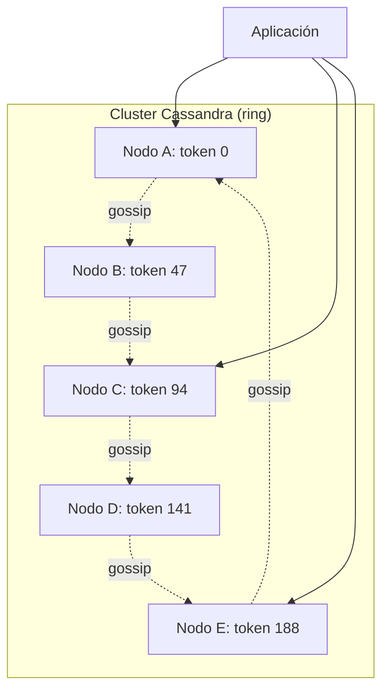
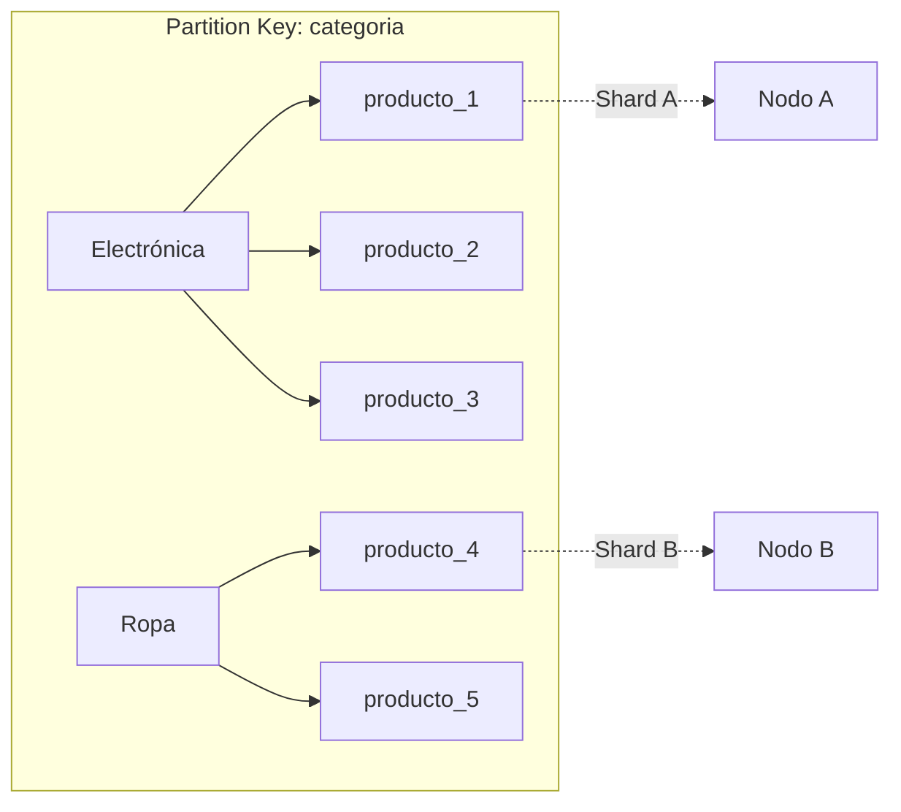
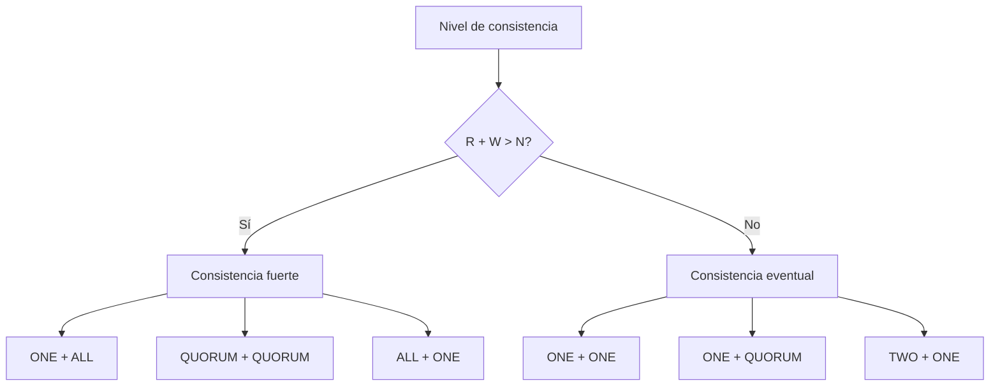
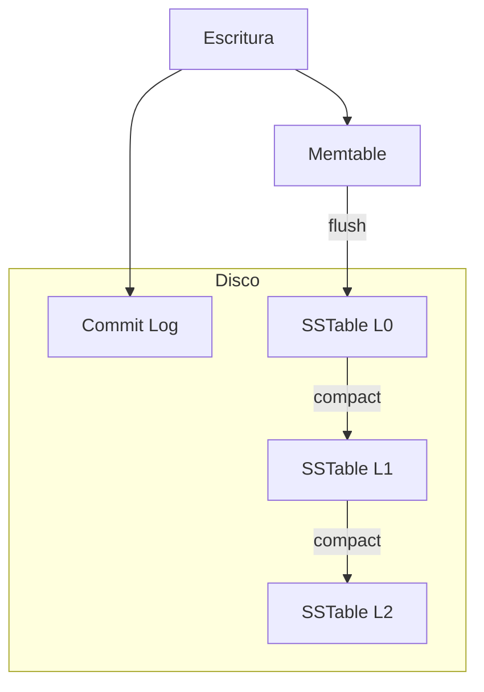

# Clase 10 — Cassandra: Base de Datos Columnar Distribuida

## 1. Instalación y Configuración de Cassandra

### Requisitos

- Java 11 o superior

```bash
# Verificar Java
java -version
```

### Instalar Java

```bash
# Ubuntu/Debian
sudo apt update
sudo apt install -y openjdk-11-jdk
```

### Instalar Cassandra (Ubuntu/Debian)

```bash
sudo apt install -y wget gnupg2

# Agregar repositorio
echo "deb https://debian.cassandra.apache.org 41x main" | sudo tee /etc/apt/sources.list.d/cassandra.sources.list
curl -fsSL https://downloads.apache.org/cassandra/KEYS | sudo apt-key add -

sudo apt update
sudo apt install -y cassandra

sudo systemctl start cassandra
sudo systemctl enable cassandra
```

### Docker

```bash
docker run -d \
  --name cassandra-clase10 \
  -p 9042:9042 \
  -p 7199:7199 \
  cassandra:4.1
```

### Verificar instalación

```bash
# Estado del nodo
nodetool status

# Conectar con cqlsh
cqlsh localhost 9042
```

## 2. Arquitectura Peer-to-Peer



### Componentes clave

| Componente | Función |
|------------|---------|
| Ring | Distribución de tokens entre nodos |
| Gossip | Protocolo de comunicación entre nodos |
| Snitch | Define topology awareness (datacenter, rack) |
| Token | Posición en el ring (0 a 2^127-1) |
| Replication Factor | Cuántas copias de cada dato |

### Comparación con MongoDB

| Característica | Cassandra | MongoDB |
|----------------|-----------|---------|
| Arquitectura | Peer-to-peer (sin master) | Primary-Secondary |
| Consistencia | Eventual (configurable) | Fuerte (default) |
| Motor de escritura | LSM Tree | WiredTiger (B-Tree) |
| Lenguaje | CQL (similar a SQL) | MQL (JSON-based) |
| JOINs | No soportados | `$lookup` |
| Transacciones | Atomicidad por partición | Multi-document |

## 3. Modelo de Datos

### Keyspaces, Tablas, Clustering Keys

```sql
-- Crear keyspace (equivalente a database)
CREATE KEYSPACE tienda WITH REPLICATION = {
    'class': 'SimpleStrategy',
    'replication_factor': 3
};

-- Para multi-datacenter
CREATE KEYSPACE tienda WITH REPLICATION = {
    'class': 'NetworkTopologyStrategy',
    'dc1': 3,
    'dc2': 2
};

USE tienda;

-- Crear tabla con partition key + clustering key
CREATE TABLE productos (
    categoria TEXT,
    producto_id UUID,
    nombre TEXT,
    precio DECIMAL,
    stock INT,
    PRIMARY KEY (categoria, producto_id)
);
-- Partition key: categoria
-- Clustering key: producto_id (ordena dentro de la partición)
```



### Tabla con múltiples clustering keys

```sql
CREATE TABLE pedidos_usuario (
    usuario_id UUID,
    fecha TIMESTAMP,
    pedido_id UUID,
    total DECIMAL,
    estado TEXT,
    PRIMARY KEY (usuario_id, fecha, pedido_id)
) WITH CLUSTERING ORDER BY (fecha DESC, pedido_id ASC);

-- Consultas eficientes:
-- WHERE usuario_id = X (partition key)
-- WHERE usuario_id = X AND fecha > '2024-01-01' (clustering)
-- NO se puede: WHERE fecha > '2024-01-01' sin usuario_id
```

### Time-Series Table

```sql
CREATE TABLE metricas_servidor (
    servidor_id UUID,
    fecha TIMESTAMP,
    cpu DOUBLE,
    memoria DOUBLE,
    disco DOUBLE,
    PRIMARY KEY (servidor_id, fecha)
) WITH CLUSTERING ORDER BY (fecha DESC);

-- Insertar
INSERT INTO metricas_servidor (servidor_id, fecha, cpu, memoria, disco)
VALUES (uuid(), toTimestamp(now()), 45.2, 62.1, 78.5);

-- Consultar últimas 24 horas
SELECT * FROM metricas_servidor
WHERE servidor_id = a0eebc99-9c0b-4ef8-bb6d-6bb9bd380a11
AND fecha > toTimestamp(now()) - 86400000;
```

## 4. Niveles de Consistencia

### Configuración

```sql
CONSISTENCY ONE;          -- 1 nodo responde (máx velocidad)
CONSISTENCY QUORUM;       -- mayoría de nodos (balance)
CONSISTENCY ALL;          -- todos los nodos (máx consistencia)
CONSISTENCY LOCAL_QUORUM; -- mayoría en DC local
CONSISTENCY EACH_QUORUM;  -- mayoría en cada DC
CONSISTENCY SERIAL;       -- para lightweight transactions
CONSISTENCY LOCAL_SERIAL; -- serial en DC local
```

### Relación R + W > N



| Lectura | Escritura | Garantía | Latencia |
|---------|-----------|----------|----------|
| ONE | ONE | Eventual | Mínima |
| QUORUM | QUORUM | Fuerte | Media |
| ALL | ONE | Fuerte | Alta |
| ONE | ALL | Fuerte | Alta |

### Ejemplo con RF = 3

```
RF = 3 (3 réplicas)

QUORUM = floor(3/2) + 1 = 2

Escritura con QUORUM:
- 2 de 3 nodos deben confirmar

Lectura con QUORUM:
- 2 de 3 nodos deben responder
- Si un nodo tiene dato viejo, se actualiza con el nuevo (read repair)

R + W = 2 + 2 = 4 > 3 = N → Consistencia fuerte garantizada
```

## 5. Write Path: Memtable → SSTable → Compaction



### Flujo de escritura

1. Escritura se escribe en **commit log** (WAL)
2. Se escribe en **memtable** (memoria)
3. Cuando memtable alcanza tamaño umbral → **flush** a **SSTable** en disco
4. Múltiples SSTables se **compactan** periódicamente

### Compaction Strategies

```sql
-- SizeTieredCompactionStrategy (default)
-- Agrupa SSTables de tamaño similar
CREATE TABLE eventos (
    id UUID PRIMARY KEY,
    tipo TEXT,
    fecha TIMESTAMP
) WITH compaction = {
    'class': 'SizeTieredCompactionStrategy'
};

-- LeveledCompactionStrategy
-- Mejor para reads, más I/O en writes
CREATE TABLE usuarios (
    id UUID PRIMARY KEY,
    nombre TEXT
) WITH compaction = {
    'class': 'LeveledCompactionStrategy',
    'sstable_size_in_mb': 160
};

-- TimeWindowCompactionStrategy
-- Ideal para time-series
CREATE TABLE metricas (
    servidor_id UUID,
    fecha TIMESTAMP,
    cpu DOUBLE,
    PRIMARY KEY (servidor_id, fecha)
) WITH compaction = {
    'class': 'TimeWindowCompactionStrategy',
    'compaction_window_unit': 'DAYS',
    'compaction_window_size': 1
};
```

## 6. Quorum Consensus

### Definición

- Operación se considera exitosa cuando la mayoría de nodos (quorum) responden
- Quorum = floor(N/2) + 1

### Ejemplo con RF = 5

```
N = 5 réplicas
Quorum = floor(5/2) + 1 = 3

Escritura: 3 de 5 nodos confirman → éxito
Lectura: 3 de 5 nodos responden → éxito

Si 2 nodos fallan: sistema sigue funcionando
Si 3 nodos fallan: sistema no puede alcanzar quorum → falla
```

### En Cassandra

```sql
CONSISTENCY QUORUM;

-- Con RF = 5
INSERT INTO productos (producto_id, nombre, precio)
VALUES (uuid(), 'Laptop', 999.99);
-- → Espera confirmación de 3 de 5 nodos

-- Forzar ALL
CONSISTENCY ALL;
UPDATE productos SET stock = 50 WHERE producto_id = uuid();
-- → Espera confirmación de los 5 nodos
```

## 7. Cluster Cassandra de 3 Nodos con Docker

```yaml
version: '3.8'
services:
  cassandra1:
    image: cassandra:4.1
    container_name: cassandra1
    ports: ["9042:9042"]
    environment:
      - CASSANDRA_CLUSTER_NAME=mi_cluster
      - CASSANDRA_DC=dc1
      - CASSANDRA_RACK=rack1
      - CASSANDRA_ENDPOINT_SNITCH=GossipingPropertyFileSnitch
    volumes: [cassandra1-data:/var/lib/cassandra]

  cassandra2:
    image: cassandra:4.1
    container_name: cassandra2
    ports: ["9043:9042"]
    environment:
      - CASSANDRA_CLUSTER_NAME=mi_cluster
      - CASSANDRA_DC=dc1
      - CASSANDRA_RACK=rack2
      - CASSANDRA_ENDPOINT_SNITCH=GossipingPropertyFileSnitch
      - CASSANDRA_SEEDS=cassandra1
    volumes: [cassandra2-data:/var/lib/cassandra]

  cassandra3:
    image: cassandra:4.1
    container_name: cassandra3
    ports: ["9044:9042"]
    environment:
      - CASSANDRA_CLUSTER_NAME=mi_cluster
      - CASSANDRA_DC=dc1
      - CASSANDRA_RACK=rack3
      - CASSANDRA_ENDPOINT_SNITCH=GossipingPropertyFileSnitch
      - CASSANDRA_SEEDS=cassandra1
    volumes: [cassandra3-data:/var/lib/cassandra]

volumes:
  cassandra1-data:
  cassandra2-data:
  cassandra3-data:
```

```bash
docker compose up -d

# Esperar a que el cluster se forme
sleep 30

# Verificar estado
docker exec cassandra1 nodetool status

# Conectar
docker exec -it cassandra1 cqlsh
```

## 8. Cassandra + Redis: Métricas en Tiempo Real

```python
from cassandra.cluster import Cluster
from cassandra.query import SimpleStatement
import redis
import json

# Conexiones
cluster = Cluster(['127.0.0.1'])
session = cluster.connect('monitoreo')
r = redis.Redis(decode_responses=True)

# Insertar métrica
def insert_metric(servidor_id, cpu, mem, disco):
    session.execute("""
        INSERT INTO metricas (servidor_id, fecha, cpu, memoria, disco)
        VALUES (%s, toTimestamp(now()), %s, %s, %s)
    """, (servidor_id, cpu, mem, disco))

    # Materialized view en Redis (último valor)
    r.hset(f"metricas:latest:{servidor_id}", mapping={
        "cpu": str(cpu),
        "memoria": str(mem),
        "disco": str(disco)
    })
    r.expire(f"metricas:latest:{servidor_id}", 60)  # 1 min TTL

# Leer métrica actual (Redis: O(1))
def get_latest_metric(servidor_id):
    return r.hgetall(f"metricas:latest:{servidor_id}")

# Leer histórico (Cassandra)
def get_historical_metrics(servidor_id, hours=24):
    result = session.execute("""
        SELECT fecha, cpu, memoria, disco
        FROM metricas
        WHERE servidor_id = %s
        AND fecha > toTimestamp(now()) - %s
    """, (servidor_id, hours * 3600000))
    return list(result)
```

## 9. Ejercicio Práctico

1. Instalar Cassandra con Docker (3 nodos)
2. Crear keyspace con RF = 3
3. Crear tabla de métricas con clustering key y TWCS
4. Insertar 10,000 métricas simuladas
5. Consultar con diferentes niveles de consistencia
6. Medir latencia de ONE vs QUORUM vs ALL
7. Apagar un nodo y verificar que las consultas siguen funcionando
8. Verificar reparación automática al reactivar el nodo (`nodetool repair`)
9. Implementar materialized view con Redis para lecturas en tiempo real
