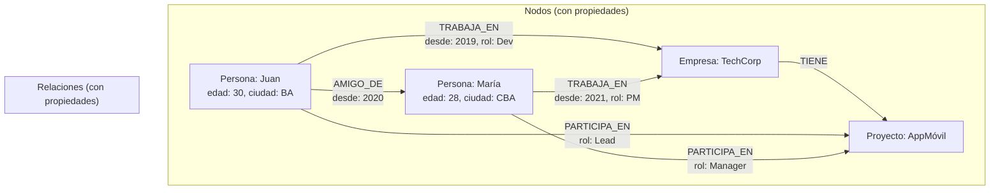

# Clase 11 — Neo4j: Bases de Datos de Grafos

## 1. Instalación y Configuración de Neo4j

### Docker

```bash
docker run -d \
  --name neo4j-clase11 \
  -p 7474:7474 \
  -p 7687:7687 \
  -e NEO4J_AUTH=neo4j/password123 \
  neo4j:5

# Browser: http://localhost:7474
# Bolt: bolt://localhost:7687
```

### Ubuntu/Debian

```bash
wget -O - https://debian.neo4j.com/neotechnology.gpg.key | sudo apt-key add -
echo 'deb https://debian.neo4j.com stable latest' | sudo tee /etc/apt/sources.list.d/neo4j.list

sudo apt update
sudo apt install -y neo4j

sudo systemctl start neo4j
sudo systemctl enable neo4j
```

### Windows

1. Descargar desde https://neo4j.com/download-center/
2. Instalar Neo4j Desktop
3. Crear DBMS local y start

### Verificar

```bash
# Conectar con cypher-shell
cypher-shell -u neo4j -p password123
```

## 2. Modelo de Datos: Nodos, Relaciones, Propiedades



### Elementos

| Elemento | Descripción | Ejemplo |
|----------|-------------|---------|
| Nodo | Entidad con labels y propiedades | `(juan:Persona {nombre: "Juan"})` |
| Relación | Conexión dirigida entre nodos | `(juan)-[:AMIGO_DE]->(maria)` |
| Propiedad | Key-value en nodos o relaciones | `{nombre: "Juan", edad: 30}` |
| Label | Categoría de nodo | `:Persona`, `:Empresa` |
| Tipo de relación | Categoría de relación | `:AMIGO_DE`, `:TRABAJA_EN` |

## 3. Cypher: Lenguaje de Consulta

### 3.1 Crear Nodos y Relaciones

```cypher
-- Crear nodos
CREATE (juan:Persona {nombre: "Juan", edad: 30, ciudad: "Buenos Aires"})
CREATE (maria:Persona {nombre: "María", edad: 28, ciudad: "Córdoba"})
CREATE (pedro:Persona {nombre: "Pedro", edad: 35, ciudad: "Buenos Aires"})
CREATE (ana:Persona {nombre: "Ana", edad: 25, ciudad: "Rosario"})

-- Crear relaciones
CREATE (juan)-[:AMIGO_DE {desde: 2020}]->(maria)
CREATE (juan)-[:AMIGO_DE {desde: 2018}]->(pedro)
CREATE (maria)-[:AMIGO_DE {desde: 2021}]->(ana)
CREATE (pedro)-[:AMIGO_DE {desde: 2019}]->(ana)

-- Crear con MATCH (si los nodos ya existen)
MATCH (a:Persona {nombre: "Juan"}), (b:Persona {nombre: "Ana"})
CREATE (a)-[:AMIGO_DE {desde: 2022}]->(b)

-- MERGE: crear si no existe
MERGE (juan:Persona {nombre: "Juan"})
ON CREATE SET juan.edad = 30, juan.ciudad = "Buenos Aires"
```

### 3.2 Consultas Básicas

```cypher
-- Todos los nodos Persona
MATCH (p:Persona) RETURN p.nombre, p.edad

-- Personas de Buenos Aires
MATCH (p:Persona {ciudad: "Buenos Aires"}) RETURN p.nombre

-- Amigos de Juan
MATCH (juan:Persona {nombre: "Juan"})-[:AMIGO_DE]->(amigo)
RETURN amigo.nombre, amigo.ciudad

-- Amigos de amigos (2 niveles)
MATCH (juan:Persona {nombre: "Juan"})-[:AMIGO_DE*2]->(amigo2)
RETURN DISTINCT amigo2.nombre

-- Mutual friends entre Juan y María
MATCH (juan:Persona {nombre: "Juan"})-[:AMIGO_DE]->(amigo)<-[:AMIGO_DE]-(maria:Persona {nombre: "María"})
RETURN amigo.nombre
```

### 3.3 Patrones de Ruta

```cypher
-- Ruta de longitud variable (1 a 3 saltos)
MATCH path = (juan:Persona {nombre: "Juan"})-[:AMIGO_DE*1..3]->(destino)
RETURN path

-- Camino más corto
MATCH path = shortestPath(
    (juan:Persona {nombre: "Juan"})-[:AMIGO_DE*]-(ana:Persona {nombre: "Ana"})
)
RETURN path

-- Todos los caminos (max 5 saltos)
MATCH path = allShortestPaths(
    (juan:Persona {nombre: "Juan"})-[:AMIGO_DE*1..5]-(ana:Persona {nombre: "Ana"})
)
RETURN path
```

### 3.4 Filtrado y Agregación

```cypher
-- Filtrar por propiedad en relación
MATCH (p:Persona)-[r:AMIGO_DE]->(amigo)
WHERE r.desde < 2020
RETURN p.nombre, amigo.nombre, r.desde

-- Contar amigos
MATCH (p:Persona)-[:AMIGO_DE]->()
RETURN p.nombre, count(*) as num_amigos
ORDER BY num_amigos DESC

-- Filtrar por cantidad
MATCH (p:Persona)-[:AMIGO_DE]->()
WITH p, count(*) as num_amigos
WHERE num_amigos >= 2
RETURN p.nombre, num_amigos
```

## 4. Modelar una Red de Recomendaciones

### Esquema

```cypher
-- Usuarios
CREATE (u1:Usuario {id: 1, nombre: "Carlos"})
CREATE (u2:Usuario {id: 2, nombre: "Ana"})
CREATE (u3:Usuario {id: 3, nombre: "Pedro"})
CREATE (u4:Usuario {id: 4, nombre: "María"})
CREATE (u5:Usuario {id: 5, nombre: "Laura"})

-- Productos
CREATE (p1:Producto {id: 1, nombre: "Laptop", categoria: "Electrónica"})
CREATE (p2:Producto {id: 2, nombre: "Mouse", categoria: "Electrónica"})
CREATE (p3:Producto {id: 3, nombre: "Teclado", categoria: "Electrónica"})
CREATE (p4:Producto {id: 4, nombre: "Libro MongoDB", categoria: "Libros"})
CREATE (p5:Producto {id: 5, nombre: "Libro Python", categoria: "Libros"})

-- Compras
CREATE (u1)-[:COMPRO {fecha: date("2024-01-10"), rating: 5}]->(p1)
CREATE (u1)-[:COMPRO {fecha: date("2024-01-12"), rating: 4}]->(p2)
CREATE (u2)-[:COMPRO {fecha: date("2024-01-11"), rating: 5}]->(p1)
CREATE (u2)-[:COMPRO {fecha: date("2024-01-15"), rating: 5}]->(p4)
CREATE (u3)-[:COMPRO {fecha: date("2024-01-12"), rating: 4}]->(p2)
CREATE (u3)-[:COMPRO {fecha: date("2024-01-13"), rating: 5}]->(p3)
CREATE (u4)-[:COMPRO {fecha: date("2024-01-14"), rating: 5}]->(p1)
CREATE (u4)-[:COMPRO {fecha: date("2024-01-16"), rating: 4}]->(p5)
CREATE (u5)-[:COMPRO {fecha: date("2024-01-15"), rating: 5}]->(p4)
CREATE (u5)-[:COMPRO {fecha: date("2024-01-17"), rating: 5}]->(p3)
```

### Consultas de Recomendación

```cypher
-- 1. "Usuarios que compraron X también compraron Y"
MATCH (u:Usuario)-[:COMPRO]->(p1:Producto {nombre: "Laptop"})<-[:COMPRO]-(u2)-[:COMPRO]->(recomendado)
WHERE u <> u2 AND NOT EXISTS {
    MATCH (u)-[:COMPRO]->(recomendado)
}
RETURN recomendado.nombre, count(*) as veces
ORDER BY veces DESC
LIMIT 5

-- 2. Recomendación basada en categorías
MATCH (u:Usuario {nombre: "Carlos"})-[:COMPRO]->(p:Producto)<-[:COMPRO]-(u2)-[:COMPRO]->(rec)
WHERE NOT (u)-[:COMPRO]->(rec)
  AND p.categoria = rec.categoria
RETURN rec.nombre, rec.categoria, count(*) as score
ORDER BY score DESC

-- 3. PageRank de productos (cuáles son más "centrales")
MATCH (p:Producto)
RETURN p.nombre, count { ()-[:COMPRO]->(p) } as compras
ORDER BY compras DESC

-- 4. Comunidad de compradores similares
MATCH (u1:Usuario)-[:COMPRO]->(p)<-[:COMPRO]-(u2:Usuario)
WHERE u1 <> u2
WITH u1, u2, count(p) as productos_en_comun
WHERE productos_en_comun >= 2
RETURN u1.nombre, u2.nombre, productos_en_comun
ORDER BY productos_en_comun DESC
```

## 5. Índices y Constraints en Neo4j

```cypher
-- Crear índice
CREATE INDEX usuario_nombre_idx FOR (u:Usuario) ON (u.nombre)

-- Crear índice de texto completo
CREATE FULLTEXT INDEX producto_busqueda FOR (p:Producto) ON EACH [p.nombre, p.categoria]

-- Buscar con fulltext
CALL db.index.fulltext.queryNodes("producto_busqueda", "laptop electrónica")
YIELD node, score
RETURN node.nombre, score

-- Constraint de unicidad
CREATE CONSTRAINT usuario_id_unique FOR (u:Usuario) REQUIRE u.id IS UNIQUE

-- Ver índices
SHOW INDEXES

-- Ver constraints
SHOW CONSTRAINTS
```

## 6. Algoritmos de Grafos (Neo4j Graph Data Science)

```cypher
-- PageRank
CALL gds.pageRank.stream('mi_grafo')
YIELD nodeId, score
RETURN gds.util.asNode(nodeId).nombre AS nombre, score
ORDER BY score DESC
LIMIT 10

-- Camino más corto (Dijkstra)
MATCH (origen:Usuario {nombre: "Carlos"}), (destino:Usuario {nombre: "Laura"})
CALL gds.shortestPath.dijkstra.stream('mi_grafo', {
    sourceNode: origen,
    targetNode: destino,
    relationshipWeightProperty: 'distancia'
})
YIELD path, totalCost
RETURN path, totalCost

-- Community Detection (Louvain)
CALL gds.louvain.stream('mi_grafo')
YIELD nodeId, communityId
RETURN gds.util.asNode(nodeId).nombre AS nombre, communityId
ORDER BY communityId

-- Similitud de nodos (Node Similarity)
CALL gds.nodeSimilarity.stream('mi_grafo')
YIELD node1, node2, similarity
RETURN gds.util.asNode(node1).nombre AS usuario1,
       gds.util.asNode(node2).nombre AS usuario2,
       similarity
ORDER BY similarity DESC
LIMIT 10
```

## 7. Neo4j + MongoDB: Recomendaciones con Perfiles

```python
from neo4j import GraphDatabase
from pymongo import MongoClient

# Conexiones
neo4j = GraphDatabase.driver("bolt://localhost:7687", auth=("neo4j", "password123"))
mongo = MongoClient("mongodb://localhost:27017")
db_mongo = mongo["tienda"]

# Perfiles en MongoDB
def get_usuario_profile(user_id):
    return db_mongo.usuarios.find_one({"id": user_id}, {"_id": 0})

# Recomendaciones en Neo4j
def get_recommendaciones(user_id, limit=5):
    with neo4j.session() as session:
        result = session.run("""
            MATCH (u:Usuario {id: $user_id})-[:COMPRO]->(p:Producto)<-[:COMPRO]-(u2)-[:COMPRO]->(rec)
            WHERE NOT (u)-[:COMPRO]->(rec)
            RETURN rec.id AS producto_id, rec.nombre AS producto, count(*) AS score
            ORDER BY score DESC
            LIMIT $limit
        """, user_id=user_id, limit=limit)
        return result.data()

# Flujo completo
def get_producto_recomendados(user_id):
    perfil = get_usuario_profile(user_id)
    recomendaciones = get_recommendaciones(user_id)

    for rec in recomendaciones:
        producto = db_mongo.productos.find_one({"id": rec["producto_id"]}, {"_id": 0})
        rec["detalles"] = producto

    return {
        "usuario": perfil,
        "recomendaciones": recomendaciones
    }
```

## 8. Ejercicio Práctico

1. Instalar Neo4j con Docker
2. Conectar via Neo4j Browser (http://localhost:7474)
3. Crear grafo de red social con 20 usuarios y relaciones
4. Consultar: amigos de amigos, mutual friends, comunidad más conectada
5. Crear grafo de productos + compras + recomendaciones
6. Implementar algoritmo de recomendación "usuarios similares"
7. Crear índices y constraints
8. Integrar Neo4j + MongoDB: perfiles en MongoDB, relaciones en Neo4j
9. Visualizar grafos con Neo4j Bloom o D3.js
