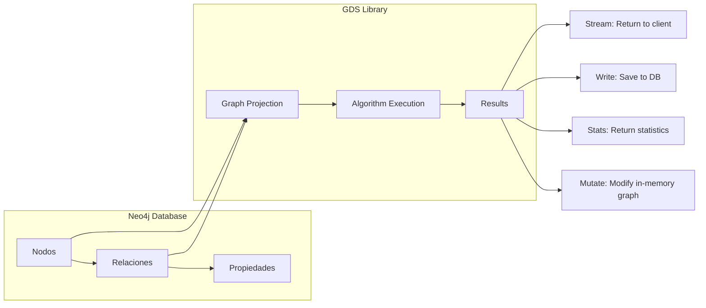
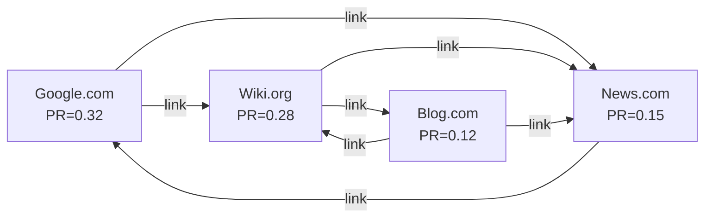
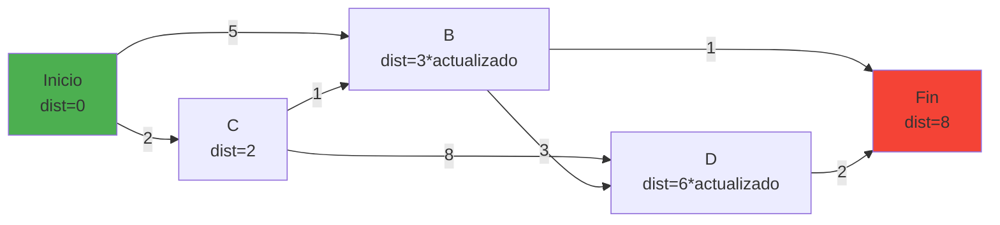
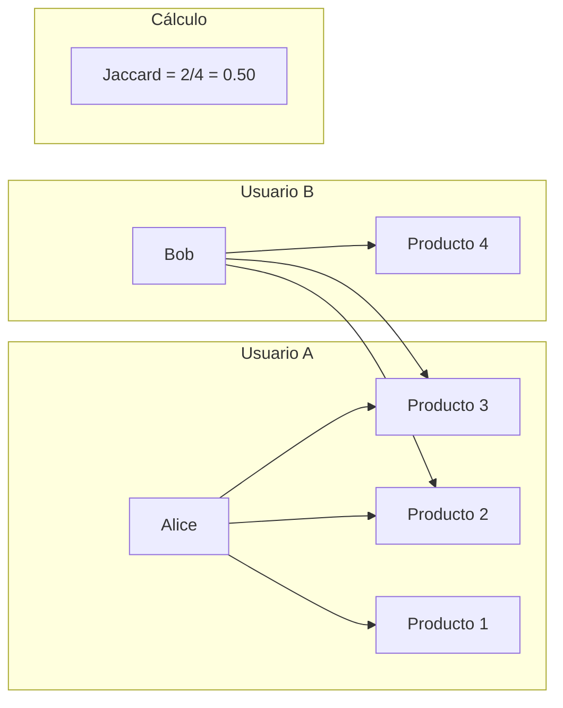
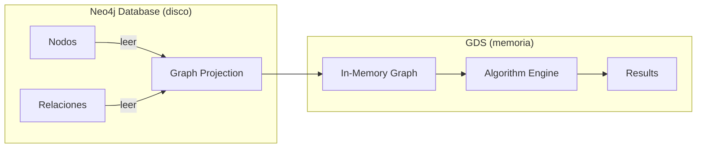
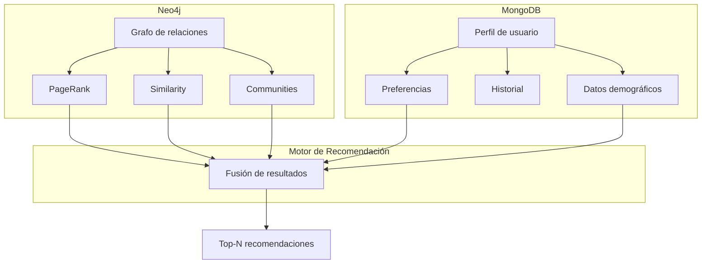

# Clase 13 — Neo4j II: Algoritmos de Grafos y Recomendaciones

---

## 1. Marco Teórico

### 1.1 Algoritmos de Grafos: ¿Por qué son importantes?

Los algoritmos de grafos son procedimientos matemáticos que permiten analizar las relaciones y estructuras dentro de un grafo. A diferencia de las bases de datos relacionales donde las consultas se centran en filas y columnas, los algoritmos de grafos explotan las **conexiones** entre los datos para descubrir patrones ocultos.

```
Grafo relacional típico:          Grafo analizado con algoritmos:
                                  
  A --- B                          A (centro, importance=0.85)
  |     |                          | \
  C --- D                          C  B (puente, betweenness=0.92)
                                   |   |
                                   E   D
                                   |   |
                                   F   G (hojas, periferia)
```

**¿Qué problemas resuelven?**

| Problema | Algoritmo | Ejemplo en la industria |
|----------|-----------|------------------------|
| ¿Quiénes son los más influyentes? | PageRank, Centrality | Influencers en redes sociales |
| ¿Cómo llegar de A a B? | Pathfinding, Dijkstra | Rutas de navegación GPS |
| ¿Qué grupos existen? | Community Detection | Segmentación de clientes |
| ¿Qué es similar? | Similarity (Jaccard) | Sistema de recomendaciones |
| ¿Hay fraude? | Triangle Count, Clustering | Detección de anillos de fraude |
| ¿Cuál es el camino crítico? | Betweenness | Puntos únicos de fallo en redes |

### 1.2 Clasificación de Algoritmos de Grafos

```mermaid
graph TD
    A[Algoritmos de Grafos] --> B[Centrality]
    A --> C[Pathfinding]
    A --> D[Community Detection]
    A --> E[Similarity]
    A --> F[Link Prediction]
    A --> G[Node Embedding]
    
    B --> B1[PageRank]
    B --> B2[Degree Centrality]
    B --> B3[Betweenness]
    B --> B4[Closeness]
    B --> B5[Eigenvector]
    
    C --> C1[Shortest Path]
    C --> C2[All Shortest Paths]
    C --> C3[Dijkstra]
    C --> C4[A*]
    C --> C5[Random Walk]
    
    D --> D1[Louvain]
    D --> D2[Label Propagation]
    D --> D3[WCC]
    D --> D4[Strongly Connected]
    D --> D5[Triangle Count]
    
    E --> E1[Node Similarity]
    E --> E2[Cosine Similarity]
    E --> E3[Jaccard]
    E --> E4[Pearson]
```



### 1.3 Graph Data Science Library (GDS)

Neo4j GDS es la librería oficial para análisis de grafos. Proporciona:

- **40+ algoritmos** pre-implementados (centrality, pathfinding, community, similarity)
- **Proyección de grafos** para trabajar con subconjuntos en memoria
- **Pipeline de ML** para embeddings y predicciones
- **Modos de ejecución**: stream, stats, write, mutate



### 1.4 Casos de Uso en la Industria

**Banca y Finanzas:**
- Detección de lavado de dinero (redes de transacciones sospechosas)
- Análisis de riesgo crediticio (redes de influencia)
- Detección de fraude (patrones de triangulación)

**Retail y E-commerce:**
- Sistemas de recomendación ("quienes compraron X también compraron Y")
- Análisis de carrito de compras
- Segmentación de clientes por comportamiento de compra

**Redes Sociales:**
- Ranking de influencia (PageRank)
- Detección de comunidades
- Sugerencia de amigos

**Telecomunicaciones:**
- Análisis de redes de llamadas
- Detección de comunidades de usuarios
- Optimización de infraestructura

**Salud:**
- Análisis de redes de enfermedades
- Rastreo de contactos (COVID-19)
- Descubrimiento de fármacos

---

## 2. Algoritmos de Centrality

### 2.1 PageRank — Importancia basada en conexiones

PageRank fue desarrollado por Larry Page y Sergey Brin en Google para rankear páginas web. La idea central: **un nodo es importante si muchos nodos importantes apuntan a él**.

**Fórmula matemática:**

```
PR(v) = (1 - d) / N + d × Σ (PR(w) / L(w))

Donde:
  PR(v)  = PageRank del nodo v
  d      = factor de amortiguamiento (tipicamente 0.85)
  N      = total de nodos en el grafo
  w      = nodos que apuntan a v (in-links)
  L(w)   = número de out-links del nodo w
```

**Ejemplo concreto: Ranking de páginas web**



**Cálculo paso a paso (iteración 1):**

```
N = 4, d = 0.85

PR(Google) = (1-0.85)/4 + 0.85 × (PR(News) / 1)
           = 0.0375 + 0.85 × (0.25)
           = 0.0375 + 0.2125
           = 0.25

PR(Wiki)   = (1-0.85)/4 + 0.85 × (PR(Google)/1 + PR(Blog)/2)
           = 0.0375 + 0.85 × (0.25 + 0.125)
           = 0.0375 + 0.85 × 0.375
           = 0.356

(continuar iteraciones hasta convergencia...)
```

**En Neo4j — Ejemplo completo:**

```cypher
// 1. Crear grafo de páginas web
CREATE (google:Page {name: 'Google', url: 'google.com'})
CREATE wiki:Page {name: 'Wikipedia', url: 'wiki.org'}
CREATE news:Page {name: 'News', url: 'news.com'}
CREATE blog:Page {name: 'Blog', url: 'blog.com'})

// Crear links
CREATE (google)-[:LINKS_TO]->(wiki)
CREATE (google)-[:LINKS_TO]->(news)
CREATE (wiki)-[:LINKS_TO]->(news)
CREATE (wiki)-[:LINKS_TO]->(blog)
CREATE (news)-[:LINKS_TO]->(google)
CREATE (blog)-[:LINKS_TO]->(wiki)
CREATE (blog)-[:LINKS_TO]->(news)

// 2. Proyectar grafo en memoria para GDS
CALL gds.graph.project(
  'web-graph',
  'Page',
  'LINKS_TO'
)

// 3. Ejecutar PageRank
CALL gds.pageRank.stream('web-graph')
YIELD nodeId, score
RETURN gds.util.asNode(nodeId).name AS page, score
ORDER BY score DESC

// Resultado esperado:
// +------------+--------+
// | page       | score  |
// +------------+--------+
// | Wikipedia  | 0.3560 |
// | Google     | 0.2500 |
// | News       | 0.2315 |
// | Blog       | 0.1625 |
// +------------+--------+

// 4. Guardar resultados en la BD
CALL gds.pageRank.write('web-graph', {
  writeProperty: 'pagerank'
})
YIELD nodePropertiesWritten, ranIterations

// 5. Verificar que se guardó
MATCH (p:Page)
RETURN p.name, p.pagerank
ORDER BY p.pagerank DESC
```

**Parámetros importantes de PageRank:**

| Parámetro | Descripción | Default |
|-----------|-------------|---------|
| dampingFactor | Factor de amortiguamiento (d) | 0.85 |
| maxIterations | Máximo de iteraciones | 20 |
| tolerance | Error máximo para converger | 0.0000001 |
| sourceNodes | Nodos fuente para Personalized PR | todos |

```cypher
// Personalized PageRank — solo desde Google
CALL gds.pageRank.stream('web-graph', {
  sourceNodes: ['Google'],
  dampingFactor: 0.9,
  maxIterations: 50,
  tolerance: 0.0001
})
YIELD nodeId, score
RETURN gds.util.asNode(nodeId).name AS page, score
ORDER BY score DESC
```

### 2.2 Degree Centrality — Número de conexiones

El Degree Centrality mide cuántas conexiones tiene un nodo. Es la métrica más simple pero muy útil.

**Conceptos:**

- **In-degree**: número de conexiones entrantes (quién apunta a mí)
- **Out-degree**: número de conexiones salientes (a quién apunto)
- **Total degree**: in-degree + out-degree

```cypher
// 1. Proyectar grafo
CALL gds.graph.project(
  'social-graph',
  'Person',
  {
    FOLLOWS: {orientation: 'UNDIRECTED'},
    BLOCKS: {orientation: 'DIRECTED'}
  }
)

// 2. Degree centrality
CALL gds.degree.stream('social-graph')
YIELD nodeId, score
RETURN gds.util.asNode(nodeId).name AS person, score AS connections
ORDER BY score DESC

// 3. In-degree (quién es el más seguido)
CALL gds.degree.stream('social-graph', {
  orientation: 'REVERSE'  // solo cuenta incoming
})
YIELD nodeId, score
RETURN gds.util.asNode(nodeId).name AS person, score AS followers
ORDER BY score DESC

// 4. Out-degree (quién más sigue)
CALL gds.degree.stream('social-graph', {
  orientation: 'NATURAL'  // solo cuenta outgoing
})
YIELD nodeId, score
RETURN gds.util.asNode(nodeId).name AS person, score AS following
ORDER BY score DESC

// 5. Guardar en la BD
CALL gds.degree.write('social-graph', {
  writeProperty: 'degreeCentrality'
})
YIELD nodePropertiesWritten
```

### 2.3 Betweenness Centrality — Puentes entre comunidades

Betweenness mide cuántos caminos más cortos pasan por un nodo. Los nodos con alto betweenness son **puentes** entre comunidades.

**Concepto visual:**

```
Comunidad A          Puente (alto betweenness)          Comunidad B
  A --- B ----------- C ----------- D --- E
  |     |                         |     |
  F --- G                        H --- I
```

El nodo C tiene el betweenness más alto porque todos los caminos entre A/G y D/I pasan por él.

```cypher
// 1. Crear grafo con estructura de puente
CREATE (a:User {name: 'Ana'})
CREATE (b:User {name: 'Bob'})
CREATE (c:User {name: 'Carlos'})  // PUENTE
CREATE (d:User {name: 'Diana'})
CREATE (e:User {name: 'Eve'})
CREATE (f:User {name: 'Frank'})
CREATE (g:User {name: 'Grace'})
CREATE (h:User {name: 'Hector'})
CREATE (i:User {name: 'Iris'})

// Comunidad A
CREATE (a)-[:FRIEND]->(b)
CREATE (a)-[:FRIEND]->(f)
CREATE (b)-[:FRIEND]->(g)
CREATE (f)-[:FRIEND]->(g)

// Puente
CREATE (b)-[:FRIEND]->(c)
CREATE (c)-[:FRIEND]->(d)

// Comunidad B
CREATE (d)-[:FRIEND]->(e)
CREATE (d)-[:FRIEND]->(h)
CREATE (e)-[:FRIEND]->(i)
CREATE (h)-[:FRIEND]->(i)

// 2. Proyectar y ejecutar
CALL gds.graph.project(
  'bridge-graph',
  'User',
  'FRIEND'
)

CALL gds.betweenness.stream('bridge-graph')
YIELD nodeId, score
RETURN gds.util.asNode(nodeId).name AS person, score
ORDER BY score DESC

// Resultado esperado:
// +---------+-------+
// | person  | score |
// +---------+-------+
// | Carlos  | 12.0  |  ← PUENTE
// | Bob     | 8.0   |
// | Diana   | 8.0   |
// | Ana     | 0.0   |
// | Eve     | 0.0   |
// +---------+-------+
```

### 2.4 Closeness Centrality — Qué tan cerca está de todos

Closeness mide qué tan cerca está un nodo de todos los demás nodos. Se calcula como la inversa de la suma de las distancias más cortas.

```
Closeness(v) = (N - 1) / Σ d(v, u)

Donde:
  N = total de nodos
  d(v, u) = distancia más corta desde v hasta u
```

```cypher
// Closeness centrality
CALL gds.closeness.stream('bridge-graph')
YIELD nodeId, score
RETURN gds.util.asNode(nodeId).name AS person, score
ORDER BY score DESC

// Resultado: el nodo central (Carlos) tiene mayor closeness
// +---------+--------+
// | person  | score  |
// +---------+--------+
// | Carlos  | 0.4444 |
// | Bob     | 0.3750 |
// | Diana   | 0.3750 |
// | Ana     | 0.2222 |
// +---------+--------+
```

### 2.5 Eigenvector Centrality

Eigenvector mide la influencia de un nodo basándose en la importancia de sus vecinos. Un nodo es importante si está conectado a otros nodos importantes.

```cypher
// Eigenvector centrality
CALL gds.eigenvector.stream('social-graph')
YIELD nodeId, score
RETURN gds.util.asNode(nodeId).name AS person, score
ORDER BY score DESC
```

---

## 3. Pathfinding (Búsqueda de Caminos)

### 3.1 Shortest Path — Dijkstra

El algoritmo de Dijkstra encuentra el camino más corto entre dos nodos, considerando **pesos** en las relaciones.

**Proceso paso a paso:**



**Ejemplo completo con Neo4j:**

```cypher
// 1. Crear grafo de ciudades con distancias
CREATE (lima:City {name: 'Lima', lat: -12.046, lon: -77.043})
CREATE (arequipa:City {name: 'Arequipa', lat: -16.409, lon: -71.537})
CREATE (cusco:City {name: 'Cusco', lat: -13.532, lon: -71.967})
CREATE (puno:City {name: 'Puno', lat: -15.843, lon: -70.022})
CREATE (trujillo:City {name: 'Trujillo', lat: -8.109, lon: -79.022})
CREATE (iquitos:City {name: 'Iquitos', lat: -3.749, lon: -73.253})

// Crear carreteras con distancias en km
CREATE (lima)-[:CARRETERA {km: 1010}]->(arequipa)
CREATE (lima)-[:CARRETERA {km: 1105}]->(cusco)
CREATE (lima)-[:CARRETERA {km: 1297}]->(puno)
CREATE (lima)-[:CARRETERA {km: 561}]->(trujillo)
CREATE (arequipa)-[:CARRETERA {km: 232}]->(cusco)
CREATE (arequipa)-[:CARRETERA {km: 383}]->(puno)
CREATE (cusco)-[:CARRETERA {km: 330}]->(puno)
CREATE (trujillo)-[:CARRETERA {km: 485}]->(arequipa)

// 2. Proyectar grafo con pesos
CALL gds.graph.project(
  'cities',
  'City',
  'CARRETERA',
  {
    relationshipProperties: 'km'
  }
)

// 3. Dijkstra: camino más corto de Lima a Puno
CALL gds.shortestPath.dijkstra.stream('cities', {
  sourceNode: 'Lima',
  targetNode: 'Puno',
  relationshipWeightProperty: 'km'
})
YIELD index, sourceNode, targetNode, distance, nodeIds, costs, path
RETURN
  gds.util.asNode(sourceNode).name AS origen,
  gds.util.asNode(targetNode).name AS destino,
  distance AS distancia_km,
  [nodeId IN nodeIds | gds.util.asNode(nodeId).name] AS ruta,
  costs AS costos

// Resultado esperado:
// +--------+---------+-----------+------------------------------------+------------------+
// | origen | destino | distancia_km | ruta                             | costos           |
// +--------+---------+-----------+------------------------------------+------------------+
// | Lima   | Puno    | 1242      | [Lima, Arequipa, Puno]            | [0, 1010, 1242]  |
// +--------+---------+-----------+------------------------------------+------------------+
// (vs 1297 km directo Lima→Puno, Dijkstra encuentra la ruta corta vía Arequipa)

// 4. Sin pesos (camino más corto por número de saltos)
MATCH (start:City {name: 'Lima'}), (end:City {name: 'Puno'})
CALL gds.shortestPath.dijkstra.stream('cities', {
  sourceNode: start,
  targetNode: end
})
YIELD distance, nodeIds
RETURN distance AS saltos,
       [nodeId IN nodeIds | gds.util.asNode(nodeId).name] AS ruta
```

### 3.2 All Shortest Paths — Todos los caminos más cortos

```cypher
// Encontrar TODOS los caminos más cortos entre Lima y Puno
CALL gds.allShortestPaths.stream('cities', {
  sourceNode: 'Lima'
})
YIELD sourceNodeId, targetNodeId, distance
WHERE gds.util.asNode(targetNodeId).name = 'Puno'
RETURN
  distance AS distancia,
  gds.util.asNode(targetNodeId).name AS destino

// Cypher nativo (sin GDS):
MATCH path = allShortestPaths(
  (start:City {name: 'Lima'})-[:CARRETERA*]->(end:City {name: 'Puno'})
)
RETURN [n IN nodes(path) | n.name] AS ruta,
       length(path) AS saltos
```

### 3.3 Single Source Shortest Path — Desde un nodo a todos

```cypher
// Camino más corto desde Lima a TODAS las ciudades
CALL gds.allShortestPaths.stream('cities', {
  sourceNode: 'Lima',
  relationshipWeightProperty: 'km'
})
YIELD sourceNodeId, targetNodeId, distance
RETURN
  gds.util.asNode(targetNodeId).name AS destino,
  distance AS distancia_km
ORDER BY distance ASC

// Resultado:
// +----------+-------------+
// | destino  | distancia_km|
// +----------+-------------+
// | Lima     | 0           |
// | Trujillo | 561         |
// | Arequipa | 1010        |
// | Cusco    | 1242        |
// | Puno     | 1242        |
// | Iquitos  | ∞ (no hay ruta)|
// +----------+-------------+
```

### 3.4 A* Algorithm — Ruta más corta con coordenadas

```cypher
// A* usa coordenadas geográficas para optimizar la búsqueda
CALL gds.shortestPath.astar.stream('cities', {
  sourceNode: 'Lima',
  targetNode: 'Cusco',
  relationshipWeightProperty: 'km',
  latitudeProperty: 'lat',
  longitudeProperty: 'lon'
})
YIELD distance, nodeIds
RETURN
  distance AS distancia_km,
  [nodeId IN nodeIds | gds.util.asNode(nodeId).name] AS ruta
```

### 3.5 Random Walk — Camino aleatorio

Los Random Walks son fundamentales para machine learning en grafos (Graph Neural Networks, node embeddings).

```cypher
// Random walk de 10 pasos desde Lima
CALL gds.randomWalk.stream('cities', {
  sourceNodes: ['Lima'],
  walkLength: 10,
  walksPerNode: 3,
  randomSeed: 42
})
YIELD nodeId, walkId, walkStep
RETURN
  walkId,
  walkStep,
  gds.util.asNode(nodeId).name AS ciudad
ORDER BY walkId, walkStep

// Ejemplo de salida:
// +--------+-----------+----------+
// | walkId | walkStep  | ciudad   |
// +--------+-----------+----------+
// | 0      | 0         | Lima     |
// | 0      | 1         | Arequipa |
// | 0      | 2         | Cusco    |
// | 0      | 3         | Puno     |
// | 0      | 4         | Arequipa |
// | ...    | ...       | ...      |
// +--------+-----------+----------+
```

---

## 4. Community Detection

### 4.1 Louvain Algorithm — Maximización de modularidad

El algoritmo de Louvain es el más popular para detección de comunidades. Busca maximizar la **modularidad**, que mide la densidad de conexiones dentro de comunidades vs entre comunidades.

```
Modularidad Q = (1/2m) × Σ [Aij - (ki × kj)/(2m)] × δ(ci, cj)

Donde:
  Aij = 1 si i y j están conectados
  ki, kj = degree de los nodos
  m = total de aristas
  ci, cj = comunidad del nodo
  δ(ci, cj) = 1 si están en la misma comunidad
```

**Proceso de Louvain:**

```mermaid
graph TD
    subgraph "Paso 1: Asignación inicial"
        A1[ Nodo A] -.->|comunidad 1| B1[Nodo B]
        C1[Nodo C] -.->|comunidad 2| D1[Nodo D]
        E1[Nodo E] -.->|comunidad 3| F1[Nodo F]
    end
    
    subgraph "Paso 2: Optimización local"
        A2[Nodo A] -.->|comunidad 1| B2[Nodo B]
        A2 -.->|comunidad 1| C2[Nodo C]  ← movido
        D2[Nodo D] -.->|comunidad 2| E2[Nodo E]
        E2 -.->|comunidad 2| F2[Nodo F]  ← movido
    end
    
    subgraph "Paso 3: Agregación"
        G[Super-nodo 1<br/>A+B+C] -.->|comunidad 1| H[Super-nodo 2<br/>D+E+F]
    end
```

**Ejemplo completo:**

```cypher
// 1. Crear red social con comunidades naturales
// Comunidad de Amigos del Trabajo
CREATE (ana:Person {name: 'Ana', dept: 'IT'})
CREATE (bob:Person {name: 'Bob', dept: 'IT'})
CREATE (carol:Person {name: 'Carol', dept: 'IT'})
CREATE (dave:Person {name: 'Dave', dept: 'IT'})

// Comunidad de Amigos del Deporte
CREATE (eve:Person {name: 'Eve', dept: 'HR'})
CREATE (frank:Person {name: 'Frank', dept: 'HR'})
CREATE (grace:Person {name: 'Grace', dept: 'HR'})

// Comunidad de Amigos de la Universidad
CREATE (hector:Person {name: 'Hector', dept: 'Sales'})
CREATE (iris:Person {name: 'Iris', dept: 'Sales'})
CREATE (jack:Person {name: 'Jack', dept: 'Sales'})

// Conexiones densas dentro de comunidades
CREATE (ana)-[:FRIEND]->(bob)
CREATE (ana)-[:FRIEND]->(carol)
CREATE (bob)-[:FRIEND]->(carol)
CREATE (bob)-[:FRIEND]->(dave)
CREATE (carol)-[:FRIEND]->(dave)

CREATE (eve)-[:FRIEND]->(frank)
CREATE (eve)-[:FRIEND]->(grace)
CREATE (frank)-[:FRIEND]->(grace)

CREATE (hector)-[:FRIEND]->(iris)
CREATE (hector)-[:FRIEND]->(jack)
CREATE (iris)-[:FRIEND]->(jack)

// Conexiones débiles entre comunidades (puentes)
CREATE (ana)-[:FRIEND]->(eve)
CREATE (frank)-[:FRIEND]->(hector)

// 2. Proyectar grafo
CALL gds.graph.project(
  'social',
  'Person',
  'FRIEND'
)

// 3. Ejecutar Louvain
CALL gds.louvain.stream('social')
YIELD nodeId, communityId, intermediateCommunityIds
RETURN
  gds.util.asNode(nodeId).name AS persona,
  communityId AS comunidad,
  intermediateCommunityIds AS pasos
ORDER BY communityId, persona

// Resultado esperado:
// +---------+------------+------------------+
// | persona | comunidad  | pasos            |
// +---------+------------+------------------+
// | Ana     | 1          | [1, 1]           |
// | Bob     | 1          | [1, 1]           |
// | Carol   | 1          | [1, 1]           |
// | Dave    | 1          | [1, 1]           |
// | Eve     | 2          | [2, 2]           |
// | Frank   | 2          | [2, 2]           |
// | Grace   | 2          | [2, 2]           |
// | Hector  | 3          | [3, 3]           |
// | Iris    | 3          | [3, 3]           |
// | Jack    | 3          | [3, 3]           |
// +---------+------------+------------------+

// 4. Guardar comunidades en la BD
CALL gds.louvain.write('social', {
  writeProperty: 'community'
})
YIELD communityCount, modularity
RETURN communityCount AS num_comunidades, modularity

// 5. Ver comunidades guardadas
MATCH (p:Person)
RETURN p.community AS comunidad, collect(p.name) AS miembros
ORDER BY comunidad
```

### 4.2 Label Propagation — Algoritmo simple y rápido

Label Propagation es más rápido que Louvain pero menos preciso. Cada nodo adopta la etiqueta más frecuente entre sus vecinos.

```cypher
// Label Propagation
CALL gds.labelPropagation.stream('social')
YIELD nodeId, communityId
RETURN
  gds.util.asNode(nodeId).name AS persona,
  communityId AS comunidad
ORDER BY communityId

// Guardar resultado
CALL gds.labelPropagation.write('social', {
  writeProperty: 'lpCommunity'
})
YIELD communityCount, ranIterations, didConverge
```

**Comparación Louvain vs Label Propagation:**

| Aspecto | Louvain | Label Propagation |
|---------|---------|-------------------|
| Velocidad | O(n log n) | O(n) |
| Calidad | Alta (max modularidad) | Media |
| Determinístico | Sí | No (varía entre ejecuciones) |
| Parámetros | resolution, maxLevels | maxIterations |
| Uso ideal | Análisis preciso | Grafos grandes, rapidez |

### 4.3 Weakly Connected Components (WCC)

WCC encuentra **componentes aislados** en el grafo — grupos de nodos que están conectados entre sí pero no con el resto.

```cypher
// Crear grafo con componentes aislados
CREATE (a:Node {name: 'A'})
CREATE (b:Node {name: 'B'})
CREATE (c:Node {name: 'C'})
CREATE (d:Node {name: 'D'})
CREATE (e:Node {name: 'E'})

CREATE (a)-[:REL]->(b)
CREATE (b)-[:REL]->(c)
// d y e están aislados
CREATE (d)-[:REL]->(e)

CALL gds.graph.project('components', 'Node', 'REL')

CALL gds.wcc.stream('components')
YIELD nodeId, componentId
RETURN
  componentId AS componente,
  gds.util.asNode(nodeId).name AS nodo
ORDER BY componente, nodo

// Resultado:
// +------------+------+
// | componente | nodo |
// +------------+------+
// | 0          | A    |
// | 0          | B    |
// | 0          | C    |
// | 1          | D    |
// | 1          | E    |
// +------------+------+
// 2 componentes separados
```

### 4.4 Triangle Count — Contar triángulos

Los triángulos representan "amigos en común" o clústeres fuertes. Alto triangle count indica comunidades muy unidas.

```cypher
CALL gds.triangleCount.stream('social')
YIELD nodeId, triangleCount, localClusteringCoefficient
RETURN
  gds.util.asNode(nodeId).name AS persona,
  triangleCount AS triángulos,
  localClusteringCoefficient AS coeficiente
ORDER BY triangleCount DESC

// Resultado:
// +---------+------------+-----------+
// | persona | triángulos | coef      |
// +---------+------------+-----------+
// | Bob     | 2          | 1.0       |  ← muy conectado
// | Ana     | 1          | 1.0       |
// | Carol   | 1          | 1.0       |
// | Eve     | 1          | 1.0       |
// | Dave    | 1          | 1.0       |
// +---------+------------+-----------+

// Triangle Count global
CALL gds.triangleCount.stats('social')
YIELD globalClusteringCoefficient, triangleCount, nodeCount
RETURN *
```

---

## 5. Similarity

### 5.1 Node Similarity (Jaccard)

La similitud de Jaccard mide qué tan similares son dos nodos basándose en sus **vecinos compartidos**.

```
Jaccard(A, B) = |Vecinos(A) ∩ Vecinos(B)| / |Vecinos(A) ∪ Vecinos(B)|
```

**Ejemplo visual:**



**Código completo:**

```cypher
// 1. Crear grafo de compras
CREATE (alice:User {name: 'Alice'})
CREATE (bob:User {name: 'Bob'})
CREATE (carol:User {name: 'Carol'})
CREATE (dave:User {name: 'Dave'})

CREATE (p1:Product {name: 'Laptop'})
CREATE (p2:Product {name: 'Mouse'})
CREATE (p3:Product {name: 'Teclado'})
CREATE (p4:Product {name: 'Monitor'})
CREATE (p5:Product {name: 'Audífonos'})
CREATE (p6:Product {name: 'Webcam'})

// Alice compró: Laptop, Mouse, Teclado
CREATE (alice)-[:COMPRÓ]->(p1)
CREATE (alice)-[:COMPRÓ]->(p2)
CREATE (alice)-[:COMPRÓ]->(p3)

// Bob compró: Mouse, Teclado, Monitor
CREATE (bob)-[:COMPRÓ]->(p2)
CREATE (bob)-[:COMPRÓ]->(p3)
CREATE (bob)-[:COMPRÓ]->(p4)

// Carol compró: Laptop, Mouse, Teclado, Monitor, Audífonos
CREATE (carol)-[:COMPRÓ]->(p1)
CREATE (carol)-[:COMPRÓ]->(p2)
CREATE (carol)-[:COMPRÓ]->(p3)
CREATE (carol)-[:COMPRÓ]->(p4)
CREATE (carol)-[:COMPRÓ]->(p5)

// Dave compró: Webcam, Audífonos
CREATE (dave)-[:COMPRÓ]->(p6)
CREATE (dave)-[:COMPRÓ]->(p5)

// 2. Proyectar grafo
CALL gds.graph.project(
  'products',
  ['User', 'Product'],
  'COMPRÓ'
)

// 3. Node Similarity
CALL gds.nodeSimilarity.stream('products')
YIELD node1, node2, similarity
RETURN
  gds.util.asNode(node1).name AS usuario1,
  gds.util.asNode(node2).name AS usuario2,
  round(similarity, 3) AS jaccard
ORDER BY jaccard DESC

// Resultado esperado:
// +----------+----------+---------+
// | usuario1 | usuario2 | jaccard |
// +----------+----------+---------+
// | Alice    | Carol    | 0.667   |  ← comparten Laptop, Mouse, Teclado
// | Bob      | Carol    | 0.500   |  ← comparten Mouse, Teclado, Monitor
// | Alice    | Bob      | 0.500   |  ← comparten Mouse, Teclado
// | Carol    | Dave     | 0.167   |  ← solo comparten Audífonos
// | Alice    | Dave     | 0.000   |  ← nada en común
// +----------+----------+---------+

// 4. Guardar similitudes
CALL gds.nodeSimilarity.write('products', {
  writeRelationshipType: 'SIMILAR_A',
  writeProperty: 'similarity'
})
YIELD nodesCompared, relationshipsWritten

// 5. Recomendar productos: "Usuarios similares compraron..."
MATCH (user:User {name: 'Alice'})-[:SIMILAR_A]->(similar:User)
MATCH (similar)-[:COMPRÓ]->(product:Product)
WHERE NOT (user)-[:COMPRÓ]->(product)
RETURN
  product.name AS producto_recomendado,
  similar.name AS por_usuario_similar,
  count(*) AS frecuencia
ORDER BY frecuencia DESC
```

### 5.2 Cosine Similarity

Para productos con propiedades numéricas (rating, precio):

```cypher
// Calcular similitud coseno entre productos
MATCH (p1:Product)-[:COMPRÓ]-(u1:User)
MATCH (p1)-[:COMPRÓ]-(u2:User)-[:COMPRÓ]-(p2:Product)
WHERE id(p1) < id(p2)
WITH p1, p2, collect(DISTINCT u1) AS sharedUsers
WHERE size(sharedUsers) >= 2
RETURN
  p1.name AS producto1,
  p2.name AS producto2,
  size(sharedUsers) AS compradores_comunes
ORDER BY compradores_comunes DESC
```

---

## 6. Graph Data Science (GDS) Library

### 6.1 ¿Qué es GDS?

GDS es un plugin oficial de Neo4j que proporciona:

- **40+ algoritmos** de grafos (centrality, pathfinding, community, similarity, ML)
- **Proyección de grafos** para trabajar en memoria
- **Pipeline de Machine Learning** para grafos
- **Embeddings** de nodos y grafos

### 6.2 Instalación

```bash
# 1. Descargar GDS desde neo4j.com/graph-data-science
# 2. Copiar el JAR en neo4j/plugins/

# Windows:
copy neo4j-graph-data-science-2.7.0.jar "C:\neo4j\plugins\"

# Linux:
cp neo4j-graph-data-science-2.7.0.jar /var/lib/neo4j/plugins/

# 3. Configurar neo4j.conf
# Agregar:
dbms.security.procedures.unrestricted=gds.*
dbms.security.procedures.allowlist=gds.*,apoc.*

# 4. Reiniciar Neo4j
neo4j restart

# 5. Verificar instalación
# En Cypher:
CALL gds.list()
```

### 6.3 Graph Projection — Proyectar subgrafo en memoria

Antes de ejecutar algoritmos, debemos proyectar el grafo en memoria para acceso rápido.



```cypher
// Proyección simple
CALL gds.graph.project(
  'my-graph',          // nombre del proyectado
  'Person',            // etiqueta de nodos
  'FRIEND'             // tipo de relación
)

// Proyección con propiedades
CALL gds.graph.project(
  'weighted-graph',
  'City',
  'CARRETERA',
  {
    nodeProperties: ['population'],          // incluir propiedades de nodos
    relationshipProperties: ['km']           // incluir propiedades de relaciones
  }
)

// Proyección de múltiples tipos
CALL gds.graph.project(
  'multi-graph',
  {
    User: {label: 'Person'},    // alias: tipo real
    Product: {label: 'Product'}
  },
  {
    PURCHASED: {orientation: 'UNDIRECTED'},
    REVIEWED: {orientation: 'DIRECTED'}
  }
)

// Verificar proyección
CALL gds.graph.list()
YIELD graphName, nodeCount, relationshipCount
RETURN *
```

### 6.4 Modos de Ejecución

```cypher
// STREAM: devuelve resultados sin guardar (para explorar)
CALL gds.pageRank.stream('my-graph')
YIELD nodeId, score
RETURN gds.util.asNode(nodeId).name, score
ORDER BY score DESC

// STATS: solo estadísticas de la ejecución
CALL gds.pageRank.stats('my-graph')
YIELD ranIterations, didConverge,CENTRALITY

// WRITE: guarda resultados en la BD
CALL gds.pageRank.write('my-graph', {
  writeProperty: 'pagerank'
})
YIELD nodePropertiesWritten, ranIterations

// MUTATE: modifica el grafo en memoria (para encadenar algoritmos)
CALL gds.pageRank.mutate('my-graph', {
  mutateProperty: 'pagerank'
})
YIELD nodePropertiesWritten
// Luego usar 'pagerank' en otro algoritmo en la misma sesión
```

### 6.5 Pipeline Completo de Data Science

```cypher
// === PIPELINE COMPLETO: Análisis de red de compras ===

// Paso 1: Proyectar grafo
CALL gds.graph.project(
  'ecommerce',
  ['User', 'Product'],
  {
    PURCHASED: {orientation: 'UNDIRECTED'},
    SIMILAR: {orientation: 'UNDIRECTED'}
  }
)

// Paso 2: Calcular PageRank de productos (más importantes)
CALL gds.pageRank.write('ecommerce', {
  writeProperty: 'productRank'
})
YIELD nodePropertiesWritten
// "Productos populares basados en quién los compra"

// Paso 3: Detectar comunidades de compradores
CALL gds.louvain.write('ecommerce', {
  writeProperty: 'buyerCommunity'
})
YIELD communityCount
// "Segmentos de clientes"

// Paso 4: Encontrar productos similares
CALL gds.nodeSimilarity.write('ecommerce', {
  writeRelationshipType: 'SIMILAR_PRODUCT',
  writeProperty: 'similarity'
})
YIELD relationshipsWritten
// "Productos que se compran juntos"

// Paso 5: Análisis de centralidad de usuarios
CALL gds.degree.write('ecommerce', {
  writeProperty: 'userInfluence'
})
YIELD nodePropertiesWritten
// "Usuarios más influyentes"

// Paso 6: Consultar resultados consolidados
MATCH (u:User)
MATCH (u)-[:PURCHASED]->(p:Product)
WHERE p.productRank IS NOT NULL
RETURN
  u.name AS usuario,
  u.buyerCommunity AS comunidad,
  u.userInfluence AS influencia,
  p.name AS producto,
  p.productRank AS importancia
ORDER BY p.productRank DESC
LIMIT 20
```

---

## 7. Casos de Uso: Sistema de Recomendaciones

### 7.1 "Usuarios que compraron X también compraron Y"

```cypher
// Recomendación basada en co-ocurrencia
MATCH (target:User {name: $userName})-[:COMPRÓ]->(p:Product)
MATCH (p)<-[:COMPRÓ]-(other:User)-[:COMPRÓ]->(rec:Product)
WHERE NOT (target)-[:COMPRÓ]->(rec)
  AND target <> other
RETURN
  rec.name AS producto,
  rec.category AS categoría,
  count(DISTINCT other) AS compradores_similares,
  count(DISTINCT other) * 1.0 / 
    (SELECT count(*) FROM User) AS confidence
ORDER BY compradores_similares DESC
LIMIT 10

// Parámetro: 'Alice'
// Resultado esperado:
// +--------------+----------+-----------+------------+
// | producto     | categoría| compradores| confidence |
// +--------------+----------+-----------+------------+
// | Monitor      | Tech     | 45        | 0.30       |
// | Webcam       | Tech     | 32        | 0.21       |
// | Silla Gaming | Furniture| 28        | 0.19       |
// +--------------+----------+-----------+------------+
```

### 7.2 Recomendación basada en categorías

```cypher
// Encontrar productos de categorías que le gustan al usuario
MATCH (u:User {name: $userName})-[:COMPRÓ]->(p:Product)-[:BELONGS_TO]->(cat:Category)
WITH u, cat, count(p) AS purchases
ORDER BY purchases DESC
LIMIT 3  // Top 3 categorías favoritas

MATCH (cat)<-[:BELONGS_TO]-(rec:Product)
WHERE NOT (u)-[:COMPRÓ]->(rec)
RETURN
  rec.name AS producto,
  cat.name AS categoría,
  rec.price AS precio,
  purchases AS importancia_categoría
ORDER BY purchases DESC, rec.price ASC
LIMIT 10
```

### 7.3 Similitud de usuarios con GDS

```cypher
// Encontrar usuarios más similares y recomendar lo que ellos compraron
CALL gds.nodeSimilarity.stream('ecommerce', {
  topK: 5  // top 5 usuarios más similares
})
YIELD node1, node2, similarity
WITH gds.util.asNode(node1) AS user, gds.util.asNode(node2) AS similar, similarity
WHERE user.name = 'Alice'

MATCH (similar)-[:COMPRÓ]->(rec:Product)
WHERE NOT (user)-[:COMPRÓ]->(rec)

RETURN
  rec.name AS producto,
  sum(similarity) AS score_total,
  count(*) AS coincidencias
ORDER BY score_total DESC
LIMIT 10
```

### 7.4 Recomendación híbrida con datos de MongoDB



**Código de integración (Node.js):**

```javascript
// Conexión a MongoDB para perfil
const { MongoClient } = require('mongodb');
const neo4j = require('neo4j-driver');

async function getRecommendations(userId) {
    // 1. Obtener perfil del usuario desde MongoDB
    const mongoClient = new MongoClient('mongodb://localhost:27017');
    const db = mongoClient.db('ecommerce');
    const userProfile = await db.collection('users').findOne({ _id: userId });
    
    // 2. Consultar Neo4j para recomendaciones basadas en grafo
    const driver = neo4j.driver('bolt://localhost:7687', 
        neo4j.auth.basic('neo4j', 'password'));
    const session = driver.session();
    
    const graphRecs = await session.run(`
        // Recomendación basada en similitud de compra
        MATCH (target:User {mongoId: $userId})-[:COMPRÓ]->(p:Product)
        MATCH (p)<-[:COMPRÓ]-(other:User)-[:COMPRÓ]->(rec:Product)
        WHERE NOT (target)-[:COMPRÓ]->(rec)
          AND target <> other
        WITH rec, count(DISTINCT other) AS score
        ORDER BY score DESC
        LIMIT 10
        RETURN rec.mongoId AS productId, rec.name AS name, score
    `, { userId });
    
    // 3. Combinar con preferencias de MongoDB
    const categoryPrefs = userProfile.preferredCategories;
    const combinedRecs = graphRecs.records.map(rec => ({
        ...rec.toObject(),
        categoryBoost: categoryPrefs.includes(rec.get('category')) ? 1.5 : 1.0
    }));
    
    // 4. Ordenar por score final
    const finalRecs = combinedRecs
        .map(r => ({ ...r, finalScore: r.score * r.categoryBoost }))
        .sort((a, b) => b.finalScore - a.finalScore)
        .slice(0, 10);
    
    await session.close();
    await mongoClient.close();
    
    return finalRecs;
}
```

### 7.5 Productos similares con Node Similarity

```cypher
// Encontrar productos similares basándose en quién los compra
CALL gds.nodeSimilarity.stream('ecommerce', {
  topK: 3,  // top 3 productos similares por producto
  similarityCutoff: 0.1
})
YIELD node1, node2, similarity
WITH 
  gds.util.asNode(node1) AS product1, 
  gds.util.asNode(node2) AS product2, 
  similarity
WHERE product1:Product AND product2:Product
RETURN
  product1.name AS producto1,
  product2.name AS producto2,
  round(similarity, 3) AS similitud
ORDER BY similitud DESC

// Resultado esperado:
// +----------+----------+----------+
// | producto1| producto2| similitud|
// +----------+----------+----------+
// | Mouse    | Teclado  | 0.800    |
// | Laptop   | Monitor  | 0.667    |
// | Mouse    | Laptop   | 0.500    |
// +----------+----------+----------+
```

### 7.6 Sistema de Recomendación Completo

```cypher
// Función completa de recomendación con múltiples señales
MATCH (u:User {name: $userName})

// Señal 1: Productos de usuarios similares
CALL {
    WITH u
    MATCH (u)-[:SIMILAR_A]-(similar:User)-[:COMPRÓ]->(rec:Product)
    WHERE NOT (u)-[:COMPRÓ]->(rec)
    RETURN rec, count(*) AS similarScore, 'similar' AS source
    GROUP BY rec
}

// Señal 2: Productos de la misma categoría preferida
WITH u, rec, similarScore, source
CALL {
    WITH u, rec
    MATCH (u)-[:COMPRÓ]->(p:Product)-[:BELONGS_TO]->(cat:Category)<-[:BELONGS_TO]-(rec)
    WHERE NOT (u)-[:COMPRÓ]->(rec)
    RETURN rec, count(*) AS categoryScore, 'category' AS catSource
    GROUP BY rec
}

// Combinar señales
WITH rec, 
     similarScore, 
     categoryScore,
     (similarScore * 0.7 + categoryScore * 0.3) AS combinedScore
ORDER BY combinedScore DESC
LIMIT 10

RETURN
  rec.name AS producto,
  rec.category AS categoría,
  rec.precio AS precio,
  round(combinedScore, 2) AS score_recomendación
```

---

## 8. Ejercicio Práctico

### Objetivo
Crear un sistema completo de recomendaciones para una plataforma de e-commerce usando Neo4j y algoritmos de grafos.

### Paso 1: Crear el grafo de e-commerce

```cypher
// Limpiar la base de datos
MATCH (n) DETACH DELETE n

// Crear Categorías
CREATE (tech:Category {name: 'Tecnología'})
CREATE (furniture:Category {name: 'Muebles'})
CREATE (clothing:Category {name: 'Ropa'})
CREATE (books:Category {name: 'Libros'})
CREATE (sports:Category {name: 'Deportes'})

// Crear Productos
CREATE (laptop:Product {name: 'Laptop Dell XPS', price: 1299, rating: 4.7})
CREATE (mouse:Product {name: 'Mouse Logitech', price: 45, rating: 4.5})
CREATE (teclado:Product {name: 'Teclado Mecánico', price: 120, rating: 4.8})
CREATE (monitor:Product {name: 'Monitor 4K', price: 599, rating: 4.6})
CREATE (webcam:Product {name: 'Webcam HD', price: 79, rating: 4.3})
CREATE (silla:Product {name: 'Silla Ergonómica', price: 350, rating: 4.4})
CREATE (escritorio:Product {name: 'Escritorio StandUp', price: 450, rating: 4.2})
CREATE (camisa:Product {name: 'Camisa Casual', price: 35, rating: 4.1})
CREATE (pantalon:Product {name: 'Pantalón Jean', price: 55, rating: 4.0})
CREATE (zapatillas:Product {name: 'Zapatillas Running', price: 120, rating: 4.5})
CREATE (libro1:Product {name: 'Clean Code', price: 30, rating: 4.9})
CREATE (libro2:Product {name: 'Design Patterns', price: 45, rating: 4.8})
CREATE (pelota:Product {name: 'Pelota Fútbol', price: 25, rating: 4.3})
CREATE (raqueta:Product {name: 'Raqueta Tenis', price: 89, rating: 4.4})
CREATE (auriculares:Product {name: 'Audífonos BT', price: 150, rating: 4.6})

// Asignar categorías
MATCH (p:Product {name: 'Laptop Dell XPS'}), (c:Category {name: 'Tecnología'}) CREATE (p)-[:BELONGS_TO]->(c)
MATCH (p:Product {name: 'Mouse Logitech'}), (c:Category {name: 'Tecnología'}) CREATE (p)-[:BELONGS_TO]->(c)
MATCH (p:Product {name: 'Teclado Mecánico'}), (c:Category {name: 'Tecnología'}) CREATE (p)-[:BELONGS_TO]->(c)
MATCH (p:Product {name: 'Monitor 4K'}), (c:Category {name: 'Tecnología'}) CREATE (p)-[:BELONGS_TO]->(c)
MATCH (p:Product {name: 'Webcam HD'}), (c:Category {name: 'Tecnología'}) CREATE (p)-[:BELONGS_TO]->(c)
MATCH (p:Product {name: 'Silla Ergonómica'}), (c:Category {name: 'Muebles'}) CREATE (p)-[:BELONGS_TO]->(c)
MATCH (p:Product {name: 'Escritorio StandUp'}), (c:Category {name: 'Muebles'}) CREATE (p)-[:BELONGS_TO]->(c)
MATCH (p:Product {name: 'Camisa Casual'}), (c:Category {name: 'Ropa'}) CREATE (p)-[:BELONGS_TO]->(c)
MATCH (p:Product {name: 'Pantalón Jean'}), (c:Category {name: 'Ropa'}) CREATE (p)-[:BELONGS_TO]->(c)
MATCH (p:Product {name: 'Zapatillas Running'}), (c:Category {name: 'Deportes'}) CREATE (p)-[:BELONGS_TO]->(c)
MATCH (p:Product {name: 'Clean Code'}), (c:Category {name: 'Libros'}) CREATE (p)-[:BELONGS_TO]->(c)
MATCH (p:Product {name: 'Design Patterns'}), (c:Category {name: 'Libros'}) CREATE (p)-[:BELONGS_TO]->(c)
MATCH (p:Product {name: 'Pelota Fútbol'}), (c:Category {name: 'Deportes'}) CREATE (p)-[:BELONGS_TO]->(c)
MATCH (p:Product {name: 'Raqueta Tenis'}), (c:Category {name: 'Deportes'}) CREATE (p)-[:BELONGS_TO]->(c)
MATCH (p:Product {name: 'Audífonos BT'}), (c:Category {name: 'Tecnología'}) CREATE (p)-[:BELONGS_TO]->(c)

// Crear 20 Usuarios
UNWIND range(1, 20) AS i
CREATE (u:User {
    name: 'Usuario' + i,
    age: toInteger(20 + rand() * 40),
    city: CASE toInteger(rand() * 5)
        WHEN 0 THEN 'Lima'
        WHEN 1 THEN 'Arequipa'
        WHEN 2 THEN 'Cusco'
        WHEN 3 THEN 'Trujillo'
        ELSE 'Puno'
    END
})

// Crear compras aleatorias
MATCH (u:User)
WITH u, rand() AS r
FOREACH (_ IN CASE WHEN r < 0.7 THEN [1] ELSE [] END |
    WITH u
    MATCH (p:Product)
    WITH u, p, rand() AS r2
    WHERE r2 < 0.3
    CREATE (u)-[:COMPRÓ {fecha: date(), amount: p.price}]->(p)
)

// Crear amistades entre usuarios
MATCH (u1:User), (u2:User)
WHERE id(u1) < id(u2) AND rand() < 0.15
CREATE (u1)-[:FRIEND]->(u2)

// Verificar datos
MATCH (n) RETURN labels(n)[0] AS tipo, count(n) AS total
// +------+-------+
// | tipo | total |
// +------+-------+
// | User | 20    |
// | Product| 15  |
// | Category| 5  |
// +------+-------+
```

### Paso 2: Ejecutar algoritmos

```cypher
// 1. Proyectar grafo
CALL gds.graph.project(
  'ecommerce-full',
  {
    User: {label: 'User'},
    Product: {label: 'Product'},
    Category: {label: 'Category'}
  },
  {
    COMPRÓ: {orientation: 'UNDIRECTED'},
    BELONGS_TO: {orientation: 'DIRECTED'},
    FRIEND: {orientation: 'UNDIRECTED'}
  }
)

// 2. PageRank de productos (ranking de importancia)
CALL gds.pageRank.write('ecommerce-full', {
  writeProperty: 'productImportance',
  relationshipWeightProperty: null
})
YIELD nodePropertiesWritten, ranIterations
RETURN nodePropertiesWritten, ranIterations

// 3. Degree centrality de usuarios (influencia)
CALL gds.degree.write('ecommerce-full', {
  writeProperty: 'userInfluence'
})
YIELD nodePropertiesWritten

// 4. Community detection (segmentación de clientes)
CALL gds.louvain.write('ecommerce-full', {
  writeProperty: 'buyerSegment'
})
YIELD communityCount, modularity
RETURN communityCount AS segmentos, round(modularity, 3) AS modularidad

// 5. Triangle count (grupos de amigos en común)
CALL gds.triangleCount.write('ecommerce-full', {
  writeProperty: 'triangleCount'
})
YIELD triangleCount
```

### Paso 3: Consultas de recomendación

```cypher
// R1: Top 5 productos más importantes (PageRank)
MATCH (p:Product)
WHERE p.productImportance IS NOT NULL
RETURN p.name, p.price, round(p.productImportance, 3) AS importancia
ORDER BY p.productImportance DESC
LIMIT 5

// R2: Top 5 usuarios más influyentes
MATCH (u:User)
WHERE u.userInfluence IS NOT NULL
RETURN u.name, u.city, round(u.userInfluence, 2) AS influencia
ORDER BY u.userInfluence DESC
LIMIT 5

// R3: Comunidades de compradores
MATCH (u:User)
WHERE u.buyerSegment IS NOT NULL
RETURN u.buyerSegment AS segmento, collect(u.name) AS usuarios
ORDER BY segmento

// R4: Ruta más corta entre dos usuarios
MATCH path = shortestPath(
    (a:User {name: 'Usuario1'})-[:FRIEND*]-(b:User {name: 'Usuario15'})
)
RETURN [n IN nodes(path) | n.name] AS ruta, length(path) AS saltos

// R5: Productos similares
CALL gds.nodeSimilarity.stream('ecommerce-full', {
  topK: 3
})
YIELD node1, node2, similarity
WITH 
  gds.util.asNode(node1) AS p1, 
  gds.util.asNode(node2) AS p2, 
  similarity
WHERE p1:Product AND p2:Product
RETURN p1.name, p2.name, round(similarity, 3) AS similitud
ORDER BY similitud DESC
LIMIT 10

// R6: Recomendación para un usuario específico
MATCH (u:User {name: 'Usuario1'})-[:COMPRÓ]->(p:Product)
MATCH (p)<-[:COMPRÓ]-(other:User)-[:COMPRÓ]->(rec:Product)
WHERE NOT (u)-[:COMPRÓ]->(rec) AND u <> other
RETURN rec.name AS recomendado, rec.precio AS precio, count(*) AS score
ORDER BY score DESC
LIMIT 5
```

### Paso 4: Comparar rendimiento con y sin índices

```cypher
// Sin índices — buscar usuario por nombre
PROFILE MATCH (u:User {name: 'Usuario5'})-[:COMPRÓ]->(p:Product)
RETURN p.name

// Crear índices
CREATE INDEX user_name FOR (u:User) ON (u.name)
CREATE INDEX product_name FOR (p:Product) ON (p.name)

// Con índices — misma consulta
PROFILE MATCH (u:User {name: 'Usuario5'})-[:COMPRÓ]->(p:Product)
RETURN p.name

// Comparar: con índices el plan usa Seek en lugar de AllNodesScan
// AllNodesScan: O(n) — lento
// NodeIndexSeek: O(log n) — rápido
```

### Paso 5: Métricas de rendimiento

```cypher
// Medir tiempo de ejecución de PageRank
CALL {
    CALL gds.pageRank.stream('ecommerce-full')
    YIELD nodeId, score
    RETURN collect({node: gds.util.asNode(nodeId).name, score: score}) AS results
}
RETURN results

// Usar CALL {} para medir tiempo
// En Neo4j Browser, habilitar "Query Profile" para ver tiempos
```

### Resumen de algoritmos ejecutados

| Algoritmo | Propósito | Resultado |
|-----------|-----------|-----------|
| PageRank | Ranking de productos | productImportance |
| Degree | Influencia de usuarios | userInfluence |
| Louvain | Segmentación de clientes | buyerSegment |
| Triangle Count | Grupos de amigos | triangleCount |
| Node Similarity | Productos similares | Relaciones SIMILAR |
| Shortest Path | Conexiones entre usuarios | Rutas de amistad |

### Preguntas de reflexión

1. ¿Qué productos tienen el PageRank más alto y por qué?
2. ¿Las comunidades detectadas por Louvain coinciden con las ciudades de los usuarios?
3. ¿Qué productos son recomendados para el Usuario1 basándose en similitud?
4. ¿Cómo cambiaría el resultado si usáramos Betweenness Centrality para detectar usuarios clave?
5. ¿Qué pasaría si eliminamos la relación FRIEND del grafo?

---

**Fin de la Clase 13 — Neo4j II: Algoritmos de Grafos y Recomendaciones**
