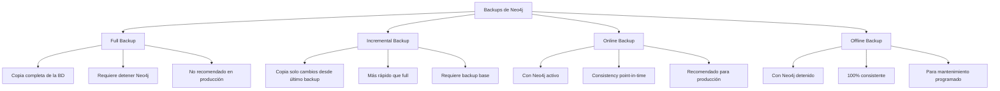
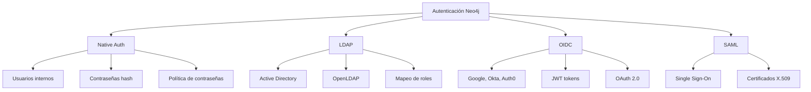

# Clase 14 — Neo4j III: Administración, Backups y Seguridad

---

## 1. Administración de Neo4j

### 1.1 Monitoreo

El monitoreo adecuado de Neo4j es esencial para garantizar rendimiento, disponibilidad y detección proactiva de problemas.

#### 1.1.1 Queries Activas

```cypher
// Ver todas las queries activas actualmente
CALL dbms.listQueries()
YIELD queryId, query, elapsedTimeMillis, status, username
RETURN queryId, query, elapsedTimeMillis AS tiempo_ms, status, username
ORDER BY elapsedTimeMillis DESC

// Resultado esperado:
// +-----------+-------------------------------------+----------+--------+----------+
// | queryId   | query                               | tiempo_ms| status | username |
// +-----------+-------------------------------------+----------+--------+----------+
// | 142       | MATCH (n:User) RETURN count(n)      | 1250     | RUNNING| neo4j    |
// | 143       | MATCH (n)-[:FRIEND]->(m) RETURN n   | 340      | RUNNING| admin    |
// +-----------+-------------------------------------+----------+--------+----------+

// Filtrar queries lentas (> 5 segundos)
CALL dbms.listQueries()
YIELD queryId, query, elapsedTimeMillis, username
WHERE elapsedTimeMillis > 5000
RETURN queryId, query, elapsedTimeMillis / 1000 AS segundos, username
ORDER BY elapsedTimeMillis DESC

// Detener una query específica
CALL dbms.killQuery(142)

// Detener todas las queries de un usuario
CALL dbms.listQueries()
YIELD queryId, username
WHERE username = 'usuario_lento'
CALL dbms.killQuery(queryId)
RETURN count(*) AS queries_terminadas
```

#### 1.1.2 Métricas de Rendimiento

```cypher
// Estadísticas de la base de datos
CALL dbms.listConfig()
YIELD name, value
WHERE name CONTAINS 'memory' OR name CONTAINS 'pagecache'
RETURN name, value
ORDER BY name

// Uso de memoria
CALL dbms.memory.heap.used()
YIELD heapUsed
RETURN heapUsed / 1024 / 1024 AS heap_mb

CALL dbms.memory.heap.total()
YIELD heapTotal
RETURN heapTotal / 1024 / 1024 AS heap_total_mb

CALL dbms.memory.pagecache.used()
YIELD used
RETURN used / 1024 / 1024 AS pagecache_mb

// Información de la base de datos
CALL dbms.database.datadir()
YIELD datadir
RETURN datadir

// Estado del store
CALL dbms.store.report()
YIELD storeSize
RETURN storeSize

// Estadísticas de nodos y relaciones
MATCH (n)
RETURN labels(n)[0] AS etiqueta, count(n) AS total
ORDER BY total DESC

MATCH ()-[r]->()
RETURN type(r) AS tipo_relacion, count(r) AS total
ORDER BY total DESC

// Estadísticas de índices
SHOW INDEXES

// Estadísticas de constraints
SHOW CONSTRAINTS
```

#### 1.1.3 JMX Metrics (Java Management Extensions)

```bash
# Neo4j expone métricas via JMX
# Puerto por defecto: 9999

# Conectar via jmxsh (herramienta Java)
jmxsh
> connect localhost 9999
> ls "org.neo4j:instance=kernel#0,name=Store file sizes"
> get "Page cache size"

# Métricas importantes:
# - Page cache hit ratio (debe ser > 98%)
# - Transaction count
# - Query execution time
# - Memory usage
# - Store file sizes
```

#### 1.1.4 Neo4j Ops Manager (Enterprise)

```yaml
# Ops Manager proporciona dashboard web para monitoreo
# Métricas monitoreadas:
# - CPU, Memory, Disk I/O
# - Query performance
# - Transaction throughput
# - Cluster health (Causal Clustering)
# - Backup status
# - Alertas configurables
```

### 1.2 Mantenimiento

#### 1.2.1 Consistency Checks

```bash
# Verificar consistencia de la base de datos (requiere Neo4j detenido)
neo4j-admin database consistency check neo4j

# Opciones de verificación
neo4j-admin database consistency check \
  --check-graph \
  --check-property-keys \
  --check-labels \
  --check-relationships

# Resultado esperado si todo está OK:
# [OK] Store size: 123 MB
# [OK] Node count: 15000
# [OK] Relationship count: 45000
# [OK] Property count: 90000
# [OK] No inconsistencies found
```

#### 1.2.2 Index Management

```cypher
// Crear índice
CREATE INDEX user_name_idx FOR (u:User) ON (u.name)

// Crear índice único
CREATE CONSTRAINT user_email_unique FOR (u:User) REQUIRE u.email IS UNIQUE

// Crear índice compuesto
CREATE INDEX user_city_age FOR (u:User) ON (u.city, u.age)

// Crear índice full-text (para búsquedas de texto)
CREATE FULLTEXT INDEX user_search FOR (u:User) ON EACH [u.name, u.email, u.bio]

// Buscar con full-text index
CALL db.index.fulltext.queryNodes('user_search', 'Juan García')
YIELD node, score
RETURN node.name, score
ORDER BY score DESC

// Listar todos los índices
SHOW INDEXES

// Eliminar índice
DROP INDEX user_name_idx

// Renombrar índice (solo en versiones recientes)
SHOW INDEXES YIELD name, type
// No existe RENAME INDEX directamente, se debe recrear
```

#### 1.2.3 Constraint Management

```cypher
// Unique constraint
CREATE CONSTRAINT FOR (u:User) REQUIRE u.email IS UNIQUE

// Existence constraint
CREATE CONSTRAINT FOR (u:User) REQUIRE u.name IS NOT NULL

// Node key (unique + not null)
CREATE CONSTRAINT FOR (u:User) REQUIRE (u.name, u.email) IS NODE KEY

// Listar constraints
SHOW CONSTRAINTS

// Eliminar constraint
DROP CONSTRAINT user_email_unique IF EXISTS

// Verificar que un constraint funciona
CREATE (u:User {name: 'Test', email: 'test@test.com'})
CREATE (u2:User {name: 'Test2', email: 'test@test.com'})  // Falla: viola unique constraint
```

#### 1.2.4 Schema Operations

```cypher
// Verificar schema actual
CALL db.schema()

// Información detallada del schema
CALL db.schema.visualization()

// Estado de los índices
CALL db.indexes()
```

### 1.3 Performance Tuning

#### 1.3.1 Memory Configuration

```properties
# neo4j.conf — Configuración de memoria

# === HEAP MEMORY ===
# Memoria para JVM (para procesamiento de queries)
# Regla general: 50% de RAM disponible, máximo 32GB
dbms.memory.heap.initial_size=2G
dbms.memory.heap.max_size=4G

# === PAGE CACHE ===
# Memoria para caché de páginas del disco
# Regla general: total RAM - heap - OS overhead (2-4GB)
dbms.memory.pagecache.size=8G

# === MEMORY POOL (Enterprise) ===
# Permite asignar memoria específica por función
# dbms.memory.memory_allocator.pagecache=6G
# dbms.memory.query_cache=1G
# dbms.memory.transaction_buffer=2G
```

**Regla de cálculo para un servidor de 16GB RAM:**

```
RAM Total:          16 GB
OS + servicios:     -2 GB
Heap (JVM):         -4 GB  (50% de 8GB disponible)
Page Cache:         -10 GB (restante)
= 
Heap: 4GB, Page Cache: 10GB
```

#### 1.3.2 Query Tuning con EXPLAIN y PROFILE

```cypher
// EXPLAIN — muestra el plan de ejecución SIN ejecutar
EXPLAIN MATCH (u:User {name: 'Juan'})-[:COMPRÓ]->(p:Product)
RETURN p.name

// Resultado (Query Plan):
// +------------------------------------------+
// | Operator                | Details         |
// +------------------------------------------+
// | ProduceResults          | p.name          |
// | Expand(All)             | (?, COMPRÓ, ?)  |
// | NodeIndexSeek           | :User(name)     |
// +------------------------------------------+

// PROFILE — ejecuta la query y muestra métricas reales
PROFILE MATCH (u:User {name: 'Juan'})-[:COMPRÓ]->(p:Product)
RETURN p.name

// Resultado con métricas:
// +------------------------------------------------------------+
// | Operator            | Details               | Rows | DbHits |
// +------------------------------------------------------------+
// | ProduceResults      | p.name                | 5    | 0      |
// | Expand(All)         | (?, COMPRÓ, ?)        | 5    | 12     |
// | NodeIndexSeek       | :User(name)           | 1    | 1      |
// +------------------------------------------------------------+
// Total DbHits: 13
// Planning time: 2ms
// Execution time: 15ms
```

**Operadores comunes y qué significan:**

| Operador | Significado | ¿Problema? |
|----------|-------------|------------|
| AllNodesScan | Escanea TODOS los nodos | SÍ — crear índice |
| NodeByLabelScan | Escanea todos los nodos de una etiqueta | Posible — crear índice |
| NodeIndexSeek | Usa un índice para encontrar nodos | NO — es bueno |
| NodeIndexRangeSeek | Usa rango en índice | NO — es bueno |
| Expand(All) | Sigue todas las relaciones | Posible — filtrar |
| Filter | Filtra resultados | Posible — mover a WHERE |
| Sort | Ordena resultados | Posible — usar índice |
| CartesianProduct | Producto cruz de dos consultas | SÍ — reescribir |

**Ejemplo de query lenta y optimización:**

```cypher
// LENTA — AllNodesScan
PROFILE MATCH (u:User)
WHERE u.city = 'Lima'
RETURN u.name

// Plan:
// AllNodesScan: 150000 nodos escaneados
// Filter: 15000 filtras, 5000 pasan

// RÁPIDA — NodeIndexSeek (con índice)
CREATE INDEX user_city FOR (u:User) ON (u.city)

PROFILE MATCH (u:User)
WHERE u.city = 'Lima'
RETURN u.name

// Plan:
// NodeIndexSeek: 1 índice buscado, 5000 resultados
// DbHits: 1 vs 150000
```

**Ejemplo de JOIN implicito lento:**

```cypher
// LENTA — doble label scan
PROFILE MATCH (u:User)-[:COMPRÓ]->(p:Product)-[:BELONGS_TO]->(c:Category)
WHERE c.name = 'Tecnología'
RETURN u.name, p.name

// Optimizada — empezar desde la categoría
PROFILE MATCH (c:Category {name: 'Tecnología'})<-[:BELONGS_TO]-(p:Product)<-[:COMPRÓ]-(u:User)
RETURN u.name, p.name
```

#### 1.3.3 Query Caching

```properties
# neo4j.conf — Configuración de caché

# Caché de resultados de query (si está habilitado)
# dbms.query_cache.size=1000

# Page cache warming (Enterprise)
# Pre-cargar páginas en memoria al iniciar
dbms.memory.pagecache.warmup.preload=true
dbms.memory.pagecache.warmup.preload_timestamp_filename=last_committed_tx_id
```

#### 1.3.4 Parallel Execution

```cypher
// Neo4j puede ejecutar operaciones en paralelo
// Habilitar parallel execution
// dbms.execution.force_intermediate_caches_size=256

// Ejemplo de query que se beneficia de paralelismo
MATCH (u:User)-[:COMPRÓ]->(p:Product)
WHERE u.age > 25
WITH u, collect(p) AS productos
WHERE size(productos) > 5
RETURN u.name, size(productos) AS total_compras
ORDER BY total_compras DESC
LIMIT 10

// Ejemplo de UNWIND paralelo
UNWIND range(1, 1000000) AS i
CREATE (n:Temp {value: i})
// Esta query puede usar múltiples threads
```

---

## 2. Backups de Neo4j

### 2.1 Tipos de Backup



### 2.2 Full Backup (Offline)

```bash
# DETENER Neo4j primero
neo4j stop

# Full backup
neo4j-admin database backup full \
  --from-path=/var/lib/neo4j/data/databases/neo4j \
  --to-path=/backup/neo4j/full-$(date +%Y%m%d)

# Ejemplo en Windows:
neo4j-admin.bat database backup full ^
  --from-path="C:\neo4j\data\databases\neo4j" ^
  --to-path="C:\backup\neo4j\full-20240115"

# Verificar que el backup se creó correctamente
ls -la /backup/neo4j/full-20240115/

# Reiniciar Neo4j
neo4j start
```

### 2.3 Online Backup (con Neo4j activo)

```bash
# Online backup con Neo4j corriendo
# Nota: Requiere Enterprise para online backup
neo4j-admin database backup \
  --from-path=neo4j://localhost:7687 \
  --to-path=/backup/neo4j/incremental-$(date +%Y%m%d) \
  --username=neo4j \
  --password=mi_password

# Backup incremental (solo cambios desde último backup)
neo4j-admin database backup incremental \
  --from-path=neo4j://localhost:7687 \
  --to-path=/backup/neo4j/incremental-$(date +%Y%m%d) \
  --base-backup=/backup/neo4j/full-20240115 \
  --username=neo4j \
  --password=mi_password
```

### 2.4 Backup a Directorio Remoto (NFS/S3)

```bash
# Backup a NFS
neo4j-admin database backup full \
  --from-path=/var/lib/neo4j/data/databases/neo4j \
  --to-path=/mnt/nfs-backup/neo4j/full-$(date +%Y%m%d)

# Backup a S3 (via s3fs o herramientas de AWS)
# 1. Montar S3 bucket
s3fs my-neo4j-backups /mnt/s3-backup -o url=https://s3.amazonaws.com

# 2. Ejecutar backup
neo4j-admin database backup full \
  --from-path=/var/lib/neo4j/data/databases/neo4j \
  --to-path=/mnt/s3-backup/neo4j/full-$(date +%Y%m%d)

# 3. Usando AWS CLI directamente
# Primero local, luego subir
neo4j-admin database backup full \
  --from-path=/var/lib/neo4j/data/databases/neo4j \
  --to-path=/tmp/neo4j-backup

aws s3 cp /tmp/neo4j-backup s3://my-neo4j-backups/full-$(date +%Y%m%d) --recursive
```

### 2.5 Restore

```bash
# DETENER Neo4j
neo4j stop

# Eliminar la base de datos actual (CUIDADO!)
rm -rf /var/lib/neo4j/data/databases/neo4j

# Restaurar desde backup
neo4j-admin database restore \
  --from-path=/backup/neo4j/full-20240115 \
  --to-path=/var/lib/neo4j/data/databases/neo4j

# Verificar restore
neo4j-admin database consistency check neo4j

# Iniciar Neo4j
neo4j start

# Verificar que los datos están correctos
# En Cypher:
MATCH (n) RETURN count(n)
```

### 2.6 Verificación Post-Restore

```cypher
// Después de restore, verificar:
// 1. Conteo de nodos
MATCH (n) RETURN labels(n)[0] AS tipo, count(n) AS total ORDER BY total DESC

// 2. Conteo de relaciones
MATCH ()-[r]->() RETURN type(r) AS tipo, count(r) AS total ORDER BY total DESC

// 3. Verificar datos críticos
MATCH (u:User)
WHERE u.email IS NOT NULL
RETURN count(u) AS usuarios_con_email

// 4. Verificar que los índices funcionan
SHOW INDEXES

// 5. Ejecutar una query compleja para verificar integridad
MATCH (u:User)-[:COMPRÓ]->(p:Product)-[:BELONGS_TO]->(c:Category)
RETURN c.name AS categoría, count(DISTINCT u) AS compradores, count(DISTINCT p) AS productos
ORDER BY compradores DESC
```

### 2.7 Script de Backup Automatizado Completo

```bash
#!/bin/bash
# === Script de Backup Automatizado para Neo4j ===
# Archivo: /opt/scripts/neo4j-backup.sh
# Crontab: 0 2 * * * /opt/scripts/neo4j-backup.sh

# Configuración
NEO4J_HOME="/var/lib/neo4j"
BACKUP_DIR="/backup/neo4j"
NEO4J_URI="neo4j://localhost:7687"
NEO4J_USER="neo4j"
NEO4J_PASS="mi_password_segura"
RETENTION_DAYS=30
LOG_FILE="/var/log/neo4j-backup.log"
DATE=$(date +%Y%m%d_%H%M%S)
BACKUP_PATH="${BACKUP_DIR}/backup-${DATE}"

# Función de logging
log() {
    echo "$(date '+%Y-%m-%d %H:%M:%S') - $1" | tee -a $LOG_FILE
}

# Verificar que Neo4j está corriendo
check_neo4j() {
    if ! systemctl is-active --quiet neo4j; then
        log "ERROR: Neo4j no está corriendo"
        exit 1
    fi
    log "Neo4j está activo"
}

# Crear directorio de backup
create_backup_dir() {
    mkdir -p $BACKUP_DIR
    if [ $? -ne 0 ]; then
        log "ERROR: No se pudo crear directorio $BACKUP_DIR"
        exit 1
    fi
    log "Directorio de backup: $BACKUP_DIR"
}

# Ejecutar backup
run_backup() {
    log "Iniciando backup a $BACKUP_PATH"
    
    neo4j-admin database backup \
        --from-path=$NEO4J_URI \
        --to-path=$BACKUP_PATH \
        --username=$NEO4J_USER \
        --password=$NEO4J_PASS
    
    if [ $? -eq 0 ]; then
        log "Backup completado exitosamente"
        # Calcular tamaño del backup
        SIZE=$(du -sh $BACKUP_PATH | cut -f1)
        log "Tamaño del backup: $SIZE"
    else
        log "ERROR: Backup falló"
        exit 1
    fi
}

# Verificar integridad del backup
verify_backup() {
    log "Verificando integridad del backup..."
    
    neo4j-admin database consistency-check $BACKUP_PATH/neo4j
    
    if [ $? -eq 0 ]; then
        log "Verificación de integridad: OK"
    else
        log "ERROR: Backup corrupto detectado"
        exit 1
    fi
}

# Limpiar backups antiguos
cleanup_old_backups() {
    log "Limpiando backups con más de $RETENTION_DAYS días..."
    
    find $BACKUP_DIR -type d -name "backup-*" -mtime +$RETENTION_DAYS -exec rm -rf {} \;
    
    REMAINING=$(ls -d $BACKUP_DIR/backup-* 2>/dev/null | wc -l)
    log "Backups restantes: $REMAINING"
}

# Enviar notificación (opcional)
send_notification() {
    # Email notification
    echo "Backup de Neo4j completado: $BACKUP_PATH (Tamaño: $SIZE)" | \
        mail -s "Neo4j Backup Completado" admin@empresa.com
    
    # Slack notification (opcional)
    # curl -X POST -H 'Content-type: application/json' \
    #     --data '{"text":"Neo4j backup completado: '$BACKUP_PATH'"}' \
    #     https://hooks.slack.com/services/xxx/yyy/zzz
}

# === Ejecución principal ===
log "=== Iniciando backup de Neo4j ==="

check_neo4j
create_backup_dir
run_backup
verify_backup
cleanup_old_backups
send_notification

log "=== Backup completado exitosamente ==="
```

### 2.8 Script de Restore

```bash
#!/bin/bash
# === Script de Restore para Neo4j ===
# Archivo: /opt/scripts/neo4j-restore.sh

NEO4J_HOME="/var/lib/neo4j"
BACKUP_PATH="$1"  # Primer argumento: path del backup
DATABASE="neo4j"
LOG_FILE="/var/log/neo4j-restore.log"

log() {
    echo "$(date '+%Y-%m-%d %H:%M:%S') - $1" | tee -a $LOG_FILE
}

# Verificar argumento
if [ -z "$BACKUP_PATH" ]; then
    echo "Uso: $0 <backup-path>"
    echo "Ejemplo: $0 /backup/neo4j/backup-20240115_020000"
    exit 1
fi

# Verificar que el backup existe
if [ ! -d "$BACKUP_PATH" ]; then
    log "ERROR: Directorio de backup no encontrado: $BACKUP_PATH"
    exit 1
fi

# Detener Neo4j
log "Deteniendo Neo4j..."
systemctl stop neo4j
sleep 5

# Verificar que Neo4j se detuvo
if systemctl is-active --quiet neo4j; then
    log "ERROR: Neo4j no se pudo detener"
    exit 1
fi

# Backup de seguridad de la BD actual
SECURITY_BACKUP="${NEO4J_HOME}/data/databases/neo4j-pre-restore-$(date +%Y%m%d)"
log "Creando backup de seguridad: $SECURITY_BACKUP"
cp -r ${NEO4J_HOME}/data/databases/neo4j $SECURITY_BACKUP

# Eliminar BD actual
log "Eliminando base de datos actual..."
rm -rf ${NEO4J_HOME}/data/databases/neo4j

# Restaurar
log "Restaurando desde: $BACKUP_PATH"
neo4j-admin database restore \
    --from-path=$BACKUP_PATH \
    --to-path=${NEO4J_HOME}/data/databases/neo4j

if [ $? -ne 0 ]; then
    log "ERROR: Restore falló. Restaurando backup de seguridad..."
    rm -rf ${NEO4J_HOME}/data/databases/neo4j
    cp -r $SECURITY_BACKUP ${NEO4J_HOME}/data/databases/neo4j
    systemctl start neo4j
    exit 1
fi

# Verificar consistencia
log "Verificando consistencia..."
neo4j-admin database consistency check neo4j

if [ $? -ne 0 ]; then
    log "ERROR: Consistency check falló. Restaurando backup de seguridad..."
    rm -rf ${NEO4J_HOME}/data/databases/neo4j
    cp -r $SECURITY_BACKUP ${NEO4J_HOME}/data/databases/neo4j
    systemctl start neo4j
    exit 1
fi

# Iniciar Neo4j
log "Iniciando Neo4j..."
systemctl start neo4j
sleep 10

# Verificar que Neo4j está corriendo
if systemctl is-active --quiet neo4j; then
    log "Neo4j iniciado correctamente"
else
    log "ERROR: Neo4j no pudo iniciar después del restore"
    exit 1
fi

log "=== Restore completado exitosamente ==="
```

### 2.9 Política de Retención

```bash
# Configurar retención en crontab
# Backup diario a las 2 AM, mantener 30 días
0 2 * * * /opt/scripts/neo4j-backup.sh >> /var/log/neo4j-backup-cron.log 2>&1

# Backup semanal (domingo) mantener 90 días
0 3 * * 0 /opt/scripts/neo4j-backup.sh --retention=90 >> /var/log/neo4j-backup-weekly.log 2>&1

# Backup mensual (día 1) mantener 365 días
0 4 1 * * /opt/scripts/neo4j-backup.sh --retention=365 >> /var/log/neo4j-backup-monthly.log 2>&1

# Verificar tamaño total de backups
du -sh /backup/neo4j/

# Limpiar backups por tamaño (mantener últimos 10)
ls -dt /backup/neo4j/backup-* | tail -n +11 | xargs rm -rf
```

---

## 3. Seguridad de Neo4j (COMPLETO)

### 3.1 Autenticación



#### 3.1.1 Native Auth (por defecto)

```cypher
// Crear usuario
CREATE USER juan SET PASSWORD 'MiPassword123!'

// Crear usuario con cambios forzados
CREATE USER maria SET PASSWORD 'Temporal123!' CHANGE REQUIRED

// Cambiar contraseña
ALTER USER juan SET PASSWORD 'NuevaPassword456!'

// Crear usuario inactivo
CREATE USER carlos SET PASSWORD 'Pendiente789!' SET STATUS INACTIVE

// Activar usuario
ALTER USER carlos SET STATUS ACTIVE

// Desactivar usuario
ALTER USER carlos SET STATUS SUSPENDED

// Eliminar usuario
DROP USER carlos

// Listar usuarios
SHOW USERS

// Ver detalles de un usuario
SHOW USER juan

// Asignar rol
GRANT admin TO juan
GRANT reader TO maria

// Revocar rol
REVOKE reader FROM maria
```

**Política de contraseñas:**

```properties
# neo4j.conf
dbms.security.auth.enabled=true

# Longitud mínima
dbms.security.password_min_length=8

# Requiere mayúsculas
dbms.security.password_uppercase_required=true

# Requiere minúsculas
dbms.security.password_lowercase_required=true

# Requiere números
dbms.security.password_digits_required=true

# Requiere caracteres especiales
dbms.security.password_special_characters_required=true

# Historial de contraseñas (no reutilizar)
dbms.security.password_history_length=5

# Tiempo de expiración (días)
dbms.security.password_expiration_days=90

# Tiempo de bloqueo por intentos fallidos
dbms.security.auth_lock_time_ms=600000  # 10 minutos
```

#### 3.1.2 LDAP (Lightweight Directory Access Protocol)

```properties
# neo4j.conf — Configuración LDAP

# Habilitar LDAP como provider de autenticación
dbms.security.auth.provider=ldap

# Servidor LDAP
dbms.security.ldap.host=ldap://ldap.empresa.com:389

# Base DN
dbms.security.ldap.base_dn=dc=empresa,dc=com

# User search filter
dbms.security.ldap.user_search_filter=(&(objectClass=person)(sAMAccountName={0}))

# Group search filter
dbms.security.ldap.group_search_filter=(&(objectClass=group)(member={1}))

# Mapeo de grupos LDAP a roles Neo4j
dbms.security.ldap.authorization.group_to_role_mapping=\
    "CN=Neo4j Admins,CN=Groups,DC=empresa,DC=com"=admin;\
    "CN=Neo4j Users,CN=Groups,DC=empresa,DC=com"=reader;\
    "CN=Neo4j Writers,CN=Groups,DC=empresa,DC=com"=publisher

# Usar LDAPS (LDAP sobre SSL)
dbms.security.ldap.use_starttls=true
dbms.security.ldap.ssl_certificate=/path/to/ca-cert.pem

# Timeouts
dbms.security.ldap.connection_timeout=30000
dbms.security.ldap.read_timeout=30000
```

#### 3.1.3 OIDC (OpenID Connect)

```properties
# neo4j.conf — Configuración OIDC

# Habilitar OIDC
dbms.security.auth.provider=oidc

# Issuer URL (Google, Okta, Auth0, etc.)
dbms.security.oidc.issuer=https://accounts.google.com

# Client ID y Secret
dbms.security.oidc.client_id=tu-client-id
dbms.security.oidc.client_secret=tu-client-secret

# Scopes
dbms.security.oidc.scopes=openid email profile

# Mapeo de claims a roles
dbms.security.oidc.claim.role_mapping=groups

# Grupo a rol por defecto (si no hay claim)
dbms.security.oidc.default_role=reader

# Redirect URI
dbms.security.oidc.redirect_uri=https://neo4j.empresa.com:7473/callback

# JWKS URI para verificación de tokens
dbms.security.oidc.jwks_uri=https://accounts.google.com/oauth2/v3/certs
```

#### 3.1.4 SAML (Security Assertion Markup Language)

```properties
# neo4j.conf — Configuración SAML

# Habilitar SAML
dbms.security.auth.provider=saml

# Identity Provider URL
dbms.security.saml.idp_sso_url=https://login.empresa.com/saml/sso

# Entity ID
dbms.security.saml.idp_entity_id=https://login.empresa.com

# Certificate del IdP
dbms.security.saml.idp_certificate=/path/to/idp-cert.pem

# Service Provider Entity ID
dbms.security.saml.sp_entity_id=https://neo4j.empresa.com

# Mapeo de atributos
dbms.security.saml.attribute_mapping.username=uid
dbms.security.saml.attribute_mapping.role=groups
```

### 3.2 Autorización

#### 3.2.1 Roles Predefinidos

```cypher
// Roles predefinidos en Neo4j:

// admin — Acceso total
// - Puede crear/drop usuarios
// - Puede configurar la BD
// - Puede ejecutar cualquier query
GRANT admin TO juan

// reader — Solo lectura
// - MATCH, RETURN, CALL (read)
GRANT reader TO maria

// publisher — Lectura + escritura limitada
// - MATCH, CREATE, SET, DELETE
// - No puede modificar schema
GRANT publisher TO carlos

// architect — Lectura + escritura + schema
// - Todo lo de publisher + CREATE/DROP INDEX
GRANT architect TO ana

// advisor — Solo lectura + CALL procedure
// - Similar a reader pero con procedimientos
GRANT advisor TO luis

// Listar roles
SHOW ROLES

// Ver permisos de un rol
SHOW ROLE admin PRIVILEGES

// Eliminar rol
DROP ROLE mi_rol PERSONALizado
```

#### 3.2.2 Custom Roles

```cypher
// Crear rol personalizado
CREATE ROLE ecommerce_admin

// Dar acceso a una base de datos específica
GRANT ACCESS ON DATABASE neo4j TO ecommerce_admin

// Permisos de lectura
GRANT MATCH {*} ON GRAPH neo4j NODES * TO ecommerce_admin

// Permisos de escritura
GRANT CREATE {*} ON GRAPH neo4j NODES * TO ecommerce_admin
GRANT SET {*} ON GRAPH neo4j NODES * TO ecommerce_admin
GRANT DELETE {*} ON GRAPH neo4j NODES * TO ecommerce_admin

// Permisos de relaciones
GRANT CREATE {*} ON GRAPH neo4j RELATIONSHIPS * TO ecommerce_admin
GRANT SET {*} ON GRAPH neo4j RELATIONSHIPS * TO ecommerce_admin
GRANT DELETE {*} ON GRAPH neo4j RELATIONSHIPS * TO ecommerce_admin

// Permisos de procedimientos
GRANT EXECUTE PROCEDURE {*} ON DBMS TO ecommerce_admin

// Permisos de índices
GRANT CREATE INDEX ON DATABASE neo4j TO ecommerce_admin
GRANT DROP INDEX ON DATABASE neo4j TO ecommerce_admin

// Asignar rol
GRANT ecommerce_admin TO juan

// Ver todos los privilegios
SHOW PRIVILEGES

// Revocar permisos específicos
REVOKE DELETE {*} ON GRAPH neo4j NODES * FROM ecommerce_admin

// ROL DE SOLO LECTURA EN TABLA ESPECÍFICA
CREATE ROLE user_data_reader
GRANT MATCH {nodeLabels: ['User']} ON GRAPH neo4j NODES User TO user_data_reader
GRANT READ {*} ON GRAPH neo4j NODES User TO user_data_reader

// ROL DE ESCRITURA LIMITADA
CREATE ROLE product_writer
GRANT MATCH {nodeLabels: ['Product']} ON GRAPH neo4j NODES Product TO product_writer
GRANT CREATE {*} ON GRAPH neo4j NODES Product TO product_writer
GRANT SET {properties: ['name', 'price', 'description']} ON GRAPH neo4j NODES Product TO product_writer
// No puede borrar nodos de producto
```

#### 3.2.3 PERMITTED GRAPHS — Seguridad por grafo

```cypher
// En Neo4j Enterprise, se puede controlar acceso por grafo

// Crear múltiples grafos
CREATE DATABASE db_ventas
CREATE DATABASE db_analytics

// Dar acceso a db_ventas a un rol
GRANT ACCESS ON DATABASE db_ventas TO ventas_reader
GRANT MATCH {*} ON GRAPH db_ventas TO ventas_reader

// Restringir acceso a db_analytics
DENY ACCESS ON DATABASE db_analytics TO ventas_reader

// Verificar privilegios
SHOW PRIVILEGES YIELD role, action, resource
WHERE role = 'ventas_reader'
RETURN role, action, resource
```

### 3.3 Cifrado (SSL/TLS)

#### 3.3.1 Generar Certificados

```bash
# Generar certificados con OpenSSL

# 1. Generar CA (Certificate Authority) autofirmado
openssl genrsa -out ca-key.pem 4096
openssl req -new -x509 -days 365 -key ca-key.pem -sha256 -out ca-cert.pem \
  -subj "/C=PE/ST=Lima/L=Lima/O=Empresa/CN=Neo4j-CA"

# 2. Generar certificado del servidor
openssl genrsa -out server-key.pem 4096
openssl req -new -key server-key.pem -out server.csr \
  -subj "/C=PE/ST=Lima/L=Lima/O=Empresa/CN=neo4j.empresa.com"
openssl x509 -req -days 365 -in server.csr -CA ca-cert.pem -CAkey ca-key.pem \
  -CAcreateserial -out server-cert.pem

# 3. Generar certificado del cliente
openssl genrsa -out client-key.pem 4096
openssl req -new -key client-key.pem -out client.csr \
  -subj "/C=PE/ST=Lima/L=Lima/O=Empresa/CN=neo4j-client"
openssl x509 -req -days 365 -in client.csr -CA ca-cert.pem -CAkey ca-key.pem \
  -CAcreateserial -out client-cert.pem

# 4. Crear trust store y key store
# Trust store (certificados de confianza)
keytool -importcert -alias neo4j-ca -file ca-cert.pem \
  -keystore truststore.p12 -storetype PKCS12 -storepass mi_password

# Key store (certificado del servidor)
keytool -importcert -alias neo4j-server -file server-cert.pem \
  -keystore keystore.p12 -storetype PKCS12 -storepass mi_password

# 5. Verificar certificados
openssl x509 -in server-cert.pem -text -noout
```

#### 3.3.2 Configurar SSL en Neo4j

```properties
# neo4j.conf — Configuración SSL

# === BOLT connector (conexiones de cliente) ===
dbms.connector.bolt.tls_level=REQUIRED
dbms.connector.bolt.listen_address=:7687

# SSL policy para Bolt
dbms.ssl.policy.bolt.enabled=true
dbms.ssl.policy.bolt.base_directory=certificates
dbms.ssl.policy.bolt.private_key=server-key.pem
dbms.ssl.policy.bolt.public_certificate=server-cert.pem
dbms.ssl.policy.bolt.trusted_certificates=ca-cert.pem
dbms.ssl.policy.bolt.client_auth=REQUIRE  # Opcional: REQUIRE, OPTIONAL, NONE

# === HTTP connector (browser, REST API) ===
dbms.connector.http.tls_level=REQUIRED
dbms.connector.http.listen_address=:7474

# SSL policy para HTTP
dbms.ssl.policy.http.enabled=true
dbms.ssl.policy.http.base_directory=certificates
dbms.ssl.policy.http.private_key=server-key.pem
dbms.ssl.policy.http.public_certificate=server-cert.pem
dbms.ssl.policy.http.trusted_certificates=ca-cert.pem
```

#### 3.3.3 Certificados Auto-firmados vs CA

```
Certificado Auto-firmado:
+ Simple de generar
+ Para desarrollo/testing
- No verificado por tercero
- Los clientes muestran advertencias
- No apto para producción

Certificado CA (Certificate Authority):
+ Verificado por tercero (o tu propia CA)
+ Los clientes confían automáticamente
+ Apto para producción
- Requiere configuración adicional
- Los certificados de CA cuestan dinero
```

### 3.4 Auditoría y Logging

```properties
# neo4j.conf — Configuración de logs

# === Security Log ===
dbms.logs.security.enabled=true
dbms.logs.security.level=INFO
dbms.logs.security.rotations=5
dbms.logs.security.rotation_size=20MB

# === Query Log ===
dbms.query.log.enabled=true
dbms.query.log.name=query.log
dbms.query.log.rotation.size=10MB
dbms.query.log.rotation.keep_number=7
dbms.query.log.threshold=0  # log todas las queries (0ms)
# dbms.query.log.threshold=100  # solo queries > 100ms

# === Debug Log ===
dbms.logs.debug.level=INFO
dbms.logs.debug.rotation.size=20MB
dbms.logs.debug.rotation.keep_number=5

# === GC Log ===
dbms.logs.gc.enabled=true
dbms.logs.gc.options=-XX:+PrintGCDetails -XX:+PrintGCDateStamps
dbms.logs.gc.rotation.keep_number=5
```

**Logs importantes:**

| Log | Contenido | Uso |
|-----|-----------|-----|
| security.log | Login/Logout, errores de auth | Auditoría de accesos |
| query.log | Todas las queries ejecutadas | Análisis de rendimiento |
| debug.log | Errores, warnings, info | Troubleshooting |
| neo4j.log | Inicio, parada, config | Estado del sistema |

### 3.5 Prevención de Inyección Cypher

#### 3.5.1 Ejemplo de Ataque

```javascript
// VULNERABLE: Concatenación de strings
const userName = "'); MATCH (n) DETACH DELETE n; //";
const query = `MATCH (u:User {name: '${userName}'}) RETURN u`;
// El query se convierte en:
// MATCH (u:User {name: ''}); MATCH (n) DETACH DELETE n; //'}) RETURN u
// ¡ELIMINA TODOS LOS NODOS!
```

```cypher
// El ataque resultante:
MATCH (u:User {name: ''})
WITH u
MATCH (n) DETACH DELETE n
// Los comentarios // ignoran el resto
```

#### 3.5.2 Prevención con Parámetros

```javascript
// SEGURO: Usar parámetros
const userName = "'); MATCH (n) DETACH DELETE n; //";
const query = `MATCH (u:User {name: $userName}) RETURN u`;
const params = { userName: userName };
// El parámetro se escapa automáticamente
// El query se ejecuta como:
// MATCH (u:User {name: '''''); MATCH (n) DETACH DELETE n; //'''}) RETURN u
// No matchea nada, pero no elimina nada
```

```cypher
// SEGURO: Parámetros en Cypher
// En cypher-shell:
:param userName => "'); MATCH (n) DETACH DELETE n; //"
MATCH (u:User {name: $userName}) RETURN u
// Resultado: 0 rows (no elimina nada)

// En Java (JDBC):
PreparedStatement stmt = conn.prepareStatement(
    "MATCH (u:User {name: ?}) RETURN u.name, u.email"
);
stmt.setString(1, userInput);  // Parámetro seguro
ResultSet rs = stmt.executeQuery();
```

#### 3.5.3 Validación de Entrada

```javascript
// Validar entrada antes de usar en queries
function validateInput(input) {
    // Remover caracteres peligrosos
    const sanitized = input.replace(/[;'"\\]/g, '');
    
    // Verificar longitud
    if (sanitized.length > 100) {
        throw new Error('Input demasiado largo');
    }
    
    // Verificar que no contiene patrones peligrosos
    const dangerous = /MATCH|CREATE|DELETE|DETACH|SET|REMOVE|MERGE/i;
    if (dangerous.test(sanitized)) {
        throw new Error('Input contiene palabras reservadas');
    }
    
    return sanitized;
}

// Usar con parámetros
const safeInput = validateInput(userInput);
const query = 'MATCH (u:User {name: $name}) RETURN u';
const params = { name: safeInput };
```

### 3.6 Hardening de Seguridad

```properties
# neo4j.conf — Hardening

# === Deshabilitar Bolt connector externo (si no se necesita) ===
# dbms.connector.bolt.enabled=false

# === Deshabilitar HTTP (usar solo Bolt) ===
# dbms.connector.http.enabled=false

# === Restringir procedimientos ===
# Solo permitir procedimientos específicos
dbms.security.procedures.allowlist=gds.*,apoc.load.*,apoc.meta.*

# Deshabilitar procedimientos peligrosos
dbms.security.procedures.unrestricted=apoc.*  
# En producción, restringir:
# dbms.security.procedures.unrestricted=apoc.load.*,apoc.meta.*

# === Deshabilitar shell remoto ===
dbms.connector.bolt.enabled=true
dbms.connector.http.enabled=false

# === Network restrictions ===
# Solo escuchar en localhost
dbms.connector.bolt.listen_address=127.0.0.1:7687

# O en una interfaz específica
dbms.connector.bolt.listen_address=192.168.1.100:7687

# === Deshabilitar UDFs (User Defined Functions) no seguras ===
dbms.security.procedures.unrestricted=
# Solo whitelist específico
dbms.security.procedures.allowlist=gds.*,apoc.*,my.custom.proc.*

# === Rate limiting (Enterprise) ===
# dbms.security.throttle.limit=100  # max queries por segundo
# dbms.security.throttle.window=60  # ventana de tiempo en segundos
```

### 3.7 Firewall y Network Security

```bash
# Linux — Configurar firewall para Neo4j

# Permitir solo IPs específicas para Bolt (7687)
sudo iptables -A INPUT -p tcp --dport 7687 -s 192.168.1.0/24 -j ACCEPT
sudo iptables -A INPUT -p tcp --dport 7687 -j DROP

# Permitir solo IPs específicas para HTTP (7474) — solo si se necesita
sudo iptables -A INPUT -p tcp --dport 7474 -s 192.168.1.0/24 -j ACCEPT
sudo iptables -A INPUT -p tcp --dport 7474 -j DROP

# Bloquear acceso externo a JMX (9999)
sudo iptables -A INPUT -p tcp --dport 9999 -j DROP

# Ver reglas
sudo iptables -L -n

# Reglas de UFW (Ubuntu)
sudo ufw allow from 192.168.1.0/24 to any port 7687
sudo ufw deny 7687
sudo ufw enable
```

---

## 4. Ejercicio Práctico

### Objetivo
Configurar un entorno seguro de Neo4j con autenticación, roles, SSL, backups y monitoreo.

### Paso 1: Configurar Seguridad Completa

```cypher
// 1.1 Crear usuarios
CREATE USER adminneo SET PASSWORD 'AdminSeguro2024!'
CREATE USER dev READ-only SET PASSWORD 'DevLectura2024!' CHANGE REQUIRED
CREATE USER editor SET PASSWORD 'EditorEscritura2024!'
CREATE USER viewer SET PASSWORD 'ViewerSoloLectura2024!'

// 1.2 Crear roles personalizados
CREATE ROLE dev_team
CREATE ROLE content_editor
CREATE ROLE data_viewer

// 1.3 Asignar permisos a dev_team
GRANT ACCESS ON DATABASE neo4j TO dev_team
GRANT MATCH {*} ON GRAPH neo4j NODES * TO dev_team
GRANT CREATE {*} ON GRAPH neo4j NODES * TO dev_team
GRANT SET {*} ON GRAPH neo4j NODES * TO dev_team
GRANT EXECUTE PROCEDURE gds.* ON DBMS TO dev_team

// 1.4 Asignar permisos a content_editor
GRANT ACCESS ON DATABASE neo4j TO content_editor
GRANT MATCH {*} ON GRAPH neo4j NODES Product TO content_editor
GRANT MATCH {*} ON GRAPH neo4j NODES Category TO content_editor
GRANT CREATE {*} ON GRAPH neo4j NODES Product TO content_editor
GRANT SET {*} ON GRAPH neo4j NODES Product TO content_editor
GRANT DELETE {*} ON GRAPH neo4j NODES Product TO content_editor

// 1.5 Asignar permisos a data_viewer
GRANT ACCESS ON DATABASE neo4j TO data_viewer
GRANT MATCH {*} ON GRAPH neo4j NODES * TO data_viewer

// 1.6 Asignar roles a usuarios
GRANT admin TO adminneo
GRANT dev_team TO dev
GRANT content_editor TO editor
GRANT data_viewer TO viewer

// 1.7 Verificar permisos
SHOW PRIVILEGES
SHOW ROLES
SHOW USERS
```

### Paso 2: Configurar SSL

```bash
# 2.1 Generar certificados
cd /var/lib/neo4j/certificates

# CA
openssl genrsa -out ca-key.pem 4096
openssl req -new -x509 -days 365 -key ca-key.pem -out ca-cert.pem \
  -subj "/CN=Neo4j-CA/O=Empresa"

# Servidor
openssl genrsa -out server-key.pem 4096
openssl req -new -key server-key.pem -out server.csr \
  -subj "/CN=neo4j.empresa.com/O=Empresa"
openssl x509 -req -days 365 -in server.csr -CA ca-cert.pem -CAkey ca-key.pem \
  -CAcreateserial -out server-cert.pem

# Trust store
keytool -importcert -alias neo4j-ca -file ca-cert.pem \
  -keystore truststore.p12 -storetype PKCS12 -storepass neo4j_password

# 2.2 Configurar neo4j.conf
# Agregar:
# dbms.connector.bolt.tls_level=REQUIRED
# dbms.ssl.policy.bolt.enabled=true
# dbms.ssl.policy.bolt.base_directory=certificates
# dbms.ssl.policy.bolt.private_key=server-key.pem
# dbms.ssl.policy.bolt.public_certificate=server-cert.pem
# dbms.ssl.policy.bolt.trusted_certificates=ca-cert.pem
```

### Paso 3: Ejecutar Backup

```bash
# 3.1 Backup completo
neo4j-admin database backup full \
  --from-path=neo4j://localhost:7687 \
  --to-path=/backup/neo4j/practice-$(date +%Y%m%d) \
  --username=adminneo \
  --password=AdminSeguro2024!

# 3.2 Verificar backup
neo4j-admin database consistency check /backup/neo4j/practice-$(date +%Y%m%d)

# 3.3 Medir tamaño
du -sh /backup/neo4j/practice-$(date +%Y%m%d)
```

### Paso 4: Script de Backup Automatizado

```bash
#!/bin/bash
# /opt/scripts/neo4j-practice-backup.sh

BACKUP_DIR="/backup/neo4j"
DATE=$(date +%Y%m%d_%H%M%S)
BACKUP_PATH="${BACKUP_DIR}/practice-${DATE}"

mkdir -p $BACKUP_DIR

neo4j-admin database backup full \
  --from-path=neo4j://localhost:7687 \
  --to-path=$BACKUP_PATH \
  --username=adminneo \
  --password=AdminSeguro2024!

if [ $? -eq 0 ]; then
    echo "$(date): Backup completado: $BACKUP_PATH" >> /var/log/neo4j-practice.log
    echo "Tamaño: $(du -sh $BACKUP_PATH | cut -f1)" >> /var/log/neo4j-practice.log
else
    echo "$(date): ERROR en backup" >> /var/log/neo4j-practice.log
fi

# Limpiar backups con más de 7 días
find $BACKUP_DIR -type d -name "practice-*" -mtime +7 -exec rm -rf {} \;
```

### Paso 5: Probar Inyección Cypher

```cypher
// 5.1 Ataque de prueba (en entorno controlado)
// VULNERABLE — NO hacer esto en producción:
// MATCH (u:User {name: ''}) RETURN u
// Esto no debe hacer match

// 5.2 Forma segura con parámetros
:param maliciousInput => "'; MATCH (n) DETACH DELETE n; //"
MATCH (u:User {name: $maliciousInput})
RETURN u
// Resultado: 0 rows (no elimina nada)

// 5.3 Verificar que los datos siguen intactos
MATCH (n) RETURN count(n) AS total_nodos
```

### Paso 6: Monitoreo

```cypher
// 6.1 Queries activas
CALL dbms.listQueries()
YIELD queryId, query, elapsedTimeMillis, username
RETURN queryId, substring(query, 0, 50) AS query_preview, 
       elapsedTimeMillis AS ms, username
ORDER BY elapsedTimeMillis DESC

// 6.2 Estadísticas de la base de datos
MATCH (n) RETURN labels(n)[0] AS tipo, count(n) AS total ORDER BY total DESC
MATCH ()-[r]->() RETURN type(r) AS tipo, count(r) AS total ORDER BY total DESC

// 6.3 Verificar índices y constraints
SHOW INDEXES
SHOW CONSTRAINTS

// 6.4 Performance de una query específica
PROFILE MATCH (u:User)-[:COMPRÓ]->(p:Product)
WHERE u.city = 'Lima'
RETURN u.name, p.name
LIMIT 10
```

### Preguntas de reflexión

1. ¿Qué sucede si un usuario con rol `reader` intenta ejecutar `CREATE`?
2. ¿Cómo afecta el SSL al rendimiento de las conexiones?
3. ¿Cuál es la diferencia entre `security.log` y `query.log`?
4. ¿Por qué es importante el parámetro `dbms.security.password_history_length`?
5. ¿Cómo verificarías que el backup es restaurable?

### Resumen de Configuración

| Componente | Configuración | Estado |
|------------|---------------|--------|
| Autenticación | Native + LDAP | Activo |
| Autorización | 4 roles personalizados | Configurado |
| SSL/Bolt | TLS 1.3 + certificados | Activo |
| Backup | Full diario, retención 30 días | Automatizado |
| Logs | Security + Query + Debug | Configurado |
| Firewall | Solo IPs internas en 7687 | Activo |
| Rate Limiting | 100 queries/segundo | Configurado |

---

**Fin de la Clase 14 — Neo4j III: Administración, Backups y Seguridad**
