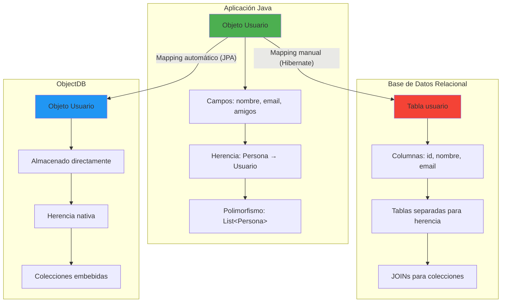
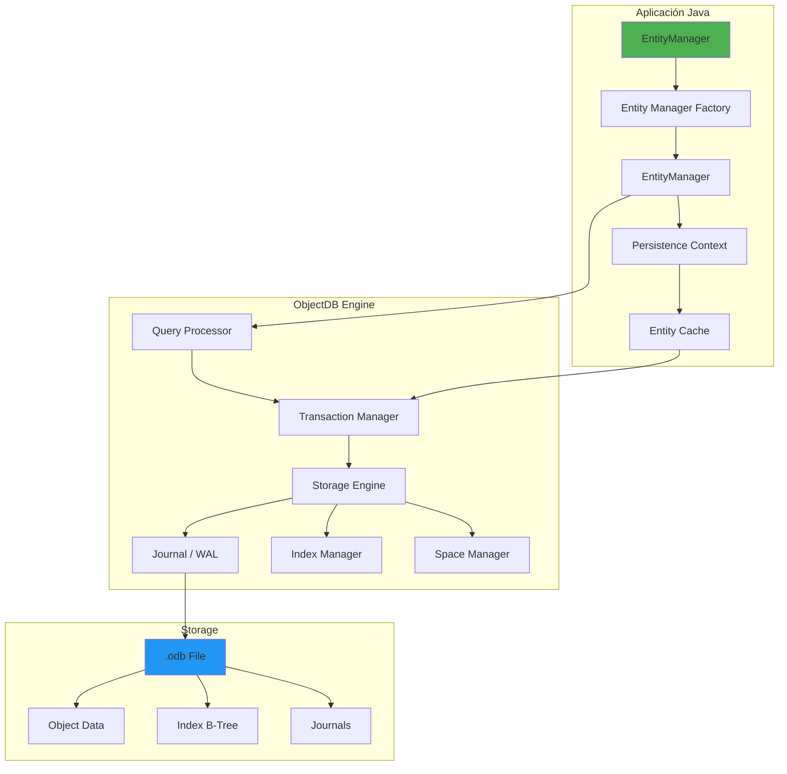
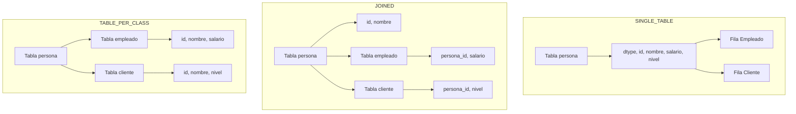

# Clase 15 — ObjectDB I: Fundamentos, JPA y Modelo de Objetos

---

## 1. Marco Teórico

### 1.1 ¿Qué es ObjectDB?

ObjectDB es un **Object Database Management System (ODBMS)** — una base de datos diseñada para almacenar objetos directamente, sin necesidad de conversión a tablas o documentos. Es la implementación más madura de JPA (Java Persistence API) para bases de datos orientadas a objetos.

```
Base de datos relacional:              ObjectDB:
┌─────────┬──────┬───────┐            ┌─────────────────────────┐
│ id      │ name │ email │            │ Usuario@1a2b3c          │
├─────────┼──────┼───────┤            │ ├── id: 1               │
│ 1       │ Juan │ j@e.c │            │ ├── nombre: "Juan"      │
│ 2       │ María│ m@e.c │            │ ├── email: "j@e.c"     │
│ 3       │ Pedro│ p@e.c │            │ ├── amigos: [           │
└─────────┴──────┴───────┘            │   Usuario@4d5e6f,      │
                                       │   Usuario@7g8h9i       │
Conversión:                            │ ]                      │
tabla → objeto (mapping)               │ └── pedidos: [         │
objeto → tabla (serialización)         │   Pedido@j1k2l3        │
                                       │ ]                      │
                                       └─────────────────────────┘
                                       Directo: objeto → disco
```

### 1.2 Historia: de db4o a ObjectDB

```
1997 — db4o: primera ODBMS open source
  ↓
2003 — db4o adquirido por Versant
  ↓
2006 — ObjectDB: fork de db4o con mejoras
  ↓
2009 — JPA 2.0: ObjectDB implementa JPA
  ↓
2013 — ObjectDB 2.5: soporte completo JPA 2.1
  ↓
2019 — ObjectDB 2.7: JPA 2.2, mejor rendimiento
  ↓
2024 — ObjectDB 2.8: Java 17+, Jakarta Persistence
```

### 1.3 El Problema de la Impedancia Objetos-Relacional



**La impedancia implica problemas como:**

| Problema Relacional | Solución ObjectDB |
|---------------------|-------------------|
| Mapear clases a tablas | No se necesita (objeto → disco directo) |
| Herencia: 3 estrategias complejas | Herencia nativa |
| Colecciones: tablas intermedia | Colecciones embebidas |
| Polimorfismo: CAST, UNION | Soporte nativo |
| NULL en columnas | Nulos en campos |
| VARCHAR, INT, DATE | String, int, Date nativos |
| JOINs para relaciones | Referencias directas a objetos |

### 1.4 Comparación: BD Relacional vs Documento vs Objetos

```
Relacional (PostgreSQL):          Documento (MongoDB):           Objetos (ObjectDB):
┌──────────────────┐             ┌──────────────────┐           ┌──────────────────┐
│ Tabla             │             │ Collection        │           │ Class             │
│ ├── Fila 1       │             │ ├── Documento 1   │           │ ├── Objeto 1      │
│ │   ├── Col A    │             │ │   ├── campo:val │           │ │   ├── atributo  │
│ │   ├── Col B    │             │ │   ├── campo:val │           │ │   ├── metodo()  │
│ │   └── Col C    │             │ │   └──嵌套:{...} │           │ │   └── referencia │
│ └── Fila 2       │             │ └── Documento 2   │           │ └── Objeto 2      │
└──────────────────┘             └──────────────────┘           └──────────────────┘
SQL                                  MQL                            JPQL
JOINs                               $lookup                        Referencias
Tablas por herencia                  Embebido                       Nativo
```

### 1.5 Cuándo Usar ObjectDB vs MongoDB vs PostgreSQL

| Criterio | ObjectDB | MongoDB | PostgreSQL |
|----------|----------|---------|------------|
| **Modelo de datos** | Objetos Java | Documentos JSON | Tablas |
| **Lenguaje de query** | JPQL | MQL (MongoDB Query) | SQL |
| **Herencia** | Nativa | Embebido (complejo) | Tablas separadas / CTID |
| **Relaciones** | Nativas (@OneToMany) | $lookup / referencia | JOINs |
| **Performance** | Muy alta (embedded) | Alta | Media-Alta |
| **Escalabilidad** | Vertical (single node) | Horizontal (sharding) | Vertical + Read replicas |
| **Uso ideal** | Java apps, gaming, CAD | Web/mobile, IoT | General purpose |
| **Transacciones** | Completas ACID | Multi-doc (4.0+) | Completas |
| **Ecosistema** | Pequeño pero maduro | Muy grande | Muy grande |
| **Costo** | Commercial (free ≤ 1GB) | Open source | Open source |
| **Comunidad** | Pequeña | Muy grande | Muy grande |

**Cuándo usar ObjectDB:**
- Aplicaciones Java con modelo de objetos complejo
- Apps donde el rendimiento de persistencia es crítico
- Sistemas con herencia profunda de clases
- Prototipos rápidos (sin configurar Hibernate + DB)
- Gaming, CAD, sistemas de simulación

**Cuándo NO usar ObjectDB:**
- Necesidad de escalabilidad horizontal (sharding)
- Multi-lenguaje (Python, Node.js, etc.)
- Queries analíticas complejas
- Equipo sin experiencia en Java/JPA

### 1.6 JPA (Java Persistence API)

JPA es el **estándar** de Java para persistencia de objetos. No es una implementación, sino una interfaz.

```
┌─────────────────────────────────────────────────┐
│              Aplicación Java                     │
├─────────────────────────────────────────────────┤
│              JPA API (javax.persistence)         │
│              EntityManager, Query, etc.          │
├─────────────────────────────────────────────────┤
│              Implementaciones JPA                │
├──────────┬──────────┬──────────┬────────────────┤
│ Hibernate│ Eclipse  │ OpenJPA  │ ObjectDB       │
│ (default)│ Link     │          │ (nativa)       │
├──────────┼──────────┼──────────┼────────────────┤
│ MySQL    │ Oracle   │ DB2      │ .odb files     │
│ PostgreSQL│ Derby   │ Derby    │ ObjectDB Server│
│ H2       │ H2       │          │                │
└──────────┴──────────┴──────────┴────────────────┘
```

**Ventajas de ObjectDB sobre Hibernate + MySQL:**

```java
// Con Hibernate + MySQL: configuración compleja
// persistence.xml, hibernate.cfg.xml, dialect, pool de conexiones...

// Con ObjectDB: configuración mínima
// persistence.xml:
// <persistence-unit name="myPU">
//   <provider>com.objectdb.jpa.PersistenceProviderImpl</provider>
//   <jta-data-source>java:comp/env/objectdb/mydb.odb</jta-data-source>
// </persistence-unit>
```

---

## 2. Comparación Detallada con otras BD

### 2.1 Modelo de Datos

**Relacional (PostgreSQL):**
```sql
-- Tabla Persona
CREATE TABLE persona (
    id SERIAL PRIMARY KEY,
    nombre VARCHAR(100) NOT NULL,
    email VARCHAR(150) UNIQUE,
    fecha_nacimiento DATE
);

-- Tabla Direccion (herencia simulada)
CREATE TABLE direccion (
    id SERIAL PRIMARY KEY,
    persona_id INT REFERENCES persona(id),
    calle VARCHAR(100),
    ciudad VARCHAR(50),
    codigo_postal VARCHAR(10)
);

-- Tabla Hobby (relación many-to-many)
CREATE TABLE hobby (
    id SERIAL PRIMARY KEY,
    nombre VARCHAR(50)
);

CREATE TABLE persona_hobby (
    persona_id INT REFERENCES persona(id),
    hobby_id INT REFERENCES hobby(id),
    PRIMARY KEY (persona_id, hobby_id)
);

-- Query
SELECT p.nombre, d.calle, h.nombre
FROM persona p
LEFT JOIN direccion d ON p.id = d.persona_id
LEFT JOIN persona_hobby ph ON p.id = ph.persona_id
LEFT JOIN hobby h ON ph.hobby_id = h.id
WHERE p.ciudad = 'Lima';
```

**MongoDB:**
```javascript
// Documento embebido
db.personas.insertOne({
    nombre: "Juan",
    email: "juan@test.com",
    fechaNacimiento: ISODate("1990-05-15"),
    direcciones: [{
        calle: "Av. Principal 123",
        ciudad: "Lima",
        codigoPostal: "15001"
    }],
    hobbies: ["Lectura", "Running", "Cocina"]
});

// Query
db.personas.find({
    "direcciones.ciudad": "Lima"
}).pretty();
```

**ObjectDB (JPA):**
```java
// Clase Java con anotaciones JPA
@Entity
public class Persona {
    @Id @GeneratedValue
    private Long id;
    
    private String nombre;
    
    @Column(unique = true)
    private String email;
    
    @Temporal(TemporalType.DATE)
    private Date fechaNacimiento;
    
    @OneToMany(cascade = CascadeType.ALL)
    private List<Direccion> direcciones;
    
    @ElementCollection
    private Set<String> hobbies;
}

// Query JPQL
SELECT p FROM Persona p
LEFT JOIN FETCH p.direcciones d
WHERE d.ciudad = 'Lima'
```

### 2.2 Herencia

**Relacional — 3 estrategias:**

```sql
-- Estrategia SINGLE_TABLE (una tabla para toda la jerarquía)
CREATE TABLE persona (
    id SERIAL PRIMARY KEY,
    dtype VARCHAR(20),  -- discriminador: 'EMPLEADO', 'CLIENTE'
    nombre VARCHAR(100),
    email VARCHAR(150),
    -- Campos de Empleado
    salario DECIMAL(10,2),
    fecha_contratacion DATE,
    -- Campos de Cliente
    nivel VARCHAR(20),
    puntos INT
);
-- Problema: muchas columnas NULL, viola normalización

-- Estrategia JOINED (tablas separadas con JOINs)
CREATE TABLE persona (id SERIAL PRIMARY KEY, nombre VARCHAR(100), email VARCHAR(150));
CREATE TABLE empleado (persona_id INT REFERENCES persona(id), salario DECIMAL(10,2));
CREATE TABLE cliente (persona_id INT REFERENCES persona(id), nivel VARCHAR(20));
-- Problema: requiere JOINs, más lento

-- Estrategia TABLE_PER_CLASS
CREATE TABLE persona (id SERIAL PRIMARY KEY, nombre VARCHAR(100), email VARCHAR(150));
CREATE TABLE empleado (id SERIAL PRIMARY KEY, nombre VARCHAR(100), email VARCHAR(150), salario DECIMAL(10,2));
CREATE TABLE cliente (id SERIAL PRIMARY KEY, nombre VARCHAR(100), email VARCHAR(150), nivel VARCHAR(20));
-- Problema: duplicación de columnas, queries polimórficas complejas
```

**MongoDB:**
```javascript
// Sin herencia — se usa campo discriminador
db.personas.insertOne({
    dtype: "Empleado",
    nombre: "Juan",
    salario: 50000
});

db.personas.insertOne({
    dtype: "Cliente",
    nombre: "María",
    nivel: "Premium"
});

// Query polimórfica
db.personas.find({ dtype: { $in: ["Empleado", "Cliente"] } });
```

**ObjectDB — Herencia nativa:**

```java
@Entity
@Inheritance(strategy = InheritanceType.SINGLE_TABLE)
@DiscriminatorColumn(name = "dtype")
public abstract class Persona {
    @Id @GeneratedValue
    private Long id;
    private String nombre;
}

@Entity
@DiscriminatorValue("EMPLEADO")
public class Empleado extends Persona {
    private Double salario;
    private Date fechaContratacion;
}

@Entity
@DiscriminatorValue("CLIENTE")
public class Cliente extends Persona {
    private String nivel;
    private Integer puntos;
}

// Query polimórfica — ¡con herencia real!
SELECT p FROM Persona p WHERE p.nombre LIKE 'J%'
// Retorna tanto Empleados como Clientes
// ¡No necesita campo discriminador manual!
```

### 2.3 Performance Comparativa

```
Operación: Insertar 10,000 objetos con relaciones

PostgreSQL (JDBC):
├── Conexión: 50ms
├── INSERT persona: 10ms × 10,000 = 100s
├── INSERT direccion: 10ms × 10,000 = 100s
├── INSERT persona_hobby: 15ms × 30,000 = 450s
└── Total: ~650s (10.8 minutos)

MongoDB (MongoDB Driver):
├── Conexión: 30ms
├── insertMany personas: 2s
├── insertMany direcciones: 2s
└── Total: ~4s

ObjectDB (JPA Embedded):
├── Conexión: 10ms
├── persist() personas: 1.5s
├── Commit: 0.5s
└── Total: ~2s

ObjectDB (JPA Client-Server):
├── Conexión TCP: 5ms
├── persist() personas: 3s
├── Commit: 1s
└── Total: ~4s
```

---

## 3. Instalación

### 3.1 Requisitos

```
✅ Java 17+ (JDK — no solo JRE)
✅ Maven 3.8+ o Gradle 7+
✅ IDE: IntelliJ IDEA (recomendado) o Eclipse
✅ Sistema operativo: Windows, Linux, macOS
✅ RAM mínima: 4GB (8GB recomendado)
✅ Disco: 500MB para ObjectDB + espacio para .odb files
```

### 3.2 ObjectDB Embedded (modo embebido)

```xml
<!-- pom.xml — Dependency Maven -->
<project>
    <modelVersion>4.0.0</modelVersion>
    <groupId>com.empresa</groupId>
    <artifactId>objectdb-demo</artifactId>
    <version>1.0</version>
    
    <properties>
        <maven.compiler.source>17</maven.compiler.source>
        <maven.compiler.target>17</maven.compiler.target>
    </properties>
    
    <dependencies>
        <!-- ObjectDB -->
        <dependency>
            <groupId>com.objectdb</groupId>
            <artifactId>objectdb</artifactId>
            <version>2.8.4</version>
        </dependency>
        
        <!-- Jakarta Persistence API (JPA 3.1) -->
        <dependency>
            <groupId>jakarta.persistence</groupId>
            <artifactId>jakarta.persistence-api</artifactId>
            <version>3.1.0</version>
        </dependency>
        
        <!-- Lombok (opcional, para reducir boilerplate) -->
        <dependency>
            <groupId>org.projectlombok</groupId>
            <artifactId>lombok</artifactId>
            <version>1.18.30</version>
            <scope>provided</scope>
        </dependency>
    </dependencies>
    
    <build>
        <plugins>
            <plugin>
                <groupId>org.apache.maven.plugins</groupId>
                <artifactId>maven-compiler-plugin</artifactId>
                <version>3.11.0</version>
                <configuration>
                    <source>17</source>
                    <target>17</target>
                </configuration>
            </plugin>
        </plugins>
    </build>
</project>
```

```xml
<!-- src/main/resources/META-INF/persistence.xml -->
<?xml version="1.0" encoding="UTF-8"?>
<persistence xmlns="https://jakarta.ee/xml/ns/persistence"
             xmlns:xsi="http://www.w3.org/2001/XMLSchema-instance"
             xsi:schemaLocation="https://jakarta.ee/xml/ns/persistence
             https://jakarta.ee/xml/ns/persistence/persistence_3_1.xsd"
             version="3.1">
    
    <persistence-unit name="ObjectDBDemo" transaction-type="RESOURCE_LOCAL">
        <provider>com.objectdb.jpa.PersistenceProviderImpl</provider>
        
        <!-- Clases entity (alternativa a @Entity en cada clase) -->
        <class>com.empresa.model.Usuario</class>
        <class>com.empresa.model.Producto</class>
        <class>com.empresa.model.Pedido</class>
        
        <properties>
            <!-- Archivo de base de datos embebido -->
            <property name="jakarta.persistence.jdbc.url"
                      value="jdbc:objectdb:demo.odb"/>
            
            <!-- Usuario y contraseña (opcional en embebido) -->
            <property name="jakarta.persistence.jdbc.user" value="admin"/>
            <property name="jakarta.persistence.jdbc.password" value="admin"/>
            
            <!-- Schema generation -->
            <property name="jakarta.persistence.schema-generation.database.action"
                      value="create"/>
            
            <!-- Logging -->
            <property name="eclipselink.logging.level" value="FINE"/>
        </properties>
    </persistence-unit>
</persistence>
```

### 3.3 ObjectDB Client-Server

```xml
<!-- persistence.xml para Client-Server -->
<persistence-unit name="ObjectDBServer" transaction-type="JTA">
    <provider>com.objectdb.jpa.PersistenceProviderImpl</provider>
    <jta-data-source>java:comp/env/objectdb/mydb</jta-data-source>
    
    <properties>
        <!-- Conexión al servidor ObjectDB -->
        <property name="jakarta.persistence.jdbc.url"
                  value="jdbc:objectdb://localhost:6136/mydb.odb"/>
        <property name="jakarta.persistence.jdbc.user" value="admin"/>
        <property name="jakarta.persistence.jdbc.password" value="admin"/>
    </properties>
</persistence-unit>
```

```bash
# Descargar ObjectDB desde objectdb.com
# Windows:
# 1. Descargar objectdb-2.8.4.zip
# 2. Extraer en C:\objectdb
# 3. Agregar C:\objectdb\bin al PATH

# Linux:
# 1. Descargar objectdb-2.8.4.tar.gz
# 2. tar -xzf objectdb-2.8.4.tar.gz -C /opt/
# 3. ln -s /opt/objectdb/bin/objectdb /usr/local/bin/

# Iniciar servidor ObjectDB
objectdb server -port 6136

# Detener servidor
objectdb server -stop

# Verificar
# Abrir ObjectDB Explorer: java -jar /opt/objectdb/bin/ explorer.jar
```

### 3.4 Configurar JAVA_HOME

```bash
# Windows (PowerShell)
[System.Environment]::SetEnvironmentVariable("JAVA_HOME", "C:\Program Files\Java\jdk-17", "Machine")
[System.Environment]::SetEnvironmentVariable("PATH", $env:PATH + ";C:\Program Files\Java\jdk-17\bin", "Machine")

# Linux (bash)
export JAVA_HOME=/usr/lib/jvm/java-17-openjdk
export PATH=$PATH:$JAVA_HOME/bin
echo 'export JAVA_HOME=/usr/lib/jvm/java-17-openjdk' >> ~/.bashrc
echo 'export PATH=$PATH:$JAVA_HOME/bin' >> ~/.bashrc
source ~/.bashrc

# Verificar
java -version
javac -version
echo $JAVA_HOME
```

### 3.5 Verificar Instalación

```bash
# Verificar Java
java -version
# java version "17.0.9" 2023-10-17 LTS

# Verificar Maven
mvn -version
# Apache Maven 3.9.5

# Verificar ObjectDB
java -jar /opt/objectdb/bin/objectdb.jar
# ObjectDB Database Engine 2.8.4

# Compilar proyecto
mvn clean compile

# Ejecutar test
mvn test
```

---

## 4. Arquitectura de ObjectDB



### 4.1 Embedded Mode

```
┌─────────────────────────────────┐
│         Tu Aplicación            │
│  ┌────────────┐  ┌───────────┐  │
│  │   JPA      │  │  Lógica   │  │
│  │   Entity   │  │  Negocio  │  │
│  │   Manager  │  │           │  │
│  └─────┬──────┘  └───────────┘  │
│        │                         │
│  ┌─────▼──────────────────────┐  │
│  │     ObjectDB Engine        │  │
│  │  (embebido en la app)      │  │
│  └─────────┬──────────────────┘  │
│            │                     │
│  ┌─────────▼──────────────────┐  │
│  │     demo.odb               │  │
│  │     (archivo en disco)     │  │
│  └────────────────────────────┘  │
└─────────────────────────────────┘

Ventajas:
✅ Sin configuración de servidor
✅ Sin overhead de red
✅ Performance máxima
✅ Ideal para apps standalone, móviles, desktop

Desventajas:
❌ Solo una aplicación accede
❌ Sin backup concurrente
❌ Sin escalabilidad horizontal
```

### 4.2 Client-Server Mode

```
┌──────────────┐  ┌──────────────┐  ┌──────────────┐
│   App 1      │  │   App 2      │  │   App 3      │
│  (Java)      │  │  (Java)      │  │  (Java)      │
└──────┬───────┘  └──────┬───────┘  └──────┬───────┘
       │                  │                  │
       │     TCP/IP (6136)│                  │
       └──────────┬───────┴──────────────────┘
                  │
         ┌────────▼────────┐
         │  ObjectDB Server │
         │  ┌─────────────┐ │
         │  │ Connection  │ │
         │  │ Pool        │ │
         │  └─────────────┘ │
         │  ┌─────────────┐ │
         │  │ Transaction │ │
         │  │ Manager     │ │
         │  └─────────────┘ │
         │  ┌─────────────┐ │
         │  │ Storage     │ │
         │  │ Engine      │ │
         │  └─────────────┘ │
         └────────┬─────────┘
                  │
         ┌────────▼────────┐
         │   mydb.odb       │
         │   (archivo)      │
         └─────────────────┘

Ventajas:
✅ Múltiples clientes simultáneos
✅ Backup sin downtime
✅ Control centralizado de acceso
✅ Mejor para producción

Desventajas:
❌ Overhead de red
❌ Punto único de fallo (sin clustering)
❌ Más configuración
```

### 4.3 Enhanced Persistence Engine

```
┌──────────────────────────────────────────────────┐
│              Storage Engine de ObjectDB            │
├──────────────────────────────────────────────────┤
│                                                    │
│  ┌─────────────┐    ┌─────────────┐              │
│  │  Object     │    │   Index     │              │
│  │  Storage    │    │   Manager   │              │
│  │             │    │             │              │
│  │ - Heap      │    │ - B+Tree    │              │
│  │ - Freelist  │    │ - Hash      │              │
│  │ - Pages     │    │ - Full-text │              │
│  └──────┬──────┘    └──────┬──────┘              │
│         │                   │                     │
│  ┌──────▼───────────────────▼──────┐              │
│  │       Journal / WAL             │              │
│  │  (Write-Ahead Logging)          │              │
│  │                                 │              │
│  │  Garantiza ACID:                │              │
│  │  - Atomicity: journal rollback  │              │
│  │  - Consistency: checksums       │              │
│  │  - Isolation: MVCC              │              │
│  │  - Durability: fsync            │              │
│  └─────────────────────────────────┘              │
│                                                    │
└──────────────────────────────────────────────────┘
```

---

## 5. Modelo de Datos JPA (COMPLETO)

### 5.1 Entity Classes — Anotaciones Básicas

```java
package com.empresa.model;

import jakarta.persistence.*;
import java.util.Date;
import java.util.List;
import java.util.Set;

// =============================================
// @Entity — Marca la clase como entidad JPA
// =============================================
@Entity
@Table(name = "productos", uniqueConstraints = {
    @UniqueConstraint(columnNames = {"codigo"})
})
public class Producto {
    
    // @Id — Clave primaria
    // @GeneratedValue — Generación automática
    // IDENTITY: auto-increment (MySQL, SQL Server)
    // SEQUENCE: secuencia (PostgreSQL, Oracle)
    // TABLE: tabla generadora (portable)
    // AUTO: el proveedor decide
    @Id
    @GeneratedValue(strategy = GenerationType.IDENTITY)
    private Long id;
    
    // @Column — Mapeo a columna
    @Column(nullable = false, length = 100)
    private String nombre;
    
    @Column(unique = true, nullable = false)
    private String codigo;
    
    @Column(precision = 10, scale = 2)
    private Double precio;
    
    // @Temporal — Para fechas
    // DATE: solo fecha (java.sql.Date)
    // TIME: solo hora (java.sql.Time)
    // TIMESTAMP: fecha + hora (java.util.Date)
    @Temporal(TemporalType.TIMESTAMP)
    @Column(name = "fecha_creacion")
    private Date fechaCreacion;
    
    @Temporal(TemporalType.DATE)
    @Column(name = "fecha_lanzamiento")
    private Date fechaLanzamiento;
    
    // @Enumerated — Para enums
    // STRING: guarda el nombre del enum (recomendado)
    // INTEGER: guarda el ordinal (0, 1, 2...)
    @Enumerated(EnumType.STRING)
    @Column(nullable = false)
    private EstadoProducto estado;
    
    // @Lob — Large Object (texto largo o bytes)
    @Lob
    @Column(columnDefinition = "TEXT")
    private String descripcion;
    
    @Lob
    private byte[] imagen;
    
    // @Transient — NO se persiste
    @Transient
    private String temporalCalculo;
    
    // Constructor vacío (requerido por JPA)
    public Producto() {}
    
    // Constructor con campos
    public Producto(String nombre, String codigo, Double precio) {
        this.nombre = nombre;
        this.codigo = codigo;
        this.precio = precio;
        this.fechaCreacion = new Date();
        this.estado = EstadoProducto.ACTIVO;
    }
    
    // Getters y Setters
    public Long getId() { return id; }
    public void setId(Long id) { this.id = id; }
    
    public String getNombre() { return nombre; }
    public void setNombre(String nombre) { this.nombre = nombre; }
    
    public String getCodigo() { return codigo; }
    public void setCodigo(String codigo) { this.codigo = codigo; }
    
    public Double getPrecio() { return precio; }
    public void setPrecio(Double precio) { this.precio = precio; }
    
    public Date getFechaCreacion() { return fechaCreacion; }
    public void setFechaCreacion(Date fechaCreacion) { this.fechaCreacion = fechaCreacion; }
    
    public EstadoProducto getEstado() { return estado; }
    public void setEstado(EstadoProducto estado) { this.estado = estado; }
    
    public String getDescripcion() { return descripcion; }
    public void setDescripcion(String descripcion) { this.descripcion = descripcion; }
    
    // toString
    @Override
    public String toString() {
        return "Producto{id=" + id + ", nombre='" + nombre + "', precio=" + precio + "}";
    }
}

// Enum para estado
enum EstadoProducto {
    ACTIVO, INACTIVO, DESCONTADO, AGOTADO
}
```

### 5.2 Tipos de Datos JPA

```java
// =============================================
// Tipos de datos soportados por JPA/ObjectDB
// =============================================

@Entity
public class TiposDatos {
    
    // Primitivos (se guardan como wrapper)
    private int entero;           // → Integer en BD
    private long largo;           // → Long en BD
    private double decimal;       // → Double en BD
    private boolean booleano;     // → Boolean en BD
    private float flotante;       // → Float en BD
    private short corto;          // → Short en BD
    private byte byteVal;         // → Byte en BD
    private char caracter;        // → Character en BD
    
    // Wrapper classes (recomendado)
    private Integer enteroWrapper;
    private Long largoWrapper;
    private Double decimalWrapper;
    private Boolean booleanoWrapper;
    
    // Strings
    private String texto;         // → VARCHAR(255)
    
    @Column(length = 500)
    private String textoLargo;    // → VARCHAR(500)
    
    // Numeros precisos
    private java.math.BigDecimal bigDecimal;  // → DECIMAL
    private java.math.BigInteger bigInteger;  // → BIGINT
    
    // Fechas (java.util)
    private java.util.Date fecha;             // → TIMESTAMP
    private java.util.Calendar calendario;    // → TIMESTAMP
    
    // Fechas (java.time — JPA 2.2+)
    private java.time.LocalDate fechaLocal;   // → DATE
    private java.time.LocalTime horaLocal;    // → TIME
    private java.time.LocalDateTime fechaHoraLocal; // → TIMESTAMP
    
    // Bytes
    private byte[] arregloBytes;              // → BLOB
    private Byte[] arregloBytesWrapper;       // → BLOB
    
    // Serializable (objeto completo)
    @Lob
    private java.io.Serializable objetoSerializable; // → BLOB
}
```

### 5.3 Relaciones

#### 5.3.1 @OneToOne — Relación uno a uno

```java
// =============================================
// @OneToOne — Un usuario tiene un perfil
// =============================================

@Entity
public class Usuario {
    @Id @GeneratedValue
    private Long id;
    
    private String nombre;
    
    // Bidireccional: mappedBy indica el lado inverso
    @OneToOne(cascade = CascadeType.ALL, fetch = FetchType.LAZY)
    @JoinColumn(name = "perfil_id", referencedColumnName = "id")
    private Perfil perfil;
    
    // Constructores, getters, setters...
}

@Entity
public class Perfil {
    @Id @GeneratedValue
    private Long id;
    
    private String bio;
    private String fotoUrl;
    
    // Lado dueño de la relación (tiene la FK)
    @OneToOne(mappedBy = "perfil")
    private Usuario usuario;
    
    // Constructores, getters, setters...
}

// Uso:
Usuario u = new Usuario("Juan");
Perfil p = new Perfil("Desarrollador Java", "foto.jpg");
u.setPerfil(p);

em.persist(u);  // Cascade persist a Perfil
```

#### 5.3.2 @OneToMany / @ManyToOne — Relación uno a muchos

```java
// =============================================
// @OneToMany / @ManyToOne — Un usuario tiene muchos pedidos
// =============================================

@Entity
public class Usuario {
    @Id @GeneratedValue
    private Long id;
    
    private String nombre;
    
    // Un usuario tiene muchos pedidos
    @OneToMany(mappedBy = "usuario", 
               cascade = CascadeType.ALL,
               orphanRemoval = true,
               fetch = FetchType.LAZY)
    @OrderBy("fecha DESC")
    private List<Pedido> pedidos = new ArrayList<>();
    
    // Método helper para mantener consistencia
    public void addPedido(Pedido pedido) {
        pedidos.add(pedido);
        pedido.setUsuario(this);
    }
    
    public void removePedido(Pedido pedido) {
        pedidos.remove(pedido);
        pedido.setUsuario(null);
    }
    
    // Constructores, getters, setters...
}

@Entity
public class Pedido {
    @Id @GeneratedValue
    private Long id;
    
    @Temporal(TemporalType.TIMESTAMP)
    private Date fecha;
    
    private Double total;
    
    @Enumerated(EnumType.STRING)
    private EstadoPedido estado;
    
    // Muchos pedidos pertenecen a un usuario (lado dueño)
    @ManyToOne(fetch = FetchType.LAZY)
    @JoinColumn(name = "usuario_id", nullable = false)
    private Usuario usuario;
    
    // Constructores, getters, setters...
}

enum EstadoPedido {
    PENDIENTE, PROCESADO, ENVIADO, ENTREGADO, CANCELADO
}
```

```java
// Uso: agregar pedido a usuario
Usuario u = em.find(Usuario.class, 1L);
Pedido p = new Pedido();
p.setFecha(new Date());
p.setTotal(150.00);
p.setEstado(EstadoPedido.PENDIENTE);

u.addPedido(p);  // Mantiene consistencia en ambos lados
em.persist(u);    // Cascade guarda el pedido
```

#### 5.3.3 @ManyToMany — Relación muchos a muchos

```java
// =============================================
// @ManyToMany — Un producto tiene muchas categorías
//               una categoría tiene muchos productos
// =============================================

@Entity
public class Producto {
    @Id @GeneratedValue
    private Long id;
    
    private String nombre;
    
    @ManyToMany
    @JoinTable(
        name = "producto_categoria",           // Tabla intermedia
        joinColumns = @JoinColumn(name = "producto_id"),      // FK a Producto
        inverseJoinColumns = @JoinColumn(name = "categoria_id") // FK a Categoría
    )
    private Set<Categoria> categorias = new HashSet<>();
    
    // Constructores, getters, setters...
}

@Entity
public class Categoria {
    @Id @GeneratedValue
    private Long id;
    
    private String nombre;
    
    @ManyToMany(mappedBy = "categorias")
    private Set<Producto> productos = new HashSet<>();
    
    // Constructores, getters, setters...
}

// Uso:
Producto p = new Producto("Laptop");
Categoria tech = new Categoria("Tecnología");
Categoria computo = new Categoria("Computación");

p.getCategorias().add(tech);
p.getCategorias().add(computo);

em.persist(p);
```

### 5.4 Cascade Types

```java
// =============================================
// Tipos de cascade
// =============================================

@Entity
public class Usuario {
    @Id @GeneratedValue
    private Long id;
    
    private String nombre;
    
    // ALL: cascada total
    @OneToMany(cascade = CascadeType.ALL, mappedBy = "usuario")
    private List<Pedido> pedidos;
    
    // PERSIST: cascada solo al persistir
    @OneToMany(cascade = CascadeType.PERSIST, mappedBy = "usuario")
    private List<Comentario> comentarios;
    
    // MERGE: cascada solo al hacer merge
    @OneToMany(cascade = CascadeType.MERGE, mappedBy = "usuario")
    private List<Direccion> direcciones;
    
    // REMOVE: cascada solo al eliminar
    @OneToMany(cascade = CascadeType.REMOVE, mappedBy = "usuario")
    private List<Sesion> sesiones;
    
    // REFRESH: cascada solo al refrescar
    @OneToMany(cascade = CascadeType.REFRESH, mappedBy = "usuario")
    private List<Log> logs;
    
    // DETACH: cascada solo al desacoplar
    @OneToMany(cascade = CascadeType.DETACH, mappedBy = "usuario")
    private List<Notificacion> notificaciones;
}

// orphanRemoval: eliminar huérfanos
@Entity
public class Carrito {
    @OneToMany(cascade = CascadeType.ALL, orphanRemoval = true)
    private List<ItemCarrito> items;
    
    public void removerItem(ItemCarrito item) {
        items.remove(item);  // El item se ELIMINA de la BD
    }
}
```

### 5.5 Fetch Types

```java
// =============================================
// Tipos de fetch
// =============================================

@Entity
public class Usuario {
    @Id @GeneratedValue
    private Long id;
    
    private String nombre;
    
    // LAZY: carga bajo demanda (RECOMENDADO para colecciones)
    // No carga los pedidos hasta que se acceda a ellos
    @OneToMany(fetch = FetchType.LAZY, mappedBy = "usuario")
    private List<Pedido> pedidos;
    
    // EAGER: carga inmediata (RECOMENDADO para @OneToOne/@ManyToOne)
    // Carga el perfil junto con el usuario
    @OneToOne(fetch = FetchType.EAGER)
    private Perfil perfil;
    
    // LAZY loading en acción:
    Usuario u = em.find(Usuario.class, 1L);
    // Solo carga: Usuario
    
    List<Pedido> pedidos = u.getPedidos();  
    // AHORA carga los pedidos (lazy loading)
    
    // EAGER loading en acción:
    // Cuando cargas un Pedido, también carga el Usuario
}

// Java 8+ optimización:
@Entity
public class Usuario {
    @OneToMany(fetch = FetchType.LAZY, mappedBy = "usuario")
    private List<Pedido> pedidos;
    
    // API de Java 8 con JPA 2.1
    // Lazy loading con stream
    public long contarPedidosActivos() {
        return pedidos.stream()
            .filter(p -> p.getEstado() != EstadoPedido.CANCELADO)
            .count();
    }
}
```

### 5.6 Herencia en JPA

```java
// =============================================
// Estrategia SINGLE_TABLE
// =============================================
@Entity
@Inheritance(strategy = InheritanceType.SINGLE_TABLE)
@DiscriminatorColumn(name = "dtype")
public abstract class Persona {
    @Id @GeneratedValue
    private Long id;
    
    private String nombre;
    
    @Temporal(TemporalType.DATE)
    private Date fechaNacimiento;
}

@Entity
@DiscriminatorValue("EMPLEADO")
public class Empleado extends Persona {
    private Double salario;
    
    @Temporal(TemporalType.DATE)
    private Date fechaContratacion;
}

@Entity
@DiscriminatorValue("CLIENTE")
public class Cliente extends Persona {
    private String nivel;
    private Integer puntosAcumulados;
}

@Entity
@DiscriminatorValue("PROVEEDOR")
public class Proveedor extends Persona {
    private String empresa;
    private String ruc;
}

// =============================================
// Estrategia JOINED
// =============================================
@Entity
@Inheritance(strategy = InheritanceType.JOINED)
public abstract class Animal {
    @Id @GeneratedValue
    private Long id;
    private String nombre;
    private Integer edad;
}

@Entity
@JoinColumn(name = "animal_id")
public class Perro extends Animal {
    private String raza;
    private Boolean vacunado;
}

@Entity
@JoinColumn(name = "animal_id")
public class Gato extends Animal {
    private Boolean peludo;
    private Integer vidasRestantes;
}

// =============================================
// Estrategia TABLE_PER_CLASS
// =============================================
@Entity
@Inheritance(strategy = InheritanceType.TABLE_PER_CLASS)
public abstract class Vehiculo {
    @Id @GeneratedValue
    private Long id;
    private String marca;
    private Integer anio;
}

@Entity
public class Auto extends Vehiculo {
    private Integer puertas;
    private String transmision;
}

@Entity
public class Moto extends Vehiculo {
    private Integer cilindrada;
    private Boolean dobleProposito;
}
```



### 5.7 Embeddables

```java
// =============================================
// @Embeddable — Objetos embebidos dentro de otra entidad
// =============================================

@Embeddable  // Clase que se embebe
public class Direccion {
    private String calle;
    private String ciudad;
    private String departamento;
    private String codigoPostal;
    private String pais;
    
    // Constructor vacío requerido
    public Direccion() {}
    
    public Direccion(String calle, String ciudad, String departamento, 
                     String codigoPostal, String pais) {
        this.calle = calle;
        this.ciudad = ciudad;
        this.departamento = departamento;
        this.codigoPostal = codigoPostal;
        this.pais = pais;
    }
    
    // Getters y Setters...
    
    @Override
    public String toString() {
        return calle + ", " + ciudad + ", " + departamento;
    }
}

@Entity
public class Usuario {
    @Id @GeneratedValue
    private Long id;
    
    private String nombre;
    
    @Embedded
    @AttributeOverrides({
        @AttributeOverride(name = "calle", 
                          column = @Column(name = "dir_calle")),
        @AttributeOverride(name = "ciudad", 
                          column = @Column(name = "dir_ciudad")),
        @AttributeOverride(name = "departamento", 
                          column = @Column(name = "dir_departamento"))
    })
    private Direccion direccionFacturacion;
    
    @Embedded
    @AttributeOverrides({
        @AttributeOverride(name = "calle", 
                          column = @Column(name = "env_calle")),
        @AttributeOverride(name = "ciudad", 
                          column = @Column(name = "env_ciudad"))
    })
    private Direccion direccionEnvio;
    
    // Constructores, getters, setters...
}

// Uso:
Direccion facturacion = new Direccion("Av. Principal 123", "Lima", 
                                       "Lima", "15001", "Peru");
Direccion envio = new Direccion("Calle Secundaria 456", "Miraflores",
                                 "Lima", "15003", "Peru");

Usuario u = new Usuario();
u.setNombre("Juan");
u.setDireccionFacturacion(facturacion);
u.setDireccionEnvio(envio);
```

### 5.8 Ejemplo Completo de Entity con Todas las Relaciones

```java
// =============================================
// Modelo completo de e-commerce
// =============================================

@Entity
@Table(name = "usuarios")
public class Usuario {
    @Id @GeneratedValue(strategy = GenerationType.IDENTITY)
    private Long id;
    
    @Column(nullable = false, unique = true)
    private String email;
    
    @Column(nullable = false)
    private String nombre;
    
    @Column(nullable = false)
    private String passwordHash;
    
    @Enumerated(EnumType.STRING)
    private EstadoUsuario estado;
    
    @Temporal(TemporalType.TIMESTAMP)
    @Column(name = "fecha_registro")
    private Date fechaRegistro;
    
    @Embedded
    @AttributeOverrides({
        @AttributeOverride(name = "calle", column = @Column(name = "dir_calle")),
        @AttributeOverride(name = "ciudad", column = @Column(name = "dir_ciudad"))
    })
    private Direccion direccion;
    
    @OneToMany(mappedBy = "usuario", cascade = CascadeType.ALL, 
               orphanRemoval = true, fetch = FetchType.LAZY)
    @OrderBy("fecha DESC")
    private List<Pedido> pedidos = new ArrayList<>();
    
    @ManyToMany
    @JoinTable(
        name = "usuario_producto_favorito",
        joinColumns = @JoinColumn(name = "usuario_id"),
        inverseJoinColumns = @JoinColumn(name = "producto_id")
    )
    private Set<Producto> favoritos = new HashSet<>();
    
    public Usuario() {}
    
    public Usuario(String email, String nombre, String passwordHash) {
        this.email = email;
        this.nombre = nombre;
        this.passwordHash = passwordHash;
        this.estado = EstadoUsuario.ACTIVO;
        this.fechaRegistro = new Date();
    }
    
    public void addPedido(Pedido pedido) {
        pedidos.add(pedido);
        pedido.setUsuario(this);
    }
    
    // Getters y Setters...
}

@Entity
@Table(name = "productos")
public class Producto {
    @Id @GeneratedValue(strategy = GenerationType.IDENTITY)
    private Long id;
    
    @Column(nullable = false, unique = true)
    private String codigo;
    
    @Column(nullable = false, length = 200)
    private String nombre;
    
    @Lob
    private String descripcion;
    
    @Column(nullable = false, precision = 10, scale = 2)
    private Double precio;
    
    @Column(name = "stock_disponible")
    private Integer stock;
    
    @Enumerated(EnumType.STRING)
    private EstadoProducto estado;
    
    @Temporal(TemporalType.TIMESTAMP)
    @Column(name = "fecha_creacion")
    private Date fechaCreacion;
    
    @ManyToOne(fetch = FetchType.LAZY)
    @JoinColumn(name = "categoria_id")
    private Categoria categoria;
    
    @OneToMany(mappedBy = "producto", cascade = CascadeType.ALL)
    private List<DetallePedido> detalles = new ArrayList<>();
    
    public Producto() {}
    
    public Producto(String codigo, String nombre, Double precio, Integer stock) {
        this.codigo = codigo;
        this.nombre = nombre;
        this.precio = precio;
        this.stock = stock;
        this.estado = EstadoProducto.ACTIVO;
        this.fechaCreacion = new Date();
    }
    
    // Getters y Setters...
}

@Entity
@Table(name = "pedidos")
public class Pedido {
    @Id @GeneratedValue(strategy = GenerationType.IDENTITY)
    private Long id;
    
    @Temporal(TemporalType.TIMESTAMP)
    private Date fecha;
    
    @Enumerated(EnumType.STRING)
    private EstadoPedido estado;
    
    @Column(name = "total")
    private Double total;
    
    @ManyToOne(fetch = FetchType.LAZY)
    @JoinColumn(name = "usuario_id", nullable = false)
    private Usuario usuario;
    
    @OneToMany(mappedBy = "pedido", cascade = CascadeType.ALL, 
               orphanRemoval = true)
    private List<DetallePedido> detalles = new ArrayList<>();
    
    public Pedido() {}
    
    public Pedido(Usuario usuario) {
        this.usuario = usuario;
        this.fecha = new Date();
        this.estado = EstadoPedido.PENDIENTE;
        this.total = 0.0;
    }
    
    public void addDetalle(DetallePedido detalle) {
        detalles.add(detalle);
        detalle.setPedido(this);
        recalcularTotal();
    }
    
    private void recalcularTotal() {
        this.total = detalles.stream()
            .mapToDouble(d -> d.getPrecioUnitario() * d.getCantidad())
            .sum();
    }
    
    // Getters y Setters...
}

@Entity
@Table(name = "detalles_pedido")
public class DetallePedido {
    @Id @GeneratedValue(strategy = GenerationType.IDENTITY)
    private Long id;
    
    @Column(name = "cantidad")
    private Integer cantidad;
    
    @Column(name = "precio_unitario")
    private Double precioUnitario;
    
    @ManyToOne(fetch = FetchType.LAZY)
    @JoinColumn(name = "pedido_id", nullable = false)
    private Pedido pedido;
    
    @ManyToOne(fetch = FetchType.LAZY)
    @JoinColumn(name = "producto_id", nullable = false)
    private Producto producto;
    
    public DetallePedido() {}
    
    public DetallePedido(Pedido pedido, Producto producto, Integer cantidad) {
        this.pedido = pedido;
        this.producto = producto;
        this.cantidad = cantidad;
        this.precioUnitario = producto.getPrecio();
    }
    
    // Getters y Setters...
}

@Entity
@Table(name = "categorias")
public class Categoria {
    @Id @GeneratedValue(strategy = GenerationType.IDENTITY)
    private Long id;
    
    @Column(nullable = false, unique = true)
    private String nombre;
    
    @Lob
    private String descripcion;
    
    @OneToMany(mappedBy = "categoria", fetch = FetchType.LAZY)
    private List<Producto> productos = new ArrayList<>();
    
    public Categoria() {}
    
    public Categoria(String nombre) {
        this.nombre = nombre;
    }
    
    // Getters y Setters...
}

// Enums
enum EstadoUsuario { ACTIVO, INACTIVO, SUSPENDIDO }
enum EstadoPedido { PENDIENTE, PROCESADO, ENVIADO, ENTREGADO, CANCELADO }
enum EstadoProducto { ACTIVO, INACTIVO, DESCONTADO, AGOTADO }
```

---

## 6. JPA Query Language (JPQL)

### 6.1 Queries Básicas

```java
// =============================================
// EntityManager — Operaciones CRUD básicas
// =============================================

EntityManagerFactory emf = Persistence.createEntityManagerFactory("ObjectDBDemo");
EntityManager em = emf.createEntityManager();

// CREATE
em.getTransaction().begin();
Producto p = new Producto("P001", "Laptop Dell", 1299.99, 50);
em.persist(p);
em.getTransaction().commit();

// READ
Producto found = em.find(Producto.class, 1L);

// UPDATE
em.getTransaction().begin();
found.setPrecio(1199.99);
em.merge(found);  // O simplemente modificar y el dirty checking lo detecta
em.getTransaction().commit();

// DELETE
em.getTransaction().begin();
em.remove(found);
em.getTransaction().commit();
```

### 6.2 JPQL — Queries

```java
// =============================================
// JPQL — Consultas con EntityManager
// =============================================

// 1. Query básica
TypedQuery<Producto> query = em.createQuery(
    "SELECT p FROM Producto p", Producto.class);
List<Producto> productos = query.getResultList();

// 2. Query con WHERE
TypedQuery<Producto> query2 = em.createQuery(
    "SELECT p FROM Producto p WHERE p.precio > :minPrecio", Producto.class);
query2.setParameter("minPrecio", 100.0);
List<Producto> caros = query2.getResultList();

// 3. Named parameters (:paramName)
TypedQuery<Usuario> query3 = em.createQuery(
    "SELECT u FROM Usuario u WHERE u.email = :email", Usuario.class);
query3.setParameter("email", "juan@test.com");
Usuario usuario = query3.getSingleResult();

// 4. Positional parameters (?1)
TypedQuery<Usuario> query4 = em.createQuery(
    "SELECT u FROM Usuario u WHERE u.nombre = ?1 AND u.estado = ?2", 
    Usuario.class);
query4.setParameter(1, "Juan");
query4.setParameter(2, EstadoUsuario.ACTIVO);

// 5. LIKE
TypedQuery<Producto> query5 = em.createQuery(
    "SELECT p FROM Producto p WHERE p.nombre LIKE :patron", Producto.class);
query5.setParameter("patron", "%Laptop%");

// 6. IN
TypedQuery<Producto> query6 = em.createQuery(
    "SELECT p FROM Producto p WHERE p.estado IN :estados", Producto.class);
query6.setParameter("estados", List.of(
    EstadoProducto.ACTIVO, EstadoProducto.DESCONTADO
));

// 7. BETWEEN
TypedQuery<Producto> query7 = em.createQuery(
    "SELECT p FROM Producto p WHERE p.precio BETWEEN :min AND :max", 
    Producto.class);
query7.setParameter("min", 50.0);
query7.setParameter("max", 500.0);

// 8. IS NULL / IS NOT NULL
TypedQuery<Usuario> query8 = em.createQuery(
    "SELECT u FROM Usuario u WHERE u.direccion IS NOT NULL", Usuario.class);

// 9. ORDER BY
TypedQuery<Producto> query9 = em.createQuery(
    "SELECT p FROM Producto p ORDER BY p.precio ASC, p.nombre DESC", 
    Producto.class);

// 10. DISTINCT
TypedQuery<Usuario> query10 = em.createQuery(
    "SELECT DISTINCT u FROM Usuario u JOIN u.pedidos ped", Usuario.class);
```

### 6.3 Relationship Queries (JOIN FETCH)

```java
// =============================================
// JOIN FETCH — Evitar N+1 queries
// =============================================

// PROBLEMA N+1:
// 1 query para cargar usuarios
// N queries para cargar pedidos de cada usuario
TypedQuery<Usuario> usuariosQuery = em.createQuery(
    "SELECT u FROM Usuario u", Usuario.class);
List<Usuario> usuarios = usuariosQuery.getResultList();

for (Usuario u : usuarios) {
    // Cada acceso a getPedidos() genera una query separada
    List<Pedido> pedidos = u.getPedidos();  // N+1 queries!
}

// SOLUCIÓN: JOIN FETCH
TypedQuery<Usuario> query = em.createQuery(
    "SELECT DISTINCT u FROM Usuario u " +
    "LEFT JOIN FETCH u.pedidos", Usuario.class);
List<Usuario> usuariosConPedidos = query.getResultList();

// Una sola query con JOIN
// DISTINCT evita duplicados por el JOIN

// JOIN FETCH con condición
TypedQuery<Usuario> query2 = em.createQuery(
    "SELECT DISTINCT u FROM Usuario u " +
    "LEFT JOIN FETCH u.pedidos ped " +
    "WHERE ped.estado = :estado", Usuario.class);
query2.setParameter("estado", EstadoPedido.PENDIENTE);
List<Usuario> usuariosConPedidosPendientes = query2.getResultList();

// JOIN FETCH múltiple
TypedQuery<Usuario> query3 = em.createQuery(
    "SELECT DISTINCT u FROM Usuario u " +
    "LEFT JOIN FETCH u.pedidos " +
    "LEFT JOIN FETCH u.favoritos", Usuario.class);
```

### 6.4 Subqueries

```java
// =============================================
// Subqueries en JPQL
// =============================================

// WHERE IN con subquery
TypedQuery<Usuario> query = em.createQuery(
    "SELECT u FROM Usuario u WHERE u.id IN " +
    "(SELECT ped.usuario.id FROM Pedido ped WHERE ped.total > :minTotal)", 
    Usuario.class);
query.setParameter("minTotal", 500.0);
List<Usuario> grandesCompradores = query.getResultList();

// WHERE EXISTS
TypedQuery<Usuario> query2 = em.createQuery(
    "SELECT u FROM Usuario u WHERE EXISTS " +
    "(SELECT ped FROM Pedido ped WHERE ped.usuario = u " +
    "AND ped.estado = :estado)", Usuario.class);
query2.setParameter("estado", EstadoPedido.PENDIENTE);
List<Usuario> usuariosConPedidosPendientes = query2.getResultList();

// Subquery con ALL
TypedQuery<Usuario> query3 = em.createQuery(
    "SELECT u FROM Usuario u WHERE :minPrecio <= ALL " +
    "(SELECT ped.total FROM Pedido ped WHERE ped.usuario = u)", 
    Usuario.class);
query3.setParameter("minPrecio", 100.0);
```

### 6.5 Aggregation

```java
// =============================================
// Funciones de agregación
// =============================================

// COUNT
TypedQuery<Long> countQuery = em.createQuery(
    "SELECT COUNT(p) FROM Producto p WHERE p.estado = :estado", Long.class);
countQuery.setParameter("estado", EstadoProducto.ACTIVO);
Long total = countQuery.getSingleResult();
System.out.println("Productos activos: " + total);

// AVG
TypedQuery<Double> avgQuery = em.createQuery(
    "SELECT AVG(p.precio) FROM Producto p", Double.class);
Double promedio = avgQuery.getSingleResult();

// SUM
TypedQuery<Double> sumQuery = em.createQuery(
    "SELECT SUM(ped.total) FROM Pedido ped WHERE ped.usuario.id = :userId", 
    Double.class);
sumQuery.setParameter("userId", 1L);
Double totalCompras = sumQuery.getSingleResult();

// MIN / MAX
TypedQuery<Double> minQuery = em.createQuery(
    "SELECT MIN(p.precio) FROM Producto p", Double.class);
TypedQuery<Double> maxQuery = em.createQuery(
    "SELECT MAX(p.precio) FROM Producto p", Double.class);

// GROUP BY
TypedQuery<Object[]> groupQuery = em.createQuery(
    "SELECT c.nombre, COUNT(p) FROM Producto p " +
    "JOIN p.categoria c " +
    "GROUP BY c.nombre " +
    "ORDER BY COUNT(p) DESC", Object[].class);
List<Object[]> productosPorCategoria = groupQuery.getResultList();

for (Object[] row : productosPorCategoria) {
    System.out.println(row[0] + ": " + row[1] + " productos");
}

// HAVING
TypedQuery<Object[]> havingQuery = em.createQuery(
    "SELECT c.nombre, COUNT(p) FROM Producto p " +
    "JOIN p.categoria c " +
    "GROUP BY c.nombre " +
    "HAVING COUNT(p) > :minCount", Object[].class);
havingQuery.setParameter("minCount", 5);
```

### 6.6 Pagination

```java
// =============================================
// Paginación con setFirstResult y setMaxResults
// =============================================

int pagina = 1;  // Página actual
int tamanoPagina = 10;  // Elementos por página

TypedQuery<Producto> query = em.createQuery(
    "SELECT p FROM Producto p ORDER BY p.nombre ASC", Producto.class);

// Configurar paginación
query.setFirstResult((pagina - 1) * tamanoPagina);  // Offset
query.setMaxResults(tamanoPagina);  // Limit

List<Producto> productosPagina = query.getResultList();

// Total de registros
Long totalRegistros = em.createQuery(
    "SELECT COUNT(p) FROM Producto p", Long.class)
    .getSingleResult();

int totalPaginas = (int) Math.ceil((double) totalRegistros / tamanoPagina);

System.out.println("Página " + pagina + " de " + totalPaginas);
System.out.println("Mostrando " + productosPagina.size() + " de " + totalRegistros);
```

### 6.7 Native Queries

```java
// =============================================
// Native Queries (SQL directo)
// =============================================

// Native query con resultado entity
Query nativeQuery = em.createNativeQuery(
    "SELECT * FROM productos WHERE precio > ?", Producto.class);
nativeQuery.setParameter(1, 100.0);
List<Producto> resultados = nativeQuery.getResultList();

// Native query con resultado object[]
Query nativeQuery2 = em.createNativeQuery(
    "SELECT u.nombre, COUNT(p.id) as total_pedidos " +
    "FROM usuarios u " +
    "LEFT JOIN pedidos p ON u.id = p.usuario_id " +
    "GROUP BY u.nombre " +
    "ORDER BY total_pedidos DESC");
List<Object[]> resultados2 = nativeQuery2.getResultList();

for (Object[] row : resultados2) {
    System.out.println(row[0] + ": " + row[1] + " pedidos");
}

// Named Native Query
@NamedNativeQuery(
    name = " Producto.findByPriceRange",
    query = "SELECT * FROM productos WHERE precio BETWEEN ?1 AND ?2",
    resultClass = Producto.class
)

// Uso:
Query query = em.createNamedQuery("Producto.findByPriceRange");
query.setParameter(1, 50.0);
query.setParameter(2, 500.0);
List<Producto> productos = query.getResultList();
```

### 6.8 Named Queries

```java
// =============================================
// Named Queries — Queries predefinidas en la entity
// =============================================

@Entity
@NamedQuery(
    name = "Producto.findByNombre",
    query = "SELECT p FROM Producto p WHERE p.nombre LIKE :nombre"
)
@NamedQuery(
    name = "Producto.findActivos",
    query = "SELECT p FROM Producto p WHERE p.estado = 'ACTIVO' ORDER BY p.precio"
)
@NamedQuery(
    name = "Producto.countByCategoria",
    query = "SELECT c.nombre, COUNT(p) FROM Producto p " +
            "JOIN p.categoria c GROUP BY c.nombre"
)
public class Producto {
    // ...
}

// Uso:
TypedQuery<Producto> query = em.createNamedQuery(
    "Producto.findByNombre", Producto.class);
query.setParameter("nombre", "%Laptop%");
List<Producto> laptops = query.getResultList();
```

### 6.9 Criteria API

```java
// =============================================
// Criteria API — Queries programáticas (tipos seguros)
// =============================================

CriteriaBuilder cb = em.getCriteriaBuilder();
CriteriaQuery<Producto> cq = cb.createQuery(Producto.class);
Root<Producto> root = cq.from(Producto.class);

// WHERE con predicate
Predicate precioMayor = cb.greaterThan(root.get("precio"), 100.0);
Predicate estadoActivo = cb.equal(root.get("estado"), EstadoProducto.ACTIVO);

cq.select(root)
  .where(cb.and(precioMayor, estadoActivo))
  .orderBy(cb.desc(root.get("precio")));

TypedQuery<Producto> query = em.createQuery(cq);
List<Producto> productos = query.getResultList();

// Criteria con LIKE
CriteriaBuilder cb2 = em.getCriteriaBuilder();
CriteriaQuery<Usuario> cq2 = cb2.createQuery(Usuario.class);
Root<Usuario> root2 = cq2.from(Usuario.class);

cq2.select(root2)
  .where(cb2.like(root2.get("nombre"), "%Juan%"));

// Criteria con IN
CriteriaBuilder cb3 = em.getCriteriaBuilder();
CriteriaQuery<Producto> cq3 = cb3.createQuery(Producto.class);
Root<Producto> root3 = cq3.from(Producto.class);

cq3.select(root3)
  .where(root3.get("estado").in(
      EstadoProducto.ACTIVO, EstadoProducto.DESCONTADO
  ));

// Criteria con agregación
CriteriaBuilder cb4 = em.getCriteriaBuilder();
CriteriaQuery<Object[]> cq4 = cb4.createQuery(Object[].class);
Root<Producto> root4 = cq4.from(Producto.class);

cq4.multiselect(
    root4.get("estado"),
    cb4.count(root4)
);
cq4.groupBy(root4.get("estado"));
cq4.having(cb4.greaterThan(cb4.count(root4), 5L));

TypedQuery<Object[]> query4 = em.createQuery(cq4);
List<Object[]> estadisticas = query4.getResultList();
```

---

## 7. Spring Data JPA (Introducción)

### 7.1 Repository Pattern

```java
// =============================================
// Spring Data JPA — Repository interface
// =============================================

// Interface base (no necesita implementación)
@Repository
public interface ProductoRepository extends JpaRepository<Producto, Long> {
    
    // Spring Data genera la implementación automáticamente
    
    // Method name query derivation:
    List<Producto> findByNombre(String nombre);
    
    List<Producto> findByNombreContaining(String patron);
    
    List<Producto> findByPrecioBetween(Double min, Double max);
    
    List<Producto> findByEstado(EstadoProducto estado);
    
    List<Producto> findByCategoriaNombre(String categoriaNombre);
    
    // Query con @Query
    @Query("SELECT p FROM Producto p WHERE p.precio > :precio ORDER BY p.precio DESC")
    List<Producto> findExpensiveProducts(@Param("precio") Double precio);
    
    // Native query
    @Query(value = "SELECT * FROM productos WHERE LOWER(nombre) LIKE LOWER(:busqueda)", 
           nativeQuery = true)
    List<Producto> searchByName(@Param("busqueda") String busqueda);
    
    // Modifying query
    @Modifying
    @Query("UPDATE Producto p SET p.estado = :estado WHERE p.id = :id")
    int updateEstado(@Param("id") Long id, @Param("estado") EstadoProducto estado);
    
    // Delete
    @Modifying
    @Query("DELETE FROM Producto p WHERE p.estado = 'AGOTADO'")
    int deleteAgotados();
}

@Repository
public interface UsuarioRepository extends JpaRepository<Usuario, Long> {
    
    Optional<Usuario> findByEmail(String email);
    
    boolean existsByEmail(String email);
    
    @Query("SELECT u FROM Usuario u LEFT JOIN FETCH u.pedidos WHERE u.id = :id")
    Optional<Usuario> findByIdWithPedidos(@Param("id") Long id);
    
    @Query("SELECT u FROM Usuario u WHERE u.fechaRegistro BETWEEN :inicio AND :fin")
    List<Usuario> findByFechaRegistroBetween(
        @Param("inicio") Date inicio, 
        @Param("fin") Date fin
    );
}
```

### 7.2 Method Name Query Derivation

```java
// =============================================
// Spring Data — Convención de nombres
// =============================================

// findBy + Property
List<Producto> findByNombre(String nombre);

// findBy + Property + Containing
List<Producto> findByNombreContaining(String patron);

// findBy + Property + StartingWith
List<Producto> findByNombreStartingWith(String patron);

// findBy + Property + EndingWith
List<Producto> findByNombreEndingWith(String patron);

// findBy + Property + Like
List<Producto> findByNombreLike(String patron);

// findBy + Property + GreaterThan
List<Producto> findByPrecioGreaterThan(Double precio);

// findBy + Property + LessThan
List<Producto> findByPrecioLessThan(Double precio);

// findBy + Property + Between
List<Producto> findByPrecioBetween(Double min, Double max);

// findBy + Property + In
List<Producto> findByEstadoIn(Collection<EstadoProducto> estados);

// findBy + Property + IsNull / IsNotNull
List<Producto> findByDescripcionIsNull();
List<Usuario> findByDireccionIsNotNull();

// findBy + Property + True / False
List<Producto> findByActivoTrue();

// findBy + Multiple Properties (AND)
List<Producto> findByEstadoAndCategoriaNombre(EstadoProducto estado, String cat);

// findBy + Multiple Properties (OR)
List<Producto> findByEstadoOrNombreContaining(EstadoProducto estado, String nombre);

// findBy + OrderBy
List<Producto> findByOrderByPrecioDesc();

// findBy + Exists (verificar relación)
List<Usuario> existsByPedidosEstado(EstadoPedido estado);

// countBy
long countByEstado(EstadoProducto estado);

// deleteBy
void deleteByEstado(EstadoProducto estado);

// findBy + First / Top
Producto findFirstByOrderByPrecioDesc();
Producto findTop5ByOrderByPrecioDesc();

// Distinct
List<Producto> findDistinctByNombreContaining(String patron);
```

### 7.3 Ejemplo Completo con Spring Boot

```java
// =============================================
// Spring Boot Application con ObjectDB
// =============================================

// Application.java
@SpringBootApplication
public class EcommerceApp {
    public static void main(String[] args) {
        SpringApplication.run(EcommerceApp.class, args);
    }
}

// ProductoService.java
@Service
@Transactional
public class ProductoService {
    
    @Autowired
    private ProductoRepository productoRepository;
    
    public Producto crear(Producto producto) {
        return productoRepository.save(producto);
    }
    
    public Producto buscarPorId(Long id) {
        return productoRepository.findById(id)
            .orElseThrow(() -> new EntityNotFoundException("Producto no encontrado: " + id));
    }
    
    public List<Producto> buscarTodos() {
        return productoRepository.findAll();
    }
    
    public List<Producto> buscarPorCategoria(String categoria) {
        return productoRepository.findByCategoriaNombre(categoria);
    }
    
    public List<Producto> buscarPorRangoPrecio(Double min, Double max) {
        return productoRepository.findByPrecioBetween(min, max);
    }
    
    public Producto actualizar(Long id, Producto datos) {
        Producto existente = buscarPorId(id);
        existente.setNombre(datos.getNombre());
        existente.setPrecio(datos.getPrecio());
        existente.setDescripcion(datos.getDescripcion());
        return productoRepository.save(existente);
    }
    
    public void eliminar(Long id) {
        productoRepository.deleteById(id);
    }
    
    public Map<String, Long> estadisticasPorCategoria() {
        List<Object[]> stats = productoRepository.estadisticasPorCategoria();
        return stats.stream()
            .collect(Collectors.toMap(
                row -> (String) row[0],
                row -> (Long) row[1]
            ));
    }
}

// ProductoController.java
@RestController
@RequestMapping("/api/productos")
public class ProductoController {
    
    @Autowired
    private ProductoService productoService;
    
    @GetMapping
    public List<Producto> listarTodos() {
        return productoService.buscarTodos();
    }
    
    @GetMapping("/{id}")
    public Producto buscarPorId(@PathVariable Long id) {
        return productoService.buscarPorId(id);
    }
    
    @GetMapping("/categoria/{nombre}")
    public List<Producto> buscarPorCategoria(@PathVariable String nombre) {
        return productoService.buscarPorCategoria(nombre);
    }
    
    @PostMapping
    @ResponseStatus(HttpStatus.CREATED)
    public Producto crear(@RequestBody Producto producto) {
        return productoService.crear(producto);
    }
    
    @PutMapping("/{id}")
    public Producto actualizar(@PathVariable Long id, @RequestBody Producto producto) {
        return productoService.actualizar(id, producto);
    }
    
    @DeleteMapping("/{id}")
    @ResponseStatus(HttpStatus.NO_CONTENT)
    public void eliminar(@PathVariable Long id) {
        productoService.eliminar(id);
    }
}
```

---

## 8. Ejercicio Práctico

### Objetivo
Crear un proyecto Java completo con ObjectDB, definir entities con relaciones, implementar CRUD, queries JPQL y usar Spring Data JPA.

### Paso 1: Crear Proyecto

```bash
# Crear proyecto Maven
mvn archetype:generate \
  -DgroupId=com.empresa.ecommerce \
  -DartifactId=ecommerce-objectdb \
  -DarchetypeArtifactId=maven-archetype-quickstart \
  -DarchetypeVersion=1.4 \
  -DinteractiveMode=false

# O usar Spring Initializr:
# https://start.spring.io/
# Dependencies: Spring Data JPA, ObjectDB
```

### Paso 2: Definir Entities

```java
// Producto.java — Entity completa
@Entity
@Table(name = "productos")
@NamedQuery(name = "Producto.findByPrecio", 
            query = "SELECT p FROM Producto p WHERE p.precio BETWEEN :min AND :max")
public class Producto {
    @Id @GeneratedValue(strategy = GenerationType.IDENTITY)
    private Long id;
    
    @Column(nullable = false, unique = true)
    private String codigo;
    
    @Column(nullable = false, length = 200)
    private String nombre;
    
    @Lob
    private String descripcion;
    
    @Column(nullable = false, precision = 10, scale = 2)
    private Double precio;
    
    private Integer stock;
    
    @Enumerated(EnumType.STRING)
    private EstadoProducto estado;
    
    @Temporal(TemporalType.TIMESTAMP)
    @Column(name = "fecha_creacion")
    private Date fechaCreacion;
    
    @ManyToOne(fetch = FetchType.LAZY)
    @JoinColumn(name = "categoria_id")
    private Categoria categoria;
    
    @OneToMany(mappedBy = "producto", cascade = CascadeType.ALL)
    private List<DetallePedido> detalles = new ArrayList<>();
    
    public Producto() {}
    
    public Producto(String codigo, String nombre, String descripcion, 
                    Double precio, Integer stock) {
        this.codigo = codigo;
        this.nombre = nombre;
        this.descripcion = descripcion;
        this.precio = precio;
        this.stock = stock;
        this.estado = EstadoProducto.ACTIVO;
        this.fechaCreacion = new Date();
    }
    
    // Getters y Setters
    public Long getId() { return id; }
    public String getCodigo() { return codigo; }
    public void setCodigo(String codigo) { this.codigo = codigo; }
    public String getNombre() { return nombre; }
    public void setNombre(String nombre) { this.nombre = nombre; }
    public String getDescripcion() { return descripcion; }
    public void setDescripcion(String descripcion) { this.descripcion = descripcion; }
    public Double getPrecio() { return precio; }
    public void setPrecio(Double precio) { this.precio = precio; }
    public Integer getStock() { return stock; }
    public void setStock(Integer stock) { this.stock = stock; }
    public EstadoProducto getEstado() { return estado; }
    public void setEstado(EstadoProducto estado) { this.estado = estado; }
    public Date getFechaCreacion() { return fechaCreacion; }
    public Categoria getCategoria() { return categoria; }
    public void setCategoria(Categoria categoria) { this.categoria = categoria; }
    public List<DetallePedido> getDetalles() { return detalles; }
}

// Categoria.java
@Entity
@Table(name = "categorias")
public class Categoria {
    @Id @GeneratedValue(strategy = GenerationType.IDENTITY)
    private Long id;
    
    @Column(nullable = false, unique = true)
    private String nombre;
    
    @Lob
    private String descripcion;
    
    @OneToMany(mappedBy = "categoria", fetch = FetchType.LAZY)
    private List<Producto> productos = new ArrayList<>();
    
    public Categoria() {}
    public Categoria(String nombre) { this.nombre = nombre; }
    
    // Getters y Setters
    public Long getId() { return id; }
    public String getNombre() { return nombre; }
    public void setNombre(String nombre) { this.nombre = nombre; }
    public String getDescripcion() { return descripcion; }
    public void setDescripcion(String descripcion) { this.descripcion = descripcion; }
}

// Cliente.java (renombrado de Usuario para mayor claridad)
@Entity
@Table(name = "clientes")
public class Cliente {
    @Id @GeneratedValue(strategy = GenerationType.IDENTITY)
    private Long id;
    
    @Column(nullable = false, unique = true)
    private String email;
    
    @Column(nullable = false)
    private String nombre;
    
    @Enumerated(EnumType.STRING)
    private EstadoCliente estado;
    
    @Temporal(TemporalType.TIMESTAMP)
    @Column(name = "fecha_registro")
    private Date fechaRegistro;
    
    @Embedded
    @AttributeOverrides({
        @AttributeOverride(name = "calle", column = @Column(name = "dir_calle")),
        @AttributeOverride(name = "ciudad", column = @Column(name = "dir_ciudad"))
    })
    private Direccion direccion;
    
    @OneToMany(mappedBy = "cliente", cascade = CascadeType.ALL, 
               orphanRemoval = true, fetch = FetchType.LAZY)
    @OrderBy("fecha DESC")
    private List<Pedido> pedidos = new ArrayList<>();
    
    public Cliente() {}
    
    public Cliente(String email, String nombre) {
        this.email = email;
        this.nombre = nombre;
        this.estado = EstadoCliente.ACTIVO;
        this.fechaRegistro = new Date();
    }
    
    public void addPedido(Pedido pedido) {
        pedidos.add(pedido);
        pedido.setCliente(this);
    }
    
    // Getters y Setters
    public Long getId() { return id; }
    public String getEmail() { return email; }
    public void setEmail(String email) { this.email = email; }
    public String getNombre() { return nombre; }
    public void setNombre(String nombre) { this.nombre = nombre; }
    public EstadoCliente getEstado() { return estado; }
    public void setEstado(EstadoCliente estado) { this.estado = estado; }
    public List<Pedido> getPedidos() { return pedidos; }
}

// Pedido.java
@Entity
@Table(name = "pedidos")
public class Pedido {
    @Id @GeneratedValue(strategy = GenerationType.IDENTITY)
    private Long id;
    
    @Temporal(TemporalType.TIMESTAMP)
    private Date fecha;
    
    @Enumerated(EnumType.STRING)
    private EstadoPedido estado;
    
    private Double total;
    
    @ManyToOne(fetch = FetchType.LAZY)
    @JoinColumn(name = "cliente_id", nullable = false)
    private Cliente cliente;
    
    @OneToMany(mappedBy = "pedido", cascade = CascadeType.ALL, 
               orphanRemoval = true)
    private List<DetallePedido> detalles = new ArrayList<>();
    
    public Pedido() {}
    
    public Pedido(Cliente cliente) {
        this.cliente = cliente;
        this.fecha = new Date();
        this.estado = EstadoPedido.PENDIENTE;
        this.total = 0.0;
    }
    
    public void addDetalle(DetallePedido detalle) {
        detalles.add(detalle);
        detalle.setPedido(this);
        recalcularTotal();
    }
    
    private void recalcularTotal() {
        this.total = detalles.stream()
            .mapToDouble(d -> d.getPrecioUnitario() * d.getCantidad())
            .sum();
    }
    
    // Getters y Setters
    public Long getId() { return id; }
    public Date getFecha() { return fecha; }
    public EstadoPedido getEstado() { return estado; }
    public void setEstado(EstadoPedido estado) { this.estado = estado; }
    public Double getTotal() { return total; }
    public Cliente getCliente() { return cliente; }
    public void setCliente(Cliente cliente) { this.cliente = cliente; }
    public List<DetallePedido> getDetalles() { return detalles; }
}

// DetallePedido.java
@Entity
@Table(name = "detalles_pedido")
public class DetallePedido {
    @Id @GeneratedValue(strategy = GenerationType.IDENTITY)
    private Long id;
    
    private Integer cantidad;
    
    @Column(name = "precio_unitario")
    private Double precioUnitario;
    
    @ManyToOne(fetch = FetchType.LAZY)
    @JoinColumn(name = "pedido_id", nullable = false)
    private Pedido pedido;
    
    @ManyToOne(fetch = FetchType.LAZY)
    @JoinColumn(name = "producto_id", nullable = false)
    private Producto producto;
    
    public DetallePedido() {}
    
    public DetallePedido(Pedido pedido, Producto producto, Integer cantidad) {
        this.pedido = pedido;
        this.producto = producto;
        this.cantidad = cantidad;
        this.precioUnitario = producto.getPrecio();
    }
    
    // Getters y Setters
    public Long getId() { return id; }
    public Integer getCantidad() { return cantidad; }
    public void setCantidad(Integer cantidad) { this.cantidad = cantidad; }
    public Double getPrecioUnitario() { return precioUnitario; }
    public Pedido getPedido() { return pedido; }
    public void setPedido(Pedido pedido) { this.pedido = pedido; }
    public Producto getProducto() { return producto; }
    public void setProducto(Producto producto) { this.producto = producto; }
}

// Direccion.java (Embeddable)
@Embeddable
public class Direccion {
    private String calle;
    private String ciudad;
    private String departamento;
    private String codigoPostal;
    
    public Direccion() {}
    public Direccion(String calle, String ciudad, String departamento, String codigoPostal) {
        this.calle = calle;
        this.ciudad = ciudad;
        this.departamento = departamento;
        this.codigoPostal = codigoPostal;
    }
    
    // Getters y Setters
    public String getCalle() { return calle; }
    public void setCalle(String calle) { this.calle = calle; }
    public String getCiudad() { return ciudad; }
    public void setCiudad(String ciudad) { this.ciudad = ciudad; }
    public String getDepartamento() { return departamento; }
    public void setDepartamento(String departamento) { this.departamento = departamento; }
    public String getCodigoPostal() { return codigoPostal; }
    public void setCodigoPostal(String codigoPostal) { this.codigoPostal = codigoPostal; }
}

// Enums
enum EstadoProducto { ACTIVO, INACTIVO, DESCONTADO, AGOTADO }
enum EstadoPedido { PENDIENTE, PROCESADO, ENVIADO, ENTREGADO, CANCELADO }
enum EstadoCliente { ACTIVO, INACTIVO, SUSPENDIDO }
```

### Paso 3: Repositorios

```java
// ProductoRepository.java
@Repository
public interface ProductoRepository extends JpaRepository<Producto, Long> {
    
    List<Producto> findByNombreContaining(String nombre);
    
    List<Producto> findByPrecioBetween(Double min, Double max);
    
    List<Producto> findByEstado(EstadoProducto estado);
    
    List<Producto> findByCategoriaNombre(String categoria);
    
    @Query("SELECT p FROM Producto p WHERE p.precio > :precio ORDER BY p.precio DESC")
    List<Producto> findExpensiveProducts(@Param("precio") Double precio);
    
    @Query("SELECT p.estado, COUNT(p) FROM Producto p GROUP BY p.estado")
    List<Object[]> countByEstado();
    
    @Query("SELECT c.nombre, COUNT(p) FROM Producto p JOIN p.categoria c GROUP BY c.nombre")
    List<Object[]> countByCategoria();
}

// ClienteRepository.java
@Repository
public interface ClienteRepository extends JpaRepository<Cliente, Long> {
    
    Optional<Cliente> findByEmail(String email);
    
    boolean existsByEmail(String email);
    
    @Query("SELECT c FROM Cliente c LEFT JOIN FETCH c.pedidos WHERE c.id = :id")
    Optional<Cliente> findByIdWithPedidos(@Param("id") Long id);
    
    @Query("SELECT c FROM Cliente c WHERE c.pedidos.size > :minPedidos")
    List<Cliente> findFrequentBuyers(@Param("minPedidos") int minPedidos);
}

// PedidoRepository.java
@Repository
public interface PedidoRepository extends JpaRepository<Pedido, Long> {
    
    List<Pedido> findByClienteId(Long clienteId);
    
    List<Pedido> findByEstado(EstadoPedido estado);
    
    @Query("SELECT p FROM Pedido p WHERE p.total > :minTotal ORDER BY p.total DESC")
    List<Pedido> findLargeOrders(@Param("minTotal") Double minTotal);
    
    @Query("SELECT p.cliente.nombre, SUM(p.total) FROM Pedido p " +
           "GROUP BY p.cliente.nombre ORDER BY SUM(p.total) DESC")
    List<Object[]> totalByCliente();
}
```

### Paso 4: Servicio y Datos de Prueba

```java
// EcommerceService.java
@Service
@Transactional
public class EcommerceService {
    
    @Autowired private ProductoRepository productoRepository;
    @Autowired private ClienteRepository clienteRepository;
    @Autowired private PedidoRepository pedidoRepository;
    
    public void insertarDatosPrueba() {
        // Crear categorías
        Categoria tech = new Categoria("Tecnología");
        Categoria furniture = new Categoria("Muebles");
        Categoria clothing = new Categoria("Ropa");
        em.persist(tech);
        em.persist(furniture);
        em.persist(clothing);
        
        // Crear 100 productos
        String[] nombres = {"Laptop", "Mouse", "Teclado", "Monitor", "Webcam",
                            "Silla", "Escritorio", "Camisa", "Pantalón", "Zapatillas"};
        for (int i = 0; i < 100; i++) {
            Producto p = new Producto(
                "P" + String.format("%03d", i),
                nombres[i % 10] + " " + (i / 10 + 1),
                "Descripción del producto " + i,
                10.0 + (Math.random() * 2000),
                (int)(Math.random() * 100)
            );
            p.setCategoria(i % 3 == 0 ? tech : i % 3 == 1 ? furniture : clothing);
            productoRepository.save(p);
        }
        
        // Crear 20 clientes
        for (int i = 0; i < 20; i++) {
            Cliente c = new Cliente(
                "cliente" + (i + 1) + "@test.com",
                "Cliente " + (i + 1)
            );
            c.setDireccion(new Direccion(
                "Calle " + (i + 1),
                "Lima",
                "Lima",
                "1500" + i
            ));
            clienteRepository.save(c);
        }
        
        // Crear pedidos para cada cliente
        List<Cliente> clientes = clienteRepository.findAll();
        List<Producto> productos = productoRepository.findAll();
        
        for (Cliente cliente : clientes) {
            int numPedidos = 1 + (int)(Math.random() * 5);
            for (int j = 0; j < numPedidos; j++) {
                Pedido pedido = new Pedido(cliente);
                int numDetalles = 1 + (int)(Math.random() * 4);
                for (int k = 0; k < numDetalles; k++) {
                    Producto producto = productos.get(
                        (int)(Math.random() * productos.size()));
                    DetallePedido detalle = new DetallePedido(
                        pedido, producto, 1 + (int)(Math.random() * 3)
                    );
                    pedido.addDetalle(detalle);
                }
                pedidoRepository.save(pedido);
            }
        }
        
        System.out.println("Datos insertados: " + 
            productoRepository.count() + " productos, " +
            clienteRepository.count() + " clientes");
    }
    
    // Queries de ejemplo
    public void ejecutarQueries() {
        System.out.println("=== Productos más caros ===");
        productoRepository.findExpensiveProducts(500.0)
            .forEach(p -> System.out.println("  " + p.getNombre() + ": $" + p.getPrecio()));
        
        System.out.println("\n=== Productos por categoría ===");
        productoRepository.countByCategoria()
            .forEach(row -> System.out.println("  " + row[0] + ": " + row[1]));
        
        System.out.println("\n=== Clientes frecuentes ===");
        clienteRepository.findFrequentBuyers(3)
            .forEach(c -> System.out.println("  " + c.getNombre() + 
                " (" + c.getPedidos().size() + " pedidos)"));
        
        System.out.println("\n=== Total por cliente ===");
        pedidoRepository.totalByCliente()
            .forEach(row -> System.out.println("  " + row[0] + ": $" + row[1]));
    }
}
```

### Paso 5: Ejecutar y Verificar

```java
// Main.java
public class Main {
    public static void main(String[] args) {
        EntityManagerFactory emf = 
            Persistence.createEntityManagerFactory("ObjectDBDemo");
        EntityManager em = emf.createEntityManager();
        
        EcommerceService service = new EcommerceService(em);
        
        em.getTransaction().begin();
        
        // Insertar datos
        service.insertarDatosPrueba();
        
        em.getTransaction().commit();
        
        // Ejecutar queries
        service.ejecutarQueries();
        
        em.close();
        emf.close();
    }
}
```

### Paso 6: Medir Rendimiento

```java
// Comparar tiempos de inserción
long inicio = System.currentTimeMillis();

em.getTransaction().begin();
for (int i = 0; i < 10000; i++) {
    Producto p = new Producto("T" + i, "Test " + i, 10.0 + i, 100);
    em.persist(p);
}
em.getTransaction().commit();

long fin = System.currentTimeMillis();
System.out.println("Tiempo: " + (fin - inicio) + "ms");
System.out.println("Objetos/segundo: " + (10000 * 1000 / (fin - inicio)));
// Resultado esperado: ~5000-15000 objetos/segundo
```

### Preguntas de reflexión

1. ¿Qué sucede si intentas persistir un objeto sin el constructor vacío?
2. ¿Cuál es la diferencia entre `CascadeType.ALL` y `orphanRemoval = true`?
3. ¿Por qué se recomienda `FetchType.LAZY` para colecciones?
4. ¿Cómo afecta el `JOIN FETCH` al rendimiento de las queries?
5. ¿Cuándo usaría Criteria API en lugar de JPQL?

### Resumen del Ejercicio

| Componente | Cantidad | Herramienta |
|------------|----------|-------------|
| Entities | 5 | JPA @Entity |
| Repositories | 3 | Spring Data JPA |
| Queries JPQL | 15+ | Criteria API |
| Datos insertados | 100+20+pedidos | @OneToMany |
| Tipo de datos | 12 tipos | @Embedded, @Lob, @Enumerated |
| Herencia | 1 nivel | @Inheritance |
| Relaciones | 6 tipos | @OneToOne, @OneToMany, @ManyToMany |

---

**Fin de la Clase 15 — ObjectDB I: Fundamentos, JPA y Modelo de Objetos**
