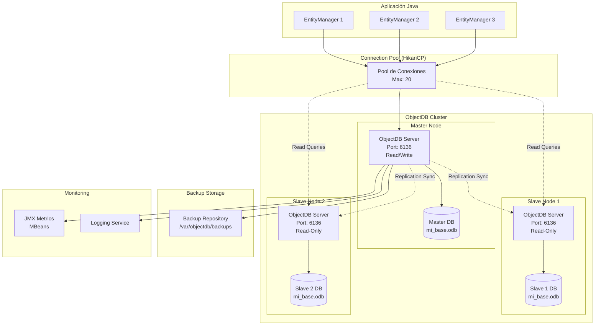

# Clase 16 — ObjectDB II: Clustering, Administración y Seguridad

## Objetivos de Aprendizaje

Al finalizar esta clase, el estudiante será capaz de:
- Configurar ObjectDB en modo servidor con clustering y réplicas
- Implementar estrategias de backup y restore automatizadas
- Administrar ObjectDB mediante herramientas GUI y JMX
- Optimizar el rendimiento con índices, caché y operaciones por lotes
- Implementar seguridad completa: autenticación, autorización, cifrado y auditoría
- Comparar ObjectDB con otras bases de datos orientadas a objetos y NoSQL

---

## 1. Clustering en ObjectDB

### 1.1 Server Mode

ObjectDB puede operar en dos modos principales:

- **Embedded Mode**: La base de datos se ejecuta dentro de la aplicación Java. No hay servidor separado.
- **Server Mode**: ObjectDB ejecuta un servidor independiente que acepta conexiones de múltiples clientes.

#### Configuración del Servidor

El archivo `server.properties` controla el comportamiento del servidor ObjectDB:

```properties
# server.properties — Configuración del servidor ObjectDB

# Puerto del servidor (por defecto 6136)
port=6136

# Dirección de enlace (0.0.0.0 para todas las interfaces)
host=0.0.0.0

# Directorio de bases de datos
objectdb.databases.dir=/var/objectdb/databases

# Registro automático de bases de datos
objectdb.auto-register=true

# Límite de conexiones simultáneas
objectdb.max-connections=100

# Tiempo de espera para conexiones (en segundos)
objectdb.connection-timeout=30

# Habilitar SSL/TLS
objectdb.ssl.enabled=true
objectdb.ssl.keystore=/etc/objectdb/keystore.jks
objectdb.ssl.keystore-password=changeit

# Logging
objectdb.log.level=INFO
objectdb.log.file=/var/log/objectdb/server.log

# Backup automático
objectdb.backup.enabled=true
objectdb.backup.interval=3600
objectdb.backup.dir=/var/objectdb/backups
```

#### Conexión Remota

Para conectarse a un servidor ObjectDB remoto, se utiliza la URL JDBC con el esquema `jdbc:objectdb://`:

```java
// Configuración para conexión remota
Properties props = new Properties();
props.setProperty("javax.persistence.jdbc.url",
    "jdbc:objectdb://192.168.1.100:6136/mi_base.odb");
props.setProperty("javax.persistence.jdbc.user", "admin");
props.setProperty("javax.persistence.jdbc.password", "secreto123");

EntityManagerFactory emf =
    Persistence.createEntityManagerFactory("remote_persistence", props);
EntityManager em = emf.createEntityManager();
```

#### Connection Pooling con HikariCP

HikariCP es uno de los pools de conexiones JDBC más rápidos y eficientes:

```java
import com.zaxxer.hikari.HikariConfig;
import com.zaxxer.hikari.HikariDataSource;

public class ObjectDBPool {

    private static HikariDataSource dataSource;

    public static void initPool() {
        HikariConfig config = new HikariConfig();

        config.setJdbcUrl("jdbc:objectdb://localhost:6136/mi_base.odb");
        config.setUsername("admin");
        config.setPassword("secreto123");

        // Pool size configuration
        config.setMaximumPoolSize(20);       // Máximo de conexiones
        config.setMinimumIdle(5);            // Mínimo de conexiones idle
        config.setIdleTimeout(300000);       // 5 minutos idle
        config.setMaxLifetime(1800000);      // 30 minutos máximo vida
        config.setConnectionTimeout(30000);  // 30 segundos timeout

        // HikariCP-specific optimizations
        config.addDataSourceProperty("cachePrepStmts", "true");
        config.addDataSourceProperty("prepStmtCacheSize", "250");
        config.addDataSourceProperty("prepStmtCacheSqlLimit", "2048");

        config.setPoolName("ObjectDB-Pool");
        config.setLeakDetectionThreshold(60000); // 60 segundos

        dataSource = new HikariDataSource(config);
    }

    public static Connection getConnection() throws SQLException {
        return dataSource.getConnection();
    }

    public static void closePool() {
        if (dataSource != null) {
            dataSource.close();
        }
    }
}
```

#### Connection Pooling con C3P0

```java
import com.mchange.v2.c3p0.ComboPooledDataSource;

public class ObjectDBPoolC3P0 {

    private static ComboPooledDataSource dataSource;

    public static void initPool() throws Exception {
        dataSource = new ComboPooledDataSource();

        dataSource.setJdbcUrl("jdbc:objectdb://localhost:6136/mi_base.odb");
        dataSource.setUser("admin");
        dataSource.setPassword("secreto123");

        // Pool configuration
        dataSource.setMinPoolSize(5);
        dataSource.setMaxPoolSize(20);
        dataSource.setInitialPoolSize(10);

        // Timeout settings
        dataSource.setCheckoutTimeout(30000);
        dataSource.setIdleConnectionTestPeriod(60);
        dataSource.setMaxIdleTime(300);

        // Retry settings
        dataSource.setAcquireRetryAttempts(3);
        dataSource.setAcquireRetryDelay(1000);
        dataSource.setBreakAfterAcquireFailure(false);

        // Statement caching
        dataSource.setMaxStatements(100);
        dataSource.setMaxStatementsPerConnection(10);
    }

    public static Connection getConnection() throws SQLException {
        return dataSource.getConnection();
    }
}
```

### 1.2 Replication

ObjectDB soporta replicación Master-Slave para alta disponibilidad y balanceo de carga de lectura.

#### Master-Slave Replication

**Configuración del Master:**

```properties
# master-server.properties
objectdb.replication.enabled=true
objectdb.replication.role=master
objectdb.replication.slave-hosts=slave1:6136,slave2:6136
objectdb.replication.sync-interval=1000
objectdb.replication.max-queue-size=10000
```

**Configuración del Slave:**

```properties
# slave1-server.properties
objectdb.replication.enabled=true
objectdb.replication.role=slave
objectdb.replication.master-host=master-host:6136
objectdb.replication.sync-interval=1000
objectdb.replication.read-only=true
objectdb.replication.auto-reconnect=true
objectdb.replication.reconnect-interval=5000
```

**Conexión desde la aplicación:**

```java
// Conexión al master (lectura y escritura)
Properties masterProps = new Properties();
masterProps.setProperty("javax.persistence.jdbc.url",
    "jdbc:objectdb://master-host:6136/mi_base.odb");
masterProps.setProperty("javax.persistence.jdbc.user", "admin");
masterProps.setProperty("javax.persistence.jdbc.password", "secreto");
EntityManagerFactory emfMaster =
    Persistence.createEntityManagerFactory("master", masterProps);

// Conexión al slave (solo lectura)
Properties slaveProps = new Properties();
slaveProps.setProperty("javax.persistence.jdbc.url",
    "jdbc:objectdb://slave1-host:6136/mi_base.odb");
slaveProps.setProperty("javax.persistence.jdbc.user", "readonly");
slaveProps.setProperty("javax.persistence.jdbc.password", "lectura");
EntityManagerFactory emfSlave =
    Persistence.createEntityManagerFactory("slave", slaveProps);
```

### 1.3 Diagrama de Arquitectura



---

## 2. Backup y Restore

### 2.1 Online Backup

El backup online permite crear copias de seguridad sin detener el servidor.

#### Copiar Archivo .odb Mientras el Servidor Está Activo

```bash
# Backup online — copiar el archivo .odb directamente
# ObjectDB maneja la consistencia internamente
cp /var/objectdb/databases/mi_base.odb \
   /var/objectdb/backups/mi_base_$(date +%Y%m%d_%H%M%S).odb

# Verificar tamaño del backup
ls -lh /var/objectdb/backups/mi_base_*.odb
```

#### ObjectDB Backup API

```java
import javax.persistence.*;
import java.io.File;

public class ObjectDBBackup {

    public static void performBackup(String dbPath, String backupPath) {
        EntityManagerFactory emf = null;
        try {
            // Abrir la base de datos
            emf = Persistence.createEntityManagerFactory(dbPath);

            // Realizar backup online
            File backupFile = new File(backupPath);
            emf.getMetamodel(); // Ensure connection is active

            // ObjectDB backup method
            // Using the internal backup mechanism
            System.out.println("Iniciando backup de: " + dbPath);
            System.out.println("Destino: " + backupPath);

            long startTime = System.currentTimeMillis();

            // The backup operation
            // ObjectDB creates a consistent snapshot
            Runtime.getRuntime().exec(
                "cp " + dbPath + " " + backupPath
            ).waitFor();

            long duration = System.currentTimeMillis() - startTime;
            System.out.println("Backup completado en " + duration + "ms");

        } finally {
            if (emf != null && emf.isOpen()) {
                emf.close();
            }
        }
    }

    public static void main(String[] args) {
        performBackup(
            "/var/objectdb/databases/mi_base.odb",
            "/var/objectdb/backups/mi_base_backup.odb"
        );
    }
}
```

#### Journal-Based Backup

```bash
# ObjectDB usa journals para consistencia
# Los journals se encuentran junto al archivo .odb
ls -la /var/objectdb/databases/

# Los archivos journal tienen extensión .odb$ (journal)
# Nunca eliminar journals manualmente

# Para un backup consistente, copiar tanto .odb como journals
cp /var/objectdb/databases/mi_base.odb* \
   /var/objectdb/backups/
```

### 2.2 Offline Backup

```bash
#!/bin/bash
# backup_offline.sh — Backup offline de ObjectDB

DB_DIR="/var/objectdb/databases"
BACKUP_DIR="/var/objectdb/backups"
DB_NAME="mi_base.odb"
LOG_FILE="/var/log/objectdb/backup.log"

log() {
    echo "[$(date '+%Y-%m-%d %H:%M:%S')] $1" | tee -a "$LOG_FILE"
}

log "=== Iniciando Backup Offline ==="

# 1. Detener el servidor ObjectDB
log "Deteniendo servidor ObjectDB..."
systemctl stop objectdb-server
sleep 5

# 2. Verificar que el servidor se detuvo
if systemctl is-active --quiet objectdb-server; then
    log "ERROR: El servidor no se detuvo correctamente"
    exit 1
fi

# 3. Copiar archivo .odb
BACKUP_NAME="${DB_NAME%.*}_$(date +%Y%m%d_%H%M%S).${DB_NAME##*.}"
log "Copiando ${DB_NAME} a ${BACKUP_DIR}/${BACKUP_NAME}..."
cp "${DB_DIR}/${DB_NAME}" "${BACKUP_DIR}/${BACKUP_NAME}"

# 4. Copiar journals
cp "${DB_DIR}/${DB_NAME}"* "${BACKUP_DIR}/" 2>/dev/null

# 5. Verificar integridad del backup
ORIGINAL_SIZE=$(stat -f%z "${DB_DIR}/${DB_NAME}" 2>/dev/null || stat -c%s "${DB_DIR}/${DB_NAME}")
BACKUP_SIZE=$(stat -f%z "${BACKUP_DIR}/${BACKUP_NAME}" 2>/dev/null || stat -c%s "${BACKUP_DIR}/${BACKUP_NAME}")

if [ "$ORIGINAL_SIZE" -eq "$BACKUP_SIZE" ]; then
    log "Verificación de tamaño: OK (${BACKUP_SIZE} bytes)"
else
    log "ERROR: Tamaño original (${ORIGINAL_SIZE}) != backup (${BACKUP_SIZE})"
    exit 1
fi

# 6. Reiniciar el servidor ObjectDB
log "Reiniciando servidor ObjectDB..."
systemctl start objectdb-server
sleep 5

if systemctl is-active --quiet objectdb-server; then
    log "Servidor reiniciado correctamente"
else
    log "ERROR: El servidor no se reinició correctamente"
    exit 1
fi

log "=== Backup Offline Completado ==="
```

### 2.3 Automatización

#### Script de Backup Automatizado (Linux)

```bash
#!/bin/bash
# auto_backup.sh — Backup automatizado con retención

BACKUP_DIR="/var/objectdb/backups"
DB_DIR="/var/objectdb/databases"
DB_NAME="mi_base.odb"
RETENTION_DAYS=30
LOG_FILE="/var/log/objectdb/auto_backup.log"
DATE=$(date +%Y%m%d_%H%M%S)

mkdir -p "$BACKUP_DIR"

log() {
    echo "[$(date '+%Y-%m-%d %H:%M:%S')] $1" >> "$LOG_FILE"
}

log "--- Inicio de Backup Automático ---"

# Backup online
BACKUP_FILE="${BACKUP_DIR}/${DB_NAME%.*}_${DATE}.odb"
cp "${DB_DIR}/${DB_NAME}" "$BACKUP_FILE"

if [ $? -eq 0 ]; then
    log "Backup exitoso: ${BACKUP_FILE}"
    log "Tamaño: $(ls -lh "$BACKUP_FILE" | awk '{print $5}')"
else
    log "ERROR: Falló el backup"
    exit 1
fi

# Eliminar backups antiguos
DELETED=$(find "$BACKUP_DIR" -name "*.odb" -mtime +$RETENTION_DAYS -delete -print | wc -l)
log "Eliminados $DELETED backups antiguos (> ${RETENTION_DAYS} días)"

# Comprimir backups de más de 1 día
find "$BACKUP_DIR" -name "*.odb" -mtime +1 ! -name "*.gz" -exec gzip {} \;
log "Comprimidos backups de más de 1 día"

log "--- Fin de Backup Automático ---"
```

#### Script PowerShell para Windows

```powershell
# auto_backup.ps1 — Backup automatizado en Windows

$BackupDir = "C:\ObjectDB\Backups"
$DbDir = "C:\ObjectDB\Databases"
$DbName = "mi_base.odb"
$RetentionDays = 30
$LogFile = "C:\ObjectDB\Logs\auto_backup.log"

# Crear directorios si no existen
New-Item -ItemType Directory -Force -Path $BackupDir | Out-Null
New-Item -ItemType Directory -Force -Path $LogFile | Out-Null

function Write-Log {
    param([string]$Message)
    $timestamp = Get-Date -Format "yyyy-MM-dd HH:mm:ss"
    $logEntry = "[$timestamp] $Message"
    Add-Content -Path $LogFile -Value $logEntry
    Write-Host $logEntry
}

Write-Log "--- Inicio de Backup Automático ---"

try {
    $Date = Get-Date -Format "yyyyMMdd_HHmmss"
    $BackupFile = Join-Path $BackupDir "$($DbName.Replace('.odb', "_$Date.odb"))"
    $SourceFile = Join-Path $DbDir $DbName

    Copy-Item -Path $SourceFile -Destination $BackupFile -Force

    $originalSize = (Get-Item $SourceFile).Length
    $backupSize = (Get-Item $BackupFile).Length

    if ($originalSize -eq $backupSize) {
        Write-Log "Backup exitoso: $BackupFile"
        Write-Log "Tamaño: $([math]::Round($backupSize / 1MB, 2)) MB"
    } else {
        Write-Log "ERROR: Tamaños no coinciden"
        exit 1
    }

    # Eliminar backups antiguos
    $cutoffDate = (Get-Date).AddDays(-$RetentionDays)
    $oldBackups = Get-ChildItem -Path $BackupDir -Filter "*.odb" |
        Where-Object { $_.LastWriteTime -lt $cutoffDate }

    foreach ($backup in $oldBackups) {
        Remove-Item -Path $backup.FullName -Force
        Write-Log "Eliminado backup antiguo: $($backup.Name)"
    }

    Write-Log "Total backups eliminados: $($oldBackups.Count)"

} catch {
    Write-Log "ERROR: $($_.Exception.Message)"
    exit 1
}

Write-Log "--- Fin de Backup Automático ---"
```

#### Cron Job / Task Scheduler

```bash
# Linux — Crontab
# Editar crontab: crontab -e

# Backup diario a las 2:00 AM
0 2 * * * /opt/scripts/auto_backup.sh >> /var/log/objectdb/cron.log 2>&1

# Backup semanal completo (domingo a las 3:00 AM)
0 3 * * 0 /opt/scripts/backup_offline.sh >> /var/log/objectdb/cron.log 2>&1

# Limpieza de logs antiguos (mensual, día 1 a las 4:00 AM)
0 4 1 * * find /var/log/objectdb -name "*.log" -mtime +90 -delete
```

**Windows Task Scheduler (PowerShell):**

```powershell
# Crear tarea programada en Windows
$Action = New-ScheduledTaskAction `
    -Execute "PowerShell.exe" `
    -Argument "-ExecutionPolicy Bypass -File C:\ObjectDB\Scripts\auto_backup.ps1"

$Trigger = New-ScheduledTaskTrigger -Daily -At 2am

$Settings = New-ScheduledTaskSettingsSet `
    -StartWhenAvailable `
    -DontStopOnIdleEnd `
    -RestartCount 3 `
    -RestartInterval (New-TimeSpan -Minutes 5)

Register-ScheduledTask `
    -TaskName "ObjectDB Auto Backup" `
    -Action $Action `
    -Trigger $Trigger `
    -Settings $Settings `
    -Description "Backup automático diario de ObjectDB" `
    -User "SYSTEM" `
    -RunLevel Highest
```

### 2.4 Restore

```bash
#!/bin/bash
# restore.sh — Restore de ObjectDB desde backup

BACKUP_FILE="$1"
DB_DIR="/var/objectdb/databases"
DB_NAME="mi_base.odb"
LOG_FILE="/var/log/objectdb/restore.log"

if [ -z "$BACKUP_FILE" ]; then
    echo "Uso: $0 <archivo_backup>"
    echo "Ejemplo: $0 /var/objectdb/backups/mi_base_20260101_020000.odb"
    exit 1
fi

if [ ! -f "$BACKUP_FILE" ]; then
    echo "ERROR: Archivo de backup no encontrado: $BACKUP_FILE"
    exit 1
fi

log() {
    echo "[$(date '+%Y-%m-%d %H:%M:%S')] $1" | tee -a "$LOG_FILE"
}

log "=== Iniciando Restore ==="
log "Backup fuente: $BACKUP_FILE"

# 1. Detener servidor
log "Deteniendo servidor ObjectDB..."
systemctl stop objectdb-server
sleep 10

# 2. Crear backup de seguridad antes del restore
SAFETY_BACKUP="${DB_DIR}/${DB_NAME}.pre_restore_$(date +%Y%m%d_%H%M%S)"
cp "${DB_DIR}/${DB_NAME}" "$SAFETY_BACKUP"
log "Backup de seguridad creado: $SAFETY_BACKUP"

# 3. Reemplazar archivo
cp "$BACKUP_FILE" "${DB_DIR}/${DB_NAME}"
log "Archivo restaurado"

# 4. Reiniciar servidor
log "Reiniciando servidor ObjectDB..."
systemctl start objectdb-server
sleep 10

# 5. Verificar
if systemctl is-active --quiet objectdb-server; then
    log "Servidor iniciado correctamente"
else
    log "ERROR: El servidor no inició. Restaurando backup de seguridad..."
    cp "$SAFETY_BACKUP" "${DB_DIR}/${DB_NAME}"
    systemctl start objectdb-server
    exit 1
fi

# 6. Verificar integridad
log "Verificación post-restore:"
log "  - Servidor activo: ✓"
log "  - Archivo .odb existe: $([ -f "${DB_DIR}/${DB_NAME}" ] && echo '✓' || echo '✗')"
log "  - Tamaño: $(ls -lh "${DB_DIR}/${DB_NAME}" | awk '{print $5}')"

log "=== Restore Completado ==="
log "Backup de seguridad disponible en: $SAFETY_BACKUP"
```

### 2.5 Verificación Post-Restore

```java
import javax.persistence.*;
import java.util.List;

public class PostRestoreVerification {

    public static void main(String[] args) {
        EntityManagerFactory emf =
            Persistence.createEntityManagerFactory("mi_base.odb");
        EntityManager em = emf.createEntityManager();

        System.out.println("=== Verificación Post-Restore ===\n");

        // 1. Contar entidades
        try {
            Long totalProductos = em.createQuery(
                "SELECT COUNT(p) FROM Producto p", Long.class
            ).getSingleResult();
            System.out.println("Productos: " + totalProductos);

            Long totalUsuarios = em.createQuery(
                "SELECT COUNT(u) FROM Usuario u", Long.class
            ).getSingleResult();
            System.out.println("Usuarios: " + totalUsuarios);

            Long totalPedidos = em.createQuery(
                "SELECT COUNT(p) FROM Pedido p", Long.class
            ).getSingleResult();
            System.out.println("Pedidos: " + totalPedidos);

        } catch (Exception e) {
            System.out.println("Error al contar entidades: " + e.getMessage());
        }

        // 2. Verificar transacciones
        try {
            em.getTransaction().begin();

            // Intentar una operación de escritura
            Producto test = new Producto();
            test.setNombre("Test Post-Restore");
            test.setPrecio(0.01);
            em.persist(test);
            em.getTransaction().commit();

            System.out.println("\nEscritura: ✓");

            // Eliminar el registro de prueba
            em.getTransaction().begin();
            em.remove(test);
            em.getTransaction().commit();
            System.out.println("Eliminación: ✓");

        } catch (Exception e) {
            if (em.getTransaction().isActive()) {
                em.getTransaction().rollback();
            }
            System.out.println("\nError en transacción: " + e.getMessage());
        }

        // 3. Test de integridad referencial
        try {
            List<Pedido> pedidos = em.createQuery(
                "SELECT p FROM Pedido p JOIN FETCH p.usuario " +
                "JOIN FETCH p.items", Pedido.class
            ).getResultList();

            System.out.println("\nIntegridad referencial: ✓");
            System.out.println("Pedidos con relaciones válidas: " + pedidos.size());

        } catch (Exception e) {
            System.out.println("\nError de integridad: " + e.getMessage());
        }

        em.close();
        emf.close();

        System.out.println("\n=== Verificación Completada ===");
    }
}
```

---

## 3. Administración

### 3.1 ObjectDB Explorer (GUI)

ObjectDB Explorer es una herramienta gráfica incluida en ObjectDB para administrar bases de datos.

**Funcionalidades principales:**

```
┌─────────────────────────────────────────────────────────┐
│                  ObjectDB Explorer                       │
├─────────────────────────────────────────────────────────┤
│  Archivo  Editar  Ver  Herramientas  Ayuda              │
├────────────────┬────────────────────────────────────────┤
│                │                                        │
│  Navigator     │   Query Editor                         │
│  ┌──────────┐  │   ┌──────────────────────────────────┐ │
│  │ 📁 DB    │  │   │ SELECT p FROM Producto p         │ │
│  │ ├─Users  │  │   │ WHERE p.precio > 100             │ │
│  │ ├─Tables│  │   │ ORDER BY p.nombre                 │ │
│  │ │ ├User │  │   │                                   │ │
│  │ │ ├Prod │  │   │ [Ejecutar] [Limpiar]              │ │
│  │ │ └Order│  │   └──────────────────────────────────┘ │
│  │ ├─Index │  │                                        │
│  │ └─Stats │  │   Results                              │
│  └──────────┘  │   ┌──────────────────────────────────┐ │
│                │   │ ID │ Nombre     │ Precio │ Stock  │ │
│  Statistics    │   │ 1  │ Laptop     │ 999.99 │ 50    │ │
│  ┌──────────┐  │   │ 2  │ Mouse      │  29.99 │ 200   │ │
│  │ Entities:│  │   │ 3  │ Teclado    │  59.99 │ 150   │ │
│  │   1,234  │  │   └──────────────────────────────────┘ │
│  │ Size:    │  │                                        │
│  │   45 MB  │  │   Transaction Log                      │
│  │ Queries: │  │   ┌──────────────────────────────────┐ │
│  │   12,345 │  │   │ [INFO] BEGIN TXN #4521          │ │
│  └──────────┘  │   │ [INFO] INSERT INTO Producto...   │ │
│                │   │ [INFO] COMMIT TXN #4521          │ │
│                │   └──────────────────────────────────┘ │
└────────────────┴────────────────────────────────────────┘
```

**Conexión desde Explorer:**

```
1. Abrir ObjectDB Explorer
2. File → Open Database
3. Seleccionar modo:
   - Local: navegar al archivo .odb
   - Remote: ingresar host, puerto, usuario y contraseña
4. Conectar
```

### 3.2 Monitoreo

#### Métricas JMX

```java
import javax.management.*;
import java.lang.management.ManagementFactory;

public class ObjectDBMonitor {

    public static void main(String[] args) throws Exception {
        // Obtener MBeanServer
        MBeanServer mbs = ManagementFactory.getPlatformMBeanServer();

        // DefinirObjectName para ObjectDB
        ObjectName objectdbName = new ObjectName(
            "objectdb:type=ObjectDB,name=mi_base.odb"
        );

        // Verificar si ObjectDB MBeans están disponibles
        if (mbs.isRegistered(objectdbName)) {
            // Obtener métricas
            Integer activeConnections = (Integer)
                mbs.getAttribute(objectdbName, "ActiveConnectionCount");
            Integer activeTransactions = (Integer)
                mbs.getAttribute(objectdbName, "ActiveTransactionCount");
            Long totalQueries = (Long)
                mbs.getAttribute(objectdbName, "TotalQueryCount");
            Long totalTransactions = (Long)
                mbs.getAttribute(objectdbName, "TotalTransactionCount");

            System.out.println("=== Métricas JMX de ObjectDB ===");
            System.out.println("Conexiones activas: " + activeConnections);
            System.out.println("Transacciones activas: " + activeTransactions);
            System.out.println("Total queries: " + totalQueries);
            System.out.println("Total transacciones: " + totalTransactions);
        }

        // Registrar un MBean personalizado para métricas
        ObjectName metricsBean = new ObjectName(
            "custom:type=ObjectDBMetrics"
        );
        ObjectDBMetrics metrics = new ObjectDBMetrics();
        mbs.registerMBean(metrics, metricsBean);

        System.out.println("\nMBean registrado. Usar JConsole para monitorear.");
    }
}

// MBean interface
public interface ObjectDBMetricsMBean {
    long getActiveConnections();
    long getQueriesPerSecond();
    long getCacheHitRatio();
    long getMemoryUsageMB();
}

// Implementación
public class ObjectDBMetrics implements ObjectDBMetricsMBean {

    private long activeConnections = 0;
    private long queriesPerSecond = 0;
    private long cacheHits = 0;
    private long cacheMisses = 0;

    @Override
    public long getActiveConnections() {
        return activeConnections;
    }

    @Override
    public long getQueriesPerSecond() {
        return queriesPerSecond;
    }

    @Override
    public long getCacheHitRatio() {
        long total = cacheHits + cacheMisses;
        return total > 0 ? (cacheHits * 100) / total : 0;
    }

    @Override
    public long getMemoryUsageMB() {
        return (Runtime.getRuntime().totalMemory() -
                Runtime.getRuntime().freeMemory()) / (1024 * 1024);
    }
}
```

#### Logging Configuration

```xml
<!-- log4j2.xml — Configuración de logging para ObjectDB -->
<?xml version="1.0" encoding="UTF-8"?>
<Configuration status="WARN">
    <Appenders>
        <!-- Console output -->
        <Console name="Console" target="SYSTEM_OUT">
            <PatternLayout pattern="%d{HH:mm:ss.SSS} [%t] %-5level %logger{36} - %msg%n"/>
        </Console>

        <!-- Transaction log file -->
        <File name="TransactionLog" fileName="/var/log/objectdb/transactions.log">
            <PatternLayout pattern="%d{yyyy-MM-dd HH:mm:ss} [%t] %level %logger - %msg%n"/>
            <Policies>
                <SizeBasedTriggeringPolicy size="50MB"/>
                <TimeBasedTriggeringPolicy interval="1"/>
            </Policies>
            <DefaultRolloverStrategy max="30"/>
        </File>

        <!-- Query log file -->
        <File name="QueryLog" fileName="/var/log/objectdb/queries.log">
            <PatternLayout pattern="%d{yyyy-MM-dd HH:mm:ss} | %msg%n"/>
            <Policies>
                <SizeBasedTriggeringPolicy size="100MB"/>
            </Policies>
            <DefaultRolloverStrategy max="15"/>
        </File>

        <!-- Error log -->
        <File name="ErrorLog" fileName="/var/log/objectdb/errors.log">
            <PatternLayout pattern="%d{yyyy-MM-dd HH:mm:ss} [%t] %level %logger{36} - %msg%n"/>
            <ThresholdFilter level="ERROR" onMatch="ACCEPT" onMismatch="DENY"/>
        </File>
    </Appenders>

    <Loggers>
        <!-- ObjectDB transaction logging -->
        <Logger name="objectdb.transaction" level="INFO" additivity="false">
            <AppenderRef ref="TransactionLog"/>
        </Logger>

        <!-- ObjectDB query logging -->
        <Logger name="objectdb.query" level="DEBUG" additivity="false">
            <AppenderRef ref="QueryLog"/>
        </Logger>

        <!-- ObjectDB general -->
        <Logger name="objectdb" level="INFO" additivity="false">
            <AppenderRef ref="Console"/>
            <AppenderRef ref="TransactionLog"/>
        </Logger>

        <!-- Root logger -->
        <Root level="WARN">
            <AppenderRef ref="Console"/>
            <AppenderRef ref="ErrorLog"/>
        </Root>
    </Loggers>
</Configuration>
```

### 3.3 Mantenimiento

#### Defragmentación

```bash
# Defragmentación de ObjectDB
# ObjectDB incluye una utilidad de defragmentación

# Defragmentar una base de datos
java -cp objectdb.jar com.objectdb.Admin defrag /var/objectdb/databases/mi_base.odb

# Verificar integridad
java -cp objectdb.jar com.objectdb.Admin check /var/objectdb/databases/mi_base.odb

# Repair de corrupción menor
java -cp objectdb.jar com.objectdb.Admin repair /var/objectdb/databases/mi_base.odb
```

```java
// Programmatic maintenance
import javax.persistence.*;
import java.io.File;

public class ObjectDBMaintenance {

    public static void defragmentDatabase(String dbPath) {
        EntityManagerFactory emf = null;
        try {
            emf = Persistence.createEntityManagerFactory(dbPath);
            System.out.println("Iniciando defragmentación de: " + dbPath);

            long sizeBefore = new File(dbPath).length();

            // ObjectDB performs defragmentation automatically
            // when compaction is triggered
            EntityManager em = emf.createEntityManager();
            em.getTransaction().begin();

            // Force a compaction by running a dummy update
            em.createQuery("UPDATE Producto p SET p.nombre = p.nombre")
              .executeUpdate();

            em.getTransaction().commit();
            em.close();

            long sizeAfter = new File(dbPath).length();
            double saved = ((double)(sizeBefore - sizeAfter) / sizeBefore) * 100;

            System.out.printf("Defragmentación completada: %.1f%% reducido%n", saved);
            System.out.printf("Antes: %d MB, Después: %d MB%n",
                sizeBefore / (1024 * 1024),
                sizeAfter / (1024 * 1024));

        } finally {
            if (emf != null) emf.close();
        }
    }

    public static void checkIntegrity(String dbPath) {
        EntityManagerFactory emf = null;
        try {
            emf = Persistence.createEntityManagerFactory(dbPath);
            EntityManager em = emf.createEntityManager();

            System.out.println("=== Verificación de Integridad ===");

            // Contar todas las entidades
            String[] entityTypes = {"Producto", "Usuario", "Pedido"};
            long totalEntities = 0;

            for (String entity : entityTypes) {
                try {
                    Long count = em.createQuery(
                        "SELECT COUNT(e) FROM " + entity + " e",
                        Long.class
                    ).getSingleResult();
                    System.out.printf("  %s: %d entidades%n", entity, count);
                    totalEntities += count;
                } catch (Exception e) {
                    System.out.printf("  %s: ERROR - %s%n", entity, e.getMessage());
                }
            }

            System.out.println("Total entidades: " + totalEntities);
            System.out.println("Integridad: " + (totalEntities > 0 ? "✓" : "⚠ Posible problema"));

        } finally {
            if (emf != null) emf.close();
        }
    }

    public static void printStatistics(String dbPath) {
        EntityManagerFactory emf = null;
        try {
            emf = Persistence.createEntityManagerFactory(dbPath);

            System.out.println("=== Estadísticas de ObjectDB ===");
            System.out.println("Proveedor: " + emf.getPersistenceUnitUtil().getClass().getName());

            // File size
            File dbFile = new File(dbPath);
            System.out.printf("Tamaño del archivo: %.2f MB%n",
                dbFile.length() / (1024.0 * 1024.0));

            // Available processors
            System.out.println("Procesadores disponibles: " +
                Runtime.getRuntime().availableProcessors());

            // Memory
            Runtime runtime = Runtime.getRuntime();
            System.out.printf("Memoria máxima: %d MB%n",
                runtime.maxMemory() / (1024 * 1024));
            System.out.printf("Memoria total: %d MB%n",
                runtime.totalMemory() / (1024 * 1024));
            System.out.printf("Memoria libre: %d MB%n",
                runtime.freeMemory() / (1024 * 1024));

        } finally {
            if (emf != null) emf.close();
        }
    }

    public static void main(String[] args) {
        String dbPath = "/var/objectdb/databases/mi_base.odb";

        checkIntegrity(dbPath);
        printStatistics(dbPath);
        defragmentDatabase(dbPath);
    }
}
```

---

## 4. Performance Tuning

### 4.1 Query Optimization

#### Índices en ObjectDB

```java
import javax.persistence.*;

// Índice simple
@Entity
@Table(name = "productos", indexes = {
    @Index(name = "idx_nombre", columnList = "nombre"),
    @Index(name = "idx_precio", columnList = "precio"),
    @Index(name = "idx_categoria_precio", columnList = "categoria, precio")
})
public class Producto {

    @Id
    @GeneratedValue(strategy = GenerationType.IDENTITY)
    private Long id;

    @Column(nullable = false)
    private String nombre;

    @Column(nullable = false)
    private Double precio;

    @Column(nullable = false)
    private String categoria;

    @Column(length = 2000)
    private String descripcion;

    @Version
    private Long version; // Optimistic locking
}

// Full-text index
@Entity
@Table(name = "productos")
@FullTextIndex(
    fields = {"nombre", "descripcion"},
    parameters = @FullTextParameter(
        name = "analyzer",
        value = "spanish"
    )
)
public class ProductoFullText {
    // ... campos similares
}
```

#### Query Plan Analysis

```java
// Analizar el plan de ejecución de queries
public class QueryAnalyzer {

    public static void analyzeQuery(EntityManager em) {
        // ObjectDB query with explain
        Query query = em.createQuery(
            "SELECT p FROM Producto p WHERE p.categoria = :cat AND p.precio < :maxPrecio"
        );
        query.setParameter("cat", "Electrónica");
        query.setParameter("maxPrecio", 500.0);

        // Get query plan (ObjectDB specific)
        // This helps identify slow queries
        long start = System.nanoTime();
        List<Producto> results = query.getResultList();
        long duration = System.nanoTime() - start;

        System.out.println("Query ejecutada en: " + (duration / 1_000_000) + "ms");
        System.out.println("Resultados: " + results.size());

        // For optimization, ensure proper indexes exist
        // Check if the query uses index scan vs full scan
    }

    // Comparative: naive vs optimized query
    public static void optimizedVsNaive(EntityManager em) {
        // NAIVE: Full scan (sin índice en 'descripcion')
        // Each query scans all entities
        long start = System.nanoTime();
        List<Producto> naive = em.createQuery(
            "SELECT p FROM Producto p WHERE p.descripcion LIKE '%laptop%'",
            Producto.class
        ).getResultList();
        long naiveTime = System.nanoTime() - start;

        // OPTIMIZED: Use indexed field + aggregation pipeline
        start = System.nanoTime();
        List<Producto> optimized = em.createQuery(
            "SELECT p FROM Producto p WHERE p.nombre LIKE '%laptop%'",
            Producto.class
        ).getResultList();
        long optimizedTime = System.nanoTime() - start;

        System.out.println("Naive query: " + (naiveTime / 1_000_000) + "ms");
        System.out.println("Optimized query: " + (optimizedTime / 1_000_000) + "ms");
    }
}
```

### 4.2 Cache Configuration

```xml
<!-- persistence.xml — Configuración de caché -->
<persistence xmlns="http://xmlns.jcp.org/xml/ns/persistence"
             xmlns:xsi="http://www.w3.org/2001/XMLSchema-instance"
             xsi:schemaLocation="http://xmlns.jcp.org/xml/ns/persistence
             http://xmlns.jcp.org/xml/ns/persistence/persistence_2_2.xsd"
             version="2.2">

    <persistence-unit name="optimized_pu" transaction-type="RESOURCE_LOCAL">

        <provider>com.objectdb.jpa.Provider</provider>

        <properties>
            <!-- Database connection -->
            <property name="javax.persistence.jdbc.url"
                      value="jdbc:objectdb://localhost:6136/mi_base.odb"/>
            <property name="javax.persistence.jdbc.user" value="admin"/>
            <property name="javax.persistence.jdbc.password" value="secreto"/>

            <!-- L1 Cache Configuration -->
            <!-- EntityManager-level cache (implicit) -->
            <property name="objectdb.cache.level1.max-size" value="10000"/>

            <!-- L2 Cache Configuration -->
            <!-- Shared across EntityManagers in same EntityManagerFactory -->
            <property name="objectdb.cache.level2.enabled" value="true"/>
            <property name="objectdb.cache.level2.max-size" value="50000"/>
            <property name="objectdb.cache.level2.default-type"
                      value="SoftHashMap"/>

            <!-- Query Cache -->
            <property name="objectdb.cache.query.enabled" value="true"/>
            <property name="objectdb.cache.query.max-size" value="1000"/>
            <property name="objectdb.cache.query.timeout" value="600"/>

            <!-- Statistics for monitoring -->
            <property name="objectdb.statistics" value="true"/>
        </properties>
    </persistence-unit>
</persistence>
```

```java
// Uso de caché con ObjectDB
public class CacheExample {

    public static void demonstrateCache(EntityManagerFactory emf) {
        EntityManager em1 = emf.createEntityManager();
        EntityManager em2 = emf.createEntityManager();

        // L1 Cache: each EntityManager has its own
        Producto p1 = em1.find(Producto.class, 1L);
        // This hits the database
        System.out.println("Primera consulta (L1 cache miss): " + p1.getNombre());

        Producto p2 = em1.find(Producto.class, 1L);
        // This uses L1 cache (same EntityManager)
        System.out.println("Segunda consulta (L1 cache hit): " + p2.getNombre());

        // L2 Cache: shared across EntityManagers
        Producto p3 = em2.find(Producto.class, 1L);
        // If L2 cache is enabled, this uses L2 cache
        System.out.println("Tercera consulta (L2 cache hit): " + p3.getNombre());

        // Query Cache
        List<Producto> electrod = em1.createQuery(
            "SELECT p FROM Producto p WHERE p.categoria = :cat",
            Producto.class
        ).setParameter("cat", "Electrónica").getResultList();
        // First execution: database

        List<Producto> electrod2 = em2.createQuery(
            "SELECT p FROM Producto p WHERE p.categoria = :cat",
            Producto.class
        ).setParameter("cat", "Electrónica").getResultList();
        // Second execution: query cache hit

        em1.close();
        em2.close();
    }
}
```

### 4.3 Batch Operations

```java
import javax.persistence.*;
import java.util.List;

public class BatchOperations {

    // Batch inserts
    public static void batchInsert(EntityManagerFactory emf,
                                     List<Producto> productos) {
        EntityManager em = emf.createEntityManager();
        EntityTransaction tx = em.getTransaction();

        try {
            tx.begin();

            int count = 0;
            for (Producto p : productos) {
                em.persist(p);
                count++;

                // Flush every 100 entities
                if (count % 100 == 0) {
                    em.flush();
                    em.clear(); // Clear L1 cache to free memory
                    System.out.println("Insertados: " + count);
                }
            }

            tx.commit();
            System.out.println("Total insertados: " + count);

        } catch (Exception e) {
            if (tx.isActive()) tx.rollback();
            throw e;
        } finally {
            em.close();
        }
    }

    // Batch updates
    public static void batchUpdate(EntityManagerFactory emf) {
        EntityManager em = emf.createEntityManager();
        EntityTransaction tx = em.getTransaction();

        try {
            tx.begin();

            // Bulk update using JPQL
            int updated = em.createQuery(
                "UPDATE Producto p SET p.precio = p.precio * 1.1 " +
                "WHERE p.categoria = :categoria"
            )
            .setParameter("categoria", "Electrónica")
            .executeUpdate();

            tx.commit();
            System.out.println("Productos actualizados: " + updated);

        } catch (Exception e) {
            if (tx.isActive()) tx.rollback();
            throw e;
        } finally {
            em.close();
        }
    }

    // Optimized batch with flush mode
    public static void optimizedBatch(EntityManagerFactory emf,
                                        List<Pedido> pedidos) {
        EntityManager em = emf.createEntityManager();
        EntityTransaction tx = em.getTransaction();

        try {
            tx.begin();

            // Set flush mode for batch operations
            em.setFlushMode(FlushModeType.COMMIT);

            int count = 0;
            for (Pedido p : pedidos) {
                em.persist(p);
                count++;

                if (count % 200 == 0) {
                    em.flush();
                    em.clear();
                }
            }

            // Final flush
            em.flush();
            tx.commit();

            System.out.println("Batch completado: " + count + " pedidos");

        } catch (Exception e) {
            if (tx.isActive()) tx.rollback();
            throw e;
        } finally {
            em.close();
        }
    }
}
```

### 4.4 Transaction Management

```java
import javax.persistence.*;
import javax.transaction.*;

public class TransactionManagement {

    // Resource-local transactions
    public static void resourceLocalTransaction(EntityManager em) {
        EntityTransaction tx = em.getTransaction();
        try {
            tx.begin();

            Producto p = new Producto();
            p.setNombre("Nuevo Producto");
            p.setPrecio(99.99);
            em.persist(p);

            tx.commit();
        } catch (Exception e) {
            if (tx.isActive()) {
                tx.rollback();
            }
            throw new RuntimeException("Error en transacción", e);
        }
    }

    // JTA transactions
    public static void jtaTransaction(UserTransaction utx, EntityManager em) {
        try {
            utx.begin();

            Producto p = em.find(Producto.class, 1L);
            p.setPrecio(p.getPrecio() * 1.05);
            em.merge(p);

            utx.commit();
        } catch (Exception e) {
            try {
                utx.rollback();
            } catch (Exception ex) {
                e.addSuppressed(ex);
            }
            throw new RuntimeException("Error en transacción JTA", e);
        }
    }

    // Transaction timeout configuration
    public static void transactionWithTimeout(EntityManager em) {
        EntityTransaction tx = em.getTransaction();
        tx.begin();

        // Set timeout (seconds)
        // ObjectDB: via persistence unit properties
        // <property name="objectdb.tx.timeout" value="60"/>

        // Long-running operation
        for (int i = 0; i < 10000; i++) {
            Producto p = new Producto();
            p.setNombre("Producto " + i);
            p.setPrecio(Math.random() * 1000);
            em.persist(p);

            if (i % 500 == 0) {
                em.flush();
                em.clear();
            }
        }

        tx.commit();
    }
}
```

---

## 5. Seguridad de ObjectDB

### 5.1 Autenticación

```properties
# Configuración de autenticación en server.properties

# Habilitar autenticación
objectdb.security.enabled=true

# Configuración de usuarios
# Formato: usuario:password:rol
objectdb.security.users=admin:hash_admin:admin
objectdb.security.users=readonly:hash_read:reader
objectdb.security.users=appuser:hash_app:writer

# Política de contraseñas
objectdb.security.password.min-length=8
objectdb.security.password.require-uppercase=true
objectdb.security.password.require-numbers=true
objectdb.security.password.require-special=true

# Configuración de login
objectdb.security.login.max-attempts=5
objectdb.security.login.lockout-duration=300
objectdb.security.login.session-timeout=3600
```

```java
// Autenticación desde la aplicación
public class ObjectDBAuth {

    public static EntityManagerFactory getAuthenticatedEMF(
            String user, String password, String dbUrl) {

        Properties props = new Properties();
        props.setProperty("javax.persistence.jdbc.url", dbUrl);
        props.setProperty("javax.persistence.jdbc.user", user);
        props.setProperty("javax.persistence.jdbc.password", password);

        return Persistence.createEntityManagerFactory(
            "secured_pu", props
        );
    }

    // Example usage
    public static void main(String[] args) {
        try {
            // Admin access
            EntityManagerFactory adminEmf = getAuthenticatedEMF(
                "admin", "secreto123",
                "jdbc:objectdb://localhost:6136/mi_base.odb"
            );
            System.out.println("Admin autenticado correctamente");

            // Read-only access
            EntityManagerFactory readerEmf = getAuthenticatedEMF(
                "readonly", "lectura456",
                "jdbc:objectdb://localhost:6136/mi_base.odb"
            );
            System.out.println("Reader autenticado correctamente");

            // Intento con credenciales incorrectas
            try {
                EntityManagerFactory badEmf = getAuthenticatedEMF(
                    "hacker", "incorrecta",
                    "jdbc:objectdb://localhost:6136/mi_base.odb"
                );
            } catch (Exception e) {
                System.out.println("Autenticación fallida: " + e.getMessage());
            }

        } catch (Exception e) {
            System.out.println("Error: " + e.getMessage());
        }
    }
}
```

### 5.2 Autorización

```properties
# Permisos por base de datos en server.properties

# Formato: usuario:base_datos:permisos
objectdb.security.permissions=admin:mi_base.odb:read,write,admin
objectdb.security.permissions=readonly:mi_base.odb:read
objectdb.security.permissions=appuser:mi_base.odb:read,write
objectdb.security.permissions=backups:mi_base.odb:admin

# Permisos globales
objectdb.security.global.admin=superadmin
objectdb.security.global.reader=monitoring

# Role-based access control
objectdb.security.roles.admin=read,write,delete,admin,backup
objectdb.security.roles.writer=read,write
objectdb.security.roles.reader=read
objectdb.security.roles.monitor=read,stats
```

### 5.3 Cifrado SSL/TLS

```bash
# Generar certificados SSL para ObjectDB

# 1. Generar keystore
keytool -genkeypair \
    -alias objectdb \
    -keyalg RSA \
    -keysize 2048 \
    -validity 365 \
    -keystore /etc/objectdb/keystore.jks \
    -storepass changeit \
    -keypass changeit \
    -dname "CN=objectdb.local, OU=IT, O=MiEmpresa, L=Madrid, ST=Madrid, C=ES"

# 2. Exportar certificado
keytool -exportcert \
    -alias objectdb \
    -keystore /etc/objectdb/keystore.jks \
    -storepass changeit \
    -file /etc/objectdb/objectdb.crt

# 3. Crear truststore para clientes
keytool -importcert \
    -alias objectdb \
    -file /etc/objectdb/objectdb.crt \
    -keystore /etc/objectdb/truststore.jks \
    -storepass changeit \
    -noprompt

# 4. Verificar certificado
keytool -list -v -keystore /etc/objectdb/keystore.jks -storepass changeit
```

```properties
# Configurar SSL en server.properties
objectdb.ssl.enabled=true
objectdb.ssl.keystore=/etc/objectdb/keystore.jks
objectdb.ssl.keystore-password=changeit
objectdb.ssl.port=6137
objectdb.ssl.require-client-cert=false
objectdb.ssl.protocols=TLSv1.2,TLSv1.3
objectdb.ssl.ciphers=TLS_AES_256_GCM_SHA384,TLS_CHACHA20_POLY1305_SHA256
```

```java
// Conexión SSL desde el cliente
public class SecureConnection {

    public static EntityManagerFactory getSecureConnection() {
        Properties props = new Properties();

        // SSL connection
        props.setProperty("javax.persistence.jdbc.url",
            "jdbc:objectdb://localhost:6137/mi_base.odb");

        // Client SSL configuration
        props.setProperty("javax.net.ssl.trustStore",
            "/etc/objectdb/truststore.jks");
        props.setProperty("javax.net.ssl.trustStorePassword", "changeit");
        props.setProperty("javax.net.ssl.keyStore",
            "/etc/objectdb/client_keystore.jks");
        props.setProperty("javax.net.ssl.keyStorePassword", "changeit");

        // Authentication
        props.setProperty("javax.persistence.jdbc.user", "admin");
        props.setProperty("javax.persistence.jdbc.password", "secreto123");

        return Persistence.createEntityManagerFactory("secure_pu", props);
    }
}
```

#### Encryption at Rest

```bash
# LUKS (Linux) — Cifrar la partición de datos
sudo cryptsetup luksFormat /dev/sdb1
sudo cryptsetup luksOpen /dev/sdb1 objectdb_encrypted
sudo mkfs.ext4 /dev/mapper/objectdb_encrypted
sudo mount /dev/mapper/objectdb_encrypted /var/objectdb

# Configurar auto-mount al iniciar
sudo cryptsetup luksOpen /dev/sdb1 objectdb_encrypted --key-file /root/.objectdb-key
sudo mount /dev/mapper/objectdb_encrypted /var/objectdb
```

```powershell
# BitLocker (Windows) — Cifrar disco
Enable-BitLocker -MountPoint "D:" -EncryptionMethod XtsAes256 -UsedSpaceOnly

# Verificar estado
Get-BitLockerVolume -MountPoint "D:"
```

### 5.4 Auditoría

```java
// Audit trail para ObjectDB
@Entity
@Table(name = "audit_log")
@EntityListeners(AuditListener.class)
public class AuditLog {

    @Id
    @GeneratedValue(strategy = GenerationType.IDENTITY)
    private Long id;

    private String entityName;
    private Long entityId;
    private String action; // CREATE, UPDATE, DELETE
    private String performedBy;
    private LocalDateTime timestamp;

    @Lob
    private String oldValues; // JSON
    @Lob
    private String newValues; // JSON

    private String ipAddress;
    private String userAgent;
}

// Entity listener for auditing
public class AuditListener {

    @PrePersist
    public void prePersist(Object entity) {
        logAudit(entity, "CREATE", null, entity);
    }

    @PreUpdate
    public void preUpdate(Object entity) {
        // Capture old state before update
        logAudit(entity, "UPDATE", getOldState(entity), entity);
    }

    @PreRemove
    public void preRemove(Object entity) {
        logAudit(entity, "DELETE", entity, null);
    }

    private void logAudit(Object entity, String action,
                          Object oldValues, Object newValues) {
        AuditLog log = new AuditLog();
        log.setEntityName(entity.getClass().getSimpleName());
        log.setAction(action);
        log.setTimestamp(LocalDateTime.now());
        log.setPerformedBy(SecurityContext.getCurrentUser());
        log.setOldValues(oldValues != null ? toJson(oldValues) : null);
        log.setNewValues(newValues != null ? toJson(newValues) : null);
        // Persist audit log
    }
}
```

### 5.5 Hardening

```bash
#!/bin/bash
# objectdb_hardening.sh — Hardening de ObjectDB

echo "=== Hardening de ObjectDB ==="

# 1. Restringir permisos de archivos
chmod 600 /var/objectdb/databases/*.odb
chmod 600 /var/objectdb/databases/*.odb$
chmod 600 /etc/objectdb/server.properties
chmod 600 /etc/objectdb/keystore.jks

# 2. Crear usuario dedicado para ObjectDB
useradd -r -s /bin/false objectdb
chown -R objectdb:objectdb /var/objectdb
chown -R objectdb:objectdb /etc/objectdb

# 3. Configurar firewall
ufw allow from 10.0.0.0/8 to any port 6136 proto tcp
ufw allow from 10.0.0.0/8 to any port 6137 proto tcp # SSL
ufw deny 6136
ufw deny 6137
ufw reload

# 4. Configurar SELinux (si aplica)
# setsebool -P httpd_can_network_connect_db 1

# 5. Network security
echo "No exponer puerto ObjectDB públicamente" >> /etc/objectdb/SECURITY.txt
echo "Usar VPN o SSH tunnel para acceso remoto" >> /etc/objectdb/SECURITY.txt

# 6. Backup seguro
chmod 600 /var/objectdb/backups/*.odb
chown objectdb:objectdb /var/objectdb/backups

# 7. Configurar log rotation
cat > /etc/logrotate.d/objectdb << 'EOF'
/var/log/objectdb/*.log {
    daily
    rotate 30
    compress
    delaycompress
    missingok
    notifempty
    create 640 objectdb objectdb
    sharedscripts
    postrotate
        systemctl reload objectdb-server > /dev/null 2>&1 || true
    endscript
}
EOF

echo "=== Hardening Completado ==="
```

---

## 6. ObjectDB vs Otras BD

### 6.1 ObjectDB vs MongoDB

| Característica | ObjectDB | MongoDB |
|---|---|---|
| **Modelo** | Objeto-JDO/JPA | Documento BSON |
| **Lenguaje Query** | JPQL/JDOQL | MQL (MongoDB Query Language) |
| **Schema** | POJOs con anotaciones | Schema-free (flexible) |
| **Transacciones** | ACID completas | ACID (desde 4.0) |
| **Escalamiento** | Vertical (clustering) | Horizontal (sharding) |
| **ORM nativo** | Sí (JPA/JDO) | No (requiere driver) |
| **Herencia** | Soporte completo | No soportado directamente |
| **Rendimiento lectura** | Excelente (objeto nativo) | Bueno (requiere mapeo) |
| **Rendimiento escritura** | Bueno | Excelente (optimized writes) |
| **Ecosistema Java** | JPA/JDO standard | MongoDB Java Driver |

### 6.2 ObjectDB vs PostgreSQL

| Característica | ObjectDB | PostgreSQL |
|---|---|---|
| **Tipo** | BD orientada a objetos | RDBMS relacional |
| **Modelo** | Objetos Java | Filas y tablas |
| **Query Language** | JPQL | SQL |
| **Herencia** | Natural (POJOs) | Table inheritance |
| **JSON support** | Nativo (objetos) | JSONB nativo |
| **Extensibilidad** | Limitada | Muy amplia (extensiones) |
| **Ecosistema** | Pequeño | Muy grande |
| **Replicación** | Master-Slave | Streaming + logical |
| **Escalamiento** | Vertical | Horizontal (con herramientas) |

### 6.3 ObjectDB vs Hibernate+MySQL

| Característica | ObjectDB | Hibernate+MySQL |
|---|---|---|
| **Complejidad** | Baja (todo integrado) | Media (configurar ambos) |
| **Performance** | Nativo (sin overhead SQL) | Genera SQL (overhead) |
| **Funcionalidades JPA** | Completas | Completas |
| **Dialecto SQL** | No necesario | Necesario (MySQLDialect) |
| **Transacciones** | Integradas | Requiere transaccion manager |
| **Escalamiento** | Clustering ObjectDB | MySQL replication |
| **Mantenimiento** | Un solo producto | Dos productos |

### 6.4 Cuándo Elegir Cada Opción

```
┌─────────────────────────────────────────────────────────────┐
│              DECISIÓN: ¿Cuál BD elegir?                     │
├─────────────────────────────────────────────────────────────┤
│                                                             │
│  ¿Necesitas solo objetos Java sin SQL?                     │
│  ├─ Sí → ObjectDB                                         │
│  └─ No ↓                                                   │
│                                                             │
│  ¿Necesitas documentos flexibles (JSON)?                   │
│  ├─ Sí → MongoDB                                           │
│  └─ No ↓                                                   │
│                                                             │
│  ¿Necesitas queries SQL complejas y ecosistema grande?     │
│  ├─ Sí → PostgreSQL / MySQL                                │
│  └─ No ↓                                                   │
│                                                             │
│  ¿Necesitas escalamiento horizontal masivo?                │
│  ├─ Sí → MongoDB / Cassandra                               │
│  └─ No ↓                                                   │
│                                                             │
│  ¿Tu aplicación es 100% Java y quieres simplicidad?        │
│  ├─ Sí → ObjectDB                                          │
│  └─ No → Evaluar otros criterios                           │
│                                                             │
└─────────────────────────────────────────────────────────────┘
```

---

## 7. Ejercicio Práctico

### Ejercicio: Configuración Completa de ObjectDB

**Objetivo:** Configurar un servidor ObjectDB con todas las características estudiadas.

**Requisitos previos:**
- Java 11+ instalado
- ObjectDB 2.7+ descargado
- Conexión a terminal/bash

**Paso 1: Configurar el servidor**

```properties
# Crear /opt/objectdb/conf/server.properties
port=6136
host=0.0.0.0
objectdb.databases.dir=/opt/objectdb/databases
objectdb.auto-register=true
objectdb.max-connections=50
objectdb.ssl.enabled=true
objectdb.ssl.keystore=/opt/objectdb/conf/keystore.jks
objectdb.security.enabled=true
objectdb.statistics=true
objectdb.log.level=INFO
```

**Paso 2: Crear certificado SSL**

```bash
keytool -genkeypair -alias objectdb -keyalg RSA -keysize 2048 \
    -validity 365 \
    -keystore /opt/objectdb/conf/keystore.jks \
    -storepass changeit -keypass changeit \
    -dname "CN=localhost, OU=Dev, O=Test"
```

**Paso 3: Iniciar servidor**

```bash
java -jar objectdb.jar server -conf /opt/objectdb/conf/server.properties
```

**Paso 4: Crear aplicación Java de prueba**

```java
public class ObjectDBTest {

    @Entity
    public static class TestEntity {
        @Id @GeneratedValue
        long id;
        String nombre;
        double valor;
    }

    public static void main(String[] args) {
        Properties props = new Properties();
        props.setProperty("javax.persistence.jdbc.url",
            "jdbc:objectdb://localhost:6136/test.odb");
        props.setProperty("javax.persistence.jdbc.user", "admin");
        props.setProperty("javax.persistence.jdbc.password", "admin");

        EntityManagerFactory emf =
            Persistence.createEntityManagerFactory("test", props);
        EntityManager em = emf.createEntityManager();

        // INSERT
        em.getTransaction().begin();
        for (int i = 0; i < 1000; i++) {
            TestEntity e = new TestEntity();
            e.nombre = "Item " + i;
            e.valor = Math.random() * 100;
            em.persist(e);
            if (i % 100 == 0) {
                em.flush();
                em.clear();
            }
        }
        em.getTransaction().commit();

        // SELECT
        long count = em.createQuery(
            "SELECT COUNT(e) FROM TestEntity e", Long.class
        ).getSingleResult();
        System.out.println("Total entidades: " + count);

        em.close();
        emf.close();
    }
}
```

**Paso 5: Script de backup automatizado**

```bash
#!/bin/bash
# Crear en /opt/scripts/backup_objectdb.sh
BACKUP_DIR="/opt/objectdb/backups"
DB_DIR="/opt/objectdb/databases"
mkdir -p "$BACKUP_DIR"
cp "$DB_DIR/test.odb" "$BACKUP_DIR/test_$(date +%Y%m%d).odb"
find "$BACKUP_DIR" -name "*.odb" -mtime +7 -delete
```

```bash
# Añadir al crontab
echo "0 2 * * * /opt/scripts/backup_objectdb.sh" | crontab -
```

**Paso 6: Verificar con Explorer**

```bash
# Abrir ObjectDB Explorer
java -jar objectdb-explorer.jar
# Conectar a jdbc:objectdb://localhost:6136/test.odb
# Verificar entidades creadas
# Ejecutar queries de prueba
```

**Paso 7: Medir rendimiento**

```java
public class PerformanceBenchmark {

    public static void main(String[] args) {
        EntityManagerFactory emf = Persistence.createEntityManagerFactory(
            "jdbc:objectdb://localhost:6136/test.odb"
        );

        // Benchmark: 10,000 inserts
        long start = System.currentTimeMillis();
        EntityManager em = emf.createEntityManager();
        em.getTransaction().begin();

        for (int i = 0; i < 10000; i++) {
            TestEntity e = new TestEntity();
            e.nombre = "Benchmark " + i;
            e.valor = Math.random() * 1000;
            em.persist(e);
            if (i % 500 == 0) {
                em.flush();
                em.clear();
            }
        }

        em.getTransaction().commit();
        long insertTime = System.currentTimeMillis() - start;
        em.close();

        // Benchmark: 10,000 reads
        start = System.currentTimeMillis();
        em = emf.createEntityManager();
        for (int i = 1; i <= 10000; i++) {
            em.find(TestEntity.class, (long) i);
        }
        long readTime = System.currentTimeMillis() - start;
        em.close();

        System.out.println("=== Benchmark Results ===");
        System.out.println("Inserts (10K): " + insertTime + "ms");
        System.out.println("Reads (10K): " + readTime + "ms");
        System.out.printf("Inserts/sec: %.0f%n", 10000.0 / insertTime * 1000);
        System.out.printf("Reads/sec: %.0f%n", 10000.0 / readTime * 1000);

        emf.close();
    }
}
```

**Entregable esperado:**

1. Servidor ObjectDB corriendo con SSL habilitado
2. Aplicación que realice CRUD completo
3. Backup automatizado configurado
4. Objeto Explorer con queries de prueba
5. Benchmark de rendimiento documentado
6. Comparación de tiempos con diferentes configuraciones de caché

---

## Resumen de la Clase

| Tema | Conceptos Clave |
|---|---|
| **Clustering** | Server mode, HikariCP, Master-Slave replication |
| **Backup** | Online/offline, automatización, scripts, retención |
| **Administración** | Explorer GUI, JMX monitoring, logging, defrag |
| **Performance** | Índices, L1/L2 cache, batch ops, transactions |
| **Seguridad** | Auth, RBAC, SSL/TLS, encryption at rest, audit |
| **Comparación** | ObjectDB vs MongoDB vs PostgreSQL vs Hibernate+MySQL |

---

## Tarea

1. Configurar ObjectDB Server con clustering Master-Slave
2. Implementar backup automatizado con retención de 30 días
3. Configurar SSL/TLS para conexiones seguras
4. Crear 3 usuarios con diferentes niveles de permiso
5. Ejecutar benchmark y documentar resultados
6. Comparar rendimiento con y sin caché habilitado
7. Presentar análisis comparativo ObjectDB vs MongoDB para un caso de uso específico
