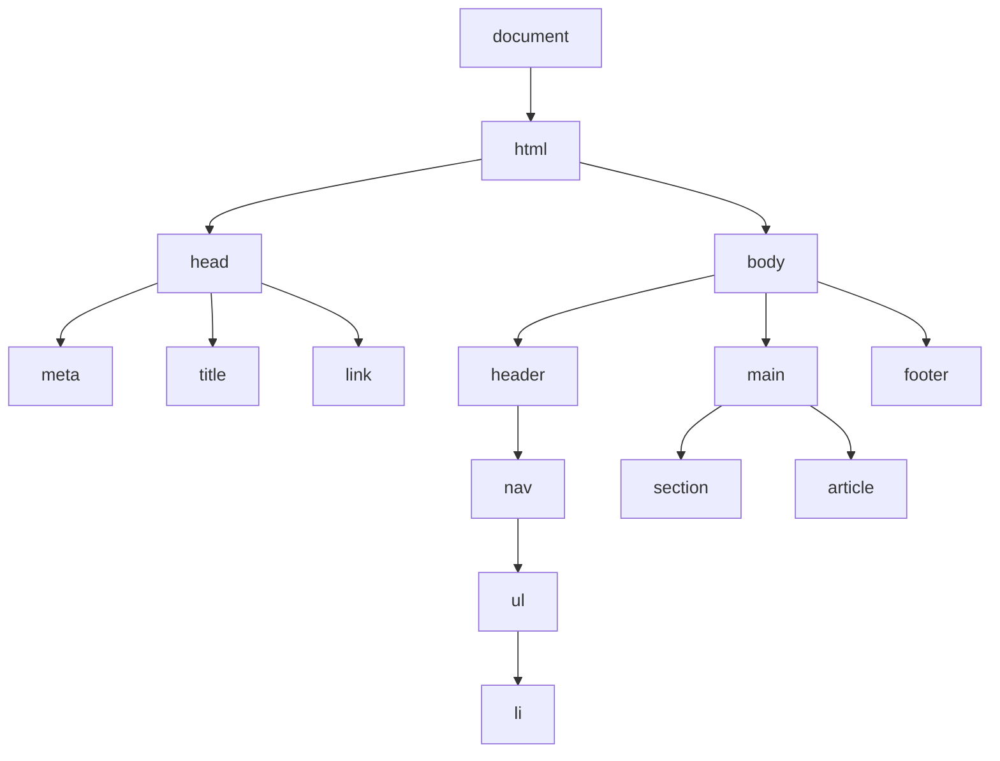
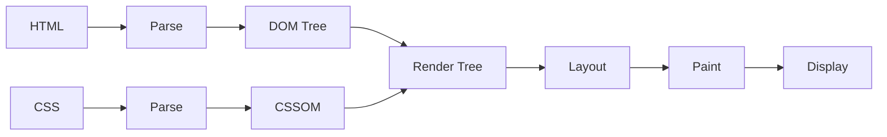
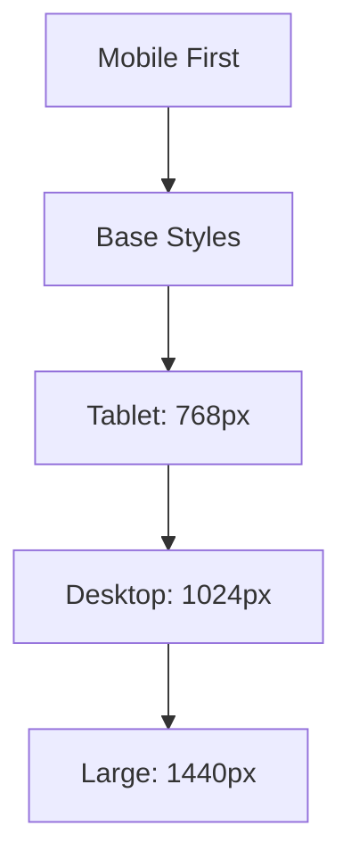

# 📱 Clase 01: HTML, CSS y Fundamentos del DOM

**Duración:** 4 horas  
**Objetivo:** Dominar HTML5 semántico, CSS3 moderno y entender la estructura del DOM  
**Proyecto:** Página de inicio para sistema de eventos

---

## 📚 Contenido

### 1. HTML5 Semántico y Accesibilidad

HTML5 proporciona etiquetas semánticas que describen el contenido, mejorando accesibilidad y SEO.

**Etiquetas semánticas principales:**

```html
<!DOCTYPE html>
<html lang="es">
<head>
    <meta charset="UTF-8">
    <meta name="viewport" content="width=device-width, initial-scale=1.0">
    <meta name="description" content="Sistema de eventos online">
    <title>TuFiesta - Eventos Online</title>
    <link rel="stylesheet" href="styles.css">
</head>
<body>
    <!-- Header: Encabezado principal -->
    <header role="banner">
        <nav role="navigation" aria-label="Navegación principal">
            <ul>
                <li><a href="#inicio">Inicio</a></li>
                <li><a href="#eventos">Eventos</a></li>
                <li><a href="#contacto">Contacto</a></li>
            </ul>
        </nav>
    </header>

    <!-- Main: Contenido principal -->
    <main role="main">
        <!-- Section: Secciones temáticas -->
        <section id="inicio" aria-labelledby="titulo-inicio">
            <h1 id="titulo-inicio">Bienvenido a TuFiesta</h1>
            <p>Descubre los mejores eventos cerca de ti</p>
        </section>

        <!-- Article: Contenido independiente -->
        <article>
            <header>
                <h2>Evento Destacado</h2>
                <time datetime="2024-12-25">25 de Diciembre</time>
            </header>
            <p>Descripción del evento...</p>
            <footer>
                <p>Organizado por: <address>contacto@tufiesta.uy</address></p>
            </footer>
        </article>

        <!-- Aside: Contenido relacionado -->
        <aside role="complementary" aria-label="Barra lateral">
            <h3>Próximos Eventos</h3>
            <ul>
                <li>Evento 1</li>
                <li>Evento 2</li>
            </ul>
        </aside>
    </main>

    <!-- Footer: Pie de página -->
    <footer role="contentinfo">
        <p>&copy; 2024 TuFiesta. Todos los derechos reservados.</p>
    </footer>
</body>
</html>
```

**Atributos de accesibilidad:**
- `lang="es"` - Idioma del documento
- `role="banner"` - Define rol semántico
- `aria-label` - Etiqueta para lectores de pantalla
- `aria-labelledby` - Vincula a elemento que describe
- `alt` - Texto alternativo para imágenes

### 2. CSS3 Moderno - Flexbox y Grid

```css
/* Reset y variables */
* {
    margin: 0;
    padding: 0;
    box-sizing: border-box;
}

:root {
    --color-primary: #6366f1;
    --color-secondary: #ec4899;
    --color-text: #1f2937;
    --color-bg: #ffffff;
    --spacing-unit: 1rem;
    --font-family: 'Segoe UI', Tahoma, Geneva, Verdana, sans-serif;
}

body {
    font-family: var(--font-family);
    color: var(--color-text);
    background-color: var(--color-bg);
    line-height: 1.6;
}

/* Flexbox: Navegación */
header nav ul {
    display: flex;
    gap: var(--spacing-unit);
    list-style: none;
    flex-wrap: wrap;
}

header nav a {
    padding: 0.5rem 1rem;
    color: var(--color-primary);
    text-decoration: none;
    border-radius: 4px;
    transition: background-color 0.3s ease;
}

header nav a:hover,
header nav a:focus {
    background-color: var(--color-primary);
    color: white;
    outline: 2px solid var(--color-primary);
}

/* Grid: Layout principal */
body {
    display: grid;
    grid-template-columns: 1fr;
    grid-template-rows: auto 1fr auto;
    min-height: 100vh;
}

main {
    display: grid;
    grid-template-columns: 1fr 300px;
    gap: 2rem;
    padding: 2rem;
    max-width: 1200px;
    margin: 0 auto;
}

/* Mobile First: Responsive */
@media (max-width: 768px) {
    main {
        grid-template-columns: 1fr;
    }

    header nav ul {
        flex-direction: column;
    }
}

/* Contraste y accesibilidad */
a {
    color: var(--color-primary);
    text-decoration: underline;
}

a:focus {
    outline: 3px solid var(--color-secondary);
    outline-offset: 2px;
}

/* Animaciones suaves */
@media (prefers-reduced-motion: no-preference) {
    * {
        scroll-behavior: smooth;
    }
}
```

### 3. Estructura del DOM

El DOM (Document Object Model) es la representación en árbol del HTML.

```html
<!-- Estructura del DOM -->
document
└── html
    ├── head
    │   ├── meta
    │   ├── title
    │   └── link
    └── body
        ├── header
        │   └── nav
        │       └── ul
        │           ├── li
        │           ├── li
        │           └── li
        ├── main
        │   ├── section
        │   ├── article
        │   └── aside
        └── footer
```

**Navegación del DOM:**

```javascript
// Acceder a elementos
const header = document.querySelector('header');
const nav = document.querySelector('nav');
const links = document.querySelectorAll('a');

// Relaciones en el árbol
const parent = nav.parentElement;           // header
const children = nav.children;              // HTMLCollection
const firstChild = nav.firstElementChild;   // ul
const nextSibling = nav.nextElementSibling; // main

// Crear elementos
const newLink = document.createElement('a');
newLink.href = '#nuevo';
newLink.textContent = 'Nuevo';
nav.appendChild(newLink);

// Modificar atributos
newLink.setAttribute('aria-label', 'Ir a nuevo');
newLink.classList.add('active');
newLink.style.color = 'red';
```

### 4. Formularios Accesibles

```html
<form id="buscar-eventos" method="GET" action="/api/eventos">
    <!-- Label vinculado a input -->
    <div class="form-group">
        <label for="busqueda">Buscar eventos:</label>
        <input 
            id="busqueda"
            type="search"
            name="q"
            placeholder="Nombre del evento"
            aria-describedby="ayuda-busqueda"
            required
        >
        <small id="ayuda-busqueda">Escribe el nombre del evento que buscas</small>
    </div>

    <!-- Select accesible -->
    <div class="form-group">
        <label for="categoria">Categoría:</label>
        <select id="categoria" name="categoria">
            <option value="">Todas las categorías</option>
            <option value="musica">Música</option>
            <option value="deportes">Deportes</option>
            <option value="cultura">Cultura</option>
        </select>
    </div>

    <!-- Botón con aria-label -->
    <button type="submit" aria-label="Buscar eventos">
        Buscar
    </button>
</form>

<style>
    .form-group {
        margin-bottom: 1.5rem;
        display: flex;
        flex-direction: column;
    }

    label {
        font-weight: 600;
        margin-bottom: 0.5rem;
        color: var(--color-text);
    }

    input, select {
        padding: 0.75rem;
        border: 2px solid #e5e7eb;
        border-radius: 4px;
        font-size: 1rem;
        font-family: inherit;
    }

    input:focus, select:focus {
        outline: none;
        border-color: var(--color-primary);
        box-shadow: 0 0 0 3px rgba(99, 102, 241, 0.1);
    }

    small {
        color: #6b7280;
        font-size: 0.875rem;
        margin-top: 0.25rem;
    }
</style>
```

---

## 🎯 Ejercicio Práctico

### Objetivo
Crear página de inicio para sistema de eventos con HTML semántico, CSS responsive y accesibilidad.

### Paso 1: Crear estructura HTML

```html
<!-- index.html -->
<!DOCTYPE html>
<html lang="es">
<head>
    <meta charset="UTF-8">
    <meta name="viewport" content="width=device-width, initial-scale=1.0">
    <meta name="description" content="Plataforma de eventos online">
    <title>TuFiesta - Eventos Online</title>
    <link rel="stylesheet" href="styles.css">
</head>
<body>
    <header>
        <nav aria-label="Navegación principal">
            <div class="container">
                <div class="logo">TuFiesta</div>
                <ul>
                    <li><a href="#inicio">Inicio</a></li>
                    <li><a href="#eventos">Eventos</a></li>
                    <li><a href="#contacto">Contacto</a></li>
                </ul>
            </div>
        </nav>
    </header>

    <main>
        <section id="inicio" class="hero">
            <h1>Descubre los Mejores Eventos</h1>
            <p>Encuentra y compra entradas para tus eventos favoritos</p>
            <form id="buscar" method="GET">
                <input type="search" placeholder="Buscar eventos..." required>
                <button type="submit">Buscar</button>
            </form>
        </section>

        <section id="eventos" class="eventos-grid">
            <h2>Eventos Destacados</h2>
            <div class="grid">
                <article class="evento-card">
                    
                    <h3>Concierto de Rock</h3>
                    <p>25 de Diciembre - Estadio Centenario</p>
                    <button>Ver detalles</button>
                </article>
                <!-- Más eventos -->
            </div>
        </section>
    </main>

    <footer>
        <p>&copy; 2024 TuFiesta. Todos los derechos reservados.</p>
    </footer>
</body>
</html>
```

### Paso 2: Estilos CSS responsive

```css
/* styles.css */
:root {
    --primary: #6366f1;
    --secondary: #ec4899;
    --text: #1f2937;
    --bg: #ffffff;
    --border: #e5e7eb;
}

* {
    margin: 0;
    padding: 0;
    box-sizing: border-box;
}

body {
    font-family: -apple-system, BlinkMacSystemFont, 'Segoe UI', sans-serif;
    color: var(--text);
    background: var(--bg);
    line-height: 1.6;
}

.container {
    max-width: 1200px;
    margin: 0 auto;
    padding: 0 1rem;
}

/* Header */
header {
    background: white;
    border-bottom: 1px solid var(--border);
    position: sticky;
    top: 0;
    z-index: 100;
}

header nav {
    padding: 1rem 0;
}

header .container {
    display: flex;
    justify-content: space-between;
    align-items: center;
}

.logo {
    font-size: 1.5rem;
    font-weight: bold;
    color: var(--primary);
}

header ul {
    display: flex;
    list-style: none;
    gap: 2rem;
}

header a {
    color: var(--text);
    text-decoration: none;
    padding: 0.5rem 1rem;
    border-radius: 4px;
    transition: all 0.3s;
}

header a:hover,
header a:focus {
    background: var(--primary);
    color: white;
    outline: 2px solid var(--primary);
}

/* Hero */
.hero {
    background: linear-gradient(135deg, var(--primary), var(--secondary));
    color: white;
    padding: 4rem 1rem;
    text-align: center;
}

.hero h1 {
    font-size: 2.5rem;
    margin-bottom: 1rem;
}

.hero p {
    font-size: 1.25rem;
    margin-bottom: 2rem;
}

#buscar {
    display: flex;
    gap: 0.5rem;
    max-width: 500px;
    margin: 0 auto;
}

#buscar input {
    flex: 1;
    padding: 0.75rem;
    border: none;
    border-radius: 4px;
    font-size: 1rem;
}

#buscar button {
    padding: 0.75rem 2rem;
    background: white;
    color: var(--primary);
    border: none;
    border-radius: 4px;
    font-weight: 600;
    cursor: pointer;
    transition: all 0.3s;
}

#buscar button:hover,
#buscar button:focus {
    transform: translateY(-2px);
    box-shadow: 0 4px 12px rgba(0, 0, 0, 0.15);
}

/* Grid de eventos */
.eventos-grid {
    padding: 4rem 1rem;
}

.eventos-grid h2 {
    font-size: 2rem;
    margin-bottom: 2rem;
    text-align: center;
}

.grid {
    display: grid;
    grid-template-columns: repeat(auto-fill, minmax(280px, 1fr));
    gap: 2rem;
    max-width: 1200px;
    margin: 0 auto;
}

.evento-card {
    border: 1px solid var(--border);
    border-radius: 8px;
    overflow: hidden;
    transition: all 0.3s;
}

.evento-card:hover {
    box-shadow: 0 10px 25px rgba(0, 0, 0, 0.1);
    transform: translateY(-4px);
}

.evento-card img {
    width: 100%;
    height: 200px;
    object-fit: cover;
}

.evento-card h3 {
    padding: 1rem 1rem 0.5rem;
    font-size: 1.25rem;
}

.evento-card p {
    padding: 0 1rem;
    color: #6b7280;
    font-size: 0.875rem;
}

.evento-card button {
    width: calc(100% - 2rem);
    margin: 1rem;
    padding: 0.75rem;
    background: var(--primary);
    color: white;
    border: none;
    border-radius: 4px;
    cursor: pointer;
    font-weight: 600;
    transition: all 0.3s;
}

.evento-card button:hover,
.evento-card button:focus {
    background: var(--secondary);
    outline: 2px solid var(--secondary);
}

/* Footer */
footer {
    background: #1f2937;
    color: white;
    text-align: center;
    padding: 2rem;
    margin-top: 4rem;
}

/* Mobile First */
@media (max-width: 768px) {
    .hero h1 {
        font-size: 1.75rem;
    }

    header ul {
        gap: 1rem;
    }

    #buscar {
        flex-direction: column;
    }

    .grid {
        grid-template-columns: 1fr;
    }
}

/* Accesibilidad */
@media (prefers-reduced-motion: reduce) {
    * {
        animation-duration: 0.01ms !important;
        animation-iteration-count: 1 !important;
        transition-duration: 0.01ms !important;
    }
}

/* Contraste alto */
@media (prefers-contrast: more) {
    :root {
        --primary: #0000ff;
        --secondary: #ff0000;
        --text: #000000;
    }
}
```

### Paso 3: Verificar accesibilidad

```bash
# Instalar herramienta de accesibilidad
npm install -g axe-core

# Verificar en navegador: F12 > Lighthouse > Accessibility
```

---

## 📊 Diagramas

### Estructura del DOM



### Flujo de Renderizado



### Responsive Design



---

## 📝 Resumen

- ✅ HTML5 semántico con etiquetas correctas
- ✅ CSS3 con Flexbox y Grid
- ✅ Accesibilidad WCAG 2.1 AA
- ✅ Mobile first responsive
- ✅ Formularios accesibles
- ✅ Navegación por teclado

---

## 🎓 Preguntas de Repaso

**P1:** ¿Cuál es la diferencia entre `<div>` y `<section>`?  
**R1:** `<section>` es semántica y agrupa contenido relacionado; `<div>` es genérico sin significado.

**P2:** ¿Por qué usar `aria-label` si tenemos texto visible?  
**R2:** Para lectores de pantalla que necesitan contexto adicional o cuando el texto no es suficiente.

**P3:** ¿Cómo hacer un sitio accesible por teclado?  
**R3:** Usar `:focus` en CSS, `tabindex` en HTML, y asegurar orden lógico de navegación.

**P4:** ¿Qué es mobile first?  
**R4:** Diseñar primero para móvil, luego agregar estilos para pantallas más grandes con media queries.

**P5:** ¿Cómo verificar contraste de colores?  
**R5:** Usar herramientas como WebAIM Contrast Checker o Lighthouse en DevTools.

---

## 🚀 Próxima Clase

**Clase 02: JavaScript Moderno y Manipulación del DOM**

Dominar JavaScript ES6+, eventos, y manipulación dinámica del DOM.

---

**Última actualización:** 2024  
**Tiempo estimado:** 4 horas  
**Complejidad:** ⭐ (Principiante)
